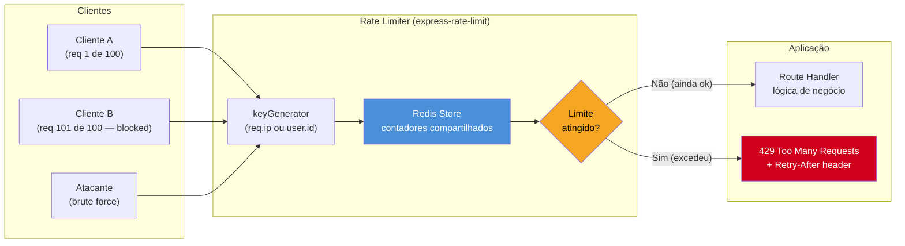

# Rate limiting com express-rate-limit

> [!abstract] TL;DR
> Rate limiting é uma camada de defesa essencial que protege APIs contra DoS, brute force, credential stuffing e abuso de recursos — limitando quantas requisições um cliente pode fazer em uma janela de tempo. `express-rate-limit` v7 é o padrão para Express, com opções de `windowMs`, `max`/`limit`, headers RFC 6585 via `standardHeaders: 'draft-7'` e `keyGenerator` customizável para limitar por usuário em vez de IP. Em ambientes distribuídos (múltiplas instâncias, cluster), o store em memória não funciona: use `rate-limit-redis` com `ioredis` como store compartilhado. Fastify tem `@fastify/rate-limit` com interface equivalente. A combinação certa é: limites diferentes por rota (auth mais restrito, API pública mais generoso), store Redis em produção e `trust proxy` configurado corretamente atrás de load balancer.

## Arquitetura de rate limiting



## O que é

Rate limiting é o controle de quantas requisições uma fonte (IP, usuário, chave de API) pode fazer para um endpoint em um intervalo de tempo. É uma medida de segurança e resiliência — não apenas performance.

### Por que é segurança

Sem rate limiting, sua API está vulnerável a:

- **DoS / DDoS**: um cliente envia milhares de requisições por segundo, esgotando recursos (CPU, conexões ao banco, memória)
- **Brute force**: atacante testa senhas em `/login` em velocidade alta sem ser bloqueado
- **Credential stuffing**: combinações de usuário/senha vazadas de outros serviços são testadas em massa
- **API abuse**: scraping, extração massiva de dados, uso acima do plano contratado
- **Amplification attacks**: endpoints que retornam muito dado por pouca entrada (ex: search sem paginação)

Rate limiting não elimina esses ataques, mas torna seu custo alto o suficiente para que a maioria dos atacantes desista ou seja detectada antes de causar dano real.

### Rate limit vs throttling

| Conceito | Comportamento | Resposta ao cliente |
|----------|--------------|---------------------|
| **Rate limiting** | Bloqueia requisições que excedem o limite | `429 Too Many Requests` imediato |
| **Throttling** | Atrasa/enfileira requisições, processa mais devagar | `200 OK` com latência aumentada |

Na prática, rate limiting é mais comum em APIs públicas (rejeição rápida, previsível). Throttling é usado em pipelines internos onde perder a requisição seria pior do que atrasá-la.

## Como funciona

### Algoritmos de rate limiting

Existem cinco algoritmos principais para contar e controlar requisições. A escolha afeta granularidade, overhead e comportamento em burst:

| Algoritmo | Como funciona | Granularidade | Overhead | Comportamento em burst |
|-----------|--------------|---------------|----------|------------------------|
| **Fixed Window** | Conta requisições em janelas fixas (ex: 0–60s, 60–120s) | Baixa | Mínimo | Permite burst duplo na virada da janela |
| **Sliding Window Log** | Armazena timestamp de cada requisição; descarta as antigas | Alta | Alto (memória por req) | Preciso, sem burst |
| **Sliding Window Counter** | Interpola entre janelas fixas adjacentes | Média | Baixo | Aproximado, sem burst brusco |
| **Token Bucket** | Bucket com capacidade N; tokens regeneram à taxa R/s; req consome 1 token | Alta | Médio | Permite burst até N, depois estável |
| **Leaky Bucket** | Fila de saída a taxa constante; req extra descartada ou enfileirada | Alta | Médio | Saída suavizada, sem burst |

**Fixed window** é o mais simples e o padrão do `express-rate-limit`. O problema clássico: com limite de 100 req/min, um cliente pode enviar 100 req em 00:59 e mais 100 req em 01:00 — 200 requisições em 2 segundos — sem violar a regra tecnicamente.

**Sliding window counter** corrige isso com custo de armazenamento muito menor que o sliding window log. `express-rate-limit` com Redis store implementa sliding window counter quando configurado corretamente.

**Token bucket** é ideal quando você quer permitir bursts legítimos (ex: um usuário que ficou offline e tem requisições acumuladas) mas controlar a taxa média de longo prazo.

### express-rate-limit v7

Configuração básica com os parâmetros canônicos da v7:

```typescript
import rateLimit from 'express-rate-limit'
import express from 'express'

const app = express()

// Limite global: 100 requisições por 15 minutos por IP
const globalLimiter = rateLimit({
  windowMs: 15 * 60 * 1000, // 15 minutos em ms
  limit: 100,               // máximo de requisições por janela (alias: max)
  message: {
    error: 'Too many requests, please try again later.',
    retryAfter: '15 minutes',
  },
  standardHeaders: 'draft-7', // envia header RateLimit combinado (RFC 6585 draft-7)
  legacyHeaders: false,       // suprime X-RateLimit-* antigos
})

app.use(globalLimiter)
```

`keyGenerator` customizado para limitar por usuário autenticado em vez de IP (evita penalizar usuários atrás do mesmo NAT):

```typescript
import rateLimit from 'express-rate-limit'
import { Request } from 'express'

const userAwareLimiter = rateLimit({
  windowMs: 60 * 1000, // 1 minuto
  limit: 60,
  standardHeaders: 'draft-7',
  legacyHeaders: false,
  // Usa ID do usuário autenticado se disponível; cai para IP como fallback
  keyGenerator: (req: Request): string => {
    const userId = (req as any).user?.id
    return userId ? `user:${userId}` : req.ip ?? 'unknown'
  },
  message: { error: 'Rate limit exceeded. Slow down.' },
})
```

> [!tip] `max` vs `limit`
> Na v7, `limit` é o nome canônico da opção (equivalente ao `max` das versões anteriores). `max` ainda funciona como alias para retrocompatibilidade, mas prefira `limit` em código novo.

### Store distribuído com Redis

O store padrão do `express-rate-limit` é **em memória** — cada processo Node.js mantém seus próprios contadores. Em produção com múltiplas instâncias ou cluster, cada instância tem contadores independentes: um cliente pode fazer `limit * N` requisições distribuindo entre N instâncias sem ser bloqueado.

**Solução**: store Redis compartilhado com `rate-limit-redis` + `ioredis`.

```typescript
import rateLimit from 'express-rate-limit'
import { RedisStore } from 'rate-limit-redis'
import Redis from 'ioredis'

// Cliente Redis compartilhado — reutilize o cliente existente da aplicação
const redisClient = new Redis({
  host: process.env.REDIS_HOST ?? 'localhost',
  port: Number(process.env.REDIS_PORT ?? 6379),
  password: process.env.REDIS_PASSWORD,
  tls: process.env.NODE_ENV === 'production' ? {} : undefined,
})

const distributedLimiter = rateLimit({
  windowMs: 15 * 60 * 1000,
  limit: 100,
  standardHeaders: 'draft-7',
  legacyHeaders: false,
  // RedisStore usa sendCommand para compatibilidade com qualquer cliente Redis
  store: new RedisStore({
    sendCommand: (...args: string[]) => redisClient.call(...args),
    prefix: 'rl:', // prefixo das chaves no Redis (evita colisão com outros dados)
  }),
  message: { error: 'Too many requests. Try again later.' },
})

export { distributedLimiter }
```

As chaves no Redis ficam no formato `rl:<keyGenerator result>` e expiram automaticamente no fim da janela. O overhead por requisição é uma chamada Redis (`INCRBY` + `EXPIRE` ou `GET`), que normalmente leva <1ms em rede local.

### Rate limiting por rota

Aplicar o mesmo limite em todos os endpoints é quase sempre errado. Endpoints de autenticação precisam de limites muito mais restritos do que endpoints de leitura pública:

```typescript
import rateLimit from 'express-rate-limit'
import { RedisStore } from 'rate-limit-redis'
import Redis from 'ioredis'
import express from 'express'

const redis = new Redis({ host: process.env.REDIS_HOST ?? 'localhost' })

const makeStore = (prefix: string) =>
  new RedisStore({
    sendCommand: (...args: string[]) => redis.call(...args),
    prefix,
  })

// Auth endpoints: muito restritivo — 5 tentativas por minuto por IP
const authLimiter = rateLimit({
  windowMs: 60 * 1000,
  limit: 5,
  standardHeaders: 'draft-7',
  legacyHeaders: false,
  store: makeStore('rl:auth:'),
  message: { error: 'Too many login attempts. Try again in 1 minute.' },
})

// API pública: generoso — 100 req por 15 minutos
const publicApiLimiter = rateLimit({
  windowMs: 15 * 60 * 1000,
  limit: 100,
  standardHeaders: 'draft-7',
  legacyHeaders: false,
  store: makeStore('rl:public:'),
  message: { error: 'Rate limit exceeded.' },
})

// Área admin: 200 req por 15 minutos (usuários internos, tráfego legítimo maior)
const adminLimiter = rateLimit({
  windowMs: 15 * 60 * 1000,
  limit: 200,
  standardHeaders: 'draft-7',
  legacyHeaders: false,
  store: makeStore('rl:admin:'),
  keyGenerator: (req) => (req as any).user?.id ?? req.ip ?? 'unknown',
  message: { error: 'Admin rate limit exceeded.' },
})

const app = express()

// Aplica limiters seletivamente por rota — não globalmente
app.post('/auth/login', authLimiter, loginHandler)
app.post('/auth/register', authLimiter, registerHandler)
app.post('/auth/forgot-password', authLimiter, forgotPasswordHandler)

app.get('/api/products', publicApiLimiter, getProductsHandler)
app.get('/api/search', publicApiLimiter, searchHandler)

app.use('/admin', adminLimiter, adminRouter)
```

### Headers de rate limit

Quando um limite é atingido (ou se aproxima), o servidor deve informar o cliente quando pode tentar novamente. Os headers padrão são definidos pela RFC 6585 e pelo draft de padronização do IETF:

| Header | Descrição | Exemplo |
|--------|-----------|---------|
| `RateLimit-Limit` | Máximo de requisições permitidas na janela | `100` |
| `RateLimit-Remaining` | Requisições restantes na janela atual | `43` |
| `RateLimit-Reset` | Timestamp Unix (segundos) de quando a janela reseta | `1715601600` |
| `Retry-After` | Segundos até poder tentar novamente (enviado no 429) | `47` |

**`standardHeaders: 'draft-7'`** envia um único header `RateLimit` combinado (formato draft-7 do IETF HTTP RateLimit Headers):

```
RateLimit: limit=100, remaining=43, reset=47
```

**`legacyHeaders: false`** suprime os headers antigos `X-RateLimit-Limit`, `X-RateLimit-Remaining` e `X-RateLimit-Reset` — que não são padronizados e variavam entre implementações. Use `false` em APIs novas.

O `429 Too Many Requests` com `Retry-After` permite que clientes bem implementados respeitem o backoff automaticamente sem precisar de lógica de parsing complexa.

### Rate limiting em Fastify

Fastify usa `@fastify/rate-limit` com interface similar mas integrada ao sistema de plugins do framework:

```typescript
import Fastify from 'fastify'
import rateLimit from '@fastify/rate-limit'
import Redis from 'ioredis'

const fastify = Fastify({ logger: true })

const redis = new Redis({ host: process.env.REDIS_HOST ?? 'localhost' })

// Registra o plugin globalmente — aplica a todas as rotas por padrão
await fastify.register(rateLimit, {
  max: 100,
  timeWindow: '1 minute',
  redis,                // ioredis client diretamente (sem RedisStore wrapper)
  addHeaders: {
    'x-ratelimit-limit': false,      // suprime header legado
    'x-ratelimit-remaining': false,
    'x-ratelimit-reset': false,
    'retry-after': true,             // mantém Retry-After no 429
  },
  errorResponseBuilder: (_req, context) => ({
    statusCode: 429,
    error: 'Too Many Requests',
    message: `Rate limit exceeded. Retry in ${context.after}.`,
  }),
})

// Override por rota — auth endpoint com limite mais restritivo
fastify.post(
  '/auth/login',
  {
    config: {
      rateLimit: {
        max: 5,
        timeWindow: '1 minute',
      },
    },
  },
  async (request, reply) => {
    // handler de login
  }
)

await fastify.listen({ port: 3000 })
```

> [!tip] Redis em @fastify/rate-limit
> `@fastify/rate-limit` aceita o cliente `ioredis` diretamente via opção `redis` — sem necessidade de um wrapper como `RedisStore`. A API é mais simples que a do `express-rate-limit`.

## Casos práticos

**Cenário 1 — Proteção de endpoint de login contra brute force**

Uma API de autenticação sem rate limiting recebe 10.000 tentativas de senha por minuto via credential stuffing — as credenciais foram obtidas num vazamento de outro serviço. Com `authLimiter` configurado com `limit: 5, windowMs: 60 * 1000` aplicado somente em `POST /auth/login`, o quinto request de um mesmo IP recebe 429 com `Retry-After: 60`. Um atacante levaria 2 minutos para testar 10 combinações em vez de milissegundos — o custo do ataque sobe ao ponto de inviabilidade. Para atacantes que rodam o ataque de múltiplos IPs, o `keyGenerator` por `userId` (quando conhecido) mitiga: mesmo mudando de IP, o mesmo usuário-alvo está protegido.

**Cenário 2 — Rate limit distribuído em deploy Kubernetes com 5 réplicas**

Uma API Express roda com 5 pods Kubernetes. O rate limit em memória (padrão) permite que um cliente faça `limit * 5` requisições, dividindo entre os pods — o load balancer distribui as requests. Após migrar para `rate-limit-redis` com o Redis do cluster, todos os pods compartilham os contadores: a primeira vez que qualquer pod vê a chave `rl:user:123`, incrementa o contador no Redis e retorna o total acumulado. O quinto pod a processar a request do usuário vê o contador no Redis e aplica a mesma lógica. O overhead adicionado é ~0.5ms por requisição (round-trip Redis em rede interna), imperceptível comparado com queries de banco de dados.

## Armadilhas comuns

> [!warning] Store em memória não funciona em múltiplas instâncias
> O store padrão do `express-rate-limit` é em memória: cada processo Node.js mantém contadores independentes. Em um deploy com 4 instâncias e limite de 100 req/min, um cliente pode fazer até 400 requisições distribuindo entre as instâncias — sem ser bloqueado. Isso invalida completamente o rate limiting em produção com mais de uma instância, PM2 cluster mode, containers orquestrados por Kubernetes ou qualquer setup com load balancer.
>
> **Solução**: sempre use `rate-limit-redis` com um cliente `ioredis` apontando para o mesmo servidor Redis em produção. O store em memória só é aceitável em desenvolvimento local com uma única instância.

> [!warning] X-Forwarded-For pode ser manipulado atrás de proxy reverso
> Por padrão, Express usa `req.ip` como chave, que vem de `req.socket.remoteAddress`. Atrás de um proxy reverso (nginx, AWS ALB, Cloudflare), o IP real do cliente chega no header `X-Forwarded-For`. Sem `app.set('trust proxy', 1)`, `req.ip` é o IP do proxy — e **todos os clientes compartilham o mesmo limite**.
>
> Com `trust proxy` habilitado, `req.ip` usa o primeiro valor de `X-Forwarded-For`. Mas um atacante pode forjar esse header adicionando um IP arbitrário: `X-Forwarded-For: 1.2.3.4` — fazendo o rate limiter acreditar que a requisição vem de um IP diferente a cada vez.
>
> **Solução correta**:
> 1. Configure `app.set('trust proxy', 1)` quando tiver exatamente um proxy na frente
> 2. Use `app.set('trust proxy', 'loopback, linklocal, uniquelocal')` para especificar IPs confiáveis
> 3. Para segurança máxima, use um `keyGenerator` que leia um header injetado pelo seu proxy reverso (e que não pode ser sobreescrito pelo cliente), como `CF-Connecting-IP` no Cloudflare ou um header customizado do nginx

> [!warning] Rate limit global em vez de granular por rota penaliza usuários legítimos
> Aplicar um único limite global (ex: 100 req/15min) ignora que padrões de uso são muito diferentes por endpoint. Um usuário que carrega um dashboard com 50 chamadas simultâneas pode ser bloqueado mesmo sendo um usuário legítimo. Endpoints de autenticação precisam de limites muito mais restritivos (5–10 req/min) do que endpoints de leitura (100–500 req/min).
>
> **Solução**: defina limiters separados por grupo de endpoints. No mínimo: um limiter para auth endpoints (restritivo), um para API pública (moderado) e um para operações admin (mais generoso, com `keyGenerator` por usuário).

## Em entrevista

**Q: What is rate limiting and how does it protect an API?**

A: Rate limiting controls how many requests a client can make to an endpoint within a time window. It protects against several attack vectors: DoS attacks where a single client exhausts server resources, brute force attacks on authentication endpoints, credential stuffing — where stolen credentials from other breaches are tested en masse — and API abuse like scraping. When the limit is exceeded, the server returns a `429 Too Many Requests` response with a `Retry-After` header so well-behaved clients can back off. The key insight is that rate limiting doesn't need to stop 100% of attacks — it just needs to make attacks expensive enough that most attackers move on.

**Q: What is the difference between fixed window and sliding window algorithms, and when would you choose each?**

A: Fixed window divides time into discrete buckets — for example, 0–60 seconds, 60–120 seconds — and counts requests per bucket. It's simple and fast, but has a classic edge case: a client can send the full limit at the end of one window and the full limit at the start of the next, effectively doubling the allowed burst in a two-second period. Sliding window log fixes this by storing a timestamp for every request and discarding those older than the window, but at the cost of high memory usage. Sliding window counter is a middle ground — it approximates the sliding window by interpolating between two adjacent fixed windows, which gives near-precise rate counting with minimal storage overhead. I'd choose fixed window when simplicity is the priority and the burst edge case is acceptable; sliding window counter when I need more precision without the memory cost of the full log; and token bucket when I want to allow controlled bursts — for example, a mobile app that queues requests while offline.

**Q: How do you implement distributed rate limiting across multiple Node.js instances?**

A: The default in-memory store doesn't work in multi-instance deployments because each process has independent counters — a client can bypass the limit by distributing requests across instances. The solution is a shared Redis store. With `express-rate-limit` v7, you use `rate-limit-redis` and pass a `sendCommand` function wrapping your `ioredis` client. Redis uses atomic operations — typically `INCRBY` and `EXPIRE` — so there are no race conditions between instances. The keys expire automatically at the end of the window, so there's no cleanup needed. The overhead is roughly one Redis round-trip per request, usually under 1ms on a local network, which is negligible compared to database queries. In Fastify, `@fastify/rate-limit` accepts the `ioredis` client directly without the wrapper layer.

## O que vem a seguir

- [[03-Dominios/Tecnologia/Node/Segurança/08 - Helmet.js e hardening HTTP|Helmet.js e hardening HTTP]] — hardening de headers HTTP via Helmet; complementa rate limiting com proteções de Content Security Policy, HSTS e outras
- [[03-Dominios/Tecnologia/Node/Segurança/09 - OWASP Top 10 para Node|OWASP Top 10 para Node]] — Unrestricted Resource Consumption (A05:2021) contextualiza rate limiting no panorama geral de ameaças
- [[03-Dominios/Tecnologia/Node/Segurança/04 - JWT e autenticação com jsonwebtoken|JWT e autenticação com jsonwebtoken]] — os endpoints de renovação de refresh token são candidatos prioritários para rate limiting restritivo

## Vocabulário

| Termo | Definição |
|-------|-----------|
| **rate limiting** | Controle do número máximo de requisições que uma fonte pode fazer a um endpoint em uma janela de tempo; retorna `429` quando excedido |
| **fixed window** | Algoritmo de rate limiting que divide o tempo em janelas fixas e contabiliza requisições por janela; simples, mas vulnerável ao burst na virada de janela |
| **sliding window** | Algoritmo que avalia o histórico de requisições em uma janela deslizante centrada no momento atual, sem o edge case de burst do fixed window |
| **token bucket** | Algoritmo onde um bucket acumula tokens até um máximo (burst capacity) e cada requisição consome um token; permite burst controlado com taxa média estável |
| **throttling** | Estratégia de controle de carga que atrasa ou enfileira requisições em excesso em vez de rejeitá-las imediatamente; contrasta com rate limiting (rejeição) |
| **DoS** | Denial of Service — ataque que visa esgotar recursos de um servidor (CPU, memória, conexões) com volume de requisições, tornando-o indisponível |
| **store** | Componente responsável por armazenar e atualizar os contadores de requisições do rate limiter; pode ser in-memory (padrão, instância única) ou Redis (distribuído) |
| **keyGenerator** | Função que determina a identidade do cliente para fins de rate limiting; por padrão usa `req.ip`, mas pode ser customizada para usar ID de usuário, chave de API ou qualquer campo da requisição |
| **credential stuffing** | Ataque onde combinações de usuário/senha obtidas em vazamentos de outros serviços são testadas em massa contra um sistema, aproveitando que usuários reutilizam senhas |
| **X-Forwarded-For** | Header HTTP adicionado por proxies reversos com o IP original do cliente; pode ser manipulado por atacantes se `trust proxy` não for configurado corretamente no Express |

## Fontes

- [express-rate-limit — npm](https://www.npmjs.com/package/express-rate-limit) — documentação oficial com todas as opções da v7, incluindo `standardHeaders` e `keyGenerator`
- [rate-limit-redis — GitHub](https://github.com/express-rate-limit/rate-limit-redis) — store Redis oficial para express-rate-limit; usa `sendCommand` com qualquer cliente Redis
- [RFC 6585 — Additional HTTP Status Codes](https://www.rfc-editor.org/rfc/rfc6585) — define o status `429 Too Many Requests` e o header `Retry-After`
- [@fastify/rate-limit — GitHub](https://github.com/fastify/fastify-rate-limit) — plugin oficial de rate limiting para Fastify com aceite nativo de cliente `ioredis`
- [OWASP — Rate Limiting Best Practices](https://owasp.org/www-community/controls/Blocking_Brute_Force_Attacks) — guia de proteção contra brute force e credential stuffing

## Veja também

- [[03-Dominios/Tecnologia/Node/Segurança/index|Segurança]] — MOC do galho 8, visão geral de todos os tópicos de segurança Node
- [[03-Dominios/Tecnologia/Node/Node.js|Node.js]] — tronco da trilha Node Senior
