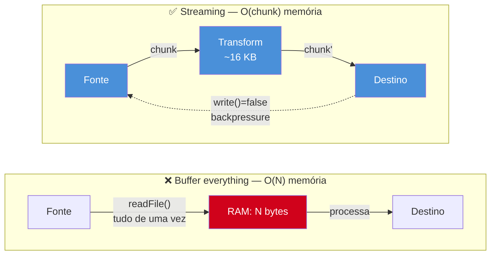

# Por que streams

> [!abstract] TL;DR
> Streams são a abstração do Node para processar dados em chunks sem carregar tudo em memória. Use quando o payload é grande (>100 MB), o throughput é sustentado, ou backpressure precisa ser respeitado. Alternativas mais simples (buffer everything, paginação) ganham em casos pequenos; streams ganham em casos grandes ou de longa duração.

---

## O que é

Um stream é uma sequência de chunks que pode ser produzida ou consumida incrementalmente — sem materializar o conjunto completo de dados de uma só vez.

A metáfora útil: ler um livro página a página em vez de memorizá-lo inteiro antes de começar. O conteúdo existe em ordem, mas apenas uma parte precisa estar "em mãos" a qualquer momento.

Node.js expõe quatro tipos de stream nativos (detalhados na nota 02):

| Tipo | Papel | Exemplo |
|---|---|---|
| **Readable** | Fonte de dados — produz chunks | `fs.createReadStream`, `req` HTTP |
| **Writable** | Destino de dados — consome chunks | `fs.createWriteStream`, `res` HTTP |
| **Duplex** | Lê e escreve de forma independente | `net.Socket`, conexão TCP |
| **Transform** | Lê, transforma, e escreve | `zlib.createGzip`, `crypto.createCipheriv` |

A diferença fundamental em relação a um array completo:

| Dimensão | Array / Buffer completo | Stream |
|---|---|---|
| Uso de memória | O(N) — cresce com os dados | O(chunkSize) — constante |
| Primeiro output | Após carregar tudo | Após receber o primeiro chunk |
| Composição | Encadeia operações sobre coleções | Encadeia transformações sobre o fluxo |
| Backpressure | Inexistente | Nativo — produtor pode ser pausado |

---

## Por que importa

O problema concreto surge em três cenários frequentes em servidores de produção.

**Upload ou download de arquivos grandes.** Um endpoint que recebe um arquivo de 5 GB e faz `const data = await readFile(path)` antes de processar precisa de pelo menos 5 GB de heap disponível — por requisição. Com 3 requisições simultâneas, são 15 GB. A heap do processo Node tem limite configurável, mas nenhum servidor sobrevive a esse padrão sob carga.

**Pipelines de transformação de dados.** Um job que processa um CSV de 2 milhões de linhas: se a lógica carrega todas as linhas antes de começar a processar, a latência do primeiro output é proporcional ao tamanho total do arquivo. Com streaming, o primeiro registro pode ser escrito na saída antes que 1% do arquivo seja lido.

**Streaming de respostas longas.** Respostas SSE (Server-Sent Events) e respostas de LLMs chegam em partes ao longo de segundos. Se o servidor faz buffer da resposta completa antes de repassar ao cliente, o usuário espera sem ver progresso — a UX quebra. Com streaming, cada chunk é encaminhado assim que chega.

O event loop é o elo de ligação aqui. Como visto em [[10 - Bloqueio do event loop - sintomas e causas]], carregar um payload gigante com `JSON.parse` ou `readFileSync` é uma das causas canônicas de bloqueio da thread JavaScript. Streams evitam esse bloqueio ao não forçar a materialização completa dos dados na thread principal.

O ponto sutil: o problema não é apenas memória — é a **combinação de memória e thread**. Um `readFile` de 500 MB bloqueia porque:
1. Reserva 500 MB de heap de uma vez
2. A desserialização subsequente (`JSON.parse` de payload grande) bloqueia a thread JS por centenas de milissegundos

Com stream, cada chunk chega de forma assíncrona, é processado, e é descartado. A thread JS nunca segura mais do que um chunk de cada vez.

---

## Como funciona

### Buffer everything vs. stream — comparação direta

**Abordagem buffer everything:**

```javascript
import { readFile, writeFile } from 'node:fs/promises';
import { parse } from 'csv-parse/sync';

// ❌ Carrega o arquivo inteiro antes de processar qualquer linha
const raw = await readFile('registros.csv');          // O(N) memória
const rows = parse(raw, { columns: true });           // O(N) memória adicional
const result = rows.map(transformarRegistro);         // O(N) memória adicional
await writeFile('saida.json', JSON.stringify(result));// O(N) memória adicional

// Pico de memória: aproximadamente 4× o tamanho do CSV
```

**Abordagem stream:**

```javascript
import { createReadStream, createWriteStream } from 'node:fs';
import { pipeline } from 'node:stream/promises';
import { parse } from 'csv-parse';
import { stringify } from 'ndjson';

// ✅ Processa chunk a chunk — memória constante independente do tamanho
await pipeline(
  createReadStream('registros.csv'),
  parse({ columns: true }),
  new Transform({
    objectMode: true,
    transform(row, _enc, cb) { cb(null, transformarRegistro(row)); },
  }),
  stringify(),
  createWriteStream('saida.ndjson'),
);

// Pico de memória: O(chunkSize) — independente do tamanho total do arquivo
```

O crescimento de memória com buffer everything é linear no tamanho dos dados. Com stream, o buffer interno tem tamanho fixo (controlado por `highWaterMark`). A função `pipeline` da `node:stream/promises` também cuida de propagação de erros e cleanup automático — mais sobre isso na nota 07.

### Diagrama: buffer everything vs. streaming



### Backpressure — o mecanismo que controla o fluxo

Backpressure é o mecanismo pelo qual um consumidor lento sinaliza ao produtor para reduzir a velocidade. Sem backpressure, um produtor rápido (leitura de disco em NVMe) conectado a um consumidor lento (escrita em rede com latência alta) encheria o buffer interno até o heap explodir.

```javascript
// Sem backpressure — produtor ignora a pressão do consumidor
const readable = createReadStream('grande.bin');
const writable = createWriteStream('/dev/null');

readable.on('data', (chunk) => {
  // ❌ Se writable.write() retornar false (buffer cheio), ignoramos
  writable.write(chunk);
});

// Com backpressure respeitado — via pipeline (forma correta)
await pipeline(
  createReadStream('grande.bin'),
  createWriteStream('/dev/null'),
);
// pipeline pausa o readable automaticamente quando o writable está cheio
```

A conexão com o galho 2 (Paralelismo) surge aqui: quando dados precisam ser transferidos entre Worker Threads via `postMessage`, a alternativa é usar `transferList` com `ArrayBuffer` para zero-copy. Quando os dados fluem entre processos ou entre rede e disco, streams são o mecanismo correto — cada um evita cópias desnecessárias em seu contexto. Ver [[04 - Comunicação entre workers - postMessage e MessageChannel]].

### highWaterMark — controlando o buffer interno

Cada stream tem um buffer interno cujo tamanho máximo é controlado por `highWaterMark`. Para streams em modo bytes (padrão), o valor é em bytes (padrão: 16 KB). Para streams em modo objeto (`objectMode: true`), o valor é em número de objetos (padrão: 16).

```javascript
import { createReadStream } from 'node:fs';

// highWaterMark de 64 KB — chunks maiores, menos chamadas de sistema
const readable = createReadStream('grande.csv', { highWaterMark: 64 * 1024 });

// Para streams de objetos (ex.: parsing de CSV linha a linha)
const { Transform } = require('node:stream');
const parser = new Transform({
  objectMode: true,
  highWaterMark: 100, // máximo de 100 objetos no buffer interno
  transform(chunk, _enc, cb) { /* ... */ cb(null, parsed); },
});
```

`highWaterMark` não é um limite rígido — é o threshold após o qual `write()` retorna `false` (sinalizando ao produtor para pausar). Aumentar `highWaterMark` melhora o throughput mas aumenta o uso de memória; diminuir reduz a memória mas pode aumentar a latência por pausas mais frequentes. Para a maioria dos casos, o valor padrão (16 KB) é adequado.

---

## Na prática

### Quando usar streams

- Arquivos ou payloads maiores que ~100 MB
- Throughput sustentado em servidor sob carga (uploads, downloads, transformações contínuas)
- Respostas cujo primeiro chunk precisa ser entregue ao cliente antes do final (SSE, LLM, progress)
- Composição de múltiplas transformações sequenciais (parse → filter → transform → serialize)
- Qualquer situação onde o tamanho total dos dados é desconhecido em tempo de execução

### Quando NÃO usar streams

| Situação | Alternativa adequada | Motivo |
|---|---|---|
| Payload < 10 MB | `readFile` + processamento síncrono | Overhead de stream > benefício; mais simples |
| Operação que precisa ver todos os dados de uma vez | Buffer completo | Sort global, dedup global, join de datasets |
| Latência ponta-a-ponta importa mais que throughput | Buffer + paginação | Stream tem latência de primeira resposta similar ao buffer |
| Uma única transformação simples sobre dados pequenos | Buffer + array methods | `.map`, `.filter`, `.reduce` são mais legíveis e suficientes |
| Dados JSON estruturados sem volume extremo | `JSON.parse` direta | O custo de parsing é desprezível abaixo de ~5 MB |

A decisão não é "streams são sempre melhores". É "streams trocam complexidade por eficiência de memória e throughput". Para datasets pequenos, a complexidade não se paga.

### Exemplo completo: upload de arquivo grande

```javascript
import { createServer } from 'node:http';
import { createWriteStream } from 'node:fs';
import { pipeline } from 'node:stream/promises';
import { createGunzip } from 'node:zlib';

// ✅ Recebe upload, descomprime, salva — sem carregar tudo em memória
createServer(async (req, res) => {
  if (req.method !== 'POST') return res.end();

  try {
    await pipeline(
      req,              // Readable: stream do body HTTP
      createGunzip(),   // Transform: descomprime gzip on-the-fly
      createWriteStream('/tmp/upload.dat'), // Writable: salva no disco
    );
    res.writeHead(200);
    res.end(JSON.stringify({ ok: true }));
  } catch (err) {
    // pipeline propaga erros e faz cleanup de todos os estágios
    res.writeHead(500);
    res.end(JSON.stringify({ error: err.message }));
  }
}).listen(3000);
```

Neste padrão, um upload de 5 GB usa apenas ~16 KB de heap por chunk — independente do tamanho total. O mesmo servidor pode lidar com múltiplos uploads simultâneos sem explodir a memória.

---

## Casos práticos

Os dois cenários a seguir mostram onde a troca de complexidade por eficiência de memória se paga em produção.

### Cenário 1 — ETL: transformação de CSV de grande volume

Uma equipe de dados precisa transformar um dump de 300 MB (1 milhão de linhas de vendas) em NDJSON filtrado para ingestão em um data warehouse. Com buffer everything, o processo exigiria ~1,2 GB de heap (CSV raw + objetos parseados + array resultado). Com streaming, o pico de memória fica em ~2 MB — independente do tamanho do arquivo.

```javascript
import { createReadStream, createWriteStream } from 'node:fs';
import { pipeline } from 'node:stream/promises';
import { parse } from 'csv-parse';
import { Transform } from 'node:stream';
import { stringify } from 'ndjson';

// Filtra e normaliza registros de vendas — memória O(chunk) durante todo o ETL
const filtrarAtivos = new Transform({
  objectMode: true,
  transform(row, _enc, cb) {
    // Descarta inativos sem emitir nada downstream
    if (row.status !== 'ativo') return cb();
    cb(null, {
      id: row.id,
      nome: row.nome.trim(),
      totalVendas: Number(row.total_vendas),
      processadoEm: new Date().toISOString(),
    });
  },
});

await pipeline(
  createReadStream('./vendas-2025.csv'),         // Readable: lê chunk a chunk
  parse({ columns: true, trim: true }),           // Transform: CSV → objeto JS
  filtrarAtivos,                                  // Transform: filtra e normaliza
  stringify(),                                    // Transform: objeto → NDJSON
  createWriteStream('./vendas-ativas.ndjson'),    // Writable: persiste no disco
);

// Pico de memória: ~2 MB — mesmo resultado com 1 mil ou 10 milhões de linhas
console.log('ETL concluído');
```

O detalhe crítico: `pipeline()` garante que o `createReadStream` pause automaticamente quando o estágio de escrita está ocupado (backpressure). Sem isso, a leitura de disco em NVMe encheria os buffers intermediários enquanto a escrita tenta acompanhar — e a memória explodiria mesmo com stream.

### Cenário 2 — Proxy de resposta de LLM com SSE

Um backend que encaminha respostas de uma API de LLM ao browser. Com buffer everything, o usuário veria uma tela em branco por vários segundos até a resposta completa chegar. Com streaming, cada token aparece no browser assim que a API upstream o produz.

```javascript
import { createServer } from 'node:http';
import { Readable } from 'node:stream';

// Proxy de streaming SSE: encaminha tokens de LLM para o cliente em tempo real
createServer(async (req, res) => {
  if (req.method !== 'POST' || req.url !== '/chat') {
    return res.writeHead(405).end();
  }

  // Body é pequeno (mensagem do usuário) — buffer é aceitável aqui
  const chunks = [];
  for await (const c of req) chunks.push(c);
  const { message } = JSON.parse(Buffer.concat(chunks).toString());

  // Chama a API upstream com stream habilitado
  const upstream = await fetch('https://api.openai.com/v1/chat/completions', {
    method: 'POST',
    headers: {
      Authorization: `Bearer ${process.env.OPENAI_API_KEY}`,
      'Content-Type': 'application/json',
    },
    body: JSON.stringify({
      model: 'gpt-4o-mini',
      messages: [{ role: 'user', content: message }],
      stream: true,
    }),
  });

  // Configura headers SSE — deve acontecer antes de qualquer write()
  res.writeHead(200, {
    'Content-Type': 'text/event-stream',
    'Cache-Control': 'no-cache',
    Connection: 'keep-alive',
  });

  // Readable.fromWeb() converte a Web Streams API (fetch) para Node Streams
  const nodeStream = Readable.fromWeb(upstream.body);
  for await (const chunk of nodeStream) {
    // Cada chunk é um fragmento SSE — encaminha imediatamente para o cliente
    res.write(chunk);
  }
  res.end();
}).listen(3000);
```

A distinção importante aqui: o body da requisição (a mensagem do usuário, geralmente < 1 KB) foi carregado em buffer com segurança. A resposta da LLM (potencialmente longa e produzida em tempo real) é encaminhada via stream. A decisão correta não é "sempre stream" — é "stream quando o tamanho ou a latência de primeiro chunk importam".

---

## Armadilhas comuns

> [!warning] 1. Usar stream em payload pequeno — overhead sem benefício
> **O que acontece:** A criação de objetos de stream, o controle de eventos e o gerenciamento de backpressure adicionam indireção mensurável que não se paga em payloads pequenos. **Por quê:** Para arquivos de 50 KB ou payloads de API típicos, o overhead de criação e coordenação dos estágios da pipeline supera o benefício de memória constante. O código fica mais complexo sem ganho real. **Como evitar:** Abaixo de 10 MB e sem requisito de latência de primeiro chunk, prefira `readFile` + processamento síncrono. Streams se pagam quando o dado é grande (>100 MB), contínuo, ou vem de I/O de longa duração.

> [!warning] 2. Confundir "streaming HTTP" com "Node Streams"
> **O que acontece:** Código que trata Transfer-Encoding chunked e a API `node:stream` como se fossem camadas que exigem mapeamento explícito — levando a wrapping desnecessário de objetos que já são streams. **Por quê:** Streaming HTTP é um protocolo de transporte; Node Streams são uma abstração de runtime. Os dois se tocam — `req` e `res` já são Node Streams — mas são conceitos distintos. É possível consumir HTTP em streaming via `response.body` da Fetch API sem usar `node:stream` explicitamente. **Como evitar:** Entenda o nível de abstração com que está trabalhando. `req` e `res` já são streams nativos; não os envolva em mais camadas além do que a tarefa exige.

> [!warning] 3. Achar que streams resolvem memória sem implementar backpressure
> **O que acontece:** Um Readable rápido (leitura de NVMe) conectado a um Writable lento (rede com latência) enche o buffer interno do Writable indefinidamente — a memória explode mesmo com stream. **Por quê:** O argumento de "memória constante" assume que produtor e consumidor operam em velocidades compatíveis OU que backpressure está ativo. Sem backpressure, o buffer cresce como se não houvesse stream algum. **Como evitar:** Use `pipeline()` de `node:stream/promises` — ele implementa backpressure automaticamente entre todos os estágios. Ao conectar streams manualmente via eventos `data`, implemente `readable.pause()` / `readable.resume()` explicitamente.

> [!warning] 4. Usar `stream.pipe()` em código novo
> **O que acontece:** Quando um stream downstream falha, `pipe()` não propaga o erro para upstream nem destrói os streams restantes — o que leva a vazamento de file descriptors e memória. **Por quê:** `pipe()` é a API original de streams em Node; sua semântica de erro é fraca por design histórico. A falha de um estágio intermediário não limpa os demais estágios da cadeia. **Como evitar:** Use `pipeline()` de `node:stream/promises` em todo código novo. `pipeline` propaga erros e faz cleanup de todos os estágios automaticamente. `.pipe()` ainda aparece em código legado — reconheça mas não reproduza em código novo.

---

## Em entrevista

> [!tip] Frase pronta (EN)
> "Node Streams are the canonical way to process data in chunks without loading everything into memory. The motivation is concrete: large file processing, sustained throughput on a server, and respecting backpressure between fast producers and slow consumers. They're not always the right answer — for small payloads, the overhead exceeds the benefit, and for operations that need a global view of the data, you need the full buffer anyway. The signal that you should reach for streams is when memory or latency under load is the bottleneck."

### Vocabulário técnico

| PT-BR | EN |
|---|---|
| chunk | chunk |
| throughput | throughput |
| backpressure | backpressure |
| produtor / consumidor | producer / consumer |
| latência | latency |
| buffer interno | internal buffer |
| alto nível d'água | high-water mark |
| fluxo de dados | data flow |
| pipeline de transformação | transformation pipeline |

### Perguntas frequentes em entrevista

**"Qual a diferença entre stream e buffer em Node?"** Buffer carrega todos os dados em memória antes de qualquer processamento — uso de memória O(N). Stream entrega dados em chunks incrementais — uso de memória O(chunkSize). A diferença é relevante para payloads grandes; para dados pequenos, ambos têm desempenho equivalente.

**"Quando streams não são a resposta certa?"** Quando o payload é pequeno (overhead de stream não se paga), quando a operação exige visão global dos dados (sort, dedup, join), ou quando a latência de entrega do primeiro chunk não é um requisito — nesse caso, buffer com paginação pode ter latência total menor com menor complexidade.

**"O que é backpressure e por que importa?"** Backpressure é o mecanismo pelo qual um consumidor lento sinaliza ao produtor para pausar. Sem ele, um produtor rápido enche o buffer interno do consumidor até o heap estourar. `pipeline` gerencia backpressure automaticamente; `pipe` faz o mesmo; conectar streams manualmente via eventos `data` exige implementar backpressure explicitamente via `readable.pause()` / `readable.resume()`.

---

## O que vem a seguir

A motivação para usar streams está estabelecida — o próximo passo é entender as ferramentas disponíveis. Node expõe quatro tipos de stream com papéis distintos: Readable (fonte), Writable (destino), Duplex (canais independentes) e Transform (transformação acoplada). Conhecer as diferenças entre eles é o que permite montar pipelines corretas sem tentativa e erro.

- [[02 - Os 4 tipos - Readable, Writable, Duplex, Transform]] — o mapa dos quatro tipos e quando cada um se aplica
- [[06 - Backpressure]] — o mecanismo de controle de fluxo que foi introduzido aqui, em detalhe
- [[07 - pipeline vs pipe - error handling]] — por que `pipeline` substitui `pipe` em todo código de produção

---

## Veja também

- [[02 - Os 4 tipos - Readable, Writable, Duplex, Transform]]
- [[06 - Backpressure]]
- [[07 - pipeline vs pipe - error handling]]
- [[03-Dominios/Tecnologia/Node/Runtime e Event Loop/index]] — galho 1
- [[10 - Bloqueio do event loop - sintomas e causas]] — galho 1: buffer de payload gigante como causa de bloqueio
- [[03-Dominios/Tecnologia/Node/Paralelismo/index]] — galho 2
- [[04 - Comunicação entre workers - postMessage e MessageChannel]] — galho 2: transferList como alternativa a streams para Worker Threads
- [[Node.js]] — tronco

---

## Fontes

- [Node.js Docs — Stream](https://nodejs.org/api/stream.html)
- [Node.js — Backpressuring in Streams](https://nodejs.org/en/learn/modules/backpressuring-in-streams)
