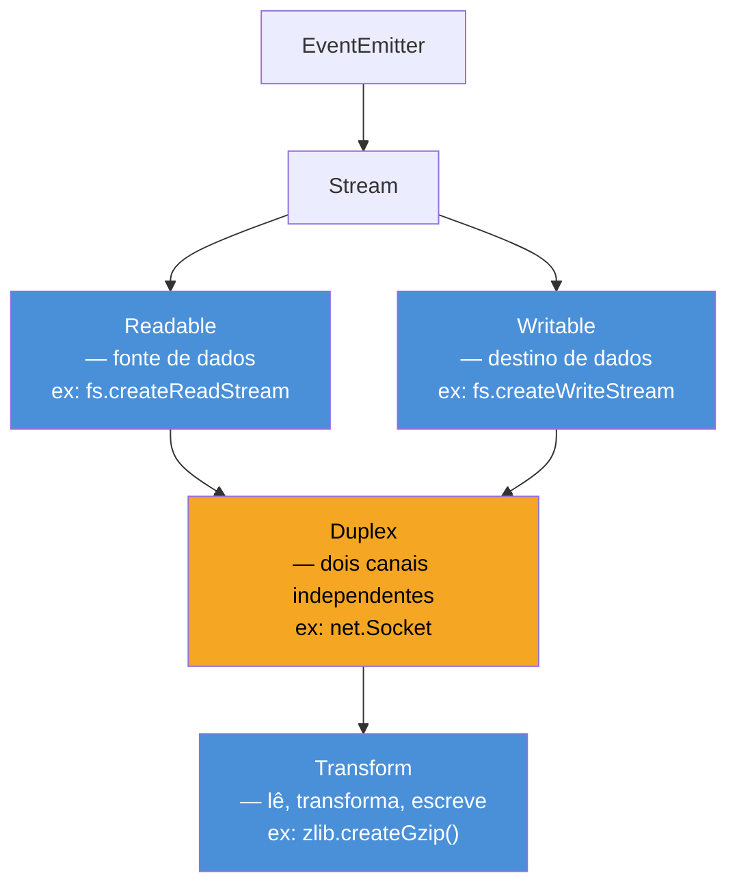

# Os 4 tipos: Readable, Writable, Duplex, Transform

> [!abstract] TL;DR
> Node tem 4 tipos de stream. **Readable** é fonte — dados saem do stream para o consumidor (`fs.createReadStream`, HTTP response no cliente, `process.stdin`). **Writable** é destino — dados entram no stream vindos do produtor (`fs.createWriteStream`, HTTP request, `process.stdout`). **Duplex** tem os dois lados **independentes** — o exemplo canônico é o TCP socket: você lê do peer e escreve para o peer sem que uma coisa afete a outra. **Transform** é um Duplex onde o que você escreve alimenta o lado de leitura após uma transformação — zlib, crypto, parsers.

---

## O que é

Node.js define quatro classes base no módulo `node:stream`. Cada uma representa um papel distinto no fluxo de dados:

**Readable** — stream do qual dados podem ser lidos. Funciona como uma torneira: abre (modo flowing) e os dados fluem, ou você puxa (modo paused) chunk a chunk via `.read()`. Interface básica: método `.read()`, evento `'data'`, evento `'end'`, e iteração com `for await...of`.

**Writable** — stream no qual dados podem ser escritos. Funciona como um dreno: você empurra chunks com `.write()` e sinaliza o fim com `.end()`. O stream avisa quando o buffer interno esvazia via evento `'drain'` e confirma o flush completo com `'finish'`.

**Duplex** — stream que é simultaneamente Readable e Writable, mas com **dois buffers internos independentes**: um para leitura e um para escrita. O dado que você escreve não aparece automaticamente na leitura — os dois lados são canais separados. Exemplo canônico: `net.Socket`. Você lê bytes que chegam do peer de rede e escreve bytes que saem para esse peer, sem que nenhum dos dois lados saiba do outro internamente.

**Transform** — subclasse de Duplex onde os dois lados **são conectados**: o que você escreve é processado por `_transform()` e o resultado é empurrado para o lado de leitura via `this.push()`. O dado flui de um lado ao outro transformado. Exemplos canônicos: `zlib.createGzip()` (bytes brutos → bytes comprimidos), `crypto.createCipheriv()` (plaintext → ciphertext), parsers de protocolo.

---

## Por que importa

Confundir os tipos leva a bugs difíceis de diagnosticar em produção.

**Duplex ≠ Transform.** Quem implementa um Duplex custom esperando que o dado escrito apareça automaticamente na leitura vai ter surpresa: os dois lados são independentes por design. Essa confusão é frequente em entrevistas — saber articular a diferença em uma frase separa quem memorizou nomes de quem entende o modelo.

**Readable ≠ iterável comum.** `Readable.from(array)` transforma qualquer iterável em Readable, mas isso não significa que você deve envolver todo array em stream. Arrays pequenos têm overhead de buffering, controle de fluxo e event loop que não compensam. Stream ganha quando o dado é grande, contínuo, ou vem de I/O assíncrono — não para coleções já em memória.

**Transform não serve para operações que exigem estado global.** Um `sort` precisa ver todos os chunks antes de produzir qualquer saída. Transform processa chunk a chunk: quando `_transform()` é chamado, não há garantia de que todos os dados chegaram. Para isso, você acumula em `_transform()` e emite em `_flush()` — mas se o dataset não couber em memória, a abordagem toda está errada.

---

## Hierarquia de classes

Os quatro tipos não são construções independentes — eles formam uma hierarquia de herança:

```
EventEmitter
└── Stream
    ├── Readable
    ├── Writable
    └── Duplex        ← herda de Readable E Writable
        └── Transform ← herda de Duplex
```

**Readable** e **Writable** são folhas independentes — cada um herda de `Stream`, que herda de `EventEmitter`. Isso é o que dá aos streams a semântica de eventos (`on`, `emit`, `once`).

**Duplex** usa herança múltipla simulada em JavaScript: internamente, ele mistura os protótipos de `Readable` e `Writable` sobre si mesmo. Por isso mantém dois buffers separados — cada um pertence a um lado da herança.

**Transform** estende `Duplex` e sobrescreve os métodos internos `_read()` e `_write()` para conectar os dois buffers via `_transform()`. O usuário implementa apenas `_transform()` (e opcionalmente `_flush()`); Node cuida do roteamento interno.

Essa hierarquia tem consequências práticas:

- `Transform instanceof Duplex === true`
- `Transform instanceof Readable === true`
- `Transform instanceof Writable === true`
- Todo stream é um `EventEmitter` — você pode usar `once`, `removeListener`, etc.
- Propriedades como `writableHighWaterMark` e `readableHighWaterMark` existem em Duplex e Transform porque ambos têm os dois lados.

### Diagrama: hierarquia e direção dos dados



A distinção visual mais importante: Duplex tem duas setas de herança (Readable e Writable) porque mantém dois buffers independentes. Transform herda de Duplex mas conecta os dois lados via `_transform()` — o que entra pelo lado Writable sai transformado pelo lado Readable.

---

## Como funciona

### Tabela canônica

| Tipo | Interface principal | Direção | Exemplos canônicos |
|---|---|---|---|
| **Readable** | `.read()`, evento `'data'`, `for await...of` | source → consumer | `fs.createReadStream`, `process.stdin`, `http.IncomingMessage` (response no cliente / request no servidor), `Readable.from(iterable)` |
| **Writable** | `.write()`, `.end()`, evento `'drain'` | producer → sink | `fs.createWriteStream`, `process.stdout`, `process.stderr`, `http.OutgoingMessage` (request no cliente / response no servidor) |
| **Duplex** | Readable + Writable independentes | dois canais paralelos | `net.Socket`, `tls.TLSSocket` |
| **Transform** | `_transform(chunk, enc, cb)`, `_flush(cb)` | source → transform → consumer | `zlib.createGzip()`, `zlib.createGunzip()`, `crypto.createCipheriv()`, parsers customizados |

### Readable — código mínimo

```js
const { Readable } = require('node:stream');

// Modo flowing — dados emitidos automaticamente
const r = fs.createReadStream('input.txt', { encoding: 'utf8' });
r.on('data', (chunk) => process.stdout.write(chunk));
r.on('end', () => console.log('fim'));

// Modo paused — pull explícito
r.on('readable', () => {
  let chunk;
  while (null !== (chunk = r.read())) {
    process.stdout.write(chunk);
  }
});

// Async iteration — forma moderna e preferida
for await (const chunk of fs.createReadStream('input.txt')) {
  process.stdout.write(chunk);
}
```

### Writable — código mínimo

```js
const { createWriteStream } = require('node:fs');

const w = createWriteStream('output.txt');

// write() retorna false quando o buffer interno está cheio
const ok = w.write('primeiro chunk\n');
if (!ok) {
  // espera drain antes de continuar — backpressure manual
  w.once('drain', () => w.write('segundo chunk\n'));
} else {
  w.write('segundo chunk\n');
}

w.end('último chunk\n'); // sinaliza fim; 'finish' emitido após flush
```

### Duplex — código mínimo

```js
const { Duplex } = require('node:stream');

const duplex = new Duplex({
  // lado de leitura: produz dados para o consumidor
  read(size) {
    this.push('dado do duplex\n');
    this.push(null); // sinaliza fim do lado readable
  },
  // lado de escrita: consome dados do produtor — independente do read
  write(chunk, encoding, callback) {
    console.log('recebido no lado writable:', chunk.toString());
    callback(); // sinaliza que o chunk foi processado
  },
});

duplex.on('data', (chunk) => console.log('lido:', chunk.toString()));
duplex.write('enviado para o writable');
```

### Transform — código mínimo

```js
const { Transform } = require('node:stream');

const toUpperCase = new Transform({
  transform(chunk, encoding, callback) {
    // this.push() envia para o lado readable
    this.push(chunk.toString().toUpperCase());
    callback(); // chunk processado, pronto para o próximo
  },
  // _flush é chamado quando todos os chunks foram escritos
  flush(callback) {
    this.push('\n[fim da transformação]');
    callback();
  },
});

// pipeline: stdin → toUpperCase → stdout
process.stdin.pipe(toUpperCase).pipe(process.stdout);
```

### Object mode — quando o chunk não é Buffer

Por padrão, todos os streams operam com `Buffer`, `string`, ou `TypedArray`. Com `objectMode: true`, os chunks podem ser qualquer valor JavaScript (exceto `null`, que sinaliza fim do stream).

```js
const { Transform } = require('node:stream');

// Transform em object mode: recebe objetos JS, emite objetos JS
const normalizeUser = new Transform({
  objectMode: true,
  transform(user, encoding, callback) {
    this.push({
      id: user.id,
      name: user.name.trim().toLowerCase(),
      email: user.email.toLowerCase(),
    });
    callback();
  },
});

// Uso típico: pipeline de ETL com objetos
readableOfUsers
  .pipe(normalizeUser)
  .pipe(writableToDatabase);
```

> [!warning] Atenção ao highWaterMark em object mode
> Em object mode, `highWaterMark` representa **número de objetos**, não bytes. O padrão é `16` objetos. Para pipelines com objetos grandes, ajuste `writableHighWaterMark` e `readableHighWaterMark` para evitar pressão de memória desnecessária.

### Pipeline com `stream/promises` — forma moderna

```js
const { pipeline } = require('node:stream/promises');
const { createReadStream, createWriteStream } = require('node:fs');
const { createGzip } = require('node:zlib');

// pipeline() propaga erros e faz cleanup automático de todos os streams
await pipeline(
  createReadStream('arquivo.txt'),   // Readable
  createGzip(),                      // Transform
  createWriteStream('arquivo.txt.gz') // Writable
);
// se qualquer stream falhar, os demais são destruídos automaticamente
```

---

## Na prática

A decisão de qual tipo usar segue uma sequência direta:

**Vou ler de algo** — arquivo, resposta HTTP, stdin, banco de dados com cursor — use **Readable**. Você consome o stream; quem o produz (fs, http, driver) já entrega um Readable.

**Vou escrever para algo** — arquivo, requisição HTTP, stdout, socket — use **Writable**. Você produz dados; quem os consome já entrega um Writable.

**Comunicação bidirecional independente** — TCP, TLS, WebSocket subjacente — use **Duplex**. Os dois canais existem em paralelo sem relação causal entre eles.

**Transformar bytes ou objetos no meio de um pipeline** — compressão, criptografia, parsing, serialização — use **Transform**. O dado que entra pelo lado Writable sai transformado pelo lado Readable.

Na prática de APIs Node, você raramente instancia Duplex diretamente: `net.Socket` já é um. Transform, por outro lado, é o tipo que você implementa com frequência quando cria um middleware de pipeline — um parser de protocolo, um serializador de objetos para NDJSON, um filtro de linhas.

> [!tip] Árvore de decisão rápida
> ```
> Preciso implementar um stream custom?
> ├── Só produzir dados → Readable (implemente _read)
> ├── Só consumir dados → Writable (implemente _write)
> ├── Dois canais sem relação entre si → Duplex (implemente _read + _write)
> └── Transformar dados que passam → Transform (implemente _transform, opcionalmente _flush)
> ```

**Quando você consome streams prontos da API Node**, a escolha é diferente: você não escolhe o tipo — você identifica o que cada API entrega. `http.IncomingMessage` (o `req` no servidor) é Readable. `http.ServerResponse` (o `res` no servidor) é Writable. `net.Socket` é Duplex. `zlib.createGzip()` retorna um Transform. Conhecer os tipos permite encadear corrretamente via `pipeline` sem tentativa e erro.

---

## Casos práticos

Os dois cenários abaixo mostram como identificar e combinar os tipos corretos em situações reais de produção.

### Cenário 1 — Compressão de arquivo com Transform encadeado

Um serviço de backup precisa comprimir e cifrar arquivos de log antes de enviá-los para armazenamento. O pipeline combina Readable (fonte), dois Transforms (compressão + criptografia) e Writable (destino). Cada tipo tem papel preciso:

```javascript
import { pipeline } from 'node:stream/promises';
import { createReadStream, createWriteStream } from 'node:fs';
import { createGzip } from 'node:zlib';
import { createCipheriv, randomBytes, scryptSync } from 'node:crypto';

const password = process.env.BACKUP_PASSWORD;
const salt = randomBytes(16);
const key = scryptSync(password, salt, 32);  // deriva chave de 256 bits
const iv = randomBytes(16);

await pipeline(
  // Readable: fonte — lê o arquivo de log em chunks
  createReadStream('./app.log'),

  // Transform #1: comprime com gzip on-the-fly
  // O que entra: bytes brutos do log
  // O que sai: bytes comprimidos
  createGzip(),

  // Transform #2: cifra o conteúdo comprimido
  // O que entra: bytes comprimidos
  // O que sai: bytes cifrados
  createCipheriv('aes-256-gcm', key, iv),

  // Writable: destino — persiste o resultado cifrado
  createWriteStream('./app.log.gz.enc'),
);

// Memória usada: O(chunk) — independente do tamanho do arquivo de log
// Cada Transform processa um chunk de cada vez e entrega ao próximo
console.log('Backup concluído — comprimido e cifrado');
```

Aqui cada Transform encapsula uma transformação pura: entrada e saída são bytes, mas com semânticas diferentes. O `pipeline` conecta os estágios e garante backpressure entre eles.

### Cenário 2 — Parser de protocolo customizado com Transform em object mode

Um serviço consome mensagens de uma fila (broker TCP customizado) que entrega linhas de texto no formato `CMD:payload`. O objetivo é parsear cada linha em objetos JavaScript e roteá-los por tipo de comando:

```javascript
import { Transform } from 'node:stream';
import { createConnection } from 'node:net';
import { pipeline } from 'node:stream/promises';
import { createWriteStream } from 'node:fs';

// Transform: bytes → objetos de comando
// Demonstra a transição de modo binário para object mode no mesmo pipeline
class CommandParser extends Transform {
  constructor() {
    // readableObjectMode: true — o lado de leitura emite objetos, não bytes
    super({ readableObjectMode: true });
    this._buffer = '';
  }

  _transform(chunk, _enc, cb) {
    this._buffer += chunk.toString();
    const lines = this._buffer.split('\n');
    this._buffer = lines.pop(); // guarda linha incompleta para o próximo chunk

    for (const line of lines) {
      if (!line.trim()) continue;
      const [cmd, ...rest] = line.split(':');
      // this.push() emite um objeto — não bytes
      this.push({ cmd: cmd.trim(), payload: rest.join(':').trim() });
    }
    cb();
  }

  _flush(cb) {
    // Processa qualquer fragmento restante quando o stream fecha
    if (this._buffer.trim()) {
      const [cmd, ...rest] = this._buffer.split(':');
      this.push({ cmd: cmd.trim(), payload: rest.join(':').trim() });
    }
    cb();
  }
}

// Transform: objetos de comando → linhas de log (object mode → bytes)
const toLogLine = new Transform({
  objectMode: true, // lê objetos
  transform({ cmd, payload }, _enc, cb) {
    cb(null, `[${new Date().toISOString()}] ${cmd}: ${payload}\n`);
  },
});

// net.Socket é Duplex — lemos do servidor e escrevemos para ele
const socket = createConnection({ host: 'broker.internal', port: 9000 });

await pipeline(
  socket,           // Duplex (usamos apenas o lado Readable aqui)
  new CommandParser(), // Transform: bytes → objetos
  toLogLine,           // Transform: objetos → bytes de log
  createWriteStream('./commands.log'), // Writable: persiste
);
```

O cenário ilustra dois padrões simultâneos: a transição entre binary mode e object mode dentro do pipeline, e o uso de apenas um lado de um Duplex (o `socket` como fonte de dados sem usar seu lado Writable).

---

## Armadilhas comuns

> [!warning] 1. Duplex não é Transform — confusão de canal
> **O que acontece:** Código implementa um Duplex esperando que `write()` alimente `read()` automaticamente — e fica confuso quando os dados não aparecem no lado de leitura.
> **Por quê:** Duplex tem dois buffers internos completamente separados; nenhum dado cruza de um lado para o outro por design. Os dois canais são independentes.
> **Como evitar:** Se você precisa que o que foi escrito apareça transformado na leitura, use Transform — ele conecta os dois lados via `_transform()`. Use Duplex apenas para comunicação bidirecional genuinamente independente (como sockets TCP).

> [!warning] 2. `Readable.from(array)` não é gratuito para arrays pequenos
> **O que acontece:** `Readable.from(['a', 'b', 'c'])` cria um stream real com toda a maquinaria de eventos, buffering e backpressure — overhead puro para dados já em memória.
> **Por quê:** A intenção de `Readable.from()` é converter iteráveis assíncronos (`async function*`) em streams. Para arrays in-memory, é como usar uma fábrica para fazer um parafuso girar.
> **Como evitar:** Use `Readable.from()` quando precisar conectar um `async function*` (paginação de API, cursor de banco) a um pipeline de streams. Para arrays em memória, use métodos de array diretamente.

> [!warning] 3. Transform não resolve operações com visibilidade global
> **O que acontece:** Tentativa de implementar `sort`, `median` ou `distinct` em um Transform — o que força acumular todos os chunks em `_transform()` antes de emitir em `_flush()`, derrotando o propósito do stream.
> **Por quê:** Transform processa chunk a chunk. Operações que precisam ver todos os dados antes de produzir qualquer output precisam de todo o dataset em memória de qualquer forma.
> **Como evitar:** Para operações com visibilidade global sobre datasets que não cabem em memória, use ordenação externa, banco de dados com índice, ou MapReduce. Se o dataset cabe em memória, buffer + array methods são mais simples e igualmente eficientes.

> [!warning] 4. Não ouvir `'error'` derruba o processo
> **O que acontece:** Stream emite `'error'` em falha de I/O; sem listener, Node lança como `uncaughtException` e derruba o processo inteiro.
> **Por quê:** Streams herdam de `EventEmitter`. O comportamento padrão de `EventEmitter` para eventos `'error'` sem listener é lançar a exceção — não silenciar.
> **Como evitar:** Sempre registre `.on('error', handler)` em todo stream que você instanciar diretamente. Ou use `pipeline()` de `node:stream/promises`, que propaga erros automaticamente e faz cleanup de todos os estágios.

> [!warning] 5. Misturar `.pipe()` com `async/await` sem cuidado
> **O que acontece:** Um stream intermediário falha; `pipe()` não propaga o erro para upstream nem destrói os outros streams — causando vazamento de file descriptors e handles abertos.
> **Por quê:** `pipe()` foi projetado antes do `async/await` e tem semântica de erro fraca. Ele conecta streams mas não gerencia o ciclo de vida da cadeia em caso de falha.
> **Como evitar:** Em código novo, use sempre `pipeline()` de `node:stream/promises`. `.pipe()` ainda aparece em exemplos históricos e libs legadas — saiba reconhecê-lo mas não reproduza em código de produção.

---

## Em entrevista

**Frase pronta (inglês):**

> "Node has four stream types. Readable is a source — `fs.createReadStream`, HTTP responses on the client side, `process.stdin`. Writable is a sink — `fs.createWriteStream`, HTTP requests, `process.stdout`. Duplex is read and write **independently** — the canonical example is a TCP socket: you read from the peer, write to the peer, two separate logical channels with no automatic data crossing. Transform is a Duplex where what you write feeds the read side after a transformation — zlib, crypto, custom parsers. The key distinction: Duplex has two independent buffers; Transform connects them through `_transform()`."

**Vocabulário técnico bilíngue:**

| PT-BR | EN |
|---|---|
| fonte | source |
| sumidouro | sink |
| canal | channel |
| transformador | transformer |
| bidirecional | bidirectional |
| pipeline de streams | stream pipeline |
| contrapressão | backpressure |
| modo de fluxo | flowing mode |
| modo pausado | paused mode |
| esvaziamento do buffer | drain |

**Perguntas frequentes:**

- *"What's the difference between Duplex and Transform?"* — Duplex: dois canais independentes, sem relação entre leitura e escrita. Transform: subclasse de Duplex onde `_transform()` conecta os dois lados; o que entra na escrita sai transformado na leitura.
- *"When would you implement a Transform vs just using `.map()` on an array?"* — Transform quando o dado vem de I/O assíncrono, o dataset não cabe em memória, ou você precisa compor com outros streams via `pipeline`. `.map()` em array quando os dados já estão em memória e não há necessidade de backpressure ou composição de pipeline.
- *"How does backpressure work in a Transform stream?"* — O lado Readable do Transform tem um `highWaterMark`. Quando o buffer enche, `this.push()` retorna `false` e o Transform para de chamar `_transform()` até o consumidor drenar o buffer. Isso propaga a contrapressão automaticamente para o Writable upstream.

---

## O que vem a seguir

Com o mapa dos quatro tipos em mente, o próximo passo é mergulhar na implementação de cada um. Readable e Writable têm contratos internos específicos — modos de consumo, backpressure, e eventos de ciclo de vida — que determinam como se comportam em produção.

- [[03 - Readable streams]] — modos flowing e paused, `Readable.from()`, implementação com `_read`
- [[04 - Writable streams]] — `.write()`, backpressure via `drain`, `cork()`/`uncork()`, implementação com `_write`
- [[05 - Duplex e Transform]] — implementação avançada de cada tipo, casos de uso reais
- [[06 - Backpressure]] — o mecanismo de controle de fluxo que conecta todos os tipos

---

## Veja também

- `[[01 - Por que streams]]` — motivação e trade-offs de usar streams
- `[[03 - Readable streams]]` — modos flowing/paused, backpressure, async iteration
- `[[04 - Writable streams]]` — write/end, drain, cork/uncork, implementação custom
- `[[05 - Duplex e Transform]]` — implementação avançada, casos de uso reais
- `[[Node.js]]` — tronco do domínio Node no Codex

---

## Fontes

- [Node.js Docs — Stream](https://nodejs.org/api/stream.html)
- [Node.js Docs — stream.pipeline()](https://nodejs.org/api/stream.html#streampipelinesource-transforms-destination-callback)

---

%%
## Rubric

- [x] Frontmatter completo (title, created, updated, type, status, publish, tags, aliases)
- [x] TL;DR como callout `[!abstract]`
- [x] Seções canônicas: O que é / Por que importa / Como funciona / Na prática / Armadilhas / Em entrevista / Veja também
- [x] Tabela canônica com todos os 4 tipos
- [x] Code sample mínimo para cada tipo (5-10 linhas)
- [x] Mínimo 3 armadilhas (5 presentes)
- [x] Frase pronta em inglês para entrevista
- [x] Vocabulário bilíngue PT-BR / EN
- [x] Wikilinks para notas adjacentes (01, 03, 04, 05, Node.js)
- [x] Sem referências a conteúdo do apocrypha
- [x] Sem fabricação de dados do usuário
- [x] PT-BR em todo o corpo da nota
%%
