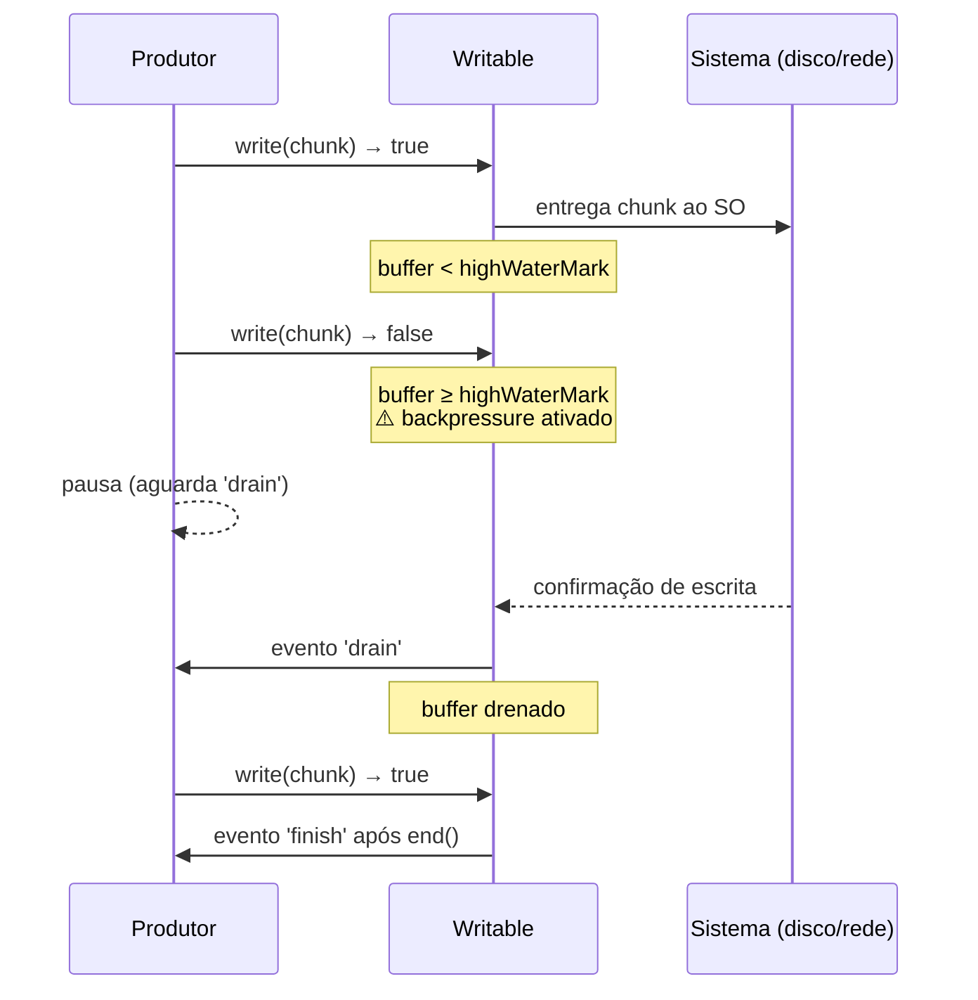

# Writable streams

> [!abstract] TL;DR
> Writable é o **sumidouro** do sistema de streams: recebe dados via `.write(chunk)` e os entrega ao destino (arquivo, socket, HTTP response). O detalhe crítico: `.write()` retorna `boolean` — `false` sinaliza **retroalimentação** (backpressure) e você deve parar de escrever até o evento `'drain'` disparar. `.end()` finaliza. `.cork()`/`.uncork()` agrupam chunks para um flush único. Eventos essenciais: `drain`, `finish`, `error`, `close`, `pipe`/`unpipe`. Implementação custom: subclasse `Writable` + `_write(chunk, enc, cb)` + opcional `_writev(chunks, cb)` para batching.

---

## O que é

`Writable` é a classe base de Node.js para **destinos de dados**. Enquanto `Readable` é a fonte, `Writable` é o sumidouro (sink): qualquer coisa que consome um fluxo de bytes ou objetos e os entrega a algum sistema subjacente.

Exemplos concretos de Writables que você usa o tempo todo sem perceber:

| Instância | Destino |
|-----------|---------|
| `fs.createWriteStream('./log.txt')` | Sistema de arquivos |
| `res` em `http.createServer((req, res) => …)` | HTTP response para o cliente |
| Socket TCP via `net.createServer` | Rede |
| `process.stdout`, `process.stderr` | Terminal |
| `zlib.createGzip()` | Compressor (Duplex com face Writable) |

A classe vive em `node:stream` e pode ser:

- **Usada diretamente** — você obtém uma instância já pronta (`fs.createWriteStream`).
- **Subclassificada** — para implementar um destino customizado via `_write`.
- **Recebida via `pipeline()`** — o idioma canônico de composição (veja `[[07 - pipeline vs pipe - error handling]]`).

### Diagrama: ciclo de vida de uma escrita com backpressure



O diagrama mostra o contrato crítico: quando `write()` retorna `false`, o produtor **deve** parar e esperar `'drain'`. O runtime não força essa pausa — é responsabilidade do chamador verificar o retorno e honrar o sinal.

---

## Por que importa

O ponto de falha mais comum ao trabalhar com Writables não é a API em si — é ignorar o **valor de retorno de `.write()`**.

`.write()` retorna `boolean`:

- `true` → buffer interno ainda abaixo do `highWaterMark`; pode continuar escrevendo.
- `false` → buffer atingiu o limite; **pare de escrever** até o evento `'drain'`.

Ignorar esse `false` não gera erro imediato. O código parece funcionar em desenvolvimento com volumes pequenos. Em produção, com throughput alto, o buffer interno cresce sem limite, consumindo RAM, degradando o GC e eventualmente derrubando o processo.

> [!danger] Ignorar o boolean de `.write()` é um vazamento de memória clássico
> A Writable continua aceitando `.write()` mesmo com buffer cheio — é responsabilidade do chamador verificar o retorno e pausar. O runtime não força backpressure para você.

Dois outros pontos críticos:

- Esquecer `.end()` faz o stream nunca emitir `'finish'` — qualquer consumidor esperando esse evento fica bloqueado para sempre.
- `cork()` sem `uncork()` acumula dados no buffer interno sem nunca descarregar — resultado idêntico ao de ignorar backpressure.

---

## Como funciona

### API básica: `.write()` e `.end()`

```javascript
import { createWriteStream } from 'node:fs';

const ws = createWriteStream('./output.txt');

// Escrita simples — retorno ignorado (válido apenas para volumes baixos)
ws.write('primeira linha\n');
ws.write('segunda linha\n');

// end() aceita um chunk final opcional + callback pós-flush
ws.end('última linha\n', () => {
  console.log('Arquivo fechado e dados persistidos');
});

ws.on('finish', () => {
  // Disparado quando todos os dados foram entregues ao SO
  console.log('finish: tudo escrito');
});

ws.on('error', (err) => {
  // SEMPRE trate 'error' — não tratar derruba o processo
  console.error('Erro na escrita:', err);
});
```

> [!warning] `write()` após `end()` lança `ERR_STREAM_WRITE_AFTER_END`
> Uma vez chamado `.end()`, o stream está encerrado. Qualquer `.write()` subsequente lança exceção.

### Respeitando backpressure

O padrão correto de escrita em loop respeita o boolean de `.write()` e aguarda `'drain'` quando necessário:

```javascript
import { createWriteStream } from 'node:fs';

function writeMany(ws, items) {
  let i = 0;

  function next() {
    while (i < items.length) {
      const chunk = items[i++];
      const ok = ws.write(chunk);

      if (!ok) {
        // Buffer cheio: aguarda drenagem antes de continuar
        ws.once('drain', next);
        return; // IMPORTANTE: sair do loop imediatamente
      }
    }
    // Todos os itens escritos, finaliza o stream
    ws.end();
  }

  next();
}

const ws = createWriteStream('./dados.txt');
const linhas = Array.from({ length: 100_000 }, (_, i) => `linha ${i}\n`);

writeMany(ws, linhas);

ws.on('finish', () => console.log('Concluído'));
ws.on('error', console.error);
```

O padrão `while + once('drain', next)` é a forma manual canônica. Em código de produção, `pipeline()` cuida disso automaticamente — mas entender o mecanismo é obrigatório para depurar e para implementar Writables customizadas.

### `cork()` e `uncork()` para batching

`cork()` instrui a Writable a acumular todos os chunks subsequentes no buffer interno em vez de entregá-los imediatamente ao destino. `uncork()` descarrega o buffer de uma vez.

```javascript
import { createWriteStream } from 'node:fs';

const ws = createWriteStream('./batch.txt');

// Encalha o stream: chunks acumulam no buffer
ws.cork();
ws.write('chunk A\n');
ws.write('chunk B\n');
ws.write('chunk C\n');

// Descarrega no próximo tick — melhor prática: usar process.nextTick
process.nextTick(() => ws.uncork());
```

Por que `process.nextTick`? Garante que todos os `.write()` síncronos do tick atual sejam coletados antes do uncork. Sem isso, código síncrono que chamasse `.write()` depois do `uncork()` chegaria fora do batch.

> [!info] `cork()` é contado — `uncork()` deve casar
> Se você chamar `cork()` duas vezes, precisa de dois `uncork()` para que o buffer seja descarregado. `writable.writableCorked` expõe o contador atual.

```javascript
ws.cork();      // writableCorked = 1
ws.cork();      // writableCorked = 2
ws.write('x');
ws.uncork();    // writableCorked = 1 — ainda encalhado
ws.uncork();    // writableCorked = 0 — flush acontece aqui
```

### Implementação custom: subclasse `Writable`

Para criar um destino que não existe como primitiva nativa — logger customizado, writer para banco de dados, serializador de protocolo — você subclassifica `Writable` e implementa `_write`:

```javascript
import { Writable } from 'node:stream';

class LoggingWritable extends Writable {
  constructor(options = {}) {
    super(options);
    this.lineCount = 0;
  }

  // _write é chamado pelo runtime para cada chunk
  // NUNCA chame write() dentro de _write — causa recursão infinita
  _write(chunk, encoding, callback) {
    const line = chunk.toString();
    this.lineCount++;
    // Simula trabalho assíncrono (ex: escrita em DB)
    process.nextTick(() => {
      process.stdout.write(`[${this.lineCount}] ${line}`);
      callback(); // Sinaliza que o chunk foi processado
    });
  }

  // _final é chamado após end(), antes de 'finish' ser emitido
  _final(callback) {
    process.stdout.write(`\nTotal de linhas: ${this.lineCount}\n`);
    callback();
  }
}

const logger = new LoggingWritable();
logger.write('primeira\n');
logger.write('segunda\n');
logger.end();
logger.on('finish', () => console.log('Logger finalizado'));
```

> [!warning] `callback` em `_write` é obrigatório
> O runtime aguarda o `callback` para saber que pode enviar o próximo chunk. Esquecer de chamá-lo faz o stream travar permanentemente — nenhum dado adicional será processado.

### `_writev` para batching otimizado

Quando o stream está encalhado com `cork()`, o runtime pode acumular múltiplos chunks e entregá-los em batch para `_writev` em vez de chamar `_write` um a um. Isso é especialmente valioso quando o destino suporta operações em lote (bulk inserts em banco de dados, HTTP com request batching):

```javascript
import { Writable } from 'node:stream';

class BatchDatabaseWriter extends Writable {
  constructor(db, options = {}) {
    super({ ...options, objectMode: true });
    this.db = db;
  }

  // _write: fallback para chunks individuais
  _write(record, encoding, callback) {
    this.db.insert(record)
      .then(() => callback())
      .catch(callback); // Passa o erro para o callback = emite 'error'
  }

  // _writev: caminho otimizado quando há chunks acumulados
  _writev(chunks, callback) {
    // chunks é um array de { chunk, encoding }
    const records = chunks.map(({ chunk }) => chunk);
    this.db.bulkInsert(records)
      .then(() => callback())
      .catch(callback);
  }
}
```

Se `_writev` não for definido e o stream estiver encalhado, o runtime chama `_write` repetidamente para cada chunk acumulado — funciona, mas sem o ganho de batching.

---

## Eventos de ciclo de vida

| Evento | Quando dispara | Uso típico |
|--------|---------------|------------|
| `drain` | Buffer drenou abaixo do `highWaterMark` após `.write()` retornar `false` | Retomar escrita após backpressure |
| `finish` | Todos os dados foram entregues ao sistema subjacente após `.end()` | Confirmar persistência, fechar recursos dependentes |
| `error` | Erro durante escrita ou pipe | Tratamento de erro obrigatório |
| `close` | Stream e recursos subjacentes foram fechados | Cleanup final |
| `pipe` | `readable.pipe(this)` foi chamado | Rastrear quem está pipando |
| `unpipe` | `readable.unpipe(this)` foi chamado ou Readable teve erro | Detectar desconexão de pipeline |

### Propriedades de estado

```javascript
ws.writable           // true se ainda aceita .write()
ws.writableEnded      // true após .end() ser chamado
ws.writableFinished   // true imediatamente antes de 'finish' ser emitido
ws.writableLength     // bytes/objetos no buffer aguardando escrita
ws.writableNeedDrain  // true se .write() retornou false e 'drain' não ocorreu ainda
ws.writableCorked     // quantidade de cork() sem uncork() correspondente
ws.destroyed          // true após destroy() ser chamado
```

---

## Na prática

### Quando usar `pipeline()` vs. backpressure manual

Em código de produção, **`pipeline()` é o idioma canônico** para composição de streams — ele gerencia backpressure automaticamente entre Readable e Writable, propaga erros e destrói todos os streams da cadeia em caso de falha:

```javascript
import { pipeline } from 'node:stream/promises';
import { createReadStream, createWriteStream } from 'node:fs';
import { createGzip } from 'node:zlib';

await pipeline(
  createReadStream('./input.txt'),
  createGzip(),
  createWriteStream('./output.txt.gz')
);
// Sem listener de 'drain', sem gestão de erro manual, sem vazamento
```

Backpressure manual (o padrão `while + once('drain', next)`) é necessário apenas em dois cenários:

1. **Código de baixo nível** — você está implementando a própria Writable ou construindo uma abstração de pipeline.
2. **Escrita sem Readable de origem** — você gera dados programaticamente e precisa controlar o ritmo de produção.

### `cork()`/`uncork()` em hot path

`cork()`/`uncork()` reduzem syscalls quando você executa múltiplas escritas síncronas dentro de um mesmo tick — situação comum em formatação de protocolo ou serialização de resposta HTTP:

```javascript
function respondWithHeaders(res, statusCode, headers, body) {
  res.cork(); // Acumula tudo no buffer
  res.write(`HTTP/1.1 ${statusCode}\r\n`);
  for (const [key, value] of Object.entries(headers)) {
    res.write(`${key}: ${value}\r\n`);
  }
  res.write('\r\n');
  res.write(body);
  process.nextTick(() => res.uncork()); // Flush como um único write no SO
}
```

---

## Casos práticos

Os dois cenários a seguir mostram Writable em contextos onde o contrato de backpressure e o ciclo de vida importam diretamente para corretude e eficiência.

### Cenário 1 — Logger customizado com _writev para escrita em batch

Um serviço de alta carga precisa persistir logs de auditoria em banco de dados. Cada requisição HTTP produz múltiplos eventos de log (autenticação, autorização, processamento, resposta). Com `_write`, cada evento geraria um `INSERT` individual. Com `_writev`, múltiplos eventos acumulados no mesmo tick são persistidos em um único `INSERT ... VALUES (...)`:

```javascript
import { Writable } from 'node:stream';

class AuditLogWriter extends Writable {
  constructor(db, options = {}) {
    super({ ...options, objectMode: true, highWaterMark: 50 });
    this.db = db;
  }

  // Fallback para inserção individual quando não há chunks acumulados
  async _write(record, _enc, callback) {
    try {
      await this.db.execute(
        'INSERT INTO audit_logs (event, user_id, timestamp, metadata) VALUES (?, ?, ?, ?)',
        [record.event, record.userId, record.timestamp, JSON.stringify(record.metadata)]
      );
      callback();
    } catch (err) {
      callback(err); // Propaga o erro — emite evento 'error' no stream
    }
  }

  // Caminho otimizado: N chunks → 1 INSERT bulk
  async _writev(chunks, callback) {
    const records = chunks.map(({ chunk }) => chunk);
    const placeholders = records.map(() => '(?, ?, ?, ?)').join(', ');
    const values = records.flatMap((r) => [
      r.event, r.userId, r.timestamp, JSON.stringify(r.metadata)
    ]);

    try {
      await this.db.execute(
        `INSERT INTO audit_logs (event, user_id, timestamp, metadata) VALUES ${placeholders}`,
        values
      );
      callback();
    } catch (err) {
      callback(err);
    }
  }

  // Chamado após end(), antes de 'finish' — garante flush de qualquer estado interno
  async _final(callback) {
    try {
      await this.db.flush(); // Força commit de transação pendente, se houver
      callback();
    } catch (err) {
      callback(err);
    }
  }
}

// Uso no servidor HTTP
const auditWriter = new AuditLogWriter(db);
auditWriter.on('error', (err) => console.error('Falha no audit log:', err));

// Cada requisição cork() o writer para acumular eventos do mesmo ciclo
function logAuditEvent(event, userId, metadata) {
  auditWriter.cork();
  auditWriter.write({ event, userId, timestamp: new Date().toISOString(), metadata });
  process.nextTick(() => auditWriter.uncork());
  // cork() + nextTick garante que todos os writes síncronos do tick
  // sejam batched em um único _writev
}
```

Em produção com 500 req/s, cada uma gerando 4 eventos, `_write` individual geraria 2000 INSERTs/s. `_writev` reduz para ~500 INSERTs/s em batch, diminuindo latência e carga no banco.

### Cenário 2 — Escrita em múltiplos destinos simultaneamente com stream customizado

Um pipeline de replicação precisa escrever o mesmo dado em disco (backup local) e em um socket TCP (replicação remota) ao mesmo tempo. Um `Writable` customizado que fan-out para múltiplos destinos:

```javascript
import { Writable } from 'node:stream';
import { createWriteStream } from 'node:fs';
import { createConnection } from 'node:net';
import { pipeline } from 'node:stream/promises';

class MultiDestinationWritable extends Writable {
  constructor(destinations, options = {}) {
    super(options);
    this.destinations = destinations;
  }

  // Escreve o mesmo chunk em todos os destinos em paralelo
  _write(chunk, encoding, callback) {
    const writes = this.destinations.map(
      (dest) =>
        new Promise((resolve, reject) => {
          const ok = dest.write(chunk, encoding);
          if (ok) return resolve();
          // Respeita backpressure de cada destino individualmente
          dest.once('drain', resolve);
          dest.once('error', reject);
        })
    );

    Promise.all(writes)
      .then(() => callback())
      .catch(callback);
  }

  // Encerra todos os destinos quando o stream principal terminar
  _final(callback) {
    const ends = this.destinations.map(
      (dest) =>
        new Promise((resolve, reject) => {
          dest.end();
          dest.once('finish', resolve);
          dest.once('error', reject);
        })
    );

    Promise.all(ends)
      .then(() => callback())
      .catch(callback);
  }
}

// Configura os dois destinos
const localBackup = createWriteStream('./backup.dat');
const remoteSocket = createConnection({ host: 'replica.internal', port: 9001 });

const replicator = new MultiDestinationWritable([localBackup, remoteSocket]);
replicator.on('error', (err) => console.error('Falha na replicação:', err));

// Usa o replicator como destino final de qualquer Readable
import { createReadStream } from 'node:fs';
await pipeline(
  createReadStream('./dados-producao.dat'),
  replicator,
);

console.log('Replicação concluída — disco local e réplica remota sincronizados');
```

O padrão `Promise.all(writes)` garante que o callback de `_write` só é chamado quando **todos** os destinos confirmaram a escrita do chunk — o que propaga backpressure corretamente do destino mais lento para o produtor upstream.

---

## Armadilhas comuns

> [!warning] 1. Ignorar o boolean de `.write()` — vazamento de memória silencioso
> **O que acontece:** O buffer interno da Writable cresce sem limite. Em desenvolvimento com volumes pequenos, parece funcionar. Em produção com alto throughput, o processo degrada e potencialmente trava. **Por quê:** `.write()` retorna `false` quando o buffer atinge `highWaterMark`, mas não lança erro nem para o chamador. A Writable continua aceitando dados — é responsabilidade do chamador verificar e pausar. **Como evitar:** Sempre verifique o retorno de `.write()`. Se `false`, aguarde `'drain'` antes de continuar. Em loops, use o padrão `while + once('drain', next)` ou, para código moderno, `pipeline()` que cuida disso automaticamente.
>
> ```javascript
> // ERRADO: ignora backpressure — buffer cresce indefinidamente
> for (const chunk of hugeDataset) {
>   ws.write(chunk);
> }
>
> // CERTO: respeita o sinal de pausa
> for (const chunk of hugeDataset) {
>   const ok = ws.write(chunk);
>   if (!ok) {
>     await new Promise(resolve => ws.once('drain', resolve));
>   }
> }
> ```

> [!warning] 2. Esquecer `.end()` — `'finish'` nunca dispara
> **O que acontece:** Qualquer consumidor esperando o evento `'finish'` (para confirmar persistência ou fechar recursos dependentes) fica bloqueado indefinidamente. **Por quê:** `'finish'` só é emitido após `.end()` ser chamado e todos os dados serem entregues ao sistema subjacente. Sem `.end()`, a Writable fica em estado aberto. **Como evitar:** Sempre feche o stream com `.end()` quando terminar de escrever. Em pipelines, `pipeline()` chama `.end()` automaticamente no stream destino.
>
> ```javascript
> // ERRADO — 'finish' nunca é emitido
> function writeData(ws, data) {
>   ws.write(data);
>   // Faltou: ws.end()
> }
>
> // CERTO
> function writeData(ws, data) {
>   ws.write(data);
>   ws.end();
> }
> ```

> [!warning] 3. `cork()` sem `uncork()` correspondente — buffer cresce sem flush
> **O que acontece:** Dados acumulam no buffer interno indefinidamente, nunca chegando ao destino. O comportamento parece um travamento silencioso. **Por quê:** `cork()` é contado — cada chamada incrementa `writableCorked`. O flush só acontece quando o contador volta a zero. Um `cork()` sem `uncork()` deixa o contador em 1 permanentemente. **Como evitar:** Sempre parear cada `cork()` com um `uncork()`. Use `process.nextTick(() => ws.uncork())` para garantir que todos os `.write()` síncronos do tick atual sejam incluídos no batch antes do flush.
>
> ```javascript
> // ERRADO — cork sem uncork, buffer nunca descarrega
> ws.cork();
> ws.write('Content-Type: application/json\r\n');
> // Faltou: uncork()
>
> // CERTO — sempre parear
> ws.cork();
> ws.write('Content-Type: application/json\r\n');
> ws.write('\r\n');
> process.nextTick(() => ws.uncork()); // flush no próximo tick
> ```

> [!warning] 4. `_write` com operação síncrona pesada — bloqueia o event loop
> **O que acontece:** A thread JavaScript fica ocupada durante a operação síncrona, impedindo que qualquer outra requisição seja processada. O servidor congela. **Por quê:** `_write` é chamado dentro do event loop. Qualquer operação síncrona custosa dentro dele bloqueia todas as demais operações enquanto não termina. **Como evitar:** Use APIs assíncronas dentro de `_write`. Se a operação for CPU-intensiva e não puder ser tornada assíncrona, isole-a em um Worker Thread via `worker_threads`.
>
> ```javascript
> // ERRADO — bloqueia o event loop para cada chunk
> _write(chunk, enc, callback) {
>   const processed = heavySync(chunk);
>   fs.writeFileSync('./out.txt', processed, { flag: 'a' });
>   callback();
> }
>
> // CERTO — usa API assíncrona dentro de _write
> _write(chunk, enc, callback) {
>   fs.appendFile('./out.txt', chunk, callback);
> }
> ```

> [!warning] 5. Não tratar `'error'` — derruba o processo
> **O que acontece:** Qualquer erro de I/O na Writable (disco cheio, permissão negada, socket fechado) derruba o processo inteiro via `uncaughtException`. **Por quê:** Streams herdam de `EventEmitter`. O comportamento padrão de `EventEmitter` para `'error'` sem listener é lançar a exceção — Node não tem como saber que você pretendia ignorá-la. **Como evitar:** Sempre registre `ws.on('error', handler)` em qualquer Writable que você instanciar diretamente. Ou use `pipeline()` de `node:stream/promises`, que captura e propaga erros de todos os estágios automaticamente.

---

## Em entrevista

### Frase pronta

> "A Writable stream is a sink. The interface is `.write(chunk)` and `.end()`. The critical detail seniors get right and juniors miss: `.write()` returns a boolean — if it returns false, you must stop writing until the `'drain'` event fires, otherwise the internal buffer grows unbounded and you leak memory. Implementing a custom Writable means subclassing and defining `_write(chunk, encoding, callback)`. For batching to a destination that supports it, override `_writev` instead. `cork()` and `uncork()` let you accumulate writes for a flush in a single tick."

### Perguntas frequentes e respostas diretas

**"O que acontece se você ignorar o retorno de `.write()`?"** O buffer interno cresce sem limite, consumindo memória indefinidamente. Em produção com alto throughput, o processo vai degradar e potencialmente derrubar.

**"Qual a diferença entre `'finish'` e `'close'`?"** `'finish'` dispara quando todos os dados foram entregues ao sistema subjacente (SO/rede). `'close'` dispara quando o stream em si e seus recursos (file descriptor, socket) foram fechados. `'finish'` sempre vem antes de `'close'`.

**"Quando você usaria `_writev` em vez de `_write`?"** Quando o destino suporta operações em lote — bulk inserts em banco, HTTP com batching, protocolos que agregam mensagens. `_writev` recebe um array de chunks acumulados pelo `cork()` e permite uma única chamada ao destino em vez de N chamadas individuais.

**"Como `pipeline()` resolve backpressure automaticamente?"** `pipeline()` conecta Readable e Writable e monitora o retorno de cada `.write()`. Quando retorna `false`, faz `.pause()` na Readable de origem e espera `'drain'` na Writable antes de fazer `.resume()`. Isso elimina o padrão manual `while + once('drain')`.

### Vocabulário PT-BR ↔ EN

| Português | English |
|-----------|---------|
| sumidouro | sink |
| evento drain | drain event |
| retroalimentação | backpressure |
| encalhar | cork |
| descarregar | uncork |
| alta marca d'água | high watermark (`highWaterMark`) |
| buffer interno | internal buffer |
| modo objeto | object mode |

---

## O que vem a seguir

Com Readable e Writable dominados, os dois extremos do fluxo estão cobertos. O próximo nível são os tipos compostos: Duplex (canais independentes) e Transform (transformação acoplada) — e depois, o mecanismo que mantém tudo coeso quando os estágios operam em velocidades diferentes.

- [[05 - Duplex e Transform]] — implementação avançada dos tipos compostos
- [[06 - Backpressure]] — como Readable e Writable negociam velocidade em detalhe
- [[07 - pipeline vs pipe - error handling]] — composição idiomática e gestão de erros em produção

---

## Veja também

- `[[03 - Readable streams]]` — a contraparte: fontes de dados
- `[[05 - Duplex e Transform]]` — streams que são Readable e Writable ao mesmo tempo
- `[[06 - Backpressure]]` — mecanismo de retroalimentação em detalhe
- `[[07 - pipeline vs pipe - error handling]]` — composição idiomática e gestão de erros
- `[[Streams]]` — MOC do domínio

---

## Fontes

- [Node.js Docs — Writable Streams](https://nodejs.org/api/stream.html#writable-streams)
