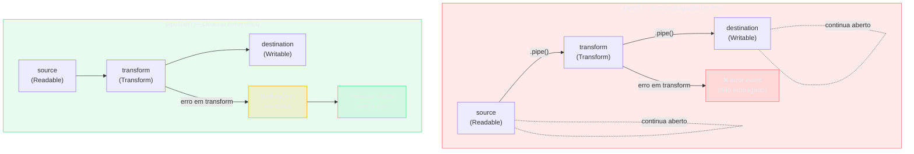

# pipeline vs pipe: error handling

> [!abstract] TL;DR
> `.pipe()` é antipattern moderno: não propaga erros — se um Transform falhar no meio da cadeia, o source continua aberto, o destination continua aberto, e você tem um leak silencioso de file descriptors e memória. `pipeline()` (callback ou `stream/promises` async) destrói todos os streams da cadeia ao primeiro erro, propaga o erro ao chamador, e suporta `AbortSignal` para cancelamento. Use `pipeline` por default em todo código novo; `.pipe()` apenas em código legacy onde não vale a pena refatorar.

---

## O que é

Node.js tem duas APIs para conectar streams em sequência:

### `.pipe()` — a API clássica (Node 0.x)

```javascript
readable.pipe(writable);
// ou em cadeia:
source.pipe(transform).pipe(destination);
```

`.pipe()` retorna a stream de destino, permitindo encadeamento. É a API original de streams, disponível desde Node.js 0.x. Funciona passando chunks do Readable para o Writable conforme o consumer pede, com gestão básica de backpressure.

### `stream.pipeline()` — a API moderna (Node 10+)

```javascript
// Versão callback — node:stream
import { pipeline } from 'node:stream';

pipeline(source, transform, destination, (err) => {
  if (err) console.error('Pipeline falhou:', err);
  else console.log('Pipeline concluído.');
});
```

```javascript
// Versão promise — node:stream/promises (Node 15+, idioma 2026)
import { pipeline } from 'node:stream/promises';

await pipeline(source, transform, destination);
```

`pipeline()` aceita qualquer número de streams, AsyncIterables e funções geradoras. Gerencia a conexão entre elas, backpressure, cleanup e propagação de erros de forma unificada.

### `stream.finished()` — helper para stream única

```javascript
import { finished } from 'node:stream/promises';

await finished(stream); // resolve quando stream termina, rejeita se errar
```

Útil quando você precisa aguardar o término de uma stream isolada, sem estar dentro de um `pipeline()`.

---

## Por que importa

`.pipe()` em código novo é **red flag de code review**.

Não é questão de estilo — é uma questão de corretude. O problema concreto: `.pipe()` **não propaga erros**. A documentação oficial do Node.js afirma explicitamente:

> "If the `Readable` stream emits an error during processing, the `Writable` destination is not closed automatically. If an error occurs, it will be necessary to manually close each stream in order to prevent memory leaks."

Isso significa que em qualquer cadeia com `.pipe()`, um único erro em qualquer stream deixa **todas as demais abertas**. Em código de produção que processa arquivos, conexões de banco ou sockets de rede, isso resulta em:

- File descriptors abertos que nunca fecham.
- Buffers em memória que nunca liberam.
- Writable streams que nunca emitem `'finish'`.
- Processos que lentamente acumulam recursos até atingir limites do OS.

O erro não aparece em desenvolvimento com cenários simples. Aparece em produção, em condições de falha parcial — exatamente quando você mais precisa que o cleanup funcione.

`pipeline()` resolve todos esses problemas automaticamente.

---

## Diagrama



Com `.pipe()`, um erro no `transform` dispara um evento `'error'` que fica sem handler — o `source` e o `destination` continuam abertos, acumulando file descriptors. Com `pipeline()`, o mesmo erro propaga `.destroy(err)` em todos os streams da cadeia antes de rejeitar a Promise.

---

## Como funciona

### 1. `.pipe()` clássico — o problema

```javascript
// PROBLEMÁTICO — não propaga erros
import { createReadStream, createWriteStream } from 'node:fs';
import { createGzip } from 'node:zlib';

const source      = createReadStream('input.tar');
const compress    = createGzip();
const destination = createWriteStream('output.tar.gz');

source.pipe(compress).pipe(destination);

// Se compress emitir 'error':
//   → destination NÃO é destruída automaticamente
//   → source NÃO para automaticamente
//   → o erro não vai a lugar nenhum (unhandled 'error' → crash)
//   → file descriptors de source e destination ficam abertos
```

Para fazer `.pipe()` corretamente, você precisaria registrar listeners de erro em **cada stream** individualmente e chamar `.destroy()` em todas — exatamente o que `pipeline()` faz internamente, de forma robusta e testada.

### 2. `pipeline()` — versão callback

```javascript
import { pipeline } from 'node:stream';
import { createReadStream, createWriteStream } from 'node:fs';
import { createGzip } from 'node:zlib';

pipeline(
  createReadStream('input.tar'),
  createGzip(),
  createWriteStream('output.tar.gz'),
  (err) => {
    if (err) {
      console.error('Pipeline falhou:', err);
      // Todas as streams já foram destruídas pelo runtime
    } else {
      console.log('Compressão concluída.');
    }
  }
);
```

Quando `createGzip()` errar (ou qualquer outra stream):
1. O runtime destrói o Readable de origem.
2. O runtime destrói todos os Transforms intermediários.
3. O runtime destrói o Writable de destino.
4. O erro é passado ao callback como primeiro argumento.

Nenhum recurso fica aberto. Nenhum tratamento manual é necessário.

### 3. `pipeline()` async — o idioma de 2026

```javascript
import { pipeline } from 'node:stream/promises';
import { createReadStream, createWriteStream } from 'node:fs';
import { createGzip } from 'node:zlib';

async function comprimir(input, output) {
  try {
    await pipeline(
      createReadStream(input),
      createGzip(),
      createWriteStream(output),
    );
    console.log('Concluído.');
  } catch (err) {
    // Todas as streams já foram destruídas
    console.error('Falha na compressão:', err);
  }
}

await comprimir('input.tar', 'output.tar.gz');
```

A versão promise integra naturalmente com `async/await`, elimina callback hell e permite uso de `try/catch` para tratamento de erro — o mesmo padrão usado para qualquer outra operação assíncrona.

### 4. Múltiplos transforms na pipeline

```javascript
import { pipeline } from 'node:stream/promises';
import { createReadStream, createWriteStream } from 'node:fs';
import { Transform } from 'node:stream';

// Cada Transform é uma etapa de processamento
const splitLines  = new Transform({ /* ... */ });
const parseCsv    = new Transform({ /* ... */ });
const toJsonLines = new Transform({ /* ... */ });

await pipeline(
  createReadStream('dados.csv'),
  splitLines,   // 'linha1\nlinha2' → ['linha1', 'linha2']
  parseCsv,     // 'campo1,campo2' → { campo1, campo2 }
  toJsonLines,  // { campo1, campo2 } → '{"campo1":...}\n'
  createWriteStream('dados.jsonl'),
);
// Se parseCsv lançar erro em um registro malformado:
//   → createReadStream para
//   → splitLines é destruída
//   → parseCsv é destruída
//   → toJsonLines é destruída
//   → createWriteStream é destruída (arquivo parcial fechado)
//   → await rejeita com o erro
```

A cadeia pode ter qualquer número de etapas. O cleanup é sempre total.

### 5. `AbortSignal` para cancelamento

```javascript
import { pipeline } from 'node:stream/promises';
import { createReadStream, createWriteStream } from 'node:fs';
import { createGzip } from 'node:zlib';

const controller = new AbortController();

// Cancela automaticamente após 5 segundos
const timeout = setTimeout(() => controller.abort(), 5_000);

try {
  await pipeline(
    createReadStream('arquivo-grande.tar'),
    createGzip(),
    createWriteStream('arquivo-grande.tar.gz'),
    { signal: controller.signal }, // AbortSignal no objeto de opções
  );
  clearTimeout(timeout);
} catch (err) {
  if (err.name === 'AbortError') {
    console.error('Pipeline cancelado por timeout.');
  } else {
    console.error('Erro na pipeline:', err);
  }
  // Em ambos os casos, todas as streams já foram destruídas
}
```

Quando o sinal é abortado:
- `destroy()` é chamado em todas as streams da cadeia com um `AbortError`.
- A promise rejeita com o `AbortError`.
- Nenhum recurso fica aberto.

> [!warning] `signal` vai dentro de um objeto de opções
> A assinatura é `pipeline(source, ...transforms, destination, { signal })`. Passar `signal` diretamente como quinto argumento — `pipeline(a, b, c, signal)` — não funciona. O signal precisa estar dentro de um objeto `{ signal }`. Esse é um dos erros mais comuns com `AbortSignal`.

### 6. `finished()` para aguardar stream única

```javascript
import { finished } from 'node:stream/promises';
import { createReadStream } from 'node:fs';

const stream = createReadStream('dados.bin');
stream.resume(); // coloca em flowing mode para drenar

try {
  await finished(stream);
  console.log('Stream concluída.');
} catch (err) {
  console.error('Stream falhou:', err);
}
```

`finished()` é o helper correto quando você precisa aguardar o término de uma stream que você não controla completamente — por exemplo, uma stream que já está em andamento em outro lugar, ou uma `Response` de fetch que você precisa drenar antes de prosseguir.

> [!info] `cleanup: false` por padrão
> `finished()` deixa event listeners (`'error'`, `'end'`, `'finish'`, `'close'`) no stream após resolver — previne crashes por eventos tardios de implementações incorretas. Use `cleanup: true` quando você controla o ciclo de vida da stream e quer limpeza imediata.

---

## Na prática

### Regra de ouro — quando usar cada API

| Situação | API recomendada |
|----------|----------------|
| Conectar 2+ streams em sequência | `await pipeline(...)` de `node:stream/promises` |
| Lógica entre chunks que precisa de `break` ou condicional | `for await...of` (ver nota 08) |
| Aguardar stream única em andamento | `await finished(stream)` de `node:stream/promises` |
| Integração com biblioteca que só usa `.pipe()` | `.pipe()` com listeners de erro manuais em cada stream |
| Código legado que não vale refatorar | `.pipe()` com listeners de erro manuais |

Para 90% dos casos em código Node moderno, a resposta é `await pipeline(...)`. A exceção são cenários onde você precisa iterar sobre os chunks com lógica de controle de fluxo — nesses casos, `for await...of` sobre um Readable é mais expressivo.

### Padrão para operações de arquivo

```javascript
import { pipeline } from 'node:stream/promises';
import { createReadStream, createWriteStream } from 'node:fs';
import { createGzip } from 'node:zlib';

// Compressão de arquivo — padrão idiomático
export async function gzip(inputPath, outputPath) {
  await pipeline(
    createReadStream(inputPath),
    createGzip(),
    createWriteStream(outputPath),
  );
}
```

Três linhas. Sem listeners de erro. Sem cleanup manual. Sem file descriptors abertos em caso de falha.

### `.pipe()` com tratamento mínimo correto

Se por algum motivo você precisar usar `.pipe()`, o mínimo necessário é registrar um listener de `'error'` em **cada stream** e chamar `.destroy(err)` em todas. `pipeline()` faz isso — mais tratamento de casos edge — em 3 linhas.

---

## Casos práticos

### Cenário 1 — Processamento ETL com múltiplos Transform e cancelamento por timeout

Um job de ETL lê um CSV de entrada, transforma, filtra e grava o resultado. Se o job demorar mais que 30 segundos, cancela e limpa tudo:

```javascript
import { pipeline } from 'node:stream/promises';
import { createReadStream, createWriteStream } from 'node:fs';
import { Transform } from 'node:stream';

// Transform 1: bytes → linhas CSV
class CsvSplitter extends Transform {
  #buf = '';
  _transform(chunk, _, cb) {
    this.#buf += chunk.toString();
    const lines = this.#buf.split('\n');
    this.#buf = lines.pop() ?? '';
    for (const l of lines) if (l.trim()) this.push(l + '\n');
    cb();
  }
  _flush(cb) { if (this.#buf.trim()) this.push(this.#buf); cb(); }
}

// Transform 2: linhas → objetos JSON filtrados
class CsvFilter extends Transform {
  #headers = null;
  constructor(predicate) {
    super({ readableObjectMode: true });
    this.predicate = predicate;
  }
  _transform(line, _, cb) {
    const values = line.toString().trim().split(',');
    if (!this.#headers) { this.#headers = values; return cb(); }
    const obj = Object.fromEntries(this.#headers.map((k, i) => [k, values[i] ?? '']));
    if (this.predicate(obj)) this.push(obj);
    cb();
  }
}

// Transform 3: objetos → JSON Lines
class ToJsonLines extends Transform {
  constructor() { super({ writableObjectMode: true }); }
  _transform(obj, _, cb) { this.push(JSON.stringify(obj) + '\n'); cb(); }
}

async function etlComTimeout(entrada, saida, filtro, timeoutMs = 30_000) {
  const controller = new AbortController();
  const timer = setTimeout(() => controller.abort(), timeoutMs);

  try {
    await pipeline(
      createReadStream(entrada),
      new CsvSplitter(),
      new CsvFilter(filtro),
      new ToJsonLines(),
      createWriteStream(saida),
      { signal: controller.signal },
    );
    clearTimeout(timer);
    console.log('ETL concluído.');
  } catch (err) {
    clearTimeout(timer);
    if (err.name === 'AbortError') {
      console.error(`ETL cancelado: excedeu ${timeoutMs}ms.`);
      // todas as streams já foram destruídas — arquivo parcial fechado
    } else {
      throw err; // erro real de I/O ou transform: propaga ao chamador
    }
  }
}

await etlComTimeout(
  './vendas-2026.csv',
  './vendas-ativos.jsonl',
  (row) => row.status === 'ativo' && Number(row.valor) > 0,
);
```

Se `CsvFilter` lançar erro num registro malformado, todas as streams são destruídas e a promise rejeita — sem file descriptors abertos, sem arquivo parcialmente gravado preso no sistema.

### Cenário 2 — Aguardar stream em andamento com `finished()`

Às vezes você recebe uma stream que já está em andamento (ex.: body de uma requisição HTTP) e precisa aguardá-la sem criar uma nova `pipeline()`. `finished()` é a ferramenta certa:

```javascript
import { finished } from 'node:stream/promises';
import { createWriteStream } from 'node:fs';
import { pipeline } from 'node:stream/promises';

/**
 * Salva o body de uma Request em arquivo e aguarda a conclusão.
 * Usa finished() porque o stream de upload já está em andamento
 * antes de chegarmos aqui.
 */
async function salvarUpload(req, caminhoDestino) {
  const destino = createWriteStream(caminhoDestino);

  // pipe manual: req já está em flowing mode (headers recebidos)
  req.pipe(destino);

  // finished() aguarda o writable terminar — rejeita se qualquer
  // um dos dois emitir 'error' antes de 'finish'
  try {
    await finished(destino, { cleanup: true });
    return { tamanho: destino.bytesWritten };
  } catch (err) {
    // destrói o arquivo parcial
    destino.destroy();
    throw new Error(`Falha no upload: ${err.message}`);
  }
}

// em um servidor HTTP:
import http from 'node:http';
http.createServer(async (req, res) => {
  if (req.method === 'POST' && req.url === '/upload') {
    try {
      const { tamanho } = await salvarUpload(req, './upload-recebido.bin');
      res.writeHead(200).end(JSON.stringify({ tamanho }));
    } catch (err) {
      res.writeHead(500).end(err.message);
    }
  }
}).listen(3000);
```

`finished()` com `cleanup: true` remove os listeners após resolver, essencial quando o writable pode ser reutilizado ou quando o código processa muitos uploads em sequência (evita acumulação de listeners).

---

## Armadilhas comuns

> [!warning] 1. `.pipe()` sem error handler em cada stream — file descriptor leak
> **O que acontece:** um erro em qualquer stream da cadeia deixa todas as demais abertas — file descriptors acumulam até atingir o limite do OS (`EMFILE: too many open files`). **Por quê:** `.pipe()` registra `'end'` para fechar o destination quando o source termina, mas **não registra `'error'`** — por design histórico (Node 0.x). **Como evitar:** usar `pipeline()` em todo código novo; se `.pipe()` for inevitável, registrar `'error'` + `.destroy(err)` em cada stream manualmente.

```javascript
// ERRADO — bug clássico que parece correto
const rs = createReadStream('input.csv');
const transform = createCsvParser();
const ws = createWriteStream('output.json');

rs.pipe(transform).pipe(ws);

// Se createCsvParser emitir 'error':
//   → rs fica aberto (file descriptor não fechado)
//   → ws fica aberto (arquivo parcialmente escrito, fd aberto)
//   → em produção: EMFILE após horas de acumulação silenciosa
```

O comportamento EMFILE é a manifestação clássica desse bug em produção. O processo funciona normalmente por horas, depois começa a falhar ao abrir qualquer arquivo.

> [!warning] 2. `pipeline()` async sem `await` — UnhandledPromiseRejection
> **O que acontece:** a pipeline falha silenciosamente; em Node 15+, o processo termina com código de saída 1. **Por quê:** `pipeline()` de `stream/promises` retorna uma Promise — sem `await` ou `.catch()`, a rejeição fica sem handler. **Como evitar:** sempre `await pipeline(...)` ou `.catch(handleError)`.

```javascript
// ERRADO — promise rejeitada ignorada
pipeline(
  createReadStream('input.txt'),
  transform,
  createWriteStream('output.txt'),
); // sem await, sem .catch()

// CORRETO
await pipeline(...);
// ou
pipeline(...).catch(handleError);
```

> [!warning] 3. `AbortSignal` sem objeto de opções — erro silencioso
> **O que acontece:** `ctrl.signal` é interpretado como uma stream adicional na cadeia — TypeError obscuro ou comportamento indefinido. **Por quê:** a assinatura de `pipeline()` é `pipeline(source, ...transforms, destination, options?)` — o signal vai no objeto `options`, não como argumento posicional. **Como evitar:** sempre `{ signal: ctrl.signal }` como último argumento, nunca `ctrl.signal` diretamente.

```javascript
const ctrl = new AbortController();

// ERRADO — signal passado diretamente, não em { signal }
await pipeline(source, transform, destination, ctrl.signal);

// CORRETO
await pipeline(source, transform, destination, { signal: ctrl.signal });
```

> [!warning] 4. Misturar `.pipe()` e `pipeline()` na mesma cadeia — cleanup parcial
> **O que acontece:** se o source (conectado via `.pipe()`) errar, `pipeline()` não tem visibilidade sobre ele e não o destrói — leak. **Por quê:** `pipeline()` só gerencia as streams que recebe como argumentos; o source conectado por `.pipe()` fica fora do seu controle. **Como evitar:** escolha uma API para toda a cadeia — nunca misture `.pipe()` e `pipeline()`.

```javascript
// ERRADO — ambíguo e perigoso
const partial = source.pipe(transform); // .pipe() retorna transform
await pipeline(partial, destination);   // pipeline não controla source → LEAK se source errar
```

> [!warning] 5. `finished()` sem `cleanup: true` em loops — listeners acumulados
> **O que acontece:** cada `await finished(stream)` adiciona listeners `'error'`/`'end'`/`'finish'`/`'close'` que não são removidos — em loops, acumulam indefinidamente. **Por quê:** o padrão de `finished()` é `cleanup: false` para proteger contra implementações incorretas que emitem eventos tardios; em loops, esse padrão vira problema. **Como evitar:** usar `cleanup: true` em loops ou quando a stream pode ser usada múltiplas vezes.

```javascript
// Atenção: listeners acumulam se cleanup: false (padrão)
for (const stream of muitasStreams) {
  await finished(stream); // acumula listeners a cada iteração
}

// CORRETO para uso em loop
for (const stream of muitasStreams) {
  await finished(stream, { cleanup: true });
}
```

---

## Em entrevista

### Frase pronta

> "`.pipe()` is an antipattern in modern Node code. The reason is concrete: it doesn't propagate errors. If a transform stream fails mid-pipeline, the source stream stays open, the destination stays open, and you leak file descriptors and memory — this is the classic EMFILE bug. The replacement is `pipeline()` — there's a callback version in `node:stream` and a promise version in `node:stream/promises`. The promise version is the 2026 idiom: `await pipeline(source, transform, destination)`. It automatically destroys all streams on error, propagates the error to the caller, and accepts an `AbortSignal` for cancellation. For waiting on a single stream to finish, `finished()` from the same module is the right tool."

### Perguntas frequentes e respostas diretas

**"Por que `.pipe()` não propaga erros?"** Por design histórico: adicionado em Node 0.x, registra `'end'` para fechar a destination quando a source termina, mas não registra `'error'`. Refatorar quebraria compatibilidade retroativa.

**"Qual a diferença entre `pipeline` de `node:stream` e de `node:stream/promises`?"** Comportamento idêntico. Só muda a interface: callback vs. Promise. Para código novo, prefira `stream/promises` — integra com `async/await` e `try/catch`.

**"O que `pipeline()` faz quando uma stream falha?"** Chama `.destroy(err)` em **todas** as streams da cadeia — source, todos os transforms e destination. Depois invoca o callback ou rejeita a promise. Nenhum resource fica aberto.

**"Quando usar `finished()` em vez de `pipeline()`?"** Quando você tem uma stream única já em andamento e precisa aguardar o término — não está conectando múltiplas streams. Ex.: aguardar fim de upload ou drenar body de `Request` HTTP.

**"Como cancelar uma pipeline em andamento?"** `const ctrl = new AbortController()` → passe `{ signal: ctrl.signal }` como último argumento → `ctrl.abort()` destrói todas as streams com `AbortError` e rejeita a promise.

### Vocabulário PT-BR ↔ EN

| Português | English |
|-----------|---------|
| pipeline | pipeline |
| propagação de erro | error propagation |
| limpeza / cleanup | cleanup |
| sinal de aborto | AbortSignal |
| legado | legacy |
| vazamento de file descriptor | file descriptor leak |
| destruir stream | destroy stream |
| cadeia de streams | stream chain |
| cancelamento | cancellation |
| tratamento de erro | error handling |

---

## Rubric

| Critério | Status |
|----------|--------|
| TL;DR cobre `.pipe()` como antipattern com razão concreta | OK |
| `.pipe()` sem error handler: comportamento documentado | OK |
| `pipeline()` callback: assinatura e comportamento | OK |
| `pipeline()` async/await: idioma 2026 documentado | OK |
| Múltiplos transforms: exemplo com pipeline | OK |
| `AbortSignal`: assinatura correta `{ signal }` documentada | OK |
| `finished()`: uso correto com opções documentadas | OK |
| Regra de ouro: tabela quando usar cada API | OK |
| Armadilhas (5) com código e consequência real | OK |
| EMFILE como manifestação concreta do bug em produção | OK |
| Frase pronta para entrevista em EN | OK |
| Perguntas frequentes com respostas diretas | OK |
| Vocabulário PT-BR ↔ EN (10 termos) | OK |
| Veja também com wikilinks corretos | OK |
| Sem fabricação de dados reais | OK |

---

## O que vem a seguir

Dominado `pipeline()` para composição declarativa, o próximo passo é o modelo alternativo — consumir streams de forma imperativa com `for await...of`, onde cada chunk é processado com a mesma semântica de `async/await` que você já conhece.

- [[08 - Async iteration de streams]] — `for await...of` como alternativa a `pipeline()` quando há lógica condicional por chunk
- [[10 - Padrões práticos]] — padrões compostos de produção combinando `pipeline()` e async generators
- [[12 - Armadilhas, regras práticas, cheatsheet]] — referência rápida de antipatterns e decisões de API
- [[06 - Backpressure]] — o mecanismo de controle de fluxo que `pipeline()` encapsula
- [[Node.js]] — tronco: panorama do runtime

---

## Fontes

- [Node.js Docs — stream.pipeline()](https://nodejs.org/api/stream.html#streampipelinesource-transforms-destination-callback)
- [Node.js Docs — stream/promises.pipeline()](https://nodejs.org/api/stream.html#streampromisespipeline-source-transforms-destination-options)
- [Node.js Docs — stream.finished()](https://nodejs.org/api/stream.html#streamfinishedstream-options-callback)
