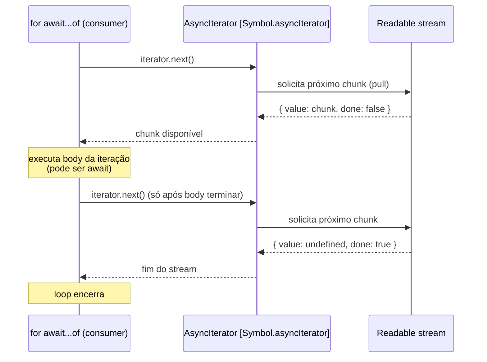

# Async iteration de streams

> [!abstract] TL;DR
> `for await (const chunk of readable) { ... }` consome stream chunk a chunk com backpressure automático: o loop só solicita o próximo chunk após o corpo da iteração atual completar — equivalente semântico ao modo paused. Async generators viram source via `Readable.from(asyncGen())`. Use async iter quando precisar de controle imperativo por chunk; use `pipeline()` para pipelines compostos e lineares.

---

## O que é

`Readable` implementa o protocolo `AsyncIterable` do JavaScript, o que significa que qualquer stream legível pode ser consumido com `for await...of` sem nenhuma adaptação:

```javascript
const readable = getReadableStreamSomehow();

for await (const chunk of readable) {
  console.log(chunk);
}
```

Internamente, `Readable` expõe `[Symbol.asyncIterator]()`, que é o contrato que `for await...of` exige. Ao usar o loop, o stream entra em modo de consumo controlado: o loop puxa o próximo chunk apenas quando o corpo da iteração atual termina, gerenciando backpressure de forma automática.

`Readable.from()` é o lado complementar: converte qualquer iterable ou async iterable em um `Readable` stream. Isso inclui arrays, generators síncronos e async generators — tornando a criação de sources customizados trivial.

---

## Diagrama



O ponto crítico está na última seta de cada ciclo: o loop só chama `iterator.next()` **após** o body terminar. Isso contrasta com o modo flowing (`'data'`), onde o stream empurra chunks independente da taxa de consumo. O protocolo de iterador transforma um stream push em consumo pull.

---

## Por que importa

Antes do `for await...of` se tornar idiomático (Node 10+, amplamente adotado no Node 12+), consumir streams exigia uma de duas abordagens:

- **Modo flowing**: listener `'data'` + `'end'` + `'error'` — imperativo, verboso, error-prone
- **Modo paused**: chamadas manuais a `.read()` dentro de `'readable'` — ainda mais trabalhoso

O async iterator unifica as duas abordagens em uma sintaxe familiar que:

1. **Lê como código síncrono** — sem callbacks aninhados, sem state machines
2. **Gerencia backpressure automaticamente** — sem `pause()`/`resume()` manual
3. **Integra com `try/catch`** — sem malabarismo de múltiplos listeners de `'error'`
4. **É o idioma canônico de 2026** — documentação oficial do Node.js recomenda async iter como forma preferida de consumo

Em contexto de entrevista, mostrar `for await...of` sinaliza que o candidato conhece streams modernos — não apenas a API de eventos legada.

---

## Como funciona

### 1. Consumindo um Readable com `for await...of`

```javascript
import { createReadStream } from 'node:fs';

async function processFile(path) {
  for await (const chunk of createReadStream(path, { encoding: 'utf8' })) {
    processChunk(chunk);
  }
  // stream foi totalmente consumido aqui — 'end' foi emitido
}
```

O loop solicita o próximo chunk apenas quando `processChunk(chunk)` retorna. Se `processChunk` for assíncrono (retorna Promise), o loop aguarda seu término antes de puxar o próximo chunk — backpressure natural, sem configuração extra.

### 2. Async generator como source via `Readable.from()`

```javascript
import { Readable } from 'node:stream';

async function* fetchAll(urls) {
  for (const url of urls) {
    const response = await fetch(url);
    yield await response.text();
  }
}

const stream = Readable.from(fetchAll(urls));

// stream agora é um Readable que pode ser passado para pipeline()
// ou consumido com for await...of
for await (const body of stream) {
  console.log(body.slice(0, 100));
}
```

`Readable.from()` aceita qualquer objeto que implemente `[Symbol.asyncIterator]` ou `[Symbol.iterator]`, incluindo:

- Arrays: `Readable.from(['a', 'b', 'c'])`
- Generators síncronos: `Readable.from(function*() { yield 1; yield 2; }())`
- Async generators: `Readable.from(asyncGen())`
- Qualquer AsyncIterable customizado

### 3. Backpressure automático no `for await...of`

O comportamento de backpressure é consequência direta do protocolo `AsyncIterator`:

```
iteração 1: loop chama iterator.next()
            → stream entrega chunk
            → loop executa body (pode ser await)
            → body termina
iteração 2: loop chama iterator.next() novamente
            → stream entrega próximo chunk
            → ...
```

O stream nunca empurra o próximo chunk antes de o body atual terminar. Isso contrasta com o modo flowing (`'data'` listener), onde o Node.js empurra chunks o mais rápido possível independente da taxa de consumo.

**Consequência prática:** se seu processamento por chunk é lento (parse pesado, I/O assíncrono), `for await...of` é a escolha mais segura — o stream do OS vai acumular no buffer interno até o loop estar pronto, mas não vai estourar a heap com dados não processados.

### 4. Error handling com `try/catch`

```javascript
import { createReadStream } from 'node:fs';

async function safeProcess(path) {
  try {
    for await (const chunk of createReadStream(path, { encoding: 'utf8' })) {
      await processChunk(chunk);
    }
  } catch (err) {
    // captura erros do stream (ENOENT, permissão, etc.)
    // E erros lançados dentro do body da iteração
    console.error('falha no processamento:', err.message);
  }
}
```

Quando o stream emite `'error'`, o async iterator converte esse evento em uma rejeição de Promise, que o `try/catch` captura normalmente. Erros lançados dentro do body também são capturados pelo mesmo bloco — o que elimina a necessidade de listeners de `'error'` separados.

> [!warning] Sem `try/catch`, erros do stream viram `unhandledRejection`
> Como o `for await...of` opera com Promises implícitas, um erro não capturado não emite um crash imediato com stack trace legível — ele vira uma `UnhandledPromiseRejectionWarning` que pode ser difícil de rastrear. Sempre envolva o loop em `try/catch`.

### 5. Cancelamento com `AbortSignal` via `.iterator()`

A partir do Node 16, `Readable` expõe o método `.iterator({ signal })` para cancelamento explícito:

```javascript
import { createReadStream } from 'node:fs';

const controller = new AbortController();
const { signal } = controller;

// cancela após 5 segundos
setTimeout(() => controller.abort(), 5_000);

try {
  for await (const chunk of createReadStream('big-file.dat').iterator({ signal })) {
    await processChunk(chunk);
  }
} catch (err) {
  if (err.name === 'AbortError') {
    console.log('leitura cancelada pelo AbortController');
  } else {
    throw err;
  }
}
```

Quando o signal dispara `abort`, o iterator lança `AbortError`, o `for await...of` termina, e o stream é destruído — sem leaks de file descriptors.

> [!tip] `for await...of` direto vs `.iterator({ signal })`
> O `for await (const chunk of stream)` usa o `[Symbol.asyncIterator]` padrão — sem suporte a AbortSignal. Para cancelamento controlado, use `stream.iterator({ signal })` explicitamente.

### 6. Async generators como transforms em `pipeline()`

Async generators funcionam diretamente como stages de transformação no `pipeline()`:

```javascript
import { pipeline } from 'node:stream/promises';
import { createReadStream, createWriteStream } from 'node:fs';

await pipeline(
  createReadStream('input.txt', { encoding: 'utf8' }),
  async function* (source) {
    for await (const chunk of source) {
      yield chunk.toUpperCase();
    }
  },
  createWriteStream('output.txt')
);
```

Aqui o async generator recebe o stream anterior como `source` e pode consumi-lo com `for await...of`, aplicando transformação e fazendo `yield` dos resultados. O `pipeline()` gerencia backpressure entre todos os stages, incluindo os async generators.

### 7. Comparação: `for await...of` vs `pipeline()`

| Critério | `for await...of` | `pipeline()` |
|---|---|---|
| Estilo | Imperativo | Declarativo |
| Melhor para | Lógica condicional por chunk | Composição linear de transforms |
| Backpressure | Automático (via iterator protocol) | Automático (via stream internals) |
| Error handling | `try/catch` | Promise rejeitada |
| AbortSignal | `.iterator({ signal })` | Opção `{ signal }` no pipeline |
| Cleanup de streams | Automático ao terminar o loop | Automático pelo pipeline |
| Compor N transforms | Verbose (N loops aninhados) | Natural (N argumentos) |

**Regra de ouro:**
- Lógica complexa por chunk (filtro, agregação, early exit) → `for await...of`
- Sequência linear de transforms (decompress → parse → write) → `pipeline()`
- Source customizado complexo (fetches sequenciais, DB cursor) → async generator + `Readable.from()`

---

## Na prática

### Padrão 1: Ler arquivo e agregar por chunk

```javascript
import { createReadStream } from 'node:fs';

async function countWords(filePath) {
  let total = 0;

  for await (const chunk of createReadStream(filePath, { encoding: 'utf8' })) {
    // chunk pode conter parte de uma palavra no limite — simplificação didática
    total += chunk.split(/\s+/).filter(Boolean).length;
  }

  return total;
}
```

### Padrão 2: Early exit sem consumir o stream inteiro

```javascript
import { createReadStream } from 'node:fs';

async function findFirstMatch(filePath, pattern) {
  for await (const chunk of createReadStream(filePath, { encoding: 'utf8' })) {
    if (pattern.test(chunk)) {
      return chunk; // stream é destruído automaticamente ao sair do loop
    }
  }
  return null;
}
```

> [!info] Cleanup automático ao sair do loop
> Quando o `for await...of` termina antes de consumir o stream inteiro (por `return`, `break` ou exceção), o iterator chama `.return()` internamente, que destrói o stream e libera recursos. Não é necessário chamar `stream.destroy()` manualmente.

### Padrão 3: DB cursor como async generator

```javascript
import { Readable } from 'node:stream';

async function* cursorToChunks(cursor, batchSize = 100) {
  let batch = [];

  for await (const row of cursor) {
    batch.push(row);
    if (batch.length >= batchSize) {
      yield batch;
      batch = [];
    }
  }

  if (batch.length > 0) {
    yield batch; // flush do último batch parcial
  }
}

// uso:
const stream = Readable.from(cursorToChunks(dbCursor));

for await (const batch of stream) {
  await bulkInsert(batch);
}
```

### Padrão 4: Fetch sequencial de múltiplas URLs

```javascript
import { Readable } from 'node:stream';
import { pipeline } from 'node:stream/promises';
import { createWriteStream } from 'node:fs';

async function* fetchSequential(urls) {
  for (const url of urls) {
    const response = await fetch(url);
    if (!response.ok) throw new Error(`HTTP ${response.status}: ${url}`);
    yield await response.text();
    yield '\n---\n'; // separador entre respostas
  }
}

await pipeline(
  Readable.from(fetchSequential(urls)),
  createWriteStream('all-responses.txt')
);
```

---

## Casos práticos

### Cenário 1 — Parsing progressivo de NDJSON com early exit

Processar um arquivo de logs NDJSON (Newline-Delimited JSON) em busca do primeiro erro crítico, sem carregar o arquivo inteiro na memória:

```javascript
import { createReadStream } from 'node:fs';
import { createInterface } from 'node:readline';

/**
 * Encontra o primeiro log com level='error' num arquivo NDJSON.
 * Usa async iteration com early exit — o stream é destruído automaticamente
 * quando o loop sai antes de consumir o arquivo inteiro.
 */
async function encontrarPrimeiroErro(caminhoLog) {
  // readline.createInterface cria um AsyncIterator de linhas — mais robusto
  // que split manual porque trata corretamente quebras de linha cross-platform
  const rl = createInterface({
    input: createReadStream(caminhoLog, { encoding: 'utf8' }),
    crlfDelay: Infinity,
  });

  let linhaNum = 0;

  try {
    for await (const linha of rl) {
      linhaNum++;
      if (!linha.trim()) continue;

      let entry;
      try {
        entry = JSON.parse(linha);
      } catch {
        console.warn(`Linha ${linhaNum} inválida, ignorando`);
        continue;
      }

      if (entry.level === 'error') {
        // early exit: o readline/stream é destruído automaticamente
        // pelo .return() do iterator — sem file descriptor leak
        return { linha: linhaNum, entry };
      }
    }
  } catch (err) {
    throw new Error(`Falha ao ler log: ${err.message}`);
  }

  return null; // nenhum erro encontrado
}

// uso:
const resultado = await encontrarPrimeiroErro('./app-2026-06-28.ndjson');
if (resultado) {
  console.log(`Primeiro erro na linha ${resultado.linha}:`, resultado.entry);
} else {
  console.log('Nenhum erro encontrado.');
}
```

`for await...of` sobre `readline.Interface` é o idioma canônico para processar arquivos linha a linha em Node moderno. O early exit (`return` dentro do loop) destrói o stream automaticamente — sem chamar `rl.close()` manualmente.

### Cenário 2 — Paginação de API com async generator e pipeline

Consumir uma API paginada, transformar os resultados e gravar num arquivo, tudo em streaming — sem acumular todas as páginas em memória:

```javascript
import { Readable } from 'node:stream';
import { pipeline } from 'node:stream/promises';
import { createWriteStream } from 'node:fs';
import { Transform } from 'node:stream';

/**
 * Async generator: busca todas as páginas de /usuarios sequencialmente.
 * Yield de cada registro individual — consumer controla o ritmo via backpressure.
 */
async function* buscarTodosUsuarios(baseUrl, token) {
  let cursor = null;

  do {
    const url = cursor ? `${baseUrl}/usuarios?cursor=${cursor}` : `${baseUrl}/usuarios`;
    const resp = await fetch(url, { headers: { Authorization: `Bearer ${token}` } });

    if (!resp.ok) throw new Error(`API retornou ${resp.status}: ${url}`);

    const { data, next_cursor } = await resp.json();

    for (const usuario of data) {
      yield usuario; // um objeto por vez — Readable.from gerencia o buffer
    }

    cursor = next_cursor;
  } while (cursor);
}

// Transform: objeto → linha CSV
class UsuarioToCsv extends Transform {
  #cabecalho = false;
  constructor() { super({ writableObjectMode: true }); }

  _transform(usuario, _, cb) {
    if (!this.#cabecalho) {
      this.push('id,nome,email,plano,criado_em\n');
      this.#cabecalho = true;
    }
    this.push(
      `${usuario.id},${usuario.nome},${usuario.email},${usuario.plano},${usuario.criado_em}\n`
    );
    cb();
  }
}

// pipeline: API paginada → objeto → CSV → arquivo
await pipeline(
  Readable.from(buscarTodosUsuarios('https://api.exemplo.com', process.env.API_TOKEN)),
  new UsuarioToCsv(),
  createWriteStream('./usuarios-exportados.csv'),
);

console.log('Exportação concluída.');
```

O async generator só faz a próxima requisição HTTP quando o consumer (via `pipeline()`) pede mais dados — backpressure natural sem código extra. Se a API retornar 500 mil usuários em 5 mil páginas, o uso de memória permanece constante.

---

## Armadilhas comuns

> [!warning] 1. Esquecer `try/catch` — erro do stream vira `UnhandledPromiseRejection`
> **O que acontece:** quando o stream emite `'error'`, o iterator converte em rejeição de Promise — sem `try/catch`, vira `UnhandledPromiseRejectionWarning`; em Node 15+ termina o processo. **Por quê:** `for await...of` opera sobre Promises implícitas; um erro não capturado não gera stack trace legível imediatamente — dificulta o diagnóstico. **Como evitar:** sempre envolver o `for await...of` em `try/catch`.

```javascript
// ERRADO — sem try/catch
async function bad(stream) {
  for await (const chunk of stream) {
    process(chunk); // se stream emitir 'error' → UnhandledPromiseRejection
  }
}

// CORRETO
async function good(stream) {
  try {
    for await (const chunk of stream) {
      process(chunk);
    }
  } catch (err) {
    handleError(err);
  }
}
```

> [!warning] 2. Misturar listener `'data'` com `for await...of` — comportamento indefinido
> **O que acontece:** chunks podem ser perdidos, duplicados ou o stream pode nunca emitir `'end'`. **Por quê:** adicionar `'data'` coloca o stream em modo flowing; `for await...of` opera em modo pull; os dois modos são incompatíveis na mesma instância. **Como evitar:** escolha **uma** API de consumo por stream e não misture.

```javascript
// NUNCA faça isso
stream.on('data', (chunk) => { /* ... */ }); // coloca em flowing mode

for await (const chunk of stream) { // comportamento indefinido
  /* ... */
}
```

A documentação oficial do Node.js é explícita: misturar `'data'`, `'readable'`, `.pipe()` e async iterators no mesmo stream produz resultados imprevisíveis.

> [!warning] 3. Exceção no body e stream em estado inconsistente
> **O que acontece:** o cleanup é automático (`.return()` destrói o stream), mas se você passar o stream para outro consumidor após o erro, ele pode já estar destruído. **Por quê:** `for await...of` chama `.return()` ao sair por exceção, que destrói o stream — correto internamente, mas surpreendente se o stream for compartilhado. **Como evitar:** verificar `stream.destroyed` antes de reutilizar um stream que passou por um `for await...of` com erro.

```javascript
async function risky(stream) {
  try {
    for await (const chunk of stream) {
      await riskyOperation(chunk); // lança exceção
    }
  } catch (err) {
    // cleanup é automático — mas confirme antes de reutilizar
    console.log('stream destroyed:', stream.destroyed); // deve ser true
  }
}
```

> [!warning] 4. Otimização prematura — async iter não é mais lento que event listeners
> **O que acontece:** desenvolvedor reescreve `for await...of` de volta para callbacks `'data'` em busca de performance — perde legibilidade sem ganho real. **Por quê:** o overhead do protocolo async iterator é de microssegundos por chunk. O gargalo real é sempre I/O ou processamento CPU — nunca o protocolo de iteração. **Como evitar:** medir antes de otimizar; não sacrificar legibilidade por suposição de lentidão.

> [!warning] 5. `Readable.from()` com objeto não-iterable — TypeError em runtime
> **O que acontece:** `Readable.from({ data: 'hello' })` lança `TypeError` em runtime — objetos comuns não são iterables. **Por quê:** `Readable.from()` exige `[Symbol.iterator]` ou `[Symbol.asyncIterator]`; um objeto literal não implementa nenhum dos dois. **Como evitar:** passar array, generator ou async generator; verificar com TypeScript se os tipos estiverem corretos (o erro não aparece em compile time sem tipos adequados).

```javascript
// ERRADO — objeto comum não é iterable
const stream = Readable.from({ data: 'hello' }); // TypeError em runtime

// CORRETO — array é iterable
const stream = Readable.from(['hello', ' ', 'world']);

// CORRETO — async generator
const stream = Readable.from((async function*() { yield 'hello'; })());
```

---

## Em entrevista

### Frase pronta

> "Readable streams in Node are AsyncIterable, so `for await (const chunk of readable)` is the idiomatic consumer pattern in 2026. It handles backpressure automatically — the loop only requests the next chunk after the body of the current iteration completes. To create a Readable from an async generator, `Readable.from(asyncGenerator())` is the one-liner. Choose async iteration when you need imperative control per chunk; choose `pipeline()` when you're composing a linear sequence of transforms."

### Perguntas frequentes em entrevista

**"Qual a diferença entre modo flowing e async iteration?"** Modo flowing empurra chunks o mais rápido possível via listener `'data'`, sem esperar o consumidor. Async iteration é puxado (pull): o loop solicita o próximo chunk apenas após terminar o body da iteração — comportamento equivalente ao modo paused, mas com sintaxe moderna e backpressure automático.

**"Quando você escolhe `for await...of` vs `pipeline()`?"** `for await...of` para lógica condicional por chunk — filtros, agregações, early exits, parsing complexo. `pipeline()` para composição linear de transforms onde cada stage recebe o stream inteiro e passa adiante. Os dois podem ser combinados: async generators dentro de `pipeline()`.

**"Como `Readable.from()` funciona internamente?"** Cria uma instância de `Readable` cujo `_read()` chama `.next()` no iterator fornecido e faz `push(chunk)` com o resultado. Quando o iterator retorna `done: true`, faz `push(null)` para sinalizar fim do stream.

**"O que acontece se você não consumir o stream dentro do `for await`?"** Se você fizer `break` ou `return` antes de consumir o stream inteiro, o iterator chama `.return()` automaticamente, o que destrói o stream e libera file descriptors. Não é necessário chamar `stream.destroy()` manualmente.

### Vocabulário PT-BR / EN para entrevista

| Português | Inglês |
|---|---|
| iteração assíncrona | async iteration |
| gerador assíncrono | async generator |
| composição declarativa | declarative composition |
| controle imperativo | imperative control |
| protocolo de iterador | iterator protocol |
| consumo puxado | pull-based consumption |
| consumo empurrado | push-based consumption |
| destruição automática | automatic cleanup / automatic destruction |

---

## O que vem a seguir

Com `for await...of` e `Readable.from()` dominados, você tem os dois idiomas modernos de consumo de streams. O próximo passo é ver como Web Streams (o padrão universal de browser e edge runtimes) se encaixa nessa história — e como converter entre os dois mundos.

- [[09 - Web Streams - interop com padrão universal]] — `ReadableStream`, `WritableStream`, `TransformStream` do padrão WHATWG e interop com Node Streams
- [[10 - Padrões práticos]] — exemplos compostos combinando `pipeline()`, async generators e `for await...of` em produção
- [[07 - pipeline vs pipe - error handling]] — quando `pipeline()` é a escolha certa em vez de `for await...of`
- [[03 - Readable streams]] — modos flowing e paused; async iter é a evolução do modo paused
- [[Node.js]] — tronco: visão panorâmica do runtime

---

## Fontes

- [Node.js Docs — Readable.from()](https://nodejs.org/api/stream.html#streamreadablefromiterable-options)
- [Node.js Docs — Streams Compatibility with async generators and async iterators](https://nodejs.org/api/stream.html#streams-compatibility-with-async-generators-and-async-iterators)
- [Node.js Docs — readable.iterator()](https://nodejs.org/api/stream.html#readableiteratoroptions)
