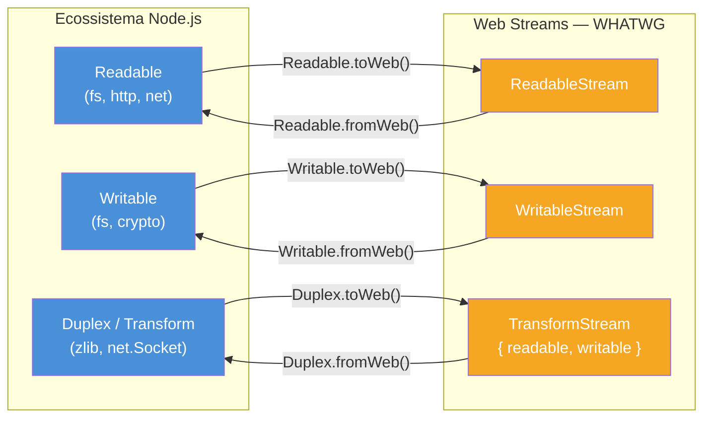

# Web Streams: interop com padrão universal

> [!abstract] TL;DR
> Node suporta Web Streams (padrão WHATWG) desde v16.5 — estável desde v21. As três classes centrais são `ReadableStream`, `WritableStream` e `TransformStream`. Interop com Node Streams é feita por `Readable.fromWeb(webReadable)` e `Readable.toWeb(nodeReadable)` (e equivalentes para `Writable`/`Duplex`). `fetch()` retorna Web Stream em `response.body`. Use Web Streams quando portabilidade importa (browser, Deno, Bun, Cloudflare Workers, Edge); use Node Streams quando integração madura com `fs`/`net`/`http`/`zlib` for crítica. Eles se complementam — não competem.

---

## O que é

**Web Streams** é o nome informal para a [WHATWG Streams Standard](https://streams.spec.whatwg.org/): um padrão de streaming definido pelo mesmo grupo que especifica HTML, URL e Fetch. O padrão define três classes:

| Classe | Papel |
|---|---|
| `ReadableStream` | Fonte de dados — produz chunks |
| `WritableStream` | Destino de dados — consome chunks |
| `TransformStream` | Intermediário — lê de um lado, transforma, escreve no outro |

O padrão foi concebido para rodar em qualquer runtime que implemente a Web Platform API — e é exatamente isso que acontece hoje: browser, Deno, Bun, Cloudflare Workers e Node.js todos implementam a mesma especificação.

No Node, Web Streams estão disponíveis:

- **v16.5.0** — experimental, via `require('node:stream/web')` ou `import { ReadableStream } from 'node:stream/web'`
- **v18.0.0** — exposto no objeto global (sem necessidade de import explícito na maioria dos casos)
- **v21.0.0** — marcado como **estável (stability 2)**, saindo do status experimental

---

## Por que importa

Em 2020, "streams" em Node.js significava exclusivamente a API nativa (`stream.Readable`, `stream.Writable`, etc.). Em 2026, o cenário mudou:

1. **`fetch()` retorna Web Stream.** O `response.body` de qualquer chamada `fetch()` — inclusive no Node v18+ — é um `ReadableStream` do padrão WHATWG, não um `stream.Readable`. Qualquer código que consome resposta HTTP streaming precisa lidar com Web Streams.

2. **Runtimes alternativos cresceram.** Cloudflare Workers, Deno, Bun e Edge Functions da Vercel/Netlify rodam código JavaScript mas *não* implementam a API de streams do Node. O único denominador comum é o padrão WHATWG.

3. **Bibliotecas isomórficas.** Um módulo de parser ou codec escrito com Web Streams pode ser distribuído num pacote npm e funcionar em Node, Deno e browser sem adaptações.

4. **Node Streams ainda é mainstream em apps Node-only.** O ecossistema — `pino`, `busboy`, `csv-parser`, `tar`, `zlib`, `fs`, `net`, `http` — usa Node Streams. A integração madura e o tooling robusto (`pipeline`, `finished`, `Transform`) continuam sendo vantagens reais quando o código só precisa rodar em Node.

A decisão entre os dois mundos é pragmática, não dogmática.

---

## Como funciona

### Web Stream básico — `ReadableStream`

```javascript
// Construtor recebe um objeto "underlyingSource"
const stream = new ReadableStream({
  start(controller) {
    // Enfileira chunks síncronos na inicialização
    controller.enqueue('primeiro');
    controller.enqueue('segundo');
    controller.close(); // sinaliza fim
  },
});

// Consumo via reader explícito
const reader = stream.getReader();
while (true) {
  const { done, value } = await reader.read();
  if (done) break;
  console.log(value); // 'primeiro', 'segundo'
}
reader.releaseLock();
```

O `controller` é o mecanismo de controle do lado produtor. Suas operações principais:

| Método | Efeito |
|---|---|
| `controller.enqueue(chunk)` | Adiciona chunk à fila interna |
| `controller.close()` | Encerra o stream (sem erro) |
| `controller.error(err)` | Encerra com erro |
| `controller.desiredSize` | Quanto espaço ainda há na fila (backpressure) |

---

### Async iteration — Web Stream também é AsyncIterable

Web Streams implementam o protocolo `AsyncIterable`, assim como Node Streams. A sintaxe é idêntica:

```javascript
const response = await fetch('https://example.com/data.ndjson');

// response.body é um ReadableStream<Uint8Array>
for await (const chunk of response.body) {
  // chunk é Uint8Array (bytes brutos)
  process(chunk);
}
```

> [!warning] Chunks são `Uint8Array` por padrão
> Web Streams de `fetch()` emitem bytes (`Uint8Array`), não strings. Para trabalhar com texto, use `TextDecoderStream` ou `stream/consumers`:
> ```javascript
> import { text } from 'node:stream/consumers';
> const body = await text(response.body);
> ```

---

### `pipeTo` e `pipeThrough` — o equivalente de `.pipe()`

Em Node Streams, a composição se faz com `.pipe()` (legado) ou `pipeline()` (atual). Em Web Streams, existem dois métodos equivalentes:

```javascript
// pipeTo — conecta ReadableStream a WritableStream (terminal)
await source.pipeTo(destination);

// pipeThrough — passa por um TransformStream e retorna novo ReadableStream
const compressed = source.pipeThrough(new CompressionStream('gzip'));
const decoded = response.body.pipeThrough(new TextDecoderStream());
```

`pipeTo` retorna uma `Promise` que resolve quando o pipeline termina (ou rejeita se houver erro). Isso torna o tratamento de erros natural:

```javascript
try {
  await source.pipeTo(sink);
  console.log('pipeline concluído');
} catch (err) {
  console.error('erro no pipeline:', err);
}
```

---

### `tee()` — bifurcar para dois consumers

```javascript
// Divide um ReadableStream em dois streams independentes
const [stream1, stream2] = source.tee();

// Ambos recebem os mesmos chunks
const [forProcessing, forLogging] = response.body.tee();

await Promise.all([
  processData(forProcessing),
  logRawBytes(forLogging),
]);
```

> [!warning] `tee()` e consumers em velocidades diferentes
> O stream mais lento determina o ritmo de avanço. Se `stream1` consome rápido mas `stream2` consome devagar, os chunks ficam em buffer esperando o consumidor lento — o mesmo problema de backpressure de sempre, mas agora com dois lados.

---

### `TransformStream` — transformação inline

```javascript
// TransformStream encapsula lógica de transformação
const upperCaseTransform = new TransformStream({
  transform(chunk, controller) {
    controller.enqueue(chunk.toUpperCase());
  },
  // flush é chamado quando o lado writable fecha
  flush(controller) {
    controller.terminate();
  },
});

// Uso em pipeline
const result = sourceStream
  .pipeThrough(new TextDecoderStream())       // Uint8Array → string
  .pipeThrough(upperCaseTransform)            // string → string uppercase
  .pipeThrough(new TextEncoderStream());      // string → Uint8Array

await result.pipeTo(destination);
```

`TransformStream` expõe `{ readable, writable }` — o par de entradas/saídas:

```javascript
const { readable, writable } = upperCaseTransform;
// writable: WritableStream (entrada)
// readable: ReadableStream (saída)
```

---

### `TextDecoderStream` e `TextEncoderStream`

Dois `TransformStream` utilitários essenciais para trabalhar com texto:

```javascript
import { ReadableStream } from 'node:stream/web';

// Decodifica Uint8Array → string (UTF-8 por padrão)
const textStream = byteStream.pipeThrough(new TextDecoderStream());

// Codifica string → Uint8Array
const byteStream2 = textStream.pipeThrough(new TextEncoderStream());
```

---

### Estratégias de fila — controle de backpressure

Web Streams têm backpressure nativo via `QueuingStrategy`:

```javascript
// CountQueuingStrategy — conta chunks (padrão para objeto streams)
const stream = new ReadableStream(source, new CountQueuingStrategy({ highWaterMark: 16 }));

// ByteLengthQueuingStrategy — conta bytes (para byte streams)
const byteStream = new ReadableStream(source, new ByteLengthQueuingStrategy({ highWaterMark: 65536 }));
```

O `controller.desiredSize` retorna quanto espaço há na fila. Quando negativo, é sinal para pausar a produção.

---

### `stream/consumers` — utilitários de consumo

```javascript
import { text, json, arrayBuffer, blob, buffer } from 'node:stream/consumers';

// Consumir um ReadableStream inteiro de uma vez
const body = await text(response.body);       // string UTF-8
const data = await json(response.body);       // JSON parseado
const buf  = await arrayBuffer(response.body); // ArrayBuffer
const b    = await blob(response.body);        // Blob
const raw  = await buffer(response.body);      // Node.js Buffer
```

Esses utilitários aceitam tanto Web Streams quanto Node Streams — são a ponte mais conveniente quando se quer "materializar" um stream em memória.

---

## Interop Node Streams ↔ Web Streams

Esta é a parte mais prática para código Node.js existente. Node fornece conversores bidirecionais em ambas as direções — cada tipo de stream tem seu par de métodos de conversão:



### `Readable.toWeb` / `Readable.fromWeb`

```javascript
import { Readable } from 'node:stream';
import { createReadStream } from 'node:fs';

// Node Readable → Web ReadableStream
const nodeReadable = createReadStream('/var/log/app.log');
const webStream = Readable.toWeb(nodeReadable);
// webStream pode ser passado para fetch, Cloudflare Worker, etc.

// Web ReadableStream → Node Readable
const backToNode = Readable.fromWeb(webStream);
// backToNode pode ser usado com pipeline(), pipe(), etc.
```

### `Writable.toWeb` / `Writable.fromWeb`

```javascript
import { Writable } from 'node:stream';
import { createWriteStream } from 'node:fs';

// Node Writable → Web WritableStream
const nodeWritable = createWriteStream('/tmp/output.txt');
const webWritable = Writable.toWeb(nodeWritable);

// Web WritableStream → Node Writable
const backToNodeWritable = Writable.fromWeb(webWritable);
```

### `Duplex.toWeb` / `Duplex.fromWeb`

```javascript
import { Duplex } from 'node:stream';

// Node Duplex ↔ TransformStream (par { readable, writable })
const nodeTransform = myTransformStream;
const { readable, writable } = Duplex.toWeb(nodeTransform);

// TransformStream → Node Duplex
const nodeDuplex = Duplex.fromWeb({ readable, writable });
```

---

## Na prática — decisão pragmática em 2026

A escolha entre Web Streams e Node Streams não é ideológica. É uma decisão de contexto:

### Use Web Streams quando

- O código precisa rodar em **múltiplos runtimes**: Cloudflare Workers + Node.js, Deno + Node.js, ou browser + Node.js
- Você está **consumindo `fetch()` response body** — já é Web Stream, não converta sem necessidade
- Está criando um **módulo novo sem dependências Node-specific** e quer distribuibilidade máxima
- Precisa de **`pipeTo`/`pipeThrough`** como API pública de uma biblioteca isomórfica

### Use Node Streams quando

- Integração com **`fs`**, **`net`**, **`http`**, **`zlib`**, **`crypto`** — todos retornam Node Streams
- Usando libs do ecossistema: **`pino`**, **`busboy`**, **`csv-parser`**, **`tar`**, **`multiparty`**
- Precisa de **`pipeline()`** com error propagation e cleanup automático de múltiplos estágios
- O código **só roda em Node** e o time já conhece bem a API

### Interop quando cruzando fronteira

O caso mais comum: consumir `fetch()` body e gravar em arquivo.

```javascript
import { Readable } from 'node:stream';
import { pipeline } from 'node:stream/promises';
import { createWriteStream } from 'node:fs';
import { createGunzip } from 'node:zlib';

async function downloadAndDecompress(url, dest) {
  const response = await fetch(url);

  if (!response.ok) throw new Error(`HTTP ${response.status}`);

  // response.body é Web Stream → converter para Node Readable
  const nodeStream = Readable.fromWeb(response.body);

  await pipeline(
    nodeStream,          // Web Stream convertido
    createGunzip(),      // zlib (Node Streams)
    createWriteStream(dest), // fs (Node Streams)
  );
}
```

Outro padrão: exportar Web Stream de uma função que internamente usa Node Streams.

```javascript
import { Readable } from 'node:stream';
import { createReadStream } from 'node:fs';
import { createGzip } from 'node:zlib';
import { pipeline } from 'node:stream/promises';

// API pública retorna Web Stream (portável)
// implementação interna usa Node Streams (poderosa)
async function readCompressed(path) {
  const source = createReadStream(path);
  const gzip = createGzip();
  // pipeline não retorna stream, então compose manualmente:
  source.pipe(gzip);
  return Readable.toWeb(gzip);
}

// Consumidor pode usar em qualquer runtime
const webStream = await readCompressed('./data.csv');
```

---

## CompressionStream e DecompressionStream

Web Streams nativos para compressão (Node v21.7+ e browsers modernos):

```javascript
// Comprimir com gzip — tudo em Web Streams, zero Node-specific
const compressedStream = rawDataStream
  .pipeThrough(new CompressionStream('gzip'));

// Descomprimir
const decompressedStream = compressedStream
  .pipeThrough(new DecompressionStream('gzip'));

// Formatos suportados: 'gzip', 'deflate', 'deflate-raw'
// 'brotli' disponível a partir de v24.7.0
```

---

## Armadilhas comuns

> [!warning] Web Streams não substitui Node Streams completamente
> **O que acontece:** código que assume compatibilidade direta entre os dois mundos falha com `TypeError` ao tentar usar métodos Node em objetos Web Streams. **Por quê:** o ecossistema Node — `fs`, `net`, `http`, `zlib`, `crypto` e centenas de pacotes npm — usa a API nativa de Node Streams. Web Streams é o padrão WHATWG, e em 2026 as duas APIs coexistem sem substituição. **Como evitar:** use `Readable.fromWeb()` / `Readable.toWeb()` (e equivalentes para `Writable`/`Duplex`) para cruzar a fronteira quando necessário. A habilidade de interoperar é a competência central — não escolher um "vencedor".

> [!warning] Chamar `.pipe()` em `response.body` de `fetch()`
> **O que acontece:** `response.body.pipe(fs.createWriteStream(dest))` lança `TypeError: response.body.pipe is not a function`. **Por quê:** `response.body` é um `ReadableStream` da Web Streams API, que não tem o método `.pipe()` do Node. **Como evitar:**
> ```javascript
> // ERRADO — response.body é ReadableStream (Web), não Node Readable
> response.body.pipe(fs.createWriteStream(dest)); // TypeError!
>
> // CORRETO — converter antes
> const nodeStream = Readable.fromWeb(response.body);
> await pipeline(nodeStream, fs.createWriteStream(dest));
> ```

> [!warning] `tee()` com consumers em velocidades assimétricas
> **O que acontece:** o consumer mais rápido fica bloqueado esperando o mais lento; em streams grandes, os chunks acumulam em buffer e a memória cresce sem limite visível. **Por quê:** `tee()` sincroniza os dois branches pelo mais lento — o buffer interno cresce proporcionalmente à diferença de velocidade entre os consumers. **Como evitar:** garantir que ambos os consumers processem em velocidades compatíveis, ou substituir `tee()` por um `TransformStream` de multicast com controle explícito de backpressure.

> [!warning] Stream bloqueado (`locked`) após `getReader()`
> **O que acontece:** `stream.pipeThrough(transform)` lança `TypeError: This readable stream is currently locked to a reader`. **Por quê:** uma vez que `getReader()` é chamado, o stream entra em estado `locked` e não pode ser consumido por outro mecanismo simultaneamente. **Como evitar:**
> ```javascript
> // Liberar o lock antes de reutilizar o stream
> reader.releaseLock();
> await stream.pipeThrough(transform);
> ```

> [!warning] Chunks são `Uint8Array`, não `Buffer`
> **O que acontece:** `chunk.toString('utf8')` lança `TypeError` — `Uint8Array` não tem o método `toString` com argumento de encoding que `Buffer` do Node oferece. **Por quê:** Web Streams de byte streams emitem `Uint8Array` (padrão Web), não `Buffer` (específico do Node). **Como evitar:**
> ```javascript
> for await (const chunk of response.body) {
>   // chunk é Uint8Array — converter para Buffer antes de usar métodos Node
>   const text = Buffer.from(chunk).toString('utf8'); // OK
>   // chunk.toString('utf8')  // TypeError em Web Streams
> }
> // Ou usar TextDecoderStream na pipeline para decodificação transparente
> ```

---

## Casos práticos

### Cenário 1 — Download de arquivo `.gz` via fetch e gravação em disco

Em pipelines de ETL, é comum baixar dumps comprimidos de um bucket ou CDN. O `response.body` chega como Web Stream; o restante do pipeline usa Node Streams para descompressão e I/O.

```javascript
// download-gzip.js
import { Readable } from 'node:stream';
import { pipeline } from 'node:stream/promises';
import { createGunzip } from 'node:zlib';
import { createWriteStream } from 'node:fs';

async function downloadAndDecompress(url, destPath) {
  const response = await fetch(url);

  if (!response.ok) {
    throw new Error(`HTTP ${response.status}: ${response.statusText}`);
  }

  // response.body é Web ReadableStream — converter para Node Readable
  const nodeStream = Readable.fromWeb(response.body);

  await pipeline(
    nodeStream,                    // Web Stream → Node Readable
    createGunzip(),                // descompressão (Node Transform)
    createWriteStream(destPath),   // gravação em disco (Node Writable)
  );

  console.log(`Arquivo salvo em: ${destPath}`);
}

await downloadAndDecompress(
  'https://cdn.example.com/dump-2026-06-28.ndjson.gz',
  './dump-2026-06-28.ndjson',
);
```

O padrão é invariável: `Readable.fromWeb(response.body)` cria a ponte entre os dois mundos; o restante segue o pipeline Node com `pipeline()` e tratamento de erro automático.

### Cenário 2 — Exportar dados do banco como Web Stream em endpoint HTTP

Uma API REST que serve exports grandes (relatórios, dumps) pode expor a resposta como Web Stream — portável para consumidores em qualquer runtime — enquanto usa internamente Node Streams para ler do banco e comprimir.

```javascript
// export-handler.js (Fastify + MongoDB)
import { Readable, PassThrough } from 'node:stream';
import { createGzip } from 'node:zlib';
import { pipeline } from 'node:stream/promises';

async function* queryResultsAsNdjson(db, filter) {
  const cursor = db.collection('events').find(filter).stream();
  for await (const doc of cursor) {
    // Serializa cada documento como linha NDJSON
    yield JSON.stringify(doc) + '\n';
  }
}

fastify.get('/export/events', async (request, reply) => {
  const filter = { createdAt: { $gte: new Date('2026-01-01') } };

  // Source: async generator → Node Readable
  const source = Readable.from(queryResultsAsNdjson(fastify.db, filter));
  const gzip = createGzip();
  const output = new PassThrough();

  // Pipeline interno: source → gzip → output (PassThrough exposto)
  pipeline(source, gzip, output).catch((err) => output.destroy(err));

  // Converte Node Readable para Web Stream para o framework
  const webStream = Readable.toWeb(output);

  return reply
    .header('Content-Type', 'application/x-ndjson')
    .header('Content-Encoding', 'gzip')
    .send(webStream);
});
```

`Readable.toWeb()` na saída permite que o framework (Fastify, Hono, Bun HTTP) trate a resposta como Web Stream nativamente. A implementação interna permanece em Node Streams, aproveitando `createGzip()`, `pipeline()` e `Readable.from(asyncGen)`.

---

## Em entrevista

### Frase pronta (inglês)

> "Web Streams are the WHATWG standard — `ReadableStream`, `WritableStream`, `TransformStream`. Node has supported them since v16.5, and they've been stable since v21. Node provides interop helpers: `Readable.fromWeb` and `Readable.toWeb`, plus equivalents for `Writable` and `Duplex`. The choice between Web Streams and Node Streams in 2026 is pragmatic: use Web Streams when the code needs to run portably — Cloudflare Workers, Deno, Bun, browser. Use Node Streams when you're integrating with mature Node-specific APIs like `fs`, `net`, or `zlib`. The most common interop scenario is consuming `fetch()` response bodies, which are Web Streams even in Node, and piping them into Node sinks via `Readable.fromWeb`."

### Perguntas frequentes

**"Qual a diferença entre `pipeTo` e `pipeThrough`?"** `pipeTo` conecta um `ReadableStream` a um `WritableStream` — é terminal, não retorna stream. `pipeThrough` passa por um `TransformStream` e retorna o `ReadableStream` de saída — permite encadeamento.

**"Como você consumiria o body de um `fetch()` e salvaria em disco?"** `Readable.fromWeb(response.body)` converte o Web Stream para Node Readable, depois `pipeline()` com `fs.createWriteStream()`.

**"O que é `tee()`?"** Bifurca um `ReadableStream` em dois streams independentes que recebem os mesmos chunks. Útil para processar e logar simultaneamente, mas exige atenção a backpressure assimétrico.

**"Quando você usaria `TransformStream` vs `Transform` do Node?"** `TransformStream` (Web) quando o módulo precisa ser isomórfico ou quando já está numa cadeia de Web Streams. `Transform` (Node) quando integrado ao ecossistema Node ou quando se precisa de funcionalidades avançadas como `_flush` com semântica Node.

### Vocabulário técnico

| PT-BR | Inglês | Contexto de uso |
|---|---|---|
| padrão universal | universal standard / WHATWG standard | "Web Streams seguem o padrão universal WHATWG" |
| portabilidade | portability | "a vantagem é a portabilidade entre runtimes" |
| interoperabilidade | interoperability / interop | "os métodos `fromWeb`/`toWeb` garantem interop" |
| fronteira de runtime | runtime boundary | "ao cruzar a fronteira de runtime, use os conversores" |
| encadeamento | piping / pipe chain | "o encadeamento de streams via `pipeThrough`" |
| bifurcar | tee / branch | "bifurca o stream em dois consumers" |
| stream bloqueado | locked stream | "um stream bloqueado não pode ser reusado" |

---

## O que vem a seguir

Com o modelo mental de Web Streams e a ponte de interop consolidados, o próximo passo é ver esses padrões aplicados em produção — line parsers, CSV streaming, multipart uploads e fetch de LLMs combinando os dois mundos no mesmo pipeline:

- `[[10 - Padrões práticos]]` — recipes de produção que cruzam Node Streams e Web Streams
- `[[11 - Performance e tuning]]` — quando usar streams vs. buffer everything, e como ajustar o `highWaterMark`
- `[[12 - Armadilhas, regras práticas, cheatsheet]]` — consolidação final: top 10+ armadilhas, cheatsheet e decision tree

---

## Fontes

- [WHATWG Streams Standard](https://streams.spec.whatwg.org/) — especificação completa de `ReadableStream`, `WritableStream` e `TransformStream`
- [Node.js — Web Streams API](https://nodejs.org/api/webstreams.html) — implementação em Node.js, histórico de estabilização (experimental v16.5 → estável v21)
- [Node.js — stream interop methods](https://nodejs.org/api/stream.html#streamreadablefromwebreadablestream-options) — documentação de `Readable.fromWeb`, `Readable.toWeb` e equivalentes para `Writable`/`Duplex`

---

## Veja também

- `[[02 - Os 4 tipos - Readable, Writable, Duplex, Transform]]` — tipos Node Streams que interoperam com Web Streams
- `[[06 - Backpressure]]` — backpressure existe em Web Streams também (via `desiredSize` e queuing strategy)
- `[[07 - pipeline vs pipe - error handling]]` — `pipeline()` para uso após `Readable.fromWeb()`
- `[[08 - Async iteration de streams]]` — Web Streams também são AsyncIterable
- `[[10 - Padrões práticos]]` — exemplos reais que cruzam os dois mundos
- `[[Node.js]]` — tronco (panorama completo do runtime)
