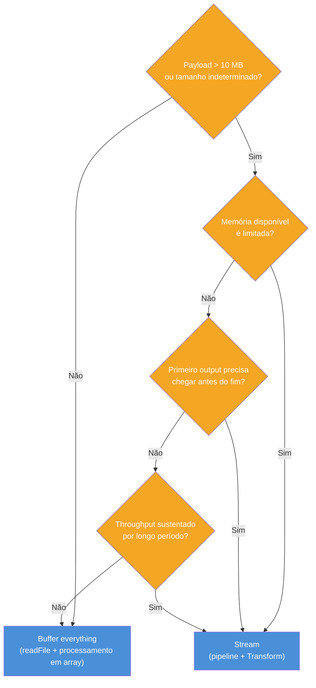

# Performance e tuning

> [!abstract] TL;DR
> Streams têm overhead constante por chunk. Para payloads pequenos (<10 MB), "buffer everything" é mais rápido — menos overhead, menos alocações. Em transforms síncronos triviais, o custo de criar um Transform supera o de um `.map()` em array. `highWaterMark` raramente precisa de tuning — o default de 16 KB (binary) e 16 objects está certo na maioria dos casos. A regra: **medir antes de tunar**. Princípios envelhecem melhor do que números absolutos.

---

## Fundamento teórico

A pergunta correta não é "streams são mais rápidos?" — é "em que dimensão streams ganham?". Streams são uma solução de **trade-off**:

- Trocam **memória** por **overhead por chunk**: em vez de uma alocação grande, fazem N alocações pequenas com overhead de event dispatch, buffer management e callbacks.
- Ganham em **memória** e **latência de primeiro output** — mas não necessariamente em throughput de CPU.
- Perdem em **simplicidade** e **throughput bruto** quando os dados cabem confortavelmente em RAM.

O fluxo de decisão abaixo captura quando streams são a escolha certa:



Se nenhuma das condições que levam a "Stream" for verdadeira, `readFile` + processamento em array é mais simples, mais rápido, e mais fácil de testar.

---

## O que é

Performance de streams é a análise de quando streams ganham, quando perdem, e o que afeta o throughput real em produção.

Streams **não são** universalmente mais rápidos. Eles trocam latência de primeira resposta e uso de memória por overhead constante por chunk. Em datasets pequenos, o overhead supera o benefício. Em datasets grandes ou em pipelines de longa duração, streams vencem.

A tabela de trade-offs:

| Dimensão | Buffer everything | Streaming |
|---|---|---|
| Uso de memória | O(N) — cresce com os dados | O(chunkSize) — constante |
| Overhead por operação | Uma alocação grande | N alocações pequenas + overhead de chunk |
| Throughput sustentado (payload grande) | Limitado pela heap | Alto — não depende de carregar tudo |
| Casos pequenos (<10 MB) | Mais rápido | Overhead pode superar benefício |
| View global (sort, dedup) | Natural — todos os dados na memória | Difícil — precisa materializar mesmo assim |
| Composição | Encadeia arrays | Encadeia Transforms em pipeline |

A conclusão prática: streams resolvem um problema de **escala** e de **throughput sustentado**. Usar streams para processar uma lista de 200 registros é cargo cult — sem benefício real, com overhead adicional.

---

## Por que importa

"Vou usar streams porque é mais eficiente" sem medir é **cargo cult**. Streams têm custo. Um Transform cria um objeto, instancia um buffer interno, engaja o mecanismo de backpressure, e injeta callbacks em cada chunk. Se o payload tem 5 KB, esse overhead pode ser maior do que a operação em si.

Senior mede ou justifica. As perguntas corretas antes de introduzir streaming:

1. O payload pode exceder a memória disponível? (sim → stream justificado)
2. O primeiro output precisa chegar antes que a operação complete? (sim → stream justificado)
3. O throughput precisa ser sustentado por tempo longo? (sim → stream justificado)
4. É uma transformação pontual em dados que cabem confortavelmente em memória? (sim → buffer everything pode ser melhor)

Se nenhuma das três primeiras perguntas tem resposta "sim", reveja se stream é a ferramenta certa para o caso.

---

## Como funciona

### 1. Quando streams NÃO ajudam

Quatro casos em que buffer everything é a escolha correta:

**Payloads pequenos.** Se o payload cabe em memória e o processamento é pontual, o overhead de stream supera o benefício. Streams introduzem alocações, callbacks e overhead de mecanismo de controle de fluxo por chunk. Para 10 MB ou menos, `readFile` + processamento em memória é tipicamente mais rápido e mais simples.

```js
// Para dados que cabem em memória: direto ao ponto
import { readFile } from 'node:fs/promises';

const raw = await readFile('config.json', 'utf8');
const config = JSON.parse(raw);
const transformed = config.items.map((item) => ({ ...item, processed: true }));
// Simples, legível, sem overhead de stream
```

**Transform síncrono trivial.** Um Transform que faz apenas um `JSON.parse` ou uma substituição de string tem custo fixo elevado em relação ao trabalho que realiza. Um `.map()` em array é mais rápido para esses casos porque não tem overhead de eventos, callbacks, ou buffer management.

```js
// Comparação: Transform vs map para operação trivial

// Opção A — com stream Transform (overhead mais alto)
import { Transform } from 'node:stream';

const upperCaseTransform = new Transform({
  objectMode: true,
  transform(chunk, _enc, callback) {
    callback(null, chunk.toUpperCase());
  },
});

// Opção B — com map em array (overhead mais baixo para arrays pequenos)
const result = ['a', 'b', 'c'].map((s) => s.toUpperCase());
// Para N pequeno, Opção B é mais rápida
```

**Operações que precisam de view global.** Sort total, dedup, join entre duas coleções — essas operações precisam de todos os dados em memória para funcionar. Usar stream aqui não elimina a materialização; você apenas a adia. Se o resultado precisa ser ordenado, você vai materializar um array de qualquer forma.

```js
// Sort em stream: você materializa de qualquer modo
import { pipeline } from 'node:stream/promises';
import { Writable } from 'node:stream';

const collected = [];
await pipeline(
  createReadStream('dados.ndjson'),
  new LineParser(),
  new Writable({
    objectMode: true,
    write(obj, _enc, cb) {
      collected.push(JSON.parse(obj)); // materializa mesmo assim
      cb();
    },
  })
);
collected.sort((a, b) => a.score - b.score);
// Poderia ter lido o arquivo inteiro e feito tudo em memória com menos overhead
```

**Lookups paralelos por chunk.** Se cada chunk de um stream requer uma chamada de I/O (ex: lookup em banco por ID), é difícil paralelizar dentro de uma pipeline de stream linear. O Transform processa um chunk de cada vez — você perde a oportunidade de fazer N lookups em paralelo com `Promise.all`. Para esse padrão, batch processing em memória com `Promise.all` é mais eficiente.

---

### 2. `highWaterMark` tuning

`highWaterMark` é o tamanho do buffer interno de cada stream — o ponto em que backpressure é sinalizado.

**Defaults:**
- Streams binários: **16 KB** (`16 * 1024 = 16384 bytes`)
- Object mode: **16 objects**

Os defaults estão certos na **maioria dos casos**. Eles existem para equilibrar latência e throughput em casos gerais. Tunar sem medir pode mascarar bugs ou piorar a situação.

```js
import { createReadStream, createWriteStream } from 'node:fs';
import { pipeline } from 'node:stream/promises';

// Default — certo para a maioria dos casos
await pipeline(
  createReadStream('input.bin'),
  createWriteStream('output.bin')
);

// highWaterMark maior — throughput sustentado em I/O lento (ex: rede com latência alta)
await pipeline(
  createReadStream('input.bin', { highWaterMark: 256 * 1024 }), // 256 KB
  createWriteStream('output.bin', { highWaterMark: 256 * 1024 })
);

// highWaterMark menor — latência baixa em pipeline interativo (ex: SSE, audio)
await pipeline(
  createReadStream('audio.pcm', { highWaterMark: 4 * 1024 }), // 4 KB
  createWriteStream('/dev/stdout', { highWaterMark: 4 * 1024 })
);
```

**Quando subir o `highWaterMark`:**
- Throughput sustentado em I/O com latência alta (rede lenta, disco em RAID degradado)
- O profiler mostra que o buffer fica vazio frequentemente enquanto o producer ainda tem dados — sinal de que backpressure está disparando cedo demais

**Quando baixar o `highWaterMark`:**
- Pipeline interativo onde latência de cada chunk importa (SSE, audio streaming em tempo real)
- Você precisa que cada chunk seja entregue ao consumer o mais rápido possível, mesmo que isso reduza throughput agregado

**A regra inviolável:** medir antes de tunar. Use `writableLength` e `writableNeedDrain` para inspecionar o estado do buffer em runtime antes de ajustar o `highWaterMark`.

```js
// Inspecionando o estado do buffer em runtime
const ws = createWriteStream('output.bin', { highWaterMark: 64 * 1024 });

ws.on('drain', () => {
  console.log({
    highWaterMark: ws.writableHighWaterMark,
    currentLength: ws.writableLength,
    needsDrain: ws.writableNeedDrain,
  });
});
```

---

### 3. Sync vs async transforms

Transforms podem ser síncronos (callback chamado imediatamente) ou assíncronos (callback chamado após operação async).

**Sync transform** — sem overhead de Promise:

```js
import { Transform } from 'node:stream';

// Sync: callback chamado imediatamente
// Mais rápido — sem alocação de Promise, sem tick de microtask
const grepTransform = new Transform({
  objectMode: true,
  transform(line, _enc, callback) {
    if (line.includes('ERROR')) {
      callback(null, line); // emite de forma síncrona
    } else {
      callback(); // descarta sem emitir
    }
  },
});
```

**Async transform** — com overhead de operação assíncrona:

```js
// Async: callback chamado após await
// Mais lento — alocação de Promise, microtask queue, overhead de async
const enrichTransform = new Transform({
  objectMode: true,
  async transform(record, _enc, callback) {
    try {
      const extra = await fetchFromDatabase(record.id); // I/O async
      callback(null, { ...record, ...extra });
    } catch (err) {
      callback(err);
    }
  },
});
```

**A regra prática para transforms:**

| Duração do transform | Tipo recomendado | Motivo |
|---|---|---|
| < ~1ms (parse, filter, map simples) | Sync | Sem overhead de Promise |
| > ~1ms ou I/O envolvido | Async | Evita bloquear o event loop |

> [!danger] Transform síncrono que demora > 1ms
> Um transform síncrono que bloqueia por 5ms por chunk parece inofensivo isolado. Com 100 requisições simultâneas e um arquivo de 10.000 chunks, são 50 segundos de bloqueio acumulado no event loop. Não há erro, não há exceção — apenas latência degradada em todas as outras requisições do processo.

Se o transform é CPU-bound e demora mais do que alguns milissegundos, considere mover o processamento para um Worker Thread (ver `[[Paralelismo]]`).

---

### 4. Princípios > benchmarks

Benchmarks específicos envelhecem rapidamente — cada nova versão do V8 ou do Node pode mudar os números. Os princípios são mais duráveis:

**Overhead de stream é constante por chunk.** Independente do tamanho total do dataset, cada chunk passa pelo mecanismo de evento, buffer e callback. Para N chunks pequenos, esse overhead se multiplica N vezes.

**Throughput depende de chunk size e da cadeia de operações.** Chunks maiores = menos callbacks = menos overhead. Chunks menores = menor latência de primeiro output. O default de 16 KB equilibra os dois.

**Streams ganham quando o gargalo é memória ou latência de primeira resposta, não CPU.** Se o gargalo é CPU (transform pesado), streams não ajudam — você precisa de paralelismo (Worker Threads, cluster, ou processos separados).

**Comparação indicativa de casos gerais (princípios, não números absolutos):**

| Cenário | Buffer everything | Streaming | Vencedor |
|---|---|---|---|
| Arquivo < 10 MB, transform simples | Rápido, simples | Overhead de stream | Buffer everything |
| Arquivo > 500 MB | OOM ou lento (GC) | Throughput constante | Stream |
| Download de arquivo grande para disco | Toda a memória alocada | Chunk por chunk | Stream |
| Sort de 1M registros | Natural em memória | Materializa de qualquer forma | Buffer everything |
| SSE / LLM streaming | Não aplicável | Latência chunk por chunk | Stream |
| Upload multipart em Express | OOM sob carga | Chunk por chunk | Stream |

> [!info] Sobre esses números
> Os cenários acima são princípios baseados em comportamento conhecido do runtime — não benchmarks de hardware específico. Sempre meça no seu ambiente, com seu workload real.

---

### 5. Benchmark ilustrativo

Um benchmark confiável deve documentar:
- Versão do Node.js (`node --version`)
- Classe de hardware (CPU, RAM, tipo de disco)
- Tamanho e natureza do payload (binário vs. texto, número de registros)
- Número de iterações e warm-up
- O que está sendo medido (throughput em MB/s, latência de primeira resposta, uso de memória pico)

Setup mínimo de benchmark com `performance.now()`:

```js
// benchmark-stream-vs-buffer.js
import { readFile } from 'node:fs/promises';
import { createReadStream } from 'node:fs';
import { pipeline } from 'node:stream/promises';
import { Writable } from 'node:stream';

const FILE = './test-payload.bin';
const RUNS = 10;

async function benchmarkBuffer() {
  const start = performance.now();
  for (let i = 0; i < RUNS; i++) {
    const data = await readFile(FILE);
    // processamento simulado: conta bytes
    void data.length;
  }
  return (performance.now() - start) / RUNS;
}

async function benchmarkStream() {
  const start = performance.now();
  for (let i = 0; i < RUNS; i++) {
    let bytes = 0;
    await pipeline(
      createReadStream(FILE),
      new Writable({
        write(chunk, _enc, cb) {
          bytes += chunk.length; // "processamento"
          cb();
        },
      })
    );
    void bytes;
  }
  return (performance.now() - start) / RUNS;
}

const bufMs = await benchmarkBuffer();
const strMs = await benchmarkStream();

console.log(`Buffer everything: ${bufMs.toFixed(2)}ms/run`);
console.log(`Streaming:         ${strMs.toFixed(2)}ms/run`);
console.log(`Ratio:             ${(strMs / bufMs).toFixed(2)}x`);
```

A conclusão esperada para payloads pequenos (<5 MB): buffer everything ganha (ratio < 1, ou seja, streaming é mais lento). Para payloads grandes e com restrição de memória, streaming vence em memória pico mesmo que o tempo de CPU seja similar.

---

## Na prática

Três regras para o dia a dia:

**Regra 1: Default `highWaterMark` na maioria dos casos.** Só ajuste depois de medir com `writableLength` / `writableNeedDrain` e confirmar que o buffer está sistematicamente vazio (producer rápido, consumer lento com I/O).

```js
// Default — começa aqui
const ws = createWriteStream('output.bin');
// Só muda se o profiler mostrar problema concreto
```

**Regra 2: Subir `highWaterMark` só quando o profile confirmar que o buffer está vazio com producer ativo.**

```js
// Evidência no profile: writableLength === 0 frequentemente enquanto há dados
// Diagnóstico: backpressure está disparando cedo demais
// Ação: aumentar highWaterMark no gargalo
const ws = createWriteStream('output.bin', { highWaterMark: 128 * 1024 });
```

**Regra 3: Transform CPU-bound → Worker Thread + stream.**

```js
// Transform que demora > 1ms de CPU → mover para Worker Thread
// A pipeline continua, mas o trabalho pesado sai do event loop principal
import { Worker } from 'node:worker_threads';

// Em vez de um Transform síncrono pesado:
// new Transform({ transform(chunk, enc, cb) { pesadíssimo(chunk); cb(); } })

// Use Worker Thread pra o trabalho pesado e passe os resultados de volta
// (ver nota de Paralelismo para o pattern completo)
```

---

## Armadilhas comuns

> [!warning] Tunar `highWaterMark` sem medir — pode mascarar bug
> **O que acontece:** a lentidão do pipeline persiste ou a memória aumenta; o ajuste não resolve nada.
> **Por quê:** aumentar `highWaterMark` reduz a frequência de backpressure. Se a lentidão é causada por um consumer lento (I/O degradado, query sem índice, chamada HTTP com timeout), aumentar o buffer apenas adia o problema e aumenta o uso de memória.
> **Como evitar:** medir com `writableNeedDrain` e `writableLength` antes de qualquer ajuste. Confirmar que o buffer está sistematicamente vazio (producer rápido) antes de aumentar o `highWaterMark`.

> [!warning] Assumir que stream é sempre mais rápido — overhead em casos pequenos
> **O que acontece:** código com streams para processar 100 registros ou arquivos de 2 MB é mais lento e mais difícil de entender do que o equivalente com `readFile` + `.map()`.
> **Por quê:** para payloads que cabem em memória (<10 MB), o overhead de evento, buffer e callback por chunk supera o benefício. Não há ganho de memória se os dados cabem — só há overhead extra.
> **Como evitar:** usar o fluxo de decisão: payload pequeno + operação pontual → buffer everything. Streams são para escala e throughput sustentado.

> [!warning] Transform síncrono com > 1ms de CPU — bloqueio invisível do event loop
> **O que acontece:** todas as outras requisições do processo ficam com latência elevada; não há exceção nem log de erro — apenas degradação silenciosa.
> **Por quê:** `_transform` síncrono bloqueia a thread JS durante sua execução. Um parse de 5ms por chunk × 10.000 chunks = 50 segundos de bloqueio acumulado no event loop.
> **Como evitar:** usar `async _transform` com `await setImmediate()` para yields periódicos quando há CPU pesada, ou mover o processamento para Worker Thread quando o transform exceder consistentemente 1ms.

> [!warning] Misturar sync e async transforms — gargalo invisível na pipeline
> **O que acontece:** o Transform sync produz na velocidade máxima, mas a pipeline fica tão lenta quanto o Transform async mais lento; memória cresce se o buffer absorver a diferença.
> **Por quê:** um Transform sync seguido de um Transform async que aguarda banco de dados por chunk cria backpressure assimétrico. O sync acumula chunks no buffer do async enquanto o async drena um por vez.
> **Como evitar:** dimensionar o `highWaterMark` do Transform async para refletir a capacidade real de processamento, ou usar batching — acumular N chunks no sync e processar N em paralelo no async com `Promise.all`.

> [!warning] `highWaterMark` em object mode não representa bytes
> **O que acontece:** buffers efetivos variam de 16 bytes a dezenas de MB dependendo do tamanho médio dos objetos — sem nenhum aviso.
> **Por quê:** object mode conta objetos, não bytes. Com default de 16 objetos: se cada objeto tem 10 KB, o buffer efetivo é 160 KB; se cada objeto tem 1 MB, o buffer efetivo é 16 MB.
> **Como evitar:** em pipelines de object mode com objetos grandes, calcular o buffer efetivo esperado e ajustar `highWaterMark` para um número menor de objetos que represente a capacidade de memória desejada.

---

## Casos práticos

### Cenário 1 — Diagnóstico de pipeline lenta com métricas de buffer

Um serviço de processamento de eventos estava lento sem erro visível. O primeiro passo é instrumentar o pipeline para entender onde está o gargalo.

```javascript
// diagnose-pipeline.js
import { createReadStream, createWriteStream } from 'node:fs';
import { Transform, pipeline as pipelineCb } from 'node:stream';
import { promisify } from 'node:util';

const pipeline = promisify(pipelineCb);

// Transform instrumentado — emite métricas de buffer em cada chunk
class InstrumentedTransform extends Transform {
  constructor(name, inner, options = {}) {
    super(options);
    this._name = name;
    this._inner = inner;
    this._chunkCount = 0;
  }

  _transform(chunk, enc, callback) {
    const start = performance.now();
    this._chunkCount++;

    // Delega para o transform interno
    this._inner._transform.call(this, chunk, enc, (err, result) => {
      const elapsed = performance.now() - start;

      // Métricas de buffer e throughput
      if (this._chunkCount % 1000 === 0) {
        console.log({
          transform: this._name,
          chunk: this._chunkCount,
          elapsedMs: elapsed.toFixed(2),
          writableLength: this.writableLength,
          writableHighWaterMark: this.writableHighWaterMark,
          bufferUtilization: `${((this.writableLength / this.writableHighWaterMark) * 100).toFixed(1)}%`,
        });
      }

      callback(err, result);
    });
  }
}

// Writable que rastreia se precisa de drain frequentemente
const destination = createWriteStream('output.bin');
let drainCount = 0;
destination.on('drain', () => {
  drainCount++;
  console.log(`drain #${drainCount} — buffer estava cheio, consumer mais lento que producer`);
});

await pipeline(
  createReadStream('large-input.bin', { highWaterMark: 64 * 1024 }),
  destination,
);

console.log(`Total de drains: ${drainCount}`);
// drainCount alto → producer rápido, consumer lento → candidato a aumentar highWaterMark
// drainCount zero → sem backpressure → highWaterMark pode ser reduzido sem custo
```

O diagnóstico revela: se `drainCount` é alto, o consumer é mais lento que o producer — aumentar `highWaterMark` pode ajudar. Se `bufferUtilization` fica sempre próxima de 0%, o buffer está superdimensionado.

### Cenário 2 — Pipeline de compressão com highWaterMark ajustado para throughput

Um serviço de backup faz download de arquivos de log da rede e os comprime para S3. A latência de rede alta faz o producer ficar mais rápido que o consumer — cenário clássico para ajuste de `highWaterMark`.

```javascript
// backup-compress.js
import { Readable } from 'node:stream';
import { pipeline } from 'node:stream/promises';
import { createGzip } from 'node:zlib';
import { createWriteStream } from 'node:fs';

async function backupWithTuning(downloadUrl, destPath) {
  const response = await fetch(downloadUrl);
  if (!response.ok) throw new Error(`HTTP ${response.status}`);

  // highWaterMark maior para compensar latência de rede alta
  // → menos drains, menos paradas do producer, throughput mais uniforme
  const nodeStream = Readable.fromWeb(response.body);

  const gzip = createGzip({
    level: 6,           // compressão balanceada (default)
    chunkSize: 32768,   // chunks de 32 KB na saída comprimida
  });

  // highWaterMark elevado no destino final também
  const writer = createWriteStream(destPath, {
    highWaterMark: 256 * 1024, // 256 KB — permite burst de escrita sem drain frequente
  });

  const startTime = performance.now();
  let bytesIn = 0;

  nodeStream.on('data', (chunk) => { bytesIn += chunk.length; });

  await pipeline(nodeStream, gzip, writer);

  const elapsed = (performance.now() - startTime) / 1000;
  console.log({
    bytesIn,
    elapsed: `${elapsed.toFixed(2)}s`,
    throughput: `${(bytesIn / elapsed / 1024 / 1024).toFixed(1)} MB/s`,
  });
}

await backupWithTuning('https://logs.example.com/service-2026-06-28.log', './backup.log.gz');
```

O ajuste de `highWaterMark` para 256 KB no destino reduz a frequência de drains, mantendo o producer ativo por mais tempo entre pausas de backpressure — especialmente útil quando o destino é disco local e o producer é rede.

---

## Em entrevista

**Frase pronta:**

> "Stream performance is counterintuitive. There's a constant overhead per chunk — event dispatch, buffer management, callback overhead. For small payloads, buffer-everything is faster because you avoid that per-chunk cost. The signal that streams win is sustained throughput on large payloads where memory is the bottleneck. The `highWaterMark` is the threshold for the internal buffer — default 16KB binary, 16 objects in object mode — and it rarely needs tuning. The case for increasing it is sustained I/O where the buffer drains frequently because the producer is faster than the consumer. Synchronous transforms are faster than async ones because there's no Promise overhead, but a synchronous transform that takes longer than a millisecond blocks the event loop, which cascades across all requests. If the transform is CPU-bound and takes time, move it to a Worker Thread. The rule of thumb: measure before tuning, and reach for streams when memory or sustained throughput is the bottleneck, not by default."

**Vocabulário:**

| PT-BR | EN |
|---|---|
| overhead constante | constant overhead |
| throughput sustentado | sustained throughput |
| tunagem / ajuste fino | tuning |
| transformação síncrona | synchronous transform |
| bloqueio invisível | invisible blocking |
| marca d'água | high water mark |
| chunk | chunk |
| materializar | materialize |
| cargo cult | cargo cult |
| perfil / profiling | profiling |

**Perguntas que podem vir:**

*"Quando streams são mais lentos do que buffer everything?"*
→ Para payloads pequenos que cabem em memória (<10 MB típico), o overhead constante por chunk — eventos, callbacks, buffer management — supera o benefício. Buffer everything em um array e processe com `.map()` / `.filter()`.

*"O que você ajusta quando um pipeline de stream está lento?"*
→ Primeiro, mede: `writableLength` (buffer cheio ou vazio?), `writableNeedDrain` (backpressure frequente?), `process.memoryUsage()` (heap crescendo?). Depois, identifica o gargalo: producer lento, consumer lento, ou transform CPU-bound. Tunar `highWaterMark` é o último recurso, não o primeiro.

*"Por que transforms síncronos podem ser um problema?"*
→ Um `_transform` síncrono que demora >1ms bloqueia o event loop durante a execução. Com alta concorrência, isso degrada latência de todas as requisições do processo. O problema não aparece em testes com poucos dados — aparece em produção com volume.

*"Como você debugaria uso de memória crescente em um pipeline de streams?"*
→ Verifico se backpressure está sendo respeitado (`writableNeedDrain`), se o `highWaterMark` foi aumentado sem necessidade (buffer grande acumulando), e se algum Transform está materializando tudo em memória em vez de emitir chunk a chunk.

---

## O que vem a seguir

Com o entendimento de performance e tuning, o galho de Streams se encerra com a nota de consolidação — armadilhas top 10+, cheatsheet de decisão e vocabulário completo:

- `[[12 - Armadilhas, regras práticas, cheatsheet]]` — referência rápida de produção: decision tree, top 10+ armadilhas e vocabulário PT↔EN consolidado

---

## Fontes

- [Node.js — stream.Writable writableLength](https://nodejs.org/api/stream.html#writablewritablelength) — documentação de `writableLength`, `writableNeedDrain` e `writableHighWaterMark` para diagnóstico de buffer
- [Node.js — zlib performance](https://nodejs.org/api/zlib.html#compressing-http-requests-and-responses) — orientações de performance para compressão com streams, incluindo `highWaterMark` e `chunkSize`
- [Node.js — Worker Threads](https://nodejs.org/api/worker_threads.html) — alternativa para transforms CPU-bound que bloqueariam o event loop

---

## Veja também

- `[[06 - Backpressure]]` — `highWaterMark`, `writableLength`, sinal `.write()` boolean
- `[[10 - Padrões práticos]]` — recipes de produção: line parser, CSV, multipart, fetch streaming
- `[[12 - Armadilhas, regras práticas, cheatsheet]]` — consolidação final do galho
- `[[Runtime e Event Loop]]` — galho 1: event loop e por que transform síncrono longo é problemático
- `[[Paralelismo]]` — galho 2: Worker Thread + stream para transform CPU-bound
- `[[Node.js]]` — tronco: panorama do runtime

---

## Rubric

| Critério | Status |
|---|---|
| TL;DR cobre princípio central (overhead constante, medir antes de tunar) | OK |
| Quando streams NÃO ajudam — 4 casos com justificativa | OK |
| `highWaterMark` defaults corretos (16 KB binary, 16 objects) | OK |
| Quando subir vs. baixar `highWaterMark` | OK |
| Sync vs async transform — custo e regra de > 1ms | OK |
| Princípios > benchmarks — tabela de cenários com ressalva explícita | OK |
| Benchmark setup descrito (não números absolutos) | OK |
| Na prática — 3 regras acionáveis | OK |
| Armadilhas (5) com explicação de por que não é óbvio | OK |
| Frase pronta em EN para entrevista | OK |
| Vocabulário PT-BR ↔ EN (10 termos) | OK |
| Perguntas frequentes com respostas diretas | OK |
| Veja também com wikilinks corretos | OK |
| Sem fabricação de dados/clientes/experiências reais | OK |
| Fabrication rule: padrões genéricos, sem números absolutos que envelhecem | OK |
