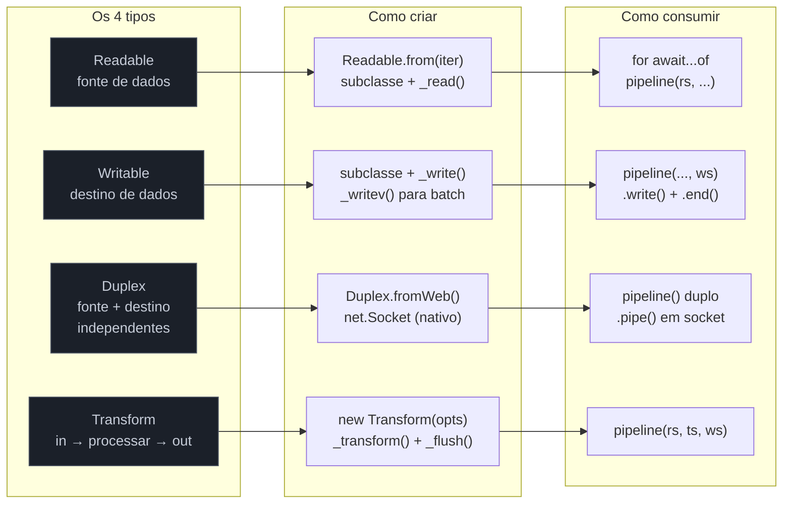

# Armadilhas, regras práticas, cheatsheet

> [!abstract] TL;DR
> Nota de fechamento do galho 3. Consolida as armadilhas mais críticas de streams em Node (top 10+), uma tabela 4 tipos × 5 atributos, uma decision tree compacta para escolher a API certa, e vocabulário PT→EN com 22 termos. Sem duplicar o conteúdo das notas anteriores — esta é a referência rápida, o "cola" de produção.

---

## Panorama visual

Um mapa dos 4 tipos de stream, suas APIs de criação e consumo — antes de entrar nas armadilhas:



---

## Armadilhas comuns

### 1. Ignorar o boolean de `.write()` → memory leak

`.write()` retorna `false` quando o buffer interno excede `highWaterMark`. Ignorar esse retorno faz o buffer crescer sem limite.

```js
// ERRADO
ws.write(chunk); // retorno ignorado — buffer explode em volume alto

// CORRETO
if (!ws.write(chunk)) {
  await once(ws, 'drain'); // ou: await new Promise(r => ws.once('drain', r))
}
```

**Fix em uma linha:** `if (!ws.write(x)) await once(ws, 'drain')`

---

### 2. `.pipe()` sem error handler em cada stream → leak silencioso

`.pipe()` não propaga erros. Se qualquer stream da cadeia emitir `'error'`, os demais ficam abertos — file descriptors vazam até EMFILE.

```js
// ERRADO
source.pipe(transform).pipe(destination);
// transform errar → source e destination ficam abertos

// CORRETO
await pipeline(source, transform, destination);
```

**Fix em uma linha:** substitua `.pipe()` por `await pipeline(...)` de `stream/promises`

---

### 3. Esquecer `.end()` em Writable → consumer espera para sempre

Sem `.end()`, o evento `'finish'` nunca dispara. Qualquer `await finished(ws)` ou pipeline downstream fica bloqueado indefinidamente.

```js
// ERRADO
function writeData(ws, data) {
  ws.write(data);
  // faltou: ws.end()
}

// CORRETO — use pipeline() que cuida do end, ou chame .end() explicitamente
ws.write(data);
ws.end();
```

**Fix em uma linha:** use `pipeline()` (que chama `end` automaticamente), ou sempre pareie `write` com `end`

---

### 4. Recursão em `_transform` → stack overflow

Chamar `this._transform()` ou `this.write()` dentro de `_transform` cria recursão que esgota a call stack.

```js
// ERRADO
_transform(chunk, enc, cb) {
  if (needsReprocess(chunk)) {
    this._transform(chunk, enc, cb); // recursão direta
  }
  // ...
}

// CORRETO — use estrutura iterativa ou emita e deixe o runtime chamar _transform
_transform(chunk, enc, cb) {
  const result = processIteratively(chunk);
  this.push(result);
  cb();
}
```

**Fix em uma linha:** nunca chame `this._transform()` dentro de `_transform` — use loop, acumulador, ou `_flush`

---

### 5. Object mode esquecido em parser → chunks viram strings concatenadas

Um Transform que emite objetos mas foi criado sem `objectMode: true` serializa os objetos via `.toString()`, concatenando `[object Object]` no stream.

```js
// ERRADO
class MeuParser extends Transform {
  // sem objectMode — chunks são Buffer, não objetos
  _transform(chunk, enc, cb) {
    cb(null, JSON.parse(chunk.toString())); // emite objeto sem objectMode
  }
}

// CORRETO
class MeuParser extends Transform {
  constructor() {
    super({ readableObjectMode: true }); // saída em object mode
  }
  _transform(chunk, enc, cb) {
    cb(null, JSON.parse(chunk.toString()));
  }
}
```

**Fix em uma linha:** `super({ objectMode: true })` no constructor (ou `readableObjectMode: true` se só a saída é objeto)

---

### 6. `pipeline()` async sem `await` → UnhandledRejection

`pipeline` de `stream/promises` retorna uma Promise. Sem `await`, erros viram `UnhandledPromiseRejection` — em Node 15+, isso encerra o processo com código 1.

```js
// ERRADO
pipeline(source, transform, destination); // promise ignorada

// CORRETO
await pipeline(source, transform, destination);
// ou: pipeline(...).catch(handleError)
```

**Fix em uma linha:** sempre `await pipeline(...)` ou `.catch(handleError)` explícito

---

### 7. Transform síncrono lento (> 1 ms) → bloqueio invisível do event loop

`_transform` síncrono bloqueia a thread JS durante sua execução. Um parse de 5 ms por chunk × 10.000 chunks = 50 s de bloqueio acumulado. Não há exceção — apenas degradação de latência em todo o processo.

```js
// ERRADO — JSON.parse de payload grande é síncrono e pode bloquear > 1ms
_transform(chunk, enc, cb) {
  const obj = JSON.parse(chunk.toString()); // pode ser > 1ms para payloads grandes
  cb(null, obj);
}

// CORRETO — use async se o parse for pesado, ou divida em batches menores
async _transform(chunk, enc, cb) {
  const obj = JSON.parse(chunk.toString());
  await setImmediatePromise(); // yield para o event loop
  cb(null, obj);
}
```

**Fix em uma linha:** se `_transform` demora > 1 ms de CPU, mova para Worker Thread ou use `await setImmediate()`

---

### 8. `_flush` ausente em parser → último chunk perdido

Parsers acumulam estado entre chunks (ex.: linha parcial sem `\n`). Sem `_flush`, esse estado residual é descartado quando o stream encerra — a última linha ou o último registro nunca é emitido.

```js
// ERRADO — sem _flush, this.#buffer residual é perdido
class LineParser extends Transform {
  #buffer = '';
  _transform(chunk, enc, cb) {
    this.#buffer += chunk.toString();
    const lines = this.#buffer.split('\n');
    this.#buffer = lines.pop() ?? '';
    for (const l of lines) this.push(l);
    cb();
  }
  // _flush ausente → última linha sem '\n' nunca emitida
}

// CORRETO
_flush(cb) {
  if (this.#buffer) this.push(this.#buffer);
  cb();
}
```

**Fix em uma linha:** implemente `_flush(cb)` em todo Transform que mantém buffer interno

---

### 9. `Readable.from()` com iterable que lança → erro não propagado sem handler

Se o iterable ou async generator fornecido para `Readable.from()` lançar uma exceção, o stream emite `'error'`. Sem listener de erro, o processo cai com uncaughtException.

```js
// ERRADO — sem handler de erro no stream criado por Readable.from()
async function* gen() {
  yield 'dado';
  throw new Error('falha no generator');
}
const rs = Readable.from(gen());
rs.on('data', process); // sem 'error' handler → crash

// CORRETO
const rs = Readable.from(gen());
rs.on('error', (err) => handleError(err));
rs.on('data', process);
// ou: use pipeline() que propaga o erro automaticamente
await pipeline(Readable.from(gen()), destination);
```

**Fix em uma linha:** sempre registre `.on('error', handler)` em streams criados por `Readable.from()`, ou use `pipeline()`

---

### 10. Usar `push(null)` como sinal de meio de stream → rompe o protocolo

`push(null)` **encerra** o Readable. Qualquer `push()` após `push(null)` é ignorado ou lança erro. Não existe "payload null" em Node Streams — `null` é exclusivamente o sinal de EOF.

```js
// ERRADO — tentativa de usar null como "fim de lote" dentro do stream
_read() {
  for (const item of batch) {
    this.push(item);
  }
  this.push(null); // ERRO: encerra o stream prematuramente, não o lote
  // ...continua gerando dados depois — vai falhar
}

// CORRETO — use um valor sentinela de domínio (objeto, string vazia, etc.)
// ou estruture o stream para não precisar de sentinela intermediário
_read() {
  const item = this.source.next();
  if (item.done) {
    this.push(null); // único uso correto: fim do stream
  } else {
    this.push(item.value);
  }
}
```

**Fix em uma linha:** `push(null)` apenas uma vez, no final de `_read`, para sinalizar EOF definitivo

---

### 11. (bônus) `.tee()` em Web Stream com consumers em velocidades assimétricas → consumer lento bloqueia o rápido

`ReadableStream.tee()` bifurca um stream em dois. O mais lento determina o ritmo — o mais rápido fica parado esperando o mais lento drenar o buffer interno compartilhado. Em streams grandes, isso causa acúmulo de memória.

```js
const [rapido, lento] = bigStream.tee();

// rapido processa em 1ms/chunk; lento processa em 100ms/chunk
// → rapido fica bloqueado 99ms por chunk esperando lento
// → buffer interno cresce proporcionalmente à velocidade assimétrica

// Fix: garantir que os consumers processem em velocidade compatível
// ou evitar tee() e usar um TransformStream de multicast com controle explícito
```

**Fix em uma linha:** evite `tee()` quando os consumers têm velocidades muito diferentes — use processamento sequencial ou um TransformStream de fan-out com backpressure explícito

---

### 12. (bônus) `cork()` sem `uncork()` correspondente → buffer cresce sem flush

`cork()` é contado: cada `cork()` exige um `uncork()`. Chamar `cork()` N vezes e `uncork()` N-1 vezes faz o buffer nunca descarregar.

```js
// ERRADO — cork sem uncork
ws.cork();
ws.write('a');
ws.write('b');
// uncork() esquecido — dados ficam no buffer indefinidamente

// CORRETO — sempre parear
ws.cork();
ws.write('a');
ws.write('b');
process.nextTick(() => ws.uncork()); // descarga no próximo tick
```

**Fix em uma linha:** sempre parear cada `cork()` com `uncork()`, preferencialmente via `process.nextTick(() => ws.uncork())`

---

## Cheatsheet — 4 tipos × 5 atributos

| Atributo | Readable | Writable | Duplex | Transform |
|---|---|---|---|---|
| **API principal** | `.read()`, `for await...of` | `.write()`, `.end()` | ambos, independentes | herda Duplex inteiro |
| **Implementação custom** | `_read(size)` + `push(chunk)` + `push(null)` | `_write(chunk, enc, cb)` | `_read` + `_write` (canais independentes) | `_transform(chunk, enc, cb)` + opcional `_flush(cb)` |
| **Eventos-chave** | `data`, `readable`, `end`, `error`, `close` | `drain`, `finish`, `error`, `close` | união dos anteriores (dois buffers) | união dos anteriores (buffers conectados via `_transform`) |
| **Exemplo canônico** | `fs.createReadStream`, `process.stdin`, `http.IncomingMessage` | `fs.createWriteStream`, `process.stdout`, `http.ServerResponse` | `net.Socket`, `tls.TLSSocket` | `zlib.createGzip()`, `crypto.createCipheriv()`, parsers custom |
| **Atalho moderno** | `Readable.from(iter)` | `await pipeline(...)` | `Duplex.fromWeb({ readable, writable })` | `new TransformStream(...)` (Web Streams) |

---

## Decision tree compactada — "qual API usar"

```
Vou consumir stream?
├─ Loop com lógica condicional por chunk (filtro, early exit, agregação)
│   → for await...of  +  try/catch
├─ Pipeline composta de transforms (decompress → parse → serialize → write)
│   → await pipeline(source, ...transforms, destination)
├─ Aguardar término de stream única já em andamento
│   → await finished(stream)
└─ Consumir body de fetch() → response.body já é AsyncIterable
    → for await...of  OU  Readable.fromWeb(response.body)

Vou criar stream?
├─ De um array ou iterable síncrono
│   → Readable.from(['a', 'b', 'c'])
├─ De um async generator (paginação, fetch sequencial, DB cursor)
│   → Readable.from(async function*() { ... }())
├─ Custom com lógica de I/O de baixo nível
│   → subclasse Readable + _read(size)
└─ Multi-runtime (browser / Deno / Bun / Cloudflare Workers)
    → new ReadableStream({ start(ctrl) { ctrl.enqueue(...) } })

Vou transformar dados?
├─ Pipeline linear simples (compress, encrypt, parse)
│   → Transform + await pipeline(...)
├─ Com lógica condicional por chunk
│   → async generator dentro de pipeline()
│     await pipeline(source, async function*(src) { for await (c of src) yield ... }, dest)
├─ Multi-runtime portável
│   → new TransformStream({ transform(chunk, ctrl) { ctrl.enqueue(...) } })
└─ Dois canais independentes (proxy, WebSocket, TCP)
    → Duplex (não Transform)

Vou diagnosticar problema de memória ou lentidão?
├─ Memória crescendo → backpressure ignorado?
│   → inspecione writableNeedDrain + writableLength
├─ Pipeline lento → highWaterMark muito baixo?
│   → inspecione se buffer frequentemente vazio com producer ativo
├─ Latência alta em todo o processo → transform síncrono longo?
│   → inspecione _transform: > 1ms → Worker Thread
└─ EMFILE (too many open files) → .pipe() sem error handler
    → migre para pipeline()
```

---

## Vocabulário PT→EN consolidado

| PT-BR | EN | Contexto |
|---|---|---|
| chunk | chunk | unidade de dado processada por vez pelo stream |
| throughput | throughput | taxa de dados processados por unidade de tempo |
| retroalimentação | backpressure | sinal do consumer para o producer desacelerar |
| evento drain | drain event | indica que o buffer do Writable esvaziou — seguro escrever novamente |
| encalhar | cork | acumular writes no buffer sem entregá-los ao destino |
| descarregar | uncork | entregar os writes acumulados de uma vez |
| modo flowing | flowing mode | Readable empurra chunks automaticamente via listener `'data'` |
| modo paused | paused mode | Readable aguarda pull explícito via `.read()` ou async iteration |
| modo objeto | object mode | chunks são objetos JS em vez de Buffer/string |
| pilha de chamadas | call stack | estrutura que rastreia chamadas de função ativas |
| pipeline | pipeline | sequência de streams conectadas para processamento em cadeia |
| propagação de erro | error propagation | repasse automático de erros ao longo da cadeia de streams |
| limpeza | cleanup | destruição de streams e liberação de recursos (fd, sockets) |
| sinal de aborto | AbortSignal | objeto que sinaliza cancelamento de operações assíncronas |
| sumidouro | sink | destino final dos dados em uma pipeline (ex: arquivo, socket) |
| fonte | source | origem dos dados em uma pipeline (ex: arquivo, request HTTP) |
| bifurcar | tee | dividir um stream em dois consumers independentes |
| multiplexação | multiplexing | combinar múltiplas fontes em um único stream de saída |
| padrão universal | universal standard | Web Streams API (WHATWG), suportada em múltiplos runtimes |
| portabilidade | portability | capacidade de rodar o mesmo código em Node, Deno, Bun, browser |
| interoperabilidade | interop | conversão entre Node Streams e Web Streams via `fromWeb`/`toWeb` |
| stream síncrono | sync stream | transform que processa chunk e chama callback sem operação assíncrona |

---

## Regras práticas (decisão rápida)

- **Default API:** `await pipeline(...)` de `stream/promises` para 90% dos casos em código novo.
- **Lógica imperativa por chunk:** `for await...of` + `try/catch`.
- **Criar source:** `Readable.from(iter)` supera subclasse para 95% dos casos.
- **Parser com estado:** sempre implementar `_flush(cb)`.
- **Backpressure:** verificar retorno de `.write()` em qualquer loop manual.
- **Object mode:** definir no constructor — é irreversível por instância.
- **`.pipe()` em código legado:** registrar `'error'` em CADA stream ou migrar para `pipeline()`.
- **Tuning de `highWaterMark`:** medir com `writableLength` e `writableNeedDrain` primeiro.
- **Transform lento:** > 1ms de CPU → Worker Thread.
- **Web Streams:** `fetch().body` já é Web Stream — use `Readable.fromWeb()` para conectar ao ecossistema Node.

---

## Casos práticos

### Cenário 1 — Refactoring de `.pipe()` legado para `pipeline()` moderno

Um serviço de exportação de relatórios usava `.pipe()` encadeado sem handlers de erro. Em produção, erros de rede causavam file descriptor leaks (EMFILE depois de horas). A refatoração aplica as armadilhas 1 e 2 desta nota.

```javascript
// ANTES — código legado com .pipe() e vazamento de fd em erro
import fs from 'node:fs';
import zlib from 'node:zlib';

function exportLegacy(src, dest) {
  // Nenhum handler de erro em nenhum stream
  // Se createGzip falhar: src e dest ficam abertos forever
  fs.createReadStream(src)
    .pipe(zlib.createGzip())
    .pipe(fs.createWriteStream(dest));
  // Sem retorno de Promise — caller não sabe quando termina ou se falhou
}

// DEPOIS — pipeline() com tratamento correto
import { createReadStream, createWriteStream } from 'node:fs';
import { createGzip } from 'node:zlib';
import { pipeline } from 'node:stream/promises';

async function exportModern(src, dest, signal) {
  await pipeline(
    createReadStream(src),
    createGzip(),
    createWriteStream(dest),
    { signal }, // suporte a AbortController para cancelamento
  );
  // pipeline() fecha todos os streams em caso de erro OU de abort
  // Promise rejeita com o erro propagado — caller pode fazer try/catch
}

// Uso com cancelamento por timeout
const controller = new AbortController();
const timeout = setTimeout(() => controller.abort(), 30_000); // 30s max

try {
  await exportModern('./data/report.csv', './exports/report.csv.gz', controller.signal);
} finally {
  clearTimeout(timeout);
}
```

A diferença crítica: `pipeline()` garante que **todos** os streams são destruídos quando qualquer um falha — eliminando o file descriptor leak da armadilha 2.

### Cenário 2 — Detectar e corrigir armadilha de `push(null)` prematuro em Readable custom

Um Readable personalizado para paginar uma API REST estava encerrando prematuramente após o primeiro lote de resultados. A causa era o `push(null)` sendo chamado ao final de cada página, em vez de só ao final de todas as páginas.

```javascript
// ERRADO — push(null) encerra o stream após a primeira página
class ApiPaginatedStream extends Readable {
  constructor(baseUrl) {
    super({ objectMode: true });
    this._url = baseUrl;
    this._page = 1;
    this._done = false;
  }

  async _read() {
    if (this._done) return;

    const response = await fetch(`${this._url}?page=${this._page}`);
    const { data, hasMore } = await response.json();

    for (const item of data) {
      this.push(item);
    }

    this._page++;

    // ERRO: push(null) aqui encerra o stream prematuramente se chamado cedo
    if (!hasMore) {
      this.push(null); // correto apenas quando hasMore === false
    }
    // Mas se o stream for chamado novamente antes de hasMore ser false,
    // pode acontecer push(null) antes de todas as páginas
  }
}

// CORRETO — a lógica está certa acima, mas a armadilha é chamar push(null)
// no meio de _read quando ainda há dados esperando. A versão segura:
class ApiPaginatedStreamSafe extends Readable {
  constructor(baseUrl) {
    super({ objectMode: true });
    this._url = baseUrl;
    this._cursor = null;
    this._exhausted = false;
  }

  async _read() {
    if (this._exhausted) return; // _read chamado depois de push(null) — ignorar

    try {
      const url = this._cursor
        ? `${this._url}?cursor=${this._cursor}`
        : this._url;

      const res = await fetch(url);
      const { data, nextCursor } = await res.json();

      for (const item of data) {
        this.push(item);
      }

      if (nextCursor) {
        this._cursor = nextCursor; // continua na próxima chamada a _read
      } else {
        this._exhausted = true;
        this.push(null); // EOF definitivo — única chamada
      }
    } catch (err) {
      this.destroy(err); // propaga erro corretamente
    }
  }
}

// Uso
const stream = new ApiPaginatedStreamSafe('https://api.example.com/events');
await pipeline(
  stream,
  new Transform({
    objectMode: true,
    transform(item, _enc, cb) { cb(null, JSON.stringify(item) + '\n'); }
  }),
  createWriteStream('./events.ndjson'),
);
```

O princípio da armadilha 10 resolvido: `push(null)` exatamente uma vez, no final definitivo, via `this.destroy(err)` para erros.

---

## Como explicar em inglês

### Frases prontas

> "Node Streams have four types: Readable for sources, Writable for sinks, Duplex for bidirectional channels like TCP sockets, and Transform for in-place processing. The modern API is `pipeline()` from `stream/promises` — it propagates errors automatically and destroys all streams on failure, preventing file descriptor leaks. The two most common production pitfalls are ignoring the boolean return of `.write()`, which causes memory leaks under backpressure, and using `.pipe()` without error handlers on each stream in the chain."

> "Backpressure in Node Streams works through the `highWaterMark`: when the internal buffer exceeds it, `.write()` returns `false`. The producer must pause and wait for the `drain` event before writing again. `pipeline()` handles this automatically — that's the main reason to prefer it over manual `.pipe()` chains. In practice, the default `highWaterMark` of 16KB for binary streams and 16 objects for object mode is correct for most cases."

> "The key rule for custom Transform streams is always implementing `_flush()` when you maintain state between chunks — like a line parser that accumulates partial lines in a buffer. Without `_flush`, the last incomplete chunk is silently dropped when the upstream source ends. `push(null)` signals end-of-stream and must be called exactly once, at the definitive end — calling it mid-stream terminates the Readable prematurely."

### Vocabulário PT↔EN para entrevista

| PT-BR | EN | Nota de uso |
|---|---|---|
| vazamento de descritor de arquivo | file descriptor leak | resultado de `.pipe()` sem error handler |
| rejeição não tratada | unhandled rejection | `pipeline()` sem `await` no Node 15+ encerra o processo |
| modo objeto | object mode | Transform que emite objetos JS em vez de Buffer/string |
| modo fluindo | flowing mode | Readable empurra chunks automaticamente via `'data'` |
| modo pausado | paused mode | Readable aguarda pull explícito via `.read()` |
| drenagem | drain | evento que sinaliza que o buffer do Writable esvaziou |
| sentinela de fim de stream | EOF sentinel / end-of-stream signal | `push(null)` — único uso correto é encerrar o Readable |
| lock de stream | locked stream | `ReadableStream.locked === true` após `getReader()` em Web Streams |
| chunk de bytes | byte chunk | dados binários — `Uint8Array` em Web Streams, `Buffer` em Node |

---

## O que vem a seguir

Este é o nó de fechamento do galho de Streams. Os próximos galhos aplicam esses padrões em contextos mais amplos:

- `[[03-Dominios/Tecnologia/Node/Streams/index]]` — MOC do galho 3: índice completo com todas as notas
- **Observability (galho 5)** — métricas de throughput, latência por chunk e alertas em pipelines lentos em produção
- **Frameworks (galho 4)** — como Express, Fastify e Hono expõem streams e onde aplicar os padrões deste galho
- **Segurança (galho 6)** — rate limiting de upload, validação de payload e sanitização no nível de stream

---

## Fontes

- [Node.js — stream module](https://nodejs.org/api/stream.html) — referência completa de todas as APIs: `Readable`, `Writable`, `Duplex`, `Transform`, `pipeline`, `finished`
- [Node.js — stream/promises](https://nodejs.org/api/stream.html#streampipelinestreams-callback) — `pipeline()` e `finished()` com suporte a `AbortSignal`
- [WHATWG Streams Standard](https://streams.spec.whatwg.org/) — spec completa de Web Streams; base para a interop via `Readable.fromWeb`/`Readable.toWeb`

---

## Próximos galhos

- **Para observar streams em produção:** galho 5 (Observability) — métricas de throughput, latência por chunk, pool monitoring, alertas em pipeline lentos.
- **Para frameworks que abstraem streams** (multer, busboy integrados, body parsing em Express/Fastify/Hono): galho 4 (Frameworks) — como cada framework expõe streams e onde aplicar os padrões deste galho.
- **Para isolamento e sandbox de streams** (rate limiting de upload, validação de payload, sanitização de conteúdo antes de persistir): galho 6 (Segurança) — controle de acesso e validação no nível de stream.

---

## Veja também

- [[03-Dominios/Tecnologia/Node/Streams/index]] — MOC do galho 3 (índice completo)
- [[01 - Por que streams]] — motivação e quando usar
- [[02 - Os 4 tipos - Readable, Writable, Duplex, Transform]] — visão geral dos 4 tipos
- [[03 - Readable streams]] — modos flowing/paused, `_read`, `Readable.from`
- [[04 - Writable streams]] — `.write()`, `.end()`, cork/uncork, `_write`, `_writev`
- [[05 - Duplex e Transform]] — `_transform`, `_flush`, object mode, diferença Duplex × Transform
- [[06 - Backpressure]] — mecanismo central: `highWaterMark`, `drain`, `writableNeedDrain`
- [[07 - pipeline vs pipe - error handling]] — por que `.pipe()` é antipattern, `AbortSignal`, `finished()`
- [[08 - Async iteration de streams]] — `for await...of`, `Readable.from(asyncGen())`, cancelamento
- [[09 - Web Streams - interop com padrão universal]] — `ReadableStream`, `TransformStream`, `fromWeb`/`toWeb`
- [[10 - Padrões práticos]] — line parser, CSV → JSONL, multipart upload, fetch streaming, tee
- [[11 - Performance e tuning]] — quando streams perdem, `highWaterMark` tuning, sync vs async transform
- [[Node.js]] — tronco do domínio Node no Codex
- [[03-Dominios/Tecnologia/Node/Runtime e Event Loop/index]] — galho 1: event loop, bloqueio, async model (pré-requisito)
- [[03-Dominios/Tecnologia/Node/Paralelismo/index]] — galho 2: Worker Threads + streams para transform CPU-bound
