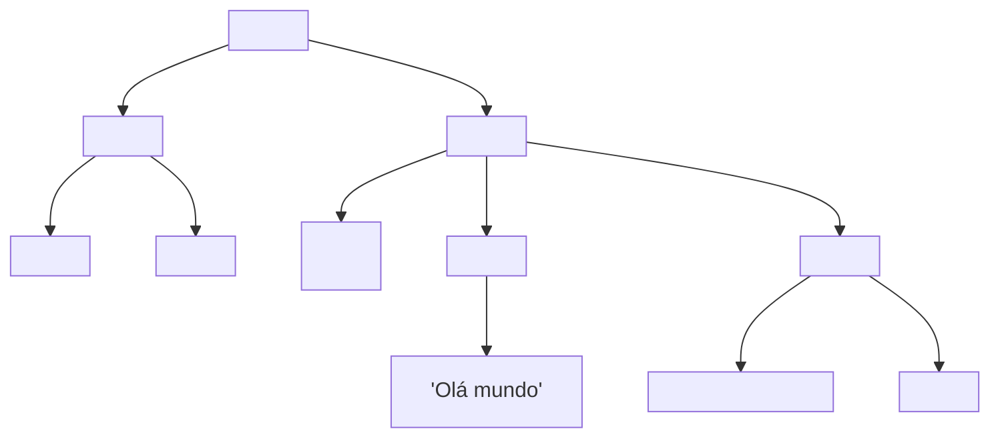

# O DOM como árvore

> [!abstract] TL;DR
> O DOM (Document Object Model) é a representação em memória do documento HTML — uma árvore de objetos que o browser cria ao parsear o HTML e que o JavaScript pode ler e modificar. Cada elemento HTML vira um nó (`Node`) na árvore; scripts alteram esses nós e o browser re-renderiza. `document` é a raiz de tudo; `window` é o objeto global que contém `document`.

---

## O que é o DOM

O browser faz quatro coisas ao receber HTML:
1. **Parseia** o HTML — tokeniza a marcação linha por linha
2. **Constrói o DOM** — cria uma árvore de objetos em memória
3. **Constrói o CSSOM** — parseia o CSS em paralelo
4. **Renderiza** — combina DOM + CSSOM para pintar pixels

O DOM não é o HTML. O HTML é texto; o DOM é a interpretação viva desse texto como uma árvore de objetos JavaScript. Quando você edita o DOM via JS, o browser atualiza a tela — não o arquivo HTML original.



---

## Tipos de nó

A árvore DOM é composta de `Node`s de tipos diferentes:

```javascript
// Tipos de nó
Node.ELEMENT_NODE       // 1 — <div>, <p>, 
Node.TEXT_NODE          // 3 — conteúdo textual
Node.COMMENT_NODE       // 8 — <!-- comentário -->
Node.DOCUMENT_NODE      // 9 — o document em si
Node.DOCUMENT_TYPE_NODE // 10 — <!DOCTYPE html>
Node.DOCUMENT_FRAGMENT_NODE // 11 — fragmento

// Verificar o tipo
const el = document.querySelector('p');
el.nodeType; // 1
el.nodeName; // "P"
el.nodeValue; // null (elementos têm null; text nodes têm o texto)
```

`Element` é a subclasse de `Node` mais usada — representa elementos HTML. Todos os métodos de seleção e manipulação trabalham com `Element`.

---

## A hierarquia de objetos globais

```
window
├── document          → o DOM do documento atual
├── location          → URL atual
├── history           → histórico de navegação
├── navigator         → informações do browser/device
├── screen            → dimensões da tela
├── console           → console de debug
├── fetch             → requisições HTTP
└── setTimeout, ...   → timers
```

`window` é o objeto global no browser — qualquer variável declarada no escopo global (sem `let`/`const`/`var` dentro de módulos) vira propriedade de `window`. Em módulos ES6, isso não acontece.

```javascript
// Equivalentes no contexto de scripts globais
window.document === document   // true
window.alert === alert         // true

// Em módulos (type="module"), o escopo é isolado
// Variáveis não "vazam" para window
```

---

## `document` — a raiz do DOM

```javascript
// Propriedades essenciais do document
document.documentElement  // o elemento <html>
document.head             // o elemento <head>
document.body             // o elemento <body>
document.title            // <title> como string (leitura/escrita)
document.URL              // URL atual como string
document.location         // objeto Location (redirecionar: location.href = '...')
document.readyState       // "loading" | "interactive" | "complete"
document.charset          // "UTF-8"
document.documentType     // o DOCTYPE

// Criação de elementos
document.createElement('div')
document.createTextNode('texto')
document.createDocumentFragment()
document.createComment('comentário')
```

---

## Eventos de carregamento do documento

```javascript
// DOMContentLoaded: DOM pronto — imagens/fontes ainda podem estar carregando
document.addEventListener('DOMContentLoaded', () => {
  console.log('DOM pronto, mas recursos externos ainda podem carregar');
  // Seguro para acessar o DOM
});

// load: tudo carregou (imagens, fontes, iframes)
window.addEventListener('load', () => {
  console.log('Tudo carregado');
});

// beforeunload: usuário está saindo
window.addEventListener('beforeunload', (event) => {
  event.preventDefault();
  event.returnValue = ''; // Exibe confirmação de saída (texto customizado ignorado em browsers modernos)
});

// unload: usuário saiu (última chance — avoid, use beforeunload)
window.addEventListener('unload', () => { });
```

`document.readyState` permite verificar em que ponto o documento está:

```javascript
if (document.readyState === 'loading') {
  document.addEventListener('DOMContentLoaded', init);
} else {
  // Já carregou — rodar imediatamente
  init();
}
```

---

## A interface `Node` — propriedades comuns

Todo nó da árvore tem:

```javascript
const el = document.querySelector('.card');

// Navegação na árvore (inclui text nodes e comments)
el.parentNode          // nó pai (qualquer tipo)
el.childNodes          // NodeList de todos os filhos (inclui text nodes)
el.firstChild          // primeiro filho (pode ser text node)
el.lastChild
el.nextSibling         // próximo irmão (qualquer tipo)
el.previousSibling

// Navegação Element-only (ignoram text nodes e comments — mais útil)
el.parentElement       // pai como Element
el.children            // HTMLCollection de filhos Element
el.firstElementChild
el.lastElementChild
el.nextElementSibling
el.previousElementSibling
```

> [!tip] Prefira as propriedades `Element`
> `el.childNodes` inclui text nodes (espaços em branco entre tags geram text nodes). Na prática, `el.children` e `el.firstElementChild` são o que você quer em 99% dos casos.

---

## O DOM como API viva

O DOM é uma API **viva** — mudanças se refletem imediatamente:

```javascript
const lista = document.querySelector('ul');
const items = lista.getElementsByTagName('li'); // HTMLCollection — ao vivo!
console.log(items.length); // 3

lista.appendChild(document.createElement('li'));
console.log(items.length); // 4 — atualizou automaticamente!

// querySelectorAll retorna NodeList estática — NÃO ao vivo
const items2 = lista.querySelectorAll('li');
lista.appendChild(document.createElement('li'));
console.log(items2.length); // ainda 4 — não atualizou
```

`getElementsBy*` retorna **HTMLCollection ao vivo** — cuidado ao iterar enquanto modifica. `querySelectorAll` retorna **NodeList estática** — mais previsível para iteração.

---

> [!question] Para fixar
> 1. Qual a diferença entre o HTML (arquivo) e o DOM? O que acontece quando você edita o DOM via JS?
> 2. O que são os diferentes tipos de nó (`nodeType`)? Por que `ELEMENT_NODE` é o mais comum no dia a dia?
> 3. Qual a diferença entre `el.childNodes` e `el.children`? Por que `el.children` é geralmente o que você quer?
> 4. Por que `getElementsByClassName` pode causar bugs ao iterar e remover elementos simultaneamente?
> 5. O que `document.readyState` retorna e quando `DOMContentLoaded` dispara vs `window.load`?

---

## Veja também

- [[03-Dominios/Tecnologia/Plataforma Web/DOM/02 - Seleção de elementos|02 — Seleção de elementos]] — próxima
- [[03-Dominios/Tecnologia/HTML/index|HTML]] — a marcação que o parser transforma em DOM
- [[03-Dominios/Tecnologia/Plataforma Web/Rendering Pipeline/01 - Parse e construção do DOM e CSSOM|Rendering Pipeline 01]] — como o DOM é construído
