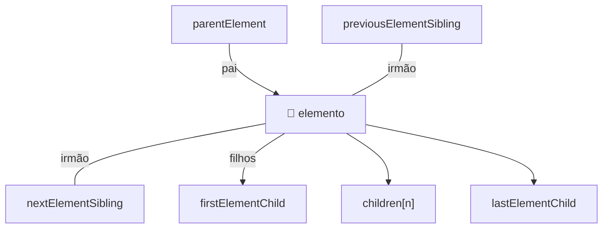

# Traversal — navegar a árvore DOM

> [!abstract] TL;DR
> Traversal é a arte de navegar pela árvore DOM a partir de um nó conhecido — subir para o pai, descer para filhos, mover-se entre irmãos. As APIs Element-only (`parentElement`, `children`, `firstElementChild`, `nextElementSibling`) ignoram text nodes e são o que você quer na prática. `closest()` é a ferramenta de subida; `querySelector` dentro de um elemento é a ferramenta de descida. `contains()` verifica pertencimento à subárvore.

---

## Mapa das propriedades de traversal



---

## Subir na árvore — pai e ancestrais

```javascript
const el = document.querySelector('.card__title');

// Pai imediato (Element)
el.parentElement;         // o elemento pai
el.parentNode;            // o nó pai (pode ser Document — use parentElement)

// Subir múltiplos níveis
el.parentElement.parentElement;  // avô — frágil, depende da estrutura

// Melhor: closest() — sobe até encontrar o seletor (ou null)
el.closest('.card');             // o card que contém este título
el.closest('[data-section]');    // o ancestral mais próximo com data-section
el.closest('form');              // o formulário ancestral

// closest() inclui o próprio elemento
const btn = document.querySelector('.btn');
btn.closest('.btn');             // retorna o próprio btn (bate no primeiro teste)
```

---

## Descer na árvore — filhos

```javascript
const card = document.querySelector('.card');

// HTMLCollection de filhos diretos (Element-only, ao vivo)
card.children;                    // HTMLCollection
card.children[0];                 // primeiro filho
card.children.length;             // quantos filhos

// Primeiro e último filho Element
card.firstElementChild;           // equivale a children[0]
card.lastElementChild;

// Busca dentro do elemento (mais flexível que children)
card.querySelector('.card__title');         // primeiro match
card.querySelectorAll('.card__tag');        // todos os matches
card.querySelector(':scope > p');           // só filhos diretos <p>

// NodeList com text nodes e comments (raramente útil)
card.childNodes;                  // inclui whitespace text nodes
card.firstChild;                  // pode ser um text node (whitespace)
```

---

## Mover entre irmãos

```javascript
const li = document.querySelector('li.active');

// Irmão seguinte Element
li.nextElementSibling;            // próximo <li> ou null se for o último
li.previousElementSibling;       // anterior ou null se for o primeiro

// Navegar toda a lista de irmãos
function getAllSiblings(el) {
  return [...el.parentElement.children].filter(child => child !== el);
}

// Irmão anterior até encontrar um com determinada classe
function prevUntil(el, selector) {
  let current = el.previousElementSibling;
  while (current && !current.matches(selector)) {
    current = current.previousElementSibling;
  }
  return current;
}
```

---

## `contains()` — verificar pertencimento

`contains()` verifica se um elemento é descendente de outro (ou o próprio):

```javascript
const modal = document.querySelector('.modal');
const input = document.querySelector('.modal input');

modal.contains(input);         // true — input está dentro de modal
modal.contains(modal);         // true — elemento contém a si mesmo
document.contains(modal);      // true — tudo está no document

// Caso de uso: detectar clique fora de um elemento
document.addEventListener('click', (event) => {
  if (!modal.contains(event.target)) {
    modal.close();
  }
});
```

---

## Patterns práticos de traversal

### Accordion — abrir/fechar itens irmãos

```javascript
document.querySelectorAll('.accordion__trigger').forEach(trigger => {
  trigger.addEventListener('click', () => {
    const item = trigger.closest('.accordion__item');
    const panel = item.querySelector('.accordion__panel');
    const isOpen = item.classList.contains('open');

    // Fechar todos os irmãos
    item.parentElement.querySelectorAll('.accordion__item.open').forEach(openItem => {
      openItem.classList.remove('open');
      openItem.querySelector('.accordion__panel').hidden = true;
    });

    // Abrir o clicado (se estava fechado)
    if (!isOpen) {
      item.classList.add('open');
      panel.hidden = false;
    }
  });
});
```

### Tab panels — ligar tab ao seu painel

```javascript
// Usando data attributes para ligar tab ao painel
document.querySelectorAll('[role="tab"]').forEach(tab => {
  tab.addEventListener('click', () => {
    const tabList = tab.closest('[role="tablist"]');
    const targetId = tab.getAttribute('aria-controls');
    const panel = document.getElementById(targetId);

    // Desativar todos os tabs e esconder painéis
    tabList.querySelectorAll('[role="tab"]').forEach(t => {
      t.setAttribute('aria-selected', 'false');
    });

    // Ativar o clicado
    tab.setAttribute('aria-selected', 'true');
    panel.hidden = false;
  });
});
```

### Encontrar o input mais próximo de um label

```javascript
// Quando o label não tem 'for' mas o input é irmão
document.querySelectorAll('label').forEach(label => {
  const input = label.nextElementSibling;
  if (input && input.tagName === 'INPUT') {
    label.addEventListener('click', () => input.focus());
  }
});
```

---

## Iteração sobre coleções

```javascript
const items = document.querySelectorAll('.item');

// forEach — nativo em NodeList (não em HTMLCollection!)
items.forEach((item, index) => {
  item.dataset.index = index;
});

// For...of — funciona em NodeList e HTMLCollection
for (const item of items) {
  console.log(item.textContent);
}

// Array.from ou spread para usar map/filter/reduce
const texts = Array.from(items).map(item => item.textContent.trim());
const active = [...items].filter(item => item.classList.contains('active'));
const first = [...items].find(item => item.matches(':not([hidden])'));

// ❌ HTMLCollection não tem forEach nativo
const divs = document.getElementsByTagName('div');
divs.forEach(d => {}); // TypeError: divs.forEach is not a function
Array.from(divs).forEach(d => {}); // ✅
```

---

> [!question] Para fixar
> 1. O que `el.parentNode` pode retornar que `el.parentElement` nunca retorna? Quando essa diferença importa?
> 2. Escreva uma função que retorna todos os irmãos de um elemento exceto ele mesmo.
> 3. Por que `el.firstChild` pode ser inesperadamente um text node enquanto `el.firstElementChild` não? O que gera esses text nodes?
> 4. Como `closest()` difere de `parentElement.parentElement.parentElement`? Qual é mais robusto a mudanças de HTML?
> 5. Como você detectaria se um clique aconteceu fora de um modal? Escreva o código.

---

## Veja também

- [[03-Dominios/Tecnologia/Plataforma Web/DOM/02 - Seleção de elementos|02 — Seleção de elementos]] — anterior
- [[03-Dominios/Tecnologia/Plataforma Web/DOM/04 - Manipulação de DOM|04 — Manipulação de DOM]] — próxima
- [[03-Dominios/Tecnologia/Plataforma Web/Eventos/04 - Event delegation|Eventos 04 — Event delegation]] — traversal como base do delegation
