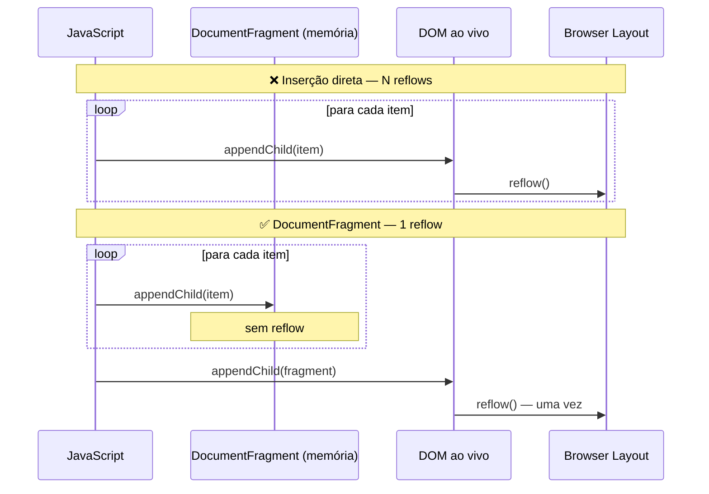

# DocumentFragment e batch mutations

> [!abstract] TL;DR
> Cada mutação ao DOM ao vivo pode disparar reflow (recalcular layout) — inserir 1000 elementos um a um é 1000 reflows. `DocumentFragment` é um container fora do DOM: você monta toda a subárvore nele e insere uma única vez, causando apenas um reflow. O mesmo princípio vale para qualquer estratégia de batch: acumular → inserir. Frameworks como React fazem isso automaticamente com Virtual DOM; no DOM puro, você faz manualmente.

---

## O problema: mutações individuais causam reflows

Cada vez que você modifica o DOM ao vivo, o browser pode precisar recalcular layout (reflow) e repintar (repaint). O custo por operação é pequeno; em loop, se acumula:

```javascript
const list = document.querySelector('ul');

// ❌ Inserção individual — pode causar N reflows
for (let i = 0; i < 1000; i++) {
  const li = document.createElement('li');
  li.textContent = `Item ${i}`;
  list.appendChild(li); // cada append pode disparar reflow
}
```

O browser é inteligente o suficiente para batchar algumas dessas operações, mas não todas. Quando você **lê** propriedades de layout (como `offsetHeight`, `clientWidth`, `getBoundingClientRect`) entre escritas, você força o browser a fazer o reflow imediatamente (layout thrashing).

---

## `DocumentFragment` — o container fora do DOM

`DocumentFragment` é um nó especial que existe em memória, mas **não faz parte do DOM**. Mutações nele não causam reflow. Quando você insere um fragment no DOM, todos os seus filhos são transferidos em **uma única operação**:

```javascript
const list = document.querySelector('ul');

// ✅ Acumula em fragment fora do DOM
const fragment = document.createDocumentFragment();

for (let i = 0; i < 1000; i++) {
  const li = document.createElement('li');
  li.textContent = `Item ${i}`;
  fragment.appendChild(li); // sem reflow — fragment fora do DOM
}

// Uma única inserção no DOM real — um reflow
list.appendChild(fragment);
// Após a inserção, o fragment está vazio (os filhos foram *movidos*, não copiados)
```

---

## `replaceChildren()` — substituir tudo de uma vez

Para re-renderizar uma lista inteira, `replaceChildren()` é mais limpo e eficiente que limpar com `innerHTML = ''` e depois appender:

```javascript
function renderList(container, items) {
  // Criar todos os elementos em memória
  const newItems = items.map(item => {
    const li = document.createElement('li');
    li.textContent = item.label;
    li.dataset.id = item.id;
    return li;
  });

  // Substituir todos os filhos em uma operação
  container.replaceChildren(...newItems);
}
```

Equivalente a criar um fragment manualmente e inserir — mas mais idiomático.

---

## `innerHTML` como forma de batch — cuidados

Setar `innerHTML` de uma só vez é outra forma de inserção em batch:

```javascript
// ✅ Gera HTML como string e insere tudo de uma vez
const html = items.map(item =>
  `<li data-id="${item.id}">${escapeHtml(item.label)}</li>`
).join('');

list.innerHTML = html; // um único parse e re-render
```

Mas tem dois problemas:

1. **Perde event listeners** — todos os filhos existentes são destruídos e recriados
2. **Risco de XSS** se `item.label` vier do usuário sem sanitização

```javascript
// Função de escape obrigatória ao usar innerHTML com dados externos
function escapeHtml(str) {
  return String(str)
    .replace(/&/g, '&amp;')
    .replace(/</g, '&lt;')
    .replace(/>/g, '&gt;')
    .replace(/"/g, '&quot;')
    .replace(/'/g, '&#039;');
}
```

Prefira `replaceChildren()` ou `DocumentFragment` quando os elementos precisam ter event listeners ou quando o conteúdo é dado de usuário.

---

## Layout thrashing — o inimigo silencioso

Layout thrashing acontece quando você alterna leitura e escrita de propriedades de layout no mesmo frame:

```javascript
// ❌ Layout thrashing — força reflow em cada iteração
const boxes = document.querySelectorAll('.box');
boxes.forEach(box => {
  const height = box.offsetHeight; // LEITURA — força reflow se houve escrita
  box.style.height = (height + 10) + 'px'; // ESCRITA
  // Na próxima iteração: LEITURA depois de ESCRITA → reflow forçado novamente
});

// ✅ Batch: todas as leituras primeiro, depois todas as escritas
const boxes = document.querySelectorAll('.box');
const heights = [...boxes].map(box => box.offsetHeight); // todas as LEITURAS
boxes.forEach((box, i) => {
  box.style.height = (heights[i] + 10) + 'px';           // todas as ESCRITAS
});
```

Propriedades que forçam reflow quando lidas (após uma escrita pendente):
- `offsetWidth`, `offsetHeight`, `offsetTop`, `offsetLeft`
- `clientWidth`, `clientHeight`, `clientTop`, `clientLeft`
- `scrollWidth`, `scrollHeight`, `scrollTop`, `scrollLeft`
- `getBoundingClientRect()`
- `getComputedStyle()`

---

## `requestAnimationFrame` para sincronizar com o frame

Para animações ou mudanças visuais, execute as escritas no callback de `requestAnimationFrame` — assim você garante que a escrita acontece no início do próximo frame, não no meio de um:

```javascript
function updateLayout(elements, newSizes) {
  // Ler tudo fora do rAF (antes do próximo paint)
  const reads = elements.map(el => el.getBoundingClientRect());

  // Escrever dentro do rAF (garantindo execução antes do próximo paint)
  requestAnimationFrame(() => {
    elements.forEach((el, i) => {
      el.style.width = newSizes[i] + 'px';
    });
  });
}
```

---

## Diagrama: fragment vs DOM direto



---

## Pattern completo: render de lista com fragment

```javascript
function renderProductList(container, products) {
  const fragment = document.createDocumentFragment();

  products.forEach(product => {
    // Criar estrutura do item
    const article = document.createElement('article');
    article.className = 'product-card';
    article.dataset.productId = product.id;

    const title = document.createElement('h3');
    title.className = 'product-card__title';
    title.textContent = product.name; // textContent — seguro para user data

    const price = document.createElement('p');
    price.className = 'product-card__price';
    price.textContent = `R$ ${product.price.toFixed(2)}`;

    const btn = document.createElement('button');
    btn.type = 'button';
    btn.className = 'btn btn--add-cart';
    btn.textContent = 'Adicionar ao carrinho';
    btn.addEventListener('click', () => addToCart(product.id));
    // Event listeners no fragment são preservados quando inserido no DOM

    article.append(title, price, btn);
    fragment.appendChild(article);
  });

  // Substituir o conteúdo anterior — um reflow
  container.replaceChildren(fragment);
}
```

---

> [!question] Para fixar
> 1. Por que inserir 1000 elementos um a um no DOM pode ser lento? O que o browser faz a cada inserção?
> 2. Quando você insere um `DocumentFragment` no DOM, o que acontece com os filhos do fragment depois da inserção?
> 3. O que é layout thrashing? Escreva um exemplo que causa thrashing e corrija-o.
> 4. `container.innerHTML = ''` vs `container.replaceChildren()` — qual é mais eficiente e por quê?
> 5. Se você adiciona event listeners a elementos dentro de um `DocumentFragment` antes de inserir, os listeners são preservados?

---

## Veja também

- [[03-Dominios/Tecnologia/Plataforma Web/DOM/05 - Atributos, propriedades e dataset|05 — Atributos e dataset]] — anterior
- [[03-Dominios/Tecnologia/Plataforma Web/DOM/07 - template e cloneNode|07 — template e cloneNode]] — próxima
- [[03-Dominios/Tecnologia/Plataforma Web/Rendering Pipeline/04 - Reflow e repaint|Rendering Pipeline 04 — Reflow e repaint]] — a teoria por trás deste padrão
