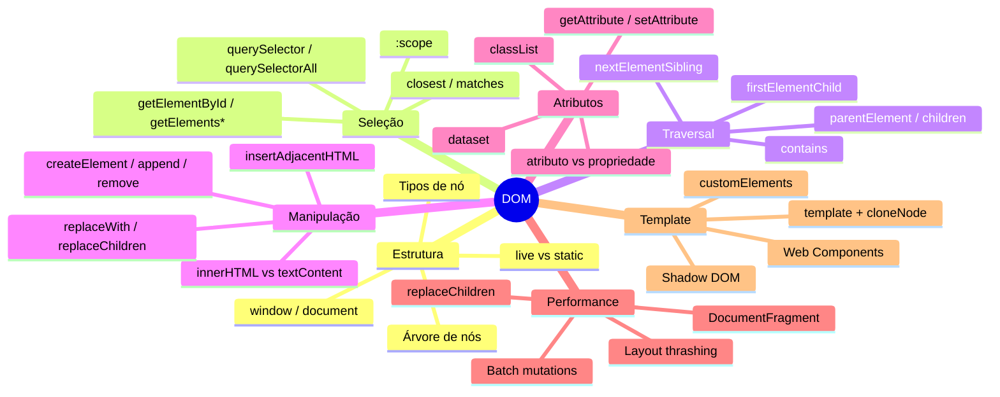

# DOM em entrevista

> [!abstract] TL;DR
> Este capstone mapeia os temas de DOM mais cobrados em entrevistas técnicas para posições pleno/sênior: Virtual DOM vs DOM real, reconciliation, reflow vs repaint, armadilhas clássicas com coleções vivas, XSS via innerHTML, e como frameworks abstraem o que você fez manualmente ao longo deste galho.

---

## Mapa do galho DOM



---

## Top 10 — perguntas frequentes de entrevista

### 1. Qual a diferença entre Virtual DOM e DOM real?

O DOM real é a representação do documento no browser — cada mutação pode causar reflow e repaint. Virtual DOM (usado pelo React) é uma cópia em JavaScript puro (objetos simples) do estado da UI.

Quando o estado muda, React:
1. Cria um novo Virtual DOM com o estado atualizado
2. Faz o **diff** com o Virtual DOM anterior (reconciliation)
3. Aplica ao DOM real apenas as diferenças — minimizando operações custosas

```
Estado muda
    ↓
Novo Virtual DOM criado
    ↓
Diff: novo vs anterior
    ↓
Patch: aplica só as mudanças no DOM real
```

O DOM real não é lento por si só — é lento quando você faz operações desnecessárias nele. Virtual DOM é uma otimização que move o custo de "descobrir o que mudou" para JavaScript puro (barato), antes de tocar o DOM (caro).

---

### 2. O que é reflow? O que é repaint? Qual a diferença?

**Reflow (layout)**: recalcular geometria — posição e tamanho de elementos. É caro porque afeta elementos em cascata.

**Repaint**: redesenhar pixels sem recalcular geometria. Mais barato que reflow.

```
Mudança de DOM / CSS
        ↓
   Reflow necessário?   (mudou tamanho, posição, conteúdo)
        ↓ sim
   Recalcular layout   ← caro
        ↓
   Repaint             ← sempre ocorre após reflow
        ↓
   Composite (GPU)     ← só transform/opacity
```

O que causa reflow: `width`, `height`, `margin`, `padding`, `font-size`, `top/left` com `position`, inserção/remoção de elementos.

O que causa só repaint: `color`, `background-color`, `box-shadow`, `outline`.

O que só compõe (sem reflow/repaint): `transform`, `opacity`.

---

### 3. O que é layout thrashing? Como evitar?

Layout thrashing: alternar leituras e escritas de propriedades de layout no mesmo frame. Forçam o browser a invalidar e recalcular o layout a cada leitura.

```javascript
// ❌ Thrashing
boxes.forEach(box => {
  const h = box.offsetHeight;           // leitura → força reflow
  box.style.height = (h * 2) + 'px';   // escrita → invalida layout
  // próxima leitura refaz o reflow
});

// ✅ Batch: leia tudo, depois escreva tudo
const heights = [...boxes].map(b => b.offsetHeight);  // todas as leituras
boxes.forEach((b, i) => b.style.height = (heights[i] * 2) + 'px'); // escritas
```

---

### 4. Qual a diferença entre `querySelector` e `getElementById`?

| | `getElementById` | `querySelector` |
|---|---|---|
| Argumento | string (sem `#`) | seletor CSS completo |
| Velocidade | O(1) — hashtable | O(n) — traversal |
| Escopo | sempre `document` | qualquer Element |
| Retorno | `Element\|null` | `Element\|null` |

`getElementById` é o mais rápido para buscar por ID específico. `querySelector` é mais flexível e expressivo.

---

### 5. Qual a diferença entre `HTMLCollection` e `NodeList`?

| | `HTMLCollection` | `NodeList` (querySelectorAll) |
|---|---|---|
| Ao vivo? | Sim — atualiza automaticamente | Não — snapshot estático |
| Retornado por | `getElementsBy*`, `.children` | `querySelectorAll` |
| `forEach` nativo? | Não | Sim |
| Contém text nodes? | Não — só Elements | Sim (childNodes) |

A natureza "ao vivo" de `HTMLCollection` causa bugs clássicos:

```javascript
// ❌ Bug: remover itens durante iteração de HTMLCollection
const items = document.getElementsByClassName('item');
for (let i = 0; i < items.length; i++) {
  items[i].remove(); // length muda durante o loop — pula itens!
}

// ✅ Iterar NodeList estática ou converter para array
[...document.querySelectorAll('.item')].forEach(item => item.remove());
```

---

### 6. Por que `innerHTML = userInput` é perigoso?

```javascript
// Payload de exemplo:
const userInput = '';

// ❌ XSS: executa o onerror do atacante
el.innerHTML = userInput;

// ✅ Seguro: escapa o HTML — exibe literalmente
el.textContent = userInput;

// ✅ Para HTML confiável que precisa renderizar: sanitize
import DOMPurify from 'dompurify';
el.innerHTML = DOMPurify.sanitize(htmlFromServer);
```

---

### 7. Qual a diferença entre atributo e propriedade DOM?

Atributos: o que está no HTML (`getAttribute`). Propriedades: o estado atual do objeto DOM.

Começam iguais, mas divergem com interação do usuário:

```javascript
// <input value="inicial">
const input = document.querySelector('input');

// Usuário digita "atual"
input.value;                  // "atual" (propriedade — estado atual)
input.getAttribute('value');  // "inicial" (atributo — valor original do HTML)

// Atributo boolean:
input.setAttribute('disabled', 'false'); // NÃO habilita — presença = true
input.disabled = false;                   // ✅ Propriedade = false habilita
```

---

### 8. Como `closest()` funciona e onde é mais útil?

`closest()` sobe a árvore DOM do elemento até encontrar um ancestral que bate o seletor — ou `null`. Inclui o próprio elemento.

Uso canônico: **event delegation**.

```javascript
// Ao invés de N listeners (um por item):
document.querySelector('.product-list').addEventListener('click', (event) => {
  const card = event.target.closest('.product-card');
  if (!card) return; // clique não foi em um card
  
  const id = card.dataset.productId;
  addToCart(id);
});
```

Funciona mesmo se o clique foi em um elemento filho do card (o ``, o `<h3>`, etc.) — `closest` sobe até encontrar o `.product-card`.

---

### 9. O que `DocumentFragment` resolve?

Inserir elementos individualmente no DOM pode causar reflow em cada inserção. `DocumentFragment` é um container fora do DOM: monte a subárvore nele e insira tudo de uma vez — um reflow.

```javascript
const frag = document.createDocumentFragment();
items.forEach(item => frag.appendChild(createEl(item)));
container.appendChild(frag); // um único reflow
```

---

### 10. Como `<template>` difere de um `<div hidden>`?

```html
<!-- div hidden: o conteúdo está no DOM ativo -->
<div hidden>
   <!-- ✅ carrega a imagem mesmo oculto! -->
  <script>// executa!</script>
</div>

<!-- template: o conteúdo é inerte -->
<template>
   <!-- ❌ não carrega a imagem -->
  <script>// não executa</script>
</template>
```

`<template>` existe para ser clonado — nunca renderiza diretamente.

---

## Armadilhas clássicas

```javascript
// 1. NodeList.map não existe
document.querySelectorAll('.item').map(el => el.id); // TypeError
// ✅ Converter: [...querySelectorAll('.item')].map(...)

// 2. HTMLCollection.forEach não existe
document.getElementsByTagName('li').forEach(el => {}); // TypeError
// ✅ Array.from(document.getElementsByTagName('li')).forEach(...)

// 3. Mover elemento com append — NÃO duplica
const el = document.querySelector('.widget');
anotherContainer.append(el); // el é REMOVIDO do lugar atual — não copiado

// 4. cloneNode não copia listeners
const clone = original.cloneNode(true);
// Os listeners precisam ser re-adicionados manualmente

// 5. setAttribute('disabled', 'false') NÃO habilita
// Presença do atributo = true, independente do valor
btn.setAttribute('disabled', 'false'); // ainda desabilitado!
btn.removeAttribute('disabled');        // ✅

// 6. innerHTML = '' remove todos os listeners dos filhos
// ✅ Preferir replaceChildren() ou remover individualmente

// 7. El.firstChild pode ser text node (whitespace)
el.firstChild;          // pode ser #text "\n   " (indentação do HTML)
el.firstElementChild;   // ✅ sempre um Element ou null
```

---

## Como frameworks abstraem o DOM

React, Vue e Angular existem para abstrair a manipulação manual de DOM. O que você aprendeu neste galho é o que acontece por baixo:

| Operação manual | Abstração em React |
|---|---|
| `createElement` + `appendChild` | JSX → `React.createElement` → Virtual DOM → DOM |
| `el.textContent = value` | `{variable}` em JSX |
| `el.classList.toggle(cls, cond)` | `className={cond ? cls : ''}` |
| `DocumentFragment` | Batching automático no reconciler |
| `el.addEventListener(...)` | `onClick={handler}` — React registra um único listener no root |
| `cloneNode` + `querySelector` | Componentes que encapsulam estrutura e estado |
| Layout thrashing evitado manualmente | React batcheia updates com `unstable_batchedUpdates` / `startTransition` |

Saber o que o framework abstrai é o que diferencia um engenheiro pleno de um sênior.

---

## Veja também

- [[03-Dominios/Tecnologia/Plataforma Web/DOM/07 - template e cloneNode|07 — template e cloneNode]] — anterior
- [[03-Dominios/Tecnologia/Plataforma Web/Eventos/01 - O event model do browser|Eventos 01 — Event model]] — próximo galho
- [[03-Dominios/Tecnologia/Plataforma Web/Rendering Pipeline/04 - Reflow e repaint|Rendering Pipeline 04]] — aprofunda reflow/repaint
- [[03-Dominios/Tecnologia/React/index|React]] — reconciliation e Virtual DOM em detalhes
