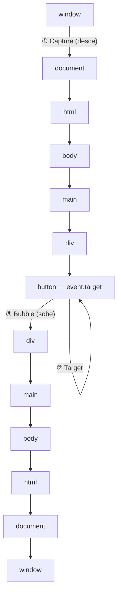

# O event model do browser

> [!abstract] TL;DR
> Todo evento no browser percorre três fases: **capture** (desce do `window` até o target), **target** (chega ao elemento alvo) e **bubble** (sobe de volta). `addEventListener` por padrão registra na fase de bubble. `event.target` é o elemento que recebeu o clique; `event.currentTarget` é o elemento onde o listener está registrado — são diferentes quando há delegation. `stopPropagation` para a subida; `stopImmediatePropagation` para também outros listeners no mesmo elemento.

---

## As três fases de um evento

Quando você clica em um botão dentro de um `<div>` dentro de um `<main>`, o evento não vai direto ao botão — percorre toda a árvore:



1. **Capture (captura)**: o evento desce de `window` até o `event.target`
2. **Target**: o evento chega ao elemento que foi clicado
3. **Bubble (borbulhamento)**: o evento sobe do target de volta para `window`

---

## `addEventListener` — registrar um listener

```javascript
element.addEventListener(tipo, handler, opcoes);

// Exemplos
btn.addEventListener('click', handleClick);
btn.addEventListener('click', handleClick, false); // fase de bubble (padrão)
btn.addEventListener('click', handleClick, true);  // fase de capture
btn.addEventListener('click', handleClick, {
  capture: false,  // bubble (padrão)
  once: true,      // remove após o primeiro disparo
  passive: true,   // promete não chamar preventDefault (melhora scroll perf)
  signal: controller.signal, // AbortController para remover o listener
});

// Remover listener (referência ao mesmo handler e opções)
btn.removeEventListener('click', handleClick);
btn.removeEventListener('click', handleClick, { capture: true }); // fase importa!
```

> [!tip] `once: true`
> Substitui o padrão manual de `removeEventListener` dentro do handler — muito mais limpo para listeners de "primeiro uso".

---

## `event.target` vs `event.currentTarget`

Esta distinção é fundamental para event delegation:

```javascript
const list = document.querySelector('ul');

list.addEventListener('click', (event) => {
  event.target;        // o elemento que foi CLICADO (pode ser um <li>, um <span> dentro do <li>, etc.)
  event.currentTarget; // o elemento onde o LISTENER está registrado (sempre o <ul>)
  this;                // também é currentTarget (exceto em arrow functions)
});
```

```html
<ul>
  <li>
    <span>Texto</span>  ← se clicar aqui
  </li>
</ul>
```

Se clicar no `<span>`:
- `event.target` = `<span>`
- `event.currentTarget` = `<ul>` (onde o listener está)

---

## Parar a propagação

```javascript
element.addEventListener('click', (event) => {
  // Parar a bolha — impede que listeners em ancestrais sejam chamados
  event.stopPropagation();

  // Parar a bolha E outros listeners no mesmo elemento
  event.stopImmediatePropagation();

  // Cancelar o comportamento padrão do browser (link navegar, form submeter, etc.)
  event.preventDefault();

  // event.cancelable: verifica se o evento pode ser cancelado
  if (event.cancelable) event.preventDefault();
});
```

| Método | Efeito |
|---|---|
| `stopPropagation()` | Para a subida (bubble) ou descida (capture) |
| `stopImmediatePropagation()` | Para propagação E outros listeners no mesmo elemento |
| `preventDefault()` | Cancela a ação padrão do browser |

```javascript
// ❌ Armadilha: stopPropagation em excesso quebra event delegation
// Se você para a propagação no botão, o listener no container nunca dispara
btn.addEventListener('click', (event) => {
  event.stopPropagation(); // ❌ mata delegation no container
  doSomething();
});
```

---

## Fase de capture — quando usar

Na prática, capture é usado raramente — mas há casos válidos:

```javascript
// Capture: ouvir antes de qualquer handler de bubble poder parar a propagação
// Útil para logging global, analytics, ou interceptar eventos que pararam early

document.addEventListener('click', logClick, { capture: true });
// logClick dispara ANTES de qualquer handler de bubble

// Capture também é necessário para eventos que não borbulham:
// focus, blur, mouseenter, mouseleave — para capturá-los em ancestrais, use capture:true
document.addEventListener('focus', (e) => {
  // focus não borbulha — capture:true é necessário para pegar em qualquer lugar
  console.log('Algum elemento focado:', e.target);
}, { capture: true });

// Alternativa para focus: usar focusin (que borbulha)
document.addEventListener('focusin', (e) => {
  console.log('Focou:', e.target);
});
```

---

## Eventos que não borbulham

Alguns eventos ficam no target — não borbulham:

| Evento | Alternativa que borbulha |
|---|---|
| `focus` | `focusin` |
| `blur` | `focusout` |
| `mouseenter` | `mouseover` |
| `mouseleave` | `mouseout` |
| `load` (em elementos) | — |
| `abort` | — |

```javascript
// ❌ Não funciona para pegar o focus de todos os inputs
form.addEventListener('focus', handler); // focus não borbulha!

// ✅ Usar focusin (borbulha) ou capture
form.addEventListener('focusin', handler);         // borbulha ✅
form.addEventListener('focus', handler, true);     // capture ✅
```

---

## O objeto `Event`

```javascript
element.addEventListener('click', (event) => {
  // Informações gerais
  event.type;           // "click"
  event.target;         // elemento original
  event.currentTarget;  // elemento com o listener
  event.timeStamp;      // ms desde page load
  event.bubbles;        // boolean — este evento borbulha?
  event.cancelable;     // boolean — pode chamar preventDefault?
  event.defaultPrevented; // boolean — preventDefault foi chamado?

  // Para MouseEvent
  event.clientX;        // posição relativa ao viewport
  event.clientY;
  event.pageX;          // posição relativa ao documento
  event.pageY;
  event.button;         // 0=esquerdo, 1=meio, 2=direito
  event.ctrlKey;        // boolean — Ctrl pressionado?
  event.shiftKey;
  event.altKey;
  event.metaKey;        // Cmd (Mac) / Win (Windows)

  // Para KeyboardEvent
  event.key;            // "Enter", "a", "ArrowUp" — valor da tecla
  event.code;           // "Enter", "KeyA", "ArrowUp" — código físico
  event.repeat;         // boolean — tecla sendo mantida
});
```

---

## Remover listeners — boas práticas

```javascript
// ❌ Função anônima — impossível remover
btn.addEventListener('click', () => { /* ... */ });
btn.removeEventListener('click', () => { /* ... */ }); // não funciona! referências diferentes

// ✅ Guardar referência ao handler
const handler = (event) => { /* ... */ };
btn.addEventListener('click', handler);
btn.removeEventListener('click', handler);

// ✅ once: true — remove automaticamente após disparar
btn.addEventListener('click', handler, { once: true });

// ✅ AbortController — para remover múltiplos listeners de uma vez
const controller = new AbortController();
btn.addEventListener('click', handler, { signal: controller.signal });
input.addEventListener('input', inputHandler, { signal: controller.signal });

// Remover todos de uma vez
controller.abort();
```

---

> [!question] Para fixar
> 1. Quais são as três fases de um evento? Em que ordem ocorrem?
> 2. Qual a diferença entre `event.target` e `event.currentTarget`? Em qual fase cada um é relevante?
> 3. Quando você usaria `capture: true`? Cite um exemplo concreto.
> 4. Por que `form.addEventListener('focus', handler)` não captura o focus de inputs dentro do form?
> 5. Você registrou dois listeners de 'click' no mesmo botão. `stopPropagation()` impede o segundo de disparar? E `stopImmediatePropagation()`?

---

## Veja também

- [[03-Dominios/Tecnologia/Plataforma Web/DOM/08 - DOM em entrevista|DOM 08 — capstone]] — galho anterior
- [[03-Dominios/Tecnologia/Plataforma Web/Eventos/02 - Eventos de teclado e ponteiro|02 — Eventos de teclado e ponteiro]] — próxima
- [[03-Dominios/Tecnologia/Plataforma Web/Eventos/04 - Event delegation|04 — Event delegation]] — aplicação prática do event model
