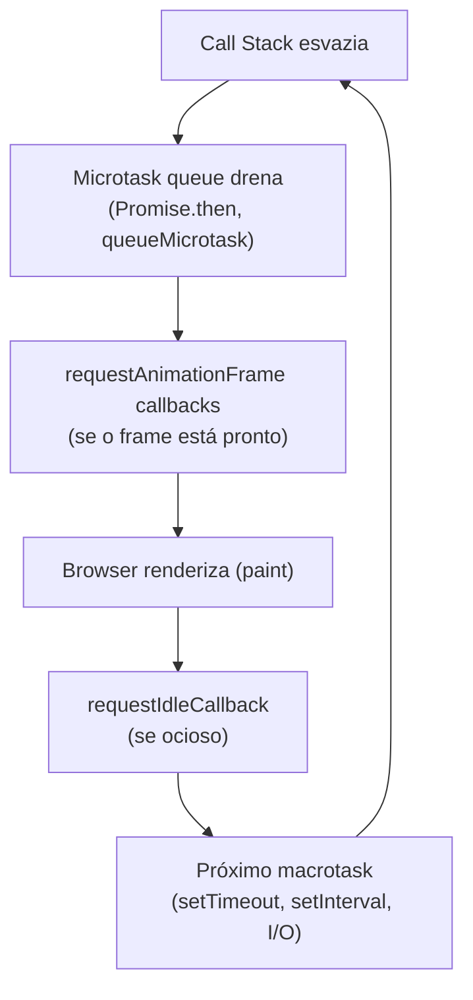

# Timers e microtasks

> [!abstract] TL;DR
> `setTimeout`/`setInterval` são macrotasks — executam depois que a call stack esvazia e a microtask queue drena. `requestAnimationFrame` sincroniza com o próximo frame do browser (~16ms). `queueMicrotask` enfileira no final da microtask queue — antes do próximo macrotask. `MessageChannel` entrega um macrotask de baixa prioridade. A ordem de execução: call stack → microtasks (Promise.then / queueMicrotask) → macrotasks (setTimeout) → rAF → paint.

---

## setTimeout e setInterval

```javascript
// setTimeout: executa uma vez após o delay
const id = setTimeout(() => {
  console.log('Executado após ~200ms');
}, 200);

// Cancelar antes de executar
clearTimeout(id);

// setInterval: executa repetidamente em intervalos
const intervalId = setInterval(() => {
  console.log('A cada 1 segundo');
}, 1000);

// Cancelar
clearInterval(intervalId);
```

### O delay é mínimo, não garantido

```javascript
// setTimeout(fn, 0) não executa imediatamente — ainda aguarda a call stack
console.log('1');
setTimeout(() => console.log('3'), 0); // macrotask — entra na fila
console.log('2');
// Saída: 1, 2, 3

// O browser tem uma precisão mínima de ~4ms para delays aninhados
// Em abas inativas, o mínimo pode subir para 1000ms (throttling)
```

### setInterval — alternativa recomendada com setTimeout recursivo

```javascript
// ❌ setInterval não aguarda a execução terminar
const intervalId = setInterval(async () => {
  await fetch('/api/data'); // se demorar mais que 1000ms, chamadas se sobrepõem
}, 1000);

// ✅ setTimeout recursivo — próxima execução só após terminar
function poll() {
  fetch('/api/data')
    .then(processData)
    .finally(() => setTimeout(poll, 1000)); // próximo após terminar
}
poll();
```

---

## requestAnimationFrame

`requestAnimationFrame` (rAF) agenda um callback para executar antes do próximo repaint do browser — sincronizado com a taxa de refresh da tela (normalmente 60fps = ~16.7ms por frame):

```javascript
let animationId;

function animate(timestamp) {
  // timestamp: DOMHighResTimeStamp, ms desde page load
  // Calcular quanto tempo passou desde o frame anterior
  const elapsed = timestamp - startTime;
  
  element.style.transform = `translateX(${elapsed * 0.1}px)`;
  
  if (elapsed < 1000) {
    animationId = requestAnimationFrame(animate); // próximo frame
  }
}

const startTime = performance.now();
animationId = requestAnimationFrame(animate);

// Cancelar animação
cancelAnimationFrame(animationId);
```

### rAF para leitura de layout antes de escrita

```javascript
// Padrão: leia no próximo frame (antes do paint), escreva depois
function updateWithLayout() {
  requestAnimationFrame(() => {
    // Aqui: DOM está estável, sem escritas pendentes
    const height = element.offsetHeight; // leitura segura — sem thrashing
    
    requestAnimationFrame(() => {
      // Frame seguinte: escreva
      element.style.height = (height + 10) + 'px';
    });
  });
}
```

### Game loop com rAF

```javascript
let lastTime = 0;

function gameLoop(timestamp) {
  const delta = timestamp - lastTime; // ms desde o frame anterior
  lastTime = timestamp;

  update(delta); // atualiza estado do jogo
  render();      // desenha

  requestAnimationFrame(gameLoop);
}

requestAnimationFrame(gameLoop);
```

---

## queueMicrotask

`queueMicrotask` enfileira uma função na microtask queue — executa antes do próximo macrotask (incluindo antes de `setTimeout(fn, 0)`):

```javascript
console.log('1 — call stack');

setTimeout(() => console.log('4 — macrotask'), 0);

Promise.resolve().then(() => console.log('3 — microtask Promise'));

queueMicrotask(() => console.log('2 — microtask queueMicrotask'));

// Saída: 1, 2, 3, 4
// (queueMicrotask e Promise.then são ambos microtasks; ordem entre eles = ordem de registro)
```

### Quando usar `queueMicrotask`

```javascript
// Adiar processamento para depois que o código atual termina, mas antes do próximo event loop tick
// Útil para: notificações assíncronas que devem reagir ao estado atual mas não bloquear

class EventEmitter {
  constructor() {
    this.listeners = new Map();
    this.pendingEvents = [];
  }

  emit(event, data) {
    // Enfileira a notificação como microtask — garante que o código que chamou emit
    // termina de executar antes dos listeners rodarem
    queueMicrotask(() => {
      const handlers = this.listeners.get(event) || [];
      handlers.forEach(fn => fn(data));
    });
  }

  on(event, handler) {
    if (!this.listeners.has(event)) this.listeners.set(event, []);
    this.listeners.get(event).push(handler);
  }
}
```

---

## MessageChannel — microtask/macrotask de baixa prioridade

`MessageChannel` cria dois ports conectados. Mensagens entregues via `port.postMessage` são macrotasks com prioridade menor que `setTimeout`:

```javascript
const channel = new MessageChannel();

channel.port1.addEventListener('message', (event) => {
  console.log('MessageChannel:', event.data);
});
channel.port1.start();

// Enviar — entrega como macrotask
channel.port2.postMessage({ type: 'update', payload: data });
```

Uso prático: implementar um scheduler de baixa prioridade sem bloquear o main thread — similar ao que o React usa internamente para o scheduler.

---

## `requestIdleCallback` — trabalho de baixa prioridade

Executa código quando o browser está ocioso (sem frames para renderizar, sem input para processar):

```javascript
const idleId = requestIdleCallback((deadline) => {
  // deadline.timeRemaining(): ms disponíveis antes do browser precisar do controle
  // deadline.didTimeout: true se o timeout expirou antes do idle

  while (deadline.timeRemaining() > 5 && work.length > 0) {
    processNextItem(work.shift());
  }

  // Se não terminou, agendar para o próximo idle
  if (work.length > 0) {
    requestIdleCallback(processWork);
  }
}, { timeout: 5000 }); // timeout: força execução mesmo sem idle após 5s

cancelIdleCallback(idleId);
```

> [!warning] `requestIdleCallback` — suporte limitado
> Não disponível no Safari (até ~2024). Use um polyfill com `setTimeout(fn, 0)` como fallback, ou `scheduler.yield()` da API Scheduler (mais moderna).

---

## A ordem de execução completa



```javascript
// Demonstração completa da ordem
Promise.resolve().then(() => console.log('A — microtask'));
queueMicrotask(() => console.log('B — microtask'));
requestAnimationFrame(() => console.log('C — rAF (antes do paint)'));
setTimeout(() => console.log('D — macrotask'), 0);
console.log('E — call stack síncrona');

// Saída típica:
// E, A, B, C, D
// (rAF pode variar — depende se o frame está pronto quando as microtasks terminam)
```

---

> [!question] Para fixar
> 1. Qual a diferença entre `setTimeout(fn, 0)` e `queueMicrotask(fn)`? Em que ordem executam?
> 2. Por que `requestAnimationFrame` é melhor que `setInterval` para animações?
> 3. O que acontece se você chamar `requestAnimationFrame` mas o usuário minimizou a aba?
> 4. Por que usar `setTimeout` recursivo em vez de `setInterval` para polling?
> 5. Explique a ordem de execução: microtask queue, rAF, macrotask queue. O que "drena a microtask queue" significa?

---

## Veja também

- [[03-Dominios/Tecnologia/Plataforma Web/Eventos/05 - Custom events e comunicação|05 — Custom events]] — anterior
- [[03-Dominios/Tecnologia/Plataforma Web/Eventos/07 - Padrões avançados|07 — Padrões avançados]] — próxima
- [[03-Dominios/Tecnologia/Plataforma Web/Rendering Pipeline/06 - requestAnimationFrame e animação imperativa|Rendering Pipeline 06 — rAF]] — aprofunda animação frame-by-frame
