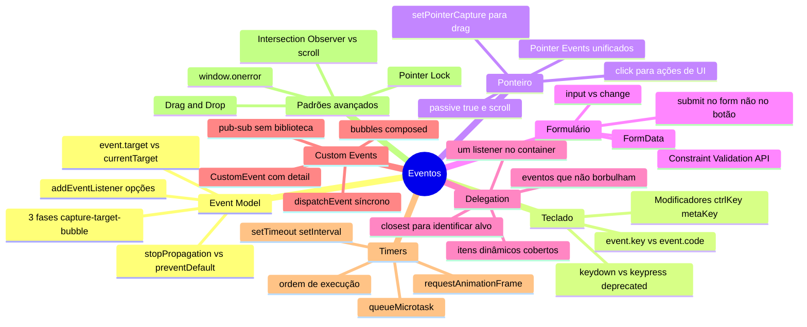

# Eventos em entrevista

> [!abstract] TL;DR
> Capstone do galho Eventos. Cobre as perguntas mais frequentes em entrevistas pleno/sênior: capture vs bubble, event delegation, como implementar um handler global de erros, `window.onerror` vs `addEventListener`, scroll performance, custom events como pub/sub, e as armadilhas clássicas com eventos que não borbulham.

---

## Mapa do galho Eventos



---

## Top 10 — perguntas de entrevista

### 1. Explique capture vs bubble. Qual o padrão?

O evento percorre a árvore em três fases:
1. **Capture**: `window` → elemento
2. **Target**: chega ao elemento clicado
3. **Bubble**: elemento → `window`

`addEventListener` por padrão usa a fase de **bubble**. Para usar capture: `{ capture: true }`.

Na prática, bubble é o que você sempre quer — é onde event delegation vive.

---

### 2. O que é event delegation? Por que usar?

Event delegation: um único listener no container, `event.target.closest()` para identificar o item.

```javascript
// Em vez de 1000 listeners:
list.addEventListener('click', (event) => {
  const item = event.target.closest('.list-item');
  if (item) toggleItem(item.dataset.id);
});
```

Benefícios:
- Menos memória (1 listener vs N)
- Itens adicionados dinamicamente já cobertos
- Código mais simples

Limitação: eventos que não borbulham (`focus`, `blur`, `mouseenter`). Use `focusin`/`focusout` ou `capture: true`.

---

### 3. Qual a diferença entre `event.target` e `event.currentTarget`?

- `event.target`: o elemento onde o evento **originou** (onde o usuário clicou)
- `event.currentTarget`: o elemento onde o **listener está registrado**

Quando clica num `<span>` dentro de um `<li>`:
- `event.target` = `<span>` (onde clicou)
- `event.currentTarget` = onde quer que o listener esteja (`<ul>`, `<li>`, etc.)

Em event delegation, `event.target.closest('.item')` é o que resolve a ambiguidade.

---

### 4. Diferença entre `stopPropagation` e `preventDefault`?

- `stopPropagation()`: para o evento de subir/descer a árvore
- `preventDefault()`: cancela a ação padrão do browser (link navegar, form submeter, checkbox marcar)

São independentes — um não implica o outro:

```javascript
link.addEventListener('click', (event) => {
  event.preventDefault();    // link não navega
  // mas o evento continua subindo para listeners ancestrais

  event.stopPropagation();   // evento não sobe
  // mas o link ainda navegaria sem o preventDefault acima
});
```

> Evite `stopPropagation` sem razão — quebra outros listeners e event delegation.

---

### 5. Como você implementaria um handler global de erros?

```javascript
// Erros JavaScript não tratados
window.addEventListener('error', (event) => {
  reportError({
    message: event.message,
    stack: event.error?.stack,
    location: `${event.filename}:${event.lineno}`,
  });
});

// Promises rejeitadas sem catch
window.addEventListener('unhandledrejection', (event) => {
  reportError({
    type: 'promise',
    reason: event.reason?.message || String(event.reason),
    stack: event.reason?.stack,
  });
  event.preventDefault(); // evita log no console
});

// Recursos que falham (404 em img/script)
window.addEventListener('error', (event) => {
  if (event.target !== window) { // é um erro de recurso, não de JS
    reportError({
      type: 'resource',
      element: event.target.tagName,
      url: event.target.src || event.target.href,
    });
  }
}, { capture: true }); // erros de recurso não borbulham — precisa de capture
```

---

### 6. `window.onerror` vs `addEventListener('error')`?

| | `window.onerror` | `addEventListener('error')` |
|---|---|---|
| Múltiplos handlers | Não — sobrescreve | Sim |
| Objeto `event` | Parâmetros individuais | `ErrorEvent` com `.error` |
| Promises | Não | Não (use `unhandledrejection`) |
| Recursos | Não | Sim (com capture) |

`window.onerror` é legado — prefira `addEventListener('error')` que é mais flexível.

---

### 7. Como você implementaria um sistema de pub/sub com CustomEvents?

```javascript
const Events = {
  USER_LOGIN: 'user:login',
  CART_UPDATE: 'cart:update',
};

// Publisher
function notifyLogin(user) {
  document.dispatchEvent(new CustomEvent(Events.USER_LOGIN, {
    detail: { user },
  }));
}

// Subscribers — qualquer número
document.addEventListener(Events.USER_LOGIN, ({ detail: { user } }) => {
  updateHeader(user);
});
document.addEventListener(Events.USER_LOGIN, ({ detail: { user } }) => {
  logAnalytics('login', user.id);
});
```

Vantagens sobre callbacks diretos: desacoplamento total — publisher não conhece subscribers.

---

### 8. Por que `passive: true` importa para scroll performance?

Sem `passive: true`, o browser **aguarda** o handler de `wheel`/`touchstart` para saber se `preventDefault()` será chamado — isso adiciona latência de 10-100ms ao scroll.

Com `passive: true`, o browser não espera — rola imediatamente e executa o handler em paralelo.

```javascript
// ✅ Para qualquer handler que não chama preventDefault
window.addEventListener('wheel', updateParallax, { passive: true });
window.addEventListener('touchstart', initGesture, { passive: true });

// Só use passive: false quando PRECISA bloquear o scroll
window.addEventListener('wheel', (event) => {
  if (isZooming) event.preventDefault(); // bloqueia o scroll para o zoom
}, { passive: false });
```

---

### 9. Qual a diferença entre `input` e `change`?

- `input`: dispara **a cada mudança** (cada tecla digitada, cada arrastar do range)
- `change`: dispara **quando o valor muda e o campo perde o foco** (ou imediatamente em checkboxes/selects)

```javascript
// input: busca em tempo real
searchField.addEventListener('input', (e) => search(e.target.value));

// change: validação ao sair do campo
emailField.addEventListener('change', (e) => validateEmail(e.target.value));
```

---

### 10. Por que usar `submit` no form em vez de `click` no botão?

`submit` no form é disparado por múltiplos caminhos: clicar no botão submit, pressionar Enter em qualquer input, `form.submit()` programático, e futuros mecanismos. Ouvir `click` no botão perde esses casos.

```javascript
// ✅ Cobre todos os casos de submissão
form.addEventListener('submit', (event) => {
  event.preventDefault();
  const data = new FormData(form);
  sendToServer(Object.fromEntries(data));
});
```

---

## Armadilhas clássicas de eventos

```javascript
// 1. Arrow function como handler — impossível remover
el.addEventListener('click', () => {}); // referência perdida
el.removeEventListener('click', () => {}); // não remove!
// ✅ Guardar referência ou usar once: true / AbortController

// 2. Focus não borbulha — delegation não funciona
form.addEventListener('focus', handler); // não pega inputs filhos!
form.addEventListener('focusin', handler); // ✅

// 3. stopPropagation quebra delegation
item.addEventListener('click', (e) => {
  e.stopPropagation(); // ❌ delegation no container não recebe mais
});

// 4. Escutar scroll diretamente — caro
window.addEventListener('scroll', checkVisibility); // executa 60x/s
// ✅ Use Intersection Observer

// 5. setInterval sobrepõe execuções
setInterval(async () => { await fetch(); }, 1000); // pode sobrepor
// ✅ setTimeout recursivo

// 6. event.target vs event.currentTarget em arrow functions
el.addEventListener('click', (e) => {
  console.log(this); // undefined em arrow function! (não é currentTarget)
  console.log(e.currentTarget); // ✅
});

// 7. CustomEvent detail não é passado por referência
const event = new CustomEvent('test', { detail: { count: 0 } });
el.dispatchEvent(event);
// event.detail.count pode ser acessado APÓS dispatchEvent — mas modificar o detail
// dentro do handler altera o objeto original (referência compartilhada)
```

---

## Veja também

- [[03-Dominios/Tecnologia/Plataforma Web/Eventos/07 - Padrões avançados|07 — Padrões avançados]] — anterior
- [[03-Dominios/Tecnologia/Plataforma Web/Rendering Pipeline/01 - Parse e construção do DOM e CSSOM|Rendering Pipeline]] — próximo galho
- [[03-Dominios/Tecnologia/Plataforma Web/Eventos/index|Eventos — índice]]
