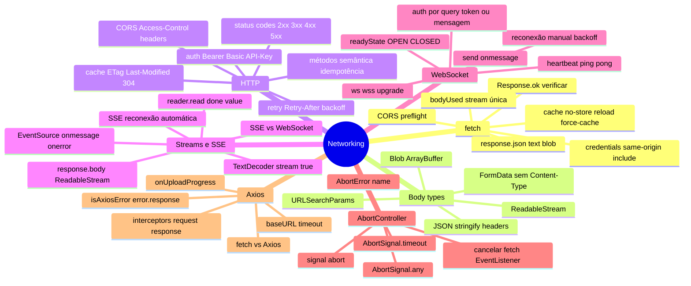

# Networking em entrevista

> [!abstract] TL;DR
> Capstone do galho Networking. As perguntas mais frequentes: por que fetch não rejeita em 4xx/5xx, como funciona CORS e preflight, SSE vs WebSocket, AbortController para cancelamento de requests, e quando usar Axios vs fetch. O sinal de senioridade é saber implementar retry com backoff, refresh de token transparente via interceptors, e reconexão de WebSocket.

---

## Mapa do galho Networking



---

## Top 10 — perguntas de entrevista

### 1. Quando `fetch` rejeita a Promise?

Apenas em **erros de rede** — sem resposta do servidor (DNS falhou, conexão recusada, timeout de rede). Respostas HTTP `404`, `500`, etc., **resolvem** a Promise. Por isso, sempre verificar `response.ok`:

```javascript
const response = await fetch(url);
if (!response.ok) throw new Error(`HTTP ${response.status}`);
const data = await response.json();
```

---

### 2. O que é CORS? Quando o browser dispara um preflight?

CORS (Cross-Origin Resource Sharing): mecanismo de segurança que controla quais origens podem acessar recursos de outra origem via JavaScript.

**Preflight (OPTIONS)** é disparado quando:
- Método não-simples: PUT, DELETE, PATCH, ou POST com `Content-Type: application/json`
- Header não-simples: `Authorization`, `Content-Type: application/json`, headers customizados

```javascript
// Isso dispara preflight (Authorization + método POST)
await fetch('https://api.outro.com/data', {
  method: 'POST',
  headers: { 'Authorization': 'Bearer tok', 'Content-Type': 'application/json' },
});
```

O servidor responde ao OPTIONS com `Access-Control-Allow-*` headers. Se autorizado, o browser faz a request real.

---

### 3. Qual a diferença entre SSE e WebSocket?

| | SSE (EventSource) | WebSocket |
|---|---|---|
| Direção | Só servidor→cliente | Bidirecional |
| Protocolo | HTTP | WS (upgrade HTTP) |
| Reconexão | Automática | Manual |
| Autenticação | Headers limitados | Messagem inicial ou query |
| Uso | Feeds, notificações, logs | Chat, jogos, colaboração |

**Regra de ouro**: se o cliente não precisa enviar dados em tempo real → SSE; se precisa de comunicação bidirecional → WebSocket.

---

### 4. Como você cancelaria uma request fetch ao mudar de rota?

```javascript
let currentController = null;

async function loadData(id) {
  currentController?.abort(); // cancelar request anterior
  currentController = new AbortController();
  
  try {
    const res = await fetch(`/api/${id}`, { signal: currentController.signal });
    return await res.json();
  } catch (err) {
    if (err.name !== 'AbortError') throw err; // ignorar cancelamentos
  }
}
```

Em React, usar o cleanup do `useEffect`:
```javascript
useEffect(() => {
  const ctrl = new AbortController();
  fetch(url, { signal: ctrl.signal }).then(...);
  return () => ctrl.abort(); // cleanup
}, [url]);
```

---

### 5. Por que não definir `Content-Type` ao usar FormData?

O browser calcula um `boundary` único para separar os campos do `multipart/form-data`. Se você define `Content-Type: multipart/form-data` manualmente, o `boundary` não é incluído — e o servidor não consegue parsear o body.

```javascript
// ✅ Browser define automaticamente
const formData = new FormData();
formData.append('file', file);
await fetch('/upload', { method: 'POST', body: formData });
// Content-Type: multipart/form-data; boundary=----WebKitFormBoundaryXXX
```

---

### 6. Como implementar refresh automático de token com Axios?

```javascript
api.interceptors.response.use(
  r => r,
  async error => {
    if (error.response?.status === 401 && !error.config._retry) {
      error.config._retry = true;
      const newToken = await refreshAccessToken();
      setAccessToken(newToken);
      error.config.headers.Authorization = `Bearer ${newToken}`;
      return api(error.config); // retry
    }
    return Promise.reject(error);
  }
);
```

---

### 7. O que é `response.bodyUsed`?

O body de uma Response é um stream — pode ser consumido apenas uma vez. Se você já chamou `.json()`, `.text()` ou `.blob()`, o stream está esgotado:

```javascript
const response = await fetch('/api');
await response.json(); // consome o stream
response.bodyUsed;    // true
await response.text(); // TypeError: body already used!

// Para usar duas vezes: clonar antes
const clone = response.clone();
const json = await response.json();
const text = await clone.text();
```

---

### 8. Como funciona reconexão de WebSocket?

WebSocket não reconecta automaticamente. Ao fechar inesperadamente:

```javascript
ws.onclose = (event) => {
  if (!event.wasClean) {
    setTimeout(() => reconnect(), currentDelay);
    currentDelay = Math.min(currentDelay * 2, 30000); // backoff exponencial
  }
};
```

Para distinguir fechamento intencional (`.close()`) de inesperado, usar uma flag booleana.

---

### 9. O que é idempotência e por que importa?

Idempotente: múltiplas chamadas com os mesmos parâmetros produzem o mesmo resultado que uma única chamada.

- **GET**: idempotente — seguro repetir
- **PUT**: idempotente — `PUT /user/1 {name: 'Alice'}` sempre resulta no mesmo estado
- **DELETE**: idempotente — deletar o que já não existe retorna 404 mas não muda estado
- **POST**: **não** idempotente — `POST /orders` cria um novo pedido a cada chamada

Isso importa para retry automático: só fazer retry de requests idempotentes em caso de falha de rede — retrying a POST pode criar duplicatas.

---

### 10. Como implementar retry com backoff exponencial?

```javascript
async function fetchWithRetry(url, options = {}, maxRetries = 3) {
  for (let attempt = 0; attempt <= maxRetries; attempt++) {
    try {
      const response = await fetch(url, options);
      if (!response.ok && [429, 503, 504].includes(response.status) && attempt < maxRetries) {
        const delay = Math.min(1000 * Math.pow(2, attempt), 30000);
        await new Promise(r => setTimeout(r, delay));
        continue;
      }
      return response;
    } catch (err) {
      if (attempt === maxRetries) throw err;
      await new Promise(r => setTimeout(r, Math.min(1000 * Math.pow(2, attempt), 30000)));
    }
  }
}
```

---

## Armadilhas clássicas

| Armadilha | Problema | Solução |
|---|---|---|
| Não verificar `response.ok` | 404/500 "passam" silenciosamente | Verificar `ok` ou usar wrapper |
| `Content-Type: multipart/form-data` manual | Boundary não incluído | Omitir header com FormData |
| Não cancelar fetch ao mudar de rota | Race condition, setState em componente desmontado | AbortController no cleanup |
| `response.json()` duas vezes | TypeError: body already used | `.clone()` antes de consumir |
| WebSocket sem reconexão | Desconexão mata o app | Reconnect com backoff |
| Retry de POST idempotente | Pedidos duplicados | Só retry de GET/PUT/DELETE |
| `credentials: include` com `*` no CORS | Browser bloqueia — `*` não pode ter credenciais | Origem específica no `Access-Control-Allow-Origin` |
| Não tratar `AbortError` | Log de erro falso ao cancelar | `if (err.name !== 'AbortError')` |

---

## Veja também

- [[03-Dominios/Tecnologia/Plataforma Web/Networking/07 - Axios e HTTP clients|07 — Axios e HTTP clients]] — anterior
- [[03-Dominios/Tecnologia/Plataforma Web/Networking/index|Networking — índice]]
- [[03-Dominios/Tecnologia/Plataforma Web/index|Plataforma Web — índice]] — MOC do domínio
