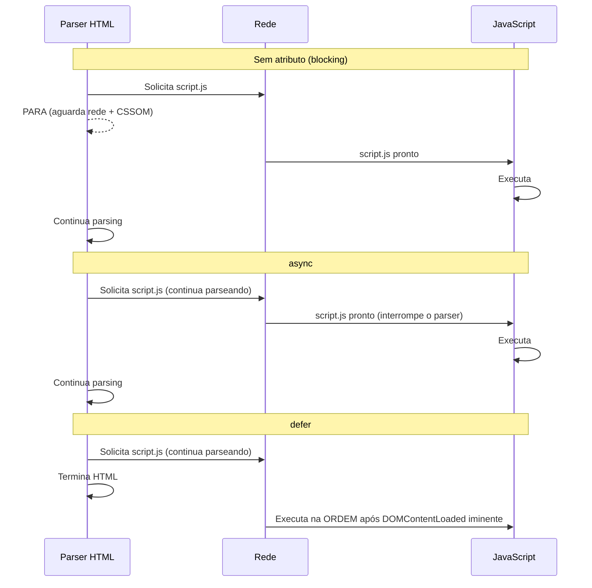

# Parse e construção do DOM e CSSOM

> [!abstract] TL;DR
> O browser transforma HTML em DOM e CSS em CSSOM através de parsing incremental. O HTML parser é resiliente e continua mesmo com erros; o CSS parser não — um CSS inválido é silenciosamente descartado. `<script>` sem `async`/`defer` bloqueia o parser HTML (e espera o CSSOM terminar antes de rodar). `async` carrega em paralelo e executa quando pronto; `defer` carrega em paralelo e executa na ordem, antes de `DOMContentLoaded`. Entender esse pipeline é a base de todas as otimizações de carregamento.

---

## O pipeline de renderização

Quando o browser recebe HTML:

```
Bytes → Caracteres → Tokens → Nós → DOM
                                        ↘
                                         Render Tree → Layout → Paint → Composite
                                        ↗
CSS Bytes → Tokens → Regras → CSSOM
```

1. **Tokenização**: o parser HTML lê byte a byte e gera tokens (`<div>`, `class="card"`, `</div>`)
2. **Construção do DOM**: tokens viram nós na árvore DOM
3. **Construção do CSSOM**: CSS é parseado em paralelo em um modelo de objeto separado
4. **Render Tree**: DOM + CSSOM são combinados (só elementos visíveis)
5. **Layout**: calcular posição e tamanho de cada elemento
6. **Paint**: rasterizar pixels
7. **Composite**: combinar layers no GPU e exibir

---

## Parsing incremental de HTML

O HTML parser é **incremental** — ele não espera o arquivo inteiro para começar. Conforme os bytes chegam, ele constrói o DOM progressivamente:

```html
<!-- O browser exibe o h1 enquanto ainda carrega o resto -->
<!DOCTYPE html>
<html>
<head>
  <title>Página</title>
</head>
<body>
  <h1>Título</h1>      <!-- já parseado e exibível -->
  <!-- ...mais conteúdo chegando via rede... -->
</body>
</html>
```

O parser HTML também é **resiliente**: tags não fechadas, atributos sem aspas, elementos aninhados incorretamente — o browser tenta corrigir e continua. É por isso que HTML malformado frequentemente "funciona".

---

## CSS bloqueia a renderização

O CSSOM precisa estar completo antes de o browser poder construir a Render Tree e renderizar. CSS é **render-blocking**:

```
HTML chegando → Parser HTML → DOM parcial
CSS chegando  → Parser CSS  → CSSOM completo?
                                    ↓ não → renderização bloqueada
                                    ↓ sim → Render Tree pode ser construída
```

Por isso:
- Coloque `<link rel="stylesheet">` no `<head>` — o CSS começa a carregar o mais cedo possível
- Minimize o tamanho do CSS crítico
- Use `media` queries para recursos não críticos: `<link media="print">` não bloqueia o render

---

## `<script>` bloqueia o parser

Um `<script>` sem atributos especiais **bloqueia o parser HTML** enquanto:
1. O script é baixado
2. O CSSOM está pronto (scripts podem ler computed styles — o browser aguarda o CSSOM)
3. O script é executado

```html
<!-- ❌ Bloqueia o parser HTML — sem async/defer -->
<head>
  <script src="analytics.js"></script> <!-- parser para aqui até terminar -->
</head>
```

---

## `async` vs `defer`

```html
<!-- async: baixa em paralelo, executa quando pronto (interrompe o parser) -->
<script async src="analytics.js"></script>

<!-- defer: baixa em paralelo, executa na ORDEM, após o parsing do HTML -->
<script defer src="app.js"></script>

<!-- module: defer por padrão -->
<script type="module" src="main.js"></script>
```



| | Baixa em paralelo? | Executa quando? | Preserva ordem? |
|---|---|---|---|
| Sem atributo | Não | Imediatamente (bloqueia parser) | — |
| `async` | Sim | Assim que baixar (interrompe parser) | Não |
| `defer` | Sim | Após parsing do HTML, antes de DOMContentLoaded | Sim |
| `type="module"` | Sim | Como defer | Sim |

---

## `DOMContentLoaded` vs `load`

```javascript
// DOMContentLoaded: DOM pronto, scripts defer executados
// Imagens, fontes, e outros recursos ainda podem estar carregando
document.addEventListener('DOMContentLoaded', () => {
  // ✅ DOM disponível — seguro para selecionar e manipular
  initApp();
});

// load: TUDO carregado (imagens, fontes, iframes, etc.)
window.addEventListener('load', () => {
  // Use quando precisar de dimensões de imagens, fontes carregadas, etc.
  initImageGallery(); // precisa saber o tamanho das imagens
});

// document.readyState:
// "loading" — parser ainda rodando
// "interactive" — DOM pronto (= DOMContentLoaded está para disparar)
// "complete" — tudo carregado (= load está para disparar)

if (document.readyState !== 'loading') {
  initApp(); // DOM já está pronto — rodar agora
} else {
  document.addEventListener('DOMContentLoaded', initApp);
}
```

---

## Preload e resource hints

```html
<!-- preload: "vou precisar desse recurso em breve — carregue agora" -->
<link rel="preload" href="fonte.woff2" as="font" crossorigin>
<link rel="preload" href="hero.jpg" as="image">
<link rel="preload" href="critical.css" as="style">

<!-- preconnect: estabelecer conexão TCP/TLS com origem antecipadamente -->
<link rel="preconnect" href="https://fonts.googleapis.com">
<link rel="preconnect" href="https://cdn.exemplo.com" crossorigin>

<!-- prefetch: baixar recurso de baixa prioridade para navegação futura -->
<link rel="prefetch" href="/pagina-seguinte.js">

<!-- modulepreload: preload específico para ES modules -->
<link rel="modulepreload" href="/src/app.js">
```

### `fetchpriority` — prioridade de carregamento

```html
<!-- LCP image — alta prioridade (browser prioriza imagens acima da dobra) -->


<!-- Imagem abaixo da dobra — baixa prioridade -->


<!-- Script não crítico -->
<script src="analytics.js" fetchpriority="low" async></script>
```

---

## Speculative parsing (preload scanner)

Enquanto o parser HTML está bloqueado por um `<script>`, o browser usa um **preload scanner** — ele lê o HTML à frente procurando recursos para baixar antecipadamente (`<link>`, `<script>`, ``):

```html
<head>
  <script src="blocking.js"></script>  <!-- bloqueia o parser -->
  <!-- Enquanto aguarda blocking.js: -->
  <link rel="stylesheet" href="styles.css">  <!-- preload scanner já baixou -->
  <script src="app.js"></script>              <!-- preload scanner já baixou -->
</head>
```

Por isso, colocar `<script>` no `<head>` sem `defer`/`async` prejudica a experiência — mas o preload scanner mitiga parcialmente o dano baixando outros recursos em paralelo.

---

> [!question] Para fixar
> 1. O browser precisa terminar de baixar todo o HTML antes de começar a construir o DOM? Por que o parsing é incremental?
> 2. Por que CSS é render-blocking? O que aconteceria se o browser renderizasse sem o CSSOM completo?
> 3. Um `<script>` sem atributos está no `<head>`. Ele pode rodar antes de o CSSOM estar pronto? Por quê?
> 4. Qual a diferença entre `async` e `defer`? Para um script que usa `document.querySelector`, qual é correto?
> 5. `DOMContentLoaded` dispara antes ou depois de scripts `defer` executarem? E antes ou depois de imagens carregarem?

---

## Veja também

- [[03-Dominios/Tecnologia/Plataforma Web/DOM/01 - O DOM como árvore|DOM 01 — O DOM como árvore]] — o resultado do parse
- [[03-Dominios/Tecnologia/Plataforma Web/Rendering Pipeline/02 - Render tree, layout e paint|02 — Render tree, layout e paint]] — próxima
- [[03-Dominios/Tecnologia/CSS/12 - Performance CSS|CSS 12 — Performance CSS]] — critical rendering path pelo ângulo do CSS
