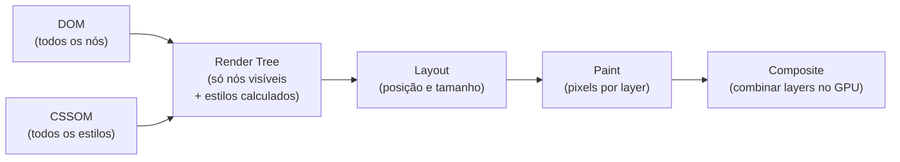
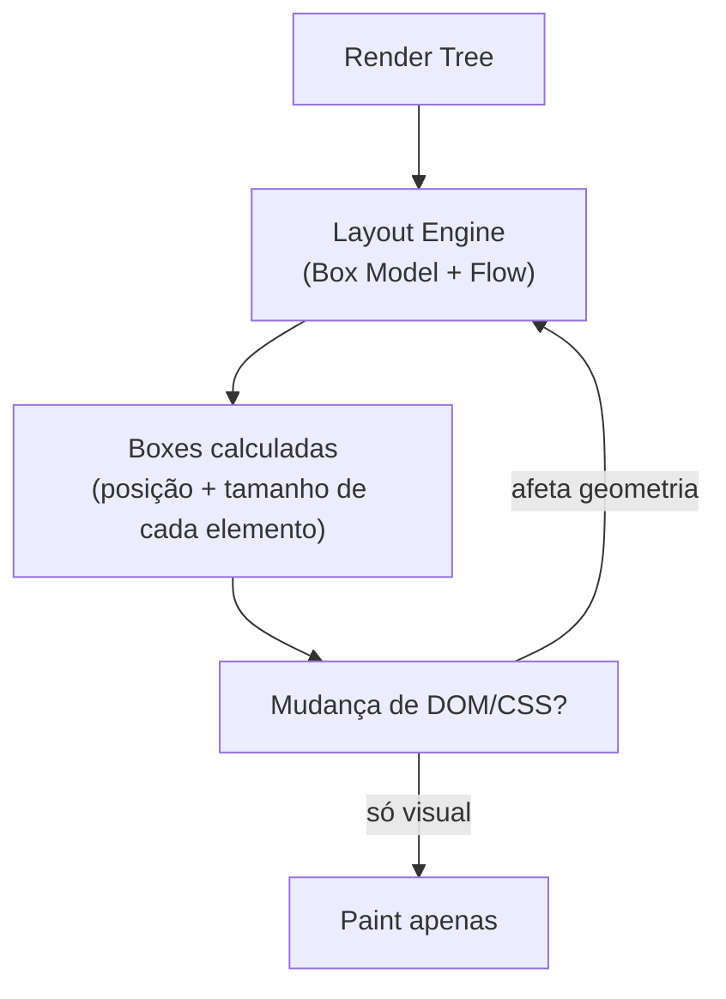
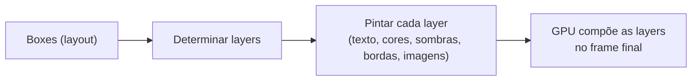

# Render tree, layout e paint

> [!abstract] TL;DR
> A Render Tree combina DOM e CSSOM — contém apenas elementos visíveis com seus estilos calculados. Layout (reflow) calcula posição e tamanho de cada elemento da Render Tree. Paint rasteriza pixels para cada layer. Qualquer mudança que afeta geometria dispara layout → paint. Mudanças que afetam só cor disparam apenas paint. O objetivo da otimização é chegar à etapa de composição (GPU) pulando layout e paint.

---

## Construção da Render Tree

A Render Tree é construída combinando DOM + CSSOM:



Regras de inclusão na Render Tree:
- `display: none` → **não inclui** o elemento (nem seus filhos)
- `visibility: hidden` → inclui, mas não é visível (ocupa espaço)
- `opacity: 0` → inclui e ocupa espaço (pode receber eventos)
- Elementos `<head>`, `<script>`, `<style>` → não incluídos

```css
/* Diferença crucial para o pipeline */
.hidden-layout { display: none; }     /* não entra na Render Tree — sem layout */
.hidden-visible { visibility: hidden; } /* entra — ocupa espaço, layout calculado */
.hidden-opacity { opacity: 0; }        /* entra — layout + paint + pode receber eventos */
```

---

## Computed styles — o que o CSSOM calcula

O CSSOM resolve herança, cascade, e unidades relativas em valores absolutos:

```css
/* O autor escreve: */
.card {
  margin: 2rem;
  font-size: 1.2em;
  color: inherit;
}

/* O browser calcula (computed style): */
/* margin-top: 32px (2rem = 2 × 16px base) */
/* font-size: 19.2px (1.2 × 16px do pai) */
/* color: #333333 (herdado do pai) */
```

```javascript
// Ler estilos calculados (forçam reflow se houver mudanças pendentes)
const computed = getComputedStyle(element);
computed.marginTop;        // "32px"
computed.fontSize;         // "19.2px"
computed.display;          // "block"
computed.width;            // "400px" (valor calculado, não "50%" que estava no CSS)
```

---

## Layout (Reflow)

Layout calcula a caixa de cada elemento na Render Tree:
- Posição exata (x, y)
- Dimensões (width, height)
- Posição relativa aos vizinhos e ao documento



### O que aciona reflow

Qualquer mudança que afeta geometria ou posição:

```javascript
// Mudanças de estilo que causam reflow:
el.style.width = '200px';
el.style.margin = '10px';
el.style.padding = '8px';
el.style.fontSize = '18px';
el.style.position = 'absolute';
el.style.top = '100px';

// Mudanças de conteúdo:
el.textContent = 'Novo texto mais longo';
el.appendChild(newElement);
el.remove();

// Leituras que FORÇAM reflow (se houver mudanças pendentes):
el.offsetWidth; el.offsetHeight; el.offsetTop; el.offsetLeft;
el.clientWidth; el.clientHeight;
el.scrollWidth; el.scrollHeight;
el.getBoundingClientRect();
getComputedStyle(el).width;
```

O browser é inteligente — ele não reflow imediatamente a cada mudança, mas aguarda até precisar de um valor de layout. Ler essas propriedades força o cálculo imediato.

---

## Paint

Após o layout, o browser rasteriza pixels para cada layer:



### O que aciona apenas paint (sem reflow)

```javascript
// Mudanças que não afetam geometria:
el.style.color = 'red';
el.style.backgroundColor = '#fff';
el.style.boxShadow = '0 2px 8px rgba(0,0,0,0.2)';
el.style.outline = '2px solid blue';
el.style.borderColor = 'green'; // só cor, não width/style
el.style.backgroundImage = 'url(...)';
```

### O que vai direto para composite (sem layout nem paint)

```javascript
// Apenas compositor GPU — mais barato:
el.style.transform = 'translateX(100px)';
el.style.transform = 'scale(1.2)';
el.style.opacity = '0.5';
// Animações com essas propriedades são sempre fluidas
```

---

## Composite e GPU layers

O browser divide a página em **layers** que são compostas pelo GPU:

```javascript
// O que cria uma nova GPU layer:
el.style.transform = 'translateZ(0)'; // hack antigo para forçar layer
el.style.willChange = 'transform, opacity'; // moderno e explícito

// Após will-change, transform e opacity NÃO acionam layout nem paint:
// o browser já sabe que vão mudar e mantém o elemento em layer separada
el.style.transform = 'translateY(-10px)'; // só recompõe no GPU
```

---

## O custo real do reflow

Reflow é caro porque é cascata — mudar o tamanho de um elemento pode afetar todos os seus descendentes e irmãos subsequentes. Um botão que aumenta de tamanho pode empurrar todo o conteúdo abaixo.

```javascript
// Medir o impacto: DevTools → Performance → gravar → buscar "Layout" em vermelho

// Armadilha: alternar read/write força reflow em cada iteração
for (const el of elements) {
  const h = el.offsetHeight;                // leitura → força reflow
  el.style.height = (h + 10) + 'px';       // escrita → invalida layout
  // próxima leitura → outro reflow
}

// Solução: batch reads, then batch writes
const heights = elements.map(el => el.offsetHeight); // todos os reads
elements.forEach((el, i) => {
  el.style.height = (heights[i] + 10) + 'px'; // todos os writes
});
```

---

## CSS `contain` — isolar reflow

A propriedade `contain` instrui o browser que um elemento é independente de seus ancestrais, limitando o escopo do reflow:

```css
/* contain: layout — muda dentro não afeta fora */
.widget { contain: layout; }

/* contain: paint — o browser sabe que pode pular paint fora dos limites */
.card { contain: paint; }

/* contain: content — layout + paint + style */
.isolated { contain: content; }

/* contain: strict — maximum isolation (layout + paint + size) */
.atom { contain: strict; }
```

```javascript
// content-visibility: auto — pula rendering de elementos fora do viewport
// O browser só renderiza quando o elemento está próximo de ser visível
```

```css
.article { content-visibility: auto; contain-intrinsic-size: 0 500px; }
/* contain-intrinsic-size: reserva espaço para evitar CLS ao rolar */
```

---

> [!question] Para fixar
> 1. Por que `display: none` é diferente de `visibility: hidden` no pipeline de rendering?
> 2. Quais leituras de propriedades forçam um reflow imediato? Por que o browser precisa fazer isso?
> 3. Quais propriedades CSS causam apenas repaint (sem reflow)? Quais vão direto para composite?
> 4. O que é "cascata de reflow"? Por que mudar o tamanho de um elemento pode ser caro?
> 5. O que `contain: layout` faz? Como isso ajuda em componentes como um feed com muitos itens?

---

## Veja também

- [[03-Dominios/Tecnologia/Plataforma Web/Rendering Pipeline/01 - Parse e construção do DOM e CSSOM|01 — Parse e construção]] — anterior
- [[03-Dominios/Tecnologia/Plataforma Web/Rendering Pipeline/03 - Compositing e GPU layers|03 — Compositing e GPU layers]] — próxima
- [[03-Dominios/Tecnologia/Plataforma Web/Rendering Pipeline/04 - Reflow e repaint|04 — Reflow e repaint]] — aprofunda layout thrashing
