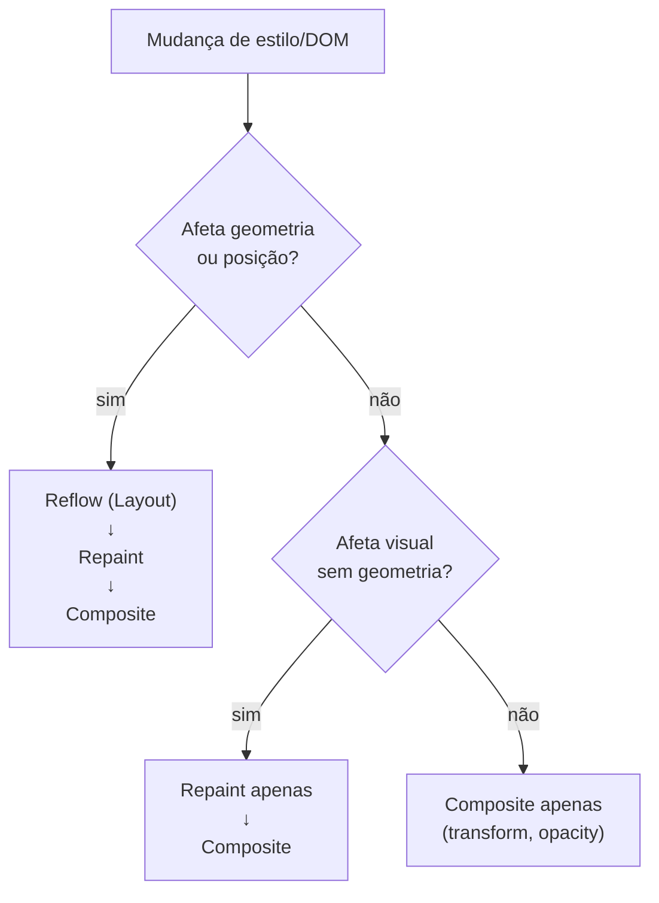

# Reflow e repaint — medir e eliminar

> [!abstract] TL;DR
> Reflow (layout) é o custo de recalcular geometria — caro porque cascatea. Repaint é redesenhar pixels sem recalcular posições — barato mas frequente. Layout thrashing (alternar leituras e escritas de propriedades de layout) força reflows múltiplos num único frame. A solução é batch: ler tudo, depois escrever tudo. O DevTools Performance aba é a ferramenta para identificar e medir.

---

## O que aciona reflow vs repaint vs composite



### Propriedades que causam reflow (lista principal)

```css
/* Dimensões */
width, height, min-width, max-width, min-height, max-height

/* Espaçamento */
margin, padding, border-width, border-style

/* Posição */
top, right, bottom, left (com position)
position (mudança de static para absolute, etc.)

/* Texto */
font-size, font-family, font-weight, line-height
white-space, word-break

/* Conteúdo */
/* Inserir/remover elementos */
/* Mudar textContent */

/* Visual que afeta layout */
display (none ↔ block/flex/etc.)
overflow (pode afetar scrollbars)
```

### Propriedades que causam apenas repaint

```css
color, background-color, background-image
box-shadow, text-shadow, outline
border-color (sem mudar width)
visibility (hidden ↔ visible)
```

### Propriedades que vão direto para composite

```css
transform     /* translate, rotate, scale, skew */
opacity
filter        /* blur, etc. — varia por browser */
```

---

## Layout thrashing — o anti-pattern clássico

Thrashing acontece quando você **lê** e **escreve** propriedades de layout alternadamente:

```javascript
// ❌ Thrashing — O(N) reflows
const boxes = document.querySelectorAll('.box');

boxes.forEach(box => {
  // Leitura — o browser precisa fazer o reflow para ter o valor atualizado
  const width = box.offsetWidth;

  // Escrita — invalida o layout calculado
  box.style.width = (width * 1.1) + 'px';
  
  // Próxima leitura → outro reflow forçado
});
```

```javascript
// ✅ Batch reads → batch writes — O(1) reflow total
const boxes = [...document.querySelectorAll('.box')];

// Fase 1: todas as leituras
const widths = boxes.map(box => box.offsetWidth);

// Fase 2: todas as escritas
boxes.forEach((box, i) => {
  box.style.width = (widths[i] * 1.1) + 'px';
});
```

---

## Leituras que forçam layout sync (forced synchronous layout)

```javascript
// Essas propriedades, quando lidas após uma escrita, forçam reflow imediato:

// Geometry
offsetWidth, offsetHeight, offsetTop, offsetLeft, offsetParent
clientWidth, clientHeight, clientTop, clientLeft
scrollWidth, scrollHeight, scrollTop, scrollLeft

// Position / Size
getBoundingClientRect()
getClientRects()

// Computed style
getComputedStyle(el).width       // qualquer dimensão
getComputedStyle(el).transform   // valores calculados

// Scroll
window.scrollX, window.scrollY
element.scrollIntoView()

// Focus (pode afetar layout ao exibir outline)
element.focus()
```

---

## Medir com DevTools Performance

```
1. Abrir DevTools → Performance
2. Clicar no botão de gravação
3. Interagir com a página
4. Parar a gravação
5. Procurar:
   - "Layout" em amarelo (reflow custoso)
   - "Paint" em verde
   - "Composite Layers" em cinza (ok — barato)
   - Barras vermelhas no topo = frames perdidos (> 16ms)
```

Para identificar thrashing especificamente:
- Procure por "Forced reflow is a likely performance bottleneck" no DevTools console
- Ou use a API de performance:

```javascript
// Medir tempo de operação
performance.mark('start-render');
renderList(data);
performance.mark('end-render');
performance.measure('render', 'start-render', 'end-render');

const measure = performance.getEntriesByName('render')[0];
console.log(`Render: ${measure.duration.toFixed(2)}ms`);
```

---

## FastDOM — pattern de batch automático

Para código legado com muitas leituras e escritas espalhadas, a biblioteca FastDOM batcheia automaticamente:

```javascript
import fastdom from 'fastdom';

function updateElement(el) {
  // ✅ FastDOM garante que todas as leituras ficam juntas e todas as escritas juntas
  fastdom.measure(() => {
    const height = el.offsetHeight;
    
    fastdom.mutate(() => {
      el.style.height = (height + 10) + 'px';
    });
  });
}

// Pode ser chamado muitas vezes — FastDOM batcheia no próximo frame
elements.forEach(updateElement);
```

---

## Padrões para evitar thrashing

### 1. Ler tudo antes de escrever

```javascript
// ✅ Ler, depois escrever
function syncHeights(source, targets) {
  const height = source.offsetHeight; // UMA leitura
  targets.forEach(el => {
    el.style.height = height + 'px'; // múltiplas escritas OK
  });
}
```

### 2. Cache de leituras quando possível

```javascript
// ✅ Cachear dimensões que não mudam no loop
const containerWidth = container.offsetWidth; // uma leitura
items.forEach(item => {
  item.style.width = (containerWidth / items.length) + 'px';
});
```

### 3. requestAnimationFrame para separar leituras de escritas por frame

```javascript
function readThenWrite() {
  // Frame atual: ler
  const height = el.offsetHeight;
  
  // Próximo frame: escrever (depois que o browser atualizou o layout)
  requestAnimationFrame(() => {
    el.style.height = (height + 10) + 'px';
  });
}
```

### 4. CSS Variables para evitar leituras de JS

```javascript
// ❌ Ler width para calcular posição
const width = container.offsetWidth;
item.style.left = (width / 2) + 'px';

// ✅ CSS variáveis — o browser cuida do cálculo
container.style.setProperty('--container-w', container.offsetWidth + 'px');
```

```css
.item {
  left: calc(var(--container-w) / 2);
}
```

---

## ResizeObserver — alternativa a ouvir resize

Ouvir `window.resize` para reagir a mudanças de tamanho é ineficiente — dispara muito e pode causar thrashing:

```javascript
// ❌ window.resize — caro
window.addEventListener('resize', () => {
  const w = container.offsetWidth; // leitura
  adjustLayout(w);                 // escrita
});

// ✅ ResizeObserver — entregue após layout, não causa thrashing
const observer = new ResizeObserver((entries) => {
  for (const entry of entries) {
    const { width, height } = entry.contentRect; // disponível sem leitura adicional
    adjustLayout(width);
  }
});
observer.observe(container);
```

---

> [!question] Para fixar
> 1. O que é layout thrashing? Escreva um exemplo concreto com um loop que causa thrashing e a versão corrigida.
> 2. `getComputedStyle(el).width` após uma mudança de CSS: causa reflow? Por quê?
> 3. No DevTools Performance, o que indica um frame com layout thrashing? Onde você vê?
> 4. Por que usar `ResizeObserver` em vez de ouvir `window.resize` para ajustar layout responsivo?
> 5. O que FastDOM faz? Como ele resolve thrashing sem que o desenvolvedor precise gerenciar manualmente a ordem das operações?

---

## Veja também

- [[03-Dominios/Tecnologia/Plataforma Web/Rendering Pipeline/03 - Compositing e GPU layers|03 — Compositing]] — anterior
- [[03-Dominios/Tecnologia/Plataforma Web/Rendering Pipeline/05 - Critical Rendering Path otimizado|05 — CRP otimizado]] — próxima
- [[03-Dominios/Tecnologia/Plataforma Web/DOM/06 - DocumentFragment e batch mutations|DOM 06 — DocumentFragment]] — batch mutations para evitar reflows
