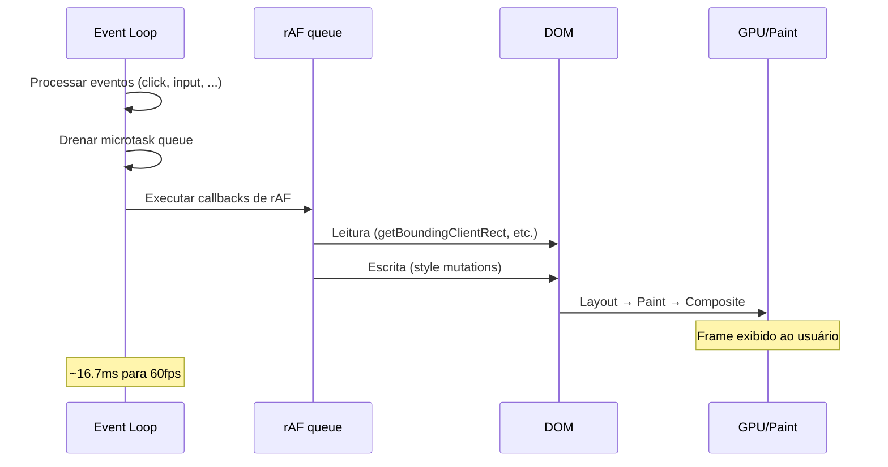

# requestAnimationFrame e animação imperativa

> [!abstract] TL;DR
> `requestAnimationFrame` (rAF) é o lugar certo para qualquer manipulação de DOM que precisa ser sincronizada com o próximo frame — animações, atualizações de canvas, FLIP animations. Ele executa antes do paint, depois que o browser processou eventos. Em abas inativas, rAF é suspenso automaticamente — economizando CPU. `requestIdleCallback` é para trabalho de baixa prioridade que pode esperar até o browser estar ocioso.

---

## Por que rAF e não setTimeout para animações

```javascript
// ❌ setTimeout para animação — pode não sincronizar com o refresh da tela
let pos = 0;
function animate() {
  pos += 2;
  el.style.transform = `translateX(${pos}px)`;
  setTimeout(animate, 16.7); // tenta 60fps mas não está garantido
}
setTimeout(animate, 16.7);
// Problemas:
// - Pode disparar no meio de um frame (visual lag)
// - Não para quando a aba está em background
// - Acumula atraso (drift)

// ✅ rAF — sincronizado com o refresh da tela
function animate(timestamp) {
  pos += 2;
  el.style.transform = `translateX(${pos}px)`;
  requestAnimationFrame(animate); // próximo frame
}
requestAnimationFrame(animate);
// - Sincronizado com o vsync do monitor
// - Suspenso automaticamente em aba inativa
// - Sem drift
```

---

## O ciclo de um frame



O rAF callback executa **depois dos eventos** e **antes do paint** — o lugar ideal para:
- Ler layout (getBoundingClientRect, etc.)
- Escrever estilo/DOM
- Garantindo que a mudança será visível no próximo frame

---

## Animação com delta time

Animações baseadas em tempo são mais estáveis que as baseadas em frames (que variam com a carga do sistema):

```javascript
// ❌ Baseado em frames — velocidade varia com a taxa de refresh
function animate() {
  pos += 5; // 5px por frame — diferente em 30fps vs 60fps vs 120fps
  el.style.transform = `translateX(${pos}px)`;
  requestAnimationFrame(animate);
}

// ✅ Baseado em tempo — velocidade constante independente da taxa de refresh
const SPEED = 300; // pixels por segundo
let lastTime = null;

function animate(timestamp) {
  if (lastTime === null) lastTime = timestamp;
  const delta = (timestamp - lastTime) / 1000; // em segundos
  lastTime = timestamp;

  pos += SPEED * delta; // 300px/s independente do fps
  el.style.transform = `translateX(${pos}px)`;
  
  if (pos < 500) {
    requestAnimationFrame(animate);
  }
}

requestAnimationFrame(animate);
```

---

## Cancelar e pausar animações

```javascript
let animationId = null;
let isPaused = false;

function startAnimation() {
  if (animationId) return; // já rodando
  animationId = requestAnimationFrame(animate);
}

function stopAnimation() {
  if (animationId) {
    cancelAnimationFrame(animationId);
    animationId = null;
  }
}

function pauseAnimation() {
  isPaused = !isPaused;
}

function animate(timestamp) {
  if (!isPaused) {
    // atualizar estado
    update(timestamp);
    render();
  }
  animationId = requestAnimationFrame(animate);
}

// Parar quando aba fica inativa (rAF já faz isso, mas para outros recursos:)
document.addEventListener('visibilitychange', () => {
  if (document.hidden) {
    stopAnimation();
  } else {
    startAnimation();
  }
});
```

---

## FLIP animations — animações de layout fluidas

FLIP (First, Last, Invert, Play) é uma técnica para animar propriedades que causariam reflow (como `width`, `height`, `position`), mas mantendo a animação no compositor:

```javascript
function flipAnimation(element, callback) {
  // First: capturar posição inicial
  const first = element.getBoundingClientRect();

  // Execute a mudança de layout (que causaria reflow)
  callback();

  // Last: capturar posição final
  const last = element.getBoundingClientRect();

  // Invert: calcular a transformação que desfaz a mudança
  const deltaX = first.left - last.left;
  const deltaY = first.top - last.top;
  const deltaW = first.width / last.width;
  const deltaH = first.height / last.height;

  // Aplicar a transformação inversa (elemento parece estar na posição inicial)
  element.style.transform = `
    translate(${deltaX}px, ${deltaY}px)
    scale(${deltaW}, ${deltaH})
  `;
  element.style.transformOrigin = 'top left';

  // Play: animar de volta ao zero (a posição/tamanho final real)
  requestAnimationFrame(() => {
    element.style.transition = 'transform 0.3s ease';
    element.style.transform = '';

    element.addEventListener('transitionend', () => {
      element.style.transition = '';
      element.style.transformOrigin = '';
    }, { once: true });
  });
}

// Uso: mover um card para outra posição sem reflow visible
const card = document.querySelector('.card');
flipAnimation(card, () => {
  newContainer.appendChild(card); // move para o DOM — causa reflow
});
// A animação parece fluida porque FLIP faz ela no compositor
```

---

## Canvas com rAF — game loop

```javascript
const canvas = document.querySelector('canvas');
const ctx = canvas.getContext('2d');

const state = {
  balls: [
    { x: 100, y: 100, vx: 3, vy: 2, r: 20 }
  ]
};

function update(delta) {
  state.balls.forEach(ball => {
    ball.x += ball.vx * delta * 60; // delta em segundos, target 60fps
    ball.y += ball.vy * delta * 60;

    // Bounce nas bordas
    if (ball.x + ball.r > canvas.width || ball.x - ball.r < 0) {
      ball.vx *= -1;
    }
    if (ball.y + ball.r > canvas.height || ball.y - ball.r < 0) {
      ball.vy *= -1;
    }
  });
}

function render() {
  ctx.clearRect(0, 0, canvas.width, canvas.height);
  
  state.balls.forEach(ball => {
    ctx.beginPath();
    ctx.arc(ball.x, ball.y, ball.r, 0, Math.PI * 2);
    ctx.fillStyle = '#0077cc';
    ctx.fill();
  });
}

let lastTime = null;
function loop(timestamp) {
  if (lastTime === null) lastTime = timestamp;
  const delta = (timestamp - lastTime) / 1000;
  lastTime = timestamp;

  update(delta);
  render();
  
  requestAnimationFrame(loop);
}

requestAnimationFrame(loop);
```

---

## `requestIdleCallback` — trabalho de baixa prioridade

Para tarefas que não precisam acontecer imediatamente, `requestIdleCallback` espera até o browser estar ocioso:

```javascript
function processLowPriorityWork(items) {
  const remaining = [...items];

  function processChunk(deadline) {
    // Processar enquanto houver tempo disponível neste idle period
    while (deadline.timeRemaining() > 5 && remaining.length > 0) {
      const item = remaining.shift();
      processItem(item);
    }

    // Se ainda houver trabalho, agendar para o próximo idle
    if (remaining.length > 0) {
      requestIdleCallback(processChunk, { timeout: 2000 });
    }
  }

  requestIdleCallback(processChunk, { timeout: 2000 });
}

// Casos de uso:
// - Pré-computar dados para próximas interações
// - Analytics e tracking
// - Indexação de conteúdo
// - Persistência de estado não crítico
```

---

> [!question] Para fixar
> 1. Por que `requestAnimationFrame` é melhor que `setTimeout(fn, 16)` para animações?
> 2. O que é delta time? Por que animações baseadas em tempo são mais estáveis que as baseadas em frames?
> 3. O que é FLIP? Qual o problema que resolve e como transforma um reflow em animação compositor-only?
> 4. Em que ponto do ciclo de um frame o callback de rAF executa? Antes ou depois do paint?
> 5. Quando você usaria `requestIdleCallback` em vez de `requestAnimationFrame`?

---

## Veja também

- [[03-Dominios/Tecnologia/Plataforma Web/Rendering Pipeline/05 - Critical Rendering Path otimizado|05 — CRP otimizado]] — anterior
- [[03-Dominios/Tecnologia/Plataforma Web/Rendering Pipeline/07 - Rendering em entrevista|07 — Rendering em entrevista]] — próxima e capstone
- [[03-Dominios/Tecnologia/Plataforma Web/Eventos/06 - Timers e microtasks|Eventos 06 — Timers]] — context de rAF no event loop
