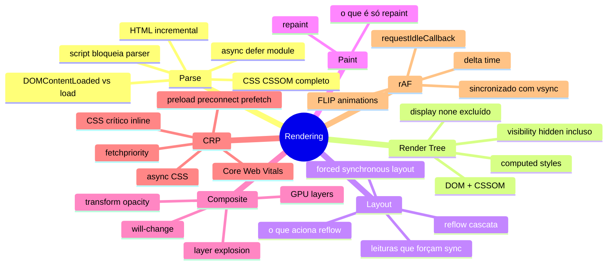

# Rendering em entrevista

> [!abstract] TL;DR
> Capstone do galho Rendering Pipeline. A pergunta mais clássica: "explique o que acontece do URL ao primeiro pixel". Outras frequentes: diferença reflow/repaint, como evitar layout thrashing, por que transform é mais performático que top/left, Core Web Vitals LCP/CLS/INP, e como CSS critical path funciona.

---

## Mapa do galho Rendering Pipeline



---

## A pergunta clássica: "o que acontece do URL ao pixel?"

Resposta estruturada para entrevista (30-60 segundos):

1. **DNS lookup** — resolve o domínio para um IP
2. **TCP handshake** + TLS se HTTPS
3. **HTTP request** — browser pede o HTML
4. **Parser HTML começa** incrementalmente ao receber bytes
5. **Preload scanner** dispara downloads de CSS, scripts, fontes em paralelo
6. **CSSOM construído** quando o CSS termina de baixar e parsear
7. **Scripts síncronos** bloqueiam o parser e esperam o CSSOM; `defer`/`async` baixam em paralelo
8. **DOM construído** quando o HTML é totalmente parseado
9. **Render Tree** combinando DOM + CSSOM (só nós visíveis + estilos calculados)
10. **Layout** calcula posição e tamanho de cada elemento
11. **Paint** rasteriza pixels para cada layer
12. **Composite** combina layers no GPU → **primeiro pixel exibido**

---

## Top 10 — perguntas de entrevista

### 1. Qual a diferença entre reflow e repaint?

- **Reflow** (layout): recalcular geometria — posição e tamanho. É caro porque cascatea pelos descendentes e irmãos. Acionado por mudanças em `width`, `height`, `margin`, `padding`, inserção/remoção de elementos, mudança de texto.

- **Repaint**: redesenhar pixels sem recalcular geometria. Mais barato. Acionado por `color`, `background-color`, `box-shadow`, `visibility`.

- **Composite only**: mover/escalar no GPU sem reflow ou repaint. Apenas `transform` e `opacity`.

---

### 2. O que é layout thrashing? Como evitar?

Layout thrashing: alternar leitura e escrita de propriedades de layout no mesmo frame. Força o browser a fazer reflow a cada leitura.

```javascript
// ❌ Thrashing
elements.forEach(el => {
  const h = el.offsetHeight; // read — força reflow se houve write antes
  el.style.height = (h + 10) + 'px'; // write — invalida layout
});

// ✅ Batch: reads first, then writes
const heights = elements.map(el => el.offsetHeight); // todos os reads
elements.forEach((el, i) => el.style.height = (heights[i] + 10) + 'px'); // todos os writes
```

---

### 3. Por que `transform` é mais performático que `top`/`left`?

- `top`/`left` (com `position`) causam **reflow** (layout) + repaint toda vez que mudam
- `transform` é processado pelo **compositor GPU** — sem tocar no CPU para layout ou paint

```css
/* ❌ Reflow + repaint a cada frame */
.slide { position: relative; transition: left 0.3s; }
.slide:hover { left: 10px; }

/* ✅ Só compositor — fluido mesmo com page load pesado */
.slide { transition: transform 0.3s; }
.slide:hover { transform: translateX(10px); }
```

---

### 4. O que `will-change` faz? Quando usar?

`will-change: transform` informa ao browser que o elemento vai ser transformado — ele cria uma GPU layer antecipadamente. Isso evita a promoção de layer acontecer no primeiro frame da animação (que causaria um flash).

Usar antes de animações frequentes e remover depois:

```javascript
el.style.willChange = 'transform';
// ... iniciar animação
el.addEventListener('transitionend', () => {
  el.style.willChange = 'auto'; // libera memória de GPU
}, { once: true });
```

---

### 5. O que é Critical Rendering Path? Como otimizar?

O CRP é a sequência HTML → DOM/CSSOM → Render Tree → Layout → Paint. Recursos que bloqueiam: CSS e scripts síncronos.

Otimizações principais:
- **CSS crítico inline** — elimina round-trip de rede para o CSS above-the-fold
- **CSS não-crítico async** — `preload + onload` trick
- **Scripts defer/async** — não bloqueiam o parser
- **preconnect** para origens externas (fonts, CDN)
- **preload** para LCP image, fontes
- **fetchpriority="high"** na imagem LCP

---

### 6. O que é LCP? Como melhorar?

LCP (Largest Contentful Paint) mede quando o maior elemento visível na viewport termina de renderizar. Boa: < 2.5s. Ruim: > 4s.

Para melhorar:
1. Identificar o LCP element (DevTools → Performance)
2. Carregar com `fetchpriority="high"`
3. `<link rel="preload">` para a imagem LCP
4. Formato eficiente (WebP/AVIF)
5. CDN próximo ao usuário
6. Remover CSS/scripts que bloqueiam o CRP antes do LCP

---

### 7. O que é CLS? Como evitar?

CLS (Cumulative Layout Shift) mede instabilidade visual — quanto o layout "pula" durante a carga. Bom: < 0.1.

Causas comuns e soluções:

```html
<!-- ✅ Dimensões explícitas em imagens -->


<!-- ✅ Reservar espaço para conteúdo dinâmico -->
<div style="min-height: 250px;"><!-- anúncio carrega aqui --></div>
```

```css
/* ✅ font-display para evitar FOUT que causa shift */
@font-face {
  font-display: optional; /* usa a fonte só se já estiver no cache */
}
```

---

### 8. O que `requestAnimationFrame` faz? Por que é melhor que `setTimeout`?

- `requestAnimationFrame` executa **antes do próximo paint**, sincronizado com o vsync do monitor
- Em abas inativas, é suspenso automaticamente (économia de CPU)
- `setTimeout(fn, 16)` não garante sincronização com o frame — pode causar "tearing" visual

```javascript
// ✅ Animação fluida e eficiente
function animate(timestamp) {
  // timestamp: ms desde page load
  el.style.transform = `translateX(${easeOut(timestamp)}px)`;
  requestAnimationFrame(animate);
}
requestAnimationFrame(animate);
```

---

### 9. O que causa paint flashing? Como inspecionar?

Paint flashing: o browser redesenhando regiões da página desnecessariamente.

Para inspecionar: DevTools → Rendering → ☑ Paint flashing (áreas que repintam ficam verdes).

Causas comuns:
- Animações de propriedades que causam repaint (`background-color`, `color`, `box-shadow`)
- `transition` em propriedades que não são compositor-only

Solução: mover para `transform`/`opacity`, ou usar `will-change` para promover à sua própria layer (outros repaints não afetam o elemento).

---

### 10. `async` vs `defer` — qual usar?

| | `async` | `defer` |
|---|---|---|
| Baixa em paralelo | Sim | Sim |
| Executa | Quando termina de baixar (qualquer hora) | Após parsing do HTML completo |
| Preserva ordem | Não | Sim |
| Acessa DOM | Pode não estar pronto | DOM está pronto |
| Uso | Analytics, scripts independentes | Scripts de app que precisam do DOM |

Para scripts de aplicação que manipulam DOM: sempre `defer`. Para scripts independentes como analytics: `async`.

---

## Armadilhas clássicas

```javascript
// 1. display: none — o browser EXCLUI o elemento da Render Tree
// Mudar de none para block aciona layout de todos os descendentes
el.style.display = 'block'; // ❌ se feito no meio de animação

// ✅ Usar opacity: 0 + visibility: hidden para "esconder" sem remover do layout
// ou usar CSS transitions com display (animating display - suportado no CSS novo)

// 2. getComputedStyle força layout sync
const style = getComputedStyle(el);
el.style.width = '200px';
style.width; // força reflow para ter o valor atualizado

// 3. scrollTop leitura após escrita de estilo = reflow forçado
el.style.marginTop = '20px';
container.scrollTop; // forced synchronous layout!

// 4. será que a imagem LCP tem fetchpriority="high"?
// Sem ela, o browser pode tratar como baixa prioridade
// e o LCP sufre

// 5. font-display ausente = FOIT (flash of invisible text) ou FOUT (flash of unstyled)
// → CLS ao trocar de fonte
```

---

## Veja também

- [[03-Dominios/Tecnologia/Plataforma Web/Rendering Pipeline/06 - requestAnimationFrame e animação imperativa|06 — rAF]] — anterior
- [[03-Dominios/Tecnologia/Plataforma Web/Rendering Pipeline/index|Rendering Pipeline — índice]]
- [[03-Dominios/Tecnologia/Plataforma Web/Web APIs/01 - Intersection Observer|Web APIs 01 — Intersection Observer]] — próximo galho
