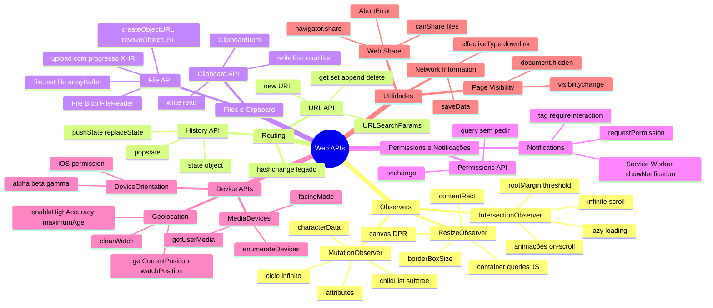

# Web APIs em entrevista

> [!abstract] TL;DR
> Capstone do galho Web APIs. As perguntas mais frequentes envolvem os três Observers (IntersectionObserver para visibilidade, MutationObserver para mudanças de DOM, ResizeObserver para tamanho), a diferença entre pushState e hash routing, como lidar com permissões do browser sem degradar a UX, e quando cada API é a ferramenta certa para o trabalho.

---

## Mapa do galho Web APIs



---

## Top 10 — perguntas de entrevista

### 1. Qual a diferença entre IntersectionObserver, MutationObserver e ResizeObserver?

| Observer | Detecta | Quando usar |
|---|---|---|
| `IntersectionObserver` | Visibilidade no viewport | Lazy loading, animações on-scroll, infinite scroll |
| `MutationObserver` | Mudanças de DOM (atributos, filhos, texto) | Reagir a mudanças de terceiros, esperar elemento aparecer |
| `ResizeObserver` | Mudanças de tamanho de elementos | Layout responsivo por componente, canvas responsivo |

Todos são assíncronos, entregam notificações em batch, e não bloqueiam o main thread.

---

### 2. Como você implementaria lazy loading de imagens sem Intersection Observer?

Sem IO, a alternativa é ouvir o evento `scroll` e chamar `getBoundingClientRect()` a cada evento:

```javascript
// ❌ Performance ruim — getBoundingClientRect em cada scroll event
window.addEventListener('scroll', () => {
  document.querySelectorAll('img[data-src]').forEach(img => {
    const rect = img.getBoundingClientRect();
    if (rect.top < window.innerHeight) {
      img.src = img.dataset.src;
    }
  });
});

// ✅ Com IntersectionObserver — sem scroll handler
const observer = new IntersectionObserver(entries => {
  entries.filter(e => e.isIntersecting).forEach(entry => {
    entry.target.src = entry.target.dataset.src;
    observer.unobserve(entry.target);
  });
}, { rootMargin: '200px' });

document.querySelectorAll('img[data-src]').forEach(img => observer.observe(img));
```

O problema do `scroll` + `getBoundingClientRect`: chamadas de layout sincrono a cada scroll event causam forced synchronous layout se houver write antes. IO é assíncrono e não toca o main thread para cálculos de geometria.

---

### 3. Como você esperaria que um elemento aparecesse no DOM sem polling?

Polling com `setInterval` é ineficiente. MutationObserver é a solução:

```javascript
function waitForElement(selector) {
  return new Promise(resolve => {
    const existing = document.querySelector(selector);
    if (existing) { resolve(existing); return; }

    const observer = new MutationObserver(() => {
      const el = document.querySelector(selector);
      if (el) {
        observer.disconnect();
        resolve(el);
      }
    });

    observer.observe(document.body, { childList: true, subtree: true });
  });
}
```

---

### 4. Como o routing de SPA funciona sem recarregar a página?

Duas abordagens:

**Hash routing (legado):**
```javascript
window.addEventListener('hashchange', () => route(location.hash.slice(1)));
location.hash = '/sobre'; // dispara hashchange, não recarrega
```

**History API (moderno):**
```javascript
history.pushState({}, '', '/sobre'); // muda URL, não dispara popstate
// popstate só dispara no botão voltar/avançar
window.addEventListener('popstate', () => route(location.pathname));
```

Diferença chave: `pushState` cria URLs reais (sem `#`), mas requer servidor configurado para servir `index.html` em todas as rotas. Hash routing funciona sem configuração de servidor.

---

### 5. Por que nunca usar `document.execCommand('copy')` em código novo?

`execCommand` é deprecated e foi removido de vários browsers. A alternativa moderna é `navigator.clipboard`:

```javascript
// ❌ Deprecated
document.execCommand('copy');

// ✅ Moderno, assíncrono, com tratamento de erro
await navigator.clipboard.writeText(text);
```

`navigator.clipboard` requer HTTPS e um gesto do usuário. `execCommand` não requeria — por isso era abusado. A nova API é mais segura e explícita.

---

### 6. Qual a diferença entre `pushState` e `replaceState`?

- `pushState` adiciona nova entrada no histórico — usuário pode apertar "voltar" para retornar à URL anterior
- `replaceState` **substitui** a entrada atual — "voltar" vai para a URL antes desta sessão de navegação

```javascript
// Navegação entre páginas: pushState (usuário pode voltar)
history.pushState({ page: 'sobre' }, '', '/sobre');

// Atualização de filtros/paginação: replaceState (não poluir o histórico)
history.replaceState({ page: 1, color: 'blue' }, '', '?page=1&color=blue');
```

---

### 7. Como pedir permissão de notificação sem degradar a UX?

O erro comum é pedir permissão imediatamente ao carregar a página — browsers bloqueiam automaticamente e usuários negam sem pensar.

Padrão correto:
1. Usar `navigator.permissions.query()` para verificar o estado sem pedir
2. Mostrar UI de contexto explicando o benefício
3. Só pedir permissão quando o usuário clica num botão "Ativar notificações"

```javascript
const { state } = await navigator.permissions.query({ name: 'notifications' });

if (state === 'prompt') {
  showNotificationBanner(); // "Ative notificações para receber alertas"
} else if (state === 'denied') {
  // Não mostrar banner — usuário já negou
}
```

---

### 8. O que é `URL.createObjectURL` e quando usar `revokeObjectURL`?

`URL.createObjectURL(blob)` cria uma URL temporária (`blob:https://...`) que aponta para dados em memória. Libera o arquivo sem upload para servidor.

**Liberar com `revokeObjectURL`** quando não precisar mais — caso contrário, o objeto fica em memória até a página fechar:

```javascript
const url = URL.createObjectURL(file);
image.src = url;

// Liberar quando a imagem carregar (ou quando não precisar mais)
image.onload = () => URL.revokeObjectURL(url);
```

Se criar muitas URLs sem revogar, haverá memory leak gradual.

---

### 9. Como você adaptaria conteúdo à qualidade da rede?

```javascript
function getMediaQuality() {
  const conn = navigator.connection;
  if (!conn) return 'medium'; // sem suporte: mediano por padrão
  
  if (conn.saveData) return 'low';
  
  switch (conn.effectiveType) {
    case '4g': return 'high';
    case '3g': return 'medium';
    default:   return 'low';
  }
}

// Observar mudanças
navigator.connection?.addEventListener('change', () => {
  updateVideoQuality(getMediaQuality());
});
```

---

### 10. O que é Web Share e por que é melhor que botões de redes sociais?

Web Share aciona a caixa de compartilhamento **nativa do sistema operacional** — o usuário escolhe para qual app compartilhar (WhatsApp, Telegram, email, SMS, etc.) sem que o site precise conhecer cada app.

Vantagens:
- Interface nativa familiar ao usuário
- Funciona com qualquer app instalado, incluindo futuros
- Não requer JavaScript de terceiros (rastreamento)
- Mais usada em mobile (onde botões sociais são menores/mais difíceis de tocar)

```javascript
// Verificar suporte e mostrar botão apenas quando disponível
const shareBtn = document.getElementById('share');
shareBtn.hidden = !navigator.share;

shareBtn.onclick = async () => {
  try {
    await navigator.share({ title: document.title, url: location.href });
  } catch (err) {
    if (err.name !== 'AbortError') showFallbackButtons();
  }
};
```

---

## Armadilhas clássicas

| Armadilha | Problema | Solução |
|---|---|---|
| Chamar `Notification.requestPermission()` ao carregar | Browser bloqueia automaticamente, UX ruim | Só pedir após gesto do usuário |
| `popstate` não dispara em `pushState` | Código não reage ao navegar | Chamar o router manualmente após `pushState` |
| `URL.createObjectURL` sem `revokeObjectURL` | Memory leak acumulado | Revogar no `onload` ou quando não precisar mais |
| `MutationObserver` modificando DOM que observa | Ciclo infinito | Usar `attributeFilter` para excluir o atributo que você mesmo seta |
| `getBoundingClientRect()` em scroll handler | Forced synchronous layout em cada scroll | Usar IntersectionObserver |
| Ignorar `AbortError` no Web Share | Log de erro falso quando usuário cancela | `if (err.name !== 'AbortError')` antes de logar |
| iOS sem `DeviceMotionEvent.requestPermission()` | Acelerômetro silencioso (sem dados, sem erro) | Verificar `typeof DeviceMotionEvent.requestPermission === 'function'` |

---

## Veja também

- [[03-Dominios/Tecnologia/Plataforma Web/Web APIs/07 - Web Share e outras APIs|07 — Web Share e outras APIs]] — anterior
- [[03-Dominios/Tecnologia/Plataforma Web/Web APIs/index|Web APIs — índice]]
- [[03-Dominios/Tecnologia/Plataforma Web/Storage/index|G5 — Storage]] — próximo galho
