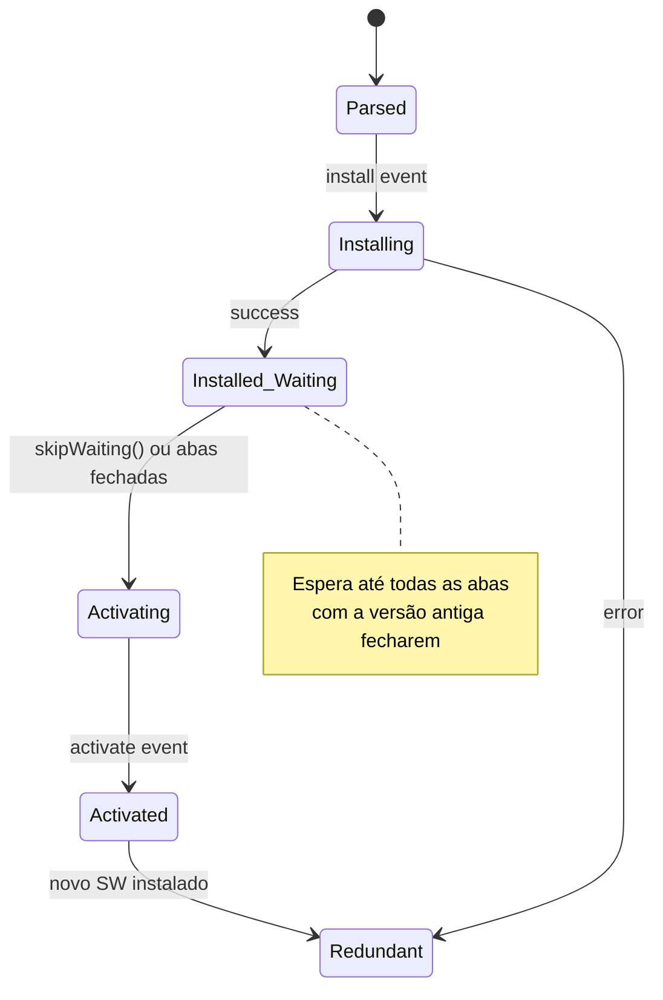

# Service Workers e ciclo de vida

> [!abstract] TL;DR
> Service Workers são proxy de rede — interceptam todos os requests entre a página e a rede. Permitem cache offline, push notifications, background sync. Têm um ciclo de vida próprio (install → waiting → active) que garante que um SW novo só assume quando todas as abas da versão antiga forem fechadas. Entendem o ciclo de vida é fundamental para não criar bugs de cache.

---

## O que é um Service Worker

```
Browser Tab
    ↓  request
Service Worker  ←→  Cache API
    ↓  (cache miss)
    Network
```

- Roda em thread separada (não tem acesso ao DOM)
- Intercepta requests via evento `fetch`
- Persiste entre visitas (diferente de Web Workers)
- Requer HTTPS (ou localhost para desenvolvimento)
- Escopo: controla requests do path onde está registrado e subpaths

---

## Registro

```javascript
// main.js — registrar o Service Worker
async function registerSW() {
  if (!('serviceWorker' in navigator)) return;
  
  try {
    const registration = await navigator.serviceWorker.register('/sw.js', {
      scope: '/', // padrão: diretório do sw.js
    });
    
    registration.installing;  // SW sendo instalado
    registration.waiting;     // SW esperando para ativar
    registration.active;      // SW ativo atual
    
    // Detectar quando um novo SW está disponível
    registration.addEventListener('updatefound', () => {
      const newWorker = registration.installing;
      newWorker.addEventListener('statechange', () => {
        if (newWorker.state === 'installed' && navigator.serviceWorker.controller) {
          showUpdateNotification(); // "Nova versão disponível, recarregue"
        }
      });
    });
    
    console.log('SW registrado, escopo:', registration.scope);
  } catch (error) {
    console.error('Registro do SW falhou:', error);
  }
}

registerSW();
```

---

## Ciclo de vida



---

## O Service Worker mínimo

```javascript
// sw.js
const CACHE_NAME = 'app-v2'; // incrementar a versão force update
const STATIC_ASSETS = ['/', '/app.css', '/app.js', '/offline.html'];

// 1. Install: preparar o cache
self.addEventListener('install', (event) => {
  console.log('[SW] Instalando versão:', CACHE_NAME);
  
  event.waitUntil(
    caches.open(CACHE_NAME)
      .then(cache => cache.addAll(STATIC_ASSETS))
      .then(() => self.skipWaiting()) // ativar sem esperar abas fecharem
  );
});

// 2. Activate: limpar caches antigos
self.addEventListener('activate', (event) => {
  console.log('[SW] Ativando:', CACHE_NAME);
  
  event.waitUntil(
    caches.keys()
      .then(names => Promise.all(
        names
          .filter(name => name !== CACHE_NAME)
          .map(name => {
            console.log('[SW] Deletando cache antigo:', name);
            return caches.delete(name);
          })
      ))
      .then(() => self.clients.claim()) // assumir controle das abas abertas
  );
});

// 3. Fetch: interceptar requests
self.addEventListener('fetch', (event) => {
  // Ignorar requests que não são GET
  if (event.request.method !== 'GET') return;
  
  event.respondWith(
    caches.match(event.request).then(cached => {
      if (cached) return cached;
      
      return fetch(event.request).then(response => {
        // Cachear respostas bem-sucedidas de origens permitidas
        if (response.status === 200 && response.type === 'basic') {
          const clone = response.clone();
          caches.open(CACHE_NAME).then(cache => cache.put(event.request, clone));
        }
        return response;
      });
    }).catch(() => {
      // Offline + cache miss: servir página offline
      if (event.request.mode === 'navigate') {
        return caches.match('/offline.html');
      }
    })
  );
});
```

---

## Por que `skipWaiting()` e `clients.claim()` existem

Sem essas chamadas, o ciclo de vida garante que:
1. O SW novo só ativa quando **todas as abas** da versão antiga fecharem
2. O SW ativo só controla abas que abrirem **após** a ativação

Isso evita que abas abertas sejam servidas por dois SWs diferentes simultaneamente. Mas torna difícil ver atualizações imediatamente:

| | `skipWaiting()` | Sem `skipWaiting()` |
|---|---|---|
| Quando ativa | Imediatamente após install | Após todas as abas antigas fecharem |
| Risco | Aba pode mesclar assets de versões diferentes | Zero — consistência garantida |
| Quando usar | Apps onde inconsistência é tolerável | Bancos, formulários críticos |

`clients.claim()` faz o SW recém-ativado assumir abas abertas que ainda são controladas pelo SW antigo (ou sem SW).

---

## Comunicar do Service Worker com a página

```javascript
// sw.js — enviar mensagem para todas as abas
async function notifyClients(message) {
  const clients = await self.clients.matchAll({ includeUncontrolled: true });
  clients.forEach(client => client.postMessage(message));
}

self.addEventListener('activate', async (event) => {
  event.waitUntil(
    notifyClients({ type: 'SW_ACTIVATED', version: CACHE_NAME })
  );
});

// main.js — receber mensagem do SW
navigator.serviceWorker.addEventListener('message', (event) => {
  if (event.data.type === 'SW_ACTIVATED') {
    console.log('Novo SW ativou:', event.data.version);
    location.reload(); // recarregar para usar assets novos
  }
});

// main.js — enviar mensagem para o SW
navigator.serviceWorker.controller?.postMessage({ type: 'SKIP_WAITING' });

// sw.js — reagir à mensagem da página
self.addEventListener('message', (event) => {
  if (event.data.type === 'SKIP_WAITING') {
    self.skipWaiting();
  }
});
```

---

## Depuração

1. DevTools → Application → Service Workers
2. Ver estado (installing/waiting/active)
3. Botão "Update on reload" — força check de atualização em cada reload
4. Botão "Bypass for network" — ignora o SW para depuração
5. Botão "Skip waiting" — ativa o SW em espera manualmente
6. DevTools → Application → Cache Storage — ver conteúdo dos caches

---

> [!question] Para fixar
> 1. Quais são os 3 eventos principais do ciclo de vida de um Service Worker?
> 2. Por que o Service Worker precisa de HTTPS?
> 3. O que `event.waitUntil()` faz? O que acontece se a Promise rejeitada?
> 4. Por que `skipWaiting()` pode ser perigoso? Em que cenários deve ser usado com cuidado?
> 5. O que `self.clients.claim()` faz? Por que é útil usar junto com `skipWaiting()`?

---

## Veja também

- [[03-Dominios/Tecnologia/Plataforma Web/Workers/02 - SharedWorker e BroadcastChannel|02 — SharedWorker e BroadcastChannel]] — anterior
- [[03-Dominios/Tecnologia/Plataforma Web/Workers/04 - Background Sync e Push|04 — Background Sync e Push]] — próxima
- [[03-Dominios/Tecnologia/Plataforma Web/Storage/03 - Cache API e offline-first|Storage 03 — Cache API]] — estratégias de cache
