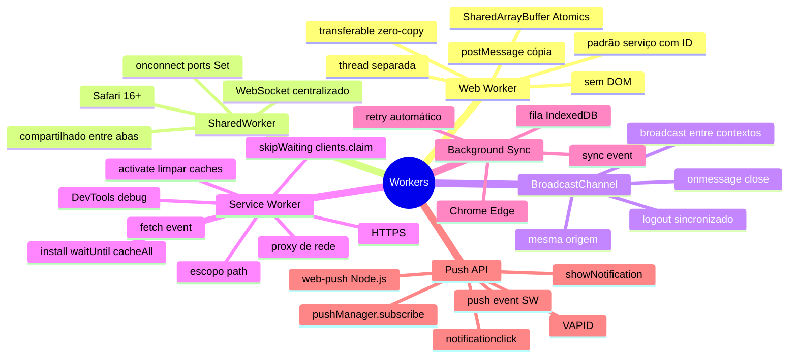

# Workers em entrevista

> [!abstract] TL;DR
> Capstone do galho Workers. As questões mais frequentes giram em torno de três eixos: por que e quando usar Web Workers (não bloquear o main thread), o ciclo de vida do Service Worker (install/activate/fetch + skipWaiting/clients.claim), e a diferença entre os tipos de workers. O sinal de senioridade é saber quando cada um é a ferramenta certa — e quando não usar nenhum.

---

## Mapa do galho Workers



---

## Top 10 — perguntas de entrevista

### 1. Por que Web Workers existem se JavaScript é single-threaded?

JavaScript em si é single-threaded dentro de um contexto (tab/worker), mas o **browser** pode ter múltiplas threads. Web Workers criam threads do sistema operacional que comunicam-se com o main thread via `postMessage`.

O main thread processa o DOM, eventos, e rAF — qualquer cálculo pesado bloqueia a UI. Workers resolvem isso desacoplando o processamento da renderização.

```
Main Thread: evento → calcular → renderizar → evento → ...
                              ↑
                         BlockUI se pesado

Com Worker:
Main Thread: evento → enviar para worker → renderizar → evento
Worker Thread:         ← receber → calcular → enviar resultado →
```

---

### 2. O que pode e o que não pode um Web Worker?

Pode: `fetch`, `setTimeout`, `IndexedDB`, `console`, `crypto`, `WebAssembly`, `importScripts()`, módulos ES.

Não pode: `document`, `window`, DOM APIs, `localStorage` (use IndexedDB), `alert`/`prompt`, acesso direto a elementos.

---

### 3. Qual a diferença entre `postMessage` com e sem transferência?

```javascript
const buffer = new ArrayBuffer(10 * 1024 * 1024); // 10MB

// Cópia (padrão): 10MB copiados — caro
worker.postMessage(buffer);
// buffer ainda acessível no remetente

// Transferência: zero-copy — buffer "movido"
worker.postMessage(buffer, [buffer]);
// buffer.byteLength === 0 — não mais acessível aqui!
```

Use transferência para: `ArrayBuffer`, `ImageBitmap`, `OffscreenCanvas`, `MessagePort`.

---

### 4. Qual a diferença entre Web Worker, SharedWorker e Service Worker?

| | Web Worker | SharedWorker | Service Worker |
|---|---|---|---|
| Escopo | Uma aba | Todas as abas da origem | Origem (proxy de rede) |
| Propósito | Processamento pesado | Estado/conexão compartilhada | Cache, offline, push |
| Acesso à rede | Via fetch | Via fetch | Intercepta fetch |
| Persiste entre recarregamentos | Não | Enquanto uma aba aberta | Sim |
| Notificações push | Não | Não | Sim |

---

### 5. Explique o ciclo de vida do Service Worker.

```
1. register('/sw.js') → browser baixa e parseia sw.js
2. install event → event.waitUntil(caches.addAll([...])) — pré-cachear assets
   - Se falhar: SW descartado
3. Waiting — novo SW aguarda abas antigas fecharem
   - skipWaiting() pula essa espera
4. activate event → event.waitUntil(limpar caches antigos)
   - clients.claim() assume abas abertas
5. fetch event → interceptar requests da origem
```

Um novo deploy incrementa a versão do CACHE_NAME. O install baixa os novos assets. O activate deleta o cache antigo. O SW novo substitui o antigo.

---

### 6. Por que `skipWaiting()` pode causar problemas?

Se você pushar um novo SW sem `skipWaiting()`, ele espera até todas as abas da versão antiga fecharem — garantindo consistência. Com `skipWaiting()`, o SW novo ativa imediatamente:

```
Aba 1: carregou app.v1.js via SW antigo
[novo SW ativa com skipWaiting()]
Aba 1: faz novo request → agora servido pelo SW novo → app.v2.js
```

A aba 1 agora tem `app.v1.js` (script) mas `app.v2.css` (CSS do novo cache) — pode ser inconsistente. Para minimizar: enviar mensagem ao cliente pedindo `location.reload()` após ativação.

---

### 7. Como você implementaria uma fila de envio offline?

Padrão de três partes:
1. **Antes de enviar**: salvar no IndexedDB + registrar Background Sync tag
2. **Service Worker `sync` event**: ler IndexedDB, enviar, deletar os enviados com sucesso
3. **Fallback**: se Background Sync não suportado, tentar enviar imediatamente

```javascript
// Salvar + agendar
await db.add('outbox', { url, body, timestamp });
await registration.sync.register('sync-outbox').catch(() => sendNow()); // fallback

// SW
self.addEventListener('sync', event => {
  if (event.tag === 'sync-outbox') event.waitUntil(processOutbox());
});
```

---

### 8. Como funciona a Push API?

1. Browser solicita permissão de notificação
2. `pushManager.subscribe()` com VAPID public key → retorna `PushSubscription`
3. App envia a subscription ao servidor (endpoint + keys)
4. Servidor usa `web-push` para enviar mensagem criptografada ao endpoint (FCM/APNs)
5. Browser recebe → acorda o Service Worker
6. SW recebe evento `push` → chama `self.registration.showNotification()`

VAPID (Voluntary Application Server Identification) autentica o servidor junto ao push service — evita que qualquer servidor envie pushes para a subscription.

---

### 9. O que `self.clients.claim()` faz?

Quando um SW é ativado, ele só controla abas que abrirem **depois** da ativação — abas já abertas continuam controladas pelo SW antigo (ou sem SW).

`clients.claim()` no evento `activate` faz o SW recém-ativado assumir imediatamente todas as abas abertas. Útil após `skipWaiting()` para garantir que a aba receba requests interceptados pelo novo SW.

---

### 10. Como você depura problemas de Service Worker?

```
DevTools → Application → Service Workers
  - Status: instalando / esperando / ativo / redundante
  - "Update on reload": força atualização em cada reload
  - "Bypass for network": ignora o SW temporariamente
  - "Skip waiting": ativa o SW em espera

Application → Cache Storage
  - Ver todos os caches e seus conteúdos
  - Limpar caches manualmente

Application → Manifest
  - Verificar configuração da PWA
```

Para logs do SW, abrir `console` com o SW selecionado como contexto no dropdown do DevTools.

---

## Armadilhas clássicas

| Armadilha | Problema | Solução |
|---|---|---|
| SW sem `event.waitUntil()` | Evento encerra antes da Promise completar | Sempre usar `event.waitUntil()` |
| `caches.addAll()` com URL que falha | Install falha completamente | Separar assets críticos de opcionais |
| Nunca atualizar CACHE_NAME | Cache desatualizado para sempre | Incluir versão no nome do cache |
| `skipWaiting()` sem reload do cliente | Assets misturados de versões diferentes | Notificar cliente para recarregar |
| Não limpar caches antigos no activate | Caches crescem indefinidamente | Filtrar e deletar caches não-atuais |
| Push sem `userVisibleOnly: true` | Chrome rejeita a subscription | Sempre passar `true` |
| Worker sem terminar | Thread vaza memória | `worker.terminate()` quando não precisar |
| SharedWorker sem limpar ports fechados | Set de ports cresce infinitamente | Remover ao detectar erros de mensagem |

---

## Veja também

- [[03-Dominios/Tecnologia/Plataforma Web/Workers/04 - Background Sync e Push|04 — Background Sync e Push]] — anterior
- [[03-Dominios/Tecnologia/Plataforma Web/Workers/index|Workers — índice]]
- [[03-Dominios/Tecnologia/Plataforma Web/Networking/index|G7 — Networking]] — próximo galho
