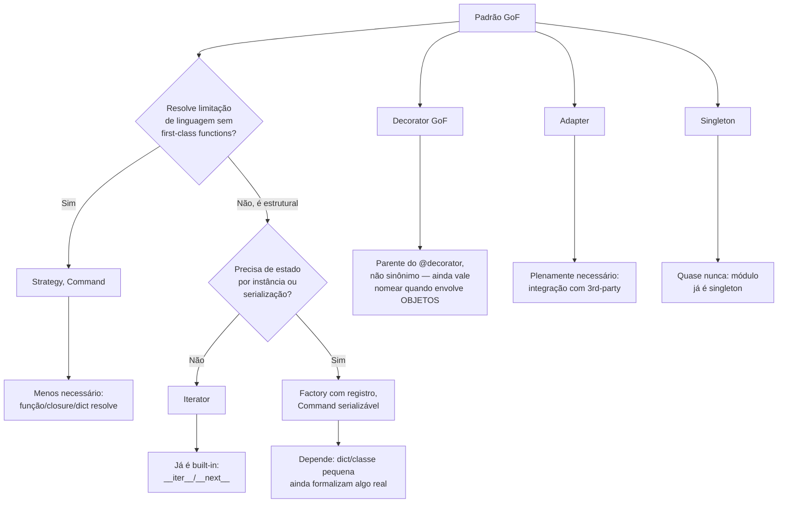

# Por que GoF clássico é menos necessário em Python

> [!abstract] TL;DR
> Boa parte do catálogo de 23 padrões do GoF (*Design Patterns: Elements of Reusable Object-Oriented Software*, Gamma, Helm, Johnson, Vlissides — 1994) existe para contornar uma limitação específica de linguagens como Java e C++: funções não são cidadãos de primeira classe, e o polimorfismo exige uma interface nomeada e declarada. Python não tem essa limitação — funções são objetos comuns (podem ser passadas, guardadas, devolvidas), e duck typing dispensa a interface formal para o polimorfismo funcionar. O resultado é que **Strategy**, **Command** e boa parte de **Factory** viram uma função, um dicionário ou uma closure de poucas linhas em Python, em vez de uma interface com N classes concretas. **Iterator** já é protocolo nativo da linguagem (`__iter__`/`__next__`, coberto no Galho 4 desta trilha). O **Decorator** GoF é conceitualmente parente do `@decorator` sintático de Python, mas não é a mesma coisa — a nota separa os dois com precisão. Fecha explicando por que alguns padrões (**Adapter**, com ressalva sobre **Singleton**) continuam plenamente relevantes mesmo em Python idiomático. O catálogo completo, agnóstico de linguagem, fica em [[03-Dominios/Engenharia/Design de Software/Design Patterns|Design Patterns (GoF)]] — esta nota não o reensina, discute o contraste.

## Um PaymentStrategyFactory que não precisava existir

Um desenvolvedor sênior, dez anos de Java, entra num time Python pela primeira vez. A tarefa: o checkout de um e-commerce precisa aplicar descontos diferentes dependendo do tipo de cliente — cliente novo não tem desconto, cliente fiel tem 10%, período de Black Friday tem 30%. Amanhã pode entrar um quarto tipo. Ele já sabe exatamente como resolver isso — é o mesmo problema que resolveu dúzias de vezes em Spring, e a solução tem nome: **Strategy**.

Ele escreve, em Python, o que escreveria em Java:

```python
from abc import ABC, abstractmethod

class DiscountStrategy(ABC):
    @abstractmethod
    def apply(self, amount: float) -> float:
        ...

class NoDiscountStrategy(DiscountStrategy):
    def apply(self, amount: float) -> float:
        return amount

class LoyalCustomerStrategy(DiscountStrategy):
    def apply(self, amount: float) -> float:
        return amount * 0.90

class BlackFridayStrategy(DiscountStrategy):
    def apply(self, amount: float) -> float:
        return amount * 0.70

class DiscountStrategyFactory:
    _strategies = {
        "none": NoDiscountStrategy,
        "loyal": LoyalCustomerStrategy,
        "black_friday": BlackFridayStrategy,
    }

    @classmethod
    def create(cls, kind: str) -> DiscountStrategy:
        strategy_cls = cls._strategies.get(kind)
        if strategy_cls is None:
            raise ValueError(f"estratégia desconhecida: {kind}")
        return strategy_cls()


def checkout(amount: float, kind: str) -> float:
    strategy = DiscountStrategyFactory.create(kind)
    return strategy.apply(amount)
```

Cinquenta e poucas linhas: uma interface abstrata, três implementações concretas, uma factory pra selecionar qual instanciar. Funciona, passa no code review — nenhum revisor vai marcar isso como "errado". Mas uma colega do time, que só programou em Python, olha o diff e pergunta: "por que não é só isso?"

```python
DISCOUNTS = {
    "none": lambda amount: amount,
    "loyal": lambda amount: amount * 0.90,
    "black_friday": lambda amount: amount * 0.70,
}

def checkout(amount: float, kind: str) -> float:
    return DISCOUNTS[kind](amount)
```

Sete linhas. Mesmo comportamento, mesma extensibilidade (adicionar um quarto desconto é adicionar uma entrada no dicionário), zero classes. Adicionar uma estratégia nova não pede herança, não pede `@abstractmethod`, não pede reabrir a factory — é uma nova chave no dicionário. E se a lógica de uma das estratégias crescer além de uma expressão, ela vira uma função nomeada normal (`def desconto_loyal(amount): ...`) — ainda sem classe nenhuma, porque `DISCOUNTS["loyal"]` aceita qualquer `Callable[[float], float]`, seja lambda, função ou método.

> [!question]- Isso não é só "código mais curto" — tem alguma coisa estrutural por trás, ou é só estilo?
> É estrutural, não estilo. A versão Java-like existe porque, em Java, uma função sozinha **não é um valor que se possa passar por aí** (antes de `java.util.function.Function<T,R>` e lambdas, no Java 8) — pra ter algo "intercambiável e passável" você precisa de um **objeto**, e pra ter um objeto com forma previsível você precisa de uma **interface**. O padrão Strategy nasce exatamente dessa restrição: ele transforma um algoritmo (que deveria ser só uma função) num objeto, porque a linguagem não deixa passar a função crua. Em Python, funções sempre foram objetos comuns — do mesmo tipo `int`, `str` ou uma lista: podem ser atribuídas a uma variável, guardadas num dicionário, passadas como argumento, devolvidas de outra função (essa propriedade é o que a trilha chamou de "funções de primeira classe" no Galho 4, nota 04, sobre closures). Quando a linguagem já resolve "algoritmo intercambiável = valor que eu passo por aí" sem precisar de objeto, o padrão que existe pra simular isso com objetos perde a razão de ser.

O restante desta nota percorre esse mesmo raciocínio — "o que o GoF resolve com classe+interface, Python resolve nativamente com função/closure/duck typing" — pattern por pattern, com o código das duas linguagens lado a lado. Não é um tutorial de cada padrão: para a mecânica completa e as categorias clássicas (criacionais/estruturais/comportamentais), veja [[03-Dominios/Engenharia/Design de Software/Design Patterns|Design Patterns (GoF)]]. Aqui o assunto é *por que* menos deles sobrevivem como "padrão nomeado, com essa cara" em código Python idiomático.

## Strategy: de interface + N classes para função ou dicionário

O exemplo acima já é o caso canônico, mas vale generalizar o raciocínio. Em Java, a receita do Strategy é sempre a mesma:

```java
public interface DiscountStrategy {
    Money apply(Money amount, Customer customer);
}

public class LoyalCustomerStrategy implements DiscountStrategy {
    public Money apply(Money amount, Customer c) { /* 10% off */ }
}

@Service
public class CheckoutService {
    public Money finalPrice(Money base, Customer c, DiscountStrategy strategy) {
        return strategy.apply(base, c);
    }
}
```

`CheckoutService.finalPrice` recebe um `DiscountStrategy` — ou seja, recebe **um objeto que sabe executar `.apply(...)`**. Em Python, o parâmetro equivalente é simplesmente `Callable[[float, Customer], float]`:

```python
from typing import Callable

def final_price(base: float, customer: Customer, strategy: Callable[[float, Customer], float]) -> float:
    return strategy(base, customer)

def loyal_customer_discount(amount: float, customer: Customer) -> float:
    return amount * 0.90

final_price(100.0, customer, loyal_customer_discount)
final_price(100.0, customer, lambda amount, c: amount * 0.70)  # ad hoc, sem nem nomear
```

Não existe `DiscountStrategy` como tipo declarado — o "contrato" é a assinatura da função, verificável estruturalmente (e, com type hints, checável estaticamente por `mypy`/`pyright` via `Protocol` ou `Callable`, sem precisar de uma classe base real). Isso é Strategy **sem cerimônia**: o padrão continua presente conceitualmente (existe uma família de algoritmos intercambiáveis selecionados em runtime), só que a "interface" é a assinatura da função, não uma declaração `class ... (ABC)`.

> [!tip] Quando o Strategy Python ainda vale uma classe
> Se cada "estratégia" precisar carregar estado próprio (por exemplo, uma taxa de desconto configurável por instância, ou dependências injetadas, como um client HTTP), uma classe pequena com `__call__` definido é o meio-termo idiomático — continua sendo um "objeto que se comporta como função" (ver Galho 4, closures), sem herança nem `ABC`:
> ```python
> class PercentualDiscount:
>     def __init__(self, percent: float):
>         self.percent = percent
>     def __call__(self, amount: float, customer: Customer) -> float:
>         return amount * (1 - self.percent)
>
> final_price(100.0, customer, PercentualDiscount(0.15))
> ```

## Command: de objeto formal a função ou closure

Command encapsula uma requisição como objeto, pra poder enfileirar, logar, desfazer. Em Java:

```java
public interface Command {
    void execute();
    void undo();
}

public class MoveCommand implements Command {
    private final Entity entity;
    private final Point from, to;

    public void execute() { entity.moveTo(to); }
    public void undo()    { entity.moveTo(from); }
}

Queue<Command> fila = new LinkedList<>();
fila.add(new MoveCommand(entidade, origem, destino));
```

A motivação de existir uma classe aqui, de novo, é a mesma do Strategy: em Java pré-lambdas, "uma operação que eu guardo numa fila e executo depois" só podia ser um objeto. Em Python, a versão mais direta é uma função (ou uma `functools.partial`, que fixa argumentos de uma função sem executar) guardada numa lista:

```python
from functools import partial
from collections import deque

def mover(entidade, origem, destino):
    entidade.mover_para(destino)

fila = deque()
fila.append(partial(mover, entidade, origem, destino))

# executando a fila
while fila:
    comando = fila.popleft()
    comando()
```

Nenhuma classe, nenhum `execute()` — a função já É o comando, e chamá-la já É executá-lo. Quando o Command precisa de **estado adicional além dos argumentos** (por exemplo, guardar o estado anterior pra suportar `undo`, não só reexecutar a operação), uma closure resolve sem precisar de interface:

```python
def criar_comando_mover(entidade, destino):
    origem = entidade.posicao  # capturada no momento da criação do comando

    def execute():
        entidade.mover_para(destino)

    def undo():
        entidade.mover_para(origem)

    return execute, undo

executar, desfazer = criar_comando_mover(entidade, destino)
fila.append(executar)
# ...
desfazer()  # usa `origem`, capturada por closure — sem atributo de instância pra isso
```

`execute` e `undo` são duas funções fechando sobre as mesmas variáveis (`entidade`, `origem`, `destino`) — o mesmo dado que, em Java, precisaria virar campo de uma classe (`private final Entity entity`), aqui é só variável capturada pelo escopo léxico (mecânica coberta em detalhe no Galho 4, nota 04, "Closures de verdade"). Se o time preferir agrupar `execute`/`undo` num único objeto nomeado, uma `@dataclass` com dois métodos também resolve — a escolha entre closure e classe pequena aqui é estilística, não estrutural; o que **não** é necessário é a interface `Command` abstrata separada da implementação.

> [!warning] Onde o Command formal (com classe) ainda ganha em Python
> Se o comando precisar ser **serializado** — indo pra uma fila externa como Celery, RQ ou uma tabela outbox, sendo desserializado por outro processo — uma closure não serializa (não dá pra fazer `pickle` de uma função que fecha sobre variáveis locais de forma confiável entre processos). Nesse caso, um objeto explícito (uma `dataclass` com os dados do comando, sem lógica embutida — o processo consumidor decide o que fazer com aquele dado) volta a ser a escolha certa. Isso é o mesmo raciocínio por trás de Command em CQRS: o "Command" ali normalmente é um DTO simples, não um objeto com `execute()`.

## Iterator: já é built-in, não precisa implementar a interface

Em Java, consumir uma coleção item a item exige implementar (ou, mais comum, consumir) a interface `Iterator<T>`:

```java
public interface Iterator<T> {
    boolean hasNext();
    T next();
}
```

Uma classe que quer ser percorrida em `for` precisa implementar `Iterable<T>`, que devolve um `Iterator<T>` — duas interfaces formais, dois métodos por implementação (`hasNext`/`next`).

Python já resolveu isso na linguagem: qualquer objeto com `__iter__` e `__next__` é, por definição, um iterador — e o `for` embutido chama esse protocolo automaticamente, sem interface nomeada, sem `implements`. A trilha já cobriu a mecânica completa disso no Galho 4 — [[03-Dominios/Tecnologia/Python/Funcional e idiomas avançados/01 - Iterators e o protocolo __iter__ __next__|Iterators e o protocolo `__iter__`/`__next__`]] — e a forma ainda mais idiomática de produzir um iterador, generators com `yield`, na [[03-Dominios/Tecnologia/Python/Funcional e idiomas avançados/02 - Generators — yield e generator functions|nota de generators]]. Esta nota não repete essa mecânica — o ponto aqui é só nomear o motivo estrutural: o padrão GoF Iterator descreve exatamente o protocolo que Python já embute como parte da linguagem (o mesmo protocolo que faz listas, dicionários, arquivos e strings serem todos percorríveis em `for` de forma uniforme). Você quase nunca "implementa o padrão Iterator" conscientemente em Python — você escreve um generator, e o protocolo acontece por baixo.

## Decorator GoF × `@decorator` sintático: parentes, não sinônimos

Este é o ponto onde mais gente se confunde, porque os dois compartilham não só um nome parecido, mas uma ideia de fundo real: **adicionar comportamento a algo, sem alterar seu código-fonte, envolvendo-o**.

O padrão **Decorator do GoF** é um padrão estrutural orientado a objetos: uma classe que implementa a **mesma interface** do objeto que está decorando, guarda uma referência a esse objeto por composição, e delega chamadas a ele adicionando comportamento antes/depois. O exemplo clássico é I/O em Java:

```java
InputStream in = new BufferedInputStream(
    new GZIPInputStream(
        new FileInputStream("data.gz")
    )
);
```

Cada camada (`FileInputStream`, `GZIPInputStream`, `BufferedInputStream`) implementa `InputStream` e envolve a camada anterior — múltiplos decorators empilháveis, cada um adicionando uma responsabilidade, todos substituíveis pelo objeto original em qualquer lugar que espere um `InputStream` (é o Princípio de Substituição de Liskov em ação — coberto em [[03-Dominios/Engenharia/Design de Software/SOLID/index|SOLID]]).

O `@decorator` sintático de Python é outra coisa: é açúcar sintático para `funcao = decorador(funcao)`, aplicado a uma **função** (ou classe), não a instâncias de uma interface comum em runtime. A trilha cobriu a mecânica completa dele no Galho 4 — [[03-Dominios/Tecnologia/Python/Funcional e idiomas avançados/05 - Decorators — fundamentos|Decorators — fundamentos]] e [[03-Dominios/Tecnologia/Python/Funcional e idiomas avançados/06 - Decorators com argumentos e functools.wraps|Decorators com argumentos]] — esta nota não repete `functools.wraps` nem `*args`/`**kwargs`, só situa o padrão.

```python
def com_log(func):
    def wrapper(*args, **kwargs):
        print(f"chamando {func.__name__}")
        return func(*args, **kwargs)
    return wrapper

@com_log
def processar_pedido(pedido_id):
    ...
```

Onde eles se encontram: a **ideia** — envolver algo existente para adicionar comportamento sem alterar seu código — é a mesma, e é por isso que é comum ver `@decorator` sendo citado como "a versão Python do padrão Decorator". Onde eles divergem:

| | Decorator GoF | `@decorator` Python |
|---|---|---|
| Opera sobre | instâncias de objetos, em runtime | funções/classes, em tempo de definição |
| Mecanismo | composição + mesma interface | reatribuição de nome (`f = decorador(f)`) |
| Empilhamento | vários objetos decorando o mesmo objeto original | vários decorators sobre a mesma função (`@a`\ `@b`\ `def f...`) |
| Exige interface comum? | sim — decorator e decorado implementam o mesmo contrato | não — o decorator só precisa aceitar o que a função aceita e devolver algo chamável |
| Onde aparece | Java I/O streams, Spring AOP via proxy | logging, timing, cache, `@staticmethod`, `@property`, rotas Flask/FastAPI |

> [!warning] O erro mais comum
> Dizer que "`@decorator` é o padrão Decorator implementado em Python" simplifica demais e engana quem depois for ler o GoF esperando encontrar essa sintaxe. O `@decorator` de Python é mais próximo, na prática, de um **higher-order function** genérico aplicado com açúcar sintático — ele *pode* implementar a intenção do padrão Decorator (envolver, adicionar comportamento, preservar a interface externa) mas também é usado pra coisas que o GoF nem categoriza como Decorator, como registro (`@app.route(...)` registrando uma função num dicionário de rotas) ou transformação de assinatura (`@staticmethod`, `@property`). O padrão certo pra citar quando o `@decorator` envolve uma função preservando sua assinatura e delegando a ela é "Decorator", sim — mas vale a ressalva na hora de comparar com Java.

O caso em que o Decorator GoF "de verdade" — objeto envolvendo objeto, mesma interface, empilhável — continua aparecendo em Python é justamente quando o que se quer decorar não é uma função isolada, mas um **objeto com múltiplos métodos**, e a decoração precisa valer pra todos eles de forma composicional, preservando o objeto original substituível em qualquer lugar que espere aquela interface:

```python
class Notificador(Protocol):
    def enviar(self, destinatario: str, mensagem: str) -> None: ...

class NotificadorBase:
    def enviar(self, destinatario: str, mensagem: str) -> None:
        print(f"enviando para {destinatario}: {mensagem}")

class ComRetry:
    """Decorator GoF: mesma interface, composição, delega ao objeto envolvido."""
    def __init__(self, notificador: Notificador, tentativas: int = 3):
        self._notificador = notificador
        self._tentativas = tentativas

    def enviar(self, destinatario: str, mensagem: str) -> None:
        for tentativa in range(self._tentativas):
            try:
                return self._notificador.enviar(destinatario, mensagem)
            except ConnectionError:
                if tentativa == self._tentativas - 1:
                    raise

class ComAuditoria:
    """Outra camada, empilhável sobre a anterior — mesma interface de novo."""
    def __init__(self, notificador: Notificador):
        self._notificador = notificador

    def enviar(self, destinatario: str, mensagem: str) -> None:
        self._notificador.enviar(destinatario, mensagem)
        registrar_auditoria(destinatario, mensagem)

notificador = ComAuditoria(ComRetry(NotificadorBase()))
notificador.enviar("cliente@example.com", "Pedido confirmado")
```

Isso É o padrão Decorator do GoF, em Python, sem tradução nenhuma — `ComRetry` e `ComAuditoria` implementam a mesma "interface" estrutural que `NotificadorBase` (o método `enviar`), envolvem um `Notificador` por composição, e são empilháveis em qualquer ordem. A diferença pro `@decorator` sintático fica clara lado a lado: aqui a decoração acontece **em runtime**, sobre uma **instância específica** (`NotificadorBase()`), permitindo, por exemplo, ter um notificador decorado e outro sem decoração coexistindo no mesmo processo — algo que `@decorator` sintático, aplicado no momento da `def`, não faz (ele decora a função para *todo* o programa, não uma chamada específica).

## Factory: duck typing e classes de primeira classe tornam a formalidade opcional

Em Java, Factory Method existe pra que a decisão de "qual classe concreta instanciar" fique num só lugar, escondida atrás de uma interface:

```java
public interface NotificationFactory {
    Notification create(NotificationType type);
}

public class DefaultNotificationFactory implements NotificationFactory {
    public Notification create(NotificationType type) {
        return switch (type) {
            case EMAIL -> new EmailNotification();
            case SMS   -> new SmsNotification();
        };
    }
}
```

Duas razões fazem isso pesar menos em Python. A primeira é **duck typing**: o código cliente que recebe o objeto criado não precisa que ele implemente formalmente uma interface `Notification` — ele só precisa ter os métodos que vão ser chamados (`.enviar()`, digamos). Não existe verificação de tipo em tempo de compilação forçando a existência de uma interface declarada — "se anda como pato e grasna como pato, é um pato" o suficiente pro código funcionar. A segunda é mais estrutural ainda: em Python, **classes são objetos de primeira classe**, do mesmo jeito que funções são — uma classe pode ser guardada numa variável, passada como argumento, guardada num dicionário, exatamente como no exemplo do Strategy lá em cima:

```python
class EmailNotification:
    def enviar(self, destinatario, mensagem): ...

class SmsNotification:
    def enviar(self, destinatario, mensagem): ...

NOTIFICATION_TYPES = {
    "email": EmailNotification,
    "sms": SmsNotification,
}

def criar_notificacao(tipo: str):
    return NOTIFICATION_TYPES[tipo]()  # instancia a classe guardada no dicionário

notificacao = criar_notificacao("email")
notificacao.enviar("a@b.com", "Olá")
```

`NOTIFICATION_TYPES["email"]` **é a própria classe** `EmailNotification`, não uma string nem um enum que precisa ser mapeado numa cadeia de `if`/`switch` como no Java — o dicionário guarda o construtor diretamente, e `NOTIFICATION_TYPES[tipo]()` chama esse construtor. Não existe `NotificationFactory` como interface separada: a "factory" é o próprio dicionário, mais uma função de uma linha (`__getitem__` seguido de chamada) — o padrão continua presente na intenção (desacoplar "que tipo criar" de "onde é usado"), só que sem a cerimônia de uma classe dedicada a isso.

> [!question]- Isso não é mais frágil? Em Java o compilador garante que toda `NotificationType` do enum tem um `case` correspondente.
> É uma troca real, não uma vitória sem custo. O `switch` exaustivo do Java (principalmente com `sealed` types e pattern matching moderno) dá uma garantia em tempo de compilação que o dicionário Python não dá — se esquecer de adicionar `"push"` no dicionário, o erro só aparece em runtime, num `KeyError`, quando alguém tentar `criar_notificacao("push")`. Em times grandes, com dezenas de tipos e mudanças frequentes, essa checagem estática tem valor real — é uma razão legítima (não só "costume de Java") pra ainda considerar uma abordagem mais formal (por exemplo, `Enum` + `match`/`case` exaustivo, ou uma suíte de testes que valida que todo enum tem entrada correspondente) em código Python que troca robustez em runtime por flexibilidade de dicionário.

### O duck typing por trás da decisão

Vale tornar explícito o motivo pelo qual `criar_notificacao` acima nem precisa se preocupar com o "contrato" que `EmailNotification` e `SmsNotification` implementam. Em Java, o compilador exige que `EmailNotification implements Notification` — sem essa declaração explícita, o `switch` do factory method nem compila, porque o tipo de retorno declarado (`Notification`) precisa ser satisfeito estaticamente. Em Python, nada impede escrever:

```python
class WebhookNotification:
    def enviar(self, destinatario, mensagem):
        requests.post(destinatario, json={"mensagem": mensagem})

NOTIFICATION_TYPES["webhook"] = WebhookNotification
```

`WebhookNotification` nunca declarou herdar de nada parecido com `Notification` — ela só precisa ter um método `enviar(destinatario, mensagem)` com a assinatura certa, porque é só isso que o código chamador (`notificacao.enviar(...)`) de fato usa. Esse é o duck typing citado na abertura: o polimorfismo em Python é garantido pela **forma do objeto na hora do uso**, não por uma hierarquia de tipos declarada com antecedência. Isso é o mesmo motivo por trás do Strategy sem interface: em ambos os casos, o "contrato" formal do GoF (uma interface Java) vira um contrato implícito e estrutural em Python — o que os testes cobrem via `Protocol` (typing estrutural, checado estaticamente por `mypy` sem herança nenhuma) ou simplesmente por consenso do time.

> [!tip] `Protocol`, quando a checagem estática importa
> Quem quer manter a segurança de tipos do Java sem abrir mão do duck typing tem `typing.Protocol` (PEP 544): declara-se a forma esperada (`class Notificavel(Protocol): def enviar(self, destinatario: str, mensagem: str) -> None: ...`), e qualquer classe que tenha esse método "conta" como implementando o protocolo — sem precisar herdar dele explicitamente. É o meio-termo entre "sem checagem nenhuma" e "herança formal obrigatória como em Java": o checador de tipo garante o contrato, mas o código em runtime continua duck typed.

## Testabilidade: outra razão pra menos formalismo

Um efeito colateral pouco discutido é o impacto em teste. Em Java, testar `CheckoutService` isoladamente de uma `DiscountStrategy` real geralmente significa criar um mock via Mockito implementando a interface `DiscountStrategy` — o framework de mock precisa de um tipo declarado pra gerar o proxy dinâmico. Em Python, testar a versão com dicionário de funções não exige mock nenhum na maior parte dos casos: basta passar uma função de teste como argumento.

```python
def test_final_price_aplica_estrategia():
    def desconto_fixo(amount, customer):
        return amount - 5

    resultado = final_price(100.0, customer=None, strategy=desconto_fixo)
    assert resultado == 95.0
```

Nenhuma classe de teste, nenhum framework de mock, nenhuma dependência de um `DiscountStrategy` abstrato — porque nunca existiu um `DiscountStrategy` abstrato pra começo de conversa. Isso não é uma vantagem absoluta (a trilha já discutiu, no Galho 12, que testes que usam `unittest.mock.patch` em vez de injeção explícita de dependência trocam um problema por outro), mas reforça o padrão: cada lugar em que o GoF formaliza "um objeto que representa um comportamento substituível" é um lugar em que Python, tendo funções de primeira classe, também simplifica o teste — a "estratégia falsa" do teste é só outra função, do mesmo jeito que a estratégia real.

## Onde o GoF continua plenamente relevante em Python

Nem tudo perde força. **Adapter** é, se qualquer coisa, ainda **mais** usado em Python do que a média, porque a linguagem convive com um ecossistema enorme de bibliotecas de terceiros com interfaces inconsistentes entre si — envolver o client de uma API externa (Stripe, uma biblioteca de e-mail, um SDK de nuvem) atrás de uma interface própria da aplicação, pra não vazar o vocabulário daquela biblioteca pro resto do código, é exatamente o mesmo raciocínio do GoF, e Python não tem nada que substitua essa necessidade — é o padrão-base de arquitetura hexagonal/Ports and Adapters, que este galho retoma na nota 07.

```python
# A aplicação define o que ela espera:
class GatewayDePagamento(Protocol):
    def cobrar(self, valor_centavos: int, cliente_id: str) -> "ResultadoPagamento": ...

# A biblioteca de terceiros tem seu próprio vocabulário, fora do nosso controle:
class StripeClient:
    def create_charge(self, amount_cents, currency, customer): ...

# O Adapter isola esse vocabulário — o resto da aplicação nunca vê "Stripe":
class StripeAdapter:
    def __init__(self, stripe_client: StripeClient):
        self._stripe = stripe_client

    def cobrar(self, valor_centavos: int, cliente_id: str) -> "ResultadoPagamento":
        charge = self._stripe.create_charge(valor_centavos, "BRL", cliente_id)
        return ResultadoPagamento.de_stripe(charge)
```

Note que nem o Adapter em Python precisa de uma classe base `GatewayDePagamento` real — `Protocol` de novo resolve isso estruturalmente — mas o **papel** do Adapter (isolar vocabulário externo) não desaparece: nenhuma feature de linguagem substitui a necessidade de ter uma fronteira explícita entre "como o Stripe fala" e "como a nossa aplicação fala". É por isso que Adapter — ao contrário de Strategy, Command e Factory — não fica menos comum em Python: ele nunca dependeu da ausência de first-class functions pra existir, ele resolve um problema de **integração**, não de **polimorfismo**.

**Singleton**, por outro lado, quase nunca precisa ser implementado à mão em Python pela mesma razão que raramente precisa em Spring — mas por um motivo diferente: um **módulo Python já é um singleton**, por natureza do mecanismo de import. `sys.modules` cacheia cada módulo na primeira importação; toda importação subsequente (`import config`, em qualquer arquivo do projeto) devolve o **mesmo objeto módulo**, com o mesmo estado. Um `config.py` com variáveis e funções no nível do módulo já se comporta como um singleton — sem `__new__` sobrescrito, sem `getInstance()`, sem trava de thread manual:

```python
# config.py
import os

DATABASE_URL = os.environ["DATABASE_URL"]
_connection_pool = None

def get_pool():
    global _connection_pool
    if _connection_pool is None:
        _connection_pool = criar_pool(DATABASE_URL)
    return _connection_pool
```

```python
# em qualquer outro arquivo do projeto:
from config import get_pool

pool = get_pool()  # sempre o mesmo objeto, porque `config` só é importado (e executado) uma vez
```

Precisar de uma classe Singleton formal em Python geralmente é sinal de estar recriando, com mais código, o que o sistema de módulos já dá de graça. A ressalva importante — a mesma que o catálogo GoF genérico já registra para qualquer linguagem — é que Singleton mutável é estado global compartilhado, independente de vir de uma classe ou de um módulo: dificulta testes (o `_connection_pool` acima "vaza" entre testes que não o resetam) e cria acoplamento invisível (qualquer arquivo que faz `from config import get_pool` depende dele sem declarar isso em nenhum construtor). Trocar `class Config` por `config.py` resolve a cerimônia, não resolve o problema de design de fundo — é por isso que o Galho 13 dedica notas inteiras a Injeção de Dependência (nota 05) como alternativa mais rigorosa a ambos.

## Síntese: quando ainda vale nomear o padrão em Python



| Padrão | Ainda vale nomear/formalizar em Python? | Por quê |
|---|---|---|
| Strategy | Depende | Função/dict resolve o caso simples; classe com `__call__` só se houver estado por instância |
| Command | Depende | Closure/`partial` resolve o caso em memória; objeto formal (DTO) necessário se precisar serializar (fila externa, outbox) |
| Iterator | Não | Já é protocolo nativo (`__iter__`/`__next__`) — você consome, raramente implementa |
| Decorator (GoF) | Sim, com ressalva | Continua útil quando envolve **objetos** preservando interface (ex: múltiplos wrappers compondo um client); não confundir com `@decorator` sintático, que é mecanismo diferente |
| Factory | Depende | Dict de construtores resolve o caso comum; formalizar (`Enum` + `match` exaustivo) se a robustez em tempo de checagem importar mais que a flexibilidade |
| Adapter | Sim, sempre | Nenhuma feature de linguagem substitui a necessidade de isolar o vocabulário de uma API de terceiros |
| Singleton | Quase nunca | Módulo Python já é singleton via `sys.modules` |

> [!tip] Regra prática pra decidir
> Antes de reproduzir em Python a estrutura de classes+interface que você escreveria em Java, pergunte: "o que esse padrão está tentando dar à linguagem que ela já não tem?" Se a resposta for "um jeito de passar um algoritmo/operação como valor" — Python já tem (funções de primeira classe), então a função/closure/dicionário provavelmente basta. Se a resposta for "um jeito de percorrer uma coleção sem expor a estrutura interna" — Python já tem (protocolo iterador), não implemente a interface à mão. Se a resposta for "isolar meu código do vocabulário de uma biblioteca externa" ou "compor comportamento sobre objetos preservando uma interface comum" — isso não é resolvido por nenhuma feature de sintaxe, e o padrão formal continua ganhando.

O restante deste galho assume esse pano de fundo: os padrões que sobram como formalização deliberada em Python — Repository, Unit of Work, Service Layer, Ports and Adapters — não são GoF clássico, são padrões de **arquitetura** (a fronteira entre domínio e infraestrutura), que nenhuma feature de linguagem substitui. É por isso que o restante do galho segue *Architecture Patterns with Python* em vez de continuar no catálogo GoF.

## Fontes

- Gamma, E.; Helm, R.; Johnson, R.; Vlissides, J. — *Design Patterns: Elements of Reusable Object-Oriented Software* (Addison-Wesley, 1994) — catálogo original dos 23 padrões citados nesta nota
- [PEP 318 — Decorators for Functions and Methods](https://peps.python.org/pep-0318/), Python Software Foundation — motivação histórica da sintaxe `@decorator`, consultada em 2026-07
- [Python Glossary — decorator](https://docs.python.org/3/glossary.html#term-decorator), docs.python.org — definição oficial do `@decorator` como açúcar sintático, consultada em 2026-07
- [The Import System — module caching](https://docs.python.org/3/reference/import.html#the-module-cache), docs.python.org — `sys.modules` e por que um módulo é, por construção, um singleton, consultada em 2026-07
- [Real Python — Python Design Patterns](https://realpython.com/tutorials/design-patterns/), Real Python — coleção de artigos sobre padrões idiomáticos em Python, consultada em 2026-07
- [Refactoring Guru — Design Patterns](https://refactoring.guru/design-patterns) — catálogo visual comparativo, referenciado também em [[03-Dominios/Engenharia/Design de Software/Design Patterns|Design Patterns (GoF)]]

## Veja também

- [[03-Dominios/Engenharia/Design de Software/Design Patterns|Design Patterns (GoF)]] — catálogo completo, agnóstico de linguagem, com implementações Java-oriented dos 23 padrões
- [[03-Dominios/Tecnologia/Python/Funcional e idiomas avançados/01 - Iterators e o protocolo __iter__ __next__|Iterators e o protocolo `__iter__`/`__next__`]] — mecânica do protocolo que substitui o GoF Iterator
- [[03-Dominios/Tecnologia/Python/Funcional e idiomas avançados/02 - Generators — yield e generator functions|Generators — yield e generator functions]] — forma idiomática de produzir iteradores
- [[03-Dominios/Tecnologia/Python/Funcional e idiomas avançados/04 - Closures de verdade|Closures de verdade]] — mecânica de captura de variáveis usada nos exemplos de Command/Strategy desta nota
- [[03-Dominios/Tecnologia/Python/Funcional e idiomas avançados/05 - Decorators — fundamentos|Decorators — fundamentos]] — mecânica completa do `@decorator` sintático
- [[03-Dominios/Tecnologia/Python/Funcional e idiomas avançados/06 - Decorators com argumentos e functools.wraps|Decorators com argumentos e functools.wraps]]
- [[03-Dominios/Engenharia/Design de Software/SOLID/index|SOLID]] — Liskov Substitution, citado a propósito do Decorator GoF
- [[03-Dominios/Tecnologia/Python/Arquitetura e Design Patterns/index|Arquitetura e Design Patterns]] — MOC deste galho
