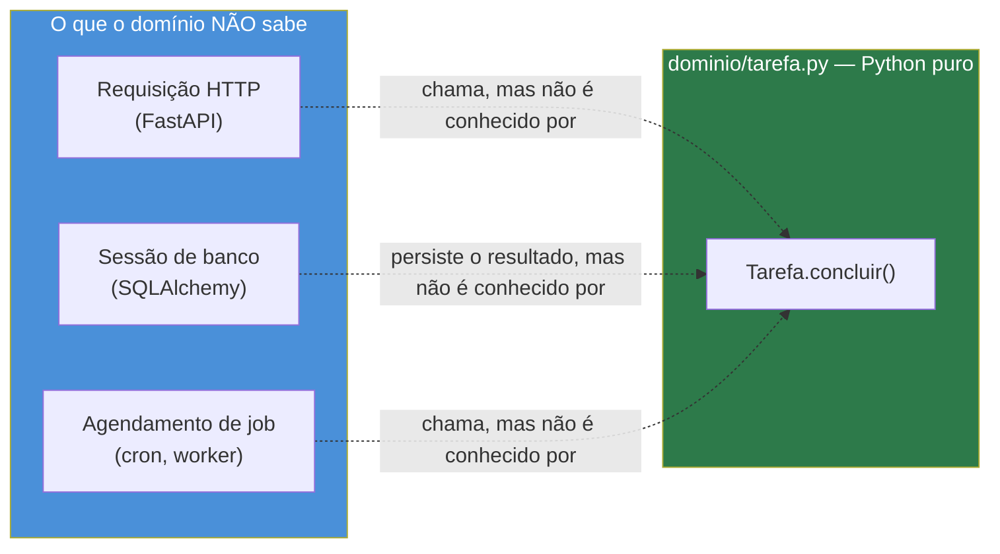
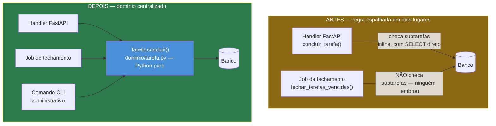

# Domain modeling — separando a lógica de negócio do framework

> [!abstract] TL;DR
> Uma regra de negócio ("uma tarefa não pode ser concluída se tiver subtarefas pendentes") implementada dentro de um handler FastAPI funciona perfeitamente — até um segundo caminho de escrita (um job em background, um comando de CLI administrativo) tocar o mesmo dado sem passar pelo handler, e a regra simplesmente não existir mais ali. O bug não é de lógica errada: é de lógica **existir em um lugar só**, acoplada ao framework que a chamou primeira vez. A correção é extrair a regra para uma classe Python pura — sem `import fastapi`, sem `import sqlalchemy` — que qualquer caminho de escrita (handler, job, CLI, teste) chama do mesmo jeito. Esta nota também formaliza a distinção entre **Entity** (identidade importa: duas tarefas com o mesmo título são tarefas diferentes) e **Value Object** (só o valor importa: dois períodos com o mesmo início e fim são o mesmo período), aplicando — sem repetir a mecânica — os dunder methods do [[03-Dominios/Tecnologia/Python/OO e Data Model/03 - O Data Model — dunder methods essenciais|Galho 3]] e a disciplina de teste unitário do [[03-Dominios/Tecnologia/Python/Testes/01 - pytest fundamentos — anatomia, discovery e assert introspection|Galho 12]]. Fonte primária: *Architecture Patterns with Python* (Percival & Gregory).

## O bug que abre esta nota: uma regra que só existia em um lugar

A API de Tarefas construída nas capstones dos Galhos 10 e 11 desta trilha ganhou, num sprint qualquer, um pedido de produto simples: tarefas podem ter subtarefas, e uma tarefa **não pode** ser marcada como concluída enquanto tiver alguma subtarefa pendente. Faz sentido — não tem como "terminar" uma tarefa cujas partes ainda estão abertas. O desenvolvedor que pega o ticket implementa exatamente onde a lógica de conclusão já morava: dentro do handler `concluir_tarefa`.

```python
"""routers/tarefas.py — a regra nasce aqui, dentro do handler."""

from fastapi import APIRouter, Depends, HTTPException
from sqlalchemy import select
from sqlalchemy.orm import Session

router = APIRouter(prefix="/tarefas", tags=["Tarefas"])


@router.patch("/{tarefa_id}/concluir")
def concluir_tarefa(tarefa_id: int, db: Session = Depends(get_db)):
    tarefa = db.get(Tarefa, tarefa_id)
    if tarefa is None:
        raise HTTPException(404, detail="Tarefa não encontrada")

    subtarefas_pendentes = db.scalars(
        select(Tarefa).where(Tarefa.tarefa_pai_id == tarefa_id, Tarefa.concluida.is_(False))
    ).all()
    if subtarefas_pendentes:
        raise HTTPException(409, detail="Tarefa tem subtarefas pendentes")

    tarefa.concluida = True
    db.commit()
    db.refresh(tarefa)
    return tarefa
```

Funciona. Passa em todo teste manual, passa em code review, sobe pra produção. Ninguém consegue mais concluir uma tarefa com subtarefa pendente pela API — o comportamento correto.

Três meses depois, o time adiciona um job de manutenção que roda a cada hora, fechando automaticamente tarefas cujo prazo já passou — uma regra de negócio diferente, mas que também termina em `tarefa.concluida = True`:

```python
"""worker/fechar_tarefas_vencidas.py — escrito sem olhar pra routers/tarefas.py."""

from datetime import datetime

from sqlalchemy import select
from sqlalchemy.orm import Session


def fechar_tarefas_vencidas(db: Session) -> None:
    tarefas_vencidas = db.scalars(
        select(Tarefa).where(Tarefa.prazo < datetime.utcnow(), Tarefa.concluida.is_(False))
    ).all()
    for tarefa in tarefas_vencidas:
        tarefa.concluida = True  # o mesmo UPDATE que o handler faz — sem a checagem que o handler tem
    db.commit()
```

Quem escreveu o job nunca leu `routers/tarefas.py`. Por que leria? São dois arquivos diferentes, dois motivos de negócio diferentes (concluir manualmente vs. fechar por prazo vencido), a mesma coluna `concluida` sendo tocada — mas nenhum vínculo de código entre os dois. O job sobe, roda de hora em hora, e algumas semanas depois um usuário reporta um bug estranho: uma tarefa aparece como "concluída" no dashboard, mas duas das suas subtarefas continuam abertas na lista. O relatório semanal de produtividade do time, que soma tarefas concluídas assumindo que "concluída implica todas as partes prontas", começa a contar tarefas que na verdade ainda têm trabalho pendente.

> [!bug] O que está quebrado, em uma frase
> A regra "não conclui com subtarefa pendente" nunca existiu como um fato sobre o **domínio** — existiu como um `if` dentro de uma função HTTP específica. Qualquer código que grave `concluida = True` sem passar por aquele handler ignora a regra, não porque alguém decidiu ignorá-la, mas porque a regra fisicamente não estava lá para ser ignorada.

O erro aqui não é do desenvolvedor do job — é estrutural. A regra de negócio estava hospedada dentro de uma função cujo propósito declarado é "traduzir uma requisição HTTP PATCH em uma resposta HTTP", não "saber o que significa concluir uma tarefa". O acoplamento é exatamente esse: **o único lugar que sabe a regra é o único lugar que sabe falar com FastAPI**. Um comando de CLI administrativo que precise concluir tarefas em lote (por exemplo, ao migrar dados de um sistema legado) enfrentaria o mesmo problema — teria que reimplementar a checagem de subtarefas do zero, ou (mais provável, sob pressão de prazo) simplesmente não implementar, e confiar que "ninguém vai usar o CLI de um jeito que viole a regra".

> [!question]- Por que não simplesmente copiar a checagem de subtarefas pendentes pro job também?
> Copiar resolve o incidente de hoje e garante o próximo. A regra concreta é: cada código que toca `Tarefa.concluida` diretamente precisa **se lembrar** de reimplementar a mesma checagem — e "se lembrar" não é uma propriedade do código, é uma propriedade da disciplina de quem escreve o próximo caminho de escrita, que pode não saber que a regra existe, pode estar sob pressão de prazo, ou pode simplesmente não ler o handler antes de escrever o job. Copiar a checagem em dois lugares já é o sintoma do problema, não a cura — a cura é a regra existir em **um** lugar que qualquer caminho de escrita é obrigado a atravessar, o mesmo raciocínio que a [[03-Dominios/Tecnologia/Python/Segurança/09 - Capstone — hardening da API do Galho 10|capstone do Galho 11]] já aplicou à checagem de posse de recurso: centralizar numa função reutilizável torna "esquecer a checagem numa rota nova" estruturalmente impossível, em vez de uma questão de lembrança individual.

## O que é: domínio como Python puro

**Domain modeling**, no vocabulário que Percival e Gregory usam em *Architecture Patterns with Python*, é o processo de capturar as regras de negócio de um sistema em um conjunto de classes que representam os conceitos do negócio — não as tabelas do banco, não os endpoints HTTP, os **conceitos**: o que é uma Tarefa, o que significa concluí-la, quais estados são válidos. O teste decisivo de que um domínio está bem modelado é simples de enunciar: **a classe de domínio não sabe que HTTP existe, e não sabe que um banco de dados existe**. Ela não importa `fastapi`, não importa `sqlalchemy`, não recebe uma `Session` como argumento, não levanta `HTTPException`. Ela recebe dados, aplica regras, levanta exceções Python comuns quando uma regra é violada — e é isso.

```python
"""dominio/tarefa.py — nenhum import de framework aqui."""

from __future__ import annotations

from dataclasses import dataclass, field


class TarefaComSubtarefasPendentesError(Exception):
    """Exceção de domínio pura — o mesmo padrão que a capstone do Galho 10
    já usou para TarefaNaoEncontrada: sem saber que vai virar um 409 HTTP."""

    def __init__(self, tarefa_id: int) -> None:
        self.tarefa_id = tarefa_id
        super().__init__(f"Tarefa {tarefa_id} tem subtarefas pendentes")


@dataclass
class Tarefa:
    id: int
    titulo: str
    concluida: bool = False
    subtarefas: list["Tarefa"] = field(default_factory=list)

    def concluir(self) -> None:
        pendentes = [s for s in self.subtarefas if not s.concluida]
        if pendentes:
            raise TarefaComSubtarefasPendentesError(self.id)
        self.concluida = True
```

Repare no que **não** está aqui: nenhuma `Session`, nenhum `db.commit()`, nenhum `select()`, nenhum `HTTPException`. `Tarefa.concluir()` recebe um objeto já montado em memória — com suas subtarefas já carregadas — aplica a regra, e muda o próprio estado (`self.concluida = True`) ou levanta uma exceção. É só isso. A persistência (gravar essa mudança no banco) e a tradução HTTP (transformar a exceção num 409) são responsabilidade de **outra** camada — o que essa outra camada é, e como ela se chama formalmente (Repository, Unit of Work), é o assunto das próximas duas notas deste galho; aqui, o ponto é só que essa responsabilidade não pertence à classe `Tarefa`.



A seta é deliberadamente de mão única: HTTP, banco e job **conhecem** o domínio (importam `Tarefa`, chamam `.concluir()`) — o domínio não conhece nenhum deles de volta. Essa direção de dependência — a camada externa aponta para dentro, nunca o inverso — é o mesmo princípio que sustenta a arquitetura hexagonal que a [[index|nota 07 deste galho]] desenvolve adiante; aqui ela aparece na forma mais simples possível, antes de qualquer nome formal de padrão.

## Por que importa: testável sem HTTP, sem banco, em milissegundos

A consequência mais imediata de `Tarefa` não conhecer FastAPI nem SQLAlchemy é que testá-la não exige nenhum dos dois. Comparado ao estilo de teste que o [[03-Dominios/Tecnologia/Python/Testes/01 - pytest fundamentos — anatomia, discovery e assert introspection|Galho 12]] já ensinou para a API inteira — subir um `TestClient`, configurar um banco de teste, fazer `dependency_overrides` — testar `Tarefa.concluir()` é só instanciar a classe e chamar o método:

```python
"""tests/dominio/test_tarefa.py — nenhuma fixture de banco, nenhum TestClient."""

import pytest

from dominio.tarefa import Tarefa, TarefaComSubtarefasPendentesError


def test_tarefa_sem_subtarefas_pode_ser_concluida():
    tarefa = Tarefa(id=1, titulo="Preparar relatório trimestral")

    tarefa.concluir()

    assert tarefa.concluida is True


def test_tarefa_com_todas_as_subtarefas_concluidas_pode_ser_concluida():
    subtarefa_1 = Tarefa(id=2, titulo="Coletar dados de vendas", concluida=True)
    subtarefa_2 = Tarefa(id=3, titulo="Gerar gráficos", concluida=True)
    tarefa = Tarefa(id=1, titulo="Preparar relatório", subtarefas=[subtarefa_1, subtarefa_2])

    tarefa.concluir()

    assert tarefa.concluida is True


def test_tarefa_com_subtarefa_pendente_nao_pode_ser_concluida():
    subtarefa_pendente = Tarefa(id=2, titulo="Coletar dados de vendas", concluida=False)
    tarefa = Tarefa(id=1, titulo="Preparar relatório", subtarefas=[subtarefa_pendente])

    with pytest.raises(TarefaComSubtarefasPendentesError):
        tarefa.concluir()

    assert tarefa.concluida is False  # o estado não muda quando a regra barra a operação
```

Rodar essa suíte inteira leva alguns milissegundos, porque não há nada para configurar — nenhum `conftest.py` com fixture de `Session`, nenhum `TestClient` inicializando uma aplicação FastAPI inteira, nenhuma conexão de rede ou de banco sendo aberta e fechada a cada teste. É o mesmo `assert` nativo com introspecção que a [[03-Dominios/Tecnologia/Python/Testes/01 - pytest fundamentos — anatomia, discovery e assert introspection|nota 01 do Galho 12]] já cobriu em profundidade — a mecânica de descoberta e execução do pytest não muda aqui; o que muda é **o que** está sendo testado. Um teste de domínio puro testa uma regra de negócio isolada de qualquer infraestrutura; um teste com `TestClient` (o assunto da nota 05 daquele galho) testa a integração inteira — roteamento, validação, injeção de dependência, e só então a regra de negócio, por trás de várias camadas.

> [!tip] Testes de domínio puro são o andar de baixo da pirâmide de testes desta API
> A pirâmide de testes — muitos testes rápidos e isolados na base, poucos testes lentos e end-to-end no topo, conceito coberto em [[03-Dominios/Engenharia/Testes/index|Engenharia/Testes]] — ganha um andar inteiro assim que o domínio é extraído: testes de `Tarefa.concluir()` isolada não precisam de banco, não precisam de rede, e continuam válidos mesmo que a API troque de framework HTTP inteiro (FastAPI por Flask, por exemplo) ou de ORM inteiro (SQLAlchemy por outro). Testes de `TestClient` continuam necessários — eles são os únicos que provam que o *fio* entre HTTP e domínio está montado corretamente — mas não precisam mais reexercitar cada combinação de regra de negócio; isso já foi coberto, mais rápido, pelos testes de domínio.

## Entities vs. Value Objects: o que faz dois objetos serem "o mesmo"

*Architecture Patterns with Python* organiza os objetos de um domínio em duas categorias, e a distinção não é estética — ela determina como `__eq__` deveria se comportar em cada caso, conectando diretamente com o Data Model que o [[03-Dominios/Tecnologia/Python/OO e Data Model/03 - O Data Model — dunder methods essenciais|Galho 3, nota 03]] já desenvolveu.

**Entity** é um objeto cuja identidade importa mais que seus atributos — dois objetos com atributos idênticos, mas identidades diferentes, são coisas **diferentes**. `Tarefa` é uma Entity: duas tarefas com o título "Comprar leite" — uma criada por você hoje de manhã, outra criada por você amanhã à noite — são duas tarefas distintas, com históricos distintos, mesmo que todos os outros campos coincidam. O que as distingue é o `id`.

**Value Object** é o oposto: um objeto definido inteiramente pelos seus atributos, sem conceito de identidade própria. Dois Value Objects com os mesmos valores **são** o mesmo objeto, no sentido que importa para o domínio — não há um "qual dos dois é o original" porque a pergunta não faz sentido. Um exemplo natural neste mesmo domínio de tarefas: um período de tempo associado a uma tarefa recorrente (por exemplo, "essa tarefa deve rodar toda semana, entre segunda 09h e sexta 18h").

```python
"""dominio/periodo.py — Value Object: só o valor importa, não a identidade."""

from __future__ import annotations

from dataclasses import dataclass
from datetime import time


@dataclass(frozen=True)
class PeriodoDeTempo:
    inicio: time
    fim: time

    def __post_init__(self) -> None:
        if self.inicio >= self.fim:
            raise ValueError("início do período precisa ser antes do fim")

    def contem(self, horario: time) -> bool:
        return self.inicio <= horario <= self.fim


periodo_a = PeriodoDeTempo(inicio=time(9, 0), fim=time(18, 0))
periodo_b = PeriodoDeTempo(inicio=time(9, 0), fim=time(18, 0))

print(periodo_a == periodo_b)  # True — mesmos valores, mesmo Value Object
print(periodo_a is periodo_b)  # False — duas instâncias diferentes na memória, e isso não importa
```

`@dataclass(frozen=True)` gera automaticamente um `__eq__` que compara **todos** os campos declarados — exatamente o comportamento correto para um Value Object, sem precisar escrever `__eq__` à mão (a mecânica de como `@dataclass` gera `__init__`/`__repr__`/`__eq__` a partir dos campos já foi coberta em [[03-Dominios/Tecnologia/Python/OO e Data Model/03 - O Data Model — dunder methods essenciais|Galho 3, nota 03]] e na nota de Dataclasses irmã; não repetida aqui). `frozen=True` também impede mutação depois de criado — coerente com o próprio conceito: se você "mudasse" o `inicio` de um Value Object, ele deixaria de representar o mesmo valor, então a operação correta não é mutar, é criar um novo `PeriodoDeTempo`.

Para `Tarefa`, o `@dataclass` padrão (sem `frozen`) também gera um `__eq__` — mas aqui esse `__eq__` automático está **errado** para o conceito de domínio que a classe representa: ele compara todos os campos, inclusive `titulo` e `subtarefas`, quando o que deveria decidir se duas tarefas "são a mesma" é só o `id`.

```python
tarefa_1 = Tarefa(id=1, titulo="Comprar leite")
tarefa_2 = Tarefa(id=2, titulo="Comprar leite")

print(tarefa_1 == tarefa_2)  # True com o __eq__ default do @dataclass — ERRADO para uma Entity!
```

A correção é sobrescrever `__eq__` (e, seguindo o contrato que o [[03-Dominios/Tecnologia/Python/OO e Data Model/03 - O Data Model — dunder methods essenciais|Galho 3, nota 03]] já cravou — objetos iguais precisam de hash igual — também `__hash__`) para comparar só a identidade:

```python
"""dominio/tarefa.py — __eq__ de Entity: só o id decide se são a mesma tarefa."""

from dataclasses import dataclass, field


@dataclass
class Tarefa:
    id: int
    titulo: str
    concluida: bool = False
    subtarefas: list["Tarefa"] = field(default_factory=list, compare=False)

    def __eq__(self, outro: object) -> bool:
        if not isinstance(outro, Tarefa):
            return NotImplemented
        return self.id == outro.id

    def __hash__(self) -> int:
        return hash(self.id)

    def concluir(self) -> None:
        pendentes = [s for s in self.subtarefas if not s.concluida]
        if pendentes:
            raise TarefaComSubtarefasPendentesError(self.id)
        self.concluida = True


tarefa_1 = Tarefa(id=1, titulo="Comprar leite")
tarefa_2 = Tarefa(id=2, titulo="Comprar leite")
tarefa_1_de_novo = Tarefa(id=1, titulo="Comprar leite (título editado)")

print(tarefa_1 == tarefa_2)         # False — ids diferentes, tarefas diferentes
print(tarefa_1 == tarefa_1_de_novo)  # True — mesmo id, é a MESMA tarefa, mesmo com título diferente
```

`field(..., compare=False)` em `subtarefas` também vale nomear: mesmo que alguém não sobrescrevesse `__eq__` manualmente, marcar campos que não deveriam entrar na comparação de igualdade evita que o `__eq__` gerado automaticamente pelo `@dataclass` colida com a semântica de Entity por acidente — mas a forma explícita, com `__eq__` escrito à mão, comunica a intenção com mais clareza para quem lê a classe pela primeira vez, e é a que Percival & Gregory recomendam no livro.

| | Entity | Value Object |
|---|---|---|
| O que define igualdade | Identidade (tipicamente um `id`) | Todos os atributos |
| Dois objetos com mesmos atributos, ids diferentes | **Diferentes** | N/A — Value Object não tem id |
| Mutabilidade típica | Mutável (estado muda ao longo da vida) | Imutável (`frozen=True`) |
| `__eq__` correto | Compara só o identificador | Compara todos os campos (o `@dataclass` já entrega de graça) |
| Exemplo neste domínio | `Tarefa` (duas tarefas com mesmo título são tarefas diferentes) | `PeriodoDeTempo` (dois períodos com mesmo início/fim são o mesmo período) |

> [!question]- Toda classe de domínio precisa escolher entre ser Entity ou Value Object?
> Não é uma imposição arbitrária — é uma pergunta sobre o **conceito de negócio** que a classe representa, não sobre a classe em si. A pergunta certa é: "faz sentido perguntar 'isso é o mesmo X que eu vi ontem, mesmo que os atributos tenham mudado?'". Para uma tarefa, sim — o título pode ser editado, o estado pode mudar de pendente para concluída, e ainda assim continua sendo "aquela mesma tarefa que o usuário criou na terça". Para um período de tempo, a pergunta não faz sentido — não existe "aquele mesmo período de ontem que hoje tem um horário diferente"; se o horário mudou, é logicamente **outro** período. A maioria dos domínios reais tem as duas categorias convivendo: Entities com identidade e histórico (`Tarefa`, `Usuario`, `Pedido`) compostas de Value Objects sem identidade (`PeriodoDeTempo`, um `Endereco`, um `Dinheiro` com valor e moeda).

## Extraindo a regra: domínio primeiro, framework depois

Voltando ao incidente de abertura — o handler e o job duplicando (ou, no caso do job, simplesmente não tendo) a checagem de subtarefas pendentes — a correção estrutural é fazer os dois caminhos de escrita convergirem para o mesmo `Tarefa.concluir()`, em vez de cada um reimplementar a regra à sua maneira.



O handler HTTP, depois da extração, para de conter a regra — ele monta um objeto de domínio a partir do que está no banco, delega a decisão pra ele, e só então persiste o resultado (ou traduz a exceção de domínio para uma resposta HTTP):

```python
"""routers/tarefas.py — o handler não decide mais nada, só orquestra."""

from fastapi import APIRouter, Depends
from sqlalchemy import select
from sqlalchemy.orm import Session

from dominio.tarefa import Tarefa as TarefaDominio, TarefaComSubtarefasPendentesError
from models import Tarefa as TarefaORM

router = APIRouter(prefix="/tarefas", tags=["Tarefas"])


def _montar_dominio(tarefa_orm: TarefaORM, subtarefas_orm: list[TarefaORM]) -> TarefaDominio:
    return TarefaDominio(
        id=tarefa_orm.id,
        titulo=tarefa_orm.titulo,
        concluida=tarefa_orm.concluida,
        subtarefas=[
            TarefaDominio(id=s.id, titulo=s.titulo, concluida=s.concluida)
            for s in subtarefas_orm
        ],
    )


@router.patch("/{tarefa_id}/concluir")
def concluir_tarefa(tarefa_id: int, db: Session = Depends(get_db)):
    tarefa_orm = db.get(TarefaORM, tarefa_id)
    subtarefas_orm = db.scalars(
        select(TarefaORM).where(TarefaORM.tarefa_pai_id == tarefa_id)
    ).all()

    tarefa = _montar_dominio(tarefa_orm, subtarefas_orm)
    tarefa.concluir()  # levanta TarefaComSubtarefasPendentesError se houver pendente — não sabemos nem queremos saber como isso vira HTTP aqui

    tarefa_orm.concluida = tarefa.concluida
    db.commit()
    db.refresh(tarefa_orm)
    return tarefa_orm
```

```python
"""main.py — a tradução HTTP mora aqui, não dentro do handler nem do domínio."""

from fastapi import FastAPI, Request
from fastapi.responses import JSONResponse

from dominio.tarefa import TarefaComSubtarefasPendentesError

app = FastAPI()


@app.exception_handler(TarefaComSubtarefasPendentesError)
def tratar_subtarefas_pendentes(request: Request, exc: TarefaComSubtarefasPendentesError):
    return JSONResponse(
        status_code=409,
        content={
            "type": "tarefa-com-subtarefas-pendentes",
            "title": "Tarefa tem subtarefas pendentes",
            "status": 409,
            "detail": str(exc),
            "instance": str(request.url),
        },
    )
```

Esse `@app.exception_handler` não é conteúdo novo — é o mesmo mecanismo de tradução centralizada que a [[03-Dominios/Tecnologia/Python/Web e APIs REST/09 - Capstone — uma API REST completa de ponta a ponta|capstone do Galho 10]] já cravou para `TarefaNaoEncontrada`, reaplicado aqui a uma exceção de domínio nova.

E o job de fechamento por prazo vencido — o segundo caminho de escrita que originalmente ignorava a regra — passa a usar exatamente a mesma classe:

```python
"""worker/fechar_tarefas_vencidas.py — agora atravessa o mesmo domínio que o handler."""

from datetime import datetime

from sqlalchemy import select
from sqlalchemy.orm import Session

from dominio.tarefa import TarefaComSubtarefasPendentesError
from routers.tarefas import _montar_dominio
from models import Tarefa as TarefaORM


def fechar_tarefas_vencidas(db: Session) -> None:
    tarefas_vencidas = db.scalars(
        select(TarefaORM).where(TarefaORM.prazo < datetime.utcnow(), TarefaORM.concluida.is_(False))
    ).all()

    for tarefa_orm in tarefas_vencidas:
        subtarefas_orm = db.scalars(
            select(TarefaORM).where(TarefaORM.tarefa_pai_id == tarefa_orm.id)
        ).all()
        tarefa = _montar_dominio(tarefa_orm, subtarefas_orm)
        try:
            tarefa.concluir()
        except TarefaComSubtarefasPendentesError:
            # decisão de negócio do JOB, não do domínio: tarefa vencida com
            # subtarefa pendente fica pra revisão manual, não é fechada à força
            continue
        tarefa_orm.concluida = tarefa.concluida

    db.commit()
```

Repare que o job **não** precisou reimplementar a checagem de subtarefas — ele chama `tarefa.concluir()`, recebe a mesma exceção que o handler recebe, e decide (essa parte, sim, é uma decisão específica do job, legítima de estar no job) o que fazer quando a regra barra a conclusão: pular a tarefa e deixá-la para revisão manual, em vez de forçar. A regra em si — "não conclui com subtarefa pendente" — vive em exatamente um lugar, e os dois caminhos de escrita concordam com ela porque **fisicamente não têm como discordar**: nenhum dos dois grava `concluida = True` sem passar por `Tarefa.concluir()` primeiro.

> [!warning] Extrair o domínio não elimina a possibilidade de alguém ainda escrever direto no ORM
> Vale nomear o limite honesto desta extração: nada, na estrutura de código apresentada aqui, **impede fisicamente** que um terceiro caminho de escrita faça `tarefa_orm.concluida = True; db.commit()` direto, ignorando o domínio inteiro — Python não tem um mecanismo de visibilidade que bloqueie isso. A extração resolve o problema de **duplicação de lógica** (a regra não precisa ser reimplementada), não o problema de **disciplina de código** (alguém ainda pode, por descuido ou pressa, ignorar a camada de domínio por completo). O que fecha essa lacuna — garantir que toda escrita realmente passe pelo domínio — é o assunto da [[03-Dominios/Tecnologia/Python/Arquitetura e Design Patterns/index|nota 03 deste galho]], quando o Repository pattern formaliza um único ponto de acesso à persistência: se o Repository é a única forma de gravar uma `Tarefa`, e o Repository só aceita um objeto de domínio já validado, a disciplina deixa de depender de lembrança individual e vira uma propriedade da arquitetura.

## Armadilhas comuns ao extrair um domínio

> [!warning] Domínio "puro" que ainda importa `datetime.utcnow()` ou lê variável de ambiente
> **O que acontece:** a classe de domínio não importa `fastapi` nem `sqlalchemy`, mas chama `datetime.utcnow()` diretamente dentro de um método, ou lê uma variável de ambiente com `os.environ["FUSO_HORARIO"]`. **Por quê:** isso não quebra a definição estrita de "sem framework web/ORM", mas reintroduz um acoplamento sutil — um teste que verifica "tarefa vencida há mais de 3 dias" fica dependente do relógio real da máquina que roda o teste, em vez de receber o horário como argumento. O domínio deixa de ser determinístico e previsível de testar. **Como evitar:** valores como "agora" entram como parâmetro do método (`tarefa.concluir(agora=datetime.now(timezone.utc))`), nunca lidos de dentro do domínio — quem chama decide o "agora", inclusive um teste que quer simular um horário específico sem mock de sistema.

> [!warning] Confundir "não importa FastAPI" com "não tem nenhuma regra de validação"
> **O que acontece:** o domínio vira uma casca fina de atributos sem comportamento nenhum — um `@dataclass` só com campos, sem métodos como `concluir()` — e toda a lógica de negócio continua no handler, só que agora construindo e destruindo um objeto de domínio inútil no meio do caminho. **Por quê:** esse padrão (às vezes chamado de "anemic domain model") tem a aparência de domain modeling, mas não entrega o benefício real — a regra ainda não está centralizada em lugar nenhum, só passou por um objeto vazio no meio do processo. **Como evitar:** o teste decisivo não é "existe uma classe chamada `Tarefa` fora do ORM?" — é "onde mora a decisão de se uma operação é permitida?". Se a resposta continuar sendo "dentro do handler", a extração não aconteceu de fato, só mudou de forma.

> [!warning] Domínio puro sem mapeamento explícito vira um segundo modelo pra manter sincronizado manualmente
> **O que acontece:** o time cria `dominio/tarefa.py` e `models.py` (SQLAlchemy) como duas classes `Tarefa` completamente independentes, e cada vez que um campo novo é adicionado ao ORM, alguém precisa lembrar de adicionar o mesmo campo na classe de domínio — e vice-versa. **Por quê:** as duas classes representam o mesmo conceito de negócio sob ângulos diferentes (persistência vs. regra), mas sem uma função de mapeamento única e óbvia (como `_montar_dominio` nesta nota), a sincronização vira responsabilidade difusa, o mesmo tipo de bug estrutural que abriu esta nota. **Como evitar:** centralizar a conversão ORM → domínio (e domínio → ORM, na volta) numa função ou classe dedicada, chamada de um único lugar — o Repository pattern da [[03-Dominios/Tecnologia/Python/Arquitetura e Design Patterns/index|nota 03 deste galho]] é exatamente essa peça formalizada.

## Em entrevista

A pergunta "onde você colocaria essa regra de negócio?" é uma das formas mais diretas de um entrevistador testar se a pessoa distingue arquitetura de sintaxe.

> "I'd ask first whether this rule belongs to the domain or to a specific delivery mechanism. A rule like 'a task can't be completed while it has pending subtasks' is a fact about what a task *is*, not about how a request happens to arrive — so it shouldn't live inside an HTTP handler, because the moment a second code path writes to the same field, without going through that handler, the rule silently stops applying. My default is a plain Python class — no framework imports, no ORM session, no `HTTPException` — that receives already-loaded data, applies the rule, and either mutates its own state or raises a plain exception. The HTTP layer's job becomes loading data, calling that method, and translating whatever exception comes back into a status code; a background job or an admin CLI command calling the same method gets the same guarantee, for free, without reimplementing anything. And because that class has zero framework dependencies, testing it is instantiate-and-call — no test client, no database fixture, no mocking — which also means it's the fastest, most reliable layer of the test pyramid to build coverage on."

> [!question]- O entrevistador insiste: "mas isso não é over-engineering pra uma regra tão simples?"
> A resposta honesta reconhece o trade-off em vez de negá-lo: extrair um domínio puro para uma única regra, num protótipo que nunca vai crescer, é de fato investimento desproporcional ao problema — a mesma regra, checada uma vez dentro do handler, resolve o caso de uso imediato com menos código. O sinal que justifica a extração não é "a regra é complexa", é **"existe mais de um caminho de escrita, ou vai existir"**: assim que um segundo consumidor (job, CLI, outro serviço, um teste que quer verificar a regra isoladamente) precisa da mesma decisão, a extração deixa de ser polimento e vira a única forma de garantir que os dois caminhos concordam. Reconhecer esse limiar — em vez de extrair tudo por princípio, ou nunca extrair por medo de over-engineering — é o que diferencia julgamento arquitetural de dogma.

## How to explain in English

> A business rule that lives only inside an HTTP handler survives exactly as long as that handler is the only thing writing to the affected data. The moment a second write path shows up — a background job, an admin script, a second API version — the rule has to be manually copied, and copying depends on someone remembering it exists, reading the original code, and reimplementing it faithfully. Domain modeling breaks that dependency on memory: pull the rule into a plain Python class with zero framework imports — no FastAPI, no SQLAlchemy, no HTTP exceptions — and every write path, present and future, calls the same method and gets the same guarantee, because the rule now lives in exactly one place instead of being duplicated by convention. That same plain-Python boundary is what makes Entities and Value Objects a useful distinction rather than academic vocabulary: an Entity's equality is about identity — two tasks with the same title are still different tasks if their ids differ, because a task has a lifecycle and a history — while a Value Object's equality is entirely about its data — two time periods with the same start and end aren't just similar, they're the same value, and treating them as distinct objects would be a modeling mistake. Getting that distinction right isn't pedantry; it decides whether `__eq__` should compare an id or compare every field, and getting it backwards produces bugs that only show up once two objects that should be different start comparing equal, or two objects that should be the same start comparing different.

| PT-BR | English |
|---|---|
| modelagem de domínio | domain modeling |
| domínio puro | pure domain |
| acoplamento ao framework | framework coupling |
| regra de negócio | business rule |
| Entity (identidade) | Entity (identity) |
| Value Object (valor) | Value Object |
| segundo caminho de escrita | second write path |
| modelo de domínio anêmico | anemic domain model |
| centralizar a checagem | centralize the check |
| tradução de erro | error translation |

## Síntese: o que esta nota estabeleceu

A regra "não conclui tarefa com subtarefa pendente" começou dentro de um handler FastAPI, funcionou até um job em background ignorá-la sem querer, e terminou extraída para `dominio/tarefa.py` — uma classe `Tarefa` que não sabe que HTTP ou SQLAlchemy existem, testável com `assert` puro em milissegundos, e chamada da mesma forma por qualquer caminho de escrita que precise dela. No caminho, a distinção Entity/Value Object deixou de ser vocabulário abstrato: `Tarefa` é uma Entity porque duas tarefas com o mesmo título continuam sendo tarefas diferentes (identidade via `id`, `__eq__` sobrescrito para comparar só isso); `PeriodoDeTempo` é um Value Object porque dois períodos com o mesmo início e fim são o mesmo período (o `__eq__` padrão do `@dataclass(frozen=True)`, comparando todos os campos, já é o comportamento correto).

O que esta nota deixou explicitamente em aberto — e que a [[03-Dominios/Tecnologia/Python/Arquitetura e Design Patterns/index|nota 03]] cobre a seguir — é **quem garante que toda escrita realmente passa pelo domínio**. `_montar_dominio` e a chamada manual a `tarefa.concluir()` dentro do handler e do job funcionam, mas dependem de disciplina: nada impede fisicamente um quarto caminho de escrita de ignorar o domínio inteiro e gravar direto no ORM. É exatamente essa lacuna que o Repository pattern fecha, formalizando um único portão de entrada para a persistência.

## O que vem a seguir

- **[[03-Dominios/Tecnologia/Python/Arquitetura e Design Patterns/index|Galho 13 — nota 03, Repository pattern]]** (próxima) — formaliza o "único portão de entrada" que esta nota deixou como disciplina informal, com uma interface `abc.ABC` (`add`/`get`) e uma implementação `SqlAlchemyRepository` por trás, testável com um `FakeRepository` em memória.
- [[03-Dominios/Tecnologia/Python/Arquitetura e Design Patterns/index|Galho 13 — nota 04, Unit of Work]] — nomeia o que a `Session` já fazia informalmente para agrupar Repository(s) numa transação atômica única.
- [[03-Dominios/Tecnologia/Python/Testes/01 - pytest fundamentos — anatomia, discovery e assert introspection|Galho 12 — Testes]] — o ferramental de `assert`/discovery usado nos testes de domínio desta nota, sem repetir a mecânica.
- [[03-Dominios/Tecnologia/Python/OO e Data Model/03 - O Data Model — dunder methods essenciais|Galho 3 — O Data Model]] — `__eq__`/`__hash__`, aplicados aqui à distinção Entity/Value Object.
- [[03-Dominios/Tecnologia/Python/Arquitetura e Design Patterns/index|Arquitetura e Design Patterns (Galho 13)]] — MOC deste galho.
- [[03-Dominios/Tecnologia/Python/index|Trilha Python]] — MOC da trilha.

## Fontes

- Percival, H. & Gregory, B. *Architecture Patterns with Python: Enabling Test-Driven Development, Domain-Driven Design, and Event-Driven Microservices*. O'Reilly Media, 2020. Capítulo 1, "Domain Modeling" — fonte primária desta nota; a distinção Entity/Value Object e o exemplo de regra de negócio extraída seguem a estrutura do capítulo. https://www.cosmicpython.com/book/chapter_01_domain_model.html (acessado em 2026-07-12).
- Real Python. *Domain-Driven Design in Python*. realpython.com. https://realpython.com/python-application-layouts/ (acessado em 2026-07-12) — referência de organização de camadas (domínio separado de infraestrutura) em projetos Python reais.
- Fowler, M. *AnemicDomainModel*. martinfowler.com. https://martinfowler.com/bliki/AnemicDomainModel.html (acessado em 2026-07-12) — base conceitual da armadilha "modelo de domínio anêmico" nomeada nesta nota.
- Evans, E. *Domain-Driven Design: Tackling Complexity in the Heart of Software*. Addison-Wesley, 2003 — origem do vocabulário Entity/Value Object que Percival & Gregory adaptam para Python.
- [[03-Dominios/Tecnologia/Python/OO e Data Model/03 - O Data Model — dunder methods essenciais|OO e Data Model — 03]] — `__eq__`/`__hash__`, aplicados sem repetir a mecânica.
- [[03-Dominios/Tecnologia/Python/Testes/01 - pytest fundamentos — anatomia, discovery e assert introspection|Testes — 01]] — `assert` nativo e discovery, aplicados aos testes de domínio desta nota.
- [[03-Dominios/Tecnologia/Python/Web e APIs REST/09 - Capstone — uma API REST completa de ponta a ponta|Web e APIs REST — Capstone]] e [[03-Dominios/Tecnologia/Python/Segurança/09 - Capstone — hardening da API do Galho 10|Segurança — Capstone]] — a API de Tarefas real que esta nota estende com o exemplo de subtarefas.

Consultado em 2026-07-12.
