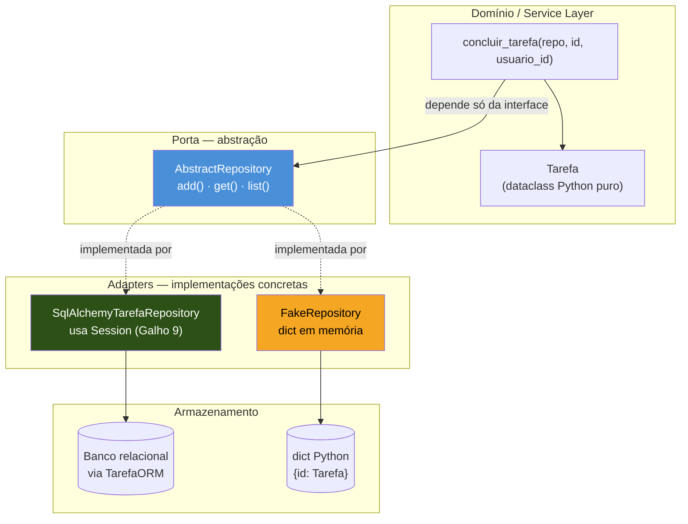
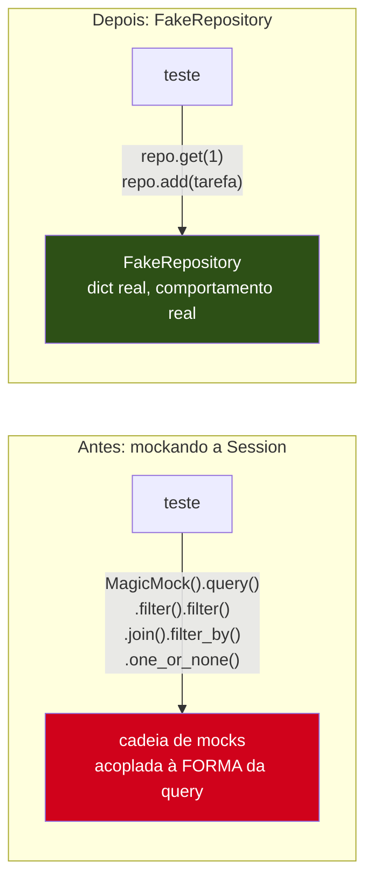

# Repository pattern — abstraindo a persistência

> [!abstract] TL;DR
> O Repository pattern esconde a persistência atrás de uma interface simples — tipicamente `add(entidade)`, `get(id)`, `list()` — declarada como classe abstrata (`abc.ABC`) e implementada por uma classe concreta que fala com o banco de verdade (`SqlAlchemyTarefaRepository`, usando a `Session` do Galho 9). O código de domínio e a Service Layer passam a depender só da interface abstrata, nunca de `sqlalchemy` diretamente — o que abre a porta para um `FakeRepository` em memória (um dicionário Python fingindo ser um banco) usado nos testes, muito mais rápido e mais simples de ler do que mockar `Session.query().filter().join()` em cada teste. Não é grátis: é mais uma camada de indireção, e só compensa quando o domínio é complexo o bastante pra justificar o desacoplamento — num CRUD trivial de duas telas, é over-engineering, e o próprio livro-fonte deste galho diz isso sem rodeios.

## A suíte de testes que ficou lenta e frágil

Um time mantém a API de Tarefas construída ao longo dos Galhos 9-12 desta trilha. A camada de Service (que a [[06 - Service Layer — orquestrando casos de uso|nota 06 deste galho]] vai nomear formalmente, mas que já existe informalmente desde a capstone do Galho 10) tem uma função `concluir_tarefa` que busca uma tarefa, confere se ela pertence ao usuário autenticado, marca como concluída e salva:

```python
# services/tarefas.py — antes do Repository
from sqlalchemy.orm import Session
from models import Tarefa


def concluir_tarefa(db: Session, tarefa_id: int, usuario_id: int) -> Tarefa:
    tarefa = (
        db.query(Tarefa)
        .filter(Tarefa.id == tarefa_id)
        .filter(Tarefa.usuario_id == usuario_id)
        .join(Tarefa.usuario)
        .filter_by(ativo=True)
        .one_or_none()
    )
    if tarefa is None:
        raise TarefaNaoEncontrada(tarefa_id)
    tarefa.concluida = True
    db.commit()
    return tarefa
```

O código funciona e passa nos testes de integração (contra um banco de teste real, como a [[03-Dominios/Tecnologia/Python/Testes/06 - Testando a camada de persistência — banco de teste e rollback|nota 06 do Galho 12]] ensina). O problema aparece quando alguém tenta escrever um teste **unitário** — rápido, sem subir banco nenhum — para a lógica de `concluir_tarefa`. Seguindo a [[03-Dominios/Tecnologia/Python/Testes/04 - Mocking com unittest.mock e pytest-mock|nota 04 do Galho 12]], a resposta óbvia é mockar a `Session`:

```python
# tests/test_concluir_tarefa_mockado.py — o jeito que fica frágil
from unittest.mock import MagicMock

from services.tarefas import concluir_tarefa
from models import Tarefa


def test_concluir_tarefa_marca_como_concluida(mocker):
    tarefa_falsa = Tarefa(id=1, usuario_id=42, titulo="Revisar PR", concluida=False)

    db_falso = MagicMock()
    db_falso.query.return_value.filter.return_value.filter.return_value \
        .join.return_value.filter_by.return_value.one_or_none.return_value = tarefa_falsa

    resultado = concluir_tarefa(db_falso, tarefa_id=1, usuario_id=42)

    assert resultado.concluida is True
    db_falso.commit.assert_called_once()
```

Esse teste passa — mas repare no que ele realmente verifica. A cadeia `db_falso.query.return_value.filter.return_value.filter.return_value.join.return_value.filter_by.return_value.one_or_none.return_value` não testa **nenhuma** lógica de consulta: ela apenas ensina o mock a devolver `tarefa_falsa` não importa o que `concluir_tarefa` chame nele. Se alguém trocar `.filter().filter()` por `.filter(and_(...))`, ou adicionar mais um `.join()`, o teste continua passando exatamente do mesmo jeito — porque o mock nunca validou a forma da query, só a sequência de atributos acessados até chegar em `one_or_none`. E se o método real virar `.filter().filter().join().filter_by().first()` em vez de `.one_or_none()`, o teste quebra com um erro que não tem nada a ver com a lógica de negócio: `AttributeError` em algum ponto no meio da cadeia mockada, porque o `MagicMock()` cru (sem `spec=Session`, sem `autospec`) não valida nada — o mesmo problema de fundo que a nota 04 do Galho 12 já descreveu no incidente do `ClienteCep`.

À medida que o número de casos de uso cresce — `criar_tarefa`, `concluir_tarefa`, `listar_tarefas_do_usuario`, `deletar_tarefa` — cada um ganha seu próprio teste com sua própria cadeia de `.query().filter()....` mockada, e a suíte inteira vira um mapa de encadeamentos do SQLAlchemy reproduzidos manualmente em mocks, não um mapa do comportamento do sistema. Trocar `.query()` (API 1.x, legada) por `select()` (API 2.0, a que o Galho 9 ensina) quebra **todos** esses testes de uma vez, mesmo que nenhuma regra de negócio tenha mudado uma linha.

> [!bug] O sintoma, em uma frase
> Testar a Service Layer mockando a `Session` do SQLAlchemy encadeamento por encadeamento (`query().filter().join()...`) acopla o teste à **forma exata da query**, não ao **comportamento do sistema** — qualquer refactor de acesso a dados quebra a suíte inteira, mesmo sem bug nenhum introduzido.

O Repository pattern resolve isso de um jeito diferente do "mockar melhor": ele não tenta tornar o mock da `Session` mais fiel — ele **remove a `Session` do vocabulário do teste inteiramente**, escondendo-a atrás de uma interface tão pequena que dá pra reimplementar em memória, sem SQLAlchemy nenhum.

## O domínio que este Repository vai persistir

Este galho já estabeleceu, na [[02 - Domain modeling — separando a lógica de negócio do framework|nota 02]], que o domínio de uma `Tarefa` deve existir como Python puro — sem `Mapped[]`, sem `mapped_column()`, sem qualquer conhecimento de que um banco existe. É esse objeto de domínio, não o modelo ORM, que o Repository desta nota vai mover entre memória e persistência:

```python
# domain/tarefa.py — Python puro, sem SQLAlchemy, sem FastAPI
from dataclasses import dataclass, field
from datetime import datetime


@dataclass
class Tarefa:
    """A entidade de domínio. Não sabe o que é uma tabela."""
    id: int | None
    usuario_id: int
    titulo: str
    concluida: bool = False
    criada_em: datetime = field(default_factory=datetime.utcnow)

    def concluir(self) -> None:
        if self.concluida:
            raise ValueError("tarefa já está concluída")
        self.concluida = True
```

O objeto de persistência — o modelo mapeado do Galho 9, com `Mapped[]`/`mapped_column()` — é uma classe **separada**, vivendo na camada de infraestrutura:

```python
# infra/orm.py — o modelo mapeado, mecânica idêntica à do Galho 9, nota 02
from datetime import datetime
from sqlalchemy import String, ForeignKey
from sqlalchemy.orm import DeclarativeBase, Mapped, mapped_column


class Base(DeclarativeBase):
    pass


class TarefaORM(Base):
    __tablename__ = "tarefas"

    id: Mapped[int] = mapped_column(primary_key=True)
    usuario_id: Mapped[int] = mapped_column(ForeignKey("usuarios.id"))
    titulo: Mapped[str] = mapped_column(String(200))
    concluida: Mapped[bool] = mapped_column(default=False)
    criada_em: Mapped[datetime] = mapped_column(default=datetime.utcnow)
```

Esta nota não reexplica `Mapped[]`, `mapped_column()` nem o ciclo `transient → pending → persistent → detached` — tudo isso já foi construído em profundidade pelo [[03-Dominios/Tecnologia/Python/Persistência de dados/02 - SQLAlchemy ORM — Session, mapped classes e relationships|Galho 9, nota 02]]. O que esta nota acrescenta é a peça que fica **entre** `Tarefa` (domínio) e `TarefaORM` (persistência): o Repository, que traduz de um lado para o outro sem que nenhum dos dois precise saber que o outro existe.



A Service Layer (`concluir_tarefa`) e o domínio (`Tarefa`) só enxergam o retângulo azul — `AbstractRepository`. Qual implementação concreta está por trás dele (SQL de verdade ou dicionário em memória) é uma decisão que acontece **fora** desse código, no ponto de composição da aplicação — o mesmo princípio que a [[05 - Injeção de dependência como princípio — sem framework pesado|nota 05 deste galho]] vai desenvolver como DI.

## A interface abstrata: `abc.ABC`

Python não tem `interface` como palavra reservada (ao contrário de Java/C#), mas o módulo `abc` da biblioteca padrão oferece o equivalente prático: uma classe-base cujos métodos marcados `@abstractmethod` **não podem ser instanciados sem implementação** — tentar instanciar diretamente `AbstractRepository()`, ou uma subclasse que esqueceu de implementar um dos métodos abstratos, levanta `TypeError` na hora da instanciação, não silenciosamente mais tarde.

```python
# domain/repository.py — a interface, sem NENHUMA menção a SQLAlchemy
from abc import ABC, abstractmethod

from domain.tarefa import Tarefa


class AbstractRepository(ABC):
    """Contrato que qualquer implementação de persistência de Tarefa deve cumprir."""

    @abstractmethod
    def add(self, tarefa: Tarefa) -> None:
        """Registra uma nova tarefa (ou marca como suja, se já existente)."""
        raise NotImplementedError

    @abstractmethod
    def get(self, tarefa_id: int) -> Tarefa | None:
        """Busca uma tarefa por id. None se não existir."""
        raise NotImplementedError

    @abstractmethod
    def list(self, usuario_id: int) -> list[Tarefa]:
        """Lista todas as tarefas de um usuário."""
        raise NotImplementedError
```

```python
>>> AbstractRepository()
Traceback (most recent call last):
    ...
TypeError: Can't instantiate abstract class AbstractRepository
with abstract methods add, get, list
```

Repare no que esse arquivo **não** importa: nenhum `sqlalchemy`, nenhum `Session`, nenhum `Engine`. `domain/repository.py` é tão livre de framework quanto `domain/tarefa.py` — é essa ausência de import que garante, estruturalmente, que qualquer código escrito contra `AbstractRepository` não pode acidentalmente vazar dependência de SQLAlchemy pra dentro do domínio. Não é uma convenção que alguém precisa lembrar de seguir; é uma restrição que o próprio arquivo impõe.

> [!question]- Por que não usar `typing.Protocol` em vez de `abc.ABC`?
> Ambos resolvem "definir um contrato" em Python, mas com filosofias diferentes. `typing.Protocol` (structural typing — se anda como pato e faz quack como pato, é um pato) permite que **qualquer** classe que já tenha os métodos certos seja aceita onde o protocolo é esperado, sem herdar de nada explicitamente — útil quando você não controla a classe concreta (por exemplo, aceitar qualquer objeto do ecossistema que já tenha `.read()`). `abc.ABC` (nominal typing — precisa herdar explicitamente) é mais apropriado aqui porque o objetivo não é aceitar implementações de terceiros por acidente, é **impor** que toda implementação de Repository declare explicitamente essa intenção herdando de `AbstractRepository`, e que o Python recuse em tempo de instanciação (`TypeError`, não só um aviso de type checker) qualquer implementação incompleta. Para uma interface interna da própria aplicação, com um número pequeno e conhecido de implementações (SQL, Fake, talvez um cache no futuro), `ABC` comunica a intenção com mais clareza: "isto é um contrato que este código formalmente assina", não "isto por acaso tem os métodos certos".

## A implementação concreta: `SqlAlchemyTarefaRepository`

A implementação real fala com o banco através da `Session` — exatamente a mecânica que o Galho 9 já ensinou (Unit of Work + Identity Map, `session.add()`, `session.get()`, lazy vs. eager loading). O que muda aqui é **onde** essa mecânica vive: só dentro desta classe, nunca espalhada pela Service Layer.

```python
# infra/repository_sqlalchemy.py
from sqlalchemy import select
from sqlalchemy.orm import Session

from domain.repository import AbstractRepository
from domain.tarefa import Tarefa
from infra.orm import TarefaORM


class SqlAlchemyTarefaRepository(AbstractRepository):
    def __init__(self, session: Session) -> None:
        self._session = session

    def add(self, tarefa: Tarefa) -> None:
        orm_obj = self._session.get(TarefaORM, tarefa.id) if tarefa.id else None
        if orm_obj is None:
            orm_obj = TarefaORM(
                usuario_id=tarefa.usuario_id,
                titulo=tarefa.titulo,
                concluida=tarefa.concluida,
                criada_em=tarefa.criada_em,
            )
            self._session.add(orm_obj)
            self._session.flush()          # atribui a PK de volta, sem commitar a transação
            tarefa.id = orm_obj.id
        else:
            orm_obj.titulo = tarefa.titulo
            orm_obj.concluida = tarefa.concluida

    def get(self, tarefa_id: int) -> Tarefa | None:
        orm_obj = self._session.get(TarefaORM, tarefa_id)
        if orm_obj is None:
            return None
        return self._para_dominio(orm_obj)

    def list(self, usuario_id: int) -> list[Tarefa]:
        stmt = select(TarefaORM).where(TarefaORM.usuario_id == usuario_id)
        orm_objs = self._session.scalars(stmt).all()
        return [self._para_dominio(o) for o in orm_objs]

    @staticmethod
    def _para_dominio(orm_obj: TarefaORM) -> Tarefa:
        return Tarefa(
            id=orm_obj.id,
            usuario_id=orm_obj.usuario_id,
            titulo=orm_obj.titulo,
            concluida=orm_obj.concluida,
            criada_em=orm_obj.criada_em,
        )
```

Alguns pontos que valem destaque:

- **`_para_dominio` é a fronteira de tradução.** Todo objeto que sai do Repository é um `Tarefa` de domínio, nunca um `TarefaORM` cru — o chamador (Service Layer) nunca vê um objeto mapeado do SQLAlchemy, então nunca corre risco de `DetachedInstanceError` (o bug que abre a [[03-Dominios/Tecnologia/Python/Persistência de dados/02 - SQLAlchemy ORM — Session, mapped classes e relationships|nota 02 do Galho 9]]) — a tradução acontece dentro da `Session` ainda ativa, antes do objeto sair do Repository.
- **`session.flush()`, não `session.commit()`, dentro de `add()`.** O Repository registra a intenção e sincroniza o suficiente para obter a PK gerada pelo banco — mas **não decide quando a transação termina**. Quem chama `commit()` (ou `rollback()`) é uma camada acima, tipicamente a Unit of Work que a [[04 - Unit of Work — formalizando o padrão que já existia|próxima nota deste galho]] formaliza. Se `add()` desse `commit()` sozinho, um caso de uso que precisa criar duas tarefas atomicamente (as duas ou nenhuma) perderia essa garantia — cada chamada a `add()` commitaria por conta própria.
- **O construtor recebe a `Session` de fora**, não a cria internamente. Isso é o que permite que a mesma `Session` seja compartilhada entre múltiplos Repositories numa única unidade de trabalho, e é o gancho direto para a Unit of Work da próxima nota.

> [!tip] O Repository não precisa cobrir toda a API de consulta do ORM
> Uma tentação comum é fazer o Repository "genérico o bastante" para expressar qualquer filtro possível — um método `find(**kwargs)` que aceita qualquer combinação de critérios, por exemplo. Isso reintroduz o próprio problema que o Repository resolve: uma interface tão flexível quanto o ORM por baixo dela deixa de ser uma abstração e vira um wrapper fino do SQLAlchemy, que ainda assim vaza detalhe de query pra fora. A prática recomendada por Percival & Gregory é o oposto: o Repository expõe só os métodos que os casos de uso **de fato** precisam — `get`, `add`, `list` (por vezes especializado, como `list_por_usuario`) — e quando um novo caso de uso pede uma consulta nova, adiciona-se um método novo e específico, não um parâmetro genérico a mais.

## `FakeRepository`: a alternativa pra testes

Com `AbstractRepository` definida, a Service Layer pode ser testada contra qualquer implementação que cumpra o contrato — inclusive uma que não tem banco nenhum por trás. Um `FakeRepository` guarda tudo num dicionário Python em memória:

```python
# tests/fakes.py
from domain.repository import AbstractRepository
from domain.tarefa import Tarefa


class FakeRepository(AbstractRepository):
    def __init__(self, tarefas: list[Tarefa] | None = None) -> None:
        self._tarefas: dict[int, Tarefa] = {t.id: t for t in (tarefas or [])}
        self._proximo_id = max((t.id or 0 for t in (tarefas or [])), default=0) + 1

    def add(self, tarefa: Tarefa) -> None:
        if tarefa.id is None:
            tarefa.id = self._proximo_id
            self._proximo_id += 1
        self._tarefas[tarefa.id] = tarefa

    def get(self, tarefa_id: int) -> Tarefa | None:
        return self._tarefas.get(tarefa_id)

    def list(self, usuario_id: int) -> list[Tarefa]:
        return [t for t in self._tarefas.values() if t.usuario_id == usuario_id]
```

E o teste de `concluir_tarefa`, reescrito contra o Fake, volta a ler como uma frase sobre comportamento, não como uma cadeia de atributos mockados:

```python
# tests/test_concluir_tarefa_com_fake.py
import pytest

from domain.tarefa import Tarefa
from services.tarefas import concluir_tarefa, TarefaNaoEncontrada
from tests.fakes import FakeRepository


def test_concluir_tarefa_marca_como_concluida():
    tarefa = Tarefa(id=1, usuario_id=42, titulo="Revisar PR", concluida=False)
    repo = FakeRepository([tarefa])

    resultado = concluir_tarefa(repo, tarefa_id=1, usuario_id=42)

    assert resultado.concluida is True
    assert repo.get(1).concluida is True   # a mudança realmente ficou persistida no Fake


def test_concluir_tarefa_levanta_erro_se_nao_existir():
    repo = FakeRepository([])

    with pytest.raises(TarefaNaoEncontrada):
        concluir_tarefa(repo, tarefa_id=999, usuario_id=42)
```

Compare este teste com o do início da nota. Nenhuma linha aqui sabe que `SqlAlchemy` existe — não há `.query()`, não há cadeia de `.filter().join()` reproduzida artificialmente, não há `MagicMock` nenhum. `FakeRepository` **é** o dado — não uma simulação de chamadas, um objeto real que guarda e devolve `Tarefa`s de verdade, seguindo exatamente o mesmo contrato (`AbstractRepository`) que `SqlAlchemyTarefaRepository` cumpre em produção. Se `concluir_tarefa` chamar `repo.get()` errado, ou esquecer de chamar `repo.add()` de volta depois de mutar a tarefa, o teste falha porque o **estado observável está errado** — `repo.get(1).concluida` continua `False` — não porque uma sequência de chamadas mockadas não bateu.



> [!question]- `FakeRepository` não é só "mais um tipo de mock" com outro nome?
> A diferença é sobre **o que está sendo verificado**, não sobre a palavra usada. Um mock (mesmo bem configurado) registra chamadas e devolve valores fixos que você programou antecipadamente — o teste continua, no fundo, verificando interação ("o mock foi chamado assim"). Um Fake é uma implementação **funcional** e simplificada do contrato real: `FakeRepository.add()` de fato guarda a tarefa, `FakeRepository.get()` de fato a devolve depois — o teste verifica **estado observável através do próprio contrato**, exatamente como o código de produção o usaria. Essa distinção já está na taxonomia completa de test doubles (dummy/stub/spy/mock/fake) em [[03-Dominios/Engenharia/Testes/index|Engenharia/Testes]] — o Repository pattern não inventa uma categoria nova de duplo de teste, ele só cria, de propósito, uma interface pequena o suficiente pra que escrever um Fake completo e correto seja trivial (um dicionário e três métodos), em vez de algo que só valeria a pena fazer para uma classe imensa.

## Fronteira com o mocking do Galho 12: quando cada um se aplica

A [[03-Dominios/Tecnologia/Python/Testes/04 - Mocking com unittest.mock e pytest-mock|nota 04 do Galho 12]] estabeleceu a regra de bolso: mocke fronteiras externas ao processo (rede, banco, relógio), não o próprio código sob teste. O Repository pattern não contradiz essa regra — ele muda **onde** a fronteira é desenhada.

| | Mockar a `Session` diretamente | `AbstractRepository` + `FakeRepository` |
|---|---|---|
| O que o teste conhece | A API interna do SQLAlchemy (`.query()`, `.filter()`, `.join()`, `.scalars()`...) | Só três métodos do próprio domínio: `add`, `get`, `list` |
| O que quebra o teste num refactor de acesso a dados | Qualquer mudança na forma da query (trocar `.filter()` por `and_()`, migrar `.query()` para `select()`) | Nada — o contrato (`add`/`get`/`list`) não mudou, só a implementação por trás dele |
| Esforço de manter o teste correto | Alto — a cadeia mockada precisa espelhar exatamente a sequência de chamadas do código real | Baixo — o Fake é escrito uma vez, reusado em toda a suíte de Service Layer |
| O que o teste de fato verifica | Que uma sequência de atributos foi acessada na ordem certa | Que o estado do repositório mudou do jeito esperado |
| Continua fazendo sentido usar? | Sim — para testar a **própria** `SqlAlchemyTarefaRepository` contra um banco de teste real (integração, [[03-Dominios/Tecnologia/Python/Testes/06 - Testando a camada de persistência — banco de teste e rollback|nota 06 do Galho 12]]), não a Service Layer | Sim — para testar a Service Layer isoladamente, sem subir banco nenhum |

A régua não muda: mocke a fronteira externa. O que o Repository faz é **mover a fronteira** — em vez de "a fronteira é a `Session`", passa a ser "a fronteira é o Repository". A `SqlAlchemyTarefaRepository` em si ainda precisa ser testada contra um banco de verdade (é código de infraestrutura, faz I/O real) — mas isso é um teste de integração isolado, escrito uma vez, cobrindo só a tradução entre `Tarefa` e `TarefaORM`. Toda a Service Layer, que hoje concentra a maior parte da lógica de negócio e cresce a cada caso de uso novo, passa a rodar contra o Fake — rápida, determinística, sem tocar disco nem rede.

## Armadilhas comuns

> [!warning] Deixar o `TarefaORM` vazar pela interface, "só dessa vez"
> **O que acontece:** sob pressão de prazo, alguém adiciona um método a `SqlAlchemyTarefaRepository` que devolve o objeto `TarefaORM` diretamente — "é só uma tela administrativa interna, não precisa de tradução" — e o resto do código, aos poucos, aprende a depender desse atalho. **Por quê:** no momento em que qualquer código fora da camada de infraestrutura recebe um `TarefaORM`, ele volta a estar acoplado ao SQLAlchemy (e sujeito a `DetachedInstanceError` se acessar um atributo lazy fora da `Session`) — o Repository deixou de cumprir sua função de fronteira, mesmo que a interface abstrata continue existindo no código. **Como evitar:** todo método público de uma implementação de `AbstractRepository` devolve `Tarefa` (domínio) ou `None`/`list[Tarefa]` — nunca `TarefaORM`. Se uma tela precisa de um dado que o domínio não modela (um campo técnico do banco, por exemplo), a resposta não é vazar o ORM — é decidir, deliberadamente, se esse dado pertence ao domínio ou se merece uma consulta separada, fora do Repository.

> [!warning] Repository "genérico" que aceita filtros arbitrários
> **O que acontece:** em vez de métodos específicos (`get`, `list`, talvez `list_por_usuario`), o Repository ganha um método `find(**filtros)` que aceita qualquer combinação de campo e valor, repassando-os quase diretamente para um `.filter_by(**filtros)` do SQLAlchemy por baixo. **Por quê:** essa "flexibilidade" reintroduz o próprio acoplamento que o Repository existe para eliminar — agora a Service Layer decide **quais campos filtrar**, um conhecimento que deveria estar só na camada de persistência, e a interface fica tão aberta quanto o ORM que ela deveria esconder. Testar com `FakeRepository` também fica mais difícil: reproduzir um `filter_by(**filtros)` genérico em memória exige reimplementar boa parte de um motor de query. **Como evitar:** cada novo caso de uso que precisa de uma consulta diferente ganha um método novo e nomeado (`list_pendentes_do_usuario`, `list_criadas_apos`) — mais métodos, mas cada um pequeno, explícito, e trivial de replicar no Fake.

> [!warning] Fake e implementação real divergindo em silêncio
> **O que acontece:** `SqlAlchemyTarefaRepository.list()` aplica um filtro adicional (por exemplo, ignorar tarefas de usuários inativos) que `FakeRepository.list()` nunca implementou — os testes contra o Fake continuam verdes, mas o comportamento em produção é diferente do que a suíte garante. **Por quê:** nada no Python impede que duas implementações do mesmo `AbstractRepository` tenham comportamentos sutilmente diferentes — `abc.ABC` garante que os métodos **existem**, não que fazem a mesma coisa. **Como evitar:** manter um conjunto de testes de contrato — a mesma bateria de casos de teste rodada contra `FakeRepository` **e** contra `SqlAlchemyTarefaRepository` (esta última com banco de teste real) — garante que as duas implementações concordam no comportamento observável, não só na assinatura dos métodos.

## A ressalva honesta: indireção tem custo

Nada disso é grátis. Cada camada nova — interface abstrata, implementação SQL, Fake, tradução domínio↔ORM — é código a mais para escrever, manter e entender. Percival & Gregory, os autores do livro que este galho segue como referência de rigor, são explícitos sobre isso em *Architecture Patterns with Python*: o Repository pattern (assim como a Unit of Work da próxima nota, e a arquitetura hexagonal completa que o galho constrói) resolve um problema real, mas é um problema que só existe **a partir de certo nível de complexidade de domínio**.

> [!warning] Quando o Repository é over-engineering
> Um CRUD simples — cadastro de duas ou três entidades, sem regra de negócio além de validação de campo, sem múltiplos casos de uso concorrendo pela mesma entidade — não precisa de `AbstractRepository`, `TarefaORM` separada de `Tarefa`, e uma camada de tradução entre as duas. Nesse cenário, acessar `Session` diretamente do handler (ou de uma função de serviço fina) é mais simples de ler, mais rápido de escrever, e não sacrifica nada de importante — porque não há lógica de domínio complexa o suficiente para o acoplamento ao SQLAlchemy incomodar. Introduzir Repository nesse contexto adiciona arquivos, indireção e um vocabulário extra (`add`/`get`/`list`, tradução domínio↔ORM) sem nenhum ganho correspondente — o próprio livro-fonte deste galho chama isso de complexidade acidental, e recomenda explicitamente **não** aplicar esses padrões a aplicações pequenas ou de vida curta.

A régua prática: o Repository compensa quando (a) o domínio tem regras de negócio não triviais que merecem ser testadas isoladamente, com frequência e velocidade, sem subir banco a cada rodada de teste; (b) existe risco real de trocar de tecnologia de persistência (outro ORM, outro banco, um cache na frente) ao longo da vida do sistema; ou (c) o time é grande o bastante para que "onde vive a lógica de negócio" precise ser uma resposta óbvia e não uma convenção informal. A API de Tarefas desta trilha justifica o padrão porque serve de veículo didático para ele — mas um script de automação pessoal, ou um CRUD administrativo interno usado por três pessoas, quase sempre não justifica.

## Em resumo

O Repository pattern não inventa uma técnica nova de acesso a dados — ele organiza uma já conhecida atrás de um contrato pequeno e estável (`abc.ABC` com `add`/`get`/`list`), implementado uma vez contra o SQLAlchemy de verdade (`SqlAlchemyTarefaRepository`, usando `Session` exatamente como o Galho 9 ensinou) e outra vez em memória pura, para testes (`FakeRepository`, um dicionário Python). O ganho central não é performance nem menos código — é **desacoplamento testável**: a Service Layer passa a depender só da abstração, o que troca "mockar `Session.query().filter().join()...` em cada teste" por "testar contra um Fake real, rápido e representativo do comportamento esperado". O custo é real — mais uma camada, mais um vocabulário — e vale a pena reconhecer quando ele não compensa: num domínio simples, a indireção do Repository é peso morto, não arquitetura.

## Em entrevista

Repository é um padrão recorrente em entrevistas de arquitetura backend, especialmente quando o entrevistador quer avaliar se o candidato entende desacoplamento além do nível de "usar interfaces por usar":

> "The Repository pattern puts an abstraction between the domain layer and persistence — usually just `add`, `get`, and `list` behind an abstract interface. The domain and the service layer only ever talk to that interface, never to the ORM directly. The concrete implementation — say, a SQLAlchemy-backed repository — lives in the infrastructure layer and translates between the domain entity and the mapped ORM class. The payoff is testability: instead of mocking `Session.query().filter().join()...` chain by chain, which couples your tests to the exact shape of the query, you write a Fake repository — an in-memory dict that implements the same interface — and test your business logic against that. It's faster, and it actually verifies behavior instead of a sequence of mocked calls. The tradeoff is real, though — it's an extra layer, and for a trivial CRUD with no meaningful domain logic, it's usually not worth the indirection."

> [!question]- E se perguntarem "por que não simplesmente injetar a `Session` na Service Layer"?
> A resposta honesta reconhece os dois lados: injetar `Session` diretamente é mais simples e funciona bem para aplicações pequenas — é exatamente o padrão que os Galhos 9-12 usaram até aqui. O Repository entra quando esse acoplamento começa a doer de verdade: quando a Service Layer cresce a ponto de a suíte de testes unitários (sem banco) valer a pena, quando existe possibilidade real de trocar de tecnologia de persistência, ou quando o time quer que "onde vive a lógica de negócio" seja uma resposta arquitetural clara, não uma convenção. Um candidato sênior nomeia o trade-off explicitamente em vez de apresentar Repository como superior em qualquer circunstância — é exatamente a ressalva que esta nota faz, e que o livro-fonte do galho (Percival & Gregory) faz questão de repetir.

## Como explicar em inglês

| PT | EN |
|----|----|
| padrão Repository | Repository pattern |
| classe abstrata | abstract class |
| método abstrato | abstract method |
| implementação concreta | concrete implementation |
| entidade de domínio | domain entity |
| modelo mapeado (ORM) | mapped model / ORM model |
| duplo de teste falso (Fake) | fake test double |
| camada de infraestrutura | infrastructure layer |
| indireção (custo arquitetural) | indirection |
| complexidade acidental | accidental complexity |
| testes de contrato | contract tests |

## Fontes

- Percival, Harry; Gregory, Bob. *Architecture Patterns with Python* — capítulo "Repository Pattern", O'Reilly, 2020. https://www.cosmicpython.com/book/chapter_02_repository.html (consultado em 2026-07-12) — a interface `AbstractRepository`, `add`/`get`, e a ressalva explícita sobre quando o padrão compensa (ou não) o custo de indireção.
- Python documentation — `abc` — Abstract Base Classes: https://docs.python.org/3/library/abc.html (consultado em 2026-07-12) — `ABC`, `@abstractmethod`, o comportamento de `TypeError` ao instanciar classe incompleta.
- Python documentation — `dataclasses`: https://docs.python.org/3/library/dataclasses.html (consultado em 2026-07-12) — `@dataclass`, `field(default_factory=...)`, usados na entidade de domínio `Tarefa`.
- [[03-Dominios/Tecnologia/Python/Persistência de dados/02 - SQLAlchemy ORM — Session, mapped classes e relationships|02 — SQLAlchemy ORM: Session, mapped classes e relationships]] — Galho 9, mecânica de `Session`/`Engine` que este Repository consome sem repetir.
- [[03-Dominios/Tecnologia/Python/Testes/04 - Mocking com unittest.mock e pytest-mock|04 — Mocking com unittest.mock e pytest-mock]] — Galho 12, o contraste central desta nota: Repository/Fake como alternativa arquitetural a mockar o ORM em cada teste.

## Veja também

- [[01 - Por que GoF clássico é menos necessário em Python|01 — Por que GoF clássico é menos necessário em Python]] — nota anterior deste galho.
- [[02 - Domain modeling — separando a lógica de negócio do framework|02 — Domain modeling: separando a lógica de negócio do framework]] — nota anterior deste galho, origem do `Tarefa` puro usado aqui.
- [[04 - Unit of Work — formalizando o padrão que já existia|04 — Unit of Work: formalizando o padrão que já existia]] — próxima nota: nomeia o que já apareceu aqui como `session.flush()` sem `commit()`, agrupando Repositories numa transação atômica.
- [[06 - Service Layer — orquestrando casos de uso|06 — Service Layer: orquestrando casos de uso]] — onde `AbstractRepository` é de fato consumido por funções de caso de uso como `concluir_tarefa`.
- [[index|Arquitetura e Design Patterns (Galho 13)]] — MOC deste galho.

Consultado em 2026-07-12.
