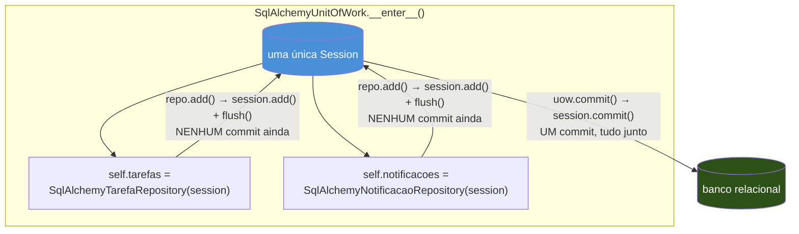
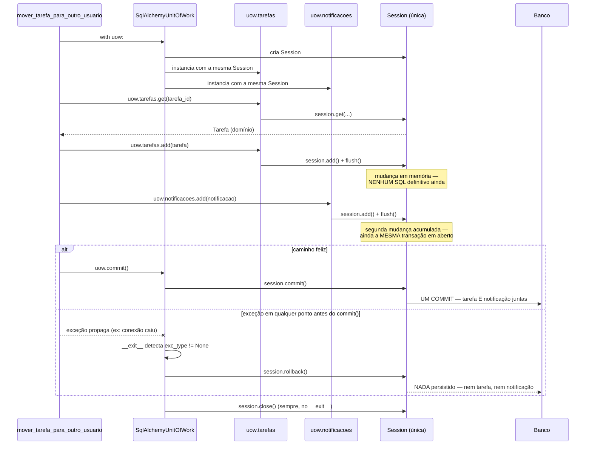

# Unit of Work — formalizando o padrão que já existia

> [!abstract] TL;DR
> Mover uma tarefa de um usuário para outro, e notificar o destinatário, toca dois Repositories diferentes ([[03 - Repository pattern — abstraindo a persistência|nota 03 deste galho]]): um de Tarefas, um de Notificações. Se cada `Repository.add()` for seguido do seu próprio `session.commit()` isolado, uma queda de conexão entre os dois commits deixa o sistema num estado inconsistente — a tarefa mudou de dono, mas a notificação nunca existiu (ou o inverso). O Unit of Work resolve isso **sem inventar mecanismo novo**: ele nomeia e generaliza algo que já existia, sem nome, desde a [[03-Dominios/Tecnologia/Python/Persistência de dados/02 - SQLAlchemy ORM — Session, mapped classes e relationships|Session do Galho 9]] — a `Session` já é uma Unit of Work informal (acumula mudanças, só persiste no `commit()`). `AbstractUnitOfWork` é uma classe abstrata (`abc.ABC`) com protocolo de context manager, expondo um ou mais Repositories como atributos e métodos `commit()`/`rollback()` explícitos; `SqlAlchemyUnitOfWork` a implementa entregando aos Repositories a **mesma** `Session`, garantindo que tudo que eles acumularem seja persistido (ou descartado) junto, num único `commit()`; `FakeUnitOfWork` reproduz o mesmo contrato em memória, usando `FakeRepository`, para testar a lógica de negócio sem banco nenhum. O padrão separa "o que muda" (decisão do domínio: quais entidades foram tocadas) de "quando persiste" (decisão da Unit of Work: o momento exato do commit) — e essa separação importa precisamente quando uma operação de negócio precisa tocar múltiplos Repositories atomicamente.

## O bug: dois commits separados, uma conexão que caiu no meio

A API de Tarefas ganha um recurso novo: delegar uma tarefa para outro usuário. Quando isso acontece, duas coisas precisam acontecer — a tarefa muda de dono, e o novo dono recebe uma notificação avisando que uma tarefa chegou pra ele. O desenvolvedor que implementa isso já tem, à disposição, o `SqlAlchemyTarefaRepository` da nota anterior, e escreve um `NotificacaoRepository` seguindo exatamente o mesmo molde:

```python
# domain/notificacao.py — outra entidade de domínio, Python puro
from dataclasses import dataclass, field
from datetime import datetime


@dataclass
class Notificacao:
    """Entidade de domínio. Não sabe que existe um banco por trás."""
    id: int | None
    usuario_id: int
    mensagem: str
    lida: bool = False
    criada_em: datetime = field(default_factory=datetime.utcnow)
```

```python
# domain/repository_notificacao.py — mesmo contrato do Repository de Tarefas
from abc import ABC, abstractmethod

from domain.notificacao import Notificacao


class AbstractNotificacaoRepository(ABC):
    @abstractmethod
    def add(self, notificacao: Notificacao) -> None:
        raise NotImplementedError

    @abstractmethod
    def list_do_usuario(self, usuario_id: int) -> list[Notificacao]:
        raise NotImplementedError
```

Com os dois Repositories prontos, o caso de uso de "mover tarefa" parece uma composição direta dos dois — buscar a tarefa, trocar o dono, salvar; criar a notificação, salvar:

```python
# services/mover_tarefa.py — a versão que parece razoável, e não é
from sqlalchemy.orm import Session

from domain.notificacao import Notificacao
from infra.repository_sqlalchemy import SqlAlchemyTarefaRepository
from infra.repository_notificacao_sqlalchemy import SqlAlchemyNotificacaoRepository


def mover_tarefa_para_outro_usuario(
    session_tarefas: Session, session_notificacoes: Session,
    tarefa_id: int, novo_usuario_id: int,
) -> None:
    repo_tarefas = SqlAlchemyTarefaRepository(session_tarefas)
    tarefa = repo_tarefas.get(tarefa_id)
    if tarefa is None:
        raise TarefaNaoEncontrada(tarefa_id)

    tarefa.usuario_id = novo_usuario_id
    repo_tarefas.add(tarefa)
    session_tarefas.commit()                       # ① commit #1 — a tarefa já mudou de dono, é permanente

    # 💥 a conexão cai bem aqui — timeout de rede, pool esgotado, o banco reinicia no meio de um deploy

    repo_notificacoes = SqlAlchemyNotificacaoRepository(session_notificacoes)
    notificacao = Notificacao(
        id=None,
        usuario_id=novo_usuario_id,
        mensagem=f"Você recebeu a tarefa '{tarefa.titulo}'",
    )
    repo_notificacoes.add(notificacao)
    session_notificacoes.commit()                   # ② nunca executa
```

O código passa em todo teste manual óbvio — ninguém, ao testar na mão, derruba a conexão exatamente entre o commit ① e o commit ②. Mas em produção, sob carga real, com um pool de conexões que ocasionalmente recicla uma conexão morta (o assunto da [[03-Dominios/Tecnologia/Python/Persistência de dados/07 - Connection pooling e performance em produção|nota 07 do Galho 9]]) ou um deploy que reinicia o banco no pior momento possível, essa janela entre os dois commits eventualmente é atingida. O resultado: a `Tarefa` já está com `usuario_id` apontando para o novo dono — commit ① é permanente, não há como desfazer automaticamente — mas a `Notificacao` nunca chegou a existir. O novo dono da tarefa nunca fica sabendo que recebeu algo. Pior ainda, o inverso também é possível dependendo de qual serviço a equipe decidir "commitar primeiro" numa tentativa ingênua de conserto: notificação criada, mas a tarefa nunca mudou de dono — um aviso sobre algo que não aconteceu.

> [!bug] O que está quebrado, em uma frase
> Duas mudanças de negócio que pertencem à **mesma operação** — mover a tarefa e notificar o destinatário — são persistidas por dois `commit()` separados; se qualquer coisa falhar entre os dois, o sistema fica num estado que nenhuma regra de negócio jamais permitiria observar diretamente, porque metade da operação aconteceu e a outra metade não.

Repare que isso não é o mesmo bug do banco único visto na [[03-Dominios/Tecnologia/Python/Persistência de dados/06 - Transações e isolamento — ACID na prática, isolation levels, deadlocks de aplicação|nota 06 do Galho 9]] (a transferência bancária que perde dinheiro entre dois `commit()` na mesma `Session`). Ali, a correção é `with session.begin():` amarrando os dois passos numa única transação — mecânica que aquela nota já cobre em profundidade e que esta nota não repete. Aqui, o problema é um degrau acima: são **dois Repositories diferentes**, cada um potencialmente com sua própria `Session`, cada um decidindo por conta própria quando commitar. Amarrar isso numa única transação exige uma peça que coordene os dois Repositories a partir de fora — e é exatamente essa peça que esta nota nomeia.

## A pista que já estava lá: a `Session` sempre foi uma Unit of Work

A correção não exige inventar um mecanismo novo. Ela exige **reconhecer** um mecanismo que já existia, sem nome formal, desde a primeira vez que este galho tocou a `Session` do SQLAlchemy. A [[03-Dominios/Tecnologia/Python/Persistência de dados/02 - SQLAlchemy ORM — Session, mapped classes e relationships|nota 02 do Galho 9]] descreve exatamente esse comportamento no seu TL;DR: a `Session` "é ao mesmo tempo uma **Unit of Work** (...) e um **Identity Map**". Ela acumula objetos "sujos" — novos, modificados, marcados para deleção — em memória, e só emite SQL quando mandada, tipicamente no `commit()`. Entre um `session.add()` e um `session.commit()`, nenhuma linha de SQL sai para o banco; a `Session` está só rastreando o que precisa acontecer.

O nome "Unit of Work" não é uma invenção desta nota — é um padrão de arquitetura catalogado por Martin Fowler em *Patterns of Enterprise Application Architecture* (2002), muito antes do SQLAlchemy existir: "mantém uma lista de objetos afetados por uma transação de negócio e coordena a escrita de mudanças". A `Session` **é** uma implementação desse padrão. O que esta nota faz não é criar uma Unit of Work do zero — é **generalizar** a que já está embutida na `Session`, dando a ela uma interface própria, independente de qual `Session` específica está por trás, e capaz de coordenar **múltiplos Repositories ao mesmo tempo**, não só uma tabela isolada.

> [!question]- Se a `Session` já é uma Unit of Work, por que não usar `session.begin()` direto, como a nota 06 do Galho 9 ensinou?
> Porque `session.begin()` amarra transações **dentro de uma única `Session`** — funciona perfeitamente quando todas as operações da unidade de trabalho passam pela mesma sessão, como no exemplo da transferência bancária. O problema que abre esta nota é diferente: o código tinha **duas Sessions separadas** (`session_tarefas`, `session_notificacoes`), uma para cada Repository, porque cada Repository foi instanciado independentemente. `session.begin()` não resolve isso — ele só protege a Session em que foi chamado. A correção real não é "usar `session.begin()` nos dois lugares" (isso ainda deixaria dois commits separados, só que cada um atomicamente correto **isoladamente**, sem coordenação entre os dois). A correção é garantir que os dois Repositories compartilhem **a mesma** `Session` desde o início — e é exatamente isso que a Unit of Work formaliza como responsabilidade dela: criar a `Session`, entregá-la a todos os Repositories que a operação de negócio precisa, e expor um único ponto de `commit()` que cobre tudo o que foi acumulado nela.

## `AbstractUnitOfWork`: o contrato

Seguindo o mesmo molde do Repository — interface abstrata livre de qualquer import de SQLAlchemy, implementação concreta que fala com o banco de verdade, e uma versão Fake para testes — a Unit of Work começa como uma classe abstrata que declara: (a) quais Repositories ela expõe como atributos, e (b) o protocolo de context manager que controla o ciclo de vida da unidade de trabalho inteira.

```python
# domain/unit_of_work.py — sem NENHUMA menção a sqlalchemy
from abc import ABC, abstractmethod

from domain.repository import AbstractRepository
from domain.repository_notificacao import AbstractNotificacaoRepository


class AbstractUnitOfWork(ABC):
    """Contrato: expõe os Repositories da operação, coordena commit/rollback."""

    tarefas: AbstractRepository
    notificacoes: AbstractNotificacaoRepository

    def __enter__(self) -> "AbstractUnitOfWork":
        return self

    def __exit__(self, exc_type, exc_value, traceback) -> None:
        if exc_type is not None:
            self.rollback()
        # nota: NÃO há commit() automático aqui — ver seção seguinte

    @abstractmethod
    def commit(self) -> None:
        raise NotImplementedError

    @abstractmethod
    def rollback(self) -> None:
        raise NotImplementedError
```

Esta nota não reexplica o mecanismo de `__enter__`/`__exit__` em si — o protocolo de context manager já foi coberto em profundidade pelo Galho 4, tanto na forma de classe quanto via `@contextlib.contextmanager` na [[03-Dominios/Tecnologia/Python/Funcional e idiomas avançados/08 - Context managers via generator|nota 08 daquele galho]]. O que importa reter aqui é **o que** esses dois métodos fazem no contexto específico de uma Unit of Work, não como o protocolo funciona por baixo.

Dois pontos merecem destaque imediato:

- **`tarefas` e `notificacoes` são declarações de classe, não atribuições.** A classe abstrata só promete que qualquer implementação vai expor esses dois atributos, tipados como as interfaces de Repository correspondentes — ela não os cria. Quem instancia os Repositories de verdade (e decide de onde eles vêm — uma `Session` real, um dicionário Fake) é cada implementação concreta, dentro do próprio `__enter__`.
- **`__exit__` só reage a exceção — nunca commita sozinho.** Repare que o `__exit__` de `AbstractUnitOfWork` faz `rollback()` se algo deu errado, mas **não** chama `commit()` no caminho feliz. Essa é uma escolha deliberada, e é o ponto mais fácil de errar copiando o padrão de `with session.begin():` visto no Galho 9 (que *sim* commita automaticamente ao sair sem exceção).

> [!warning] Por que a Unit of Work NÃO commita automaticamente ao sair sem erro
> Um `with session.begin():` do Galho 9 commita sozinho se o bloco terminar sem exceção — e isso faz sentido lá, porque o bloco inteiro é escrito no local exato onde a decisão de negócio acontece. A Unit of Work é uma abstração de nível mais alto: o código dentro do `with uow:` pode ter caminhos legítimos que terminam sem exceção e **ainda assim não devem persistir nada** — por exemplo, uma validação que decide "não há nada a fazer aqui" e retorna cedo, sem erro nenhum. Se `__exit__` commitasse por padrão, esse retorno cedo persistiria silenciosamente qualquer coisa que os Repositories tivessem acumulado até ali, mesmo que a intenção do código fosse "não mudar nada". A prática recomendada por Percival & Gregory é exigir um `uow.commit()` **explícito**, escrito no ponto exato do caso de uso onde a decisão de negócio "sim, persista isso" de fato acontece — o commit vira uma linha visível no código de domínio, não um efeito colateral automático de sair de um bloco sem erro.

## `SqlAlchemyUnitOfWork`: a implementação concreta

A implementação real cria a `Session` dentro do próprio `__enter__` e entrega **essa mesma instância** para todos os Repositories que a unidade de trabalho expõe. É esse compartilhamento — não nenhum mecanismo novo de transação — que garante atomicidade entre `tarefas` e `notificacoes`.

```python
# infra/unit_of_work_sqlalchemy.py
from sqlalchemy.orm import Session, sessionmaker

from domain.unit_of_work import AbstractUnitOfWork
from infra.repository_sqlalchemy import SqlAlchemyTarefaRepository
from infra.repository_notificacao_sqlalchemy import SqlAlchemyNotificacaoRepository


class SqlAlchemyUnitOfWork(AbstractUnitOfWork):
    def __init__(self, session_factory: sessionmaker[Session]) -> None:
        self._session_factory = session_factory

    def __enter__(self) -> "SqlAlchemyUnitOfWork":
        self._session: Session = self._session_factory()
        self.tarefas = SqlAlchemyTarefaRepository(self._session)
        self.notificacoes = SqlAlchemyNotificacaoRepository(self._session)
        return super().__enter__()

    def __exit__(self, exc_type, exc_value, traceback) -> None:
        super().__exit__(exc_type, exc_value, traceback)   # rollback() se houve exceção
        self._session.close()

    def commit(self) -> None:
        self._session.commit()

    def rollback(self) -> None:
        self._session.rollback()
```

O construtor recebe uma `sessionmaker`, não uma `Session` já pronta — a mesma disciplina de "uma `Session` por unidade de trabalho" que a nota 02 do Galho 9 estabeleceu como regra de thread-safety: uma `SqlAlchemyUnitOfWork` inteira corresponde exatamente a uma `Session`, criada no `__enter__` e fechada no `__exit__`, nunca reaproveitada entre chamadas.



O detalhe que faz o diagrama funcionar: `Repository.add()`, como a [[03 - Repository pattern — abstraindo a persistência|nota 03 deste galho]] já estabeleceu, chama `session.flush()` — nunca `session.commit()`. Isso deixa de ser só uma boa prática isolada do Repository e passa a ser a **precondição** que torna a Unit of Work possível: se `add()` commitasse sozinho, cada Repository fecharia sua própria fatia da transação, e não haveria "um único commit" para coordenar — voltaríamos exatamente ao bug de abertura desta nota, só que escondido um nível mais fundo.

> [!tip] A Unit of Work não substitui `session.begin()` — ela decide quando ele é chamado
> Por baixo, `session.commit()` chamado dentro de `SqlAlchemyUnitOfWork.commit()` ainda dispara exatamente a mesma máquina ACID que a [[03-Dominios/Tecnologia/Python/Persistência de dados/06 - Transações e isolamento — ACID na prática, isolation levels, deadlocks de aplicação|nota 06 do Galho 9]] descreve — write-ahead log, isolation level configurado no `Engine`, possibilidade de deadlock se duas Units of Work concorrentes tocarem as mesmas linhas em ordem invertida. A Unit of Work não é uma transação alternativa; é uma **fronteira de código** em volta de uma transação que já existia, movendo a decisão de "quando comitar" para fora dos Repositories individuais e para dentro de um objeto que representa a operação de negócio inteira.

## O caso de uso corrigido: um único `commit()`, dois Repositories

Com `AbstractUnitOfWork` definida, o caso de uso de mover uma tarefa deixa de instanciar Repositories e Sessions diretamente — ele recebe uma Unit of Work já pronta e opera inteiramente através dela:

```python
# services/mover_tarefa.py — a versão corrigida
from domain.notificacao import Notificacao
from domain.unit_of_work import AbstractUnitOfWork


class TarefaNaoEncontrada(Exception):
    pass


def mover_tarefa_para_outro_usuario(
    uow: AbstractUnitOfWork, tarefa_id: int, novo_usuario_id: int,
) -> None:
    with uow:
        tarefa = uow.tarefas.get(tarefa_id)
        if tarefa is None:
            raise TarefaNaoEncontrada(tarefa_id)

        tarefa.usuario_id = novo_usuario_id
        uow.tarefas.add(tarefa)

        notificacao = Notificacao(
            id=None,
            usuario_id=novo_usuario_id,
            mensagem=f"Você recebeu a tarefa '{tarefa.titulo}'",
        )
        uow.notificacoes.add(notificacao)

        uow.commit()   # UM commit — tarefa E notificação juntas, ou nenhuma das duas
```

Repare no que mudou estruturalmente, não só na forma: a função de caso de uso não sabe mais que existe uma `Session`, nem que existem duas Sessions separadas por Repository — ela conhece só `uow.tarefas`, `uow.notificacoes` e `uow.commit()`. Se `uow.tarefas.get()` levanta `TarefaNaoEncontrada` antes de qualquer `add()`, o `with uow:` sai por exceção, `__exit__` chama `rollback()` automaticamente, e nada foi tocado. Se a conexão cair **entre** os dois `add()` — o mesmo tipo de falha do bug de abertura — a exceção de infraestrutura (`OperationalError`, por exemplo) propaga do mesmo jeito: sai do `with`, dispara `rollback()`, e nenhuma das duas mudanças chega a ser commitada, porque nenhum `commit()` foi alcançado. A janela de inconsistência que existia entre os dois commits separados **deixou de existir**, porque agora só existe um `commit()` no código inteiro dessa operação.



> [!question]- E se a conexão cair depois de `uow.commit()` já ter começado a rodar no banco, mas antes da confirmação chegar de volta pro Python?
> Esse é um cenário genuinamente diferente do bug de abertura — não é mais "código Python decidiu não commitar a segunda parte", é "o `COMMIT` em si pode ou não ter sido persistido, e o cliente não sabe qual". A garantia de Durability (a mesma coberta na [[03-Dominios/Tecnologia/Python/Persistência de dados/06 - Transações e isolamento — ACID na prática, isolation levels, deadlocks de aplicação|nota 06 do Galho 9]]) resolve o lado do banco: ou o `COMMIT` foi de fato escrito no write-ahead log antes de qualquer confirmação sair, ou não foi — não existe meio-termo persistido. O lado que fica incerto é só o que o **cliente Python** sabe: se a conexão cair exatamente na resposta do `COMMIT`, o código recebe uma exceção de rede, mas o commit pode ter acontecido no banco mesmo assim. Esse é o problema clássico de "commit ambíguo" em sistemas distribuídos, e a Unit of Work sozinha não resolve — a solução (idempotência da operação, ou reconsulta do estado antes de decidir re-tentar) é uma camada acima, fora do escopo desta nota.

## `FakeUnitOfWork`: testando a operação de negócio sem banco nenhum

O ganho de testabilidade é o mesmo já visto com `FakeRepository` — só que agora cobrindo a operação inteira, incluindo a decisão de quando persistir:

```python
# tests/fakes.py
from domain.notificacao import Notificacao
from domain.repository_notificacao import AbstractNotificacaoRepository
from domain.unit_of_work import AbstractUnitOfWork
from tests.fakes import FakeRepository   # já visto na nota 03


class FakeNotificacaoRepository(AbstractNotificacaoRepository):
    def __init__(self) -> None:
        self._notificacoes: list[Notificacao] = []

    def add(self, notificacao: Notificacao) -> None:
        self._notificacoes.append(notificacao)

    def list_do_usuario(self, usuario_id: int) -> list[Notificacao]:
        return [n for n in self._notificacoes if n.usuario_id == usuario_id]


class FakeUnitOfWork(AbstractUnitOfWork):
    def __init__(self, tarefas: list | None = None) -> None:
        self.tarefas = FakeRepository(tarefas)
        self.notificacoes = FakeNotificacaoRepository()
        self.commitado = False

    def commit(self) -> None:
        self.commitado = True

    def rollback(self) -> None:
        pass   # nada a desfazer — FakeRepository nunca fez nada "de verdade" persistir
```

E o teste da operação de negócio inteira, sem tocar SQLAlchemy nem banco nenhum:

```python
# tests/test_mover_tarefa.py
import pytest

from domain.tarefa import Tarefa
from services.mover_tarefa import mover_tarefa_para_outro_usuario, TarefaNaoEncontrada
from tests.fakes import FakeUnitOfWork


def test_mover_tarefa_muda_dono_e_cria_notificacao():
    tarefa = Tarefa(id=1, usuario_id=10, titulo="Revisar PR", concluida=False)
    uow = FakeUnitOfWork(tarefas=[tarefa])

    mover_tarefa_para_outro_usuario(uow, tarefa_id=1, novo_usuario_id=99)

    assert uow.tarefas.get(1).usuario_id == 99
    assert len(uow.notificacoes.list_do_usuario(99)) == 1
    assert uow.commitado is True


def test_mover_tarefa_inexistente_nao_commita_nada():
    uow = FakeUnitOfWork(tarefas=[])

    with pytest.raises(TarefaNaoEncontrada):
        mover_tarefa_para_outro_usuario(uow, tarefa_id=999, novo_usuario_id=99)

    assert uow.commitado is False
    assert uow.notificacoes.list_do_usuario(99) == []
```

O segundo teste é o mais importante dos dois: ele verifica exatamente a garantia que motivou esta nota — quando a operação falha antes de chegar ao `commit()`, **nenhum** dos dois Repositories acumulou uma mudança que se tornou permanente, e `uow.commitado` continua `False`. Reproduzir esse mesmo teste contra um banco real (derrubando a conexão de propósito entre os dois `add()`) é possível, mas caro e lento — é exatamente o tipo de cenário em que testar contra o Fake, seguindo a fronteira já traçada pela [[03 - Repository pattern — abstraindo a persistência#Fronteira com o mocking do Galho 12: quando cada um se aplica|nota 03 deste galho]], compensa: a lógica de "não persistir nada se algo falhar no meio" é uma regra de negócio testável sem I/O nenhum, porque `AbstractUnitOfWork` a torna explícita no código, não implícita em quantas conexões de banco o time abriu.

## Armadilhas comuns

> [!warning] Instanciar os Repositories fora do `__enter__`, com Sessions diferentes
> **O que acontece:** por engano (ou pressa), alguém cria `SqlAlchemyTarefaRepository(session_a)` e `SqlAlchemyNotificacaoRepository(session_b)` — duas Sessions distintas — e só depois "embrulha" isso numa Unit of Work que não controla a criação de nenhuma das duas. **Por quê:** a atomicidade inteira da Unit of Work depende de **uma única `Session`** por trás de todos os Repositories que ela expõe. Duas Sessions diferentes significam duas transações diferentes no banco — `uow.commit()` só teria como commitar uma delas, reintroduzindo o bug de abertura desta nota debaixo de uma API que parece atômica, mas não é. **Como evitar:** a criação da `Session` e a instanciação de todos os Repositories acontece **dentro** do `__enter__` da própria Unit of Work — nunca fora dela, nunca passada de fora para dentro já pronta.

> [!warning] Chamar `uow.commit()` mais de uma vez dentro do mesmo `with`
> **O que acontece:** um caso de uso mais complexo, com múltiplos passos condicionais, acaba chamando `uow.commit()` em dois pontos diferentes do fluxo — "só para garantir" que o progresso parcial não se perca se algo falhar depois. **Por quê:** cada `commit()` finaliza a transação atual e implicitamente abre uma nova (a mesma observação já feita pela nota 06 do Galho 9 sobre `session.commit()` isolado) — dois commits dentro do mesmo `with uow:` recriam exatamente a janela de inconsistência entre eles que a Unit of Work existe para eliminar. Se o segundo `commit()` nunca é alcançado, o primeiro já é permanente. **Como evitar:** um caso de uso, um `commit()` — no ponto exato onde toda a operação de negócio já está completa em memória. Se o fluxo genuinamente precisa de dois momentos de persistência distintos (raro, e normalmente sinal de que são duas operações de negócio, não uma), cada um merece sua própria Unit of Work, não dois commits na mesma.

> [!warning] Esquecer que `rollback()` também precisa ser implementado corretamente no Fake
> **O que acontece:** `FakeUnitOfWork.rollback()` fica vazio (`pass`), e um teste que depende de verificar "nada foi persistido após uma falha" passa mesmo que a lógica de negócio real tivesse deixado dados parciais no Fake. **Por quê:** `FakeRepository` guarda tudo direto num dicionário assim que `add()` é chamado — não existe, no Fake, a distinção entre "acumulado em memória, aguardando commit" (que o `flush()` real representa) e "persistido de fato". Um `rollback()` vazio no Fake é aceitável **só** porque o teste correto (como o segundo exemplo desta nota) verifica `uow.commitado is False`, não o estado interno dos Repositories — a garantia real que importa é "a aplicação nunca decidiu que esse estado deveria virar permanente", não "o dicionário Python voltou ao estado anterior". **Como evitar:** ao escrever testes de rollback contra o Fake, verificar a flag de commit (`uow.commitado`) como sinal de intenção, não o conteúdo bruto dos Repositories — que no Fake nunca chega a ser "revertido" de verdade, só nunca é marcado como definitivo.

## A ressalva honesta: a Unit of Work herda os limites da transação por baixo

A Unit of Work coordena Repositories que compartilham **uma mesma transação de um mesmo banco**. Ela não resolve, e não tenta resolver, o problema de coordenar mudanças que precisam ser atômicas **através de sistemas diferentes** — por exemplo, se "notificar o destinatário" fosse enviar um e-mail via um serviço HTTP externo em vez de gravar uma linha na mesma tabela `notificacoes`. Nesse cenário, `uow.commit()` continua garantindo atomicidade só do lado do banco; o envio do e-mail é uma operação separada, sujeita às suas próprias falhas, e nenhuma Unit of Work de SQLAlchemy consegue "desfazer" um e-mail já enviado se o `commit()` do banco falhar depois.

> [!warning] Unit of Work não é solução para atomicidade entre sistemas diferentes
> Quando uma operação de negócio precisa coordenar um banco relacional **e** um sistema externo (fila de mensagens, serviço HTTP, outro banco) de forma atômica, o padrão certo é diferente — tipicamente **outbox pattern** (gravar a intenção de publicar como uma linha na mesma transação do banco, e um processo separado que lê essa tabela e de fato publica, garantindo que a gravação e a intenção de publicar sejam atômicas mesmo que a publicação em si não seja) ou, em casos mais complexos, uma **saga**. Esse é um problema genuinamente diferente do que esta nota resolve, e fica fora do escopo do galho de Arquitetura — é assunto natural de uma futura trilha de Mensageria e sistemas distribuídos. A Unit of Work desta nota resolve o caso mais comum e mais imediato: múltiplos Repositories, um banco, uma transação.

A régua prática para saber se a Unit of Work compensa o esforço de mais uma camada é a mesma já estabelecida pela nota 03 deste galho para o Repository: ela vale a pena quando existe pelo menos uma operação de negócio real que precisa tocar mais de um Repository atomicamente (o cenário desta nota), ou quando a testabilidade da camada de casos de uso — sem banco, contra `FakeUnitOfWork` — já justifica por si só a indireção. Um sistema onde toda operação de escrita toca só uma entidade, sempre, através de um único Repository, não precisa de Unit of Work nenhuma — `Repository.add()` seguido de um `session.commit()` isolado é suficiente, e mais simples.

## Em resumo

A `Session` do SQLAlchemy sempre foi, por baixo, uma Unit of Work — acumula mudanças, persiste (ou descarta) tudo de uma vez no `commit()`/`rollback()`. O que esta nota faz é dar a esse comportamento um nome formal e uma interface própria (`AbstractUnitOfWork`, `abc.ABC`, protocolo de context manager), capaz de coordenar **múltiplos** Repositories através da mesma `Session` compartilhada — não só uma tabela isolada. `SqlAlchemyUnitOfWork` implementa isso criando a `Session` no `__enter__` e entregando-a a todos os Repositories que expõe; `FakeUnitOfWork` faz o mesmo em memória, usando `FakeRepository`, sem banco algum. O ganho central não é uma transação mais forte — a transação por baixo é a mesma ACID que a nota 06 do Galho 9 já cobre em profundidade — é **onde a decisão de commitar mora**: não mais espalhada por Repositories individuais que não sabem uns dos outros, mas concentrada num único ponto explícito do código de negócio, exatamente onde a operação inteira está completa em memória. É essa concentração que fecha a janela de inconsistência do bug de abertura: com um único `commit()` no caminho todo, não existe mais "meio caminho" para uma falha expor.

## Em entrevista

Unit of Work costuma aparecer em entrevistas de arquitetura backend logo depois de Repository, justamente para testar se o candidato entende a diferença entre os dois — muita gente confunde os dois padrões ou trata Unit of Work como sinônimo redundante de "transação":

> "Unit of Work coordinates one or more repositories so their changes commit together, atomically, as a single unit — the name comes from Fowler's *Patterns of Enterprise Application Architecture*. In SQLAlchemy specifically, the `Session` already implements this pattern informally: it accumulates changes and only emits SQL on commit. What `AbstractUnitOfWork` adds is an explicit interface for that behavior — a context manager that creates the session, hands the *same* session to every repository the use case needs, and exposes a single `commit()`/`rollback()`. The key design decision is that `__exit__` only rolls back automatically on exception; it never commits on a clean exit — commit has to be an explicit call inside the `with` block, at the exact point where the business operation is actually complete. That's what closes the gap you'd otherwise get from calling `repository.add()` followed by its own isolated `commit()` on two different repositories — if the connection drops between the two commits, you're left with half a business operation persisted. With Unit of Work, there's exactly one commit for the whole operation, so either both repositories' changes land together, or neither does."

> [!question]- E se perguntarem "isso não é só mover a `Session` pra outro lugar"?
> É uma crítica justa de se antecipar, e a resposta honesta reconhece o ponto: no nível mais baixo, sim, é literalmente "mover a criação e o compartilhamento da `Session` pra um objeto dedicado". O valor não está na mecânica de baixo nível — é na **interface** que isso cria para o código de domínio. Sem a Unit of Work, o caso de uso precisaria conhecer `Session`, `sessionmaker`, e instanciar Repositories manualmente — voltando a acoplar a lógica de negócio a detalhes de infraestrutura que o Repository pattern já tinha eliminado. Com `AbstractUnitOfWork`, o caso de uso só conhece `uow.tarefas`, `uow.notificacoes` e `uow.commit()` — pode ser testado contra `FakeUnitOfWork` sem nenhuma mudança de código, e pode trocar de implementação (outro banco, outro ORM) sem tocar em nenhuma linha da lógica de negócio. A mecânica por baixo é simples de propósito; o ganho é na fronteira que ela desenha, igual ao Repository.

## Como explicar em inglês

| PT | EN |
|----|----|
| unidade de trabalho | Unit of Work |
| protocolo de gerenciador de contexto | context manager protocol |
| commit explícito | explicit commit |
| janela de inconsistência | inconsistency window / window of inconsistency |
| compartilhar a mesma sessão | share the same session |
| padrão outbox | outbox pattern |
| operação de negócio atômica | atomic business operation |
| falha entre dois commits | failure between two commits |

## Fontes

- Percival, Harry; Gregory, Bob. *Architecture Patterns with Python* — capítulo "Unit of Work Pattern", O'Reilly, 2020. https://www.cosmicpython.com/book/chapter_06_uow.html (consultado em 2026-07-12) — `AbstractUnitOfWork`, a regra de commit explícito no `__exit__`, e o exemplo de coordenar múltiplos repositórios via uma única sessão.
- Fowler, Martin. *Patterns of Enterprise Application Architecture* — padrão "Unit of Work". Addison-Wesley, 2002. https://martinfowler.com/eaaCatalog/unitOfWork.html (consultado em 2026-07-12) — definição original do padrão, anterior a qualquer ORM Python.
- SQLAlchemy. *Session Basics — Unit of Work*. docs.sqlalchemy.org, versão 2.0. https://docs.sqlalchemy.org/en/20/orm/session_basics.html (acessado em 2026-07-12) — confirmação de que a `Session` já implementa Unit of Work internamente.
- [[03-Dominios/Tecnologia/Python/Persistência de dados/02 - SQLAlchemy ORM — Session, mapped classes e relationships|02 — SQLAlchemy ORM: Session, mapped classes e relationships]] — Galho 9, origem do reconhecimento "a Session já é uma Unit of Work", não repetido aqui.
- [[03-Dominios/Tecnologia/Python/Persistência de dados/06 - Transações e isolamento — ACID na prática, isolation levels, deadlocks de aplicação|06 — Transações e isolamento]] — Galho 9, a mecânica ACID que toda `Session.commit()` desta nota invoca por baixo, sem repetição.
- [[03-Dominios/Tecnologia/Python/Funcional e idiomas avançados/08 - Context managers via generator|08 — Context managers via generator]] — Galho 4, o protocolo `__enter__`/`__exit__` que `AbstractUnitOfWork` usa, referenciado sem reexplicar a mecânica.

## Veja também

- [[01 - Por que GoF clássico é menos necessário em Python|01 — Por que GoF clássico é menos necessário em Python]] — nota que abre este galho.
- [[02 - Domain modeling — separando a lógica de negócio do framework|02 — Domain modeling: separando a lógica de negócio do framework]] — a entidade `Tarefa` de domínio que esta nota move entre usuários.
- [[03 - Repository pattern — abstraindo a persistência|03 — Repository pattern: abstraindo a persistência]] — nota anterior deste galho: `AbstractRepository`, `SqlAlchemyTarefaRepository`, `FakeRepository`, todos reutilizados aqui como peças que a Unit of Work coordena.
- [[index|Arquitetura e Design Patterns (Galho 13)]] — MOC deste galho.

Consultado em 2026-07-12.
