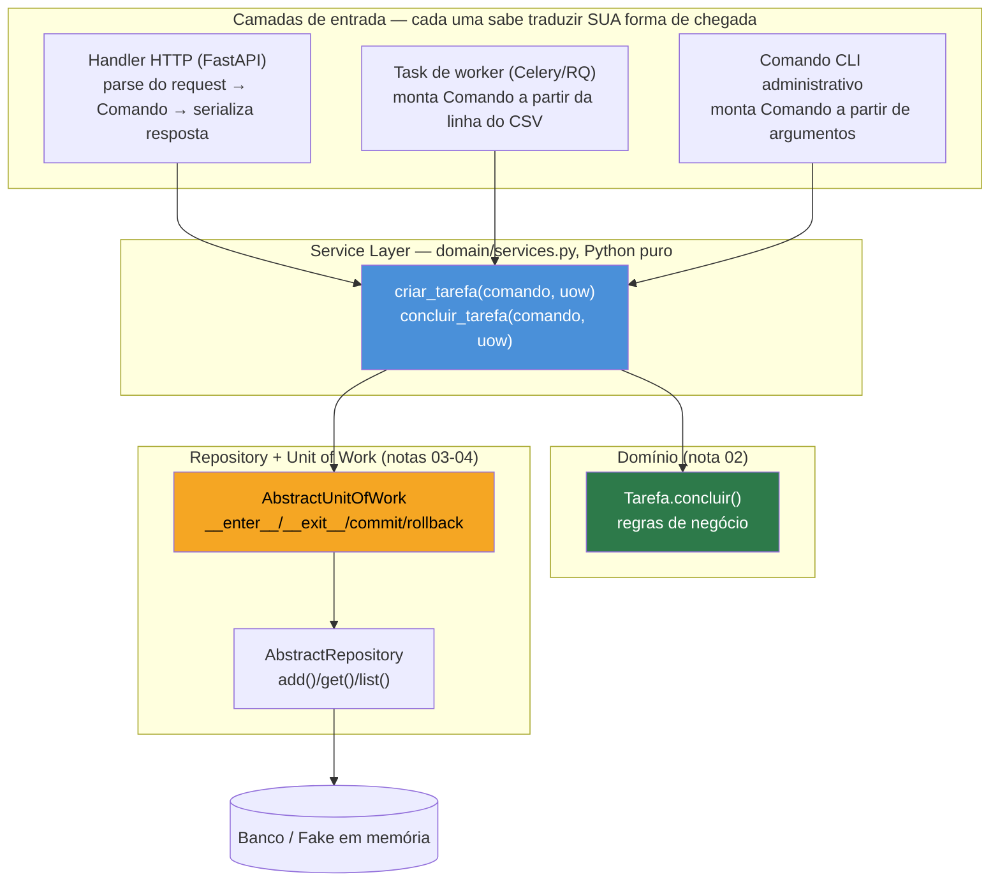
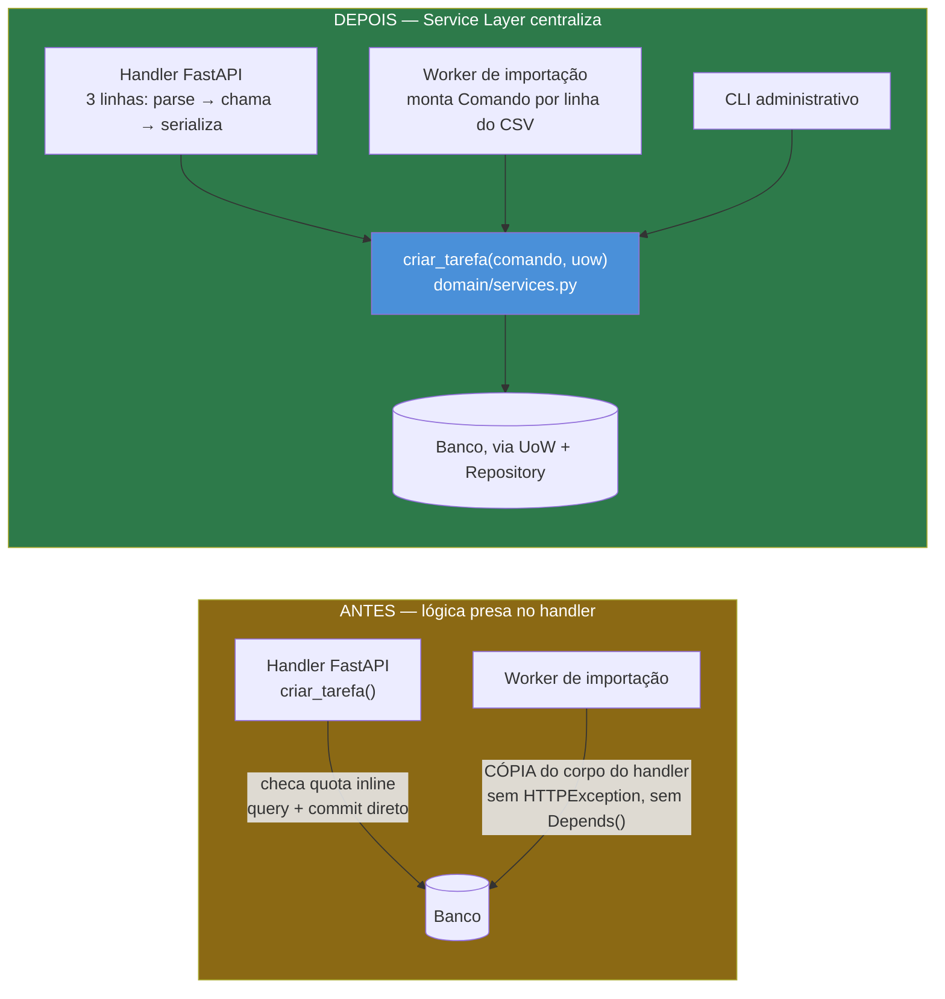

# Service Layer — orquestrando casos de uso

> [!abstract] TL;DR
> A API de Tarefas das capstones anteriores desta trilha cresce e ganha um segundo consumidor — um worker de fila que precisa criar tarefas em lote — e a única forma de reusar a lógica de criação é copiar o corpo inteiro do handler FastAPI, porque essa lógica está presa lá dentro, misturada com `Depends()`, `HTTPException` e `Session`. **Service Layer** é a camada que resolve isso: uma função de caso de uso — `criar_tarefa(comando, uow)` — que orquestra [[04 - Unit of Work — formalizando o padrão que já existia|Unit of Work]] (nota 04), [[03 - Repository pattern — abstraindo a persistência|Repository]] (nota 03) e as regras do [[02 - Domain modeling — separando a lógica de negócio do framework|domínio]] (nota 02), sem saber que FastAPI existe. O handler HTTP encolhe para três responsabilidades — parsear o request, chamar a função de caso de uso, serializar a resposta — e o `Comando` de entrada (um `dataclass` simples) formaliza a diferença entre três objetos que parecem a mesma coisa: o schema Pydantic (fala sobre HTTP), o Comando (fala sobre intenção), e a entidade de domínio (fala sobre regra de negócio). No fim, `criar_tarefa` vira testável com um `FakeUnitOfWork`, sem subir FastAPI nem banco — um teste que verifica REGRA DE NEGÓCIO em milissegundos, ao lado (não no lugar) do teste com `TestClient` que verifica a INTEGRAÇÃO inteira, que a [[03-Dominios/Tecnologia/Python/Testes/05 - Testando a API REST — TestClient e dependency overrides|nota 05 do Galho 12]] já construiu. Fonte primária: *Architecture Patterns with Python* (Percival & Gregory), capítulo "Service Layer".

## O worker que teve que copiar o handler inteiro

A API de Tarefas construída ao longo das capstones dos Galhos 10, 11 e 12 desta trilha tem, hoje, um único jeito de criar uma tarefa: uma requisição `POST /tarefas` processada pelo handler FastAPI. Isso funcionou bem até o produto pedir um recurso novo — importação em lote: o usuário sobe uma planilha CSV com cem linhas, e um worker de fila (Celery, RQ, o que for) processa o arquivo em background e cria uma tarefa para cada linha, sem que o cliente HTTP fique esperando cem requisições sequenciais.

O desenvolvedor que pega esse ticket abre `routers/tarefas.py` para entender como uma tarefa é criada hoje, e encontra isto:

```python
"""routers/tarefas.py — o handler ANTES desta nota: toda a lógica mora aqui dentro."""

from fastapi import APIRouter, Depends, HTTPException
from sqlalchemy import select
from sqlalchemy.orm import Session

from auth import get_current_user
from db import get_db
from models import Tarefa, Usuario
from schemas import TarefaCreate, TarefaRead

router = APIRouter(prefix="/tarefas", tags=["Tarefas"])

LIMITE_TAREFAS_ABERTAS = 20


@router.post("", response_model=TarefaRead, status_code=201)
def criar_tarefa(
    dados: TarefaCreate,
    usuario: Usuario = Depends(get_current_user),
    db: Session = Depends(get_db),
):
    tarefas_abertas = db.scalars(
        select(Tarefa).where(
            Tarefa.usuario_id == usuario.id,
            Tarefa.concluida.is_(False),
        )
    ).all()
    if len(tarefas_abertas) >= LIMITE_TAREFAS_ABERTAS:
        raise HTTPException(
            422, detail=f"Limite de {LIMITE_TAREFAS_ABERTAS} tarefas abertas atingido"
        )

    tarefa = Tarefa(usuario_id=usuario.id, titulo=dados.titulo)
    db.add(tarefa)
    db.commit()
    db.refresh(tarefa)
    return tarefa
```

Não é um handler absurdo — é exatamente o tipo de código que as capstones dos Galhos 10 e 11 desta trilha construíram, um passo de cada vez, e que funcionou em produção sem incidente nenhum. Mas repare no que está entrelaçado numa função só: **checagem de quota** (uma regra de negócio: nenhum usuário pode ter mais de 20 tarefas abertas simultaneamente), **acesso a dados** (`db.scalars(select(...))`, `db.add()`, `db.commit()`), e **tradução HTTP** (`HTTPException`, `response_model`, `Depends()`). As três coisas vivem juntas porque nunca houve motivo para separá-las — até agora.

O desenvolvedor do worker de importação em lote olha para essa função e enfrenta um dilema real: `criar_tarefa` não pode ser chamada diretamente do worker, porque ela é uma função de rota — depende de `Depends(get_current_user)` resolvendo um token JWT de uma requisição HTTP que não existe (o worker roda em background, sem requisição nenhuma por trás), e levanta `HTTPException`, uma classe que só faz sentido dentro do ciclo de vida de uma resposta HTTP que o Starlette sabe capturar. Chamar essa função de dentro de uma task Celery levantaria uma exceção que ninguém ali saberia tratar.

> [!bug] O que está quebrado, em uma frase
> A regra "no máximo 20 tarefas abertas por usuário" e a mecânica de "como persistir uma tarefa nova" nunca existiram como fatos sobre o *caso de uso* "criar uma tarefa" — existiram como um `if`/`db.add()`/`db.commit()` dentro de uma função cuja assinatura só um handler FastAPI consegue satisfazer. Qualquer código que precise criar uma tarefa fora de uma requisição HTTP não tem para onde chamar — só para onde copiar.

A solução sob pressão de prazo, e a mais comum na prática, é exatamente essa: copiar o corpo da função, tirar o `Depends()` e o `HTTPException`, e colar dentro da task do worker.

```python
"""worker/importar_tarefas_csv.py — escrito copiando o corpo de criar_tarefa(), sem o Depends()."""

import csv

from sqlalchemy import select
from sqlalchemy.orm import Session

from models import Tarefa

LIMITE_TAREFAS_ABERTAS = 20  # duplicado — ninguém garante que os dois "20" continuam iguais


def importar_tarefas_csv(db: Session, usuario_id: int, caminho_csv: str) -> list[Tarefa]:
    tarefas_criadas = []
    with open(caminho_csv, newline="", encoding="utf-8") as arquivo:
        for linha in csv.DictReader(arquivo):
            tarefas_abertas = db.scalars(
                select(Tarefa).where(
                    Tarefa.usuario_id == usuario_id,
                    Tarefa.concluida.is_(False),
                )
            ).all()
            if len(tarefas_abertas) >= LIMITE_TAREFAS_ABERTAS:
                continue  # decisão silenciosa e DIFERENTE da do handler, que devolvia 422

            tarefa = Tarefa(usuario_id=usuario_id, titulo=linha["titulo"])
            db.add(tarefa)
            db.commit()
            tarefas_criadas.append(tarefa)
    return tarefas_criadas
```

O código funciona — mas repare em dois problemas que a cópia introduziu silenciosamente, nenhum deles intencional. Primeiro, `LIMITE_TAREFAS_ABERTAS = 20` agora existe em dois arquivos; se o produto decidir subir o limite para 30, alguém precisa lembrar de mudar os dois lugares — o mesmo padrão estrutural do bug de abertura da [[02 - Domain modeling — separando a lógica de negócio do framework|nota 02 deste galho]]. Segundo, e mais sutil: quando o limite é atingido, o handler HTTP devolve um erro explícito (`422`) para o usuário saber que algo não foi criado; o worker, copiado sem essa parte fazer sentido num contexto sem cliente HTTP esperando resposta, simplesmente pula a linha (`continue`) — uma decisão de negócio *diferente* da do handler, tomada por acidente, porque ninguém decidiu deliberadamente que os dois caminhos deveriam se comportar diferente ali.

> [!question]- Por que não simplesmente extrair `criar_tarefa` numa função auxiliar que os dois chamam?
> Extrair uma função auxiliar resolve o sintoma de hoje, mas a pergunta certa é *o que* essa função auxiliar deveria saber. Se ela ainda receber uma `Session` do SQLAlchemy como parâmetro, ela continua acoplada à mecânica de persistência — testá-la exige banco (real ou em memória), e trocar de ORM no futuro exige reescrevê-la. Se ela ainda levantar `HTTPException`, ela continua acoplada ao FastAPI, e o worker ainda precisa capturar uma exceção que não faz sentido fora de uma resposta HTTP. O problema não é "código duplicado" isoladamente — é que a função que deveria representar *o caso de uso* "criar uma tarefa" está desenhada para um único chamador (o handler), não para qualquer chamador. Service Layer é a resposta a essa pergunta mais funda: uma função de caso de uso que não sabe *quem* a está chamando — handler, worker, CLI, teste — porque sua assinatura não depende de nenhum deles.

## O que é: uma função por caso de uso, entre o handler e o domínio

Percival e Gregory, em *Architecture Patterns with Python*, chamam essa camada de **Service Layer**: um conjunto de funções, uma por caso de uso do sistema, que orquestram o que já existe — [[02 - Domain modeling — separando a lógica de negócio do framework|entidades de domínio]] e suas regras, [[03 - Repository pattern — abstraindo a persistência|Repositories]] para acessar dados, [[04 - Unit of Work — formalizando o padrão que já existia|Unit of Work]] para agrupar tudo numa transação atômica — sem, ela mesma, saber nada sobre HTTP, sobre `Session` do SQLAlchemy diretamente, ou sobre qualquer framework de entrada específico.



A seta importante neste diagrama é a que sai de cada camada de entrada e converge sempre no mesmo retângulo azul: `criar_tarefa` e `concluir_tarefa` não sabem, e não precisam saber, se quem as chamou foi um handler HTTP resolvendo um `POST`, uma task de worker processando uma linha de CSV, ou um comando de CLI rodado por um administrador. Cada camada de entrada tem sua própria responsabilidade de tradução — "como uma requisição HTTP vira uma intenção de negócio", "como uma linha de CSV vira uma intenção de negócio" — mas a partir do momento em que essa intenção está montada, o caminho é único.

## O Comando: um DTO que representa a intenção, não o transporte nem a regra

Antes de mostrar `criar_tarefa` implementada, vale nomear a peça que amarra a entrada de qualquer caso de uso: o **Comando** (ou *Command*, no vocabulário do livro-fonte deste galho — sem relação com o padrão GoF Command discutido na [[01 - Por que GoF clássico é menos necessário em Python|nota 01 deste galho]], embora o nome seja emprestado da mesma família de ideias). É um objeto simples — aqui, um `dataclass` congelado — que representa **a intenção de executar um caso de uso**, com só os dados que esse caso de uso precisa para decidir o que fazer.

```python
"""domain/commands.py — Comandos: Python puro, sem Pydantic, sem SQLAlchemy."""

from dataclasses import dataclass


@dataclass(frozen=True)
class CriarTarefaComando:
    usuario_id: int
    titulo: str


@dataclass(frozen=True)
class ConcluirTarefaComando:
    usuario_id: int
    tarefa_id: int
```

A tentação natural, ao ver `CriarTarefaComando(usuario_id, titulo)` ao lado de `TarefaCreate(titulo)` (o schema Pydantic da [[03-Dominios/Tecnologia/Python/Web e APIs REST/03 - Validação e serialização com Pydantic|nota 03 do Galho 10]]) e de `Tarefa(id, usuario_id, titulo, concluida)` (a entidade de domínio da nota 02), é perguntar: por que três classes diferentes para "dados parecidos"? A resposta é que os três objetos, apesar de compartilharem campos, respondem a perguntas diferentes — e confundi-los é o que gera o tipo de acoplamento que abriu esta nota.

| Objeto | Pergunta que responde | Sabe sobre | Onde vive |
|---|---|---|---|
| `TarefaCreate` (Pydantic) | "O JSON que chegou pela rede é válido?" | Serialização, validação de formato, mensagens de erro HTTP | `schemas.py`, camada de API ([[03-Dominios/Tecnologia/Python/Web e APIs REST/03 - Validação e serialização com Pydantic\|Galho 10, nota 03]]) |
| `CriarTarefaComando` (dataclass) | "Qual é a intenção que este caso de uso deve executar?" | Nada de framework — só os dados que a Service Layer precisa para decidir | `domain/commands.py`, fronteira entre entrada e Service Layer |
| `Tarefa` (dataclass de domínio) | "O que é uma tarefa, e o que ela pode ou não fazer?" | Regras de negócio (`concluir()`, invariantes) | `domain/tarefa.py`, camada de domínio ([[02 - Domain modeling — separando a lógica de negócio do framework\|nota 02 deste galho]]) |

`TarefaCreate` não pode ser usado como Comando porque ele não carrega `usuario_id` — de propósito, como a nota 03 do Galho 10 já explicou, para que nenhum cliente HTTP consiga forjar o dono de uma tarefa. O `usuario_id` entra no Comando vindo de outro lugar: de `Depends(get_current_user)` no handler, de um argumento de linha de comando no CLI, de uma coluna da planilha no worker — cada camada de entrada monta o Comando com os dados que **ela** validou como confiáveis, e é só depois de montado que o resto do sistema para de se importar com a origem.

`Tarefa` (a entidade) não pode ser usada como Comando porque ela representa um objeto que **já existe** ou está prestes a existir com identidade e estado — `id`, `concluida`, possivelmente `subtarefas` carregadas. Um Comando não é uma tarefa; é uma instrução para criar ou mudar uma. Misturar os dois — por exemplo, passar um `Tarefa` parcialmente preenchido como se fosse um Comando — tende a produzir bugs sutis: campos que "não deveriam" estar setados ainda (um `id` que não existe até o Repository gerar), ou métodos de domínio (`concluir()`) chamados num objeto que ainda não tem as `subtarefas` carregadas do banco.

> [!question]- Vale a pena essa terceira classe para um sistema pequeno?
> Depende exatamente do mesmo critério que a [[03 - Repository pattern — abstraindo a persistência|nota 03 deste galho]] já aplicou ao Repository: o Comando compensa quando existe mais de um caminho de entrada convergindo para o mesmo caso de uso, ou quando vai existir. Numa API que só é chamada por um único cliente HTTP, e nunca vai ganhar worker, CLI ou segundo consumidor, passar os parâmetros soltos direto para a função de Service Layer (`criar_tarefa(usuario_id, titulo, uow)`, sem um `dataclass` envolvendo os dois) funciona igualmente bem e evita uma classe a mais. O Comando começa a valer a pena no momento em que o caso de uso ganha parâmetros o bastante para a assinatura da função ficar difícil de ler, ou no momento em que — como no incidente de abertura desta nota — mais de uma camada de entrada precisa montar a mesma intenção, e ter um tipo nomeado (`CriarTarefaComando`, não uma tupla anônima de argumentos) documenta explicitamente "isto é o contrato de entrada deste caso de uso", legível tanto por quem escreve o handler quanto por quem escreve o worker.

## `criar_tarefa`: a função de caso de uso

Com o Comando definido, a Service Layer em si é uma função Python comum — sem decorator de rota, sem `Depends()`, sem `HTTPException` — que recebe o Comando e um `AbstractUnitOfWork` ([[04 - Unit of Work — formalizando o padrão que já existia|nota 04 deste galho]]), e devolve um resultado simples (aqui, a própria entidade de domínio criada).

```python
"""domain/services.py — Service Layer: Python puro, nem fastapi nem sqlalchemy importados."""

from domain.commands import CriarTarefaComando
from domain.tarefa import Tarefa
from domain.unit_of_work import AbstractUnitOfWork

LIMITE_TAREFAS_ABERTAS = 20


class LimiteDeTarefasAbertasExcedidoError(Exception):
    def __init__(self, usuario_id: int, limite: int) -> None:
        self.usuario_id = usuario_id
        self.limite = limite
        super().__init__(f"Usuário {usuario_id} já tem {limite} tarefas abertas")


def criar_tarefa(comando: CriarTarefaComando, uow: AbstractUnitOfWork) -> Tarefa:
    with uow:
        tarefas_abertas = [
            t for t in uow.tarefas.list(comando.usuario_id) if not t.concluida
        ]
        if len(tarefas_abertas) >= LIMITE_TAREFAS_ABERTAS:
            raise LimiteDeTarefasAbertasExcedidoError(comando.usuario_id, LIMITE_TAREFAS_ABERTAS)

        tarefa = Tarefa(id=None, usuario_id=comando.usuario_id, titulo=comando.titulo)
        uow.tarefas.add(tarefa)
        uow.commit()
        return tarefa
```

Vale nomear, linha a linha, o que mudou em relação ao handler "gordo" do início da nota. `LIMITE_TAREFAS_ABERTAS` agora existe em **um** lugar — não porque o valor mudou, mas porque a regra "no máximo 20 tarefas abertas" deixou de ser um `if` dentro de uma função HTTP e virou um fato sobre o caso de uso "criar tarefa", igual à checagem de subtarefas pendentes que a nota 02 já extraiu para dentro de `Tarefa.concluir()`. A diferença entre essa regra e a de `concluir()` é didaticamente relevante: "não pode ter subtarefa pendente" é uma invariante de **uma única** `Tarefa` (o próprio objeto sabe decidir isso, olhando só para si mesmo e suas subtarefas já carregadas) — por isso vive dentro da entidade. "Não pode ter mais de 20 tarefas abertas" é uma invariante que depende de **consultar outras tarefas do mesmo usuário** — nenhuma entidade `Tarefa` isolada tem essa informação; só o Repository, através de `uow.tarefas.list(...)`, sabe. Por isso essa regra não pode viver dentro de `Tarefa` — ela precisa de uma camada que tenha acesso ao Repository, e é exatamente esse o papel que a Service Layer cumpre e que o domínio puro, sozinho, não consegue.

`with uow:` abre o bloco de Unit of Work — a nota 04 deste galho formaliza o que esse `with` faz por baixo (abre uma `Session`, monta o(s) Repository(s) associado(s)), mas o ponto central para esta nota é que `criar_tarefa` nunca menciona `Session`, nunca chama `db.scalars(select(...))`, nunca chama `db.commit()` diretamente — tudo isso está por trás de `uow.tarefas.list(...)` e `uow.commit()`, exatamente as duas abstrações que as notas 03 e 04 já construíram. `uow.commit()` só é chamado depois que a regra de negócio permitiu a operação — se `LimiteDeTarefasAbertasExcedidoError` for levantada antes, a transação nunca é commitada, e o `__exit__` da Unit of Work (coberto na nota 04) garante o `rollback()` implícito de qualquer estado parcial.

E o resultado de `criar_tarefa` não é um `Response` HTTP, nem um dicionário formatado para JSON — é a própria entidade `Tarefa`, o mesmo objeto de domínio que a nota 02 definiu. Quem decide como esse objeto vira uma resposta HTTP (código de status, `response_model`, formato de erro) é uma responsabilidade de outra camada — a que volta a aparecer, agora bem mais magra, na próxima seção.

## `concluir_tarefa`: reaproveitando o que a nota 02 já resolveu

O segundo caso de uso deste galho — concluir uma tarefa, respeitando a regra "não conclui com subtarefa pendente" que a [[02 - Domain modeling — separando a lógica de negócio do framework|nota 02]] já extraiu para dentro de `Tarefa.concluir()` — mostra o contraste inverso: uma regra que **é** invariante de uma única entidade, e por isso a Service Layer só precisa buscar o objeto certo e delegar.

```python
"""domain/services.py — segundo caso de uso, reaproveitando Tarefa.concluir() da nota 02."""

from domain.commands import ConcluirTarefaComando
from domain.exceptions import TarefaNaoEncontrada, TarefaNaoPertenceAoUsuario
from domain.tarefa import Tarefa, TarefaComSubtarefasPendentesError
from domain.unit_of_work import AbstractUnitOfWork


def concluir_tarefa(comando: ConcluirTarefaComando, uow: AbstractUnitOfWork) -> Tarefa:
    with uow:
        tarefa = uow.tarefas.get(comando.tarefa_id)
        if tarefa is None:
            raise TarefaNaoEncontrada(comando.tarefa_id)
        if tarefa.usuario_id != comando.usuario_id:
            raise TarefaNaoPertenceAoUsuario(comando.tarefa_id, comando.usuario_id)

        tarefa.concluir()  # a regra de subtarefas pendentes mora na entidade (nota 02), não aqui

        uow.tarefas.add(tarefa)
        uow.commit()
        return tarefa
```

`TarefaComSubtarefasPendentesError` — a exceção que `Tarefa.concluir()` levanta — não é capturada aqui. `concluir_tarefa` deixa a exceção subir crua, exatamente como o handler da [[02 - Domain modeling — separando a lógica de negócio do framework|nota 02]] já fazia com o `HTTPException` traduzido num nível acima — só que agora o "nível acima" não é mais o próprio handler, é o handler HTTP magro que a próxima seção mostra, ou o job de fechamento por prazo vencido, que já apareceu na nota 02 tratando essa mesma exceção à sua maneira (pulando a tarefa em vez de forçar a conclusão). A Service Layer decide **o que verificar antes de delegar ao domínio** — existência, posse — mas não decide **como** um erro vira resposta HTTP; essa fronteira continua exatamente onde a nota 02 e a capstone do Galho 10 já a desenharam.

## O handler, depois: três responsabilidades, nenhuma delas é regra de negócio

Com `criar_tarefa` e `concluir_tarefa` existindo como funções de Service Layer, o handler HTTP encolhe para o que ele deveria sempre ter sido: parsear o request num Comando, chamar o caso de uso, serializar o resultado numa resposta.

```python
"""routers/tarefas.py — o handler DEPOIS: magro, sem lógica de negócio."""

from fastapi import APIRouter, Depends

from auth import get_current_user
from domain.commands import CriarTarefaComando
from domain.services import criar_tarefa
from domain.unit_of_work import AbstractUnitOfWork
from models import Usuario
from schemas import TarefaCreate, TarefaRead
from uow_provider import get_uow  # Depends() que devolve uma SqlAlchemyUnitOfWork — nota 04

router = APIRouter(prefix="/tarefas", tags=["Tarefas"])


@router.post("", response_model=TarefaRead, status_code=201)
def criar_tarefa_endpoint(
    dados: TarefaCreate,
    usuario: Usuario = Depends(get_current_user),
    uow: AbstractUnitOfWork = Depends(get_uow),
):
    comando = CriarTarefaComando(usuario_id=usuario.id, titulo=dados.titulo)
    return criar_tarefa(comando, uow)
```

Três linhas de corpo, e nenhuma delas é `if`, `select()`, `commit()` ou `HTTPException`. `LimiteDeTarefasAbertasExcedidoError`, se levantada dentro de `criar_tarefa`, sobe crua até um `@app.exception_handler(LimiteDeTarefasAbertasExcedidoError)` registrado uma vez em `main.py` — o mesmo mecanismo de tradução centralizada que a [[02 - Domain modeling — separando a lógica de negócio do framework|nota 02]] e a [[03-Dominios/Tecnologia/Python/Web e APIs REST/09 - Capstone — uma API REST completa de ponta a ponta|capstone do Galho 10]] já cravaram para `TarefaComSubtarefasPendentesError` e `TarefaNaoEncontrada`. O handler não precisa de `try/except` porque a tradução de erro é uma responsabilidade de outra camada, exatamente como já era antes desta nota — o que mudou não é *onde* o erro é traduzido, é *onde* o erro é *decidido*.

E o worker de importação em lote, que abriu a nota copiando o corpo inteiro do handler, agora chama a mesma função de caso de uso que o handler chama:

```python
"""worker/importar_tarefas_csv.py — DEPOIS: chama o mesmo caso de uso que o handler."""

import csv

from domain.commands import CriarTarefaComando
from domain.services import criar_tarefa, LimiteDeTarefasAbertasExcedidoError
from domain.unit_of_work import AbstractUnitOfWork


def importar_tarefas_csv(uow: AbstractUnitOfWork, usuario_id: int, caminho_csv: str) -> list:
    resultado = []
    with open(caminho_csv, newline="", encoding="utf-8") as arquivo:
        for linha in csv.DictReader(arquivo):
            comando = CriarTarefaComando(usuario_id=usuario_id, titulo=linha["titulo"])
            try:
                tarefa = criar_tarefa(comando, uow)
                resultado.append({"titulo": tarefa.titulo, "status": "criada"})
            except LimiteDeTarefasAbertasExcedidoError:
                # decisão do WORKER, explícita: linhas além do limite entram numa fila de revisão
                resultado.append({"titulo": linha["titulo"], "status": "adiada_por_limite"})
    return resultado
```

O worker não reimplementa a checagem de quota — ele chama `criar_tarefa`, recebe a mesma `LimiteDeTarefasAbertasExcedidoError` que o handler recebe, e decide (essa parte, sim, uma decisão legítima do worker) o que fazer quando o limite é atingido: marcar a linha como "adiada para revisão" em vez de simplesmente pular em silêncio, como a versão copiada do início da nota fazia sem essa decisão ter sido tomada por ninguém.



## Testando sem FastAPI, sem banco: `FakeUnitOfWork`

O ganho mais concreto de `criar_tarefa` não conhecer FastAPI é o mesmo que a [[02 - Domain modeling — separando a lógica de negócio do framework|nota 02]] já demonstrou para o domínio puro: testar essa função não exige subir nada. A [[03 - Repository pattern — abstraindo a persistência|nota 03 deste galho]] já construiu o `FakeRepository`; um `FakeUnitOfWork` só precisa envolvê-lo com o contrato mínimo que a [[04 - Unit of Work — formalizando o padrão que já existia|nota 04]] formaliza — `__enter__`/`__exit__`/`commit`/`rollback` — sem `Session`, sem `Engine`, sem conexão de rede nenhuma.

```python
"""tests/fakes.py — FakeUnitOfWork, envolvendo o FakeRepository da nota 03."""

from domain.tarefa import Tarefa
from domain.unit_of_work import AbstractUnitOfWork
from tests.fakes import FakeRepository  # da nota 03


class FakeUnitOfWork(AbstractUnitOfWork):
    def __init__(self, tarefas: list[Tarefa] | None = None) -> None:
        self.tarefas = FakeRepository(tarefas or [])
        self.commited = False

    def commit(self) -> None:
        self.commited = True

    def rollback(self) -> None:
        pass
```

E o teste da regra de quota, o próprio motivo de existir da checagem que este handler tinha entrelaçada, vira um teste que roda em milissegundos, sem mock nenhum:

```python
"""tests/test_criar_tarefa.py — testando a Service Layer, sem TestClient, sem banco."""

import pytest

from domain.commands import CriarTarefaComando
from domain.services import criar_tarefa, LimiteDeTarefasAbertasExcedidoError
from domain.tarefa import Tarefa
from tests.fakes import FakeUnitOfWork


def test_criar_tarefa_persiste_e_commita():
    uow = FakeUnitOfWork()
    comando = CriarTarefaComando(usuario_id=42, titulo="Revisar PR #482")

    tarefa = criar_tarefa(comando, uow)

    assert tarefa.titulo == "Revisar PR #482"
    assert tarefa.usuario_id == 42
    assert uow.commited is True
    assert uow.tarefas.get(tarefa.id) is not None  # a mudança realmente ficou no Fake


def test_criar_tarefa_recusa_acima_do_limite():
    tarefas_existentes = [
        Tarefa(id=i, usuario_id=42, titulo=f"Tarefa {i}", concluida=False)
        for i in range(1, 21)  # 20 tarefas abertas — já no limite
    ]
    uow = FakeUnitOfWork(tarefas_existentes)
    comando = CriarTarefaComando(usuario_id=42, titulo="Tarefa 21")

    with pytest.raises(LimiteDeTarefasAbertasExcedidoError):
        criar_tarefa(comando, uow)

    assert uow.commited is False  # a 21ª tarefa nunca foi persistida
    assert len(uow.tarefas.list(42)) == 20  # continua exatamente 20


def test_criar_tarefa_ignora_tarefas_concluidas_na_contagem_do_limite():
    tarefas_concluidas = [
        Tarefa(id=i, usuario_id=42, titulo=f"Tarefa {i}", concluida=True)
        for i in range(1, 21)  # 20 CONCLUÍDAS — não devem contar para o limite de abertas
    ]
    uow = FakeUnitOfWork(tarefas_concluidas)
    comando = CriarTarefaComando(usuario_id=42, titulo="Tarefa nova")

    tarefa = criar_tarefa(comando, uow)  # não levanta — todas as 20 já estão concluídas

    assert tarefa.titulo == "Tarefa nova"
```

Nenhum desses três testes sobe um `TestClient`, nenhum configura `app.dependency_overrides`, nenhum abre um `SQLite` em memória ou espera um `conftest.py` criar schema — a mesma economia que a nota 02 já descreveu para testar `Tarefa.concluir()` isolada, agora aplicada a um caso de uso inteiro, com Repository e Unit of Work no meio.

> [!tip] O terceiro teste é o que a regra "não testar só o caminho óbvio" pede
> `test_criar_tarefa_ignora_tarefas_concluidas_na_contagem_do_limite` não é redundante com o segundo teste — ele verifica explicitamente que a lista `[t for t in uow.tarefas.list(...) if not t.concluida]` dentro de `criar_tarefa` realmente filtra por `concluida`, não só conta o total. Um desenvolvedor apressado poderia escrever `len(uow.tarefas.list(comando.usuario_id)) >= LIMITE`, sem o filtro — passaria no primeiro e no segundo teste, e falharia silenciosamente em produção assim que um usuário com 20 tarefas *concluídas* tentasse criar uma tarefa nova legítima. Testes de Service Layer, por serem rápidos o bastante para escrever vários por caso de uso, tornam viável cobrir esse tipo de nuance sem hesitar sobre o "custo" de mais um teste.

### Contraste com `TestClient`: regra de negócio vs. integração fim a fim

A [[03-Dominios/Tecnologia/Python/Testes/05 - Testando a API REST — TestClient e dependency overrides|nota 05 do Galho 12]] já construiu, com código real, um teste completo do endpoint `POST /tarefas` usando `TestClient` e `app.dependency_overrides` — um SQLite em memória substituindo o Postgres real, um usuário fixo substituindo a decodificação de JWT. Vale nomear explicitamente o que cada estilo de teste prova, porque os dois continuam necessários — nenhum substitui o outro.

| | `FakeUnitOfWork` (esta nota) | `TestClient` + `dependency_overrides` (Galho 12, nota 05) |
|---|---|---|
| O que é exercitado | Só `criar_tarefa`/`concluir_tarefa` — a função de caso de uso isolada | A pilha inteira: roteamento, validação Pydantic, `Depends()`, Service Layer, exception handlers, serialização |
| O que prova | A regra de negócio está correta (quota, posse, subtarefas pendentes) | O *fio* entre HTTP e o caso de uso está montado corretamente — a rota certa chama a função certa, com o Comando montado certo, e o erro vira o status HTTP certo |
| Velocidade | Milissegundos — nenhuma pilha ASGI, nenhum banco, nenhum JWT | Rápido, mas mais lento — monta a aplicação FastAPI inteira, passa pela pilha de middleware/validação a cada requisição simulada |
| O que quebra o teste | Uma mudança na regra de negócio em si | Uma mudança na integração — rota renomeada, `response_model` errado, exception handler não registrado, Comando montado com campo trocado |
| Quantos testes por caso de uso | Muitos, sem custo — cada variação de regra (limite, subtarefas, posse) merece o seu | Poucos por endpoint — normalmente um "caminho feliz" e um ou dois cenários críticos (como o "usuário B tenta acessar recurso do usuário A" da nota 05 do Galho 12), porque cada teste é mais caro de escrever e rodar |

A régua prática que a [[02 - Domain modeling — separando a lógica de negócio do framework|nota 02]] já cravou para o andar de baixo da pirâmide de testes se repete aqui, um andar acima: a maior parte da cobertura de **regra de negócio** — o que é permitido, o que não é, sob quais condições — deveria viver em testes de Service Layer contra um Fake, porque são baratos o bastante para cobrir cada variação sem hesitação. `TestClient` continua indispensável, mas para uma responsabilidade diferente: provar que o fio entre a requisição HTTP real e a Service Layer está corretamente montado, não reexercitar cada combinação de regra de negócio que os testes de Service Layer já cobriram, mais rápido, um andar abaixo.

> [!warning] Um teste `TestClient` que reimplementa toda a matriz de regras de negócio é sintoma de Service Layer ausente ou mal testada
> Se a suíte de `TestClient` precisa simular "20 tarefas abertas, tenta criar a 21ª", "20 concluídas, tenta criar mais uma", "posse de outro usuário", "subtarefa pendente" — cada variação subindo a aplicação inteira, configurando overrides, montando JSON — é sinal de que essas regras não estão cobertas (ou nem existem) como testes de Service Layer isolados. A suíte de integração deveria poder assumir "a regra de negócio já está certa, testada em outro lugar, mais rápido" e focar em "o fio está montado" — não redescobrir a mesma cobertura, pagando o custo de subir a pilha inteira a cada variação.

## Armadilhas comuns

> [!warning] Service Layer que ainda importa `fastapi` ou `sqlalchemy`
> **O que acontece:** sob pressão de prazo, alguém importa `HTTPException` dentro de `domain/services.py` "só para essa exceção específica", ou passa uma `Session` do SQLAlchemy direto para `criar_tarefa` em vez de um `AbstractUnitOfWork`, "porque é mais direto". **Por quê:** no momento em que a Service Layer importa qualquer um dos dois, ela deixa de ser chamável de um contexto que não tenha esse framework disponível — o worker de fila do incidente de abertura volta a não conseguir chamar `criar_tarefa` sem reimportar dependências que não fazem sentido fora de uma requisição HTTP, o mesmo problema que esta nota resolveu. **Como evitar:** o teste decisivo é literal — `grep -r "import fastapi\|import sqlalchemy" domain/services.py` deveria sempre devolver vazio. Qualquer necessidade de "só essa exceção específica" do FastAPI é sinal de que a tradução pertence à camada de handler, não à Service Layer.

> [!warning] Comando genérico demais, virando um `dict` disfarçado
> **O que acontece:** em vez de um `CriarTarefaComando` e um `ConcluirTarefaComando` distintos, alguém cria um único `TarefaComando(dict)` com todos os campos possíveis opcionais, reaproveitado para todos os casos de uso. **Por quê:** um Comando genérico perde a garantia mais valiosa de ser um `dataclass` tipado — o type checker (e quem lê o código) deixa de saber, só olhando a assinatura de `criar_tarefa`, quais campos de fato importam para aquele caso de uso específico; o Comando vira tão flexível quanto um `**kwargs`, reintroduzindo o mesmo problema que a [[03 - Repository pattern — abstraindo a persistência|nota 03 deste galho]] já nomeou para um Repository `find(**filtros)` genérico demais. **Como evitar:** um `dataclass` nomeado por caso de uso (`CriarTarefaComando`, `ConcluirTarefaComando`), cada um só com os campos que aquele caso de uso específico precisa — mais classes pequenas, não uma classe grande e vaga.

> [!warning] Handler que ainda decide algo além de parse/chamada/serialização
> **O que acontece:** o handler "magro" chama `criar_tarefa`, mas antes disso faz uma checagem extra — por exemplo, `if usuario.plano == "gratuito" and len(dados.titulo) > 50: raise HTTPException(...)` — porque "é só uma checagem pequena, não vale a pena criar um caso de uso separado para ela". **Por quê:** toda checagem "pequena" que entra no handler é uma regra de negócio nova vivendo fora da Service Layer — e o worker de importação em lote, que não passa pelo handler, nunca vai aplicar essa checagem, reabrindo exatamente a fenda que esta nota fechou. **Como evitar:** a régua de bolso é "o handler decide alguma coisa sobre o NEGÓCIO, ou só sobre a FORMA da requisição?". Validação de formato (tamanho de string, tipo de campo) já é responsabilidade do Pydantic, coberta na nota 03 do Galho 10; qualquer decisão que dependa do estado do domínio (plano do usuário, quantidade de tarefas, dono do recurso) pertence a um Comando e a uma Service Layer, mesmo que pareça pequena demais para "merecer" a formalidade.

## A ressalva honesta: nem todo endpoint precisa de Service Layer

Do mesmo jeito que a nota 03 avisou sobre o Repository, vale nomear quando essa camada é peso morto. Um endpoint de leitura simples — `GET /tarefas/{id}`, sem regra de negócio nenhuma além de "busca e devolve, 404 se não existir" — não ganha muito ao ser envolvido numa função de Service Layer separada; buscar direto via `uow.tarefas.get(id)` dentro do próprio handler (ainda usando a Unit of Work, para manter a fronteira com a persistência), sem uma camada extra de indireção, é perfeitamente razoável. A Service Layer compensa quando um caso de uso **decide** algo — aplica uma regra, orquestra mais de um Repository, precisa ser chamado de mais de um lugar — não simplesmente para satisfazer uma convenção de "todo endpoint deveria ter uma função de serviço correspondente".

## Em entrevista

A pergunta "como você organiza a lógica de negócio de uma API para que ela não fique presa aos handlers?" testa diretamente se o candidato distingue orquestração de transporte.

> "I put one function per use case in a Service Layer — plain Python, no framework imports, that takes a Command object and a Unit of Work, and returns a plain domain object. The Command is a small dataclass representing the *intent* — just the fields that use case actually needs — deliberately separate from the API's Pydantic schema, which is about HTTP serialization, and separate from the domain entity, which is about business rules and has its own lifecycle. The HTTP handler shrinks to three responsibilities: parse the request into a Command, call the service function, serialize whatever comes back — no business logic, no direct session access. That split pays off the moment a second caller shows up — a background worker, an admin script — because it can build the same Command and call the same function, instead of copying the handler's body and hoping the copy stays in sync with the original. It also makes testing cheap: I can write dozens of tests against a Fake Unit of Work, covering every business rule variation in milliseconds, and reserve the slower end-to-end tests — spinning up the actual app — for verifying the wiring is correct, not for re-testing business logic that's already covered faster elsewhere."

> [!question]- O entrevistador insiste: "isso não é indireção demais para uma API simples?"
> A resposta honesta reconhece o mesmo trade-off que as notas 03 e 04 deste galho já nomearam: para uma API pequena, com um único consumidor e regras de negócio triviais, uma função de Service Layer por endpoint é overhead sem retorno correspondente — chamar `Session`/Repository direto do handler, sem Comando nem função de caso de uso separada, é perfeitamente razoável. O sinal que justifica a Service Layer não é "a API é grande", é **"existe mais de um caminho de entrada convergindo para a mesma regra, ou vai existir, ou a regra é complexa/testada com frequência o bastante para valer a pena isolar do framework"**. Reconhecer esse limiar, nomeando o custo real da indireção, é o que separa julgamento arquitetural sênior de aplicar um padrão por reflexo.

## How to explain in English

> A fat HTTP handler works fine right up until a second caller needs the same logic — a background worker, an admin script, a second API version — and discovers there's no function to call, only a function body to copy. Service Layer solves that by pulling one function per use case out of the handler: plain Python, taking a Command object (a small dataclass describing intent, not a database row or an HTTP payload) and a Unit of Work, orchestrating repositories and domain rules, and returning a plain domain object. The Command matters as a distinct type because it answers a different question than the API's validation schema or the domain entity do — "what is this use case being asked to do" versus "is this JSON well-formed" versus "what are the rules this entity must obey" — even when the three objects happen to carry overlapping fields. Once the use case lives in the Service Layer, the HTTP handler's job collapses to three lines: parse the request into a Command, call the service function, serialize whatever comes back — and any other caller, present or future, gets the exact same guarantee by building the same Command, without re-deriving or copying the business rule. The payoff shows up hardest in testing: a Fake Unit of Work makes the use case testable in milliseconds, with no app server and no database, which means business-rule coverage — every edge case of a quota check, an ownership check, an invariant — can be cheap and exhaustive, while slower end-to-end tests through a real test client are reserved for proving the wiring between HTTP and the use case is correct, not for re-verifying logic already covered faster elsewhere.

| PT-BR | English |
|---|---|
| Service Layer / camada de serviço | Service Layer |
| caso de uso | use case |
| Comando (DTO de intenção) | Command (intent DTO) |
| handler magro / gordo | thin / fat handler |
| orquestração | orchestration |
| regra de negócio | business rule |
| caminho de entrada | entry point / caller |
| teste de integração fim a fim | end-to-end integration test |
| fio (entre camadas) | wiring |

## Síntese: o que cada camada faz, e não faz

O handler "gordo" do início desta nota misturava três responsabilidades numa função só: decidir uma regra de negócio (quota de tarefas abertas), acessar dados diretamente (`Session`), e traduzir isso para HTTP (`HTTPException`, `response_model`). O refactor não removeu nenhuma dessas três responsabilidades — só as separou em camadas que cada uma sabe fazer uma coisa e não sabe fazer as outras:

- **O handler HTTP** sabe traduzir requisição em Comando e resultado em resposta — não decide regra de negócio nenhuma.
- **O Comando** representa a intenção de um caso de uso — não é o schema HTTP (que fala de transporte) nem a entidade de domínio (que fala de regra).
- **A Service Layer** orquestra Repository, Unit of Work e domínio para executar um caso de uso — não sabe que HTTP existe.
- **O domínio** ([[02 - Domain modeling — separando a lógica de negócio do framework|nota 02]]) decide as invariantes de uma única entidade — não sabe consultar outras entidades nem persistir nada.
- **O Repository** ([[03 - Repository pattern — abstraindo a persistência|nota 03]]) traduz entre entidade e modelo persistido — não decide regra de negócio.
- **A Unit of Work** ([[04 - Unit of Work — formalizando o padrão que já existia|nota 04]]) garante que um caso de uso persiste tudo atomicamente ou nada — não decide o que persistir.

O worker de importação em lote que abriu esta nota, hoje, não copia mais nada — monta um `CriarTarefaComando` por linha do CSV e chama a mesma `criar_tarefa` que o handler chama, herdando automaticamente a regra de quota, sem reimplementá-la e sem correr o risco de divergir dela silenciosamente. O que esta nota deixou em aberto — o contrato exato de `AbstractUnitOfWork` que `with uow:` está usando, e por que ele formaliza o que a `Session` já fazia informalmente — é o assunto que a [[04 - Unit of Work — formalizando o padrão que já existia|nota 04 deste galho]] cobre em profundidade; e como essas camadas se encaixam num vocabulário arquitetural mais amplo (Ports and Adapters) é o que a [[index|nota 07 deste galho]] desenvolve a seguir.

## O que vem a seguir

- **[[07 - Arquitetura hexagonal e Ports and Adapters em Python|Galho 13 — nota 07, Arquitetura hexagonal e Ports and Adapters]]** (próxima) — nomeia formalmente as camadas que esta nota já desenhou informalmente: `AbstractRepository`/`AbstractUnitOfWork` como Ports, `SqlAlchemyTarefaRepository`/FastAPI como Adapters.
- [[04 - Unit of Work — formalizando o padrão que já existia|Galho 13 — nota 04, Unit of Work]] — o contrato `__enter__`/`__exit__`/`commit`/`rollback` que `criar_tarefa` e `concluir_tarefa` consomem nesta nota.
- [[03 - Repository pattern — abstraindo a persistência|Galho 13 — nota 03, Repository pattern]] — `AbstractRepository`/`FakeRepository`, a base sobre a qual `FakeUnitOfWork` desta nota foi construído.
- [[02 - Domain modeling — separando a lógica de negócio do framework|Galho 13 — nota 02, Domain modeling]] — `Tarefa`/`Tarefa.concluir()`, orquestrada (não reimplementada) por `concluir_tarefa` nesta nota.
- [[03-Dominios/Tecnologia/Python/Web e APIs REST/09 - Capstone — uma API REST completa de ponta a ponta|Galho 10 — Capstone]] — o handler original que esta nota refatorou de gordo para magro.
- [[03-Dominios/Tecnologia/Python/Testes/05 - Testando a API REST — TestClient e dependency overrides|Galho 12 — nota 05, TestClient e dependency overrides]] — o contraste de testabilidade desenvolvido nesta nota: Service Layer testa regra de negócio rápido, `TestClient` testa integração fim a fim.
- [[index|Arquitetura e Design Patterns (Galho 13)]] — MOC deste galho.
- [[03-Dominios/Tecnologia/Python/index|Trilha Python]] — MOC da trilha.

## Fontes

- Percival, Harry; Gregory, Bob. *Architecture Patterns with Python: Enabling Test-Driven Development, Domain-Driven Design, and Event-Driven Microservices*. O'Reilly Media, 2020. Capítulo "Our First Use Case: Flask API and Service Layer". https://www.cosmicpython.com/book/chapter_04_service_layer.html (acessado em 2026-07-12) — fonte primária desta nota: a função de caso de uso orquestrando Repository/Unit of Work, e a distinção entre handler e Service Layer.
- Percival, Harry; Gregory, Bob. *Architecture Patterns with Python* — capítulo "Command and Command Handler" (parte II, event-driven). https://www.cosmicpython.com/book/chapter_08_events_and_message_bus.html (acessado em 2026-07-12) — vocabulário de Comando como DTO de intenção, referência para a distinção Comando/schema/entidade desta nota.
- FastAPI. *Bigger Applications — Multiple Files*. fastapi.tiangolo.com/tutorial/bigger-applications/. https://fastapi.tiangolo.com/tutorial/bigger-applications/ (acessado em 2026-07-12) — organização de `APIRouter` consumida pelo handler magro desta nota, já aplicada na capstone do Galho 10.
- [[02 - Domain modeling — separando a lógica de negócio do framework|Domain modeling — separando a lógica de negócio do framework]] — origem de `Tarefa`/`Tarefa.concluir()`, orquestrados sem repetição nesta nota.
- [[03 - Repository pattern — abstraindo a persistência|Repository pattern — abstraindo a persistência]] — origem de `AbstractRepository`/`FakeRepository`, consumidos sem repetição nesta nota.
- [[03-Dominios/Tecnologia/Python/Testes/05 - Testando a API REST — TestClient e dependency overrides|Testando a API REST — TestClient e dependency overrides]] — Galho 12, o contraste de testabilidade desenvolvido nesta nota.
- [[03-Dominios/Tecnologia/Python/Web e APIs REST/09 - Capstone — uma API REST completa de ponta a ponta|Capstone — uma API REST completa de ponta a ponta]] — Galho 10, origem do handler "gordo" refatorado nesta nota.

Consultado em 2026-07-12.
