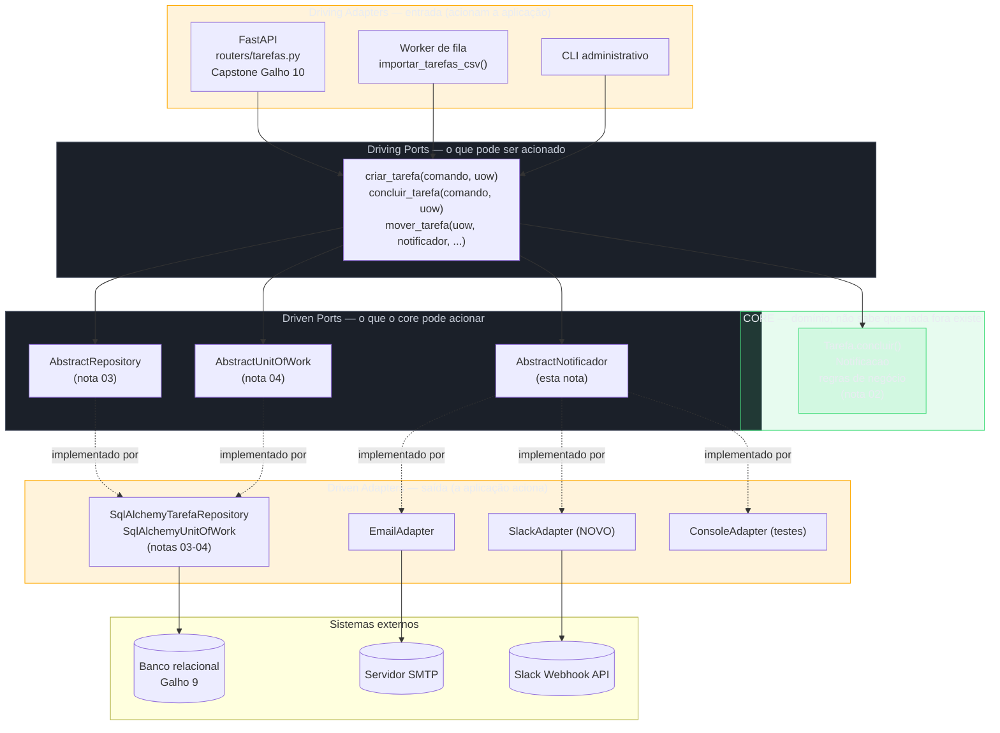
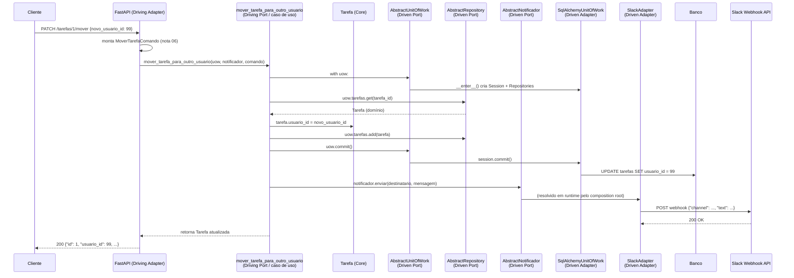

# Arquitetura hexagonal e Ports and Adapters em Python

> [!abstract] TL;DR
> "Além de e-mail, precisamos notificar por Slack também" chega como um requisito de meia linha num board de produto — e o quanto ele dói de implementar é o teste mais honesto de quanto uma arquitetura está isolada de verdade. Numa aplicação sem fronteiras explícitas, "notificar" está espalhado: uma chamada SMTP dentro do handler que cria a tarefa, outra dentro do job que fecha tarefas vencidas, talvez uma terceira copiada num worker. Adicionar Slack significa caçar cada um desses lugares e duplicar a lógica de novo. Nesta nota, a API de Tarefas construída ao longo do Galho 13 já não tem esse problema: um `AbstractNotificador` — o **Port** de saída que esta nota introduz — é a única coisa que a [[06 - Service Layer — orquestrando casos de uso|Service Layer]] conhece sobre "avisar alguém"; um `SlackAdapter` novo, satisfazendo esse contrato, é a única linha de código que muda. O resto desta nota nomeia formalmente o vocabulário que as notas 02-06 deste galho já construíram informalmente — [[02 - Domain modeling — separando a lógica de negócio do framework|domínio]] no centro do hexágono, [[03 - Repository pattern — abstraindo a persistência|AbstractRepository]]/[[04 - Unit of Work — formalizando o padrão que já existia|AbstractUnitOfWork]] como Ports de saída, `SqlAlchemyTarefaRepository`/`SqlAlchemyUnitOfWork` como Adapters de saída, FastAPI como Adapter de entrada — e fecha com o diagrama que reorganiza a API de Tarefas inteira (a mesma da [[03-Dominios/Tecnologia/Python/Web e APIs REST/09 - Capstone — uma API REST completa de ponta a ponta|capstone do Galho 10]]) em camadas hexagonais. Teoria do estilo, sem repetir: [[03-Dominios/Engenharia/Arquitetura/Arquitetura de Software#Hexagonal Architecture (Ports & Adapters)|Engenharia/Arquitetura]]. Fonte primária do estilo: Cockburn (2005); fonte primária da aplicação Python: Percival & Gregory.

## O requisito que chega como uma frase e cobra o preço da arquitetura

A API de Tarefas construída pelas notas 02-06 deste galho tem, hoje, um jeito de avisar um usuário quando algo acontece com uma tarefa dele — a [[04 - Unit of Work — formalizando o padrão que já existia|nota 04]] introduziu isso ao lado da Unit of Work, no cenário de mover uma tarefa para outro dono: uma `Notificacao` de domínio, gravada na mesma transação da tarefa, através de um `AbstractNotificacaoRepository`. É persistência — a notificação vira uma linha na tabela `notificacoes`, e o usuário a vê ao abrir a lista de notificações não lidas. Funciona bem para esse caso de uso.

Só que o produto pede algo diferente agora: "quando uma tarefa é movida para outro usuário, além de registrar a notificação no banco, mande um e-mail avisando — e, se possível, mande também no Slack do time, porque metade do pessoal não abre a lista de notificações da aplicação." Isso não é mais "gravar uma linha" — é **disparar uma ação externa**, uma chamada de rede para um provedor de e-mail (SMTP, SES, SendGrid) e, em seguida, potencialmente outra para um provedor diferente (a API de webhooks do Slack). É um tipo de dependência de saída que este galho ainda não formalizou: não é o banco, é um serviço de terceiros que a aplicação **aciona**, não **consulta**.

Um desenvolvedor sob pressão de prazo, sem pensar duas vezes, adiciona a chamada de e-mail direto onde a decisão de negócio acontece:

```python
"""services/mover_tarefa.py — a versão que parece razoável, e não é."""

import smtplib
from email.message import EmailMessage

from domain.notificacao import Notificacao
from domain.unit_of_work import AbstractUnitOfWork


def mover_tarefa_para_outro_usuario(
    uow: AbstractUnitOfWork, tarefa_id: int, novo_usuario_id: int, email_novo_dono: str,
) -> None:
    with uow:
        tarefa = uow.tarefas.get(tarefa_id)
        if tarefa is None:
            raise TarefaNaoEncontrada(tarefa_id)

        tarefa.usuario_id = novo_usuario_id
        uow.tarefas.add(tarefa)

        notificacao = Notificacao(
            id=None, usuario_id=novo_usuario_id,
            mensagem=f"Você recebeu a tarefa '{tarefa.titulo}'",
        )
        uow.notificacoes.add(notificacao)
        uow.commit()

    # 💥 fora da Unit of Work, porque enviar e-mail não é uma escrita no banco —
    # mas agora smtplib mora dentro da Service Layer, que a nota 06 deste galho
    # já garantiu ser Python puro, sem import de framework nenhum
    msg = EmailMessage()
    msg["Subject"] = "Você recebeu uma nova tarefa"
    msg["From"] = "no-reply@empresa.com"
    msg["To"] = email_novo_dono
    msg.set_content(f"Você recebeu a tarefa '{tarefa.titulo}'")
    with smtplib.SMTP("smtp.empresa.com", 587) as smtp:
        smtp.starttls()
        smtp.login("no-reply", "senha-no-codigo")
        smtp.send_message(msg)
```

O código funciona — o e-mail sai, o time comemora, o ticket fecha. Duas semanas depois, o produto pede o Slack. O mesmo desenvolvedor abre o mesmo arquivo e adiciona um segundo bloco, quase idêntico ao primeiro, chamando `requests.post()` contra o webhook do Slack. Três meses depois, um segundo caso de uso — "avisar quando uma tarefa vence sem ser concluída" — precisa do mesmo comportamento (e-mail + Slack), e como não existe nenhum lugar único que já sabe "como notificar", alguém copia os dois blocos de `smtplib`/`requests` de novo, para dentro de outra função de Service Layer. É o mesmo bug estrutural que abriu a [[02 - Domain modeling — separando a lógica de negócio do framework|nota 02 deste galho]] — uma capacidade que deveria existir em um lugar só passa a existir em N lugares, cada um podendo divergir silenciosamente do resto.

> [!bug] O que está quebrado, em uma frase
> "Como notificar alguém" é uma decisão de **infraestrutura** (qual provedor, qual protocolo, qual credencial) que se infiltrou dentro da Service Layer — a mesma camada que a nota 06 deste galho já blindou contra `import fastapi`/`import sqlalchemy` continua livre para importar `smtplib` e `requests`, porque nada, na estrutura do código, nomeou "enviar uma notificação" como algo que merece o mesmo tratamento que "persistir uma tarefa" já recebe.

> [!question]- Por que isso não é só "mais um método no `AbstractNotificacaoRepository` da nota 04"?
> Porque são dois problemas de naturezas diferentes, mesmo que pareçam parecidos à primeira vista. `AbstractNotificacaoRepository` (nota 04) resolve **persistência** — gravar e ler uma entidade `Notificacao` no mesmo banco, na mesma transação, com as mesmas garantias ACID que a [[03-Dominios/Tecnologia/Python/Persistência de dados/06 - Transações e isolamento — ACID na prática, isolation levels, deadlocks de aplicação|nota 06 do Galho 9]] já cobre. Enviar um e-mail ou postar no Slack é **integração com um sistema externo que não compartilha transação nenhuma** com o banco — a própria [[04 - Unit of Work — formalizando o padrão que já existia|nota 04]] já nomeou essa fronteira explicitamente na sua ressalva final: "quando uma operação de negócio precisa coordenar um banco relacional **e** um sistema externo... o padrão certo é diferente." Esta nota não reabre esse problema de atomicidade entre sistemas — ele continua fora de escopo, do jeito que a nota 04 já delimitou. O que esta nota resolve é mais estreito e mais imediato: dado que o envio em si (sem a garantia de atomicidade) precisa acontecer, **onde** essa decisão de "qual provedor, qual protocolo" deveria morar, para que trocar de provedor não signifique caçar código espalhado.

## O Port que faltava: `AbstractNotificador`

A correção segue exatamente o molde que as notas 03 e 04 já cravaram duas vezes neste galho: uma interface abstrata, livre de qualquer import de infraestrutura, que declara **o que** a Service Layer precisa poder fazer — não **como** isso acontece por baixo.

```python
"""domain/notificador.py — o Port de saída, sem NENHUM import de infraestrutura."""

from abc import ABC, abstractmethod


class AbstractNotificador(ABC):
    """Contrato: qualquer forma de avisar um destinatário sobre algo."""

    @abstractmethod
    def enviar(self, destinatario: str, mensagem: str) -> None:
        """Envia `mensagem` para `destinatario`. Não garante entrega —
        só que a tentativa de envio foi disparada."""
        raise NotImplementedError
```

Repare que `domain/notificador.py` não sabe se `destinatario` é um e-mail, um `@usuario` do Slack, ou um número de telefone — essa decisão pertence a cada Adapter concreto, não ao Port. A Service Layer, por sua vez, só conhece essa interface — nunca `smtplib`, nunca `requests`, nunca o SDK do Slack:

```python
"""services/mover_tarefa.py — a versão corrigida, com o Port injetado."""

from domain.notificacao import Notificacao
from domain.notificador import AbstractNotificador
from domain.unit_of_work import AbstractUnitOfWork


def mover_tarefa_para_outro_usuario(
    uow: AbstractUnitOfWork,
    notificador: AbstractNotificador,
    tarefa_id: int,
    novo_usuario_id: int,
    email_novo_dono: str,
) -> None:
    with uow:
        tarefa = uow.tarefas.get(tarefa_id)
        if tarefa is None:
            raise TarefaNaoEncontrada(tarefa_id)

        tarefa.usuario_id = novo_usuario_id
        uow.tarefas.add(tarefa)

        notificacao = Notificacao(
            id=None, usuario_id=novo_usuario_id,
            mensagem=f"Você recebeu a tarefa '{tarefa.titulo}'",
        )
        uow.notificacoes.add(notificacao)
        uow.commit()

    # fora do `with uow:` de propósito — a nota 04 já estabeleceu que a UoW
    # cobre só a transação de banco; o envio em si não participa dela
    notificador.enviar(
        destinatario=email_novo_dono,
        mensagem=f"Você recebeu a tarefa '{tarefa.titulo}'",
    )
```

`mover_tarefa_para_outro_usuario` agora recebe `notificador: AbstractNotificador` do mesmo jeito que já recebia `uow: AbstractUnitOfWork` — como parâmetro, decidido por fora. Quem decide **qual** implementação concreta chega até aqui não é a Service Layer; é o composition root, exatamente o papel que a [[05 - Injeção de dependência como princípio — sem framework pesado|nota 05 deste galho]] já formalizou.

> [!tip] `AbstractNotificador` não substitui `AbstractNotificacaoRepository` — os dois convivem
> `AbstractNotificacaoRepository` (nota 04) continua existindo, com o mesmo papel: persistir a `Notificacao` de domínio na mesma transação da tarefa, para que o usuário a veja dentro da própria aplicação. `AbstractNotificador` (esta nota) é uma peça nova, ao lado da primeira — dispara o *envio* de fato, por um canal externo (e-mail, Slack), depois que a transação de banco já fechou com sucesso. Um caso de uso pode usar as duas: grava a notificação (via `uow.notificacoes`) **e** dispara o aviso externo (via `notificador.enviar`) — cada Port cobrindo a metade do problema que lhe cabe.

## Os Adapters: `EmailAdapter`, `ConsoleAdapter`, e o `SlackAdapter` que o requisito pediu

Com o Port definido, cada forma concreta de notificar vira uma classe pequena que implementa `enviar()` — e nenhuma delas precisa saber que as outras existem.

```python
"""infra/notificador_email.py — Adapter de saída: e-mail via SMTP."""

import smtplib
from email.message import EmailMessage

from domain.notificador import AbstractNotificador


class EmailAdapter(AbstractNotificador):
    def __init__(self, host: str, porta: int, usuario: str, senha: str) -> None:
        self._host = host
        self._porta = porta
        self._usuario = usuario
        self._senha = senha

    def enviar(self, destinatario: str, mensagem: str) -> None:
        msg = EmailMessage()
        msg["Subject"] = "Notificação da API de Tarefas"
        msg["From"] = self._usuario
        msg["To"] = destinatario
        msg.set_content(mensagem)

        with smtplib.SMTP(self._host, self._porta) as smtp:
            smtp.starttls()
            smtp.login(self._usuario, self._senha)
            smtp.send_message(msg)
```

```python
"""infra/notificador_console.py — Adapter de saída: pra testes/dev, sem rede nenhuma."""

from domain.notificador import AbstractNotificador


class ConsoleAdapter(AbstractNotificador):
    """Não envia nada de verdade — imprime, útil em desenvolvimento local
    e como base para um Fake mais estrito em teste automatizado."""

    def enviar(self, destinatario: str, mensagem: str) -> None:
        print(f"[NOTIFICAÇÃO] para {destinatario}: {mensagem}")
```

E o Adapter que o requisito de abertura desta nota pediu — Slack, via webhook HTTP — entra sem tocar em uma linha sequer da Service Layer, do domínio, ou de qualquer outro Adapter já existente:

```python
"""infra/notificador_slack.py — Adapter de saída NOVO: Slack, via webhook HTTP."""

import requests

from domain.notificador import AbstractNotificador


class SlackAdapter(AbstractNotificador):
    def __init__(self, webhook_url: str) -> None:
        self._webhook_url = webhook_url

    def enviar(self, destinatario: str, mensagem: str) -> None:
        # `destinatario` aqui é o nome do canal ou @usuário Slack —
        # o Adapter decide o que esse campo significa para O SEU protocolo
        resposta = requests.post(
            self._webhook_url,
            json={"channel": destinatario, "text": mensagem},
            timeout=5,
        )
        resposta.raise_for_status()
```

`SlackAdapter.enviar()` tem a mesma assinatura de `EmailAdapter.enviar()` e `ConsoleAdapter.enviar()` — `destinatario: str, mensagem: str -> None` — porque é exatamente essa forma, e só essa forma, que `AbstractNotificador` exige. O composition root troca uma implementação pela outra (ou usa as duas, se o requisito pedir "e-mail **e** Slack") sem que `mover_tarefa_para_outro_usuario` precise de uma linha nova:

```python
"""main.py — composition root decidindo QUAIS notificadores existem."""

from infra.notificador_email import EmailAdapter
from infra.notificador_slack import SlackAdapter


def criar_notificador_email() -> EmailAdapter:
    return EmailAdapter(host="smtp.empresa.com", porta=587, usuario="no-reply", senha=SENHA_SMTP)


def criar_notificador_slack() -> SlackAdapter:
    return SlackAdapter(webhook_url=SLACK_WEBHOOK_URL)
```

Se "e-mail e Slack juntos" for o comportamento desejado, um terceiro Adapter — um `NotificadorComposto` que recebe uma lista de `AbstractNotificador` e chama `enviar()` em cada um — resolve isso sem que `AbstractNotificador` precise crescer nenhum método novo:

```python
"""infra/notificador_composto.py — compõe vários Adapters atrás do MESMO Port."""

from domain.notificador import AbstractNotificador


class NotificadorComposto(AbstractNotificador):
    def __init__(self, notificadores: list[AbstractNotificador]) -> None:
        self._notificadores = notificadores

    def enviar(self, destinatario: str, mensagem: str) -> None:
        for notificador in self._notificadores:
            notificador.enviar(destinatario, mensagem)
```

> [!question]- E se o Slack e o e-mail tiverem que decidir independentemente "sucesso" ou "falha" — um funciona, o outro não?
> `NotificadorComposto`, como escrito acima, propaga a primeira exceção que qualquer um dos Adapters levantar, interrompendo os que ainda não rodaram — aceitável quando "todos os canais têm que funcionar" é a regra, mas provavelmente errado se "pelo menos um canal funcionar já é suficiente" for a intenção real do produto. Essa decisão — continuar tentando os demais canais mesmo que um falhe, registrar cada falha individualmente, talvez re-tentar um canal específico — é uma regra de negócio sobre **tolerância a falha de notificação**, não um detalhe do Port. Ela pertence à Service Layer (decidindo "aceito falha parcial aqui") ou a um `NotificadorComposto` mais sofisticado, escrito deliberadamente para tolerar exceções por canal — não é algo que `AbstractNotificador`, sozinho, precisa resolver.

## Nomeando o que já existia: o vocabulário Ports and Adapters

O que as seções anteriores fizeram — separar "o que a Service Layer precisa" de "como isso é feito de verdade" — é o mesmo movimento que as notas 03 e 04 deste galho já fizeram para persistência, sem usar esse nome. Esta seção nomeia formalmente o vocabulário, seguindo Cockburn (2005) e a aplicação que Percival & Gregory fazem dele em Python, sem reexplicar o estilo arquitetural em si — isso já está em [[03-Dominios/Engenharia/Arquitetura/Arquitetura de Software#Hexagonal Architecture (Ports & Adapters)|Engenharia/Arquitetura]].

| Vocabulário hexagonal | O que é na API de Tarefas | Onde este galho já construiu |
|---|---|---|
| **Core / domínio** | `Tarefa`, `Notificacao`, regras de negócio | [[02 - Domain modeling — separando a lógica de negócio do framework\|nota 02]] |
| **Driven Port (saída)** | `AbstractRepository`, `AbstractUnitOfWork`, `AbstractNotificador` | [[03 - Repository pattern — abstraindo a persistência\|nota 03]], [[04 - Unit of Work — formalizando o padrão que já existia\|nota 04]], esta nota |
| **Driven Adapter (saída)** | `SqlAlchemyTarefaRepository`, `SqlAlchemyUnitOfWork`, `EmailAdapter`/`SlackAdapter`/`ConsoleAdapter` | notas 03, 04, esta nota |
| **Driving Port (entrada)** | A própria função de caso de uso — `criar_tarefa(comando, uow)` — é o "ponto de entrada" que qualquer chamador aciona | [[06 - Service Layer — orquestrando casos de uso\|nota 06]] |
| **Driving Adapter (entrada)** | O handler FastAPI, que traduz `POST /tarefas` num `CriarTarefaComando` e chama a função de caso de uso | [[06 - Service Layer — orquestrando casos de uso\|nota 06]], [[03-Dominios/Tecnologia/Python/Web e APIs REST/09 - Capstone — uma API REST completa de ponta a ponta\|capstone Galho 10]] |

O ponto que vale destacar, porque é o que mais confunde quem chega de fora: **FastAPI é um Adapter, não o centro da aplicação**. A capstone do Galho 10 construiu a API "de dentro para fora" — começou pelo handler, foi acrescentando camadas (roteamento, validação, injeção, erro, middleware) até chegar num sistema funcional. Isso é uma sequência pedagógica legítima e comum — mas o resultado, visto de fora, tem o handler HTTP como se fosse o ponto de partida conceitual da aplicação. A arquitetura hexagonal inverte essa leitura: o domínio (`Tarefa`, `Notificacao`, suas regras) é o centro; FastAPI é só uma das formas possíveis de **acionar** esse centro — trocável, em princípio, por uma CLI, um worker de fila, ou outro framework web inteiro, sem que uma linha do domínio ou da Service Layer precise mudar.

> [!warning] "Hexagonal" não significa seis lados, nem um diagrama geométrico obrigatório
> Cockburn escolheu o hexágono só para ter espaço visual suficiente para desenhar vários Ports de entrada e saída ao redor de um núcleo — não existe significado no número seis, e a forma exata do diagrama (hexágono, círculo, retângulo) não importa para a arquitetura em si. O que importa, e o que o próprio Cockburn enfatiza no artigo original ("[Hexagonal Architecture](https://alistair.cockburn.us/hexagonal-architecture/)", 2005), é a simetria entre entrada e saída: tanto o lado que aciona a aplicação (HTTP, CLI, fila) quanto o lado que a aplicação aciona (banco, e-mail, outro serviço) atravessam Ports — nenhum dos dois lados tem acesso direto ao núcleo. É comum ver diagramas que só desenham Adapters de saída (banco, e-mail) esquecendo que a entrada (FastAPI, neste galho) também é, estruturalmente, um Adapter — a mesma simetria que faz o nome "Ports and Adapters" ser, para Cockburn, um nome melhor que "Hexagonal" para descrever o padrão.

## A API de Tarefas inteira, em camadas hexagonais

Juntando tudo que este galho construiu — domínio (nota 02), Repository/UoW (notas 03-04), DI (nota 05), Service Layer (nota 06), e o `AbstractNotificador` desta nota — a API de Tarefas da capstone do Galho 10 se reorganiza assim:



O núcleo verde (`Tarefa`, `Notificacao`, suas regras) não tem nenhuma seta saindo dele em direção às camadas externas — só recebe chamadas de dentro da Service Layer, e é isso que a [[02 - Domain modeling — separando a lógica de negócio do framework|nota 02]] já garantiu ao proibir qualquer `import fastapi`/`import sqlalchemy` do domínio. As duas faixas azuis (Ports) são só interfaces — `abc.ABC` com `@abstractmethod`, sem lógica nenhuma por trás — e é o fato de a Service Layer só conhecer essas faixas azuis, nunca as faixas marrons (Adapters), que torna o diagrama verdadeiro: trocar `SlackAdapter` por outro provedor de mensageria, ou trocar FastAPI por outro framework web inteiro, é uma mudança confinada a uma faixa marrom — nenhuma seta cruza de uma faixa marrom para outra sem passar pela faixa azul do meio.

Vale nomear a assimetria de nomenclatura entre "Driving" e "Driven" — comum causar confusão: **Driving** ("quem dirige/aciona") são os Ports/Adapters de **entrada** — eles "dirigem" a aplicação, provocam algo a acontecer. **Driven** ("o que é dirigido/acionado") são os de **saída** — a aplicação os "dirige", os aciona para cumprir o que a entrada pediu. `AbstractRepository`/`AbstractUnitOfWork`/`AbstractNotificador` são todos Driven Ports porque, em todos os três casos, é o **core** que decide chamar `.add()`, `.commit()` ou `.enviar()` — nunca o inverso.

## Uma requisição atravessando o hexágono

O diagrama anterior é estático — mostra a estrutura, não o fluxo. Uma única requisição HTTP torna as camadas concretas: `POST /tarefas/{id}/mover` chega pelo Adapter de entrada (FastAPI), atravessa o Driving Port (a função de caso de uso), toca o núcleo (a entidade `Tarefa`), e sai por dois Driven Ports diferentes — persistência e notificação — cada um resolvido por um Adapter de saída distinto.



Repare no que `mover_tarefa_para_outro_usuario` (o Driving Port, no meio do diagrama) nunca vê: nunca vê `Session`, `Engine`, `smtplib` ou o SDK do Slack — só vê `AbstractUnitOfWork`, `AbstractRepository`, `AbstractNotificador`. Os três Adapters concretos (`SqlAlchemyUnitOfWork`, e por trás dele `SqlAlchemyTarefaRepository`, e `SlackAdapter`) só aparecem no diagrama como quem de fato conversa com o mundo externo (`DB`, `API`) — e nenhum deles é mencionado por nome dentro do código do caso de uso, só resolvido em runtime pelo composition root, exatamente como a [[05 - Injeção de dependência como princípio — sem framework pesado|nota 05 deste galho]] já formalizou.

## Por que isso importa na prática: o custo de trocar um Adapter

Voltando ao requisito de abertura desta nota — Slack além de e-mail — a resposta completa, com a arquitetura hexagonal em vigor, é: escrever `infra/notificador_slack.py` (uma classe, um método), e mudar uma linha no composition root. Nada em `domain/`, nada em `services/`, nada no handler FastAPI muda. Compare com o cenário sem Ports/Adapters, do início da nota — `smtplib` e `requests` espalhados dentro de funções de Service Layer, cada caso de uso que precisa notificar reimplementando a decisão de "qual provedor" à sua maneira: adicionar Slack ali significa **caçar** cada lugar que faz isso, não **escrever um arquivo novo**.

O mesmo raciocínio vale, com o mesmo peso, para o outro lado do hexágono — trocar FastAPI por outro framework web (ou por um Adapter de linha de comando inteiro, ou por um novo Adapter que consome de uma fila de eventos) é, em teoria, uma mudança confinada à faixa marrom de entrada: um Adapter novo que traduz sua forma específica de chegada (HTTP, linha de comando, mensagem de fila) num `Comando` e chama a mesma função de caso de uso que já existe. A [[06 - Service Layer — orquestrando casos de uso|nota 06 deste galho]] já demonstrou essa simetria concretamente com o worker de importação em lote — ele nunca precisou saber que FastAPI existe, porque ele já chama o mesmo Driving Port que o handler chama.

> [!warning] "Trocável em teoria" não é "trocável de graça"
> A promessa central da arquitetura hexagonal — trocar um Adapter sem tocar no core — é real, mas vale nomear o que ela não cobre. Trocar `SlackAdapter` por outro provedor de mensageria não exige tocar no domínio nem na Service Layer, **desde que** o novo provedor caiba na mesma assinatura (`enviar(destinatario, mensagem) -> None`). Se o Slack precisar de algo que o Port não previu — anexar um botão interativo, por exemplo — o Port precisa crescer (um método novo, ou um parâmetro novo), e essa mudança **sim** se propaga para toda implementação existente de `AbstractNotificador`, inclusive `EmailAdapter` e `ConsoleAdapter`, que agora precisam decidir o que fazer com uma capacidade que não faz sentido para elas. A arquitetura hexagonal isola a **implementação** de um Port; não torna o **desenho do Port em si** imune a mudança quando o requisito de negócio evolui de um jeito que a abstração original não previu.

## A ressalva honesta: hexágono é estrutura, não seguro contra over-engineering

Cada Port novo — `AbstractNotificador`, como cada `AbstractRepository`/`AbstractUnitOfWork` antes dele — é mais uma interface, mais um vocabulário, mais uma decisão de composição no `main.py`. A régua que as notas 03 e 05 deste galho já cravaram continua valendo aqui, sem exceção: se a aplicação só vai enviar e-mail, sempre, por um único provedor, para sempre, um `EmailAdapter` chamado direto (sem `AbstractNotificador` no meio) é simples, funciona, e não é "arquitetura errada" — é arquitetura calibrada para um problema que não tem, hoje, mais de uma forma de ser resolvido. O Port compensa quando existe (ou é razoavelmente previsível que vá existir) mais de uma implementação real — o cenário de abertura desta nota, "e-mail e depois Slack", é exatamente esse sinal. Extrair o Port antes desse sinal aparecer é especular sobre um futuro que pode nunca chegar; a arquitetura hexagonal não isenta ninguém de fazer essa avaliação de custo-benefício caso a caso — ela só barateia o custo de estar errado, quando a especulação acerta.

## Em resumo

O hexágono desta nota não introduziu nenhum mecanismo novo — nomeou, formalmente, o que as notas 02 a 06 deste galho já tinham construído: um núcleo de domínio Python puro, cercado por Ports (interfaces `abc.ABC`, sem lógica) e Adapters (implementações concretas, uma por tecnologia). O único artefato genuinamente novo foi `AbstractNotificador` — o Port de saída que faltava para "avisar alguém por um canal externo" ter o mesmo tratamento estrutural que "persistir uma entidade" já tinha. Com ele no lugar, o requisito que abriu a nota — Slack, além de e-mail — vira a prova concreta da promessa do estilo: um `SlackAdapter` novo, uma linha alterada no composition root, e nenhuma mudança no domínio, na Service Layer, ou no Adapter de entrada FastAPI. É esse o teste que separa arquitetura hexagonal genuína de um diagrama bonito — não "o desenho tem um hexágono", é "o próximo requisito de troca de fornecedor custa um arquivo novo, não uma caçada pelo código inteiro".

## Em entrevista

Arquitetura hexagonal é um dos assuntos mais citados em entrevistas de arquitetura backend sênior — e a pergunta que separa quem entende de quem decorou o diagrama é sempre sobre o **custo de troca**:

> "Hexagonal architecture — Ports and Adapters, from Cockburn — puts the domain at the center, with zero knowledge of any technology outside it. Everything the domain needs from the outside world, and everything the outside world uses to trigger the domain, goes through an interface — a Port — defined by the domain itself, not by whatever's on the other side. Concrete implementations, Adapters, live in the infrastructure layer and satisfy those interfaces: a SQLAlchemy repository for persistence, a FastAPI handler for HTTP, an SMTP or Slack client for notifications. The concrete test of whether this is actually in place, not just a diagram, is what it costs to add a new adapter — say, a new notification channel. If that's a new class implementing an existing interface, plus one line in the composition root, the architecture is real. If it means hunting through service functions for scattered `smtplib` calls, it's not hexagonal, no matter what the box-and-arrow diagram in the design doc says."

> [!question]- E se perguntarem "isso não é a mesma coisa que Clean Architecture ou Onion Architecture"?
> A resposta honesta reconhece a convergência em vez de fingir uma distinção que não existe na prática: Hexagonal (Cockburn, 2005), Onion (Palermo, 2008) e Clean Architecture (Uncle Bob, 2012) resolvem o mesmo problema — isolar o domínio da infraestrutura via inversão de dependência — com vocabulário e ênfase ligeiramente diferentes, como o próprio [[03-Dominios/Engenharia/Arquitetura/Arquitetura de Software#Clean/Hexagonal/Onion: convergência|comparativo em Engenharia/Arquitetura]] documenta. Esta nota usa "hexagonal" porque é o termo que Percival & Gregory usam no livro-fonte deste galho, e porque "Ports and Adapters" nomeia com mais precisão a peça central — a interface que separa quem aciona de quem é acionado. Um candidato sênior reconhece a família inteira, em vez de tratar os três nomes como escolas rivais.

## Como explicar em inglês

| PT | EN |
|----|----|
| arquitetura hexagonal | hexagonal architecture |
| Ports and Adapters | Ports and Adapters |
| porta de entrada / saída | driving port / driven port |
| adaptador de entrada / saída | driving adapter / driven adapter |
| núcleo / core do domínio | domain core |
| isolamento do domínio | domain isolation |
| composition root | composition root |
| trocar de provedor | swap providers |
| custo de troca | cost of swapping |

## Fontes

- Cockburn, Alistair. *Hexagonal Architecture*. alistair.cockburn.us, 2005. https://alistair.cockburn.us/hexagonal-architecture/ (consultado em 2026-07-12) — artigo original do estilo, origem do vocabulário Ports/Adapters/Driving/Driven usado nesta nota.
- Percival, Harry; Gregory, Bob. *Architecture Patterns with Python: Enabling Test-Driven Development, Domain-Driven Design, and Event-Driven Microservices*. O'Reilly Media, 2020. Capítulo "The Repository, the Service Layer, and Their Fakes" e apêndice de arquitetura hexagonal. https://www.cosmicpython.com/book/appendix_csvs.html (consultado em 2026-07-12) — fonte primária deste galho, aplicação concreta do estilo em Python com Repository/UoW/Service Layer como Ports/Adapters.
- Python documentation — `abc` — Abstract Base Classes: https://docs.python.org/3/library/abc.html (consultado em 2026-07-12) — mecânica de `ABC`/`@abstractmethod` reaproveitada em `AbstractNotificador`, sem repetição.
- [[03-Dominios/Engenharia/Arquitetura/Arquitetura de Software#Hexagonal Architecture (Ports & Adapters)|Arquitetura de Software — Hexagonal Architecture]] — teoria do estilo arquitetural, agnóstica de linguagem, referenciada sem repetição.
- [[01 - Por que GoF clássico é menos necessário em Python|01 — Por que GoF clássico é menos necessário em Python]] — nota que já nomeou Adapter GoF como o padrão que "não fica menos comum em Python" e adiantou que este galho retomaria o tema aqui.
- [[02 - Domain modeling — separando a lógica de negócio do framework|02 — Domain modeling: separando a lógica de negócio do framework]] — origem de `Tarefa`/`Notificacao`, o núcleo do hexágono desta nota.
- [[03 - Repository pattern — abstraindo a persistência|03 — Repository pattern: abstraindo a persistência]] — `AbstractRepository`/`SqlAlchemyTarefaRepository`, o par Driven Port/Adapter de persistência.
- [[04 - Unit of Work — formalizando o padrão que já existia|04 — Unit of Work: formalizando o padrão que já existia]] — `AbstractUnitOfWork`/`SqlAlchemyUnitOfWork`, e a origem de `Notificacao`/`AbstractNotificacaoRepository`, distinto de `AbstractNotificador` desta nota.
- [[05 - Injeção de dependência como princípio — sem framework pesado|05 — Injeção de dependência como princípio: sem framework pesado]] — o composition root que decide qual Adapter concreto injetar em cada Port.
- [[06 - Service Layer — orquestrando casos de uso|06 — Service Layer: orquestrando casos de uso]] — os Driving Ports (`criar_tarefa`, `concluir_tarefa`) que esta nota reorganiza no diagrama hexagonal.
- [[03-Dominios/Tecnologia/Python/Web e APIs REST/09 - Capstone — uma API REST completa de ponta a ponta|Capstone — uma API REST completa de ponta a ponta]] — Galho 10, a API de Tarefas que esta nota reorganiza integralmente em camadas hexagonais.

## Veja também

- [[index|Arquitetura e Design Patterns (Galho 13)]] — MOC deste galho.
- [[03-Dominios/Tecnologia/Python/index|Trilha Python]] — MOC da trilha.

Consultado em 2026-07-12.
