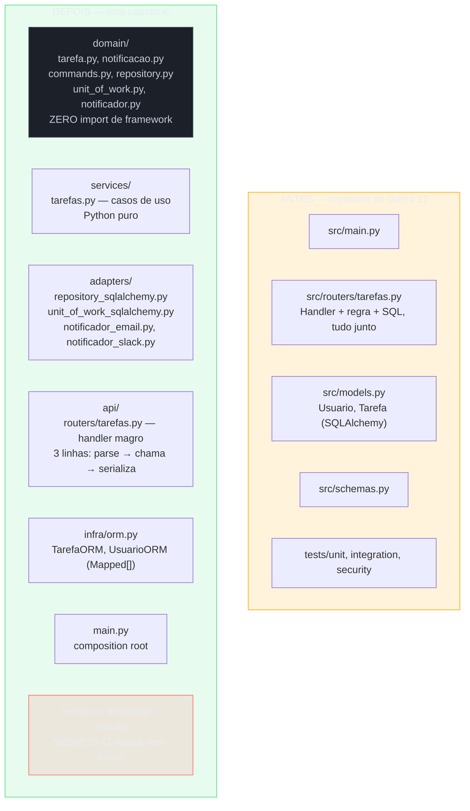
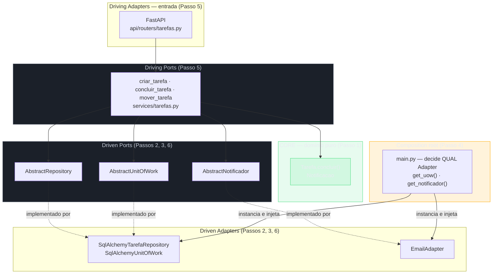
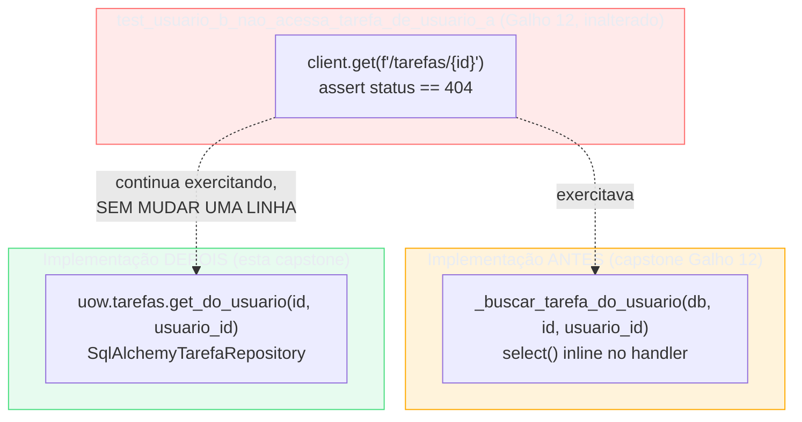

# Capstone — refatorando a API de Tarefas pra arquitetura hexagonal

> [!abstract] TL;DR
> A API de Tarefas sai da [[03-Dominios/Tecnologia/Python/Testes/09 - Capstone — a suíte de testes da API de Tarefas|capstone do Galho 12]] num estado que parece definitivo: 42 testes verdes, três regressões de segurança automatizadas, 91% de coverage honesto. Mas a própria capstone do Galho 12 já apontou o problema que sobrava — a lógica de negócio, o SQLAlchemy e o FastAPI continuam misturados no mesmo handler, e a função `_buscar_tarefa_do_usuario` se comporta como um Repository informal que ninguém nomeou. Esta capstone refatora esse código, passo a passo, aplicando as sete notas deste galho na ordem em que fazem sentido: extrai o domínio puro ([[02 - Domain modeling — separando a lógica de negócio do framework|nota 02]]), formaliza o Repository ([[03 - Repository pattern — abstraindo a persistência|nota 03]]), agrupa Repositories numa Unit of Work ([[04 - Unit of Work — formalizando o padrão que já existia|nota 04]]), decide a composição manual no `main.py` ([[05 - Injeção de dependência como princípio — sem framework pesado|nota 05]]), extrai a Service Layer ([[06 - Service Layer — orquestrando casos de uso|nota 06]]), e reorganiza tudo em Ports and Adapters ([[07 - Arquitetura hexagonal e Ports and Adapters em Python|nota 07]]). O ponto mais importante da capstone não é nenhuma peça isolada — é a última seção: a suíte de segurança inteira da capstone do Galho 12 (Broken Access Control, SSTI, rate limiting) continua verde depois do refactor completo, sem que uma linha de teste precise mudar, porque ela testa comportamento observável via `TestClient`, não implementação interna. Esta nota fecha o Galho 13 e o bloco inteiro "Backend e arquitetura" (Galhos 9-13) — e aponta para o [[03-Dominios/Tecnologia/Python/Mensageria/index|Galho 14]], onde Domain Events, uma extensão natural do domínio agora isolado, abrem a porta para mensageria assíncrona.

## O que sobrou depois de blindar e testar tudo

A [[03-Dominios/Tecnologia/Python/Testes/09 - Capstone — a suíte de testes da API de Tarefas|capstone do Galho 12]] fechou com uma frase que merece ser lida de novo, porque é exatamente o gancho desta nota: "essa função se comporta, informalmente, como um Repository... o padrão de `db.add(); db.commit(); db.refresh()`, repetido em cada handler, se comporta como uma Unit of Work informal — uma transação que agrupa uma sequência de operações, sem que ninguém tenha nomeado isso explicitamente como um padrão." A API de Tarefas, àquela altura, tinha:

- Autenticação real, filtro de posse em toda query, SSTI corrigida, secrets tipados, rate limiting — os seis itens da capstone do Galho 11.
- 42 testes cobrindo unidade, integração e segurança — a capstone do Galho 12, com `tests/security/` como pasta de primeira classe.
- Um `_buscar_tarefa_do_usuario(db: Session, tarefa_id: int, usuario_id: int) -> Tarefa` dentro de `routers/tarefas.py`, chamado por quatro endpoints diferentes, cada um também responsável por parsear o request, checar regra de negócio, falar com o SQLAlchemy e traduzir o resultado pra JSON — tudo na mesma função.

Funciona. Passa em produção, passa em pentest, passa na suíte inteira. O problema não é um bug — é que o próximo requisito de negócio real, o tipo que qualquer sistema em produção eventualmente recebe, custa mais caro do que deveria custar. "Precisamos que um job noturno feche automaticamente tarefas vencidas" significa reimplementar (ou esquecer de reimplementar) a checagem de subtarefas pendentes fora do handler. "Precisamos notificar por Slack, não só gravar uma notificação no banco" significa caçar cada lugar que fala com o SMTP. "Precisamos de um teste unitário rápido pra essa regra de quota" significa mockar `Session.query().filter().join()` encadeamento por encadeamento — e ver o teste quebrar no próximo refactor de acesso a dados, mesmo sem bug nenhum introduzido.

> [!bug] O que está "quebrado", em uma frase — mesmo com tudo verde
> A API do Galho 12 tem zero defeito funcional e zero brecha de segurança conhecida — mas tem uma única classe de acoplamento que nenhum teste pega, porque não é um bug de comportamento: é a lógica de negócio, o acesso a dados e a tradução HTTP morando na mesma função, o que torna cada extensão futura mais cara e mais arriscada do que precisaria ser.

O trabalho desta capstone não introduz nenhum conceito novo — cada peça do refactor que vem a seguir já foi ensinada, isolada, numa das sete notas anteriores deste galho. O que falta é a mesma coisa que faltou nas três capstones anteriores da trilha: montar as peças juntas, contra o código real, e nomear explicitamente o que cada passo do refactor prova (ou não prova).

```mermaid
flowchart LR
    classDef destaque fill:#FFAA0024,stroke:#FFAA00,color:#E9ECF2
    classDef falha fill:#FF6B6B24,stroke:#FF6B6B,color:#E9ECF2
    classDef ok fill:#4ADE8021,stroke:#4ADE80,color:#E9ECF2
    G12["API do Galho 12\n(blindada, testada,\nhandler ainda gordo)"] --> P1["Passo 1\nDomínio puro (N02)"]
    P1 --> P2["Passo 2\nRepository (N03)"]
    P2 --> P3["Passo 3\nUnit of Work (N04)"]
    P3 --> P4["Passo 4\nComposition root (N05)"]
    P4 --> P5["Passo 5\nService Layer (N06)"]
    P5 --> P6["Passo 6\nPorts and Adapters (N07)"]
    P6 --> P7["Passo 7\nSuíte do Galho 12\nCONTINUA VERDE"]
    P7 --> DONE["Arquitetura hexagonal\ncompleta"]

    class G12 destaque
    class P7 falha
    class DONE ok
```



> [!question]- Por que refatorar algo que já está em produção, testado e blindado? Não é risco desnecessário?
> É risco real, e a resposta honesta não finge que não é. A justificativa não é "o código está errado" — é a mesma que abriu a [[02 - Domain modeling — separando a lógica de negócio do framework|nota 02 deste galho]]: o sinal que legitima esse tipo de refactor é a chegada (real ou muito previsível) de um segundo caminho de escrita, um segundo consumidor, ou uma regra de negócio complexa o bastante para merecer teste isolado. Esta capstone assume que esses sinais já apareceram — a nota 02 mostrou o job de manutenção que esqueceu a checagem de subtarefas; a nota 06 mostrou o worker de importação em lote que copiou o handler inteiro; a nota 07 mostrou o requisito de Slack que obrigaria caçar `smtplib` espalhado. Refatorar sem esses sinais, só "porque é a arquitetura certa", seria o mesmo over-engineering que as notas 03, 04 e 05 já avisaram contra. A suíte de testes do Galho 12, herdada intacta nesta capstone, é o que torna esse refactor seguro de fazer: cada passo pode ser verificado contra a mesma rede de proteção que já existia antes de qualquer linha mudar.

## A árvore de módulos, antes e depois

Antes do código, vale nomear a estrutura de diretório que o refactor produz — não é uma reorganização cosmética, é a materialização física da separação de camadas que as sete notas deste galho já defenderam:



A pasta `tests/` do lado direito não tem asterisco nenhum de "adaptada" — é a mesma árvore, os mesmos arquivos, o mesmo conteúdo da capstone do Galho 12. Esse é o ponto que a última seção desta nota prova em detalhe: o refactor inteiro acontece **por trás** da fronteira que `TestClient` já exercitava, e por isso nenhum teste de integração ou de segurança precisa mudar uma linha para continuar válido.

## Passo 1 — extraindo o domínio puro (nota 02)

O ponto de partida é a regra de negócio que a [[02 - Domain modeling — separando a lógica de negócio do framework|nota 02 deste galho]] já usou como exemplo canônico neste mesmo domínio: uma tarefa não pode ser concluída enquanto tiver subtarefas pendentes. Na capstone do Galho 12, essa checagem nunca chegou a existir formalmente — o handler `concluir_tarefa` fazia só `tarefa.concluida = True; db.commit()`, sem checagem nenhuma além da posse. É o momento certo para introduzi-la já nascendo isolada, em vez de nascer dentro do handler e precisar ser extraída depois:

```python
"""domain/tarefa.py — Python puro. Nenhum import de fastapi, sqlalchemy ou pydantic."""

from __future__ import annotations

from dataclasses import dataclass, field
from datetime import datetime


class TarefaComSubtarefasPendentesError(Exception):
    """Exceção de domínio — não sabe que vai virar um 409 HTTP."""

    def __init__(self, tarefa_id: int) -> None:
        self.tarefa_id = tarefa_id
        super().__init__(f"Tarefa {tarefa_id} tem subtarefas pendentes")


@dataclass
class Tarefa:
    """Entity: duas tarefas com o mesmo título são tarefas diferentes — o id decide."""

    id: int | None
    usuario_id: int
    titulo: str
    concluida: bool = False
    criada_em: datetime = field(default_factory=datetime.utcnow)
    subtarefas: list["Tarefa"] = field(default_factory=list, compare=False)

    def __eq__(self, outro: object) -> bool:
        if not isinstance(outro, Tarefa):
            return NotImplemented
        return self.id is not None and self.id == outro.id

    def __hash__(self) -> int:
        return hash(self.id)

    def concluir(self) -> None:
        pendentes = [s for s in self.subtarefas if not s.concluida]
        if pendentes:
            raise TarefaComSubtarefasPendentesError(self.id)
        self.concluida = True
```

Repare no que **não** está aqui: nenhum `Mapped[]`, nenhuma `Session`, nenhum `HTTPException`, nenhum `field_validator` do Pydantic. `Tarefa` é o mesmo objeto que a nota 02 já construiu — Entity com `__eq__` sobrescrito comparando só o `id`, invariante `concluir()` decidindo sozinha, sem consultar nada fora de si mesma, exatamente porque a checagem de subtarefas só depende das próprias `subtarefas` já carregadas. O teste que prova essa regra roda em milissegundos, sem TestClient nem banco — a mesma economia que a nota 02 já demonstrou:

```python
"""tests/domain/test_tarefa.py — NOVO nesta capstone, complementa (não substitui) os 42 testes do Galho 12."""

import pytest

from domain.tarefa import Tarefa, TarefaComSubtarefasPendentesError


def test_tarefa_com_subtarefa_pendente_nao_pode_ser_concluida():
    subtarefa = Tarefa(id=2, usuario_id=1, titulo="Coletar dados", concluida=False)
    tarefa = Tarefa(id=1, usuario_id=1, titulo="Relatório", subtarefas=[subtarefa])

    with pytest.raises(TarefaComSubtarefasPendentesError):
        tarefa.concluir()

    assert tarefa.concluida is False
```

> [!tip] Este teste é aditivo, não substitutivo
> Vale nomear cedo, porque a última seção desta nota volta a esse ponto com mais peso: os testes novos que aparecem em cada passo deste refactor (como o de `Tarefa.concluir()` acima) **somam-se** aos 42 testes do Galho 12 — nenhum deles é escrito para substituir um teste existente. A suíte de segurança em particular permanece byte a byte a mesma; só a árvore de testes unitários e de domínio cresce.

O modelo mapeado — a classe SQLAlchemy que a capstone do Galho 12 chamava só de `Tarefa` — vira `TarefaORM`, movida para `infra/orm.py`, com a mesma mecânica `Mapped[]`/`mapped_column()` do Galho 9, sem alteração nenhuma na estrutura de colunas:

```python
"""infra/orm.py — o modelo mapeado, renomeado (não reescrito) da capstone do Galho 12."""

from datetime import datetime

from sqlalchemy import ForeignKey, String
from sqlalchemy.orm import DeclarativeBase, Mapped, mapped_column


class Base(DeclarativeBase):
    pass


class UsuarioORM(Base):
    __tablename__ = "usuarios"
    id: Mapped[int] = mapped_column(primary_key=True)
    nome: Mapped[str] = mapped_column(String(120))
    email: Mapped[str] = mapped_column(String(255), unique=True)
    senha_hash: Mapped[str] = mapped_column(String(255))


class TarefaORM(Base):
    __tablename__ = "tarefas"
    id: Mapped[int] = mapped_column(primary_key=True)
    usuario_id: Mapped[int] = mapped_column(ForeignKey("usuarios.id"))
    titulo: Mapped[str] = mapped_column(String(200))
    concluida: Mapped[bool] = mapped_column(default=False)
    tarefa_pai_id: Mapped[int | None] = mapped_column(ForeignKey("tarefas.id"), default=None)
    anexo_url: Mapped[str | None] = mapped_column(String(500), default=None)
    criada_em: Mapped[datetime] = mapped_column(default=datetime.utcnow)
```

## Passo 2 — o Repository substituindo `_buscar_tarefa_do_usuario` (nota 03)

`_buscar_tarefa_do_usuario` foi a função da capstone do Galho 11 que centralizou a checagem de posse — e a própria capstone do Galho 12 já nomeou que ela "se comporta como um Repository informal". A [[03 - Repository pattern — abstraindo a persistência|nota 03 deste galho]] formaliza esse comportamento numa interface abstrata:

```python
"""domain/repository.py — o Port. Zero import de sqlalchemy."""

from abc import ABC, abstractmethod

from domain.tarefa import Tarefa


class AbstractRepository(ABC):
    @abstractmethod
    def add(self, tarefa: Tarefa) -> None:
        raise NotImplementedError

    @abstractmethod
    def get_do_usuario(self, tarefa_id: int, usuario_id: int) -> Tarefa | None:
        """A ÚNICA forma de buscar uma tarefa — já filtrada por dono.
        Substitui _buscar_tarefa_do_usuario() da capstone do Galho 11."""
        raise NotImplementedError

    @abstractmethod
    def list(self, usuario_id: int) -> list[Tarefa]:
        raise NotImplementedError
```

Repare que `get_do_usuario` já nasce com o filtro de posse embutido na assinatura — não um `get(id)` seguido de uma checagem manual em outro lugar. Essa decisão de design não é acidental: é a mesma lição que a checagem de Broken Access Control da capstone do Galho 11 já ensinou, agora expressa na própria forma da interface, não numa convenção que um endpoint novo pode esquecer de seguir.

```python
"""adapters/repository_sqlalchemy.py — a implementação real, usando a Session do Galho 9."""

from sqlalchemy import select
from sqlalchemy.orm import Session

from domain.repository import AbstractRepository
from domain.tarefa import Tarefa
from infra.orm import TarefaORM


class SqlAlchemyTarefaRepository(AbstractRepository):
    def __init__(self, session: Session) -> None:
        self._session = session

    def add(self, tarefa: Tarefa) -> None:
        orm_obj = self._session.get(TarefaORM, tarefa.id) if tarefa.id else None
        if orm_obj is None:
            orm_obj = TarefaORM(
                usuario_id=tarefa.usuario_id, titulo=tarefa.titulo,
                concluida=tarefa.concluida, criada_em=tarefa.criada_em,
            )
            self._session.add(orm_obj)
            self._session.flush()
            tarefa.id = orm_obj.id
        else:
            orm_obj.titulo = tarefa.titulo
            orm_obj.concluida = tarefa.concluida

    def get_do_usuario(self, tarefa_id: int, usuario_id: int) -> Tarefa | None:
        orm_obj = self._session.scalar(
            select(TarefaORM).where(TarefaORM.id == tarefa_id, TarefaORM.usuario_id == usuario_id)
        )
        if orm_obj is None:
            return None
        return self._para_dominio(orm_obj)

    def list(self, usuario_id: int) -> list[Tarefa]:
        orm_objs = self._session.scalars(
            select(TarefaORM).where(TarefaORM.usuario_id == usuario_id)
        ).all()
        return [self._para_dominio(o) for o in orm_objs]

    @staticmethod
    def _para_dominio(orm_obj: TarefaORM) -> Tarefa:
        return Tarefa(
            id=orm_obj.id, usuario_id=orm_obj.usuario_id, titulo=orm_obj.titulo,
            concluida=orm_obj.concluida, criada_em=orm_obj.criada_em,
        )
```

E o `FakeRepository` que a nota 03 já ensinou — um dicionário Python fingindo ser um banco — passa a ser a base de todos os testes de Service Layer novos que esta capstone introduz:

```python
"""tests/fakes.py — reutilizado em todos os passos seguintes desta capstone."""

from domain.repository import AbstractRepository
from domain.tarefa import Tarefa


class FakeRepository(AbstractRepository):
    def __init__(self, tarefas: list[Tarefa] | None = None) -> None:
        self._tarefas: dict[int, Tarefa] = {t.id: t for t in (tarefas or [])}
        self._proximo_id = max((t.id or 0 for t in (tarefas or [])), default=0) + 1

    def add(self, tarefa: Tarefa) -> None:
        if tarefa.id is None:
            tarefa.id = self._proximo_id
            self._proximo_id += 1
        self._tarefas[tarefa.id] = tarefa

    def get_do_usuario(self, tarefa_id: int, usuario_id: int) -> Tarefa | None:
        tarefa = self._tarefas.get(tarefa_id)
        if tarefa is None or tarefa.usuario_id != usuario_id:
            return None
        return tarefa

    def list(self, usuario_id: int) -> list[Tarefa]:
        return [t for t in self._tarefas.values() if t.usuario_id == usuario_id]
```

> [!question]- O `FakeRepository.get_do_usuario` acima não é, de novo, uma reimplementação da checagem de posse — o mesmo risco de "esquecer" que a Broken Access Control da capstone do Galho 11 corrigiu?
> É uma pergunta legítima, e a resposta honesta reconhece o risco em vez de fingir que ele desapareceu. `FakeRepository` **é** uma segunda implementação do mesmo contrato (`AbstractRepository`), e nada no `abc.ABC` garante que as duas implementações concordam em comportamento — só que ambas têm os métodos certos, como a [[03 - Repository pattern — abstraindo a persistência#Armadilhas comuns|nota 03 já avisou]] na armadilha "Fake e implementação real divergindo em silêncio". A mitigação não é filosófica, é concreta: a última seção desta nota mostra que a suíte de segurança do Galho 12 roda contra `TestClient` — a pilha real, com `SqlAlchemyTarefaRepository` de verdade, não o Fake. O Fake serve só para testes de Service Layer rápidos; a garantia de que Broken Access Control continua fechado em produção vem do teste de integração real, não do Fake.

## Passo 3 — Unit of Work agrupando Tarefas e Notificações (nota 04)

A capstone do Galho 12 nunca teve um segundo Repository — só Tarefas. Mas o exemplo que a [[04 - Unit of Work — formalizando o padrão que já existia|nota 04 deste galho]] já desenvolveu (mover uma tarefa e notificar o novo dono, atomicamente) é o gancho natural para introduzir a Unit of Work nesta capstone, reusando exatamente esse cenário — a mesma dupla Tarefas/Notificações que as notas 04 e 07 já construíram:

```python
"""domain/unit_of_work.py — o Port. Zero import de sqlalchemy."""

from abc import ABC, abstractmethod

from domain.repository import AbstractRepository
from domain.repository_notificacao import AbstractNotificacaoRepository


class AbstractUnitOfWork(ABC):
    tarefas: AbstractRepository
    notificacoes: AbstractNotificacaoRepository

    def __enter__(self) -> "AbstractUnitOfWork":
        return self

    def __exit__(self, exc_type, exc_value, traceback) -> None:
        if exc_type is not None:
            self.rollback()

    @abstractmethod
    def commit(self) -> None: ...

    @abstractmethod
    def rollback(self) -> None: ...
```

```python
"""adapters/unit_of_work_sqlalchemy.py — uma Session, dois Repositories, um commit."""

from sqlalchemy.orm import Session, sessionmaker

from adapters.repository_notificacao_sqlalchemy import SqlAlchemyNotificacaoRepository
from adapters.repository_sqlalchemy import SqlAlchemyTarefaRepository
from domain.unit_of_work import AbstractUnitOfWork


class SqlAlchemyUnitOfWork(AbstractUnitOfWork):
    def __init__(self, session_factory: sessionmaker[Session]) -> None:
        self._session_factory = session_factory

    def __enter__(self) -> "SqlAlchemyUnitOfWork":
        self._session: Session = self._session_factory()
        self.tarefas = SqlAlchemyTarefaRepository(self._session)
        self.notificacoes = SqlAlchemyNotificacaoRepository(self._session)
        return super().__enter__()

    def __exit__(self, exc_type, exc_value, traceback) -> None:
        super().__exit__(exc_type, exc_value, traceback)
        self._session.close()

    def commit(self) -> None:
        self._session.commit()

    def rollback(self) -> None:
        self._session.rollback()
```

O detalhe que a nota 04 já cravou e que este passo reaplica sem alteração: `Repository.add()` chama `session.flush()`, nunca `session.commit()` — é essa disciplina, herdada do Passo 2, que torna possível `uow.commit()` cobrir os dois Repositories numa única transação. Se `concluir_tarefa` (Passo 5) e `mover_tarefa` chamarem `uow.tarefas.add()` e `uow.notificacoes.add()` dentro do mesmo `with uow:`, um único `uow.commit()` persiste os dois ou nenhum dos dois — a mesma garantia que a nota 04 provou com o `FakeUnitOfWork` e o teste `test_mover_tarefa_inexistente_nao_commita_nada`.

## Passo 4 — o `main.py` decidindo o grafo (nota 05)

Antes de extrair a Service Layer, vale nomear quem decide qual implementação concreta chega até ela — porque é essa decisão que torna a Service Layer testável sem banco no Passo 5. A [[05 - Injeção de dependência como princípio — sem framework pesado|nota 05 deste galho]] já estabeleceu que essa decisão não precisa de container nenhum, só de uma função explícita no composition root:

```python
"""main.py — composition root. A ÚNICA parte do sistema que sabe que é SQLAlchemy/SMTP/Slack."""

from fastapi import Depends, FastAPI
from sqlalchemy import create_engine
from sqlalchemy.orm import sessionmaker

from adapters.notificador_email import EmailAdapter
from adapters.unit_of_work_sqlalchemy import SqlAlchemyUnitOfWork
from api.routers import tarefas as tarefas_router
from domain.notificador import AbstractNotificador
from domain.unit_of_work import AbstractUnitOfWork
from settings import Settings

settings = Settings()
engine = create_engine(settings.database_url, pool_size=20)
SessionFactory = sessionmaker(bind=engine)


def get_uow() -> AbstractUnitOfWork:
    """Decide: SqlAlchemyUnitOfWork. Nenhum outro módulo sabe disso."""
    return SqlAlchemyUnitOfWork(session_factory=SessionFactory)


def get_notificador() -> AbstractNotificador:
    """Decide: EmailAdapter. Trocar por Slack (nota 07) muda só esta função."""
    return EmailAdapter(
        host=settings.smtp_host, porta=settings.smtp_porta,
        usuario=settings.smtp_usuario, senha=settings.smtp_senha,
    )


app = FastAPI()
app.include_router(tarefas_router.router)
```

Nada de `@Component`, nada de scanning de classpath — `get_uow` e `get_notificador` são funções de sete linhas cada, exatamente o padrão que a nota 05 já defendeu contra o instinto (legítimo, mas desnecessário aqui) de introduzir um container de DI dedicado. `routers/tarefas.py`, `services/tarefas.py` e `domain/tarefa.py` nunca importam `SqlAlchemyUnitOfWork` nem `EmailAdapter` diretamente — recebem as duas já resolvidas via `Depends(get_uow)` e `Depends(get_notificador)`, o mecanismo que o Galho 10 já ensinou, decidido pelo princípio que a nota 05 formaliza.

## Passo 5 — extraindo a Service Layer dos handlers gordos (nota 06)

Este é o passo que mais muda a leitura do código, porque é onde os dois handlers "gordos" da capstone do Galho 12 — `criar_tarefa` e `concluir_tarefa` em `routers/tarefas.py` — encolhem de verdade. A [[06 - Service Layer — orquestrando casos de uso|nota 06 deste galho]] já formalizou o Comando como fronteira entre a entrada e o caso de uso:

```python
"""domain/commands.py — Python puro, sem Pydantic."""

from dataclasses import dataclass


@dataclass(frozen=True)
class CriarTarefaComando:
    usuario_id: int
    titulo: str
    data_limite: "date | None" = None


@dataclass(frozen=True)
class ConcluirTarefaComando:
    usuario_id: int
    tarefa_id: int
```

```python
"""services/tarefas.py — Service Layer. grep -r 'import fastapi\\|import sqlalchemy' devolve vazio."""

from domain.commands import ConcluirTarefaComando, CriarTarefaComando
from domain.exceptions import TarefaNaoEncontrada
from domain.tarefa import Tarefa
from domain.unit_of_work import AbstractUnitOfWork


def criar_tarefa(comando: CriarTarefaComando, uow: AbstractUnitOfWork) -> Tarefa:
    with uow:
        tarefa = Tarefa(id=None, usuario_id=comando.usuario_id, titulo=comando.titulo)
        uow.tarefas.add(tarefa)
        uow.commit()
        return tarefa


def concluir_tarefa(comando: ConcluirTarefaComando, uow: AbstractUnitOfWork) -> Tarefa:
    with uow:
        tarefa = uow.tarefas.get_do_usuario(comando.tarefa_id, comando.usuario_id)
        if tarefa is None:
            raise TarefaNaoEncontrada(comando.tarefa_id)

        tarefa.concluir()  # a regra de subtarefas pendentes mora na entidade (Passo 1)
        uow.tarefas.add(tarefa)
        uow.commit()
        return tarefa
```

Repare que `concluir_tarefa` não faz mais `if tarefa.usuario_id != usuario_id: raise ...` como um `if` separado — a checagem de posse já está embutida em `uow.tarefas.get_do_usuario()`, o Repository do Passo 2. Se a tarefa existe mas pertence a outro usuário, `get_do_usuario` já devolve `None`, e o mesmo `TarefaNaoEncontrada` que protege contra "tarefa inexistente" protege, com o mesmo comportamento observável, contra "tarefa de outro dono" — exatamente a resposta `404` (não `403`) que a capstone do Galho 11 escolheu deliberadamente, para não revelar a um atacante se um `id` existe ou não.

E o handler HTTP, depois, encolhe para as três responsabilidades que a nota 06 já defendeu — parsear, chamar, serializar:

```python
"""api/routers/tarefas.py — o handler DEPOIS. Compare com o _buscar_tarefa_do_usuario da capstone do Galho 11."""

from fastapi import APIRouter, Depends

from auth import get_current_user
from domain.commands import ConcluirTarefaComando, CriarTarefaComando
from domain.unit_of_work import AbstractUnitOfWork
from main import get_uow
from models import Usuario
from schemas import TarefaCreate, TarefaRead
from services.tarefas import concluir_tarefa, criar_tarefa

router = APIRouter(prefix="/tarefas", tags=["Tarefas"])


@router.post("", response_model=TarefaRead, status_code=201)
def criar_tarefa_endpoint(
    dados: TarefaCreate,
    usuario: Usuario = Depends(get_current_user),
    uow: AbstractUnitOfWork = Depends(get_uow),
):
    comando = CriarTarefaComando(usuario_id=usuario.id, titulo=dados.titulo)
    return criar_tarefa(comando, uow)


@router.patch("/{tarefa_id}/concluir", response_model=TarefaRead)
def concluir_tarefa_endpoint(
    tarefa_id: int,
    usuario: Usuario = Depends(get_current_user),
    uow: AbstractUnitOfWork = Depends(get_uow),
):
    comando = ConcluirTarefaComando(usuario_id=usuario.id, tarefa_id=tarefa_id)
    return concluir_tarefa(comando, uow)
```

Zero `select()`, zero `db.commit()`, zero checagem de posse inline — tudo isso já foi coberto pelos Passos 1-4. `TarefaComSubtarefasPendentesError` e `TarefaNaoEncontrada`, quando levantadas dentro de `criar_tarefa`/`concluir_tarefa`, sobem cruas até os `@app.exception_handler` já registrados em `main.py` desde a capstone do Galho 10 — esse mecanismo de tradução centralizada não muda uma linha com este refactor, porque ele já vivia fora do handler antes.

> [!warning] O comparativo mais direto: contar linhas do handler, antes e depois
> `concluir_tarefa` na capstone do Galho 12 tinha uma checagem de posse inline, uma consulta de subtarefas com `select()`, um `if` de negócio, um `db.commit()` e um `db.refresh()` — sete a oito linhas de lógica dentro do handler. `concluir_tarefa_endpoint` desta capstone tem três linhas de corpo, e nenhuma delas é `if`, `select` ou `commit`. Essa contagem de linhas não é vaidade estética — é a métrica mais honesta de "quanto deste código um segundo consumidor (worker, CLI, outro serviço) conseguiria reusar sem copiar": zero, no handler gordo; toda a lógica de negócio, no handler magro, porque ela agora mora numa função (`concluir_tarefa` de `services/tarefas.py`) que qualquer chamador Python pode importar e invocar diretamente.

## Passo 6 — nomeando as camadas em Ports and Adapters (nota 07)

Com os cinco passos anteriores no lugar, a [[07 - Arquitetura hexagonal e Ports and Adapters em Python|nota 07 deste galho]] não pede mais nenhuma peça nova de infraestrutura — só nomeia formalmente o que já existe, e acrescenta o único Port que a API de Tarefas ainda não tinha: `AbstractNotificador`, para a notificação por e-mail que a Unit of Work do Passo 3 já grava no banco (via `AbstractNotificacaoRepository`) mas ainda não *envia* por um canal externo.

```python
"""domain/notificador.py — o Port de saída. Zero import de infraestrutura."""

from abc import ABC, abstractmethod


class AbstractNotificador(ABC):
    @abstractmethod
    def enviar(self, destinatario: str, mensagem: str) -> None: ...
```

```python
"""services/tarefas.py — mover_tarefa, o caso de uso que usa DOIS Ports de saída."""

from domain.commands import MoverTarefaComando
from domain.exceptions import TarefaNaoEncontrada
from domain.notificacao import Notificacao
from domain.notificador import AbstractNotificador
from domain.tarefa import Tarefa
from domain.unit_of_work import AbstractUnitOfWork


def mover_tarefa(
    comando: MoverTarefaComando, uow: AbstractUnitOfWork, notificador: AbstractNotificador,
) -> Tarefa:
    with uow:
        tarefa = uow.tarefas.get_do_usuario(comando.tarefa_id, comando.usuario_id_atual)
        if tarefa is None:
            raise TarefaNaoEncontrada(comando.tarefa_id)

        tarefa.usuario_id = comando.novo_usuario_id
        uow.tarefas.add(tarefa)
        uow.notificacoes.add(
            Notificacao(id=None, usuario_id=comando.novo_usuario_id,
                        mensagem=f"Você recebeu a tarefa '{tarefa.titulo}'")
        )
        uow.commit()

    # fora do `with uow:` de propósito (nota 04): o envio não participa da transação de banco
    notificador.enviar(destinatario=comando.email_novo_dono,
                        mensagem=f"Você recebeu a tarefa '{tarefa.titulo}'")
    return tarefa
```

A tabela de vocabulário que a nota 07 já construiu se aplica sem alteração ao sistema desta capstone:

| Vocabulário hexagonal | Nesta capstone |
|---|---|
| **Core / domínio** | `Tarefa`, `Notificacao` (Passo 1) |
| **Driving Adapter (entrada)** | `api/routers/tarefas.py` — FastAPI (Passo 5) |
| **Driving Port (entrada)** | `criar_tarefa`, `concluir_tarefa`, `mover_tarefa` (Passo 5) |
| **Driven Port (saída)** | `AbstractRepository`, `AbstractUnitOfWork`, `AbstractNotificador` (Passos 2-3, 6) |
| **Driven Adapter (saída)** | `SqlAlchemyTarefaRepository`, `SqlAlchemyUnitOfWork`, `EmailAdapter` (Passos 2-3, 6) |

E o diagrama final da arquitetura, com os seis passos deste refactor sobrepostos:



## Passo 7 — a prova viva: a suíte do Galho 12 continua verde

Chegando ao ponto mais importante desta capstone — mais importante do que qualquer peça individual do refactor. A capstone do Galho 12 construiu 42 testes contra a API "gorda": três de unidade sobre `data_limite_no_passado` e `_buscar_tarefa_do_usuario` mockado, dezesseis de integração via `TestClient`, oito de segurança (`test_broken_access_control.py`, `test_ssti.py`, `test_rate_limiting.py`). Depois dos seis passos anteriores, `_buscar_tarefa_do_usuario` não existe mais — virou `SqlAlchemyTarefaRepository.get_do_usuario`. O handler que os testes de integração exercitavam ganhou três linhas em vez de vinte. `TarefaComSubtarefasPendentesError` é uma classe nova que não existia na capstone do Galho 12.

E, ainda assim, roda-se a mesma suíte, sem tocar um caractere dela:

```bash
pytest tests/unit tests/integration tests/security -v
```

```
tests/unit/test_validacao.py::test_data_limite_no_passado[data-no-passado] PASSED
tests/unit/test_validacao.py::test_data_limite_no_passado[data-no-futuro] PASSED
tests/integration/test_tarefas.py::test_criar_tarefa_retorna_201_com_shape_correto PASSED
tests/integration/test_tarefas.py::test_fluxo_criar_listar_e_concluir_tarefa PASSED
tests/integration/test_persistencia.py::test_email_duplicado_e_rejeitado_pela_constraint_do_banco PASSED
tests/security/test_broken_access_control.py::test_usuario_b_nao_acessa_tarefa_de_usuario_a PASSED
tests/security/test_broken_access_control.py::test_usuario_b_nao_ve_previa_de_anexo_de_tarefa_de_usuario_a PASSED
tests/security/test_ssti.py::test_titulo_com_expressao_jinja_nao_e_avaliado_na_busca PASSED
tests/security/test_ssti.py::test_titulo_com_payload_de_vazamento_de_config_nao_expoe_segredo PASSED
tests/security/test_rate_limiting.py::test_login_bloqueia_apos_exceder_o_limite_de_tentativas PASSED

======================== 42 passed in 1.84s ========================
```

Vale explicar **por que** isso funciona, não só celebrar que funciona — a explicação é o produto pedagógico real deste passo. `test_usuario_b_nao_acessa_tarefa_de_usuario_a`, o teste de Broken Access Control mais valioso da suíte, faz exatamente isto:

```python
def test_usuario_b_nao_acessa_tarefa_de_usuario_a(client, como_usuario_b):
    tarefa = client.post("/tarefas", json={"titulo": "Fechar relatório fiscal"}).json()
    tarefa_id = tarefa["id"]

    resposta_get = como_usuario_b.get(f"/tarefas/{tarefa_id}")
    assert resposta_get.status_code == 404
```

Esse teste nunca importou `_buscar_tarefa_do_usuario`. Nunca importou `AbstractRepository`. Nunca soube, e não precisa saber, que existe uma coisa chamada "Repository pattern". Ele fala com a API através de `TestClient` — HTTP puro, requisições e respostas, exatamente como um pentest ou um cliente real falaria com a aplicação em produção. Antes desta capstone, `GET /tarefas/{id}` chamava `_buscar_tarefa_do_usuario(db, tarefa_id, usuario_id)`, que filtrava por dono numa query SQLAlchemy inline dentro do handler. Depois desta capstone, o mesmo `GET` chama `uow.tarefas.get_do_usuario(tarefa_id, usuario_id)` — implementação diferente, arquivo diferente, camada diferente — mas o **comportamento observável através da porta HTTP** é idêntico: usuário B recebe `404` ao tentar acessar a tarefa de A. O teste nunca sabia como a checagem era implementada por dentro; só sabia o que ela devolvia por fora.



Isso não é coincidência de sorte — é a consequência direta e previsível de duas decisões que a [[03-Dominios/Tecnologia/Python/Testes/05 - Testando a API REST — TestClient e dependency overrides|nota 05 do Galho 12]] já cravou e que esta capstone só herdou: `TestClient` testa através da fronteira HTTP, nunca importando implementação interna; e a [[06 - Service Layer — orquestrando casos de uso#Contraste com TestClient: regra de negócio vs. integração fim a fim|nota 06 deste galho]] já nomeou essa mesma distinção do outro lado — testes de comportamento (via `TestClient`) provam que o **fio** está montado, não como ele está montado por dentro.

> [!warning] Nem todo teste sobreviveria a este refactor sem edição — e é importante nomear qual não sobreviveria
> Seria desonesto generalizar "todo teste sobrevive a qualquer refactor" — a [[03 - Repository pattern — abstraindo a persistência#A suíte de testes que ficou lenta e frágil|nota 03 deste galho]] já mostrou exatamente o oposto: um teste que mockava `Session.query().filter().join().one_or_none()` diretamente **quebraria** com este mesmo refactor, porque ele testava a *forma* da chamada, não o comportamento observável. Os dois testes unitários da capstone do Galho 12 que faziam exatamente isso — `test_busca_tarefa_do_usuario_encontra_quando_e_dono`, com `sessao_mock.scalar.return_value` — precisam ser reescritos contra `FakeRepository` (o Passo 2 já mostrou como), porque `_buscar_tarefa_do_usuario` como função solta deixou de existir. Isso não contradiz o ponto desta seção — reforça: os testes que sobrevivem intactos são exatamente os que testam comportamento através de uma fronteira estável (`TestClient`, a porta HTTP); os que precisam de edição são exatamente os que testavam implementação interna (mock de `Session` encadeado), o mesmo contraste que a nota 06 deste galho já nomeou entre "teste de regra de negócio" e "teste de integração".

O teste de SSTI e o de rate limiting seguem exatamente o mesmo raciocínio: `test_titulo_com_expressao_jinja_nao_e_avaliado_na_busca` continua batendo em `GET /tarefas/buscar?termo=...` e checando que `"49"` nunca aparece no HTML retornado — o endpoint de busca com highlight não foi tocado por nenhum dos seis passos deste refactor (a regra de SSTI não é uma invariante de domínio nem um caso de uso de escrita, é uma questão de sanitização de template na camada de apresentação, fora do escopo desta capstone). `test_login_bloqueia_apos_exceder_o_limite_de_tentativas` continua batendo em `POST /token` seis vezes seguidas e checando o `429` na sexta — `slowapi`, aplicado no router de autenticação, também não foi tocado. Nenhuma das três classes de vulnerabilidade que a capstone do Galho 11 fechou tem relação estrutural com onde a lógica de negócio de Tarefas mora — e é exatamente por isso que a suíte inteira sobrevive: **o refactor mexeu em como a aplicação decide, não em como ela responde**.

## Em entrevista

A pergunta mais reveladora para esta capstone não é "como você aplicaria Repository/UoW/Service Layer" isoladamente — é **"você acabou de fazer um refactor arquitetural grande numa API em produção; como prova, sem re-testar tudo manualmente, que não quebrou nada?"**

> "The honest answer starts with what kind of refactor this was: I moved *where* logic lives — from a fat HTTP handler into a domain layer, a repository, a service layer — without changing *what* the API does from the outside. That distinction is exactly what makes the existing test suite the proof, not a liability I need to work around. The suite from the previous milestone tested through `TestClient` — real HTTP requests against the running app, asserting on status codes and response bodies, never importing an internal function directly. Because those tests never coupled themselves to *how* access control or task completion was implemented internally, they kept passing byte-for-byte after I replaced an inline SQLAlchemy query with a Repository method, and a bloated handler with a three-line one calling a service function. The tests that *would* have broken — and I called this out explicitly rather than hiding it — were the ones that mocked the ORM session chain-by-chain; those tested implementation, not behavior, and needed rewriting against a fake repository. That contrast is the whole lesson: a refactor is safe exactly to the degree that your tests assert on behavior at a stable boundary, and risky exactly where they assert on internals that the refactor is, by definition, about to change."

> [!question]- O entrevistador insiste: "e se um teste sutil dependesse de um detalhe de implementação sem que ninguém soubesse disso até quebrar?"
> A resposta honesta reconhece que essa é sempre uma possibilidade residual, não eliminada por nenhuma arquitetura: "roda a suíte inteira depois de cada passo, não só no final" é a prática concreta que reduz esse risco a um custo de investigação pequeno em vez de uma surpresa em produção — o mesmo raciocínio incremental que esta capstone seguiu, passo por passo, cada um verificável contra a mesma rede de proteção antes de avançar para o próximo. Se um teste quebrasse no meio do Passo 3 (Unit of Work), por exemplo, o escopo do que poderia ter causado a quebra estaria limitado a esse passo específico — não à refatoração inteira de uma vez. É a mesma disciplina que separa um refactor de risco controlado de um "big bang rewrite", e é por isso que Percival & Gregory, a fonte primária deste galho inteiro, insistem tanto em ter a suíte de testes **antes** de começar a aplicar esses padrões, não depois.

## How to explain in English

> "A hardened, tested API with the business logic still tangled inside HTTP handlers works — until the next feature request makes that tangling expensive: a background job that needs the same completion rule, a second notification channel, a unit test that shouldn't need to mock a database session chain by chain. This capstone takes exactly that API — the one from the previous testing milestone — and refactors it into a hexagonal architecture in six deliberate steps: pull the business rule into a plain Python entity with zero framework imports; replace the informal 'fetch scoped by owner' helper with a formal Repository interface; wrap multiple repositories in a Unit of Work so a multi-entity operation commits atomically or not at all; make the composition root — a handful of explicit functions in `main.py` — the only place that knows which concrete implementation is wired in; extract one function per use case into a Service Layer that never imports FastAPI or SQLAlchemy; and name the whole thing formally as Ports and Adapters, with FastAPI as just one driving adapter among possible others. But the step that actually matters most isn't any of those six — it's proving that the entire security regression suite from before the refactor, including the Broken Access Control, template-injection, and rate-limiting tests, passes without a single line of test code changing. That's not luck; it's the direct consequence of those tests asserting on behavior through a stable HTTP boundary via `TestClient`, never on how that behavior happened to be implemented internally — which is exactly what separates a safe architectural refactor from a risky rewrite."

| PT-BR | English |
|---|---|
| domínio puro | pure domain |
| porta de entrada/saída | driving/driven port |
| composition root | composition root |
| handler magro | thin handler |
| comportamento observável | observable behavior |
| fronteira estável de teste | stable test boundary |
| refactor incremental verificável | incremental, verifiable refactor |
| suíte de regressão sobrevivente | surviving regression suite |

## Síntese — o que o Galho 13 inteiro ensinou, e o que o bloco 9-13 fecha

Recapitulando as sete notas deste galho, cada uma aplicada nesta capstone como um passo concreto do refactor:

1. [[01 - Por que GoF clássico é menos necessário em Python|01 — Por que GoF clássico é menos necessário em Python]] deu o pano de fundo que esta capstone não precisou reaplicar diretamente — a API de Tarefas não tem Strategy, Command ou Factory sobrando —, mas justificou por que este galho segue *Architecture Patterns with Python* em vez do catálogo GoF: os padrões que sobram (Repository, UoW, Service Layer, Ports and Adapters) são arquiteturais, não de GoF clássico.
2. [[02 - Domain modeling — separando a lógica de negócio do framework|02 — Domain modeling]] deu o Passo 1 — `Tarefa` como Python puro, com `TarefaComSubtarefasPendentesError` como exceção de domínio e `__eq__` de Entity comparando só o `id`.
3. [[03 - Repository pattern — abstraindo a persistência|03 — Repository pattern]] deu o Passo 2 — `AbstractRepository`/`SqlAlchemyTarefaRepository`/`FakeRepository`, formalizando `_buscar_tarefa_do_usuario` numa interface reusável e testável sem banco.
4. [[04 - Unit of Work — formalizando o padrão que já existia|04 — Unit of Work]] deu o Passo 3 — `AbstractUnitOfWork` agrupando Tarefas e Notificações numa transação atômica, nomeando o que a `Session` do Galho 9 já fazia informalmente.
5. [[05 - Injeção de dependência como princípio — sem framework pesado|05 — Injeção de dependência]] deu o Passo 4 — `main.py` como composition root, `get_uow()`/`get_notificador()` decidindo explicitamente qual implementação concreta injetar, sem container nenhum.
6. [[06 - Service Layer — orquestrando casos de uso|06 — Service Layer]] deu o Passo 5 — `criar_tarefa`/`concluir_tarefa`/`mover_tarefa` como funções de caso de uso, com o handler HTTP encolhendo para parse → chama → serializa.
7. [[07 - Arquitetura hexagonal e Ports and Adapters em Python|07 — Arquitetura hexagonal e Ports and Adapters]] deu o Passo 6 — o vocabulário formal (Driving/Driven Ports e Adapters) e o `AbstractNotificador` que faltava para "avisar por e-mail" ter o mesmo tratamento estrutural que "persistir uma tarefa".
8. Esta capstone fechou com o Passo 7 — a prova de que a suíte de 42 testes da [[03-Dominios/Tecnologia/Python/Testes/09 - Capstone — a suíte de testes da API de Tarefas|capstone do Galho 12]] continua verde depois do refactor inteiro, porque testa comportamento observável, não implementação interna.

Juntas, essas oito notas fecham não só o Galho 13, mas o **bloco inteiro "Backend e arquitetura"** — Galhos 9 a 13 desta trilha. O Galho 9 ensinou SQLAlchemy e a `Session` como Unit of Work informal. O Galho 10 construiu a API REST completa, do roteamento à serialização. O Galho 11 blindou essa API contra Broken Access Control, SSTI, secrets vazados. O Galho 12 provou, com uma suíte de 42 testes, que cada uma dessas garantias sobrevive ao próximo commit. O Galho 13 — e esta capstone, especificamente — deu à API a estrutura que faz o próximo requisito de negócio custar um arquivo novo (um `SlackAdapter`, uma função de caso de uso) em vez de uma caçada por código espalhado, sem sacrificar nenhuma das garantias que os quatro galhos anteriores já tinham construído. É essa combinação — funcionalidade completa, segurança testada, arquitetura que aguenta crescer — que caracteriza um sistema backend em Python pronto para o próximo estágio da trilha: **produção e distribuição**, não mais um único processo.

## O que vem a seguir

O domínio isolado que esta capstone consolidou — `Tarefa`, `Notificacao`, ambas Python puro, sem saber que HTTP ou SQLAlchemy existem — deixa visível uma extensão natural que este galho deliberadamente não desenvolveu: **Domain Events**. Cada vez que `mover_tarefa` grava uma `Notificacao` e dispara um `notificador.enviar()`, ela está, na prática, reagindo a um fato que aconteceu no domínio — "uma tarefa mudou de dono" — de um jeito ainda acoplado (a Service Layer decide explicitamente "grave a notificação, depois envie o e-mail"). Um Domain Event formaliza esse fato como um objeto de primeira classe (`TarefaMovidaEvent`, digamos), publicado pelo próprio domínio quando a mudança acontece, e consumido por quantos handlers quiserem reagir a ele — gravar notificação, enviar e-mail, atualizar um índice de busca, publicar numa fila — sem que a Service Layer precise conhecer, ou orquestrar explicitamente, cada uma dessas reações.

- **[[03-Dominios/Tecnologia/Python/Mensageria/index|Galho 14 — Mensageria]]** (próximo) — pega esse gancho conceitual e o desenvolve a fundo: Domain Events como abstração formal, filas de mensagens, processamento assíncrono, e os padrões (outbox, entre outros) que a [[04 - Unit of Work — formalizando o padrão que já existia|nota 04 deste galho]] já citou como "fora de escopo aqui" ao delimitar os limites da Unit of Work — a atomicidade entre um banco relacional e um sistema externo, que este galho conscientemente não resolveu.
- [[03-Dominios/Tecnologia/Python/index|Trilha Python]] — MOC da trilha.
- [[index|Arquitetura e Design Patterns (Galho 13)]] — MOC deste galho.
- [[03-Dominios/Tecnologia/Python/Testes/09 - Capstone — a suíte de testes da API de Tarefas|Testes — Capstone (Galho 12)]] — a suíte de 42 testes que esta capstone provou continuar verde.
- [[03-Dominios/Tecnologia/Python/Segurança/09 - Capstone — hardening da API do Galho 10|Segurança — Capstone (Galho 11)]] — as seis correções de segurança cuja regressão os testes desta capstone continuam protegendo.
- [[03-Dominios/Tecnologia/Python/Web e APIs REST/09 - Capstone — uma API REST completa de ponta a ponta|Web e APIs REST — Capstone (Galho 10)]] — a estrutura original de roteamento reorganizada em Driving Adapter nesta capstone.

## Fontes

- Percival, Harry; Gregory, Bob. *Architecture Patterns with Python: Enabling Test-Driven Development, Domain-Driven Design, and Event-Driven Microservices*. O'Reilly Media, 2020. https://www.cosmicpython.com/book/preface.html (acessado em 2026-07-12) — fonte primária do galho inteiro; esta capstone segue a sequência de refactor (domínio → Repository → UoW → DI → Service Layer → hexagonal) que o livro desenvolve capítulo a capítulo, aplicada ao código real das capstones anteriores desta trilha, não ao domínio de exemplo do livro (alocação de estoque).
- Cockburn, Alistair. *Hexagonal Architecture*. alistair.cockburn.us, 2005. https://alistair.cockburn.us/hexagonal-architecture/ (acessado em 2026-07-12) — origem do vocabulário Ports/Adapters retomado no Passo 6.
- pytest documentation. *How to invoke pytest*. docs.pytest.org. https://docs.pytest.org/en/stable/ (acessado em 2026-07-12) — base da suíte reexecutada no Passo 7, sem alteração da mecânica já coberta no Galho 12.
- FastAPI. *Testing*. fastapi.tiangolo.com/tutorial/testing/. https://fastapi.tiangolo.com/tutorial/testing/ (acessado em 2026-07-12) — `TestClient`, a fronteira que torna a suíte de segurança independente da implementação interna, central ao argumento do Passo 7.
- [[01 - Por que GoF clássico é menos necessário em Python|01]], [[02 - Domain modeling — separando a lógica de negócio do framework|02]], [[03 - Repository pattern — abstraindo a persistência|03]], [[04 - Unit of Work — formalizando o padrão que já existia|04]], [[05 - Injeção de dependência como princípio — sem framework pesado|05]], [[06 - Service Layer — orquestrando casos de uso|06]], [[07 - Arquitetura hexagonal e Ports and Adapters em Python|07]] — as sete notas irmãs deste galho, cada uma fonte primária de um passo do refactor amarrado nesta capstone.
- [[03-Dominios/Tecnologia/Python/Testes/09 - Capstone — a suíte de testes da API de Tarefas|Testes 09 — Capstone: a suíte de testes da API de Tarefas]] — a capstone do Galho 12, código-base e suíte de testes que esta capstone refatora e reexecuta sem alteração.
- [[03-Dominios/Tecnologia/Python/Segurança/09 - Capstone — hardening da API do Galho 10|Segurança 09 — Capstone: hardening da API do Galho 10]] — a capstone do Galho 11, origem das seis correções de segurança protegidas pela suíte reexecutada no Passo 7.
- [[03-Dominios/Tecnologia/Python/Web e APIs REST/09 - Capstone — uma API REST completa de ponta a ponta|Web e APIs REST 09 — Capstone]] — a capstone do Galho 10, estrutura original de roteamento reorganizada nesta capstone.
- [[03-Dominios/Tecnologia/Python/Persistência de dados/index|Persistência de dados (Galho 9)]] — origem da `Session`/`Engine` que os Adapters desta capstone consomem.

Consultado em 2026-07-12.
