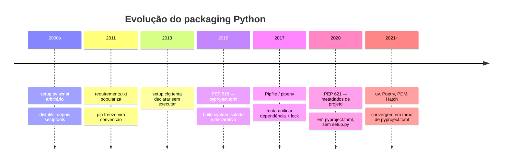

# Panorama — por que packaging Python era confuso

> [!abstract] TL;DR
> Por quase vinte anos, um projeto Python real podia acumular `setup.py`, `setup.cfg`, `requirements.txt` e `Pipfile` ao mesmo tempo — cada arquivo respondendo por um pedaço do problema (empacotar, declarar metadados, listar dependências, travar versões), nenhum deles sendo a fonte única de verdade, e nenhum coordenando os outros. O PEP 518 (2016) começou a consertar isso introduzindo `pyproject.toml` como ponto de partida de um padrão comum — que o PEP 621 completaria depois, unificando metadados de projeto num único arquivo declarativo. Este galho cobre a versão moderna dessa história: `pyproject.toml` (nota 03), `uv` e Poetry como gerenciadores completos (notas 04-06) e `ruff`/`black` para qualidade de código automática (nota 07). Esta nota é só o mapa — e o porquê de tanta ferramenta ter existido em paralelo.

## Um projeto, quatro arquivos, uma pergunta sem resposta

Você acabou de entrar num time novo. No primeiro dia, clona o repositório do serviço principal e abre a raiz do projeto. Encontra isto:

```text
projeto/
├── setup.py
├── setup.cfg
├── requirements.txt
├── requirements-dev.txt
├── Pipfile
├── Pipfile.lock
└── src/
```

Seis arquivos de configuração antes de você ter lido uma linha de código de negócio. Você faz a pergunta óbvia no canal do time: "qual desses é a fonte de verdade das dependências?" A resposta que chega, meia hora depois, é desconfortável: "depende". O `requirements.txt` é o que o CI usa. O `Pipfile.lock` é de uma tentativa de migração pra `pipenv` que ninguém terminou, mas o time de infra ainda roda localmente às vezes. O `setup.py` declara `install_requires` com versões diferentes das do `requirements.txt`, porque foi atualizado numa PR e ninguém lembrou de sincronizar o resto. O `setup.cfg` tem metadados do pacote (nome, versão, autor) que também aparecem, duplicados, dentro do `setup.py`.

Nada disso é malícia ou preguiça de alguém em particular. É o resultado acumulado de um ecossistema que, por quase duas décadas, nunca teve **um único arquivo declarativo e um único padrão** que todas as ferramentas (empacotador, instalador, resolvedor de versão, publicador) concordassem em ler. Cada ferramenta resolveu o pedaço que precisava resolver, na época em que precisava resolver, sem esperar as outras.

> [!question]- Isso realmente foi assim, ou é exagero de quem não gosta de Python?
> Foi assim mesmo — e é documentado pela própria Python Packaging Authority (PyPA). O guia oficial de packaging.python.org tem uma seção inteira dedicada a explicar a diferença entre `setup.py`, `setup.cfg` e `pyproject.toml`, e por que a comunidade migrou de um pra outro ao longo dos anos. O PEP 518, que introduziu o `pyproject.toml` em 2016, começa justamente descrevendo o problema que resolve: não havia um jeito padronizado de declarar *quais ferramentas* um projeto precisava pra ser buildado, antes mesmo de instalar qualquer dependência do próprio projeto.

Esta nota é o mapa rápido dessa história — não pra lamentar o passado, mas pra você entender **por que** `pyproject.toml` existe do jeito que existe, e por que ele resolve um problema estrutural, não só estético.

## A linha do tempo, em quatro paradas



Vale ler essa linha do tempo como quatro tentativas sucessivas de resolver o mesmo problema — cada uma corrigindo um defeito da anterior, sem necessariamente resolver o problema inteiro.

### Parada 1 — `setup.py`: um script, não uma declaração

O `setup.py` nasceu com o `distutils` (biblioteca padrão) e foi consolidado pelo `setuptools`. Na prática, é um **arquivo Python executável**: para instalar o pacote, o `pip` (ou qualquer ferramenta) precisa *rodar* esse script.

```python
# setup.py — um exemplo típico da era clássica
from setuptools import setup, find_packages

setup(
    name="meu-pacote",
    version="1.2.0",
    packages=find_packages(),
    install_requires=[
        "requests>=2.25",
        "click>=8.0",
    ],
)
```

O problema estrutural não é a sintaxe — é o fato de ser **código arbitrário**. Nada impede que esse `setup.py` faça uma chamada de rede, leia variáveis de ambiente, ou execute qualquer lógica condicional antes de chegar na chamada `setup(...)`. Isso quer dizer que **instalar um pacote** — uma operação que soa passiva, "só copiar arquivos" — na verdade significa **executar código de terceiros na sua máquina**, com os mesmos privilégios do processo que roda o instalador.

> [!warning] `setup.py` como vetor de risco
> Esse não é um risco teórico: executar código arbitrário como efeito colateral de instalar uma dependência é uma categoria real de ataque de supply chain — um pacote malicioso publicado no PyPI pode rodar payload arbitrário no `setup.py` no momento em que alguém digita `pip install pacote-malicioso`, antes mesmo de qualquer linha do código "de verdade" do pacote ser importada. Este galho não desenvolve esse ângulo a fundo — ele já foi tratado pela lente de segurança em [[03-Dominios/Tecnologia/Python/Segurança/07 - Segurança de dependências e supply chain|Galho 11 nota 07]] (lockfiles, `pip-audit`, typosquatting). Aqui o ponto é só: essa é uma das razões estruturais que empurrou o ecossistema pra longe de manifestos executáveis e em direção a manifestos **declarativos**.

Além do risco, havia um problema mais mundano: **introspecção**. Se um metadado (a versão do pacote, por exemplo) só existe depois de rodar um script Python arbitrário, qualquer ferramenta que precise *ler* esse metadado sem instalar o pacote — um índice, um resolvedor de dependências, um scanner de segurança — precisa, na prática, executar esse script só pra descobrir um número. Lento, frágil e, de novo, arriscado.

### Parada 2 — `setup.cfg`: declarar sem executar

O `setup.cfg` foi a primeira tentativa séria de separar **o que o pacote é** (metadados: nome, versão, autor, dependências) de **como ele é construído** (lógica de build, que continua podendo viver num `setup.py` mínimo). É um arquivo `.ini`, puramente declarativo — sem execução de código Python pra ler os metadados básicos.

```ini
# setup.cfg
[metadata]
name = meu-pacote
version = 1.2.0
author = Time de Plataforma

[options]
packages = find:
install_requires =
    requests>=2.25
    click>=8.0
```

Isso já resolvia parte do problema de introspecção — uma ferramenta podia ler nome e versão sem executar nada. Mas era uma solução parcial: o `setup.py` continuava existindo (mesmo que reduzido a `setup()` sem argumentos, só pra "ativar" a leitura do `.cfg`), e configuração de outras ferramentas do projeto (linter, formatter, test runner) continuava espalhada em arquivos próprios — `.flake8`, `pytest.ini`, `.isort.cfg`. Menos um problema, mas o projeto ainda tinha um arquivo de configuração por ferramenta.

### Parada 3 — `requirements.txt`: uma lista, não um lockfile

Em paralelo à evolução de `setup.py`/`setup.cfg` — que resolvem "como empacotar e instalar **este** pacote" —, surgiu um problema diferente: como declarar e reproduzir **o ambiente de dependências** de uma aplicação (que não é, necessariamente, um pacote publicado no PyPI). A resposta que virou convenção foi o `requirements.txt`, geralmente gerado com `pip freeze`:

```text
# requirements.txt gerado com `pip freeze`
certifi==2024.2.2
charset-normalizer==3.3.2
click==8.1.7
idna==3.6
requests==2.31.0
urllib3==2.2.1
```

À primeira vista, isso parece um lockfile: versões exatas, uma por linha. O problema é sutil e importante: **`pip freeze` captura o que está instalado no ambiente atual, não resolve determinismo**. Ele não registra:

- **De onde** cada dependência veio (índice, hash do artefato baixado) — só a versão.
- **Por que** ela está lá — se é uma dependência direta do seu código ou uma transitiva de outra biblioteca (o arquivo mistura as duas, sem distinção).
- **Se o grafo de resolução é reproduzível** em outra máquina, outro sistema operacional ou outra versão de Python — `pip freeze` só fotografa o que já foi resolvido uma vez, localmente.

Editar esse arquivo à mão pra adicionar uma dependência nova é comum — e é aí que a lista diverge silenciosamente do que está de fato instalado. Sem hash de integridade, sem separação entre direto/transitivo, sem metadados de resolução: uma lista de versões é um retrato, não uma garantia.

> [!tip] Lockfile de verdade é outra coisa
> Um lockfile de verdade (como o que `uv` ou Poetry geram — [[04 - uv — o gerenciador moderno|nota 04]] e [[05 - Poetry — a alternativa madura|nota 05]]) registra o grafo de resolução inteiro, com hashes de integridade por artefato, de um jeito que reproduz **exatamente** o mesmo ambiente em qualquer máquina. `requirements.txt` gerado por `pip freeze` não faz isso — é uma convenção útil, mas não é o mesmo mecanismo.

### Parada 4 — `Pipfile`/`Pipfile.lock`: a tentativa do `pipenv`

Por volta de 2017, o `pipenv` tentou resolver o problema do `requirements.txt` de uma vez: um `Pipfile` (formato TOML, separando dependências de produção e desenvolvimento) mais um `Pipfile.lock` (lockfile de verdade, com hashes). Por um tempo, foi endossado como recomendação oficial da PyPA para aplicações (não bibliotecas).

```toml
# Pipfile
[packages]
requests = ">=2.25"
click = ">=8.0"

[dev-packages]
pytest = "*"

[requires]
python_version = "3.11"
```

O `pipenv` teve seu momento — resolveu o problema de determinismo que o `requirements.txt` não resolvia, e trouxe um comando único (`pipenv install`, `pipenv lock`) pra substituir a combinação de `pip` + edição manual de arquivo. Mas teve dois problemas que limitaram sua adoção de longo prazo: resolução de dependências historicamente lenta em projetos grandes, e o fato de resolver **só** o problema de dependência de aplicação — sem tocar em empacotamento de biblioteca (`setup.py` continuava sendo necessário pra quem publicava pacotes no PyPI). Hoje o `pipenv` ainda existe e é mantido, mas perdeu tração para as ferramentas que se organizaram em torno do `pyproject.toml` — é por isso que este galho não dedica uma nota própria a ele.

## O problema estrutural: pedaços sem padrão comum

Reunindo os quatro arquivos, o padrão fica visível:

| Arquivo | Resolve | Não resolve |
|---|---|---|
| `setup.py` | Empacotar e publicar (via código arbitrário) | Introspecção segura, determinismo |
| `setup.cfg` | Declarar metadados sem executar código | Ainda depende de `setup.py`; não cobre dependências de app nem config de outras ferramentas |
| `requirements.txt` | Listar dependências de forma legível | Lockfile de verdade (hash, grafo, reprodutibilidade) |
| `Pipfile`/`Pipfile.lock` | Lock determinístico de dependências de app | Empacotamento de biblioteca; adoção murchou frente ao `pyproject.toml` |

Nenhuma dessas ferramentas era "errada" isoladamente — cada uma resolvia bem o pedaço que se propôs a resolver. O problema era **estrutural**: empacotar, instalar, resolver versão e publicar são facetas do mesmo problema (gerenciar um projeto Python), mas cada faceta ganhou sua própria ferramenta, seu próprio formato de arquivo, e nenhuma delas era obrigada a conversar com as outras. Um projeto real acumulava as sobras de cada geração de ferramenta, porque migrar tudo de uma vez tem custo e raramente é prioridade.

> [!question]- Por que isso demorou tanto pra ser resolvido, se o problema era claro?
> Em parte, porque a comunidade Python cresceu organicamente ao redor de ferramentas mantidas por grupos diferentes (distutils/setuptools na biblioteca padrão e depois fora dela, pip como instalador separado, PyPA coordenando padrões via PEPs) — sem um "dono" único do fluxo inteiro de build, como uma linguagem mais nova poderia desenhar desde o início. Padronizar exigiu, primeiro, um consenso sobre *qual arquivo* seria a fonte comum (PEP 518), e só depois um consenso sobre *o que* esse arquivo declara (PEP 621) — dois PEPs, quatro anos de distância um do outro, e ainda alguns anos até a maioria das ferramentas do ecossistema migrar de fato.

O PEP 518 (2016) foi o primeiro passo real de convergência: introduziu o `pyproject.toml` como um arquivo declarativo (TOML, não Python executável) cuja seção `[build-system]` diz explicitamente **quais ferramentas** são necessárias pra buildar o projeto — antes mesmo de instalar qualquer dependência dele. O PEP 621 (2020) completou o quadro, padronizando a seção `[project]` para os metadados que antes viviam espalhados entre `setup.py` e `setup.cfg`. A [[03 - pyproject.toml — o padrão unificado|nota 03]] deste galho desenvolve os dois PEPs e o formato completo do arquivo.

## Contraste rápido: e nas outras stacks?

Vale um parênteses curto — não pra desenvolver, só pra situar. A trilha Java já tratou esse mesmo problema (build + dependências) em [[03-Dominios/Tecnologia/Java/Build e tooling/index|Java — Build e tooling]], e o contraste é instrutivo: Maven e Gradle nunca passaram por essa fragmentação de quatro-arquivos-por-ferramenta. Desde o começo, um projeto Java tem **um** arquivo declarativo central — o `pom.xml` (Maven) ou o build script (Gradle) — que já nasceu cobrindo build, dependências (incluindo transitivas) e ciclo de vida como uma coisa só, porque as duas ferramentas foram desenhadas de propósito como "gestor de build + dependências" unificado desde a primeira versão relevante de cada uma.

Python não teve esse luxo de design centralizado desde o início — o ecossistema cresceu por acréscimo, ferramenta por ferramenta, ao longo de mais de vinte anos, antes de convergir. O resultado prático de hoje, porém, é parecido: com `pyproject.toml` maduro e ferramentas como `uv` ou Poetry construídas sobre ele, um projeto Python moderno também tem um único arquivo declarativo central — só chegou lá por um caminho mais longo e mais acidentado.

## Armadilhas

### (1) Achar que "só preciso adicionar um `pyproject.toml`" resolve tudo sozinho

Migrar de verdade não é criar um `pyproject.toml` ao lado dos arquivos antigos — é **substituir** `setup.py`/`setup.cfg`/`requirements.txt` pelo conteúdo equivalente dentro dele, e então apagar os arquivos legados. Um `pyproject.toml` criado "pra constar", enquanto o CI ainda lê `requirements.txt` e o `setup.py` continua sendo o que o `pip install -e .` de fato executa, não elimina a fragmentação — só acrescenta um sétimo arquivo à pilha.

Exemplo: alguém adiciona `pyproject.toml` com `[project]` completo numa PR, mas o Dockerfile de produção continua rodando `pip install -r requirements.txt`. As duas fontes divergem na primeira dependência nova que só é adicionada num dos dois lugares.

Fix: tratar a migração como uma troca completa, não uma adição — e conferir, com um `grep` simples no repositório, se ainda existe alguma referência a `setup.py`/`requirements.txt` em scripts de CI, Dockerfile ou documentação antes de considerar a migração terminada.

### (2) Confundir "declarativo" com "sem risco"

`pyproject.toml` resolve o problema de **executar código arbitrário só pra ler metadados** — mas isso não significa que instalar dependências ficou livre de risco de supply chain. A seção `[build-system]` ainda pode apontar para um backend de build customizado, e pacotes individuais ainda podem ter hooks de build (`build_ext`, por exemplo) que executam código. O ganho é estrutural (menos execução por padrão, mais introspecção segura), não uma garantia absoluta.

Fix: tratar isso como redução de superfície de ataque, não eliminação — e lembrar que a defesa de fato contra pacote malicioso é lockfile com hash + auditoria, coberto em [[03-Dominios/Tecnologia/Python/Segurança/07 - Segurança de dependências e supply chain|Galho 11 nota 07]], não o formato do manifesto.

### (3) Achar que `pip freeze > requirements.txt` é "gerar um lockfile"

É um erro comum, especialmente vindo de quem só usou `pip` puro. `pip freeze` fotografa o ambiente local — inclui o que está instalado, mas não registra hash de integridade, não distingue dependência direta de transitiva, e não garante que a resolução seja reproduzível em outro sistema operacional ou versão de Python.

Exemplo: um `requirements.txt` gerado num Mac com `pip freeze` trava numa dependência que só tem wheel pré-compilado para macOS; o CI, rodando Linux, tenta compilar do zero e falha — porque o "lockfile" nunca registrou essa dependência de plataforma.

Fix: usar um gerenciador com resolução declarada e lockfile de verdade (`uv lock`, `poetry lock`) quando reprodutibilidade entre máquinas/SOs importa — o que, em qualquer projeto além de um script pessoal, é sempre.

## Em entrevista

### Frase pronta (inglês)

> Python packaging was fragmented for close to two decades: `setup.py` was an arbitrary, executable script — which made metadata introspection slow and installation a real supply-chain risk — `setup.cfg` made metadata declarative but still depended on `setup.py`, and `requirements.txt` listed dependencies without being a true lockfile, since `pip freeze` only snapshots what's installed locally rather than resolving a reproducible dependency graph with integrity hashes. PEP 518, in 2016, introduced `pyproject.toml` as a declarative, tool-agnostic manifest, and PEP 621 later standardized project metadata inside it — which is what modern tools like `uv` and Poetry build on today.

### Vocabulário

| Termo PT | Termo EN |
| --- | --- |
| Empacotamento | Packaging |
| Manifesto declarativo | Declarative manifest |
| Arquivo de bloqueio (lockfile) | Lockfile |
| Metadados do projeto | Project metadata |
| Dependência transitiva | Transitive dependency |
| Hash de integridade | Integrity hash |
| Resolução de dependências | Dependency resolution |
| Ataque de cadeia de suprimentos | Supply chain attack |

## O mapa deste galho

Esta nota fecha o "porquê" histórico. As sete notas seguintes cobrem o estado da arte:

1. [[02 - Virtual environments — isolamento de dependências|02 — Virtual environments]] — isolar dependências por projeto com `venv`, antes de falar em gerenciadores de projeto completos.
2. [[03 - pyproject.toml — o padrão unificado|03 — pyproject.toml]] — PEP 518/621 na prática: `[project]`, `[build-system]`, `[tool.*]`, tudo num arquivo só.
3. [[04 - uv — o gerenciador moderno|04 — uv]] — o gerenciador escrito em Rust (Astral) que hoje domina a conversa sobre velocidade.
4. [[05 - Poetry — a alternativa madura|05 — Poetry]] — a ferramenta que chegou antes do `uv` e que ainda tem adoção sólida em produção.
5. [[06 - uv vs Poetry — trade-offs honestos|06 — uv vs Poetry]] — comparação direta, sem fingir empate onde não há.
6. [[07 - ruff e black — linting e formatação automática|07 — ruff e black]] — qualidade de código automatizada, integrada ao `pyproject.toml`.
7. [[08 - Capstone — tooling consistente nos dois serviços|08 — Capstone]] — aplicar tudo isso nos dois serviços Python construídos no Galho 15.

> [!tip] Por que isso importa pra quem já manda em Java ou outra stack madura
> Se você já trabalhou com Maven/Gradle, npm/pnpm ou Cargo, o `pyproject.toml` + `uv`/Poetry vai parecer familiar — porque é, estruturalmente, a mesma ideia (manifesto declarativo único + lockfile + gerenciador de projeto). A diferença é que Python chegou lá recentemente, e você ainda vai encontrar projetos legados (e times) presos nos arquivos da era anterior. Reconhecer esse histórico ajuda a explicar, sem julgamento, por que um repositório legado tem seis arquivos de configuração — e a argumentar com confiança por uma migração pra `pyproject.toml`.

## Fontes

- Python Packaging Authority — *Packaging Python Projects* / *pyproject.toml specification* — https://packaging.python.org/ (consultado 2026-07)
- PEP 518 — *Specifying Minimum Build System Requirements for Python Projects* (2016) — https://peps.python.org/pep-0518/
- PEP 621 — *Storing project metadata in pyproject.toml* (2020) — https://peps.python.org/pep-0621/
- Python Packaging Authority — *Historical overview of Python packaging* — https://packaging.python.org/en/latest/discussions/setup-py-deprecated/ (consultado 2026-07)
- pipenv — *Documentation* — https://pipenv.pypa.io/ (consultado 2026-07)
