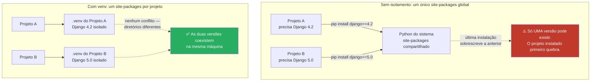

# Virtual environments — isolamento de dependências

> [!abstract] TL;DR
> Sem isolamento, todo projeto Python de uma máquina compartilha o mesmo `site-packages` global — instalar uma dependência para o projeto A pode silenciosamente quebrar o projeto B, ou pior, quebrar ferramentas do próprio sistema operacional que dependem daquele Python. `venv`, módulo nativo da stdlib desde o Python 3.3, resolve isso criando uma cópia leve do interpretador com um `site-packages` próprio e vazio por projeto: `python -m venv .venv` cria, `source .venv/bin/activate` ativa, `deactivate` sai. É a base sobre a qual `pip`, `uv` e Poetry constroem tudo — nenhuma dessas ferramentas isola dependências por mágica própria; todas usam (ou reimplementam) o mesmo mecanismo de venv por baixo.

## O dia em que o `apt` parou de funcionar

Um cenário comum o suficiente para ter nome próprio em fóruns de suporte Linux: um desenvolvedor, no meio de um projeto qualquer, precisa de uma versão mais nova de uma biblioteca — digamos, `PyYAML` — e roda o comando mais óbvio do mundo:

```bash
sudo pip install pyyaml==6.0
```

O comando funciona. A instalação termina sem erro. E na tentativa seguinte de atualizar o sistema:

```bash
$ sudo apt update
Traceback (most recent call last):
  File "/usr/lib/cnf-update-db", line 8, in <module>
    import apt_pkg
ModuleNotFoundError: No module named 'apt_pkg'
```

O `apt`, gerenciador de pacotes do Ubuntu/Debian, é escrito em Python — e depende de uma versão **muito específica** de `PyYAML` e de outras bibliotecas do sistema, instaladas no Python global da distro. O `sudo pip install` da linha acima não criou nada isolado: ele escreveu direto no mesmo `site-packages` que o `apt` usa, substituindo a versão que o sistema esperava por uma incompatível. O resultado não é um erro no código do desenvolvedor — é o próprio gerenciador de pacotes do sistema operacional quebrado, exigindo reinstalação manual de pacotes do SO para recuperar.

Esse não é um caso hipotético raro; é recorrente o suficiente para a documentação oficial do Python recomendar explicitamente **nunca** instalar pacotes de projeto no interpretador global do sistema — só usar o Python do SO através de um ambiente isolado, ou reservar instalação global para ferramentas do próprio sistema operacional. A [[01 - Panorama — por que packaging Python era confuso|nota 01 deste galho]] já mapeou o caos histórico de ferramentas (`setup.py`, `requirements.txt`, `Pipfile`) tentando resolver pedaços do problema de dependências — esta nota cobre a peça que faz **todas** elas funcionarem sem se destruir mutuamente: isolar cada projeto num ambiente próprio.

> [!question]- E se o problema fosse só "preciso de sudo pra instalar", por que não simplesmente evitar `sudo`?
> Evitar `sudo` ajuda a não quebrar o Python do sistema operacional (que normalmente exige privilégio de root pra escrever em `/usr/lib/python3.x/site-packages`), mas não resolve o problema de fundo: mesmo `pip install --user pyyaml==6.0`, sem `sudo`, ainda escreve num `site-packages` **compartilhado por todos os projetos do seu usuário**. Se o Projeto A precisa de `PyYAML 5.x` e o Projeto B precisa de `PyYAML 6.x`, não existe jeito de os dois coexistirem no mesmo `site-packages` — um comando de instalação sempre sobrescreve o outro. O problema não é privilégio de root, é ausência de isolamento por projeto.

## O que `venv` cria, de fato

`python -m venv .venv` não copia o interpretador Python inteiro (isso seria caro em disco e lento de criar). Na maioria das plataformas modernas, ele cria uma estrutura de diretório leve com:

- Um **link simbólico** (ou uma cópia pequena, dependendo da plataforma) para o executável do Python que foi usado para criar o venv — é por isso que `.venv/bin/python --version` reporta a mesma versão do Python que rodou o comando `venv`.
- Um diretório `site-packages` **vazio e isolado** (`.venv/lib/python3.x/site-packages/`) — nenhuma dependência do sistema global é copiada pra dentro. O venv começa limpo.
- Scripts de ativação (`.venv/bin/activate` em Unix/macOS, `.venv/Scripts/activate.ps1` no Windows) que manipulam variáveis de ambiente do shell atual — principalmente `PATH` e `VIRTUAL_ENV` — para que comandos como `python` e `pip`, digitados sem caminho completo, resolvam para os binários **dentro** do venv, não os do sistema.
- Um arquivo `pyvenv.cfg`, que registra qual interpretador base gerou o venv e algumas flags de configuração.

```bash
# Cria o venv no diretório .venv (convenção quase universal —
# outros nomes comuns: venv/, env/, .env/, mas .venv/ é o mais adotado
# porque o ponto inicial já sinaliza "arquivo de config oculto")
python -m venv .venv

# Estrutura resultante (Linux/macOS)
.venv/
├── bin/
│   ├── python -> /usr/bin/python3.12   # link simbólico pro interpretador base
│   ├── pip
│   └── activate                          # script de ativação
├── lib/
│   └── python3.12/
│       └── site-packages/                # vazio — nenhuma dependência ainda
└── pyvenv.cfg
```

Nenhuma dependência é instalada nesse momento — `venv` só cria o **contêiner** isolado. O `pip install` (ou `uv add`, coberto na [[04 - uv — o gerenciador moderno|nota 04]]) roda **depois**, dentro do venv ativo, e escreve exclusivamente no `site-packages` daquele diretório.

## Ativação: o que muda de fato no shell

```bash
# Antes de ativar
$ which python
/usr/bin/python3        # aponta pro Python global do sistema

$ source .venv/bin/activate
(.venv) $ which python
/caminho/do/projeto/.venv/bin/python   # agora aponta pro Python do venv

(.venv) $ python -c "import sys; print(sys.prefix)"
/caminho/do/projeto/.venv               # confirma: este é o prefixo do venv, não o global
```

`activate` é um script que roda **no contexto do shell atual** (por isso `source`, não execução direta — precisa alterar variáveis do processo pai, o próprio shell, não de um subprocesso). Ele prepende `.venv/bin` ao `PATH`, então qualquer comando `python` ou `pip` digitado a partir dali resolve para os binários do venv antes de chegar aos do sistema. Também define `VIRTUAL_ENV` como variável de ambiente, e — na maioria dos shells interativos — altera o prompt, prefixando `(.venv)` visivelmente, exatamente como no bloco acima.

`deactivate` reverte tudo: remove `.venv/bin` do `PATH`, apaga `VIRTUAL_ENV`, restaura o prompt original.

```bash
(.venv) $ deactivate
$ which python
/usr/bin/python3        # voltou pro sistema
```

No Windows, o script equivalente vive em `.venv\Scripts\` em vez de `.venv/bin/`, e a sintaxe de ativação muda conforme o shell:

```powershell
# PowerShell
.venv\Scripts\Activate.ps1

# Prompt de Comando (cmd.exe)
.venv\Scripts\activate.bat
```

O mecanismo é idêntico ao Unix — manipular `PATH` e `VIRTUAL_ENV` no processo do shell atual — só o caminho e a extensão do script mudam. `deactivate` funciona igual nos três casos, já que vira um comando disponível no shell enquanto o venv está ativo.

> [!warning] O Python "do sistema" em distros Linux modernas já resiste a `pip install` fora de venv
> Distribuições recentes baseadas em Debian (Ubuntu 23.04+, Debian 12+) implementam a **PEP 668** e marcam o Python do sistema como `externally-managed-environment`: rodar `pip install pacote` fora de qualquer venv ativo agora falha com um erro explícito em vez de instalar silenciosamente, exatamente para prevenir o cenário do `apt` quebrado no início desta nota. É uma rede de segurança tardia — o incidente já foi comum o suficiente para justificar a mudança de comportamento padrão — mas não substitui o hábito de sempre trabalhar dentro de um venv; em sistemas mais antigos, ou fora de Linux, a proteção não existe e o `pip install` fora de venv continua indo direto para o `site-packages` global sem aviso.

> [!tip] Como saber se você está DENTRO de um venv ativo, com certeza
> O prefixo `(.venv)` no prompt é o sinal mais visível, mas shells customizados às vezes suprimem isso. O jeito confiável, que funciona em qualquer shell, é checar a variável de ambiente que `activate` sempre define:
> ```bash
> echo $VIRTUAL_ENV
> # Se vazio: nenhum venv ativo
> # Se preenchido: caminho absoluto do venv ativo, ex. /caminho/do/projeto/.venv
> ```
> Alternativa equivalente: `which python` (ou `python -c "import sys; print(sys.prefix)"`) — se o caminho aponta para dentro de `.venv/`, você está isolado; se aponta para `/usr/bin` ou similar, você está usando o Python global e qualquer `pip install` vai poluir o `site-packages` compartilhado.

## Qual interpretador o venv usa — e por que isso importa

`venv` não escolhe a versão de Python sozinho: ele usa **o interpretador que foi invocado** para criar o ambiente. Numa máquina com várias versões instaladas lado a lado (comum em qualquer ambiente de desenvolvimento que precisa suportar mais de um projeto com requisitos diferentes), o comando muda o resultado:

```bash
python3.11 -m venv .venv    # cria um venv baseado no Python 3.11
python3.12 -m venv .venv    # cria um venv baseado no Python 3.12 — versão diferente

# Depois de ativado, confirme qual versão o venv está usando de fato:
(.venv) $ python --version
Python 3.12.4
```

Isso é relevante porque o `pyvenv.cfg` gerado dentro do venv registra o caminho do interpretador-base, e o venv **não** troca de versão de Python sozinho depois de criado — se o projeto precisa migrar de 3.11 para 3.12, o caminho é apagar o `.venv/` antigo e recriar com o interpretador novo, não "atualizar" o existente. A versão exata exigida pelo projeto normalmente fica declarada no `pyproject.toml` (`requires-python`, ver [[03 - pyproject.toml — o padrão unificado|nota 03 deste galho]]), que serve de contrato entre "o que o código espera" e "qual interpretador deveria ter sido usado para criar o venv".

> [!tip] Gerenciar múltiplas versões de Python instaladas na máquina é um problema separado
> Ferramentas como `pyenv` resolvem "eu preciso ter Python 3.10, 3.11 e 3.12 instalados simultaneamente no sistema, e escolher qual usar por projeto" — um problema anterior e complementar ao de `venv`. `venv` isola **dependências** de um projeto já sabendo qual interpretador usar; `pyenv` (ou similar) isola **qual interpretador está disponível** para o `venv` escolher. Os dois trabalham em conjunto: `pyenv` instala e seleciona a versão do Python, `venv` (ou `uv`/Poetry por baixo) cria o ambiente isolado a partir dela. Ferramenta fora do escopo desta nota — mencionada aqui só para não confundir os dois problemas.

## Por que isolar é essencial, não opcional

O incidente do `apt` no início desta nota é o caso extremo — quebrar o próprio sistema operacional. O caso do dia a dia, mais comum, é conflito entre dois projetos:



> [!info] Leitura do diagrama
> No lado esquerdo (sem isolamento), os dois projetos competem pelo mesmo `site-packages` — não existe versionamento por projeto, só um estado global mutável que a última instalação sobrescreve. No lado direito, cada `.venv/` tem seu próprio `site-packages`, então `Django 4.2` e `Django 5.0` instalados simultaneamente na mesma máquina não colidem: são diretórios físicos diferentes, cada um referenciado apenas pelo `PATH` do shell **enquanto aquele venv específico está ativo**.

A regra prática decorrente é simples: **todo projeto Python real ganha seu próprio `.venv/`**, criado uma vez (`python -m venv .venv`) e ativado sempre que você for trabalhar naquele projeto especificamente. Isso vale mesmo para projetos pequenos ou scripts únicos — o custo de criar um venv (segundos, poucos KB de overhead além das dependências instaladas) é desprezível comparado ao custo de descobrir, meses depois, que dois projetos na mesma máquina estão brigando pela mesma dependência global.

## `.gitignore`: por que `.venv/` nunca é commitado

O diretório `.venv/` **nunca** deve entrar no controle de versão. Três motivos se somam:

1. **Tamanho.** Um venv com poucas dependências já soma dezenas de megabytes; um projeto com bibliotecas de data science ou ML facilmente passa de várias centenas de MB — puro peso morto num repositório Git, que não foi desenhado para versionar binários grandes eficientemente.
2. **Portabilidade quebrada.** O venv contém caminhos absolutos hardcoded (o script `activate` referencia o caminho exato de onde o venv foi criado) e binários compilados específicos da plataforma onde foi gerado. Um `.venv/` criado num Linux não funciona clonado num macOS ou Windows.
3. **Redundância total.** Tudo que o venv contém é **reproduzível** a partir de duas informações que já ficam versionadas: a versão do Python (declarada no `pyproject.toml`, [[03 - pyproject.toml — o padrão unificado|nota 03 deste galho]]) e a lista exata de dependências travadas num lockfile ([[04 - uv — o gerenciador moderno|nota 04]]). Não existe informação no `.venv/` que não possa ser regenerada rodando `python -m venv .venv` seguido de instalar as dependências do lockfile.

```gitignore
# .gitignore — padrão para qualquer projeto Python
.venv/
venv/
env/
__pycache__/
*.pyc
```

> [!warning] `.venv/` commitado por acidente é comum em `git init` feito dentro do venv já criado
> Um erro recorrente: criar o venv primeiro (`python -m venv .venv`), instalar dependências, e só depois rodar `git init` sem configurar `.gitignore` antes do primeiro `git add .`. O resultado é um repositório com centenas de arquivos binários commitados, exigindo reescrita de histórico (`git filter-repo` ou similar) pra remover depois — trabalho evitável rodando `git init` e configurando `.gitignore` **antes** de qualquer `git add`, ou verificando `git status` logo após criar o venv para confirmar que ele aparece como não rastreado.

O que **é** versionado, em contraste, é exatamente a receita para recriar o ambiente: `pyproject.toml` (dependências declaradas) e o lockfile (`uv.lock`, `poetry.lock`, ou `requirements.txt` com hashes) — cobertos nas próximas notas deste galho. Qualquer pessoa que clone o repositório recria o ambiente idêntico com dois comandos, sem depender de arquivos binários versionados:

```bash
python -m venv .venv
source .venv/bin/activate
pip install -r requirements.txt   # ou: uv sync / poetry install
```

## Alternativas históricas e paralelas

`venv` só entrou na biblioteca padrão do Python no **Python 3.3** (2012), especificado pela PEP 405. Antes disso — e ainda hoje, em bases de código legadas ou específicas — dois outros nomes aparecem:

- **`virtualenv`** — pacote de terceiros que existia **antes** de `venv` ser nativo, e que inspirou diretamente o design do módulo que entrou na stdlib. `virtualenv` continua mantido e em uso ativo hoje porque oferece recursos que `venv` não tem: suporte a versões de Python mais antigas que 3.3, criação de venvs mais rápida (usa técnicas de cache que `venv` não implementa), e compatibilidade com Python 2 (relevante só em manutenção de sistemas legados). Para qualquer projeto novo em Python 3 moderno, `venv` nativo é suficiente e elimina uma dependência externa — não há motivo para instalar `virtualenv` a menos que um desses recursos específicos seja necessário.
- **`conda`** — não é um substituto direto de `venv`, é um gerenciador de ambiente **mais pesado**, popular no ecossistema de ciência de dados e machine learning, porque gerencia não só pacotes Python mas também dependências binárias não-Python (bibliotecas C/C++/Fortran como CUDA, MKL, ou compiladores inteiros) que `pip`/`venv` não conseguem instalar sozinhos. Fora do escopo desta trilha, focada em desenvolvimento backend/fullstack, onde `venv` + `pip`/`uv` cobre o necessário sem a complexidade adicional de gerenciar um índice de pacotes paralelo (`conda-forge`) e ambientes que não seguem exatamente as mesmas convenções do PyPI.

> [!question]- Se `uv` e Poetry (notas seguintes) já gerenciam ambientes, por que aprender `venv` puro primeiro?
> Porque `uv` e Poetry não reinventam o isolamento — `uv venv` e `poetry env` criam, por baixo, a mesma estrutura de diretório que `python -m venv` cria (ou uma variante compatível), e ativam o ambiente do mesmo jeito fundamental: manipulando `PATH` para priorizar um `site-packages` isolado. Entender `venv` nativo primeiro significa que, quando `uv sync` ou `poetry install` fizer algo inesperado, você reconhece a mecânica por baixo em vez de tratar a ferramenta como caixa-preta. A [[04 - uv — o gerenciador moderno|nota 04]] e a [[05 - Poetry — a alternativa madura|nota 05]] assumem esse entendimento como base.

## Armadilhas comuns

> [!warning] Esquecer de ativar o venv antes de instalar
> **O que acontece:** o `.venv/` existe no projeto, mas o desenvolvedor roda `pip install biblioteca` sem antes rodar `source .venv/bin/activate` — a instalação vai para o Python global (ou para o venv de outro projeto que ficou ativo de uma sessão de terminal anterior). **Por quê:** criar o venv não o ativa automaticamente; são dois passos distintos, e um terminal recém-aberto nunca começa com um venv ativo por padrão. **Como evitar:** checar `$VIRTUAL_ENV` (ou o prefixo no prompt) antes de qualquer `pip install`; ferramentas como `direnv` podem automatizar ativação ao entrar no diretório do projeto, mas o hábito de checar antes de instalar é a defesa mais barata.

> [!warning] Um venv por máquina em vez de um venv por projeto
> **O que acontece:** criar um único `.venv` "geral" em `~/.venv` e ativá-lo pra todo trabalho Python, achando que já resolve o isolamento. **Por quê:** isso reproduz exatamente o problema original em escala menor — todos os projetos voltam a compartilhar o mesmo `site-packages`, só que agora é o `site-packages` do venv geral em vez do sistema. O conflito de versões entre Projeto A e Projeto B volta a existir. **Como evitar:** um `.venv/` por diretório de projeto, sempre. É barato o suficiente (segundos pra criar, dezenas de MB) para nunca valer a pena compartilhar.

## Como explicar em inglês

> "Without isolation, every Python project on a machine shares the same global `site-packages` — install a dependency for one project and you can silently break another, or even break OS tooling that depends on that same Python interpreter, which is a real failure mode on Debian-based systems where `apt` itself is a Python script with pinned dependency versions. `venv`, native to the standard library since Python 3.3, solves this by creating a lightweight, isolated environment per project: `python -m venv .venv` creates it, `source .venv/bin/activate` activates it by prepending the venv's `bin` directory to `PATH`, and `deactivate` reverts. The `.venv/` directory is never committed to version control — it's fully reproducible from the dependency list in `pyproject.toml` and the lockfile, so `.gitignore` always excludes it. Every modern tool — `uv`, Poetry — builds on this same underlying mechanism; understanding raw `venv` first means I recognize what those tools are actually doing under the hood."

| PT | EN |
|----|----|
| ambiente virtual | virtual environment |
| ativar/desativar o venv | activate/deactivate the venv |
| isolamento de dependências | dependency isolation |
| pacote instalado globalmente | globally installed package |
| conflito de versão | version conflict |
| diretório de pacotes | site-packages |
| variável de ambiente | environment variable |
| reproduzível a partir do lockfile | reproducible from the lockfile |

## Fontes

- **Python Packaging User Guide** — [*Installing packages using pip and virtual environments*](https://packaging.python.org/en/latest/guides/installing-using-pip-and-virtual-environments/) — guia oficial da PyPA sobre por que isolar dependências por projeto e como usar `venv`.
- **Python docs** — [*venv — Creation of virtual environments*](https://docs.python.org/3/library/venv.html) — documentação oficial do módulo, estrutura de diretório criada, e diferenças de comportamento entre plataformas.
- **PEP 405** — [*Python Virtual Environments*](https://peps.python.org/pep-0405/) — proposta original que trouxe `venv` para a biblioteca padrão no Python 3.3.
- **Real Python** — [*Python Virtual Environments: A Primer*](https://realpython.com/python-virtual-environments-a-primer/) — cobertura prática de ativação, `.gitignore`, e comparação com `virtualenv`.
- **PyPI** — [*virtualenv*](https://pypi.org/project/virtualenv/) — documentação do pacote de terceiros que precedeu `venv` nativo.
- **Documentação Debian/Ubuntu** — discussões de suporte sobre `ModuleNotFoundError: No module named 'apt_pkg'` após `pip install` fora de ambiente isolado sobrescrever dependências usadas pelo `apt` — padrão de incidente amplamente documentado em fóruns oficiais Ubuntu/Debian e na própria mensagem de aviso que `pip` emite ao detectar instalação fora de venv em sistemas Debian-based (erro `externally-managed-environment`, PEP 668).

Consultado em 2026-07-12.
