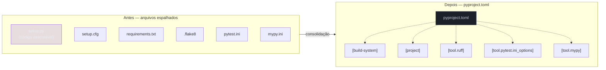
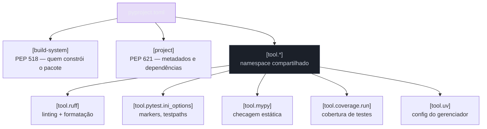

# pyproject.toml — o padrão unificado

> [!abstract] TL;DR
> `pyproject.toml` é o arquivo único que centraliza o que um projeto Python precisa para ser **construído** (`[build-system]`, PEP 518) e o que ele **é** (`[project]` — nome, versão, dependências, metadados, PEP 621). Mas o ganho real, o que faz esse arquivo substituir de fato meia dúzia de arquivos de configuração espalhados, é o namespace `[tool.*]`: qualquer ferramenta do ecossistema — ruff, black, pytest, mypy, coverage — pode reservar sua própria seção dentro do MESMO arquivo, em vez de exigir um arquivo próprio na raiz do projeto.

## Cinco arquivos, uma dor de cabeça

Um projeto Python de porte médio, por volta de 2019, tinha uma raiz assim:

```
meu_projeto/
├── setup.py
├── setup.cfg
├── requirements.txt
├── requirements-dev.txt
├── .flake8
├── pytest.ini
├── mypy.ini
└── meu_projeto/
    └── ...
```

Cada arquivo resolve um pedaço isolado do problema, com sintaxe própria, seção própria de documentação, e nenhuma relação formal entre si. `setup.py` é código Python executável que descreve como empacotar o projeto — o que já é estranho: para saber os metadados de um pacote (nome, versão, dependências), uma ferramenta como o `pip` precisa **executar** um script arbitrário, com todos os riscos de segurança e de reprodutibilidade que isso implica. `setup.cfg` tenta mover parte disso para um formato declarativo (INI), mas convive com `setup.py` em vez de substituí-lo. `requirements.txt` lista dependências de runtime, sem versão fixada de forma confiável a menos que alguém rode `pip freeze` manualmente. `.flake8`, `pytest.ini` e `mypy.ini` são três arquivos INI diferentes, cada um com sua própria sintaxe de seções, para configurar três ferramentas que, na prática, rodam sempre juntas no mesmo CI.

Ninguém decidiu deliberadamente ter sete arquivos de configuração na raiz — cada ferramenta foi adicionada em um momento diferente do projeto, resolvendo um problema pontual, e o acúmulo só virou visível quando alguém abre o projeto pela primeira vez e precisa entender "onde está configurado o quê". A [[03-Dominios/Tecnologia/Python/Build e tooling/01 - Panorama — por que packaging Python era confuso|nota 01 deste galho]] já cobriu essa fragmentação histórica em detalhe — o ponto aqui não é repetir o histórico, é mostrar a solução que emergiu dele: um único arquivo, `pyproject.toml`, que qualquer ferramenta do ecossistema pode usar como seção própria, sem precisar inventar mais um arquivo.



> [!tip] O alívio não é estético, é operacional
> Ter uma fonte única de verdade significa que "onde está a configuração de X" tem sempre a mesma resposta: abre `pyproject.toml` e procura `[tool.X]`. Isso importa mais em onboarding (um dev novo não precisa aprender sete formatos) e em ferramentas de análise (um linter de configuração, ou um bot de dependabot, só precisa entender um arquivo TOML) do que em qualquer economia de linhas.

## PEP 518: primeiro passo — só o build

O `pyproject.toml` não nasceu resolvendo tudo de uma vez. A [PEP 518](https://peps.python.org/pep-0518/) (2016) resolveu um problema bem mais estreito e mais urgente: como uma ferramenta como o `pip` sabe **quais pacotes instalar antes mesmo de tentar construir** um projeto, sem precisar executar `setup.py` primeiro (que já é, ele mesmo, um script Python com suas próprias dependências, criando um problema de ovo-e-galinha)? A resposta foi a seção `[build-system]`, com duas chaves:

```toml
[build-system]
requires = ["setuptools>=68.0", "wheel"]
build-backend = "setuptools.build_meta"
```

- `requires`: lista de pacotes que precisam estar instalados **antes** de qualquer tentativa de construir o projeto — o pip lê isso primeiro, instala esse conjunto num ambiente isolado, e só então invoca o backend.
- `build-backend`: qual ferramenta efetivamente sabe transformar o código-fonte num pacote instalável (`.whl`). `setuptools.build_meta` é o backend clássico, mas qualquer ferramenta compatível com a interface PEP 517 (a PEP irmã, que define o *protocolo* de build) pode aparecer aqui.

Em 2026, os backends mais comuns são:

| Backend | Ferramenta associada | Perfil |
|---|---|---|
| `setuptools.build_meta` | `setuptools` | o clássico, mais compatibilidade histórica, mais configuração manual |
| `hatchling` | Hatch | moderno, convenções sensatas por padrão, menos boilerplate |
| `uv_build` / gerenciado pelo `uv` | `uv` | integrado ao gerenciador de projeto que a [[03-Dominios/Tecnologia/Python/Build e tooling/04 - uv — o gerenciador moderno|nota 04 deste galho]] cobre em detalhe |
| `poetry.core.masonry.api` | Poetry | integrado ao Poetry, coberto na [[03-Dominios/Tecnologia/Python/Build e tooling/05 - Poetry — a alternativa madura|nota 05]] |

> [!question]- Por que não bastava `requirements.txt` listar as dependências de build junto com as de runtime?
> Porque dependência de **build** e dependência de **runtime** são coisas diferentes com ciclos de vida diferentes. `setuptools` e `wheel` só precisam existir no momento de empacotar o projeto — quem só instala o pacote já pronto (`pip install meu-pacote`) nunca precisa deles. Misturar as duas listas faria todo usuário final instalar ferramentas de build que nunca vai usar, e pior: antes da PEP 518, não havia sequer um jeito **declarativo** de dizer "isso aqui é dependência de build" — `setup.py` resolvia isso executando código Python arbitrário, o que impedia qualquer ferramenta de descobrir as dependências de build sem rodar esse código primeiro. A seção `[build-system]` resolve exatamente esse ovo-e-galinha: é a única parte do processo que precisa ser lida ANTES de qualquer execução de código do projeto.

## PEP 621: metadados completos do projeto

A [PEP 518](https://peps.python.org/pep-0518/) resolveu só o build. Quatro anos depois, a [PEP 621](https://peps.python.org/pep-0621/) (2020) estendeu o arquivo para cobrir tudo que antes vivia espalhado entre `setup.py`, `setup.cfg` e `requirements.txt`: nome do pacote, versão, dependências de runtime, versão mínima de Python suportada, autores, licença, URLs do projeto. Tudo isso ganhou uma seção declarativa própria, `[project]`:

```toml
[project]
name = "servico-tarefas"
version = "1.2.0"
description = "Serviço de gestão de tarefas — API REST em FastAPI"
readme = "README.md"
requires-python = ">=3.12"
license = { text = "MIT" }
authors = [
    { name = "Time de Plataforma", email = "plataforma@empresa.dev" },
]

dependencies = [
    "fastapi>=0.115,<1.0",
    "uvicorn[standard]>=0.32",
    "sqlalchemy>=2.0",
    "pydantic>=2.9",
    "httpx>=0.27",
    "tenacity>=9.0",
]

[project.optional-dependencies]
dev = [
    "pytest>=8.3",
    "pytest-cov>=6.0",
    "pytest-mock>=3.14",
    "ruff>=0.7",
    "mypy>=1.13",
]
test = [
    "pytest>=8.3",
    "pytest-asyncio>=0.24",
]
```

Ponto a ponto:

- **`name`/`version`**: identidade do pacote. `version` estático aqui é o caso simples — ferramentas como `hatchling` e `setuptools_scm` também suportam versão dinâmica derivada de tag do Git, mas isso é detalhe de backend, não do padrão PEP 621 em si.
- **`requires-python`**: a versão mínima de Python que o projeto suporta — declarativo, em vez de um comentário no README que ninguém garante estar atualizado. Ferramentas de instalação recusam instalar o pacote numa versão de Python fora dessa faixa.
- **`dependencies`**: a lista que substitui `requirements.txt` — só que, ao contrário de um `.txt` solto, ela vive dentro do arquivo que já descreve o resto do projeto, e aceita faixas de versão com a mesma sintaxe de specifiers do `pip` (`>=`, `<`, `==`, `~=`).
- **`[project.optional-dependencies]`**: grupos de dependência que só fazem sentido em contextos específicos — `dev` (ferramental de desenvolvimento: linter, type checker), `test` (só o necessário para rodar a suíte, útil quando um ambiente de CI de teste não precisa do linter). Instalar um grupo extra usa a sintaxe `pacote[grupo]`: `pip install -e ".[dev]"` instala o projeto em modo editável mais tudo que está em `dev`.

> [!warning] `dependencies` não é lockfile
> `[project.dependencies]` declara **faixas** aceitáveis de versão (`fastapi>=0.115,<1.0`), não versões exatas fixadas. Isso é deliberado — um pacote publicado no PyPI que fixasse versões exatas de tudo criaria conflitos em cascata para quem depende dele. Reprodutibilidade exata de build (a mesma versão de cada dependência transitiva, sempre) é papel do **lockfile** (`uv.lock`, `poetry.lock`), um arquivo separado que a [[03-Dominios/Tecnologia/Python/Build e tooling/04 - uv — o gerenciador moderno|nota 04]] cobre — os dois mecanismos são complementares, não concorrentes.

## `[tool.*]`: o namespace que faz o arquivo valer a pena

A seção `[project]` já teria sido um avanço sozinha — um formato declarativo e único para metadados resolve o problema de `setup.py` executável. Mas a parte que de fato aposenta `.flake8`+`pytest.ini`+`mypy.ini` é o namespace `[tool.*]`, definido pela própria especificação do `pyproject.toml`: qualquer ferramenta pode reservar uma subseção `[tool.<nome-da-ferramenta>]` para sua própria configuração, sem pedir permissão a ninguém e sem colidir com a configuração de outra ferramenta.



A regra é simples e não tem cerimônia formal: qualquer projeto pode adicionar `[tool.qualquer-coisa]` e a ferramenta correspondente vai procurar exatamente ali quando rodar dentro daquele diretório (ou de um diretório abaixo — a maioria das ferramentas do ecossistema sobe a árvore de diretórios procurando o `pyproject.toml` mais próximo). Ferramentas que não reconhecem uma seção `[tool.X]` simplesmente a ignoram — não há conflito possível entre `[tool.ruff]` e `[tool.mypy]` coexistindo no mesmo arquivo, porque cada ferramenta só lê sua própria chave.

Dois exemplos já vistos noutros galhos desta trilha, sem repetir o conteúdo:

- `[tool.pytest.ini_options]` — a configuração de `markers` e `testpaths` do pytest, coberta em detalhe pela [[03-Dominios/Tecnologia/Python/Testes/03 - Parametrização e organização de suíte|nota 03 do Galho 12]]. Note que o pytest é uma exceção sintática dentro do padrão: por não ter sido desenhado originalmente para `pyproject.toml`, sua seção fica em `[tool.pytest.ini_options]` (uma subseção aninhada), não em `[tool.pytest]` diretamente — histórico da migração do `pytest.ini`, mantido por compatibilidade.
- `[tool.mypy]` — a configuração de checagem estática (`strict`, `files`, exceções por módulo), já mencionada na [[03-Dominios/Tecnologia/Python/Tipagem moderna/04 - mypy e pyright — checagem estática na prática|nota 04 do Galho 5]] como o lugar onde um projeto acumula, ao longo dos anos, suas exceções e overrides de tipagem.

> [!question]- Uma ferramenta pode migrar de arquivo próprio (`.flake8`, `mypy.ini`) para `[tool.*]` sem quebrar nada?
> Na maioria dos casos sim, e é uma migração mecânica: as mesmas chaves que existiam no arquivo INI viram chaves dentro da seção TOML correspondente (com pequenas diferenças de sintaxe — TOML é tipado, então listas viram `[a, b, c]` em vez de uma string separada por vírgula). A exceção histórica é o `flake8`, que nunca adotou suporte oficial a `pyproject.toml` — por isso o ecossistema majoritariamente migrou para `ruff` (que a [[03-Dominios/Tecnologia/Python/Build e tooling/07 - ruff e black — linting e formatação automática|nota 07 deste galho]] cobre), que desde o início suporta `[tool.ruff]` nativamente e substitui o `flake8` na prática.

## Um `pyproject.toml` real: o serviço de Tarefas

O serviço de Tarefas construído no [[03-Dominios/Tecnologia/Python/Microservices e sistemas distribuídos/index|Galho 15]] (API REST em FastAPI, persistência com SQLAlchemy, suíte de testes com pytest) tem um `pyproject.toml` como este na raiz:

```toml
[build-system]
requires = ["hatchling"]
build-backend = "hatchling.build"

[project]
name = "servico-tarefas"
version = "1.2.0"
description = "Serviço de gestão de tarefas — API REST em FastAPI"
readme = "README.md"
requires-python = ">=3.12"
license = { text = "MIT" }
authors = [
    { name = "Time de Plataforma", email = "plataforma@empresa.dev" },
]

dependencies = [
    "fastapi>=0.115,<1.0",
    "uvicorn[standard]>=0.32",
    "sqlalchemy>=2.0",
    "pydantic>=2.9",
    "httpx>=0.27",
    "tenacity>=9.0",
]

[project.optional-dependencies]
dev = [
    "pytest>=8.3",
    "pytest-cov>=6.0",
    "pytest-mock>=3.14",
    "ruff>=0.7",
    "mypy>=1.13",
]

[tool.ruff]
line-length = 100
target-version = "py312"

[tool.ruff.lint]
select = ["E", "F", "I", "UP", "B"]
ignore = ["E501"]

[tool.pytest.ini_options]
testpaths = ["tests"]
markers = [
    "slow: testes que levam mais de 1s para rodar",
    "integration: testes que dependem de recurso externo real (banco, fila)",
]

[tool.mypy]
python_version = "3.12"
strict = true
exclude = ["tests/"]

[tool.coverage.run]
source = ["servico_tarefas"]
omit = ["*/tests/*"]
```

Um único arquivo, lido de cima para baixo, responde a quatro perguntas diferentes sobre o projeto: **como construir** o pacote (`[build-system]`), **o que ele é e do que depende** (`[project]`), **como o código deve ser formatado e lintado** (`[tool.ruff]`), **como a suíte de testes deve rodar** (`[tool.pytest.ini_options]`), **quão rigorosa é a checagem de tipos** (`[tool.mypy]`), e **o que conta como código coberto** (`[tool.coverage.run]`). Antes desse padrão, essas seis respostas estariam em seis arquivos diferentes, cada um exigindo abrir, procurar e entender uma sintaxe própria.

> [!tip] `git blame` num único arquivo conta a história da configuração inteira
> Uma vantagem prática, pouco discutida: quando toda a configuração vive num único arquivo versionado, `git log -p pyproject.toml` mostra a evolução completa das decisões de tooling do projeto — quando um mark de pytest foi adicionado, quando o `mypy strict` foi ligado, quando uma dependência subiu de versão — numa única linha do tempo. Com sete arquivos separados, reconstruir essa história exige cruzar sete históricos de commit diferentes.

## Onde `pyproject.toml` termina

`pyproject.toml` não faz tudo. Ele **declara** dependências (faixas de versão aceitáveis) e configuração, mas não resolve nem baixa nada sozinho — isso é papel de um gerenciador de projeto (`uv`, cobertor na [[03-Dominios/Tecnologia/Python/Build e tooling/04 - uv — o gerenciador moderno|nota 04]], ou Poetry, na [[03-Dominios/Tecnologia/Python/Build e tooling/05 - Poetry — a alternativa madura|nota 05]]), que lê essas dependências, resolve o grafo completo (incluindo transitivas), e grava um lockfile com versões exatas. E `pyproject.toml` também não isola o ambiente de execução — isso é papel do virtual environment, coberto na [[03-Dominios/Tecnologia/Python/Build e tooling/02 - Virtual environments — isolamento de dependências|nota 02 deste galho]]. As três peças — arquivo declarativo, gerenciador que resolve e trava versões, ambiente isolado que instala — trabalham juntas; nenhuma delas sozinha resolve o problema completo de packaging.

## Síntese

`pyproject.toml` resolveu dois problemas em dois momentos diferentes: a PEP 518 (2016) deu ao ecossistema uma forma declarativa de dizer com o que construir um pacote, sem executar código arbitrário antes; a PEP 621 (2020) estendeu isso para metadados completos do projeto, substituindo `setup.py`/`setup.cfg`/`requirements.txt`. Mas o efeito mais visível no dia a dia de um time não vem de nenhuma das duas PEPs isoladamente — vem do namespace `[tool.*]`, que qualquer ferramenta pode usar livremente, e que transformou um projeto que antes precisava de meia dúzia de arquivos de configuração espalhados na raiz em um único arquivo, lido por qualquer pessoa nova no time em poucos minutos, e versionado com o resto da história do código.

## How to explain in English

> `pyproject.toml` is the file that consolidated Python's fragmented tooling configuration into one place. PEP 518 (2016) introduced the `[build-system]` table, letting a build frontend like pip know which packages it needs *before* trying to build a project — solving a chicken-and-egg problem, since the old `setup.py` was executable code that couldn't be introspected without running it. PEP 621 (2020) extended the file with a `[project]` table covering full project metadata: name, version, dependencies, `requires-python`, authors — replacing `setup.py`/`setup.cfg`/`requirements.txt` as the single declarative source of truth. The part that matters most day-to-day, though, is the `[tool.*]` namespace: any tool — ruff, pytest, mypy, coverage — can claim its own `[tool.<name>]` section in the same file, with zero coordination required between tools. That's what actually retires `.flake8`, `pytest.ini`, and `mypy.ini` as separate files: one TOML file, one place to look, one `git log` to read the entire history of a project's tooling decisions.

| PT-BR | English |
|---|---|
| padrão unificado | unified standard |
| namespace compartilhado | shared namespace |
| dependência de build | build dependency |
| dependência de runtime | runtime dependency |
| metadados do projeto | project metadata |
| fonte única de verdade | single source of truth |
| dependência opcional/extra | optional/extra dependency |
| faixa de versão | version range |

## Fontes

- [pyproject.toml specification — Python Packaging Authority](https://packaging.python.org/en/latest/specifications/pyproject-toml/), consultado em 2026-07-12.
- [PEP 518 — Specifying Minimum Build System Requirements for Python Projects](https://peps.python.org/pep-0518/) (2016), consultado em 2026-07-12.
- [PEP 621 — Storing project metadata in pyproject.toml](https://peps.python.org/pep-0621/) (2020), consultado em 2026-07-12.
- [Writing your pyproject.toml — Python Packaging User Guide](https://packaging.python.org/en/latest/guides/writing-pyproject-toml/), consultado em 2026-07-12.
