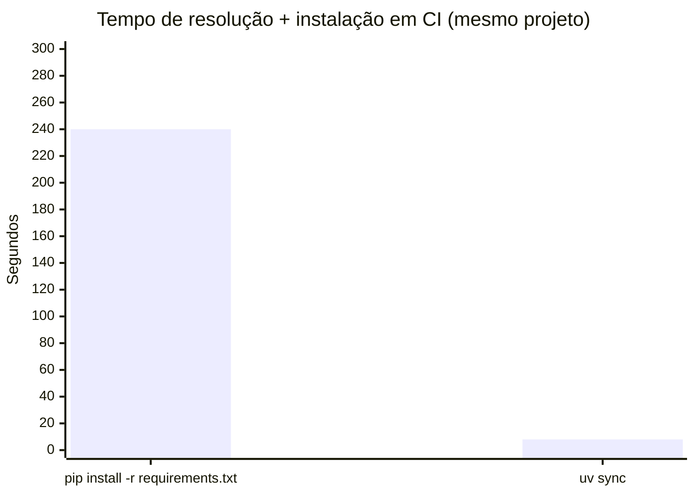
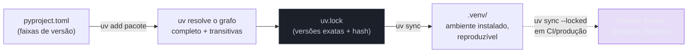

# uv — o gerenciador moderno

> [!abstract] TL;DR
> `uv`, escrito em Rust pela Astral (mesma empresa do `ruff`), é um gerenciador de projeto Python completo — resolve dependências, cria venv, trava versões num lockfile (`uv.lock`), roda comandos no ambiente do projeto e ainda gerencia qual **interpretador Python** instalar. O diferencial que domina a conversa é velocidade: resolução de dependências que levava minutos com `pip` cai para segundos, porque `uv` reescreve o resolvedor, o cache de download e a instalação de pacotes em Rust, com paralelismo real. Isso não é só conforto — muda o ciclo de feedback inteiro de um pipeline de CI.

## Quatro minutos, todo pull request

Um time mantinha um monólito Python de médio porte — algumas dezenas de dependências diretas, algumas centenas somando transitivas. O pipeline de CI, como o de qualquer projeto do tamanho, rodava em cada pull request: lint, type check, testes. E, antes de qualquer uma dessas etapas, o primeiro passo sempre igual:

```bash
pip install -r requirements.txt
```

Esse passo, sozinho, levava entre **três e cinco minutos**. Não porque a instalação em si fosse lenta — era a **resolução** do grafo de dependências que dominava o tempo: `pip` (nas versões que ainda usam o resolvedor legado, ou mesmo o resolvedor moderno introduzido no pip 20.3) percorre o grafo de compatibilidade de versões de forma sequencial, fazendo requisições de rede uma a uma para descobrir metadados de cada candidato, e recalculando bastante trabalho a cada PR — o cache de `pip` ajuda, mas não elimina o gargalo de resolução em projetos com muitas dependências e faixas de versão amplas.

Multiplicado por dezenas de PRs abertos por dia, isso não era um incômodo cosmético. Era tempo real de espera entre "abri o PR" e "sei se meu código quebrou alguma coisa" — o tipo de atraso que empurra desenvolvedores a trocar de contexto, voltar depois, perder o fio do que estavam fazendo.

O time migrou para `uv`. O mesmo passo — resolver e instalar as mesmas dependências, a partir de um lockfile equivalente — passou a levar **oito segundos**.



Não é uma otimização de 20% ou 30% — é uma ordem de grandeza. E o efeito não fica só no número: um CI que responde em segundos muda o comportamento de quem escreve código. Ninguém troca de contexto esperando oito segundos. Muita gente troca de contexto esperando quatro minutos.

> [!question]- "10-100x mais rápido" é número de marketing ou medição real?
> A própria documentação da Astral usa essa faixa — "10-100x faster than pip" — e o número varia tanto porque depende muito do cenário: cache quente vs. frio, número de dependências, se há wheels pré-compilados disponíveis para a plataforma. Em benchmarks publicados pela Astral, resolução pura (sem instalação) de projetos com dezenas de dependências frequentemente aparece na faixa de 10-20x mais rápida que `pip`; com cache quente e paralelismo agressivo de download, alguns cenários chegam a 80-100x. O número exato do seu projeto vai variar — mas a categoria de ganho (ordem de grandeza, não porcentagem) é consistente o suficiente para não ser só marketing.

## Por que é rápido: as três decisões de design

`uv` não é `pip` reescrito em Rust linha por linha — é um resolvedor e instalador desenhados do zero, com três decisões que somam o ganho de velocidade:

1. **Resolvedor escrito em Rust, com paralelismo real.** Onde o resolvedor de `pip` faz boa parte do trabalho de forma sequencial, `uv` paraleliza requisições de metadados e resolução de candidatos, aproveitando múltiplos núcleos de CPU de um jeito que o interpretador Python do `pip` (limitado pelo GIL para esse tipo de trabalho CPU-bound) não consegue fazer sozinho.
2. **Cache global compartilhado entre projetos, com hard links.** `uv` mantém um cache único de pacotes baixados na máquina (não um cache por venv) e usa hard links (ou cópias otimizadas, dependendo do sistema de arquivos) para "instalar" um pacote num novo venv sem copiar bytes de novo — se o mesmo pacote/versão já foi baixado para outro projeto, instalar de novo é essencialmente gratuito em I/O.
3. **Implementação nativa do protocolo de resolução, sem overhead de interpretador Python.** Toda a lógica de resolução de versões, leitura de metadados e checagem de compatibilidade roda como binário nativo — não há custo de interpretação Python nem overhead de import de módulos pesados a cada invocação, o que também explica por que `uv --version` e comandos simples respondem quase instantaneamente comparado ao tempo de startup do próprio `pip`.

> [!tip] O ganho de velocidade não é só sobre paciência
> Um resolvedor rápido também muda o que é economicamente viável fazer. Rodar `pip-audit` (ver [[03-Dominios/Tecnologia/Python/Segurança/07 - Segurança de dependências e supply chain|Galho 11 nota 07]]) e um `pip install` de verificação a cada commit, não só a cada PR, seria impraticável a 4 minutos por resolução — a 8 segundos, vira algo que um hook de pre-commit ou um gate de CI mais frequente pode pagar sem fricção perceptível.

## `uv venv` — criar o ambiente, sem repetir o conceito

A [[02 - Virtual environments — isolamento de dependências|nota 02 deste galho]] já cobriu o que um venv **é** e por que ele isola dependências por projeto. `uv venv` cria a mesma estrutura de diretório que `python -m venv` cria — mesmo mecanismo de isolamento por baixo — só que mais rápido e com uma vantagem extra: `uv` pode baixar e gerenciar a própria versão do interpretador Python, sem depender de que ela já esteja instalada no sistema (mais sobre isso na seção de `uv python` adiante).

```bash
# Cria .venv/ na raiz do projeto, usando o Python já configurado
# (ou baixando um, se ainda não existir — ver seção uv python)
uv venv

# Especificar a versão do interpretador explicitamente
uv venv --python 3.12
```

Na prática, quem usa `uv add`/`uv sync` (próximas seções) raramente precisa rodar `uv venv` manualmente — esses comandos criam o venv automaticamente na primeira vez que são chamados, se ele ainda não existir. `uv venv` isolado é útil principalmente quando você quer só o ambiente, sem ainda declarar dependências — ou para inspecionar/recriar o venv sem tocar no `pyproject.toml`.

## `uv add`/`uv remove` — dependências no `pyproject.toml`

A [[03 - pyproject.toml — o padrão unificado|nota 03 deste galho]] já cobriu a seção `[project.dependencies]` do `pyproject.toml` — a lista declarativa de faixas de versão aceitáveis. `uv add` escreve nessa seção **e** resolve o lockfile na mesma operação, num único comando:

```bash
uv add fastapi

# Com faixa de versão explícita
uv add "fastapi>=0.115,<1.0"

# Dependência de desenvolvimento (vai para um grupo dev, não pro runtime)
uv add --dev pytest ruff mypy

# Múltiplos pacotes de uma vez
uv add sqlalchemy pydantic httpx tenacity
```

Depois de `uv add fastapi`, o `pyproject.toml` do projeto ganha automaticamente uma linha em `dependencies`, e o `uv.lock` (próxima seção) é regenerado para incluir `fastapi` e toda a árvore transitiva dela, resolvida e travada. `uv remove` faz o inverso — remove a entrada do `pyproject.toml` e atualiza o lockfile para refletir a ausência:

```bash
uv remove httpx
```

Nenhum dos dois comandos edita o `uv.lock` "à mão" nem pede que você rode um segundo comando para sincronizar — resolução e lock acontecem como parte do mesmo `uv add`/`uv remove`, o que elimina uma classe inteira de erro (esquecer de re-lockar depois de editar o `pyproject.toml` manualmente).

> [!warning] Editar `dependencies` no `pyproject.toml` à mão ainda funciona, mas desincroniza o lockfile
> Nada impede de abrir o `pyproject.toml` num editor e adicionar uma linha em `dependencies` diretamente. Mas isso não atualiza o `uv.lock` sozinho — o lockfile fica descrevendo uma árvore de dependências que já não bate com o que o `pyproject.toml` declara, até alguém rodar `uv lock` explicitamente. `uv add`/`uv remove` evitam esse descompasso por construção; edição manual reintroduz exatamente o tipo de divergência que lockfile existe para prevenir.

## `uv lock` — o lockfile determinístico, pela lente da reprodutibilidade

A [[03-Dominios/Tecnologia/Python/Segurança/07 - Segurança de dependências e supply chain|Galho 11 nota 07]] já cobriu o `uv.lock` pela lente de **segurança**: hash pinado por artefato, proteção contra troca silenciosa de bytes, defesa contra o cenário de um `requests>=2.0` puxar silenciosamente uma versão comprometida. Aqui o ângulo é outro — **reprodutibilidade**, não ameaça.

```bash
# Gera ou atualiza o uv.lock a partir do que está em pyproject.toml,
# sem instalar nada — só resolve e trava
uv lock

# Força re-resolução completa, ignorando o que já estava travado
# (útil depois de mudar requires-python, ou para atualizar tudo deliberadamente)
uv lock --upgrade
```

O que `uv lock` grava, de fato:

```toml
# uv.lock — trecho ilustrativo (formato TOML gerado por máquina, não editado à mão)
[[package]]
name = "fastapi"
version = "0.115.6"
source = { registry = "https://pypi.org/simple" }
dependencies = [
    { name = "pydantic" },
    { name = "starlette" },
    { name = "typing-extensions" },
]
sdist = { url = "...", hash = "sha256:..." }
wheels = [
    { url = "...", hash = "sha256:..." },
]
```

Duas propriedades importam aqui, pela lente de reprodutibilidade:

- **A árvore inteira, não só as dependências diretas.** `pyproject.toml` declara `fastapi>=0.115,<1.0` — uma faixa. `uv.lock` registra `fastapi==0.115.6` exato, mais **cada** dependência transitiva dela (`pydantic`, `starlette`, etc.), também com versão exata. Duas pessoas do mesmo time, rodando `uv sync` (próxima seção) em máquinas diferentes, terminam com **exatamente** a mesma árvore de pacotes instalados — não "uma árvore compatível", a mesma árvore, byte a byte.
- **Resolução por plataforma, dentro do mesmo arquivo.** Ao contrário de um `requirements.txt` gerado num sistema operacional específico (o problema que a [[01 - Panorama — por que packaging Python era confuso|nota 01 deste galho]] descreveu — um lockfile "de fato" precisa funcionar em qualquer SO), `uv.lock` registra informação suficiente para resolver corretamente em Linux, macOS e Windows a partir do **mesmo arquivo** — sem precisar de um lockfile por plataforma.

`uv.lock` é commitado no repositório — junto com o `pyproject.toml`, é a dupla de arquivos que qualquer pessoa clonando o projeto usa para recriar o ambiente exato, sem depender de instalar nada manualmente ou adivinhar versões.

> [!tip] `git diff uv.lock` é auditável
> Como o `pyproject.toml`, o `uv.lock` é texto (TOML) versionado — um PR que faz `uv add requests` produz um diff legível no `uv.lock`, mostrando exatamente qual versão de `requests` (e de qualquer transitiva nova que ela trouxe) entrou na árvore. Isso é o mesmo argumento de auditabilidade que a nota de segurança já desenvolveu — aqui reforça só o lado prático: revisar um PR de dependência nova significa olhar um diff de texto, não confiar de olhos fechados.

## `uv sync` — instalar exatamente o que está no lockfile

`uv sync` é o comando que instala dependências **a partir do lockfile já resolvido** — sem re-resolver nada, sem consultar o índice de pacotes para decidir versões, apenas reproduzindo o que `uv.lock` já descreve:

```bash
# Instala exatamente o que está em uv.lock, criando o venv se necessário
uv sync

# Falha (em vez de re-resolver) se o pyproject.toml e o uv.lock
# estiverem desincronizados — o gate de CI que você quer
uv sync --locked

# Instala também o grupo de dependências dev
uv sync --dev
```

A diferença entre `uv add` e `uv sync` é a diferença entre **decidir** e **reproduzir**: `uv add` resolve e atualiza o lockfile (você está mudando o que o projeto depende); `uv sync` só instala o que o lockfile já decidiu (você está recriando um ambiente já definido — numa máquina nova, num container de CI, no onboarding de alguém entrando no time).



> [!warning] `uv sync` sem `--locked` em CI é o mesmo erro do `poetry install --no-update` esquecido
> A [[03-Dominios/Tecnologia/Python/Segurança/07 - Segurança de dependências e supply chain|Galho 11 nota 07]] já alertou para isso: ter um `uv.lock` commitado não protege nada se o pipeline de CI rodar `uv sync` sem `--locked` — dependendo do estado do `pyproject.toml` e do lockfile, `uv sync` puro pode decidir re-resolver em vez de só reproduzir. O ganho de reprodutibilidade só se realiza quando o comando de instalação em CI/produção é explicitamente instruído a **não** resolver de novo. Trate `--locked` como obrigatório em qualquer pipeline, não como detalhe opcional.

## `uv run` — rodar sem ativar manualmente

A [[02 - Virtual environments — isolamento de dependências|nota 02 deste galho]] mostrou o fluxo clássico: `source .venv/bin/activate`, rodar comandos, `deactivate` no final. `uv run` pula esse passo inteiro — executa um comando **dentro** do ambiente do projeto, sem alterar o shell atual:

```bash
# Roda pytest dentro do venv do projeto, sem ativar nada antes
uv run pytest

# Roda um script Python qualquer, mesma ideia
uv run python scripts/migrate.py

# Roda um comando arbitrário instalado como dependência dev
uv run ruff check .
```

Por baixo, `uv run` garante que o ambiente está sincronizado com o lockfile **antes** de executar o comando (comportamento padrão — pode ser desligado, mas raramente vale a pena) e então invoca o comando com o `PATH` e as variáveis apontando para dentro do `.venv/` do projeto, sem exigir `source activate` nem `deactivate` depois. O shell do usuário nunca muda de estado — cada `uv run` é isolado à própria invocação.

Isso importa particularmente em dois cenários:

- **Scripts de CI**, onde manter um shell "ativado" entre steps de um pipeline é frágil (cada step de CI muitas vezes roda em um processo/shell novo) — `uv run pytest` funciona igual, sem depender de ativação persistente.
- **Comandos pontuais**, onde ativar o venv só para rodar um comando e desativar de novo é cerimônia desnecessária — `uv run mypy src/` é mais direto que `source .venv/bin/activate && mypy src/ && deactivate`.

> [!question]- `uv run` reativa o resolvedor toda vez? Isso não reintroduz lentidão?
> Não da forma que preocuparia — `uv run` checa se o `.venv/` já reflete o `uv.lock` atual (comparando hashes/timestamps, não re-resolvendo do zero) e só reinstala o que mudou desde a última sincronização. Se nada mudou no `pyproject.toml`/`uv.lock` desde a última vez, essa checagem é praticamente instantânea — a resolução completa (a parte cara) só roda de fato quando `uv add`/`uv lock` altera algo. `uv run` reaproveita o cache e o lockfile já existentes, não refaz o trabalho de resolução a cada chamada.

## `uv python install`/`uv python pin` — gerenciando versões do interpretador

Até aqui, `uv` cobriu o mesmo território que `pip` + `venv` cobrem juntos: instalar dependências, isolar ambiente. Mas há uma faceta que `pip` sozinho nunca resolveu — `pip` sempre assumiu que **alguma versão de Python já está instalada** na máquina, e trabalha a partir dela. `uv` vai além: também baixa e gerencia **versões do próprio interpretador Python**, sem depender de `pyenv` ou de um pacote do sistema operacional.

```bash
# Lista versões de Python disponíveis para instalação
uv python list

# Baixa e instala uma versão específica do interpretador
# (binário pré-compilado, não compilado localmente — rápido)
uv python install 3.12

# Instala várias de uma vez
uv python install 3.11 3.12 3.13

# Fixa a versão que este projeto específico deve usar
# (grava em .python-version, na raiz do projeto)
uv python pin 3.12
```

`uv python pin` grava um arquivo `.python-version` na raiz do projeto — convenção que outras ferramentas do ecossistema (incluindo `pyenv`) também reconhecem. A partir daí, qualquer `uv venv`, `uv sync` ou `uv run` rodado dentro daquele diretório usa automaticamente a versão fixada, baixando-a primeiro se ainda não estiver disponível na máquina — sem exigir que quem clona o repositório já tenha a versão certa instalada de antemão.

> [!tip] Isso substitui o `pyenv`?
> Para a maioria dos fluxos, sim — `uv python install`/`uv python pin` cobre o mesmo problema que `pyenv` resolve (ter múltiplas versões de Python disponíveis, escolher qual usar por projeto), sem exigir uma ferramenta externa adicional. A [[02 - Virtual environments — isolamento de dependências|nota 02 deste galho]] mencionou `pyenv` como "ferramenta complementar" ao `venv" nativo — com `uv`, essa complementaridade em boa parte se torna redundância: um único binário (`uv`) cobre versão de interpretador, venv, dependências e lockfile, onde antes eram três ferramentas separadas (`pyenv` + `venv` + `pip`).

## Um fluxo completo, do zero

Juntando os cinco comandos, criar e trabalhar num projeto novo do início ao fim:

```bash
# 1. Fixa a versão de Python do projeto (baixa se necessário)
uv python pin 3.12

# 2. Inicializa um pyproject.toml básico
uv init servico-tarefas
cd servico-tarefas

# 3. Adiciona dependências de runtime e dev — resolve e trava automaticamente
uv add fastapi uvicorn sqlalchemy
uv add --dev pytest ruff mypy

# 4. Roda comandos no ambiente do projeto, sem ativar nada manualmente
uv run pytest
uv run ruff check .

# 5. Numa máquina nova (CI, colega de time), reproduz o ambiente exato
uv sync --locked
```

Nenhum passo acima chamou `source .venv/bin/activate`. `uv venv` também nunca foi chamado explicitamente — `uv add` e `uv sync` criam o venv sozinhos, na primeira vez que precisam dele.

## Armadilhas

### (1) Achar que `uv pip install` é o mesmo fluxo que `uv add`

`uv` também expõe uma interface compatível com `pip` (`uv pip install pacote`, `uv pip compile`), pensada para migração incremental de projetos que ainda usam `requirements.txt` puro. Mas `uv pip install` **não** atualiza o `pyproject.toml` nem o `uv.lock` — instala no venv ativo, do mesmo jeito que `pip install` sempre fez, sem registrar nada no manifesto do projeto.

Exemplo: alguém roda `uv pip install requests` pensando que está "usando o uv", mas o `pyproject.toml` do projeto nunca ganha a entrada — na próxima vez que outra pessoa rodar `uv sync`, `requests` simplesmente não aparece, porque nunca foi declarado.

Fix: usar `uv add`/`uv remove` para qualquer dependência que deveria fazer parte do projeto de forma persistente. `uv pip install` existe para compatibilidade e scripts pontuais, não para gerenciamento de dependência de projeto.

### (2) Rodar `uv sync` sem `--locked` em pipeline de CI

Já coberto acima e na nota de segurança — vale repetir porque é o erro mais caro de reintroduzir: sem `--locked`, `uv sync` pode, dependendo do estado do lockfile, resolver de novo em vez de só reproduzir, silenciosamente anulando a garantia de reprodutibilidade que o `uv.lock` existe para dar.

Fix: `--locked` (ou `--frozen`, para os casos em que nem checar sincronia com `pyproject.toml` é desejado) como padrão obrigatório em qualquer step de CI ou build de container de produção.

### (3) Commitar `.venv/` porque "o `uv` gerencia tudo, deve ser diferente"

A regra da [[02 - Virtual environments — isolamento de dependências|nota 02 deste galho]] — `.venv/` nunca entra em controle de versão — continua valendo integralmente com `uv`. `uv` não muda essa regra: o venv continua sendo reproduzível a partir de `pyproject.toml` + `uv.lock`, e continua contendo caminhos e binários específicos da máquina onde foi criado.

Fix: mesmo `.gitignore` de sempre (`.venv/`), sem exceção por estar usando `uv`.

## Síntese

`uv` não introduz um conceito novo — venv, dependências declaradas, lockfile determinístico já existiam antes dele, em ferramentas separadas (`venv`, `pip`, `pip-tools`/`pipenv`). O que `uv` faz é unificar essas peças num único binário, escrito em Rust, com um resolvedor ordens de magnitude mais rápido que o de `pip` — e estender a superfície de gerenciamento até a versão do próprio interpretador Python, um problema que `pip` nunca cobriu. `uv venv` cria o ambiente; `uv add`/`uv remove` mantêm o `pyproject.toml` sincronizado; `uv lock` trava a árvore inteira, reprodutível por hash; `uv sync --locked` reproduz esse estado exato em qualquer máquina; `uv run` executa dentro do ambiente sem exigir ativação manual; `uv python install`/`uv python pin` cuidam de qual Python usar, antes mesmo de falar em dependências. O ganho de velocidade não é só conforto de quem espera menos — é o tipo de mudança que torna prático rodar checagens (lint, audit, testes) com mais frequência do que o custo antigo permitia.

## How to explain in English

> "`uv`, built by Astral in Rust, is a complete Python project manager — it replaces `pip` + `venv` + `pip-tools`/Poetry with a single binary, and the headline feature is speed: dependency resolution that took minutes with `pip` drops to single-digit seconds, because the resolver, download cache, and installer are all native code with real parallelism, instead of being bottlenecked by Python's own interpreter startup and the GIL. `uv add`/`uv remove` manage dependencies in `pyproject.toml` and regenerate `uv.lock` — a fully resolved, hash-pinned lockfile covering the whole dependency tree, not just direct dependencies — in the same command. `uv sync --locked` reproduces that exact tree on any machine without re-resolving, which is the flag that actually matters in CI. `uv run` executes a command inside the project's environment without requiring manual activation. And `uv python install`/`uv python pin` go further than `pip` ever did: `uv` also manages which Python interpreter version a project uses, downloading it if needed — something that used to require a separate tool like `pyenv`."

| PT-BR | English |
|---|---|
| gerenciador de projeto | project manager |
| resolução de dependências | dependency resolution |
| lockfile determinístico | deterministic lockfile |
| ambiente reproduzível | reproducible environment |
| cache global compartilhado | shared global cache |
| interpretador Python | Python interpreter |
| ativação manual do venv | manual venv activation |
| ordem de grandeza (de ganho) | order of magnitude (of gain) |

## Fontes

- **Astral** — [*uv — An extremely fast Python package and project manager*](https://docs.astral.sh/uv/) — documentação oficial, consultada em 2026-07-12.
- **Astral** — [*uv — Locking and syncing*](https://docs.astral.sh/uv/concepts/projects/sync/) — comportamento de `uv sync`, `--locked`, `--frozen`.
- **Astral** — [*uv — Managing dependencies*](https://docs.astral.sh/uv/concepts/projects/dependencies/) — `uv add`/`uv remove`, grupos de dependência.
- **Astral** — [*uv — Installing and managing Python*](https://docs.astral.sh/uv/guides/install-python/) — `uv python install`/`uv python pin`.
- **Astral (blog)** — [*uv: Python packaging in Rust*](https://astral.sh/blog/uv) — anúncio original e motivação de design, incluindo os números de benchmark "10-100x".
- **GitHub — astral-sh/uv** — [*README e benchmarks*](https://github.com/astral-sh/uv) — comparações de velocidade contra `pip`/Poetry mantidas pelo próprio projeto.

Consultado em 2026-07-12.
