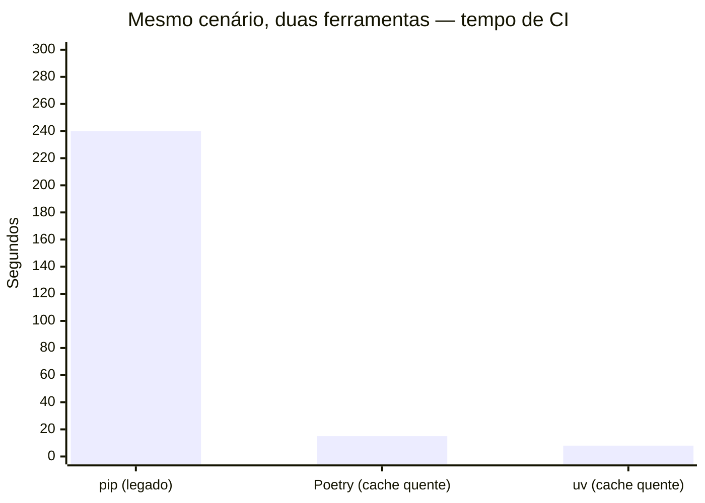
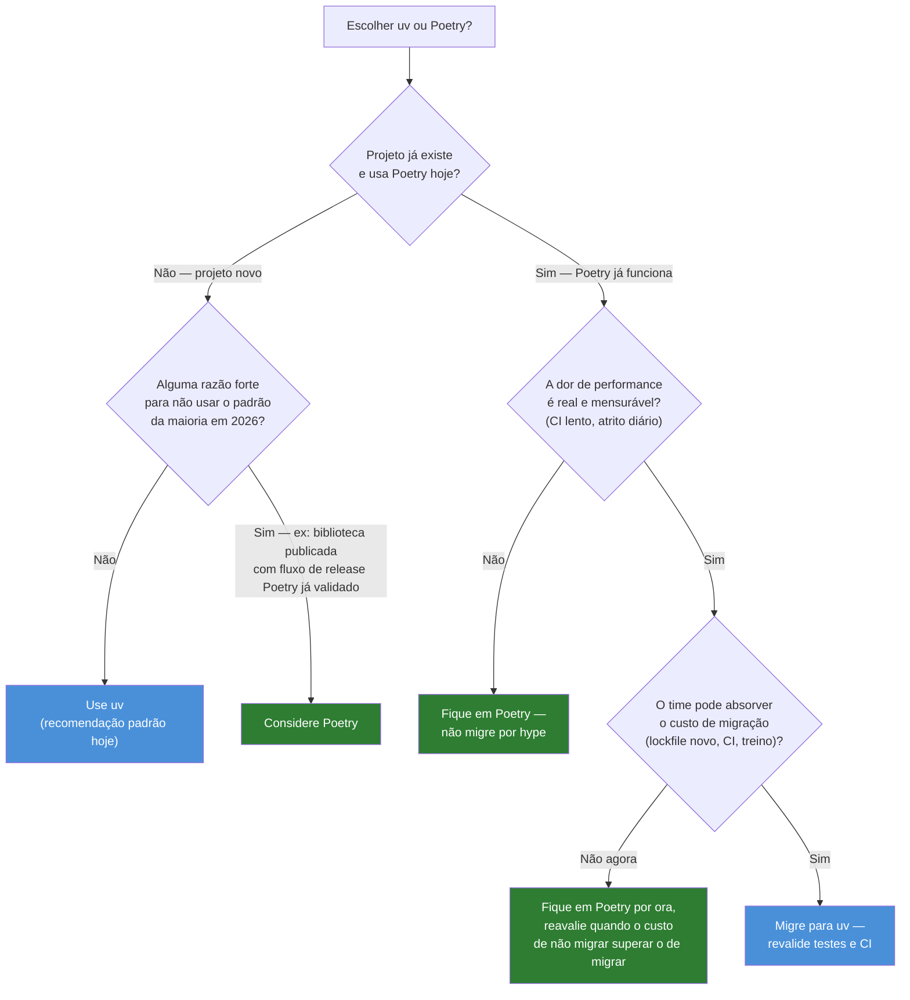

# uv vs Poetry — trade-offs honestos

> [!abstract] TL;DR
> `uv` e Poetry resolvem o mesmo problema — dependências, ambiente, lockfile, publicação — e as notas anteriores já cobriram cada um isoladamente ([[04 - uv — o gerenciador moderno|nota 04]], [[05 - Poetry — a alternativa madura|nota 05]]). Esta nota não reensina nenhum dos dois: compara direto, com números, nos eixos que de fato importam pra uma decisão — velocidade, maturidade, escopo (gerenciamento de interpretador), compatibilidade de lockfile e publicação. A resposta honesta não é "uv sempre" nem "depende de gosto": para projeto novo em 2026, `uv` é a recomendação padrão da maioria da comunidade; para projeto já em Poetry funcionando, migrar exige uma dor real de performance — não hype.

## A pergunta que todo tech lead faz em 2026

Você está começando um serviço novo. Backend Python, API REST, time de seis pessoas, vai rodar em produção com CI em cada pull request. Antes de escrever a primeira linha de código de negócio, alguém no time abre uma thread no Slack: "`uv` ou Poetry?"

A resposta errada mais comum não é escolher a ferramenta errada — é responder rápido demais, num dos dois sentidos. "Óbvio que é `uv`, é mais rápido" ignora que velocidade de resolução de dependências raramente é o gargalo real de um time de seis pessoas com CI bem cacheado. "A gente sempre usou Poetry, não tem motivo pra mudar" ignora que, para um projeto que ainda não existe, não há custo de migração — só a pergunta de qual ferramenta você quer carregar pelos próximos anos.

As duas notas anteriores deste galho já mostraram o que cada ferramenta faz: [[04 - uv — o gerenciador moderno|`uv`]] resolve em segundos o que `pip` levava minutos, e ainda gerencia a versão do interpretador Python; [[05 - Poetry — a alternativa madura|Poetry]] cobre o mesmo território — dependências, venv, lockfile, publicação — com anos a mais de produção e um fluxo de `poetry publish` mais rodado. Nenhuma das duas é "a errada". A pergunta que importa é outra: **qual trade-off esse projeto específico pode pagar?**

> [!question]- Essa comparação não vai ficar desatualizada rápido, dado que as duas ferramentas evoluem?
> Os números específicos (a versão exata de cada ferramenta, o benchmark exato) vão mudar — mas a estrutura da comparação tende a ser estável por mais tempo: `uv` nasceu depois e foi desenhado sabendo o que `pip`/Poetry faziam mal (velocidade, gerenciamento de interpretador); Poetry nasceu antes e acumulou anos de casos de borda resolvidos que `uv` ainda está fechando. Essa assimetria — "mais novo e mais rápido" vs. "mais velho e mais testado" — é o tipo de trade-off que não desaparece só porque uma versão nova saiu. Vale reler as datas das fontes ao final desta nota antes de citar um número específico numa decisão real.

## Os seis eixos, lado a lado

| Eixo | `uv` | Poetry |
|---|---|---|
| **Velocidade de resolução** | Ordens de magnitude mais rápido — CI que levava 4min com `pip` cai a 8s com `uv` (número real da [[04 - uv — o gerenciador moderno|nota 04]]) | Rápido o suficiente na maioria dos casos com cache quente (≈15s no exemplo da [[05 - Poetry — a alternativa madura|nota 05]]), mas usa um resolvedor em Python puro — sem o ganho de paralelismo nativo do `uv` |
| **Ano de origem / maturidade** | Anunciado em 2024 pela Astral — jovem, evoluindo rápido, mas com menos anos de produção acumulados | Existe desde 2018 — seis anos de vantagem em casos de borda resolvidos (Windows, múltiplas versões de Python, interação com plugins) |
| **Gerenciamento de interpretador** | Nativo — `uv python install`/`uv python pin` baixa e fixa versões do Python sem depender de ferramenta externa | Historicamente delega a `pyenv` ou instalação manual do sistema — Poetry não baixa interpretadores sozinho |
| **Formato de lockfile** | `uv.lock` (TOML, formato próprio do `uv`) | `poetry.lock` (TOML, formato próprio do Poetry) — **os dois são incompatíveis entre si**, apesar de ambos serem TOML |
| **Publicação (`build`/`publish`)** | `uv build`/`uv publish` existem e funcionam, mas são mais recentes nesse fluxo específico — menos anos de rodagem em pipelines de release de pacotes públicos | `poetry build`/`poetry publish` maduro desde as primeiras versões — é o fluxo que a [[05 - Poetry — a alternativa madura|nota 05]] descreveu como "mais battle-tested" |
| **Ecossistema de plugins** | Crescendo, mas ainda menor — a Astral prioriza manter o core enxuto | Maior e mais antigo — `poetry-plugin-shell`, plugins de export, plugins de versão dinâmica, entre outros |

> [!tip] Nenhuma linha dessa tabela é "uv perde, Poetry ganha" ou vice-versa de forma absoluta
> Repare que a tabela não tem uma coluna "vencedor" — cada linha é um trade-off específico. Velocidade favorece `uv` com folga. Maturidade de publicação favorece Poetry. Gerenciamento de interpretador é uma capacidade que só `uv` tem, ponto — não é "melhor", é "existe de um lado e não do outro". Tratar essa tabela como um placar binário é o primeiro jeito de tomar a decisão errada.

## Velocidade: o número que domina a conversa, no contexto certo

A [[04 - uv — o gerenciador moderno|nota 04]] já mostrou o caso concreto: um time cujo CI levava de três a cinco minutos rodando `pip install -r requirements.txt` viu esse mesmo passo cair para oito segundos depois de migrar para `uv`. Não é uma otimização de porcentagem — é ordem de grandeza, e o efeito prático (ninguém troca de contexto esperando oito segundos; quase todo mundo troca esperando quatro minutos) é real.

O que essa nota acrescenta é o contraponto: a [[05 - Poetry — a alternativa madura|nota 05]] mostrou um time onde `poetry install` levava quinze segundos com cache quente — rápido o suficiente para não aparecer como gargalo perceptível no fluxo diário daquele time específico. A pergunta que separa os dois casos não é "qual ferramenta é mais rápida" (`uv` sempre vence esse benchmark isolado) — é "o tempo de resolução atual está custando alguma coisa que importa pro seu time, hoje". Um projeto pequeno, com poucas dependências, cache de CI bem configurado e builds pouco frequentes pode nunca sentir a diferença de forma perceptível. Um monólito com centenas de dependências transitivas, dezenas de PRs por dia e CI mal cacheado sente a diferença todos os dias.

> [!question]- Se `uv` é mais rápido em qualquer benchmark, por que Poetry ainda é 15s e não também 8s?
> Poetry usa um resolvedor implementado em Python puro — sujeito ao mesmo custo de interpretação e ao GIL que limitam qualquer código Python CPU-bound, mesmo quando otimizado. `uv` reescreveu resolução, cache e instalação como binário nativo em Rust, com paralelismo real entre núcleos — a diferença estrutural que a [[04 - uv — o gerenciador moderno|nota 04]] detalhou nas "três decisões de design". Não é uma questão de Poetry estar mal otimizado — é uma diferença de plataforma de implementação que nenhuma otimização incremental em Python puro fecha por completo.

## Maturidade: o preço de ser recente

"Mais rápido" não é sinônimo de "mais confiável em produção" — e esse é exatamente o ponto que o tech lead da [[05 - Poetry — a alternativa madura|nota 05]] levantou quando alguém propôs migrar o serviço de cobrança de sete anos para `uv`. Poetry tem, hoje, mais tempo acumulado resolvendo casos de borda: comportamento consistente em Windows (onde diferenças de path e de shell historicamente causam mais atrito), interação testada com múltiplas versões de Python instaladas na mesma máquina, um ecossistema de plugins com anos de manutenção.

`uv` não é instável — é usado em produção por times sérios desde 2024, e a Astral (mesma empresa por trás do `ruff`, já adotado amplamente) tem histórico de entregar ferramentas robustas rápido. Mas "robusto desde o lançamento" e "testado em produção por anos, em milhares de projetos diferentes, incluindo os casos estranhos que só aparecem em escala" são afirmações diferentes. A diferença fecha com o tempo — mas em 2026, ainda existe.

> [!warning] "Maturidade" não é um veredito permanente a favor de Poetry
> Esse eixo é o que mais muda com o tempo, e é fácil citar um argumento de maturidade desatualizado. `uv` já passou por milhões de downloads e adoção em projetos de peso no ecossistema Python (inclusive dentro da própria comunidade de packaging) desde seu lançamento — o "gap de maturidade" de 2024 não é o mesmo gap de 2026, e provavelmente será menor ainda daqui a mais um ou dois anos. Trate esse eixo como o que mais precisa de reverificação antes de virar argumento definitivo numa decisão real.

## Escopo: uv também é gerenciador de interpretador

Esse é o eixo onde a comparação deixa de ser só "qual é mais rápido" e vira "as duas ferramentas cobrem exatamente o mesmo território?" — e a resposta é não. A [[04 - uv — o gerenciador moderno|nota 04]] mostrou `uv python install`/`uv python pin`: `uv` baixa e gerencia versões do próprio interpretador Python, sem depender de `pyenv` ou de instalação manual no sistema operacional.

Poetry não tem equivalente nativo a isso. Historicamente, um projeto Poetry que precisa rodar em Python 3.11 numa máquina que só tem 3.9 instalado depende de `pyenv` (ou outro gerenciador de versão externo) para prover o interpretador certo — Poetry então usa o que já está disponível, mas não baixa nada sozinho. Isso não é um defeito de design por acaso: Poetry nasceu focado em gerenciar dependências e publicação de um projeto que já tem seu interpretador resolvido por fora; `uv` foi desenhado depois, com a ambição declarada de substituir a pilha inteira — `pyenv` + `venv` + `pip`/Poetry — num binário só.

Na prática, para um time que já tem um processo estabelecido de gerenciar versões de Python (imagem Docker fixa, `pyenv` já configurado, runtime gerenciado pela infra), essa diferença de escopo pode não pesar muito. Para um time que sofre com "funciona na minha máquina, mas o CI usa outra versão de Python", `uv` elimina uma ferramenta externa inteira da equação.

## Lockfiles incompatíveis: migração não é trivial

Este é o ponto mais frequentemente subestimado quando alguém decide "vamos trocar de `uv` pra Poetry" ou vice-versa no meio de um projeto: `uv.lock` e `poetry.lock` são dois formatos **diferentes e incompatíveis**, mesmo os dois sendo arquivos TOML.

> [!warning] Trocar de ferramenta não é trocar um arquivo por outro equivalente
> Não existe um comando `uv import poetry.lock` ou `poetry import uv.lock` que converta um lockfile no outro preservando hashes e árvore de resolução exatamente como estavam. Migrar de uma ferramenta para outra significa, na prática, apagar o lockfile antigo e **deixar a ferramenta nova resolver o grafo de dependências do zero**, a partir das faixas de versão declaradas em `[project.dependencies]` (ou `[tool.poetry.dependencies]`, se o projeto ainda estiver no formato legado). O resultado da nova resolução pode diferir do antigo — mesmas faixas de versão declaradas, mas a árvore transitiva exata que cada resolvedor escolhe (qual versão específica de cada dependência transitiva, dentro da faixa permitida) não é garantida ser idêntica.

O que isso custa, na prática, para um time que decide migrar:

1. **Revalidar o ambiente inteiro.** Depois de gerar o lockfile novo, rodar a suíte de testes completa — não só confiar que "as mesmas faixas de versão declaradas" implicam "o mesmo comportamento". Uma dependência transitiva que mudou de versão (mesmo dentro da faixa compatível) pode introduzir uma regressão sutil.
2. **Reescrever scripts de CI e Dockerfile.** Qualquer lugar que rode `poetry install --only main` precisa virar `uv sync --locked`; qualquer `poetry run` vira `uv run`. Não é um find-and-replace perfeito — as flags e o comportamento padrão de cada comando diferem (por exemplo, `uv sync` sem `--locked` pode re-resolver, enquanto `poetry install` sempre respeita o lockfile existente).
3. **Treinar o time no fluxo novo.** Comandos parecidos (`add`, `remove`, `run`), mas com detalhes diferentes o suficiente (groups do Poetry vs. dependency groups do `uv`, por exemplo) para gerar confusão nas primeiras semanas.
4. **Decidir o que fazer com plugins Poetry em uso**, se houver — `uv` não tem um sistema de plugin equivalente a todo plugin do ecossistema Poetry; alguns fluxos precisam ser reconstruídos de outro jeito, não só traduzidos comando a comando.

Nenhum desses passos é impossível — só é trabalho real, com risco real de regressão, que precisa ser pesado contra o ganho esperado.

## Publicação: poetry publish tem mais estrada

A [[05 - Poetry — a alternativa madura|nota 05]] cobriu `poetry build`/`poetry publish` como um fluxo maduro desde as primeiras versões públicas — geração de wheel e sdist, publicação em PyPI ou índice privado, autenticação por token, o aviso de que uma versão publicada é permanente. `uv` também tem `uv build` e `uv publish`, cobrindo essencialmente o mesmo fluxo (gerar artefatos, enviar a um índice), mas esse é um dos cantos da ferramenta que chegou depois — menos anos de pipelines de release em produção testando casos de borda (índices privados com autenticação exótica, retries em uploads que falham parcialmente, comportamento em monorepos publicando múltiplos pacotes).

Para quem está construindo uma aplicação que nunca vai ao PyPI — a maioria dos serviços internos de uma empresa —, esse eixo simplesmente não pesa: `build`/`publish` só importa para quem mantém uma **biblioteca** publicada. Para quem mantém bibliotecas publicadas com frequência, especialmente em pipelines de release automatizados e testados ao longo de anos, o histórico maior do `poetry publish` ainda é um argumento real a favor de manter (ou escolher) Poetry.

## A árvore de decisão, sem fingir empate

O critério honesto, resumido em duas frases: **para um projeto novo em 2026, `uv` é a recomendação padrão da maioria da comunidade** — velocidade, gerenciamento de interpretador embutido e o fato de vir da mesma empresa que já ganhou confiança com `ruff` pesam a favor, e não há custo de migração porque não existe nada para migrar. **Para um projeto existente que já roda em Poetry sem dor perceptível, a migração só se justifica quando o custo de não migrar (CI lento todos os dias, atrito real no ciclo de feedback do time) supera o custo real de migrar (lockfile refeito, scripts reescritos, testes revalidados, time retreinado)** — e esse segundo custo não é hipotético, é trabalho concreto com risco real de regressão.

> [!tip] O erro mais caro nos dois sentidos
> Migrar por hype ("todo mundo tá falando de `uv`") sem medir se a dor de performance é real é o erro mais comum do lado "migrar demais". Recusar `uv` num projeto novo só por familiaridade com Poetry, sem considerar que não há custo de migração num projeto que ainda não existe, é o erro simétrico do lado "migrar de menos". Os dois erros têm a mesma raiz: decidir pela ferramenta que é mais familiar, em vez de decidir pelo trade-off que o projeto específico está de fato pagando.

## Armadilhas

### (1) Comparar benchmark de resolução como se fosse o único custo do projeto

É fácil ficar só no número de velocidade — 8s vs 15s, ou os "10-100x" que a [[04 - uv — o gerenciador moderno|nota 04]] discutiu — e esquecer que a decisão de ferramenta afeta publicação, gerenciamento de interpretador, plugins e o custo de treinar o time. Um projeto que nunca publica pacote, já tem `pyenv` configurado e não sofre com CI lento pode não ganhar quase nada trocando de Poetry para `uv`, mesmo com o benchmark de resolução favorecendo `uv` isoladamente.

Fix: listar, para o projeto específico, quais dos seis eixos da tabela realmente pesam — não assumir que velocidade de resolução é sempre o eixo decisivo.

### (2) Migrar um lockfile "na mão", tentando preservar as versões exatas

Um erro sutil: alguém tenta copiar as versões exatas do `poetry.lock` para dentro de `pyproject.toml` como faixas fixas (`fastapi==0.115.6` em vez de `fastapi>=0.115,<1.0`), na esperança de que o `uv lock` gerado a partir daí "preserve" a resolução antiga. Isso trava versões que deveriam ser faixas flexíveis, e não garante nem que o `uv.lock` resultante seja idêntico ao `poetry.lock` original — porque a árvore transitiva ainda é resolvida do zero pelo `uv`.

Fix: manter as faixas de versão como eram pensadas para o projeto (não as versões exatas do lockfile antigo), deixar a ferramenta nova resolver do zero, e validar com testes — não tentar "clonar" o lockfile manualmente.

### (3) Achar que "uv também tem publish" significa paridade completa com Poetry nesse fluxo

`uv publish` funciona para o caso comum (publicar num PyPI padrão, autenticação por token). Mas alguns fluxos que Poetry já resolveu há anos — índices privados com autenticação mais exótica, plugins de versionamento dinâmico, integração com determinados sistemas de CI/CD corporativos — podem não ter equivalente direto ou tão testado em `uv` ainda.

Fix: se o projeto publica pacote com um fluxo de release não-trivial (índice privado, versionamento automático, múltiplos artefatos), testar o `uv publish` a fundo num ambiente de staging antes de confiar nele para produção — não assumir paridade de funcionalidade só porque o comando existe.

## Em entrevista

### Frase pronta (inglês)

> `uv` and Poetry solve the same problem — dependency management, virtual environments, lockfiles, and publishing — but they trade off differently. `uv`, built in Rust by Astral, wins decisively on speed (dependency resolution that took minutes with `pip` drops to single-digit seconds) and additionally manages Python interpreter versions natively, something Poetry has always delegated to `pyenv`. Poetry, in production since 2018, has more years of edge cases resolved and a more battle-tested `publish` workflow. The two lockfiles, `uv.lock` and `poetry.lock`, are incompatible formats — migrating means re-resolving the dependency tree from scratch and revalidating the whole test suite, not a drop-in conversion. My honest default for a new project in 2026 is `uv`, because there's no migration cost when nothing exists yet; for an existing project already running Poetry without real pain, I wouldn't migrate just because a benchmark looks better — only if the performance cost is actually measurable and hurting the team.

### Vocabulário

| Termo PT | Termo EN |
| --- | --- |
| Trade-off | Trade-off |
| Custo de migração | Migration cost |
| Lockfile incompatível | Incompatible lockfile |
| Maturidade em produção | Production maturity |
| Gerenciamento de interpretador | Interpreter management |
| Fluxo de publicação | Publishing workflow |
| Regressão | Regression |
| Recomendação padrão | Default recommendation |

## Síntese

`uv` e Poetry não competem em "qual é a ferramenta certa" de forma absoluta — competem em trade-offs que pesam diferente dependendo do projeto. `uv` ganha com folga em velocidade e é o único dos dois que gerencia versão de interpretador nativamente; isso o torna a recomendação padrão para projeto novo em 2026, porque não há custo de migração quando não existe nada para migrar. Poetry ganha em anos de maturidade e no fluxo de publicação mais rodado; para um projeto que já roda nele sem dor perceptível, o custo real de migrar — lockfile incompatível, scripts reescritos, testes revalidados, time retreinado — só se justifica quando a dor de performance é concreta, não hipotética. A decisão errada, nos dois sentidos, é decidir pela ferramenta mais familiar em vez de pelo trade-off que o projeto de fato está pagando.

## Fontes

- **Astral** — [*uv — An extremely fast Python package and project manager*](https://docs.astral.sh/uv/) — documentação oficial, consultada em 2026-07-12.
- **Astral (blog)** — [*uv: Python packaging in Rust*](https://astral.sh/blog/uv) — motivação de design e benchmarks originais.
- [Poetry — Documentation](https://python-poetry.org/docs/), consultado em 2026-07-12.
- [Poetry 2.0 release notes — python-poetry/poetry, GitHub](https://github.com/python-poetry/poetry/releases), consultado em 2026-07-12.
- [[04 - uv — o gerenciador moderno]] e [[05 - Poetry — a alternativa madura]] — notas deste galho, base factual desta comparação (números de CI, fluxos de comando).

Consultado em 2026-07-12.
