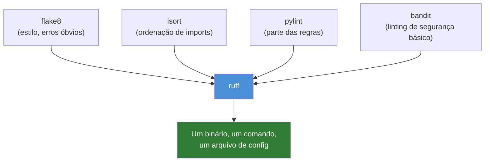
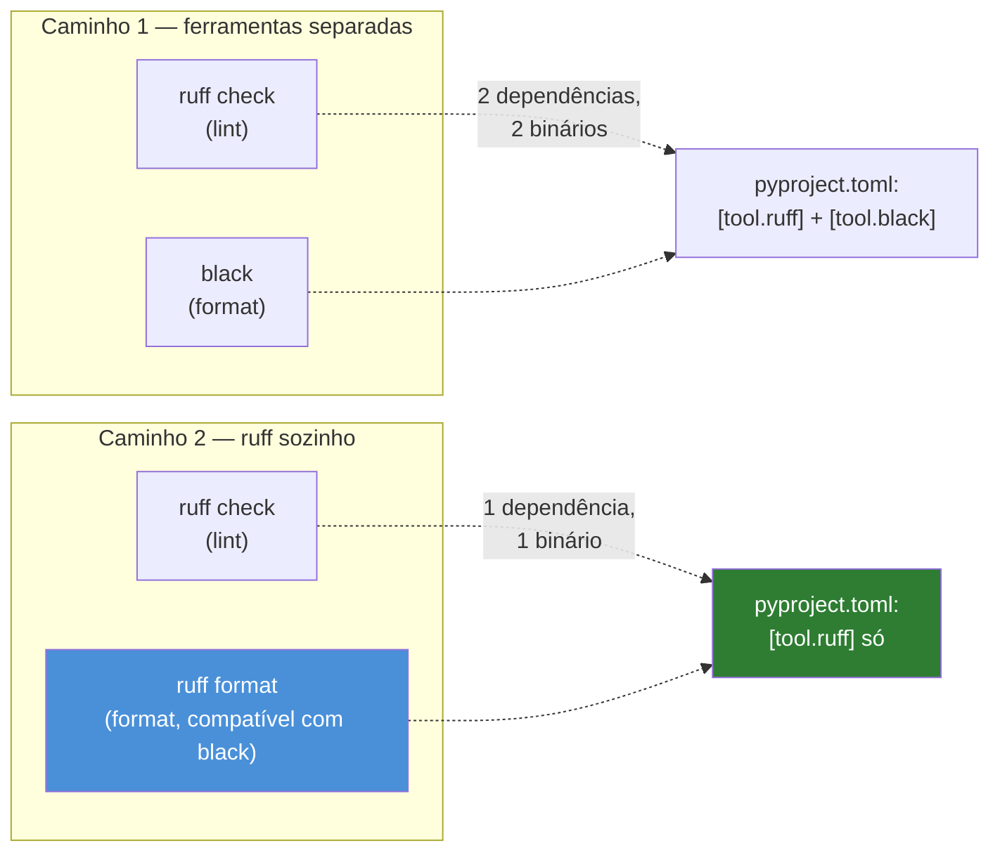
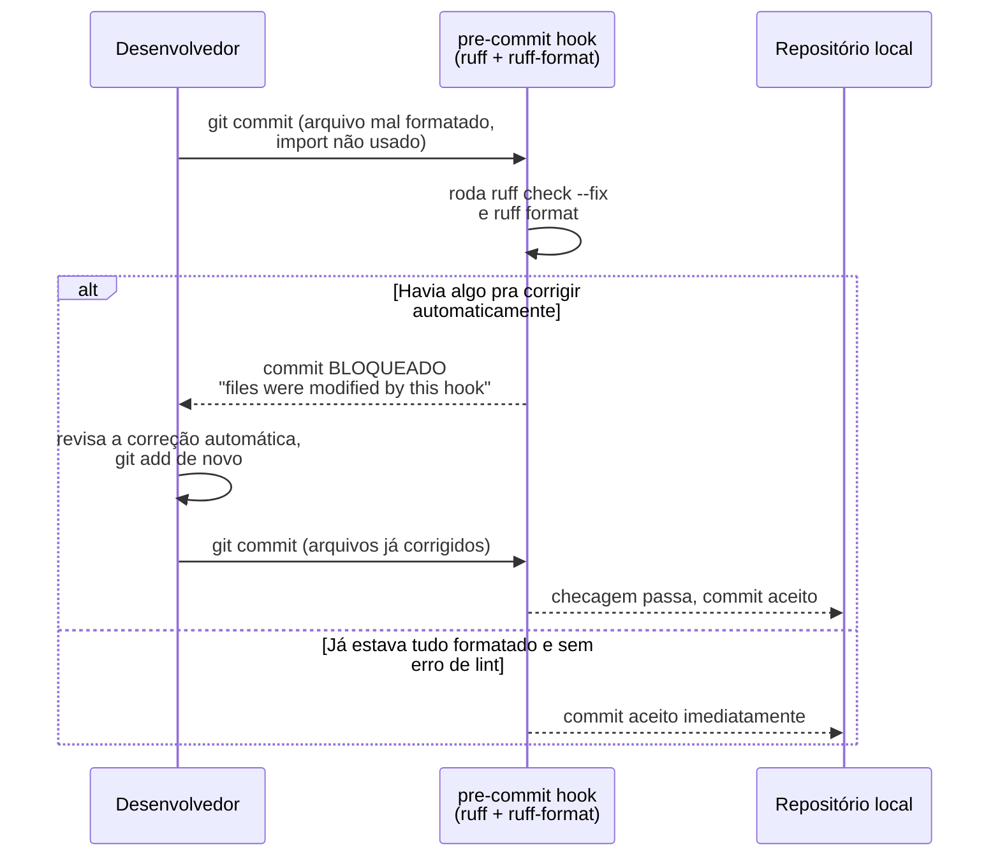

# ruff e black — linting e formatação automática

> [!abstract] TL;DR
> `ruff`, escrito em Rust pela Astral (a mesma empresa do [[04 - uv — o gerenciador moderno|uv]]), é um linter ultra-rápido que substitui sozinho um punhado de ferramentas antigas — `flake8`, `isort`, boa parte do `pylint`, e até checagens básicas de segurança que antes viviam no `bandit`. `black` é o formatador opinativo que encerra debate de estilo: ele decide onde quebrar linha, que aspas usar, onde colocar vírgula — e ninguém questiona, porque a ferramenta não aceita configuração para a maioria dessas decisões. `ruff` também tem seu próprio formatador (`ruff format`), compatível com `black` na saída, o que faz muitos projetos hoje rodarem só `ruff` para lint **e** formatação, dispensando `black` como dependência separada. Ambos se configuram dentro do `pyproject.toml` já coberto na [[03 - pyproject.toml — o padrão unificado|nota 03 deste galho]], e o gancho que garante que ninguém pule a checagem é o `pre-commit` — um framework de hooks que roda essas ferramentas automaticamente antes de cada commit.

## O PR que discutiu vírgula por três dias

Um time de plataforma tinha uma regra tácita: todo PR passava por pelo menos uma rodada de review antes de mergear. Numa sexta-feira, alguém abriu um PR de umas 40 linhas — uma função nova de validação de payload, nada arquiteturalmente interessante. O primeiro comentário de review chegou em vinte minutos: "aqui você usou aspas duplas, o resto do arquivo usa aspas simples". A autora ajustou. Segundo comentário: "essa linha de 95 caracteres devia quebrar antes dos 88, é o que o resto do módulo faz". Terceiro: "tab ou espaço aqui? Parece que misturou". A conversa migrou pro Slack, onde alguém trouxe o argumento contrário — "aspas duplas são mais legíveis quando o conteúdo tem apóstrofo" — e uma pessoa terceira, que nem estava no PR, entrou pra defender uma convenção diferente da que o time "sempre seguiu".

O PR levou três dias para mergear. A lógica de validação — a parte que de fato importava, a que podia ter um bug de verdade — foi aprovada no primeiro comentário. O resto do tempo foi gasto inteiramente em formatação: onde quebrar linha, que tipo de aspas, quantos espaços de indentação, se a vírgula final numa lista multi-linha era obrigatória ou proibida. Ninguém estava errado — cada convenção defendida tinha argumento razoável por trás. O problema não era nenhuma posição individual; era não ter **nenhuma** posição vinculante, o que transformava toda decisão estética em terreno de debate infinito, renovado a cada PR, porque a "convenção do time" vivia só na memória coletiva (inconsistente) de quem revisava naquele dia.

O time adotou `black` e `ruff` na semana seguinte. A regra ficou simples: o formatador decide, ninguém revisa estilo manualmente, e um commit mal formatado nem chega a existir no histórico porque um hook o barra antes. As discussões de aspas, indentação e quebra de linha pararam de acontecer — não porque o time "aprendeu a concordar", mas porque a pergunta deixou de ter espaço para opinião.

> [!question]- Isso não é ferramenta demais decidindo algo que devia ser escolha do time?
> É exatamente o argumento contrário que fez `black` (e depois `ruff format`) ganhar adoção massiva: a escolha específica importa menos do que **ter uma escolha só**, aplicada de forma consistente e sem esforço humano. `black` se descreve publicamente como "the uncompromising code formatter" — o nome do projeto é uma referência a "any color you want, as long as it's black" (a citação atribuída a Henry Ford sobre o Ford Model T). A filosofia declarada é reduzir ao mínimo as opções configuráveis, precisamente para eliminar esse tipo de debate. O time não perde a capacidade de ter opinião sobre estilo — perde só a capacidade de gastar tempo de review nisso, porque a decisão já foi tomada uma vez, na adoção da ferramenta, e não precisa ser revisitada PR a PR.

## `ruff`: uma ferramenta, o lugar de quatro

Antes de `ruff`, um projeto Python de porte médio tipicamente rodava várias ferramentas de qualidade de código em paralelo, cada uma cobrindo uma fatia do problema:

- **`flake8`** — erros de estilo e problemas óbvios (variável não usada, linha longa demais, import fora de ordem convencional), baseado em `pycodestyle` + `pyflakes` por baixo.
- **`isort`** — ordena e agrupa imports (biblioteca padrão, terceiros, locais), numa convenção separada da checagem de estilo geral.
- **`pylint`** — análise mais profunda (parte dela redundante com `flake8`, parte cobrindo categorias que `flake8` não pega — complexidade, convenções de nomenclatura mais rígidas).
- **`bandit`** — linting de segurança básico: uso de `eval`, senha hardcoded óbvia, `subprocess` com `shell=True`, chamadas conhecidas por serem fonte comum de vulnerabilidade.

Quatro ferramentas, quatro arquivos de configuração (ou quatro seções `[tool.*]` diferentes, depois que o [[03 - pyproject.toml — o padrão unificado|padrão `pyproject.toml`]] começou a unificar isso), quatro processos Python separados rodando em CI — cada um com seu próprio tempo de startup e de análise.

`ruff` reimplementa a maior parte das regras dessas quatro ferramentas, em Rust, dentro de um único binário:



O ganho não é só "menos arquivos de configuração" — é o mesmo ganho de velocidade que a [[04 - uv — o gerenciador moderno|nota 04 deste galho]] já descreveu para `uv`: `ruff` roda ordens de magnitude mais rápido que a soma das quatro ferramentas que substitui, porque é código nativo, sem overhead de interpretador Python a cada invocação, com paralelismo real entre arquivos.

```bash
# Roda o linter no projeto inteiro
ruff check .

# Corrige automaticamente o que dá pra corrigir sem ambiguidade
# (imports não usados, ordenação de import, algumas simplificações seguras)
ruff check . --fix
```

Exemplo de saída, com um problema de import não usado e um de ordenação:

```python
# antes — src/validacao.py
import json
import os
from collections import OrderedDict

import requests


def carregar_config(caminho: str) -> dict:
    with open(caminho) as f:
        return json.load(f)
```

```text
$ ruff check src/validacao.py
src/validacao.py:2:8: F401 [*] `os` imported but unused
src/validacao.py:3:1: I001 [*] Import block is un-sorted or un-formatted
Found 2 errors.
[*] 2 fixable with the `--fix` option.
```

```python
# depois de `ruff check --fix` — src/validacao.py
import json

import requests
from collections import OrderedDict


def carregar_config(caminho: str) -> dict:
    with open(caminho) as f:
        return json.load(f)
```

`F401` é o código de regra herdado diretamente da nomenclatura do `pyflakes` (`ruff` manteve os mesmos prefixos de código das ferramentas que substitui, de propósito, para que quem já conhece `flake8` reconheça as regras sem reaprender nada) — `import os` nunca é usado no corpo da função, então `ruff` marca e remove. `I001` é a regra equivalente ao que `isort` cobria — bloco de import fora da ordem convencional (biblioteca padrão primeiro, terceiros depois).

> [!tip] O prefixo do código de regra diz de onde ela veio
> `E`/`W` = `pycodestyle` (estilo), `F` = `pyflakes` (erros lógicos como import não usado ou variável não definida), `I` = `isort` (ordenação de import), `UP` = `pyupgrade` (sintaxe moderna disponível pra versão de Python do projeto), `B` = `flake8-bugbear` (padrões suspeitos que não são erro de sintaxe, mas costumam ser bug), `S` = `flake8-bandit` (a parte de segurança, equivalente ao `bandit`). `ruff` não inventou uma taxonomia nova — ele reimplementou dezenas de plugins do ecossistema `flake8` e preservou os códigos, o que torna a migração de um projeto existente mais previsível: as mesmas regras que rodavam antes continuam identificáveis pelo mesmo prefixo.

## `black`: o formatador que não aceita debate

`black` resolve um problema diferente de `ruff check` — não é sobre encontrar erro ou padrão suspeito, é sobre **reescrever** o código para uma forma canônica, sempre a mesma, independente de quem escreveu:

```python
# antes — src/pedidos.py, escrito sem preocupação com formatação
def processar_pedido(id_pedido,cliente,itens,   desconto=0):
    total=sum(item['preco']*item['quantidade'] for item in itens)
    total_com_desconto=total*(1-desconto)
    return {'id':id_pedido,'cliente':cliente,'total':total_com_desconto,'itens':itens}
```

```bash
$ black src/pedidos.py
reformatted src/pedidos.py
All done! ✨ 🍰 ✨
1 file reformatted.
```

```python
# depois — src/pedidos.py
def processar_pedido(id_pedido, cliente, itens, desconto=0):
    total = sum(item["preco"] * item["quantidade"] for item in itens)
    total_com_desconto = total * (1 - desconto)
    return {
        "id": id_pedido,
        "cliente": cliente,
        "total": total_com_desconto,
        "itens": itens,
    }
```

Note o que `black` decidiu sozinho, sem pedir opinião: espaço depois de vírgula em todo lugar, espaço ao redor de operadores, aspas duplas (a convenção padrão do `black`, salvo raras exceções onde aspas simples evitam escapar um apóstrofo no conteúdo), e — o ponto mais visível — o dicionário de retorno que não cabia numa linha de 88 caracteres foi quebrado automaticamente numa forma multi-linha específica, com vírgula final depois do último item. Ninguém escolheu essas decisões individualmente; `black` as aplica de forma determinística, e a mesma entrada sempre produz exatamente a mesma saída, em qualquer máquina.

> [!warning] `black` tem poucas opções de configuração, de propósito
> Ao contrário da maioria das ferramentas deste galho, `black` resiste ativamente a virar configurável. A documentação oficial é explícita sobre isso: o valor do formatador vem de produzir formatação **consistente entre projetos**, não de se adaptar ao gosto de cada time. As únicas opções amplamente aceitas são `line-length` (o padrão é 88, não 79 do PEP 8 clássico — `black` escolheu 88 deliberadamente como equilíbrio entre "cabe na tela" e "não quebra linha cedo demais") e `target-version` (qual sintaxe de Python o formatador pode assumir como disponível). Pedir para `black` usar aspas simples em vez de duplas, por exemplo, não é uma opção suportada — é uma escolha filosófica do projeto, não uma lacuna a preencher.

## `ruff format`: quando `ruff` também formata

`ruff` não parou em lint. A partir da versão 0.1, a Astral adicionou `ruff format` — um formatador com saída **compatível com `black`** na esmagadora maioria dos casos (a documentação da Astral cita conformidade acima de 99.9% contra o corpus de teste do próprio `black`). Isso significa que rodar `ruff format .` num projeto que já usava `black` produz, para quase todo arquivo, exatamente o mesmo resultado.

```bash
# Mesmo efeito prático que `black .`, no mesmo código do exemplo anterior
ruff format src/pedidos.py
```

A consequência prática é que hoje existem dois caminhos igualmente válidos, e a escolha entre eles é mais sobre simplicidade de dependência do que sobre qualidade do resultado:



**Caminho 1 — `ruff` + `black` separados.** Continua sendo uma escolha razoável, especialmente em projetos que já tinham `black` adotado há anos, com o time acostumado ao nome e ao comando. `black` também tem, por ser mais antigo e mais amplamente usado historicamente, uma superfície de casos-extremos testada por mais tempo em produção — o que pesa para times conservadores que preferem não trocar uma ferramenta madura só porque existe uma alternativa mais nova.

**Caminho 2 — `ruff` fazendo os dois papéis.** Reduz o número de dependências de desenvolvimento, unifica configuração numa seção só (`[tool.ruff]`, em vez de `[tool.ruff]` + `[tool.black]`), e mantém lint e formatação no mesmo binário — o que significa uma única instalação, um único processo de startup, potencialmente mais rápido em CI (um `ruff format --check` a mais custa pouco quando `ruff` já está carregado na memória para o `ruff check`). É o caminho que projetos novos, começando do zero em 2026, mais frequentemente escolhem — precisamente porque não carregam a inércia histórica de já ter `black` configurado.

> [!question]- Se são compatíveis, por que não é sempre 100% idêntico?
> Porque `ruff format` não é um clone byte-a-byte do algoritmo de `black` — é uma reimplementação independente que persegue o mesmo estilo-alvo. A Astral documenta publicamente os poucos casos conhecidos de divergência (situações específicas envolvendo comentários em posições incomuns dentro de expressões complexas, por exemplo) e os trata como bugs a corrigir na direção de mais compatibilidade, não como escolha de design divergente intencional. Para o código que a grande maioria dos projetos escreve no dia a dia, a diferença é inobservável — mas um projeto migrando de `black` para `ruff format` deve rodar os dois uma vez e revisar o diff antes de trocar, em vez de assumir compatibilidade total sem checar.

Nenhum dos dois caminhos é "o errado" — a nota não força uma resposta única porque não existe uma. Times com `black` já estabelecido não ganham o suficiente trocando para justificar a migração; times novos, ou projetos que já usam `ruff` para lint, tendem a adotar `ruff format` só para não somar uma segunda dependência que faz um trabalho que a primeira já sabe fazer.

## Configuração — `[tool.ruff]` no `pyproject.toml`

A [[03 - pyproject.toml — o padrão unificado|nota 03 deste galho]] já cobriu a estrutura geral do arquivo e mostrou um exemplo de `[tool.ruff]` no serviço de Tarefas. Aqui só o detalhe que faltou: as chaves mais usadas dentro dessa seção, e por que cada uma existe.

```toml
[tool.ruff]
line-length = 100
target-version = "py312"

[tool.ruff.lint]
select = ["E", "F", "I", "UP", "B", "S"]
ignore = ["E501"]

[tool.ruff.format]
quote-style = "double"
docstring-code-format = true
```

- **`line-length`**: o mesmo conceito de `black`, aplicado tanto ao lint (regra `E501`, linha longa demais) quanto ao formatador. Times costumam alinhar esse número entre `ruff` e `black`, quando usam os dois separados — divergência aqui produz um formatador "corrigindo" para 88 e um linter reclamando de linhas até 100, um atrito que não vale a pena manter.
- **`target-version`**: qual versão mínima de Python o projeto suporta — determina, por exemplo, se a regra `UP` (sintaxe moderna) pode sugerir `list[int]` em vez de `List[int]`, algo só válido a partir do Python 3.9+.
- **`select`**: quais famílias de regra ficam ativas. `["E", "F", "I", "UP", "B", "S"]` liga estilo (`E`), erros lógicos (`F`), ordenação de import (`I`), modernização de sintaxe (`UP`), padrões suspeitos (`B`) e a checagem de segurança básica equivalente ao `bandit` (`S`) — a mesma consolidação de quatro ferramentas mencionada na seção anterior, expressa em uma linha de configuração.
- **`ignore`**: exceções pontuais. `E501` (linha longa) costuma ser ignorada quando o time confia no formatador para decidir quebra de linha, em vez de deixar o linter reclamar de um caso que o formatador já trata de forma consistente.
- **`[tool.ruff.format]`**: a subseção que configura o comportamento de `ruff format`, separada da de `ruff check` — reforçando que, mesmo dentro de um binário só, lint e formatação continuam sendo responsabilidades logicamente distintas, cada uma com sua própria configuração.

> [!warning] `select`/`ignore` sem critério vira "linter mudo"
> É tentador, num projeto legado com centenas de violações acumuladas, silenciar regra atrás de regra até o `ruff check` passar limpo. Isso resolve o sintoma (CI verde) sem resolver o problema (código com os mesmos riscos que a regra existia para pegar). Uma abordagem mais honesta é `ruff check --fix` primeiro (resolve o que é seguro corrigir automaticamente), depois revisar o que sobrou regra por regra — silenciando só o que de fato não se aplica ao projeto, documentando o porquê no próprio `pyproject.toml` com um comentário.

## `pre-commit` — barrando o commit antes dele existir

Ter `ruff` e `black`/`ruff format` configurados no `pyproject.toml` não impede ninguém de commitar código mal formatado — os comandos só rodam quando alguém lembra de rodá-los manualmente, ou quando o CI já pegou o problema minutos depois, num PR já aberto. O `pre-commit` fecha esse intervalo: é um framework que instala **hooks** — scripts que rodam automaticamente antes de cada `git commit` ser aceito, e podem recusar o commit se alguma checagem falhar.

O mecanismo geral de pre-commit hook — o que é, como o git dispara um script antes de gravar o commit, por que rodar localmente é mais barato que só descobrir no CI — já foi coberto pela [[03-Dominios/Tecnologia/Python/Segurança/06 - Secrets e configuração segura|nota 06 do Galho 11]], no contexto de secret scanning (`detect-secrets`/`gitleaks`) barrando um segredo antes dele entrar no histórico do git. O mecanismo aqui é o mesmo framework, `pre-commit`, aplicado a um problema diferente: em vez de barrar um segredo, barra código que `ruff` ou `black` reprovariam.

```yaml
# .pre-commit-config.yaml
repos:
  - repo: https://github.com/astral-sh/ruff-pre-commit
    rev: v0.8.4
    hooks:
      - id: ruff
        args: [--fix]
      - id: ruff-format
```

```bash
# instala os hooks definidos em .pre-commit-config.yaml
# no .git/hooks/ do repositório local
pre-commit install
```

Com o hook instalado, o fluxo de um commit muda de forma invisível para quem já escreve código formatado corretamente, e visível para quem não escreve:



> [!info] Leitura do diagrama
> Um detalhe que costuma surpreender quem usa `pre-commit` pela primeira vez: quando o hook **corrige** algo automaticamente (`ruff check --fix` remove um import, `ruff-format` reindenta um bloco), o commit original ainda é recusado — porque o arquivo no working tree mudou depois que você rodou `git add`, e o commit precisa refletir o conteúdo já corrigido, não o original com problema. O segundo `git commit`, depois de um `git add` novo, é que de fato entra no histórico. Isso não é bug — é a garantia de que nenhum commit no histórico do projeto jamais teve o problema que o hook corrigiu; o commit "errado" nunca chegou a existir.

Rodar o mesmo `ruff check`/`ruff format --check` como gate de CI continua valendo, pela mesma razão que a nota de secret scanning já argumentou para `detect-secrets`/`gitleaks`: nem todo mundo instala `pre-commit install` depois de clonar o repositório, e `git commit --no-verify` pula qualquer hook sob pressão de prazo. `pre-commit` local reduz a fricção (feedback em segundos, antes mesmo do commit existir); o gate de CI é a rede de segurança que pega o que passou pelo hook local.

```yaml
# .github/workflows/lint.yml
name: Lint e formatação
on: [pull_request]

jobs:
  ruff:
    runs-on: ubuntu-latest
    steps:
      - uses: actions/checkout@v4
      - uses: astral-sh/ruff-action@v3
        with:
          args: check .
      - uses: astral-sh/ruff-action@v3
        with:
          args: format --check .
```

> [!tip] `pre-commit run --all-files` para adotar num projeto que já existe
> Instalar `pre-commit` num repositório novo, começando do zero, é trivial — todo commit já nasce formatado. Adotar num projeto legado, com anos de código acumulado, precisa de um passo extra: `pre-commit run --all-files` roda os hooks contra **todos** os arquivos do repositório de uma vez, não só os que estão staged num commit específico. Isso normalmente produz um commit único e grande ("reformatação do projeto inteiro com ruff/black"), que vale isolar do resto do histórico — um commit dedicado, sem nenhuma mudança de lógica misturada, facilita revisar (`git diff` de um commit puramente de formatação é rápido de aprovar) e não polui o `git blame` de mudanças futuras com ruído de reformatação.

## Armadilhas

### (1) Deixar `ruff`/`black` configurados mas sem `pre-commit`

Ter `[tool.ruff]` no `pyproject.toml` não formata nada sozinho — é só configuração, lida quando alguém explicitamente roda `ruff check`/`ruff format`. Um time que confia em "todo mundo lembra de rodar antes de commitar" volta, cedo ou tarde, ao mesmo problema do PR de três dias: código mal formatado chega num PR, alguém percebe no review, e a correção vira mais um ciclo de comentário-e-ajuste que o hook teria eliminado de graça.

Fix: `pre-commit install` como parte obrigatória do onboarding de qualquer pessoa nova no time — documentado no README, idealmente automatizado num script `make setup` ou equivalente, não deixado como "lembrete" que alguém pode esquecer.

### (2) Misturar reformatação em massa com mudança de lógica

Rodar `black .`/`ruff format .` pela primeira vez num projeto legado, e commitar o resultado junto com uma mudança de funcionalidade que estava sendo feita ao mesmo tempo, produz um diff onde é impossível separar "isso mudou porque a lógica mudou" de "isso mudou porque o formatador reindentou". Revisar esse PR vira adivinhação.

Fix: a reformatação em massa é sempre um commit próprio, sem nenhuma mudança de lógica misturada — a dica de `pre-commit run --all-files` isolado, acima, existe justamente para isso.

### (3) Configurar `ruff` e `black` com `line-length` diferente

Quando o time usa os dois separados (caminho 1 da seção anterior), esquecer de alinhar `line-length` entre `[tool.ruff]` e `[tool.black]` produz um ciclo absurdo: `black` formata uma linha para caber em 88 caracteres, `ruff check` reclama que o projeto declarou limite de 100 e a linha está "curta demais para a regra que verificaria o oposto" — ou, mais comum na prática, o formatador aceita uma linha de 95 caracteres (dentro do limite de 100 do `black`) e o `ruff check`, configurado com `line-length = 88`, marca `E501` nela.

Fix: um único valor de `line-length`, declarado uma vez, referenciado (ou repetido de forma consciente, com um comentário explicando) nas duas seções — ou, mais simples ainda, resolvido de raiz adotando `ruff format` sozinho, que elimina a possibilidade de as duas ferramentas divergirem porque só existe uma.

## Síntese

`ruff` resolve o problema de lint consolidando em um binário Rust o que antes exigia `flake8` + `isort` + parte do `pylint` + `bandit` rodando em paralelo — mesmas regras, mesmos códigos de erro reconhecíveis (`E`, `F`, `I`, `UP`, `B`, `S`), ordens de magnitude mais rápido. `black` resolve um problema diferente e complementar: formatação determinística e opinativa, com poucas opções de configuração de propósito, porque o valor está em eliminar debate de estilo, não em acomodar o gosto de cada time. `ruff format` estende o mesmo binário de `ruff` para cobrir também esse papel, com saída compatível com `black` na esmagadora maioria dos casos — o que deixa a escolha entre "`ruff` + `black` separados" e "`ruff` sozinho fazendo os dois" como decisão de simplicidade de dependência, não de qualidade de resultado. Nenhuma dessas ferramentas, sozinha, impede código mal formatado de entrar no repositório — isso é papel do `pre-commit`, que roda os hooks automaticamente antes de cada commit, barrando localmente o que passaria despercebido até o review, reforçado por um gate equivalente em CI para quem não tem o hook instalado ou pula com `--no-verify`.

## How to explain in English

> "`ruff`, written in Rust by Astral — the same company behind `uv` — is a linter that replaces `flake8`, `isort`, a good chunk of `pylint`, and even basic security linting that used to require `bandit`, all in a single, dramatically faster binary that keeps the original rule codes (`E`, `F`, `I`, `UP`, `B`, `S`) so migration from the old toolchain is predictable. `black` is the uncompromising formatter — it has almost no configuration on purpose, because the value isn't in any specific style choice, it's in having exactly one style, applied consistently, so code review stops being a place where people argue about quotes and line breaks. `ruff` also ships its own formatter, `ruff format`, output-compatible with `black` in the overwhelming majority of cases, which means many projects today run `ruff` for both linting and formatting and drop `black` as a separate dependency entirely — that's a simplicity trade-off, not a correctness one. None of this matters without enforcement, though: `pre-commit` is what actually blocks a badly formatted commit from ever entering the repository, running these tools automatically before `git commit` completes, with the same CI gate pattern used for secret scanning catching whatever slips past a missing or skipped local hook."

| PT-BR | English |
|---|---|
| linter | linter |
| formatador opinativo | opinionated formatter |
| consolidação de ferramentas | tool consolidation |
| debate de estilo | style debate |
| gancho de pre-commit | pre-commit hook |
| gate de CI | CI gate |
| correção automática | auto-fix |
| reformatação em massa | bulk reformatting |
| regra de lint | lint rule |

## Fontes

- **Astral** — [*Ruff — An extremely fast Python linter and code formatter*](https://docs.astral.sh/ruff/) — documentação oficial, consultada em 2026-07-12.
- **Astral** — [*Ruff — Rules*](https://docs.astral.sh/ruff/rules/) — catálogo de regras e prefixos (`E`, `F`, `I`, `UP`, `B`, `S`), origem em cada ferramenta legada.
- **Astral** — [*Ruff — The Ruff Formatter*](https://docs.astral.sh/ruff/formatter/) — compatibilidade com `black`, casos conhecidos de divergência.
- **Astral** — [*Ruff — Configuring Ruff*](https://docs.astral.sh/ruff/configuration/) — `[tool.ruff]`, `select`/`ignore`, `line-length`, `target-version`.
- **Black** — [*Black — The Uncompromising Code Formatter*](https://black.readthedocs.io/) — filosofia de design, opções suportadas, `line-length` padrão de 88.
- **pre-commit** — [*pre-commit — A framework for managing multi-language pre-commit hooks*](https://pre-commit.com/) — documentação oficial, `.pre-commit-config.yaml`, `pre-commit install`, `pre-commit run --all-files`.
- **GitHub — astral-sh/ruff-pre-commit** — [*ruff-pre-commit*](https://github.com/astral-sh/ruff-pre-commit) — hooks oficiais de `ruff` e `ruff-format` para `pre-commit`.
- Ver também [[03-Dominios/Tecnologia/Python/Segurança/06 - Secrets e configuração segura|Galho 11 nota 06]] para o mecanismo geral de pre-commit hook, aplicado ali a secret scanning.

Consultado em 2026-07-12.
