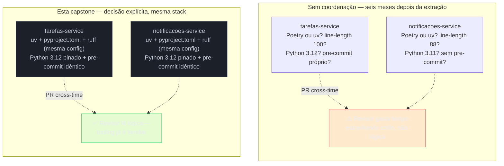
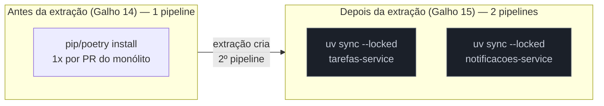
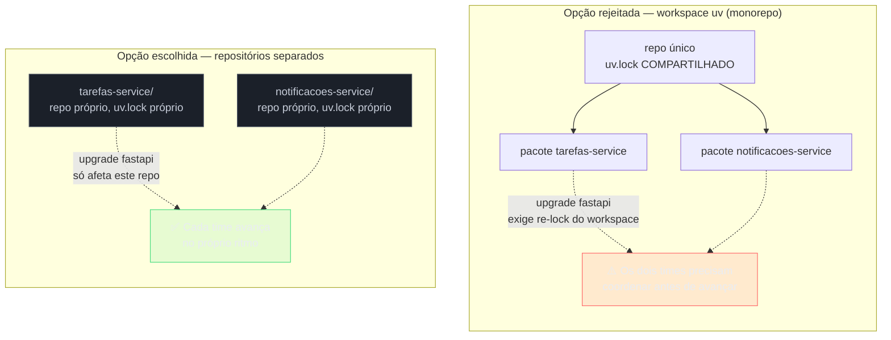

# Capstone — tooling consistente nos dois serviços

> [!abstract] TL;DR
> A [[03-Dominios/Tecnologia/Python/Microservices e sistemas distribuídos/08 - Capstone — extraindo o serviço de Notificações|capstone do Galho 15]] terminou com dois serviços Python de verdade — `tarefas-service` e `notificacoes-service` — em dois repositórios separados, dois pipelines de CI separados, dois times donos. Ela também deixou um risco em aberto, sem nomear diretamente: nada impede os dois times de configurar `ruff`, escolher gerenciador de dependências ou decidir versão de Python de jeitos sutilmente diferentes — e, seis meses depois, ninguém do time de Tarefas consegue revisar um PR de Notificações com fluência, porque o projeto "parece" escrito por outra equipe, mesmo sendo a mesma stack. Esta capstone fecha o Galho 16 aplicando, deliberadamente e com justificativa, o mesmo tooling aos dois serviços: `venv`/isolamento ([[02 - Virtual environments — isolamento de dependências|nota 02]]), `pyproject.toml` com a mesma estrutura de seções ([[03 - pyproject.toml — o padrão unificado|nota 03]]), `uv` como gerenciador único pelos dois ([[04 - uv — o gerenciador moderno|nota 04]], [[05 - Poetry — a alternativa madura|nota 05]], [[06 - uv vs Poetry — trade-offs honestos|nota 06]]), a mesma configuração de `ruff`/`ruff format` ([[07 - ruff e black — linting e formatação automática|nota 07]]), a mesma versão de Python fixada via `uv python pin`, a mesma decisão consciente de manter os repositórios separados (não um workspace `uv`), e o mesmo `.pre-commit-config.yaml` nos dois. Fecha o galho e aponta para o [[03-Dominios/Tecnologia/Python/index|Galho 17 — Observabilidade e produção]]: depois de garantir que os dois serviços são consistentes em como são construídos, o próximo passo é garantir que sejam consistentes em como são operados.

## O problema que esta capstone resolve não é técnico, é social

A [[03-Dominios/Tecnologia/Python/Microservices e sistemas distribuídos/08 - Capstone — extraindo o serviço de Notificações|capstone do Galho 15]] abriu com uma cena concreta: o time de Notificações preso, incapaz de deployar um adaptador de push mobile numa tarde de code freeze do time de Tarefas — os dois times reféns um do outro por um motivo que não tinha nada a ver com o código de nenhum dos dois. A extração resolveu esse problema. Mas resolver "cada time deploya no seu próprio ritmo" abre um problema novo, menos óbvio, que só aparece meses depois: **cada time também passa a decidir tooling no seu próprio ritmo**, e nada os obriga a decidir a mesma coisa.

Imagine o cenário, sem exagero: seis meses depois da extração, alguém do time de Tarefas precisa revisar um PR do serviço de Notificações — talvez porque o dono habitual está de férias, talvez porque é uma mudança que atravessa os dois serviços. Abre o repositório e encontra um `pyproject.toml` com `[tool.poetry]` em vez de `[project]`, porque alguém de Notificações preferiu Poetry. O `line-length` do `ruff` é 88, não 100 como em Tarefas — cada função "parece" mais apertada, mais quebrada em linhas menores, mesmo sendo o mesmo estilo de código. O `.python-version` diz `3.11`, não `3.12`. Nenhuma dessas diferenças é um bug. Cada uma, isolada, é uma escolha legítima — a [[06 - uv vs Poetry — trade-offs honestos|nota 06 deste galho]] já mostrou que Poetry é uma escolha racional, não um erro. O problema não é nenhuma escolha individual estar errada. É que a soma de escolhas individuais legítimas, tomadas sem coordenação, produz dois projetos que soam como se tivessem sido escritos por duas empresas diferentes — e cada diferença cosmética consome um segundo de "espera, por que isso é diferente aqui?" antes de qualquer revisão de lógica de negócio poder começar. É exatamente o mesmo tipo de atrito que a [[07 - ruff e black — linting e formatação automática|nota 07]] descreveu dentro de um único projeto — um PR de três dias discutindo vírgula — só que multiplicado pela fronteira entre dois repositórios, onde não existe nem a memória coletiva de um time só para arbitrar a divergência.



> [!tip] Consistência não é sobre a ferramenta "certa" — é sobre uma decisão só
> Vale repetir explicitamente, porque é fácil ler esta capstone como "a resposta certa é `uv`, ponto final" — não é esse o argumento. A [[06 - uv vs Poetry — trade-offs honestos|nota 06]] já deixou claro que Poetry continua sendo uma escolha legítima em produção. O que esta capstone defende não é "`uv` é objetivamente melhor" — é que, dado que os dois serviços nasceram do mesmo domínio, do mesmo time de Plataforma original, e vão continuar trocando PRs cross-time com alguma frequência, **a mesma escolha nos dois** vale mais do que a escolha tecnicamente ótima em cada um isoladamente. Um time poderia, com a mesma lógica, ter escolhido Poetry para os dois — o ponto não é qual ferramenta, é que os dois serviços usam a mesma.

## Peça 1 — cada serviço com seu próprio isolamento (nota 02)

Começando pelo alicerce mais básico: a [[02 - Virtual environments — isolamento de dependências|nota 02 deste galho]] estabeleceu que todo projeto Python real ganha seu próprio `.venv/` — nunca compartilhado entre projetos, sempre reproduzível a partir do manifesto declarativo e do lockfile. Depois da extração do Galho 15, isso deixou de ser uma regra abstrata e virou uma decisão concreta que precisa ser tomada duas vezes, uma vez por serviço.

```text
tarefas-service/                    notificacoes-service/
├── .venv/          (próprio)       ├── .venv/          (próprio)
├── pyproject.toml                  ├── pyproject.toml
├── uv.lock                         ├── uv.lock
├── .python-version                 ├── .python-version
└── src/                            └── src/
```

Nada nesta peça é novo em termos de mecanismo — é o mesmo `venv` (ou, na prática, `uv venv` por baixo dos comandos que a Peça 3 usa) que a nota 02 já ensinou. O que muda, e vale nomear explicitamente porque é fácil deixar implícito: **os dois `.venv/` nunca se tocam**. Não existe um `site-packages` compartilhado entre `tarefas-service` e `notificacoes-service`, mesmo que os dois rodem, na prática, exatamente as mesmas versões de `fastapi`, `httpx` e `pydantic` — cada serviço resolve e instala sua própria árvore de dependências, de forma independente. Isso pode soar redundante ("por que não compartilhar, se as versões são as mesmas?") — mas é exatamente a independência de deploy que motivou a extração inteira do Galho 15: se `tarefas-service` precisar atualizar `httpx` para uma versão nova antes de `notificacoes-service` estar pronto para isso, os dois `.venv/` isolados garantem que essa atualização não vaza de um serviço para o outro por acidente.

> [!question]- Isso não contradiz a ideia de "consistência" que o resto desta capstone defende?
> Não — e a distinção importa. Esta capstone defende consistência de **configuração** (a mesma estrutura de `pyproject.toml`, a mesma versão de Python, as mesmas regras de `ruff`) entre os dois serviços — não consistência de **estado runtime** (o mesmo `.venv/` físico, as mesmas versões exatas de cada dependência instalada a cada momento). São eixos diferentes: dois serviços podem ter configuração idêntica e, ainda assim, estarem em versões ligeiramente diferentes de uma dependência num dado momento, porque um dos dois times fez `uv add httpx==0.28` antes do outro. Isso é esperado e são precisamente a independência de deploy que a extração do Galho 15 comprou. O que esta capstone evita é a divergência de **como** cada serviço declara e resolve suas dependências — não força os dois a estarem sempre na mesma versão exata de tudo, a todo momento.

## Peça 2 — o mesmo esqueleto de `pyproject.toml` nos dois (nota 03)

A [[03 - pyproject.toml — o padrão unificado|nota 03 deste galho]] já mostrou o `pyproject.toml` do `tarefas-service` — `[build-system]`, `[project]`, `[project.optional-dependencies]`, `[tool.ruff]`, `[tool.pytest.ini_options]`, `[tool.mypy]`, `[tool.coverage.run]`. O que esta capstone faz é uma decisão simples de nomear, mas fácil de deixar implícita: **`notificacoes-service` ganha um `pyproject.toml` com exatamente a mesma estrutura de seções**, não um subconjunto arbitrário nem uma reorganização diferente.

```toml
# tarefas-service/pyproject.toml
[build-system]
requires = ["hatchling"]
build-backend = "hatchling.build"

[project]
name = "tarefas-service"
version = "2.0.0"
description = "Serviço de gestão de tarefas — API REST em FastAPI"
readme = "README.md"
requires-python = ">=3.12"
license = { text = "MIT" }
authors = [
    { name = "Time de Plataforma de Tarefas", email = "tarefas@empresa.dev" },
]

dependencies = [
    "fastapi>=0.115,<1.0",
    "uvicorn[standard]>=0.32",
    "sqlalchemy>=2.0",
    "pydantic>=2.9",
    "pydantic-settings>=2.6",
    "httpx>=0.27",
    "tenacity>=9.0",
    "pybreaker>=1.2",
    "opentelemetry-sdk>=1.28",
    "opentelemetry-instrumentation-fastapi>=0.49",
    "opentelemetry-instrumentation-httpx>=0.49",
]

[project.optional-dependencies]
dev = ["pytest>=8.3", "pytest-cov>=6.0", "pytest-mock>=3.14", "ruff>=0.8", "mypy>=1.13"]

[tool.ruff]
line-length = 100
target-version = "py312"

[tool.ruff.lint]
select = ["E", "F", "I", "UP", "B", "S"]
ignore = ["E501"]

[tool.ruff.format]
quote-style = "double"

[tool.pytest.ini_options]
testpaths = ["tests"]

[tool.mypy]
python_version = "3.12"
strict = true
exclude = ["tests/"]
```

```toml
# notificacoes-service/pyproject.toml — MESMA estrutura de seções, dependências diferentes
[build-system]
requires = ["hatchling"]
build-backend = "hatchling.build"

[project]
name = "notificacoes-service"
version = "1.0.0"
description = "Serviço de notificações — Slack, push mobile, e-mail"
readme = "README.md"
requires-python = ">=3.12"
license = { text = "MIT" }
authors = [
    { name = "Time de Plataforma de Notificações", email = "notificacoes@empresa.dev" },
]

dependencies = [
    "fastapi>=0.115,<1.0",
    "uvicorn[standard]>=0.32",
    "requests>=2.31",
    "aio-pika>=9.4",
    "opentelemetry-sdk>=1.28",
    "opentelemetry-instrumentation-fastapi>=0.49",
]

[project.optional-dependencies]
dev = ["pytest>=8.3", "pytest-cov>=6.0", "pytest-mock>=3.14", "ruff>=0.8", "mypy>=1.13"]

[tool.ruff]
line-length = 100
target-version = "py312"

[tool.ruff.lint]
select = ["E", "F", "I", "UP", "B", "S"]
ignore = ["E501"]

[tool.ruff.format]
quote-style = "double"

[tool.pytest.ini_options]
testpaths = ["tests"]

[tool.mypy]
python_version = "3.12"
strict = true
exclude = ["tests/"]
```

Comparando os dois lado a lado, o que muda é exatamente o que **deveria** mudar entre dois serviços com domínios diferentes: `name`, `description`, `authors`, e a lista de `dependencies` (cada serviço só declara o que de fato usa — `notificacoes-service` não carrega `sqlalchemy` nem `tenacity`/`pybreaker`, porque não faz chamadas de saída resilientes como o `tarefas-service` faz contra ele mesmo). O que **não** muda é a ordem das seções, os nomes de chave dentro de `[tool.ruff]`, o `target-version`, a estrutura de `[tool.mypy]`. Alguém que já leu o `pyproject.toml` de um dos dois serviços sabe exatamente onde procurar qualquer configuração no outro — a mesma vantagem de "fonte única de verdade, um lugar para procurar" que a nota 03 já atribuiu ao `pyproject.toml` dentro de um projeto só, agora reaplicada **entre** projetos.

> [!warning] "Mesma estrutura" não é "copiar e colar sem revisar"
> Um erro fácil de cometer ao aplicar essa consistência: copiar o `pyproject.toml` de um serviço para o outro e esquecer de trocar `dependencies`, deixando `notificacoes-service` com uma dependência de `sqlalchemy` que ele nunca importa. Isso não quebra nada tecnicamente (uma dependência não usada só ocupa espaço), mas reintroduz, por um caminho diferente, o mesmo problema de "por que isso está aqui?" que esta capstone existe para evitar. A consistência que importa é de **estrutura e convenção** (mesmas seções, mesmas chaves, mesma filosofia de configuração) — não de conteúdo idêntico linha a linha. Um checklist simples resolve isso: depois de copiar a estrutura, `uv sync` e rodar a suíte de testes reais do serviço apontam rápido qualquer dependência supérflua ou faltante.

## Peça 3 — `uv` para os dois, com a ressalva honesta sobre Poetry (notas 04, 05, 06)

Esta é a decisão que mais precisa de justificativa explícita, porque é fácil ler como "porque `uv` é a ferramenta melhor" — e essa não é a razão correta aqui.

A [[06 - uv vs Poetry — trade-offs honestos|nota 06 deste galho]] já deixou a árvore de decisão clara: para um projeto novo em 2026, sem inércia de nenhuma ferramenta já instalada, `uv` é a recomendação padrão da maioria da comunidade — velocidade de resolução, gerenciamento nativo de interpretador, vindo da mesma empresa que já ganhou confiança com `ruff`. `notificacoes-service`, extraído há pouco tempo no Galho 15, é exatamente esse caso: projeto novo, sem histórico de produção em nenhuma ferramenta específica, sem custo de migração porque não havia nada para migrar. A mesma lógica se aplicaria a `tarefas-service` se ele também fosse recém-criado — o que, no contexto desta trilha, é o caso (ele nasceu ao longo dos Galhos 12-15).

Mas a razão que importa nomear aqui não é "porque `uv` venceu no benchmark" — é a que a nota 06 chamou de eixo decisivo: **os dois serviços agora têm dois pipelines de CI rodando, não um**. Antes da extração, um único pipeline resolvia dependências uma vez por PR do monólito modular. Depois, cada `push` em cada um dos dois repositórios dispara sua própria resolução de dependências, de forma independente. O ganho de velocidade que a nota 04 mediu — de minutos para segundos — não é mais um ganho "por serviço", é um ganho que se multiplica pelo número de pipelines rodando em paralelo. Dois times, cada um com PRs abertos ao longo do dia, significa que o custo agregado de resolução lenta dobra exatamente no momento em que a extração criou dois pontos de resolução em vez de um.



A ressalva honesta, para não deixar essa peça soar como propaganda de ferramenta: se os dois serviços já tivessem meses de produção estável em Poetry antes desta capstone — o mesmo cenário que a [[05 - Poetry — a alternativa madura|nota 05]] descreveu com o time do serviço de cobrança de sete anos — o argumento de migrar seria mais fraco, e a árvore de decisão da nota 06 apontaria para "fique em Poetry, meça a dor real antes de trocar". Não é esse o caso aqui: os dois serviços são recentes o suficiente, dentro desta trilha, para que a escolha de `uv` não pague custo de migração nenhum. A decisão que de fato importa nesta capstone **não é** "`uv` em vez de Poetry" — é **"os dois serviços usam o mesmo gerenciador, seja qual for"**. Se este par de serviços já existisse há anos em Poetry, a decisão certa seria manter Poetry nos dois — nunca misturar um serviço em `uv` com o outro em Poetry só porque um time preferiu a ferramenta mais nova.

```bash
# tarefas-service/ — fixar versão, adicionar dependências, travar
cd tarefas-service
uv python pin 3.12
uv add fastapi uvicorn sqlalchemy pydantic-settings httpx tenacity pybreaker
uv add --dev pytest pytest-cov ruff mypy
uv lock

# notificacoes-service/ — mesmo fluxo, dependências diferentes
cd ../notificacoes-service
uv python pin 3.12
uv add fastapi uvicorn requests aio-pika
uv add --dev pytest pytest-cov ruff mypy
uv lock
```

```yaml
# .github/workflows/ci.yml — IDÊNTICO nos dois repositórios, salvo o nome do serviço
name: CI
on: [pull_request]

jobs:
  test:
    runs-on: ubuntu-latest
    steps:
      - uses: actions/checkout@v4
      - uses: astral-sh/setup-uv@v3
      - run: uv sync --locked --dev
      - run: uv run ruff check .
      - run: uv run ruff format --check .
      - run: uv run pytest
```

> [!question]- Por que não deixar cada time escolher e só documentar a diferença?
> Documentar a diferença resolve o problema de "alguém sabe que é diferente" — não resolve o problema de fricção real que esta capstone existe para eliminar. Um README explicando "Tarefas usa `uv`, Notificações usa Poetry, aqui está a tradução de comandos" ainda exige que qualquer pessoa revisando cross-time carregue essa tradução na cabeça, ou pare para consultar o README, toda vez. A [[06 - uv vs Poetry — trade-offs honestos|nota 06]] já nomeou esse custo: comandos parecidos, mas com detalhes diferentes o suficiente (`uv sync --locked` vs. `poetry install`, `uv run` vs. `poetry run`) para gerar confusão real nas primeiras semanas — mesmo com documentação. A decisão explícita de padronizar elimina esse custo de tradução constante, em vez de só torná-lo visível.

## Peça 4 — mesma configuração de `ruff`/`ruff format` nos dois (nota 07)

A Peça 2 já mostrou os dois blocos `[tool.ruff]` idênticos lado a lado — `line-length = 100`, `target-version = "py312"`, o mesmo `select`, o mesmo `ignore`, o mesmo `quote-style` em `[tool.ruff.format]`. O que vale desenvolver aqui é **por quê** essa igualdade importa mais do que em qualquer configuração isolada de projeto único.

A [[07 - ruff e black — linting e formatação automática|nota 07 deste galho]] descreveu o PR de três dias discutindo vírgula — um sintoma de ausência de convenção vinculante **dentro** de um time. O equivalente entre dois serviços é mais sutil e mais caro, porque não aparece como debate explícito de review — aparece como um custo cognitivo silencioso, pago toda vez que alguém lê código do outro serviço. Se `tarefas-service` usa `line-length = 100` e `notificacoes-service` usa 88, um dev de Tarefas abrindo o código de Notificações vê funções quebradas em mais linhas do que está acostumado — nada errado tecnicamente, mas o código "parece" de outro estilo, e o cérebro gasta um instante extra reconhecendo que não é um erro de formatação, é só uma configuração diferente. Multiplicado por centenas de arquivos lidos ao longo de meses de manutenção compartilhada, é atrito real, mesmo sem nenhum PR de três dias explícito para apontar.

```toml
# O MESMO bloco, byte a byte, em tarefas-service/pyproject.toml e notificacoes-service/pyproject.toml
[tool.ruff]
line-length = 100
target-version = "py312"

[tool.ruff.lint]
select = ["E", "F", "I", "UP", "B", "S"]
ignore = ["E501"]

[tool.ruff.format]
quote-style = "double"
```

> [!tip] Código de dois times, uma "mão" só
> O efeito prático que essa igualdade produz não é sutil: abrir um arquivo de `tarefas-service` e um de `notificacoes-service` lado a lado, sem olhar o nome do arquivo, não dá para adivinhar qual time escreveu qual — mesma largura de linha, mesmas aspas, mesma forma de quebrar uma lista longa, mesmos códigos de regra ativos. Isso não é um detalhe estético menor: é o que faz um dev de Tarefas conseguir revisar um PR de Notificações com a mesma fluência que revisaria um PR do próprio time — a formatação para de ser sinal de "isso é código de outro lugar" e vira só... código.

## Peça 5 — decisão explícita: mesma versão de Python nos dois serviços

Esta peça não vem de nenhuma nota anterior isolada — é uma decisão nova, que esta capstone precisa tomar de forma explícita porque nenhuma nota do galho até aqui precisou decidir isso entre **dois** projetos.

`uv python pin`, que a [[04 - uv — o gerenciador moderno|nota 04]] já cobriu como comando, grava um `.python-version` na raiz do projeto — a partir daí, qualquer `uv venv`, `uv sync` ou `uv run` naquele diretório usa automaticamente a versão fixada, baixando-a primeiro se necessário. A decisão desta capstone é simples de enunciar e fácil de negligenciar sem essa disciplina: **os dois serviços fixam a mesma versão**.

```bash
# tarefas-service/.python-version
3.12

# notificacoes-service/.python-version
3.12
```

O incidente que essa decisão evita tem nome próprio em quase todo time que já passou por ele: "funciona no meu serviço, não funciona no outro" — não por causa de um bug de lógica, mas por causa de uma diferença sutil de comportamento entre versões de interpretador. Um exemplo concreto e plausível neste par de serviços: a Peça 7 da capstone do Galho 15 instrumentou os dois serviços com OpenTelemetry, usando `HTTPXClientInstrumentor` e `FastAPIInstrumentor` — bibliotecas que, como qualquer dependência do ecossistema, declaram suporte a uma faixa de versões de Python e podem se comportar de forma sutilmente diferente (ou simplesmente não instalar) numa versão fora dessa faixa. Se `tarefas-service` rodasse em Python 3.12 e `notificacoes-service`, sem ninguém decidir isso conscientemente, tivesse ficado em 3.11 desde a extração original, um upgrade de dependência que passa a exigir `3.12+` quebraria silenciosamente só um dos dois — e o sintoma apareceria como "o pipeline de Notificações está vermelho, mas o de Tarefas está verde, mesmo os dois compartilhando quase as mesmas dependências de observabilidade", um sintoma que custa tempo de investigação até alguém notar que a causa raiz é só a versão do interpretador, não a lógica de nenhum dos dois serviços.

> [!warning] `.python-version` sem `requires-python` alinhado é uma consistência incompleta
> Fixar `.python-version = 3.12` nos dois repositórios não basta sozinho — a [[03 - pyproject.toml — o padrão unificado|nota 03 deste galho]] já mostrou que `requires-python` no `[project]` é o contrato declarado sobre qual versão mínima o projeto suporta. Os dois valores precisam contar a mesma história: `.python-version` diz "é isso que devs e CI usam para rodar localmente", `requires-python = ">=3.12"` diz "é isso que o projeto formalmente exige". Um `.python-version` em 3.12 ao lado de um `requires-python = ">=3.10"` no `pyproject.toml` não é tecnicamente incorreto — só deixa uma porta aberta para alguém, meses depois, rodar `uv sync` numa máquina com Python 3.10 instalado e legitimamente conseguir instalar o projeto, mesmo ele nunca tendo sido testado nessa versão.

## Peça 6 — decisão explícita: repositórios separados, não workspace `uv`

Esta é a decisão mais importante desta capstone para nomear com clareza, porque é a mais fácil de tomar por reflexo errado: "os dois serviços compartilham tanto tooling agora, por que não colocar os dois no mesmo repositório, como um monorepo?"

`uv` de fato suporta essa opção — **workspaces**, uma feature que permite múltiplos pacotes Python dentro de um único repositório, cada um com seu próprio `pyproject.toml`, mas compartilhando um `uv.lock` raiz e um `.venv` comum entre os membros do workspace. É a mesma ideia estrutural que Cargo (Rust) já oferece com seus workspaces, ou que um monorepo Node/TypeScript resolve com `pnpm`/`turborepo`. Para o par certo de circunstâncias — pacotes que evoluem juntos, que compartilham uma quantidade grande de código interno, cujos times fazem release em lockstep — um workspace `uv` é uma escolha genuinamente boa, e vale saber que a opção existe.

Não é o caso aqui, e a razão é a mesma que motivou a extração inteira no Galho 15: **os dois times querem, deliberadamente, ciclos de deploy independentes**. Um workspace `uv` compartilha um `uv.lock` único entre os pacotes-membro — o que significa que atualizar uma dependência compartilhada (por exemplo, `fastapi`) para um pacote do workspace tipicamente re-resolve e trava a versão para o workspace inteiro. Isso reintroduz, por um caminho técnico diferente, exatamente o acoplamento que a extração do Galho 15 existiu para quebrar: se `notificacoes-service` precisa atualizar `fastapi` para uma versão nova antes de `tarefas-service` estar pronto para validar essa mudança, um `uv.lock` compartilhado força uma negociação entre os dois times antes de qualquer um deles poder avançar — a mesma coordenação de deploy que a cena de abertura do Galho 15 (o code freeze bloqueando o adaptador de push mobile) mostrou como o problema real a resolver.



A decisão desta capstone, então, é dupla e deliberadamente em duas camadas diferentes: **consistência de configuração** (Peças 2 a 5 — mesma estrutura de `pyproject.toml`, mesmo gerenciador, mesmo `ruff`, mesma versão de Python) **sem** compartilhar **infraestrutura de repositório** (workspace, `uv.lock` único, `.venv` comum). Os dois eixos são independentes — nada em ter a mesma configuração exige compartilhar o mesmo lockfile físico, e é exatamente por manter os dois separados que cada time preserva a independência de deploy que motivou a extração original.

> [!question]- Existe um cenário onde um workspace `uv` faria sentido pra esses dois serviços especificamente?
> Sim, e vale nomear para não soar como uma rejeição categórica de workspaces em geral: se, em algum momento futuro, `tarefas-service` e `notificacoes-service` passarem a compartilhar uma biblioteca interna substancial — um pacote de schemas Pydantic comuns, um cliente HTTP compartilhado, um SDK interno de autenticação — um workspace `uv` (ou um pacote publicado internamente, resolvido via um índice privado, o que a [[05 - Poetry — a alternativa madura|nota 05]] também cobriu como opção) passaria a fazer sentido para **esse pacote compartilhado especificamente**, sem necessariamente forçar os dois serviços a voltar a um mesmo repositório. A decisão desta capstone é sobre o estado atual dos dois serviços — dois domínios com times e ritmos de deploy distintos — não uma afirmação de que workspace nunca vale a pena em nenhum cenário futuro desta arquitetura.

## Peça 7 — `.pre-commit-config.yaml` compartilhado

A última peça fecha o ciclo do jeito mais concreto: o mesmo arquivo, quase byte a byte, em ambos os repositórios, garantindo que nenhum commit malformatado chegue a existir em nenhum dos dois times — o mesmo mecanismo que a [[07 - ruff e black — linting e formatação automática|nota 07 deste galho]] já descreveu, agora aplicado duas vezes, de forma coordenada.

```yaml
# .pre-commit-config.yaml — IDÊNTICO em tarefas-service/ e notificacoes-service/
repos:
  - repo: https://github.com/astral-sh/ruff-pre-commit
    rev: v0.8.4
    hooks:
      - id: ruff
        args: [--fix]
      - id: ruff-format

  - repo: https://github.com/pre-commit/pre-commit-hooks
    rev: v5.0.0
    hooks:
      - id: trailing-whitespace
      - id: end-of-file-fixer
      - id: check-toml
      - id: check-merge-conflict
```

```bash
# Onboarding de qualquer pessoa nova, em QUALQUER um dos dois times
git clone <repositório>
cd <repositório>
uv sync --dev
uv run pre-commit install
```

O detalhe que faz essa peça valer mais do que "mais um arquivo copiado": a `rev` do hook do `ruff-pre-commit` também precisa ficar sincronizada entre os dois repositórios, não só o conteúdo do `.pre-commit-config.yaml`. Se `tarefas-service` atualiza para `v0.9.0` e `notificacoes-service` fica parado em `v0.8.4`, os dois times voltam a divergir silenciosamente — não na configuração declarada (que continua "igual" no texto do YAML, exceto pela `rev`), mas no comportamento real do linter, porque uma nova versão do `ruff` pode ativar regras novas por padrão ou mudar sutilmente uma decisão de formatação. Manter as duas peças sincronizadas — o conteúdo do arquivo e a versão pinada dentro dele — é o que de fato garante que "os dois times rodam a mesma checagem" continue verdadeiro ao longo do tempo, não só no dia em que o arquivo foi copiado pela primeira vez.

> [!tip] Um `.pre-commit-config.yaml` compartilhado não precisa de um terceiro repositório para existir
> Não é preciso criar um repositório central de "configuração compartilhada" só para isso — a essa escala (dois serviços, mesmo domínio, times próximos), copiar o arquivo manualmente e revisar a sincronia numa rotina simples (por exemplo, um lembrete no checklist de release, ou um bot de dependabot configurado para abrir PR em ambos quando a `rev` do `ruff-pre-commit` sobe) já resolve o problema sem introduzir a complexidade de gerenciar um pacote de configuração publicado internamente. Se um dia existirem cinco ou dez serviços Python no mesmo domínio, aí sim um repositório de configuração compartilhada (um "template" de `.pre-commit-config.yaml`, `pyproject.toml` base, ou até um `cookiecutter`/`copier` de projeto novo) passa a valer o investimento — para dois serviços, a disciplina manual de manter os dois arquivos sincronizados é suficiente.

## O estado final: dois serviços, uma "mão" só

Juntando as sete peças, o estado que esta capstone entrega:


O diagrama deixa a tensão explícita: as duas colunas são idênticas em **estrutura** — mesmo isolamento, mesma forma de declarar dependências, mesmo gerenciador, mesma configuração de qualidade de código, mesma versão de interpretador, mesmo gancho de pre-commit — mas continuam sendo dois repositórios de verdade, sem nenhuma infraestrutura compartilhada que force os dois times a se coordenar para avançar. É a combinação das duas coisas — consistência de configuração **e** independência de infraestrutura — que faz esta capstone valer a pena: nenhuma das duas sozinha resolveria o problema completo. Consistência sem independência (um workspace único) reintroduziria o acoplamento que o Galho 15 quebrou. Independência sem consistência (cada time escolhendo tooling livremente) é o estado inicial, problemático, que esta capstone existiu para corrigir.

## O que esta capstone fecha, e o que abre

Esta nota fecha o Galho 16 inteiro. A [[01 - Panorama — por que packaging Python era confuso|nota 01]] abriu o galho contando por que packaging Python foi fragmentado por quase vinte anos — múltiplos arquivos, nenhuma fonte única de verdade. A [[02 - Virtual environments — isolamento de dependências|nota 02]] e a [[03 - pyproject.toml — o padrão unificado|nota 03]] estabeleceram os dois alicerces (isolamento de ambiente, manifesto declarativo único) sobre os quais qualquer gerenciador de projeto moderno se apoia. As notas [[04 - uv — o gerenciador moderno|04]], [[05 - Poetry — a alternativa madura|05]] e [[06 - uv vs Poetry — trade-offs honestos|06]] cobriram os dois gerenciadores completos que resolvem dependência, ambiente e lockfile de ponta a ponta, e a comparação honesta entre eles. A [[07 - ruff e black — linting e formatação automática|nota 07]] fechou o lado de qualidade de código automatizada, com o mecanismo de enforcement (`pre-commit`) que garante que a configuração declarada de fato se aplica a cada commit. Esta capstone não introduziu nenhum conceito novo — ela pegou as sete peças e mostrou o motivo real de aplicá-las com disciplina: dois times, dois serviços, um risco social de divergência silenciosa que só fica visível meses depois, quando alguém tenta revisar código do outro lado e sente o atrito.

O que fica de fora, deliberadamente, e aponta para o próximo galho: esta capstone garantiu que os dois serviços são consistentes em **como são construídos** — o mesmo tooling, a mesma versão de interpretador, o mesmo padrão de qualidade de código antes de cada commit. Não tocou em nada sobre **como os dois serviços se comportam depois de deployados** — logging estruturado, métricas, health checks, graceful shutdown, o que acontece quando um dos dois cai em produção às 3 da manhã. Essa é exatamente a lacuna que o [[03-Dominios/Tecnologia/Python/index|Galho 17 — Observabilidade e produção]] cobre: agora que os dois serviços compartilham a mesma disciplina de build, o próximo passo natural é garantir que compartilhem também a mesma disciplina de operação — porque um `tarefas-service` que loga em JSON estruturado e um `notificacoes-service` que loga texto solto reproduzem, na operação, exatamente o mesmo problema que esta capstone acabou de resolver na construção.

> [!tip] O padrão desta capstone se repete em qualquer par (ou trio, ou dezena) de serviços do mesmo domínio
> Nada nesta capstone é específico de `tarefas-service`/`notificacoes-service` — é o mesmo raciocínio que qualquer organização com múltiplos serviços Python do mesmo domínio, mantidos por times diferentes, precisa aplicar mais cedo ou mais tarde: escolher **uma vez**, deliberadamente, o gerenciador de dependências, a versão de interpretador, a configuração de lint/format e o gate de pre-commit — e então replicar essa escolha em cada novo serviço, em vez de deixar cada time decidir por conta própria e descobrir a divergência só quando alguém precisa revisar código de fora do próprio time. Quanto mais serviços um domínio acumula, mais esse investimento inicial (documentar a decisão, talvez criar um template de projeto) se paga — mas o princípio já vale com dois.

## Como explicar em inglês

> "After extracting two independent Python services in the previous chapter, the risk that shows up months later isn't technical — it's social: nothing stops two teams from configuring `ruff`, choosing a dependency manager, or pinning a Python version differently, and each individual choice can be perfectly reasonable on its own. This capstone applies the same tooling — `uv` as the package manager for both, identical `ruff` configuration, the same pinned Python version via `uv python pin`, and an identical `.pre-commit-config.yaml` — deliberately, with the explicit justification being consistency between the two services, not 'uv is objectively better.' The one decision I want to call out explicitly: the two services stay in separate repositories rather than a `uv` workspace, because each team wants an independent deploy cadence — a shared `uv.lock` across a workspace would reintroduce exactly the coordination cost the original service extraction was meant to remove. Consistent tooling and independent infrastructure aren't in tension; they're solving two different problems at once."

| PT | EN |
|----|----|
| tooling consistente | consistent tooling |
| divergência silenciosa | silent drift |
| custo cognitivo de revisão | code-review cognitive cost |
| workspace (uv) | workspace |
| ciclo de deploy independente | independent deploy cadence |
| versão de interpretador fixada | pinned interpreter version |
| gancho de pre-commit compartilhado | shared pre-commit hook |

## Fontes

- **Astral** — [*uv — Workspaces*](https://docs.astral.sh/uv/concepts/projects/workspaces/) — documentação oficial sobre workspaces `uv`, monorepo de múltiplos pacotes com `uv.lock` compartilhado.
- **Astral** — [*uv — Installing and managing Python*](https://docs.astral.sh/uv/guides/install-python/) — `uv python pin`, `.python-version`.
- **pre-commit** — [*pre-commit — A framework for managing multi-language pre-commit hooks*](https://pre-commit.com/) — reaproveitado das notas anteriores deste galho.
- **GitHub — astral-sh/ruff-pre-commit** — [*ruff-pre-commit*](https://github.com/astral-sh/ruff-pre-commit) — hooks oficiais, versionamento de `rev`.
- Este galho — [[01 - Panorama — por que packaging Python era confuso]], [[02 - Virtual environments — isolamento de dependências]], [[03 - pyproject.toml — o padrão unificado]], [[04 - uv — o gerenciador moderno]], [[05 - Poetry — a alternativa madura]], [[06 - uv vs Poetry — trade-offs honestos]], [[07 - ruff e black — linting e formatação automática]] — base factual completa desta capstone.
- [[03-Dominios/Tecnologia/Python/Microservices e sistemas distribuídos/08 - Capstone — extraindo o serviço de Notificações|Capstone do Galho 15]] — estado dos dois serviços antes desta capstone, a cena de abertura (code freeze bloqueando deploy) que motiva a Peça 6.

Consultado em 2026-07-12.
