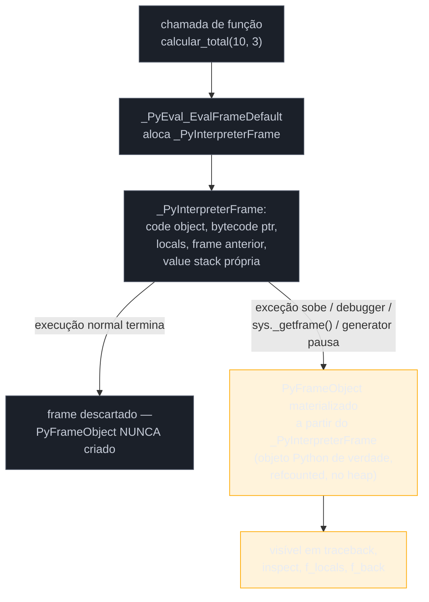

# O interpretador por dentro — ceval loop e frame objects

> [!abstract] TL;DR
> A nota [[03-Dominios/Tecnologia/Python/Core/01 - O que é Python e como ele executa|Core/01]] mostrou *que* o CPython compila `.py` para bytecode e executa esse bytecode numa VM stack-based. Esta nota abre a caixa dessa VM. O motor é uma função C só, `_PyEval_EvalFrameDefault`, definida em `Python/ceval.c`: um laço `for (;;)` com um `switch` gigante (ou, em builds otimizadas, uma tabela de *computed goto*) que decodifica uma instrução de bytecode por vez e executa o efeito correspondente. Cada chamada de função cria um **frame** — desde o Python 3.11, dividido em duas estruturas: `_PyInterpreterFrame` (leve, vive na pilha C, é o que o loop de fato manipula) e `PyFrameObject` (pesado, alocado no heap só sob demanda, o que você vê em tracebacks e no `inspect`). Cada frame carrega sua própria **pilha de avaliação** (*value stack*), onde cada instrução empilha e desempilha operandos — é aí, e não em registradores nomeados, que os valores intermediários de uma expressão vivem enquanto são calculados. Desde a Python 3.11, o loop também **especializa** instruções em tempo de execução (PEP 659): um `BINARY_OP` genérico vira, depois de rodar algumas vezes com os mesmos tipos, uma variante mais rápida específica para `int + int`. E CPython não é a única implementação desse contrato — **PyPy** compila trechos quentes para código de máquina via um JIT de rastreamento, **MicroPython** roda uma VM enxuta em microcontroladores com poucos KB de RAM, e o próprio CPython vem ganhando (desde a 3.13, experimental) um JIT interno via PEP 744.

## O problema: o que "empilha" quando uma função chama outra?

Considere um `RecursionError` clássico — ou, pior, um `Segmentation fault` silencioso sem traceback nenhum, que às vezes acontece com recursão muito profunda em builds específicas do CPython. A explicação de manual costuma ser "estourou a pilha de chamadas" — mas *qual* pilha, exatamente? Não existe uma "pilha de chamadas do Python" isolada, flutuando livre na memória: existe a pilha de chamadas do **processo C** que é o interpretador CPython rodando, e cada chamada de função Python — `calcular_total()`, que chama `aplicar_desconto()`, que chama `validar()` — em algum nível, também consome frames dessa mesma pilha C, porque `_PyEval_EvalFrameDefault` é, ela mesma, uma função C, e uma chamada Python aninhada tipicamente dispara uma chamada C aninhada de volta para essa mesma função.

```python
def fatorial(n):
    if n <= 1:
        return 1
    return n * fatorial(n - 1)

fatorial(100_000)
```

```text
Traceback (most recent call last):
  ...
RecursionError: maximum recursion depth exceeded
```

O `sys.setrecursionlimit()` que resolve (ou "resolve", com aspas — veja adiante) esse erro não é uma configuração arbitrária de conveniência; é um limite de segurança contra o C stack do processo estourar de verdade — o que, ao contrário do `RecursionError` (uma exceção Python normal, capturável), pode terminar num crash do interpretador inteiro. Entender por que isso acontece exige abrir a caixa que a nota do Core deixou fechada: o que, precisamente, o CPython aloca a cada chamada de função, e onde.

> [!question]- Se aumentar `sys.setrecursionlimit()` resolve o `RecursionError`, por que não aumentar sempre?
> Porque o limite de recursão do Python é uma cerca de segurança **antes** do limite real, que é o tamanho do C stack do sistema operacional (tipicamente 1 MB a 8 MB, dependendo da plataforma e da configuração da thread). O `RecursionError`, por ser uma exceção Python normal, é seguro — captura-se, o programa continua. Se você aumenta `sys.setrecursionlimit()` demais e a recursão real ultrapassa o C stack antes de atingir o novo limite Python, o resultado não é mais um `RecursionError` — é um `Segmentation fault` do processo, sem chance de recuperação, porque nesse ponto quem estourou não foi uma estrutura de dados Python, foi a memória de pilha do próprio SO por trás do processo `python`. Aumentar o limite é seguro *até* um ponto que depende da plataforma — não existe um valor universalmente correto, e a solução de verdade para recursão profunda em produção quase sempre é reescrever para iteração, não turbinar o limite.

## Como funciona

### `ceval.c`: uma função C, um laço, uma tabela de opcodes

Tudo que a nota do Core chamou de "a VM" é, em código real, a função `_PyEval_EvalFrameDefault`, definida no arquivo [`Python/ceval.c`](https://github.com/python/cpython/blob/main/Python/ceval.c) do próprio código-fonte do CPython. Segundo a [documentação interna do projeto sobre o interpretador](https://github.com/python/cpython/blob/main/InternalDocs/interpreter.md), essa função recebe um `code object` (o bytecode compilado — o que `dis.dis` mostra) dentro de um `frame`, e a partir daí é só um laço:

```text
for (;;) {
    instrução = próxima instrução do bytecode
    switch (instrução.opcode) {
        case LOAD_FAST:  ...; break;
        case BINARY_OP:  ...; break;
        case CALL:       ...; break;
        case RETURN_VALUE: ...; break;
        // ~150+ opcodes possíveis
    }
}
```

Cada instrução de bytecode ocupa uma **unidade de código de 16 bits** — 8 bits de opcode (qual instrução) e 8 bits de `oparg` (o argumento dela, por exemplo *qual* variável local o `LOAD_FAST` deve empilhar). Quando um argumento não cabe em 8 bits, o compilador prefixa a instrução real com até três opcodes `EXTENDED_ARG`, que só existem para completar bits extras do argumento seguinte — um detalhe de codificação que raramente importa na prática, mas que explica por que, em `dis.dis` de funções com muitas constantes ou variáveis, você eventualmente vê `EXTENDED_ARG` aparecer sozinho antes de uma instrução "de verdade".

O `switch` gigante é a forma **portável** de despachar — compila em qualquer compilador C compatível. Mas builds de produção do CPython (a maioria das distribuições oficiais, configuradas com `--with-computed-gotos`) usam uma técnica mais rápida: em vez de um único `switch` que o compilador precisa reduzir a uma tabela de saltos e um teste de limites, cada `case` termina com um `goto` direto — calculado, em tempo de execução, a partir de uma tabela de endereços (`opcode_targets[opcode]`) — para o próximo bloco de código, pulando o overhead do `switch`. É a técnica clássica de "*labels as values*", uma extensão específica de GCC/Clang (não padrão C), e ela é a razão de "computed goto" aparecer com frequência em discussões sobre performance do interpretador — inclusive em [issues recentes do próprio repositório](https://github.com/python/cpython/issues/129987) discutindo como impedir o compilador de "otimizar" essas saídas de um jeito que anula o ganho pretendido.

> [!question]- Um switch/goto gigante não deveria ser lento, comparado a um "compilador de verdade"?
> É lento comparado a código de máquina nativo — cada instrução Python custa dezenas de instruções de CPU reais (decodificar o opcode, verificar tipos, manipular a pilha, checar overflow de inteiro, etc.), enquanto uma instrução nativa equivalente custaria uma. É exatamente esse overhead de "interpretar uma instrução por vez, sempre do zero" que a [[03-Dominios/Tecnologia/Python/Core/01 - O que é Python e como ele executa|nota do Core]] apontou como a razão estrutural de Python ser mais lento que Java/C em código CPU-bound. Mas "lento comparado a nativo" não é "lento comparado a alternativas realistas": um interpretador puro, mesmo sem JIT, ainda é ordens de magnitude mais rápido que reprocessar a AST a cada linha (o que uma implementação ingênua "só interpretada, sem bytecode nenhum" faria), e o CPython moderno (3.11+) já não é "puro" nesse sentido — ele especializa instruções em runtime, como a próxima seção explica.

### Especialização adaptativa: o interpretador que "aprende" enquanto roda

Desde a Python 3.11, o loop de `ceval.c` não trata cada instrução como estaticamente fixa. A [PEP 659 — Specializing Adaptive Interpreter](https://peps.python.org/pep-0659/) introduziu um mecanismo em que instruções genéricas (`BINARY_OP`, `LOAD_ATTR`, `CALL`, `COMPARE_OP`, entre outras) começam **adaptativas**: rodam algumas vezes de forma genérica, coletando dados sobre os tipos reais envolvidos, e depois de um pequeno número de execuções, o interpretador **reescreve a própria instrução em memória** para uma variante especializada — por exemplo, um `BINARY_OP` que sempre viu dois `int` vira internamente uma forma otimizada para soma/multiplicação de inteiros, pulando as checagens genéricas de despacho de tipo que o caso geral precisaria fazer.

Esse mecanismo é observável — não é só teoria de implementação. O próprio módulo `dis` expõe a versão especializada do bytecode:

```python
import dis

def somar(a, b):
    return a + b

for _ in range(50):
    somar(1, 2)   # "aquece" a instrução com inteiros

dis.dis(somar, adaptive=True)
```

Depois de aquecida, a instrução `BINARY_OP` aparece anotada como uma forma especializada (o nome exato da variante muda entre versões — o ponto que importa é que a *mesma posição de bytecode* passou a apontar para um caminho de execução mais direto, sem checagem de tipo repetida). Se, no meio da execução, `somar` for chamada com tipos diferentes (`somar("a", "b")`, por exemplo), a instrução especializada **falha sua verificação de guarda** e o interpretador faz *deoptimization* — volta para a forma genérica automaticamente, sem erro visível para quem chama.

> [!warning] Especialização é silenciosa e não aparece no `dis.dis` padrão
> Rodar `dis.dis(minha_funcao)` sem `adaptive=True` sempre mostra o bytecode genérico "de fachada" — a especialização acontece em cópias internas da instrução, mantidas ao lado do bytecode que o `dis` exibe por padrão. Isso é deliberado: o bytecode "canônico" de um code object não muda (código que introspecciona `co_code` continua vendo o mesmo bytecode), só a forma que o *loop de execução* de fato segue muda por baixo. Para observar a especialização, é preciso pedir explicitamente (`adaptive=True`) ou usar ferramentas de profiling voltadas para isso — um tema que o [[03-Dominios/Tecnologia/Python/CPython internals/08 - Profiling — cProfile, py-spy, tracemalloc|galho 8 deste mesmo bloco]] retoma.

**Especialização adaptativa em uma frase:** desde a 3.11, o CPython não interpreta bytecode genérico para sempre — ele observa os tipos reais que passam por uma instrução e reescreve essa instrução, em memória, para uma forma mais rápida específica daquele caso comum, com um caminho de fallback automático se a suposição deixar de valer.

### Frame objects: o que de fato fica na "pilha de chamadas"

Cada vez que uma função Python é chamada, o CPython precisa de um lugar para guardar: qual code object está rodando, em que instrução (bytecode) a execução está, quais são os valores das variáveis locais, o frame de quem chamou (para saber para onde voltar), e a própria pilha de avaliação daquela chamada (próxima seção). Esse "lugar" é o **frame**.

Até a Python 3.10, existia uma única estrutura para isso: `PyFrameObject`, um objeto Python completo — com contagem de referências, alocado no heap, pesado o bastante para que criar um frame a cada chamada de função fosse uma fonte mensurável de overhead. A Python 3.11 dividiu essa responsabilidade em duas, numa mudança documentada tanto no [changelog oficial da 3.11](https://docs.python.org/3/whatsnew/3.11.html) quanto no [guia interno de frames do próprio CPython](https://github.com/python/cpython/blob/main/InternalDocs/frames.md):

- **`_PyInterpreterFrame`** — a estrutura *real* que `_PyEval_EvalFrameDefault` manipula a cada chamada. É leve, é alocada, sempre que possível, direto num bloco de memória contíguo por thread (não no heap com contagem de referência própria, e frequentemente reaproveitando espaço da própria pilha de avaliação da chamada anterior), e existe **para toda chamada de função**, mesmo as que nunca são inspecionadas por ninguém.
- **`PyFrameObject`** — o objeto Python completo, com refcounting normal, que você manipula via `inspect`, vê num traceback, ou acessa com `sys._getframe()`. Ele só é **materializado** (construído a partir do `_PyInterpreterFrame` correspondente) quando algo realmente pede por ele — uma exceção não tratada subindo a pilha, um `traceback.format_exc()`, um debugger fazendo `frame.f_locals`.



O ganho de performance dessa divisão é justamente evitar pagar o custo de um objeto Python completo (alocação de heap, inicialização de refcount, campos que ninguém vai ler) em toda chamada de função — a imensa maioria das chamadas nunca precisa de introspecção, então a maioria dos frames nunca vira um `PyFrameObject` de verdade. É esse mecanismo — junto com a especialização adaptativa da seção anterior — que a [PEP 659 e o trabalho da 3.11 em geral](https://docs.python.org/3/whatsnew/3.11.html) citam como responsável por boa parte do ganho de ~25% de velocidade média da 3.11 sobre a 3.10 em benchmarks padrão.

> [!question]- Se frames "empilham", onde exatamente essa pilha vive na memória?
> Não é uma estrutura de dados Python separada com `push`/`pop` explícitos que você inspeciona — é, na prática, uma região de memória gerenciada pelo interpretador por thread (o "*data stack*" da thread, historicamente chamado de *frame stack*), onde `_PyInterpreterFrame`s consecutivos ficam fisicamente próximos, e cada um guarda um ponteiro (`previous`) para o frame de quem o chamou. Essa cadeia de ponteiros `previous` é o que forma a "pilha de chamadas" conceitual — não uma lista Python, um encadeamento de structs C. É por isso que um `RecursionError` de fato reflete profundidade real de memória consumida (cada frame ocupa espaço), e não é só um contador artificial desconectado de custo — embora o contador (`sys.getrecursionlimit()`) seja, ele sim, um limite lógico configurável, separado (mas relacionado) do limite físico do C stack mencionado na abertura desta nota.

**Frame objects em uma frase:** desde a 3.11, toda chamada de função cria um `_PyInterpreterFrame` leve e barato (o que o loop de execução realmente usa); o `PyFrameObject` pesado e refcounted — o que aparece em tracebacks e debuggers — só é construído sob demanda, quando algo de fato precisa inspecionar aquele frame.

### A pilha de avaliação: onde os operandos vivem entre uma instrução e a próxima

Cada frame carrega sua própria **pilha de avaliação** (*value stack* ou *evaluation stack*) — um array de ponteiros para objetos Python, cujo tamanho máximo é pré-calculado pelo compilador e armazenado no atributo `co_stacksize` do code object (você pode inspecionar isso: `minha_funcao.__code__.co_stacksize`). É nessa pilha, e não em "variáveis temporárias com nome", que os resultados intermediários de uma expressão vivem enquanto são calculados.

O mecanismo é literal: dentro de `_PyEval_EvalFrameDefault`, empilhar um valor é `*stack_pointer++ = valor` (escreve no topo, avança o ponteiro), e desempilhar é `valor = *--stack_pointer` (recua o ponteiro, lê o valor de lá) — as macros internas `PUSH()`/`POP()` do próprio `ceval.c` fazem exatamente isso. Cada instrução de bytecode tem um "efeito de pilha" bem definido: quantos valores ela consome do topo e quantos ela produz de volta.

```python
def calcular_total(preco, quantidade):
    imposto = preco * 0.1
    return (preco + imposto) * quantidade
```

```text
  1           0 RESUME                   0

  2           2 LOAD_FAST                0 (preco)
              4 LOAD_CONST               1 (0.1)
              6 BINARY_OP                5 (*)
             10 STORE_FAST               2 (imposto)

  3          12 LOAD_FAST                0 (preco)
             14 LOAD_FAST                2 (imposto)
             16 BINARY_OP                0 (+)
             20 LOAD_FAST                1 (quantidade)
             22 BINARY_OP                5 (*)
             26 RETURN_VALUE
```

Instrução a instrução, é isso que acontece na pilha de avaliação daquele frame:

1. `LOAD_FAST 0 (preco)` — empilha o valor da variável local `preco`. Pilha: `[preco]`.
2. `LOAD_CONST 1 (0.1)` — empilha a constante `0.1`. Pilha: `[preco, 0.1]`.
3. `BINARY_OP 5 (*)` — desempilha os dois valores do topo, multiplica, empilha o resultado. Pilha: `[preco*0.1]`.
4. `STORE_FAST 2 (imposto)` — desempilha o topo e guarda no slot local `imposto`. Pilha: `[]`.
5. `LOAD_FAST 0 (preco)` — empilha `preco` de novo. Pilha: `[preco]`.
6. `LOAD_FAST 2 (imposto)` — empilha `imposto`. Pilha: `[preco, imposto]`.
7. `BINARY_OP 0 (+)` — soma os dois do topo. Pilha: `[preco+imposto]`.
8. `LOAD_FAST 1 (quantidade)` — empilha `quantidade`. Pilha: `[preco+imposto, quantidade]`.
9. `BINARY_OP 5 (*)` — multiplica. Pilha: `[(preco+imposto)*quantidade]`.
10. `RETURN_VALUE` — desempilha o único valor restante e devolve para quem chamou; a pilha daquele frame termina vazia, e o frame em si é descartado (ou materializado, se algo precisar dele — geradores em pausa são o caso mais comum, tema do [[03-Dominios/Tecnologia/Python/Funcional e idiomas avançados/index|Galho 4]]).

Repare que `RESUME`, a primeira instrução, não manipula a pilha de valores — ela é um marcador de bootstrap de frame, adicionado na 3.11 junto com toda a reformulação de frames desta nota, usado internamente para checagens de tracing/debugging no início de cada execução de code object. E note também que `BINARY_OP` é a *mesma* instrução tanto para `*` quanto para `+` — o argumento (`5` para multiplicação, `0` para soma) é o que diferencia a operação; é exatamente essa instrução genérica que a especialização adaptativa da seção anterior reescreve internamente, depois de algumas execuções, para uma forma mais direta específica dos tipos observados.

> [!warning] A pilha de avaliação é por frame, não global
> Um erro conceitual comum é imaginar "uma pilha só" para todo o programa, misturando operandos de chamadas diferentes. Não é assim: cada `_PyInterpreterFrame` tem sua própria região de pilha de avaliação, dimensionada para o `co_stacksize` daquele code object especificamente. Quando `calcular_total` chama outra função no meio de uma expressão, o frame da chamada nova recebe sua *própria* pilha de avaliação — o `CALL` empilha o resultado de volta na pilha do frame *chamador* só depois que o frame *chamado* retorna e é descartado. As pilhas de avaliação de frames aninhados nunca se misturam; o que as conecta é só o ponteiro de "frame anterior" mencionado na seção sobre frame objects.

**Pilha de avaliação em uma frase:** dentro de cada frame, cada instrução de bytecode consome um número fixo de valores do topo de um array e empilha de volta um número fixo de resultados — é aí, e não em registradores nomeados, que uma expressão como `(preco + imposto) * quantidade` guarda seus resultados parciais enquanto é calculada de dentro para fora.

### CPython não é a única implementação — nem a única com JIT

Tudo que esta nota descreveu — `ceval.c`, `_PyInterpreterFrame`, especialização adaptativa, pilha de avaliação por frame — é comportamento de **implementação**, não de especificação de linguagem, o mesmo alerta que a nota do Core já fez sobre bytecode e `.pyc`. Vale reforçar o panorama com mais profundidade agora que você viu o motor por dentro:

- **PyPy** não especializa instrução a instrução como o CPython 3.11+ faz — ela usa um **JIT de rastreamento** (*tracing JIT*): identifica loops "quentes" (executados repetidamente), grava uma sequência linear das operações reais executadas numa passada daquele loop (incluindo até alguns níveis de chamadas de função inlineadas), otimiza esse rastro gravado, e o compila para código de máquina nativo. É uma estratégia diferente da que o CPython adota mesmo com o JIT experimental mencionado abaixo — PyPy compila **trilhas de execução observadas**, CPython (no seu JIT novo) compila **micro-unidades de bytecode** frequentes via *copy-and-patch*, não trilhas inteiras.
- **MicroPython** roda uma VM deliberadamente enxuta — poucos opcodes, sem a especialização adaptativa da 3.11+, biblioteca padrão mínima — otimizada para caber em microcontroladores com poucos KB de RAM (ESP32, Raspberry Pi Pico), onde o overhead de um `_PyInterpreterFrame` no estilo CPython 3.11+ já seria proibitivo.
- O próprio **CPython** vem deixando de ser "só um interpretador especializado": desde a Python 3.13, existe um **JIT experimental** (fora do build padrão), formalizado pela [PEP 744](https://peps.python.org/pep-0744/), usando uma técnica chamada *copy-and-patch* — templates de micro-operações são compilados uma vez, em tempo de build, via LLVM, e o interpretador "cola e corrige" (*patch*) esses templates em tempo de execução para caminhos de código quentes, sem precisar de um compilador JIT completo embutido no runtime. Nas versões 3.13 e 3.14, esse JIT frequentemente ainda era **mais lento** que o interpretador especializado puro em vários benchmarks — só a partir de trabalho mais recente (documentado em discussões da comunidade sobre a série 3.15) ele começou a mostrar ganhos consistentes, algo como um dígito de percentual de melhoria geométrica média sobre plataformas medidas.

O ponto que fica, para entrevista e para leitura de qualquer material sobre "performance do Python": **"CPython"**, **"a especificação da linguagem Python"** e **"a única forma possível de executar Python"** são três coisas diferentes, e confundi-las é o erro mais comum de quem nunca abriu essa caixa.

## Armadilhas

> [!warning] Achar que o `switch`/computed-goto do ceval.c é "burro" e por isso Python é sempre lento
> O laço de despacho é só metade da história desde a 3.11 — a especialização adaptativa (PEP 659) faz o próprio loop reescrever instruções quentes para formas mais diretas em runtime, e o JIT experimental (PEP 744, desde a 3.13) vai além disso, compilando caminhos quentes para código de máquina real. "Python interpreta instrução por instrução, sempre da forma mais genérica possível" descreve o CPython pré-3.11 com razoável precisão; descreve o CPython moderno de forma incompleta.

> [!warning] Assumir que `sys._getframe()` ou um traceback sempre existiram "prontos", sem custo
> Como a seção sobre frame objects mostrou, o `PyFrameObject` completo (o que `sys._getframe()`, `inspect.currentframe()` e tracebacks expõem) é materializado sob demanda a partir do `_PyInterpreterFrame` leve — não é gratuito, e não existe por padrão para toda chamada. Código que faz introspecção pesada de frames em loops quentes (alguns frameworks de logging/tracing antigos faziam isso ingenuamente) paga um custo real de materialização que um profiler como `py-spy` (ver [[03-Dominios/Tecnologia/Python/CPython internals/08 - Profiling — cProfile, py-spy, tracemalloc|nota 08]]) consegue evidenciar.

> [!warning] Confundir o limite de `sys.setrecursionlimit()` com o limite real do C stack
> Como a abertura desta nota mostrou, o contador de `sys.getrecursionlimit()`/`sys.setrecursionlimit()` é uma cerca de segurança lógica, checada pelo próprio `_PyEval_EvalFrameDefault` a cada nova chamada de frame — mas o limite físico de verdade é o tamanho do C stack do processo/thread do sistema operacional. Aumentar o limite lógico além do que o C stack real suporta troca um `RecursionError` recuperável por um `Segmentation fault` irrecuperável. Recursão profunda em produção quase sempre deveria virar iteração, não um `sys.setrecursionlimit(1_000_000)`.

## Em entrevista

A pergunta mais comum de nível sênior sobre este tópico é uma variação de **"o que exatamente acontece quando uma função Python é chamada?"** — e a resposta que separa quem só sabe "tem uma pilha de chamadas" de quem entende de verdade é citar, na ordem certa: (1) o CPython aloca um `_PyInterpreterFrame` leve para a nova chamada, ligado ao frame anterior por um ponteiro; (2) esse frame recebe sua própria pilha de avaliação, dimensionada por `co_stacksize`; (3) `_PyEval_EvalFrameDefault` passa a decodificar o bytecode daquele code object, empilhando/desempilhando operandos a cada instrução; (4) o `PyFrameObject` completo (o que aparece em tracebacks) só é materializado se algo pedir por ele — a maioria das chamadas nunca paga esse custo.

Uma segunda pergunta frequente, mais avançada: **"por que a Python 3.11 é tão mais rápida que a 3.10 sem o programador mudar nada?"** — a resposta cita justamente os dois mecanismos centrais desta nota: a divisão de frames em `_PyInterpreterFrame`/`PyFrameObject` (menos alocação de heap por chamada) e a especialização adaptativa da PEP 659 (instruções genéricas viram formas rápidas em runtime, com fallback automático se a suposição de tipo deixar de valer).

> [!question]- O entrevistador pergunta: "então o CPython tem JIT agora, igual ao PyPy?"
> Tem, desde a Python 3.13, mas ainda **experimental** e **não** equivalente ao JIT do PyPy — nem em maturidade, nem em estratégia. O JIT do CPython (PEP 744) usa *copy-and-patch*: compila micro-unidades curtas de bytecode quente para código de máquina, colando templates pré-compilados; não é um build padrão (precisa ser habilitado explicitamente na compilação) e, nas primeiras versões (3.13/3.14), frequentemente perdia até para o interpretador especializado sem JIT em benchmarks reais. O JIT do PyPy, por contraste, é um tracing JIT maduro, rodando por padrão, com mais de uma década de otimização acumulada. A resposta honesta de nível sênior é: "CPython está numa jornada de anos rumo a JIT competitivo, começando pela especialização adaptativa (3.11) e agora experimentando compilação nativa (3.13+); PyPy já chegou lá com uma estratégia diferente há muito mais tempo — e a decisão entre eles continua sendo, sobretudo, sobre compatibilidade com extensões C, não só velocidade bruta" (o mesmo ponto que a nota do Core já levantou sobre por que a indústria majoritariamente ainda roda CPython em produção).

## Como explicar em inglês

| PT | EN |
|---|---|
| laço de avaliação / laço do interpretador | evaluation loop / interpreter loop |
| despacho computado (goto) | computed-goto dispatch |
| objeto de quadro (frame) | frame object |
| pilha de avaliação / pilha de valores | evaluation stack / value stack |
| especialização adaptativa | adaptive specialization |
| desotimização (voltar ao caminho genérico) | deoptimization |
| pilha de chamadas | call stack |
| estouro de pilha (nível C) | stack overflow (C-level) |
| compilador just-in-time (JIT) | just-in-time (JIT) compiler |
| JIT de rastreamento | tracing JIT |
| copiar-e-corrigir (técnica de JIT) | copy-and-patch |

**Ready-made sentence for interviews:**

> "When a Python function is called, CPython allocates a lightweight `_PyInterpreterFrame` on the interpreter's internal frame stack — not a full Python object, just a struct holding the code object, the instruction pointer, local variables, and a pointer back to the caller's frame. That frame gets its own evaluation stack, sized ahead of time from the code object's `co_stacksize`, and `_PyEval_EvalFrameDefault` — the single C function in `ceval.c` that implements the whole interpreter loop — decodes bytecode instructions one at a time, pushing and popping operands off that stack. The heavier, fully reference-counted `PyFrameObject` you'd see in a traceback or via `sys._getframe()` is only materialized on demand — most function calls never pay that cost, which is one of the reasons Python 3.11 got noticeably faster without any code changes. Since 3.11, the interpreter also adaptively specializes hot instructions at runtime under PEP 659, and since 3.13 there's an experimental JIT under PEP 744 using a copy-and-patch strategy — still maturing, and structurally different from PyPy's long-established tracing JIT."

## O que vem a seguir

Esta nota mostrou o **motor** — o loop que consome bytecode e os frames que carregam o estado de cada chamada. Mas cada valor que passa pela pilha de avaliação é, ele mesmo, um objeto Python — e "objeto Python", em CPython, tem uma representação C concreta que ainda não abrimos: a struct `PyObject`, o campo de contagem de referências que sustenta o `del` e a coleta de lixo, e por que "tudo em Python é objeto" tem um custo de memória real e mensurável. É exatamente aí que a próxima nota do galho entra.

- [[03-Dominios/Tecnologia/Python/CPython internals/02 - Objetos em CPython — PyObject, refcounting e tipos internos|02 — Objetos em CPython: PyObject, refcounting e tipos internos]] — o que cada valor empilhado nesta nota *é*, por dentro, em C
- [[03-Dominios/Tecnologia/Python/CPython internals/03 - Reference counting e o Garbage Collector geracional|03 — Reference counting e o Garbage Collector geracional]] — o que acontece quando um frame (e as referências que ele segurava) é descartado
- [[03-Dominios/Tecnologia/Python/Core/01 - O que é Python e como ele executa|Core/01 — O que é Python e como ele executa]] — o pipeline completo (tokenizer → AST → bytecode) que antecede tudo que esta nota descreveu
- [[03-Dominios/Tecnologia/Python/CPython internals/08 - Profiling — cProfile, py-spy, tracemalloc|08 — Profiling: cProfile, py-spy, tracemalloc]] — as ferramentas que tornam observável, na prática, tudo que esta nota descreveu em teoria

## Fontes

- CPython InternalDocs — *The bytecode interpreter*: https://github.com/python/cpython/blob/main/InternalDocs/interpreter.md (estrutura do loop, formato de instrução, computed goto, especialização)
- CPython InternalDocs — *Frames*: https://github.com/python/cpython/blob/main/InternalDocs/frames.md (`_PyInterpreterFrame` vs `PyFrameObject`, materialização sob demanda)
- CPython source — `Python/ceval.c` (branch `main`): https://github.com/python/cpython/blob/main/Python/ceval.c
- Documentação oficial — *What's New In Python 3.11* (divisão de frames, ganho de performance, PEP 659): https://docs.python.org/3/whatsnew/3.11.html
- PEP 659 — *Specializing Adaptive Interpreter*: https://peps.python.org/pep-0659/
- PEP 744 — *JIT Compilation*: https://peps.python.org/pep-0744/
- Documentação oficial — módulo `dis`, parâmetro `adaptive` de `dis.dis`: https://docs.python.org/3/library/dis.html
- Documentação oficial — módulo `sys`, `sys.setrecursionlimit`/`sys.getrecursionlimit`/`sys._getframe`: https://docs.python.org/3/library/sys.html
- Anton Zhiyanov (tenthousandmeters.com) — *Python behind the scenes #4: how Python bytecode is executed*: https://tenthousandmeters.com/blog/python-behind-the-scenes-4-how-python-bytecode-is-executed/
- PyPy.org — *Performance* e *Musings on Tracing* (estratégia de tracing JIT): https://pypy.org/performance.html · https://pypy.org/posts/2025/01/musings-tracing.html
- MicroPython — documentação oficial, *Differences from CPython*: https://docs.micropython.org/en/latest/genrst/index.html
- python/cpython — issue #129987, *computed-goto interpreter: Prevent the compiler from merging DISPATCH calls* (discussão real sobre a técnica de despacho): https://github.com/python/cpython/issues/129987

Consultado em 2026-07-10.
