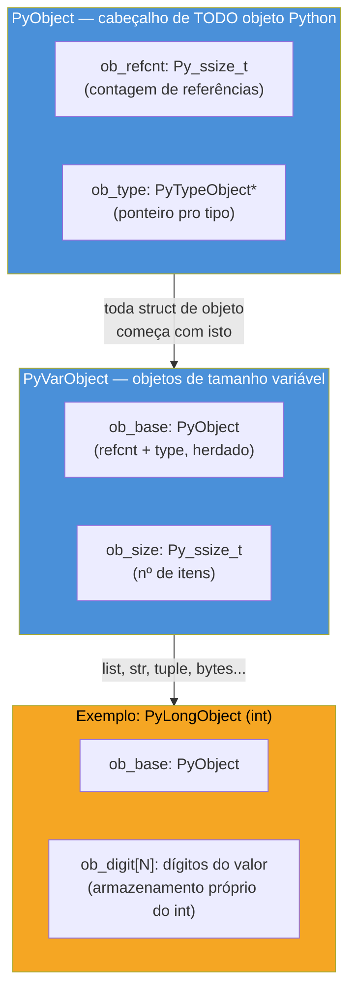
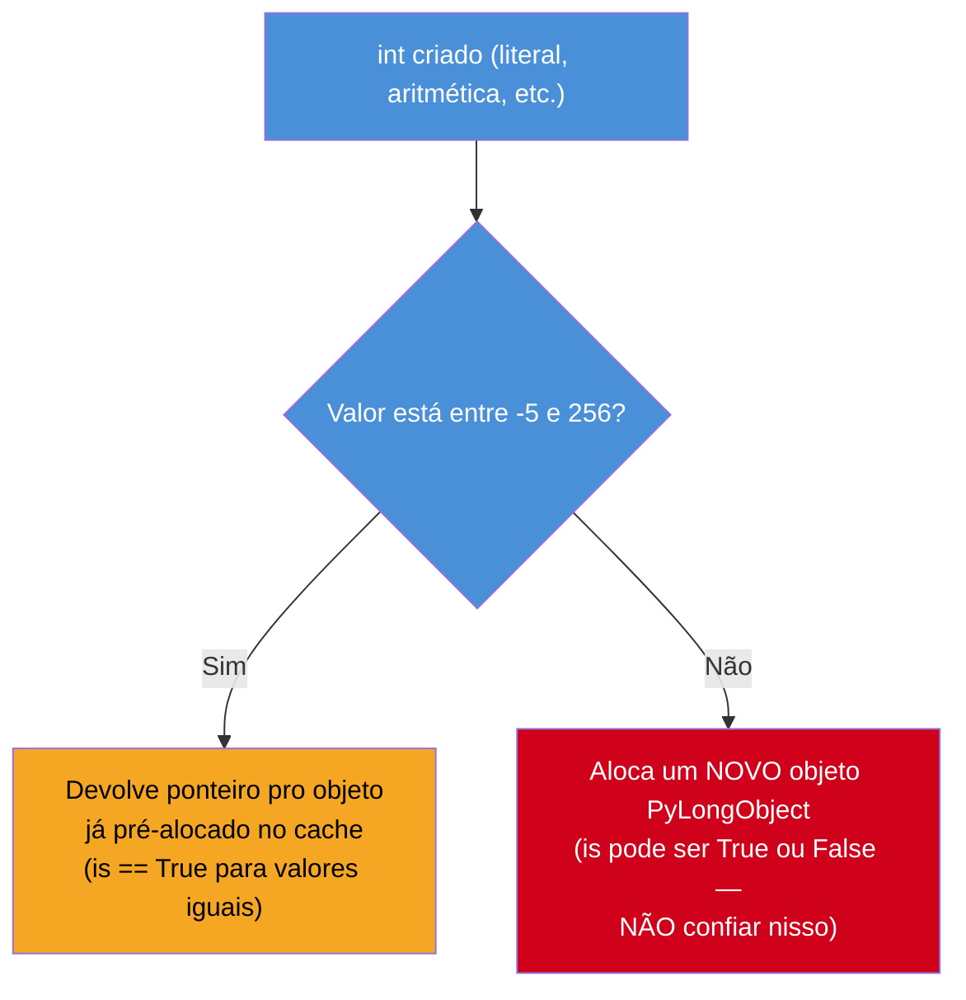

# Objetos em CPython — PyObject, refcounting e tipos internos

> [!abstract] TL;DR
> Em CPython, **tudo é um objeto** — inclusive `1`, `True` e uma função — porque tudo, sem exceção, começa com o mesmo cabeçalho C: um `struct` chamado `PyObject`, com dois campos fixos, `ob_refcnt` (contagem de referências) e `ob_type` (ponteiro para o tipo). Isso dá uniformidade à linguagem (todo objeto sabe se contar e se identificar), mas cobra um preço real em memória: um `int` em CPython consome ~28 bytes, contra os 4 bytes de um `int` primitivo em Java — porque Java tem um tipo primitivo que Python simplesmente não tem. CPython amortiza parte desse custo com dois caches: o **small int cache** (inteiros de -5 a 256 são pré-alocados e reutilizados, nunca recriados) e o **string interning** (literais curtas e identificadores compartilham a mesma instância de string). Esses dois caches são a causa raiz da armadilha clássica de comparar objetos com `is` em vez de `==`: `is` funciona "por acidente" para números pequenos e strings curtas, e falha silenciosamente fora dessa faixa. `sys.getrefcount()` e `sys.getsizeof()` tornam esse mundo C observável direto do REPL.

## O bug que abre esta nota

Um desenvolvedor está debugando um cache de sessões que armazena, para cada usuário, um contador de eventos. Em testes locais, tudo parece funcionar — inclusive um atalho de performance que ele escreveu usando `is` em vez de `==`, porque "comparar inteiros com `is` é mais rápido, afinal `int` é imutável":

```python
def contador_mudou(anterior, atual):
    return not (anterior is atual)  # "otimização": evita chamar __eq__

sessao = {"usuario_42": 3}

sessao["usuario_42"] = 3  # reatribui o "mesmo" valor
print(contador_mudou(3, sessao["usuario_42"]))  # False — correto, por acaso

sessao["usuario_42"] = 1000
novo_valor = 1000
print(contador_mudou(novo_valor, sessao["usuario_42"]))  # True — ERRADO! valores são iguais
```

Os testes locais (com contadores pequenos, tipicamente < 10) sempre passaram. Em produção, com contadores reais passando de 256, a função começou a devolver `True` para valores idênticos — disparando notificações falsas de "mudança" a cada leitura do cache. O bug não está em `contador_mudou` isoladamente: está na suposição de que `is` e `==` são intercambiáveis para `int`. Essa suposição só "funciona" para uma faixa específica de números — e entender *por que* exige abrir o capô do CPython e olhar a `struct` que sustenta todo objeto Python: `PyObject`. Esta nota dissseca essa struct, o custo de memória que ela implica, e os dois caches (small ints e strings internadas) que tornam esse bug tão fácil de não perceber em desenvolvimento.

> [!info] Pré-requisito
> Esta nota assume a [[01 - O interpretador por dentro — ceval loop e frame objects|nota 01, sobre o ceval loop e frame objects]] — entender que existe uma máquina C rodando por baixo do bytecode é o pano de fundo para esta nota, que foca especificamente na representação de **objetos** dentro dessa máquina.

## O que é

**`PyObject`** é a struct C (definida em [`Include/object.h`](https://github.com/python/cpython/blob/main/Include/object.h) no código-fonte do CPython) que serve de cabeçalho para absolutamente todo objeto Python. Em build padrão (sem contagem de referência com debug), ela tem essencialmente dois campos:

```c
typedef struct _object {
    Py_ssize_t ob_refcnt;      // contagem de referências
    PyTypeObject *ob_type;     // ponteiro para o tipo do objeto
} PyObject;
```

Nenhuma variável C é literalmente declarada como `PyObject` sozinha — a struct funciona como um "cabeçalho comum" que todo objeto Python real (`int`, `str`, `list`, uma instância de classe sua) embute como seus primeiros bytes, e para o qual qualquer ponteiro de objeto pode ser convertido (`(PyObject *)`). É o mesmo truque de "herança por composição de layout" usado em várias bibliotecas C orientadas a objeto: o compilador garante que os campos de `PyObject` ficam sempre nos mesmos offsets no início da struct maior, então uma função genérica que só entende `PyObject*` — como a lógica de `Py_INCREF`/`Py_DECREF` do interpretador — consegue operar em qualquer objeto sem saber seu tipo concreto.

Para tipos de tamanho variável — `list`, `str`, `tuple`, `bytes`, qualquer coisa cujo tamanho não é fixo em tempo de compilação — existe uma extensão: **`PyVarObject`**, que adiciona um terceiro campo:

```c
typedef struct {
    PyObject ob_base;
    Py_ssize_t ob_size;    // número de itens (não bytes) na estrutura variável
} PyVarObject;
```

`ob_size` guarda quantos elementos o objeto tem (o comprimento de uma lista, os bytes de uma string) — é, na prática, o que `len()` acaba lendo por baixo dos panos para esses tipos.



`ob_type` é o que responde a `type(obj)`: um ponteiro para um `PyTypeObject`, uma struct maior ainda que descreve tudo sobre o tipo — seu nome, o tamanho de suas instâncias, e ponteiros de função para cada operação que o [[03-Dominios/Tecnologia/Python/OO e Data Model/03 - O Data Model — dunder methods essenciais|Data Model]] expõe (`tp_repr` para `__repr__`, `tp_hash` para `__hash__`, e por aí vai). Em outras palavras: os dunders que a nota irmã sobre Data Model descreve como "protocolo" não são mágica — são, no nível C, ponteiros de função dentro do `PyTypeObject` apontado por `ob_type`, e o interpretador os invoca via esse ponteiro sempre que uma operação de linguagem precisa deles.

## Por que importa

### "Tudo é objeto" tem um preço, e o preço é real

Em Python, `1`, `True`, `"a"`, uma função, um módulo — tudo é uma instância de algum tipo, e toda instância carrega o cabeçalho `PyObject` (ou `PyVarObject`). Isso é o que torna a linguagem uniforme: não existe uma categoria separada de "valores primitivos" que se comporta diferente de "objetos de verdade" — `(1).bit_length()` funciona porque `1` é, genuinamente, uma instância de `int` com métodos, do mesmo jeito que `"abc".upper()` funciona numa instância de `str`.

Mas esse cabeçalho não é de graça. Cada `int` Python carrega, no mínimo, os 16 bytes de `PyObject` (8 de `ob_refcnt` + 8 de `ob_type` em CPU de 64 bits) mais o armazenamento do próprio valor — e o resultado medido (Python 3.12, CPython em Linux x86-64) é:

```python
import sys
sys.getsizeof(0)   # 28 bytes
sys.getsizeof(1)   # 28 bytes  — mesmo "peso" que 0
```

> [!question]- Por que a nota compara com Java especificamente?
> Porque é o contraste mais didático para quem chega de uma linguagem com tipos primitivos genuínos. A mesma comparação valeria contra C ou Go — qualquer linguagem onde `int` não é, em tempo de execução, um ponteiro para uma struct alocada no heap.

Java resolve esse problema tendo **dois mundos**: um `int` primitivo, que o JVM aloca diretamente na [[03-Dominios/Tecnologia/Java/JVM/02 - Áreas de memória de runtime|stack ou como campo inline]] — 4 bytes fixos, sem cabeçalho, sem ponteiro, sem alocação em heap — e a classe wrapper `Integer`, que *é* um objeto de verdade (com [object header da JVM](https://www.baeldung.com/java-memory-layout), tipicamente 12-16 bytes de overhead + o valor). O código Java escolhe explicitamente qual mundo usar: `int x = 5;` fica na stack, sem overhead de objeto; `Integer x = 5;` vira um objeto no heap, com todo o custo — e o autoboxing implícito entre os dois é uma fonte clássica de armadilhas de performance em Java (loops que fazem autoboxing sem perceber).

Python **não oferece essa escolha** — não existe um "int primitivo" para o desenvolvedor optar por usar. Todo `int` Python é, estruturalmente, o equivalente do `Integer` de Java: um objeto completo no heap, com cabeçalho `PyObject`, sempre. É o preço estrutural de "tudo é objeto, sem exceção": simplicidade e uniformidade conceitual trocadas por overhead de memória que uma linguagem com primitivos evita por padrão.

| | Java `int` (primitivo) | Java `Integer` (objeto) | Python `int` |
|---|---|---|---|
| Onde vive | inline (stack/campo) | heap, com object header | heap, sempre |
| Overhead por valor | 0 (só os 4 bytes do valor) | ~12-16 bytes de header + valor | ~28 bytes (CPython 3.12, valor pequeno) |
| Escolha do desenvolvedor | explícita (`int` vs `Integer`) | explícita | **não existe** — todo `int` é "objeto" |
| Cache de valores pequenos | não se aplica | `Integer.valueOf` cacheia -128 a 127 | small int cache, -5 a 256 |

O paralelo com o cache do `Integer.valueOf` de Java (que existe justamente por causa desse mesmo overhead de objeto) não é coincidência — é a mesma ideia de engenharia aplicada dos dois lados: se instâncias de valores pequenos e frequentes são caras de criar, vale a pena pré-alocar um conjunto fixo delas e reutilizar.

## Como funciona

### Reference counting: o que `ob_refcnt` está de fato contando

`ob_refcnt` é a peça central do mecanismo primário de gerenciamento de memória do CPython (detalhado com profundidade na [[03 - Reference counting e o Garbage Collector geracional|próxima nota do galho]]): cada vez que uma nova referência a um objeto é criada — uma variável recebe o valor, o objeto entra numa lista, é passado como argumento — o interpretador chama `Py_INCREF`, incrementando `ob_refcnt`. Cada vez que uma referência sai de escopo, é reatribuída ou explicitamente deletada, `Py_DECREF` decrementa. Quando `ob_refcnt` chega a zero, **nenhuma referência ao objeto existe mais em lugar nenhum do programa**, e o CPython libera sua memória imediata e deterministicamente — sem esperar um ciclo de coleta de lixo, ao contrário do que acontece na JVM.

```python
import sys

x = []
print(sys.getrefcount(x))  # 2, não 1!
```

> [!warning] `sys.getrefcount()` sempre reporta 1 a mais do que você espera
> A razão é mecânica, não um bug: o próprio ato de **passar `x` como argumento** para `sys.getrefcount()` cria uma referência temporária extra — o parâmetro da função `getrefcount`, enquanto ela executa, também aponta para o objeto. Então o valor observado é sempre "referências reais + 1" (a referência efêmera da chamada). Isso é [documentado explicitamente](https://docs.python.org/3/library/sys.html#sys.getrefcount) na referência oficial: "the count returned is generally one higher than you might expect". Para observar o efeito de forma mais didática, o ideal é comparar contagens **antes/depois** de uma operação, não olhar um valor absoluto isolado.

```python
import sys

x = [1, 2, 3]
print(sys.getrefcount(x))     # 2 (baseline: 1 real + 1 da chamada)

y = x                          # nova referência
print(sys.getrefcount(x))     # 3

lista_de_listas = [x]          # mais uma referência
print(sys.getrefcount(x))     # 4

del y
del lista_de_listas
print(sys.getrefcount(x))     # 2 — de volta ao baseline
```

### O small int cache: por que `is` "funciona" para números pequenos

Na inicialização do interpretador, CPython pré-aloca um bloco fixo de objetos `int` para o intervalo **-5 a 256** (256 é escolhido porque cobre os usos mais comuns — índices pequenos, códigos de status, contadores de loop pequenos; -5 cobre alguns casos negativos comuns). Toda vez que o código Python "cria" um `int` dentro dessa faixa — seja por um literal (`5`), uma operação aritmética (`2 + 3`) ou qualquer outro caminho — CPython **não aloca um novo objeto**: devolve um ponteiro para a instância já existente no cache.

```python
a = 100
b = 100
print(a is b)     # True — ambos apontam para o MESMO objeto pré-alocado

c = 1000
d = 1000
print(c is d)     # False (na maioria dos casos) — cada um é um objeto NOVO
```

> [!warning] `is` para comparar `int` funciona "por acidente" dentro de -5..256, e falha fora dela
> **O que acontece:** código que usa `is` para comparar inteiros passa em testes com valores pequenos e falha silenciosamente com valores maiores — como no bug de abertura desta nota.
> **Por quê:** `is` compara **identidade de objeto** (o mesmo endereço de memória), não valor. Dentro do small int cache, dois `int` "iguais" *são*, de fato, o mesmo objeto — então `is` e `==` coincidem por acaso. Fora do cache, cada literal ou resultado de operação geralmente aloca um objeto novo (embora o compilador de bytecode também faça alguma deduplicação de constantes dentro do mesmo escopo/módulo via *constant folding* — o que torna o comportamento ainda menos previsível de se confiar).
> **Como evitar:** usar `==` para comparar **valores** (o caso quase universal), e reservar `is` estritamente para comparar **identidade** — o padrão canônico é `is None`, `is True`/`is False` (singletons genuínos, sempre seguros com `is`), nunca números ou strings arbitrários.



O CPython não documenta o intervalo exato como parte da especificação da linguagem — é um **detalhe de implementação** do CPython especificamente (código-fonte em [`Objects/longobject.c`](https://github.com/python/cpython/blob/main/Objects/longobject.c), macro `_PY_NSMALLPOSINTS`/`_PY_NSMALLNEGINTS`), não uma garantia da linguagem Python em geral. Outras implementações (PyPy, por exemplo) têm estratégias de cache diferentes ou inexistentes. Depender do comportamento de `is` para inteiros é, portanto, depender de um detalhe de implementação não-portável — mais um motivo, além da correção lógica, para nunca fazer isso em código de produção.

### String interning: automático para literais "parecidas com identificador"

O mesmo problema de "objetos iguais, endereços diferentes" existe para strings, mas a solução do CPython é mais seletiva. Duas categorias de strings são **automaticamente internadas** (compartilham a mesma instância):

1. **Literais que "parecem identificador"**: sequências compostas só de letras, dígitos e underscore, sem espaços nem caracteres especiais — o mesmo formato que um nome de variável Python poderia ter. É por isso que nomes de atributos, chaves de dicionário usadas como se fossem campos, e identificadores em geral se beneficiam do cache sem esforço nenhum do desenvolvedor.
2. **Identificadores do próprio código-fonte**: nomes de variáveis, funções, classes, parâmetros — o compilador de bytecode interna esses nomes automaticamente, porque eles são comparados o tempo todo (resolução de nomes em namespaces) e a comparação de identidade (`is`, internamente) é muito mais rápida que comparação char-a-char.

```python
a = "hello"
b = "hello"
print(a is b)     # True — "hello" parece identificador, foi internada

c = "hello world"   # tem espaço — NÃO é internada automaticamente
d = "hello world"
print(c is d)      # False (tipicamente) — dois objetos distintos, mesmo valor

import sys
e = sys.intern("hello world!")
f = sys.intern("hello world!")
print(e is f)       # True — interning FORÇADO manualmente
```

> [!question]- Por que strings com espaço não são internadas, mas strings sem espaço são?
> A regra prática do CPython é: literais que parecem identificadores Python válidos (letras/dígitos/underscore, sem espaço, sem começar com dígito) são internadas por padrão, porque a heurística assume que strings desse formato provavelmente **serão usadas como nomes** em algum momento (atributo, chave, nome de variável dinamicamente construído) — e nomes são comparados massivamente durante a execução. Strings "normais" de texto (frases, mensagens, dados vindos de I/O) não seguem esse padrão de uso e não compensam o custo de manter tudo no pool de interning, então ficam de fora por padrão. `sys.intern()` existe justamente para o desenvolvedor **forçar** manualmente o interning de strings fora dessa heurística, quando ele sabe que vai comparar a mesma string repetidamente (por exemplo: parsing de um arquivo grande com chaves repetidas) e quer pagar o custo de hash uma vez só.

O pool de interning é gerenciado internamente por uma estrutura hash própria do CPython — não é o `dict` que o desenvolvedor vê. `sys.intern()` devolve a *mesma* instância para chamadas subsequentes com valor igual, e é uma otimização legítima (não uma gambiarra) quando o padrão de acesso justifica: comparação de strings por `is` (mais rápida que `==` char-a-char) só é segura depois de garantir explicitamente que ambas passaram pelo mesmo pool de interning.

### `sys.getsizeof()`: medindo o custo de verdade

`sys.getsizeof()` devolve o número de bytes que o **objeto em si** ocupa — não incluindo o que ele referencia. É a ferramenta direta para observar o overhead descrito nas seções anteriores. Rodando no CPython 3.12 (os números variam por versão/build/arquitetura — a nota registra os valores medidos nesta sessão, não uma garantia formal):

```python
import sys

sys.getsizeof(0)          # 28  — int pequeno: 16 (PyObject) + overhead de PyLongObject
sys.getsizeof(1)          # 28  — mesmo custo que 0 (magnitude pequena)
sys.getsizeof(2**30)      # 32  — mais um "dígito" interno de armazenamento
sys.getsizeof(2**64)      # 36  — cresce conforme o valor exige mais dígitos internos
sys.getsizeof(2**300)     # 68  — int "grande" de verdade: CPython não tem overflow, aloca mais espaço

sys.getsizeof(True)       # 28  — bool é subclasse de int, mesmo overhead de PyObject
sys.getsizeof(1.0)        # 24  — float tem layout mais enxuto que int

sys.getsizeof('')         # 41  — string vazia já carrega overhead considerável (PyVarObject + flags de encoding)
sys.getsizeof('a')        # 42  — +1 byte pro caractere (string ASCII compacta)
sys.getsizeof('hello')    # 46  — +5 bytes pelos 5 caracteres

sys.getsizeof([])         # 56  — lista vazia: PyVarObject + ponteiro pro array interno + capacidade alocada
```

> [!question]- Por que um `int` pequeno (`1`) e um `int` maior (`2**30`) não têm o mesmo tamanho, se ambos "cabem" num inteiro de 64 bits em C?
> Porque CPython **não usa** um inteiro C de tamanho fixo para representar `int` Python — usa uma representação de **precisão arbitrária** (o tipo `PyLongObject`), armazenada como um array de "dígitos" internos (tipicamente blocos de 30 bits cada, em CPython moderno). Um valor pequeno cabe em zero ou um desses blocos; um valor maior precisa de mais blocos, e o objeto cresce proporcionalmente. É o mesmo mecanismo que permite `2**10000` funcionar sem overflow em Python (algo que estouraria silenciosamente um `long` de 64 bits em C ou Java) — o preço dessa "mágica" é justamente esse tamanho variável, que `sys.getsizeof()` deixa visível.

O padrão que emerge: `sys.getsizeof()` de um `int` cresce em degraus (não continuamente) conforme o valor exige mais "dígitos" de armazenamento interno — e mesmo o menor `int` possível já carrega ~28 bytes de overhead estrutural, contra os 4 bytes fixos e sem overhead de um `int` primitivo em Java ou C.

> [!warning] `sys.getsizeof()` não soma o que o objeto referencia
> Uma lista de 1000 inteiros grandes tem um `sys.getsizeof()` relativamente pequeno — só o array de *ponteiros* internos, não o peso dos objetos apontados. Medir o custo real de uma estrutura recursiva (lista de listas, árvore de objetos) exige somar recursivamente `sys.getsizeof()` de cada objeto alcançável — o [`pympler`](https://pympler.readthedocs.io/) (biblioteca de terceiros) faz exatamente isso via `asizeof`. `sys.getsizeof()` sozinho responde "quanto pesa este objeto especificamente", não "quanto pesa esta estrutura de dados inteira".

## Na prática

### Cenário 1: cache de sessão comparando IDs por engano

Um sistema de fila de tarefas usa IDs numéricos incrementais para rastrear jobs. O código original comparava dois IDs com `is` "porque são inteiros, é mais rápido":

```python
# Errado: depende do small int cache implicitamente
def job_ja_processado(id_atual, ids_processados):
    return any(id_atual is pid for pid in ids_processados)

# ids abaixo de 256: parece funcionar em dev/teste
# ids de produção, após dias rodando: falha silenciosamente, reprocessa jobs
```

A correção é trivial — trocar `is` por `==` — mas o ponto pedagógico importa mais que a correção em si: o bug **não aparece nos testes** porque IDs de teste tendem a ser pequenos (0, 1, 2, 3...), sempre dentro do small int cache. Ele só se manifesta em produção, com volume real de dados, quando os IDs ultrapassam 256 — o pior tipo de bug: silencioso, intermitente, e correlacionado com escala.

### Cenário 2: medindo o custo real de "tudo é objeto" numa estrutura de dados

Um time está decidindo entre guardar 10 milhões de coordenadas como tuplas `(float, float)` ou como duas listas paralelas de `float`. `sys.getsizeof()` explica por que a segunda opção quase sempre vence em memória:

```python
import sys

ponto_tupla = (3.5, 4.2)
print(sys.getsizeof(ponto_tupla))          # ~56 bytes (a tupla em si)
print(sys.getsizeof(3.5) + sys.getsizeof(4.2))  # 48 bytes (os dois floats)
# total por ponto: ~104 bytes — cada float É um PyObject completo,
# mesmo dentro da tupla (a tupla guarda PONTEIROS, não os valores inline)

# Para 10 milhões de pontos: ~1 GB só de overhead de PyObject,
# antes mesmo de contar o valor numérico de fato armazenado
```

Bibliotecas como NumPy existem, em boa parte, exatamente para contornar esse custo: um `numpy.ndarray` de `float64` armazena os valores **inline**, num bloco contíguo de memória C, sem um `PyObject` completo por elemento — 8 bytes por `float`, não ~24-28. É a mesma lógica do contraste com o `int` primitivo de Java, aplicada a arrays: sair do modelo "tudo é objeto" quando o volume de dados torna o overhead proibitivo.

## Em entrevista

Perguntas previsíveis sobre este tópico:

- **"Por que `a is b` pode dar `True` para dois inteiros iguais e `False` para outros dois também iguais?"** Porque CPython pré-aloca e reutiliza um cache fixo de objetos `int` para o intervalo -5 a 256 (o *small int cache*) — inteiros nessa faixa que têm o mesmo valor são, literalmente, o mesmo objeto na memória, então `is` coincide com `==` por acidente. Fora dessa faixa, cada `int` normalmente é um objeto novo, e `is` compara identidade, não valor — pode dar `False` mesmo com valores iguais. A regra é usar `==` para valor, sempre, e reservar `is` para identidade genuína (`is None`, singletons).
- **"O que é `PyObject` e por que ele existe?"** É a struct C de cabeçalho que todo objeto Python carrega como seus primeiros bytes — contém `ob_refcnt` (contagem de referências, usada pelo reference counting) e `ob_type` (ponteiro pro tipo do objeto). Ele existe para que o interpretador consiga operar genericamente sobre qualquer objeto Python (incrementar/decrementar refcount, checar o tipo, despachar uma operação de dunder) sem precisar conhecer o tipo concreto — é a base estrutural de "tudo é objeto" em Python.
- **"Por que um `int` em Python custa mais memória que um `int` em Java ou C?"** Porque Python não tem um tipo primitivo separado — todo `int` é uma instância completa de objeto, carregando o cabeçalho `PyObject` (16 bytes em CPU 64-bit) mais o armazenamento de precisão arbitrária do valor (~28 bytes no total para valores pequenos, medido em CPython 3.12). Java tem `int` primitivo (4 bytes, sem overhead) e `Integer` (objeto, com overhead comparável ao Python) como dois mundos separados que o desenvolvedor escolhe explicitamente; Python não oferece essa escolha.
- **"O que `sys.getrefcount()` retorna e por que o número é sempre 1 a mais do que eu esperava?"** O número de referências ativas ao objeto no momento da chamada — mas o próprio ato de passar o objeto como argumento pra `getrefcount()` cria uma referência temporária extra (o parâmetro da função), então o valor reportado é sempre "contagem real + 1". Documentado explicitamente na referência oficial do `sys`.
- **"Como o interning de strings funciona, e ele é automático?"** É parcialmente automático: literais que parecem identificadores Python (letras/dígitos/underscore, sem espaço) e todos os nomes usados pelo compilador (variáveis, funções, atributos) são internados automaticamente, compartilhando uma única instância por valor. Strings "de texto normal" (com espaço, pontuação, vindas de I/O em runtime) não são internadas por padrão — `sys.intern()` força isso manualmente quando o padrão de acesso justifica o custo.

### How to explain in English

> Every object in CPython — an `int`, a `str`, a class instance, even a function — shares the same C-level header struct called `PyObject`: a reference count (`ob_refcnt`) and a type pointer (`ob_type`). That's the mechanical reason Python can say "everything is an object": everything, without exception, starts with that same header. It's also why a Python `int` costs real memory that a primitive type in Java or C simply doesn't — there's no "unboxed" path in Python, every `int` is a full heap object, roughly 28 bytes for a small value versus 4 bytes for a Java primitive `int`. CPython offsets part of that cost with two caches: the small integer cache, which pre-allocates and reuses `int` objects from -5 to 256, and automatic string interning for identifier-like literals. Both caches are the root cause of a classic bug: comparing values with `is` instead of `==` happens to "work" inside those cached ranges and silently breaks outside them — `is` checks object identity, not value equality, and the caching that makes them coincide is a CPython implementation detail, not a language guarantee. `sys.getrefcount()` and `sys.getsizeof()` make this normally-invisible C layer directly observable from the REPL.

| Termo PT | Termo EN |
|---|---|
| contagem de referências | reference count |
| ponteiro pro tipo | type pointer |
| cache de inteiros pequenos | small integer cache |
| interning de strings | string interning |
| identidade de objeto | object identity |
| detalhe de implementação | implementation detail |
| precisão arbitrária | arbitrary precision |
| tipo primitivo | primitive type |
| overhead de objeto | object overhead |
| coleta determinística | deterministic collection |

## Armadilhas comuns

> [!warning] Usar `is` para comparar strings ou inteiros "porque parece mais rápido"
> **O que acontece:** código passa em testes locais (valores pequenos, literais idênticos no mesmo módulo) e falha silenciosamente em produção com dados reais.
> **Por quê:** `is` compara identidade de objeto, que só coincide com igualdade de valor dentro dos caches do CPython (small ints -5..256, strings interned) — um detalhe de implementação, não uma garantia da linguagem.
> **Como evitar:** `==` sempre para comparação de valor. `is` só para `None`, `True`/`False`, e sentinelas explicitamente criadas para esse fim (`_MISSING = object()`).

> [!warning] Achar que `sys.getsizeof(lista)` mede o tamanho total da estrutura
> **O que acontece:** subestimar drasticamente o consumo de memória de coleções de objetos "pesados" (listas de listas, dicts de instâncias).
> **Por quê:** `sys.getsizeof()` retorna só o peso do objeto container — o array de ponteiros, no caso de uma lista — não o que cada ponteiro referencia.
> **Como evitar:** somar `sys.getsizeof()` recursivamente sobre a estrutura, ou usar uma ferramenta dedicada como `pympler.asizeof`.

> [!warning] Confiar no intervalo exato do small int cache (-5 a 256) como parte da linguagem
> **O que acontece:** código que depende de `is` funcionar até um valor específico quebra ao trocar de interpretador (PyPy) ou, em teoria, entre versões do CPython.
> **Por quê:** o intervalo é um detalhe de implementação do CPython, documentado no código-fonte (`Objects/longobject.c`), não na especificação da linguagem.
> **Como evitar:** nunca depender de `is` para valor — o cache existe para otimizar memória internamente, não como uma API pública para o desenvolvedor explorar.

## O que vem a seguir

Entender `PyObject` e `ob_refcnt` é o pré-requisito direto para a peça que de fato **libera** memória: a [[03 - Reference counting e o Garbage Collector geracional|próxima nota]] detalha como o reference counting decide quando um objeto morre, por que ciclos de referência (`a.x = b; b.x = a`) escapam desse mecanismo, e como o Garbage Collector geracional do CPython entra como rede de segurança para esses casos.

- [[03 - Reference counting e o Garbage Collector geracional|03 — Reference counting e o Garbage Collector geracional]] — o que acontece quando `ob_refcnt` chega a zero, e o que fazer quando nunca chega
- [[04 - O GIL — o que é de verdade e por que existe|04 — O GIL]] — por que `ob_refcnt` precisa de proteção contra corrida entre threads, e como o GIL resolve isso
- [[07 - Memory management — allocators, pymalloc e arenas|07 — Memory management]] — onde, fisicamente, a memória de um `PyObject` é alocada (pymalloc, arenas, pools)

## Veja também

- [[01 - O interpretador por dentro — ceval loop e frame objects|01 — O interpretador por dentro: ceval loop e frame objects]] — a máquina que manipula os `PyObject*` descritos aqui
- [[03-Dominios/Tecnologia/Python/OO e Data Model/03 - O Data Model — dunder methods essenciais|OO e Data Model 03 — O Data Model]] — os dunders são, no nível C, os ponteiros de função dentro do `PyTypeObject` apontado por `ob_type`
- [[03-Dominios/Tecnologia/Java/JVM/02 - Áreas de memória de runtime|JVM 02 — Áreas de memória de runtime]] — o contraste com o object header da JVM e o par primitivo/wrapper de Java
- [[03-Dominios/Tecnologia/Python/CPython internals/index|CPython internals]] — MOC do galho
- [[03-Dominios/Tecnologia/Python/index|Trilha Python]]

## Fontes

- Python Software Foundation. *Common Object Structures — Python/C API Reference Manual*. docs.python.org, versão 3.14. https://docs.python.org/3/c-api/structures.html (acessado em 2026-07-10)
- Python Software Foundation. *sys.getrefcount*. docs.python.org, versão 3.14. https://docs.python.org/3/library/sys.html#sys.getrefcount (acessado em 2026-07-10)
- Python Software Foundation. *sys.getsizeof*. docs.python.org, versão 3.14. https://docs.python.org/3/library/sys.html#sys.getsizeof (acessado em 2026-07-10)
- Python Software Foundation. *sys.intern*. docs.python.org, versão 3.14. https://docs.python.org/3/library/sys.html#sys.intern (acessado em 2026-07-10)
- CPython source. *Include/object.h* (definição de `PyObject`/`PyVarObject`) e *Objects/longobject.c* (small int cache). GitHub. https://github.com/python/cpython (acessado em 2026-07-10)
- Real Python. *Small Integer Caching* (video lesson). https://realpython.com/lessons/small-integer-caching/ (acessado em 2026-07-10)
- Ramalho, L. *Fluent Python: Clear, Concise, and Effective Programming*, 2ª ed. — cap. 6 (parte sobre `is` vs `==` e identidade de objeto). O'Reilly Media, 2022.
- Números de `sys.getsizeof()` e `sys.getrefcount()` desta nota foram medidos diretamente em CPython 3.12.3 (Linux x86-64) nesta sessão — podem variar por versão/build/arquitetura.
