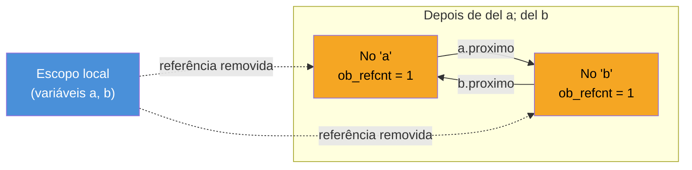
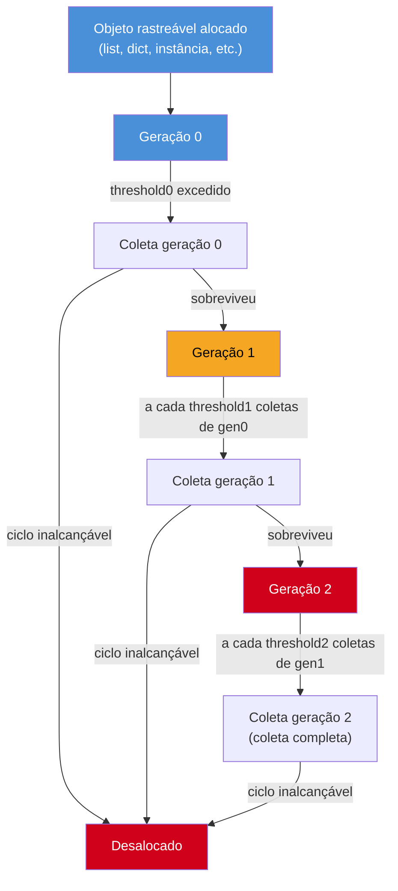

# Reference counting e o Garbage Collector geracional

> [!abstract] TL;DR
> Em CPython, quem libera memória de verdade é o **reference counting**, não um "garbage collector" no sentido que a JVM usa a palavra: todo objeto carrega um contador (`ob_refcnt`, visto em [[02 - Objetos em CPython — PyObject, refcounting e tipos internos|02]]) que sobe e desce a cada referência criada ou destruída, e o objeto é desalocado no **instante exato** em que esse contador chega a zero — determinístico, sem pausas, sem *stop-the-world*. O problema é que refcounting sozinho **nunca** zera um **ciclo de referências** (`a.x = b; b.x = a`): cada objeto do ciclo ainda é referenciado pelo outro, então o contador nunca bate zero, mesmo que nada de fora do ciclo aponte para eles. Para isso — só para isso — CPython tem um **segundo mecanismo**, o GC geracional do módulo `gc`: um *tracing collector* clássico (marca-e-varre) que roda periodicamente sobre 3 gerações, procurando especificamente por ciclos inalcançáveis. Ele é secundário e opcional (dá pra desligar com `gc.disable()` sem quebrar o programa, porque o refcounting continua funcionando sozinho) — o oposto do modelo Java, onde o GC é o único mecanismo e é obrigatório. `__del__` complica a finalização de ciclos (ordem não garantida, um problema histórico real corrigido pela PEP 442 em Python 3.4), e `weakref` é a saída elegante quando você já sabe, de antemão, que sua estrutura de dados vai formar ciclos — evita depender do `gc` por completo.

## O que é

Pega a nota [[02 - Objetos em CPython — PyObject, refcounting e tipos internos|02]] de onde ela parou: todo `PyObject` carrega um campo `ob_refcnt` que conta quantas referências apontam para ele. Toda vez que você faz `x = obj`, `lista.append(obj)` ou passa `obj` como argumento de função, o CPython incrementa esse contador (`Py_INCREF`). Toda vez que uma referência sai de escopo, é reatribuída ou um `del` explícito acontece, o contador decresce (`Py_DECREF`). O momento em que `ob_refcnt` chega a `0` não é uma dica para um coletor rodar depois — é o próprio gatilho de desalocação. A função `Py_DECREF`, ao ver o contador zerar, chama diretamente `tp_dealloc` daquele tipo, que libera a memória ali mesmo, na mesma instrução que zerou o contador.

Isso é **reference counting** — o mecanismo *primário e obrigatório* de gerenciamento de memória em CPython. Não existe um "modo sem reference counting"; é a fundação sobre a qual tudo mais (incluindo o `gc` module, que veremos adiante) se apoia.

### O contraste que interessa: determinístico vs. tracing

Se você vem de Java, a primeira reação a essa frase é achar que é a mesma coisa que o GC da JVM, só com um nome diferente. Não é — e a diferença importa na prática, não só na teoria.

A nota [[03-Dominios/Tecnologia/Java/JVM/03 - Garbage Collection — o conceito|Garbage Collection — o conceito]] descreve o modelo da JVM: um coletor **tracing**, que periodicamente percorre o grafo de objetos inteiro a partir de *GC roots* (stacks de thread, campos estáticos), marca o que é alcançável, e varre o resto. Um objeto morto em Java fica morto — mas *inerte*, ocupando memória — até o próximo ciclo de coleta decidir passar por ali e perceber que ele não é mais alcançável. Não existe um instante único e previsível em que um objeto Java morre; existe uma janela entre "ninguém mais usa isso" e "o GC finalmente notou e recuperou a memória".

Reference counting em CPython inverte essa lógica:

| Aspecto | Reference counting (CPython) | Tracing GC (JVM) |
|---|---|---|
| Quando o objeto morre | No instante exato em que a última referência desaparece | Em algum ciclo de coleta futuro, indeterminado |
| Determinismo | Total — `__del__`/destrutores rodam previsivelmente | Nenhum — `finalize()` já era desencorajado por isso |
| Custo | Distribuído: um incremento/decremento a cada atribuição, minúsculo mas constante | Concentrado: pausas periódicas (mesmo que curtas em coletores concorrentes) |
| Pausas STW | Não há STW por reference counting em si | Coletores clássicos têm STW; coletores modernos (G1, ZGC) minimizam mas não eliminam |
| Ponto fraco estrutural | Não resolve ciclos de referência (ver seção seguinte) | Resolve ciclos naturalmente, porque não depende de contagem |

> [!question]- Se reference counting é determinístico, por que Python ainda tem algo chamado "garbage collector"?
> Porque determinismo tem um preço: reference counting **estruturalmente** não consegue detectar um grupo de objetos que se referenciam mutuamente sem que nada de fora aponte pra eles. Um contador que nunca chega a zero nunca aciona a desalocação — mesmo que, do ponto de vista de "o programa ainda usa isso?", a resposta seja claramente não. É exatamente esse buraco que o módulo `gc` tampa. A palavra "garbage collector" em Python é, tecnicamente, menos precisa do que em Java: lá, GC é *o* mecanismo; aqui, é um mecanismo suplementar, especializado, que só entra em cena para um problema específico.

**Reference counting em uma frase:** um objeto CPython morre no exato instante em que a última referência a ele desaparece — não "algum dia depois", como em coletores tracing.

## Por que importa

Para quem debuga memória em produção, essa diferença muda o que você procura quando algo vaza:

- **Em Java**, um vazamento de memória quase sempre significa "alguma referência viva que eu não devia ter" — um cache sem bound, um listener nunca removido, uma coleção estática que cresce. O GC nunca falha em coletar o que é genuinamente inalcançável; ele só não consegue coletar o que ainda está, tecnicamente, alcançável.
- **Em Python**, existe uma segunda categoria de vazamento que não existe (do mesmo jeito) em Java: objetos que **são** inalcançáveis do ponto de vista do programa, mas que o mecanismo primário (refcounting) é incapaz de perceber, porque eles se seguram mutuamente. Isso é o assunto da próxima seção, e é a razão de existir de todo o resto desta nota.

Saber disso muda a pergunta que você faz quando `tracemalloc` ou `objgraph` mostram objetos "vivos" que não deveriam estar: em Java, a pergunta é "quem ainda referencia isso, e por quê". Em Python, a pergunta se desdobra em duas — "quem referencia isso de fora do grupo suspeito?" e, se a resposta for "ninguém", "isso é um ciclo, e o `gc` module está de fato rodando para limpar ele?".

## Como funciona

### O ciclo de referência: o buraco que refcounting não tapa

Considere o caso mais simples possível — dois objetos que apontam um para o outro:

```python
class No:
    def __init__(self, nome):
        self.nome = nome
        self.proximo = None

a = No("a")
b = No("b")
a.proximo = b   # ob_refcnt de b sobe para 2 (variável b + a.proximo)
b.proximo = a   # ob_refcnt de a sobe para 2 (variável a + b.proximo)

del a
del b
# Aqui: nenhuma variável do escopo local aponta mais para os nós.
# Mas ob_refcnt de "a" ainda é 1 (referenciado por b.proximo)
# e ob_refcnt de "b" ainda é 1 (referenciado por a.proximo).
# Nenhum dos dois contadores chega a zero. Nenhum dealloc acontece.
```

Depois de `del a` e `del b`, não existe **nenhuma** referência externa a esses dois objetos — do ponto de vista do programa, eles são lixo, tão inalcançáveis quanto qualquer objeto sem dono em Java. Mas cada um ainda é referenciado pelo outro. `Py_DECREF` decrementa o contador de cada nó em 1 (removendo a referência da variável local), e cada contador para em 1, não em 0. O `tp_dealloc` nunca é chamado. A memória fica presa — um **memory leak** genuíno, causado por um mecanismo que, sozinho, é cegamente incapaz de perceber esse tipo de situação.



Isso não é um caso de laboratório artificial. Estruturas de dados naturalmente bidirecionais criam ciclos o tempo todo, sem que ninguém escreva `a.x = b; b.x = a` de propósito:

- **Árvores com ponteiro para o pai** — todo nó filho aponta para o pai, e o pai guarda os filhos numa lista. Ciclo garantido.
- **Listas duplamente encadeadas** — `proximo`/`anterior` apontando um para o outro.
- **Padrão Observer** — o *subject* guarda referências aos *observers* para notificá-los, e frequentemente os *observers* guardam uma referência de volta ao *subject* (para poder se desinscrever, por exemplo).
- **Closures capturando `self`** — um método que cria uma closure e a guarda como atributo do próprio objeto (`self._callback = lambda: self.fazer_algo()`) cria um ciclo entre a closure e o objeto.

> [!question]- Se ciclos são tão comuns, por que a maioria dos programas Python nunca "vaza" de fato?
> Porque existe o segundo mecanismo — o GC geracional do módulo `gc` — cuja única razão de existir é varrer exatamente esses ciclos periodicamente. Se você nunca ouviu falar dele antes de ler esta nota, é sinal de que ele está fazendo o trabalho dele silenciosamente. O problema aparece quando esse mecanismo secundário é desabilitado (`gc.disable()`, uma prática real em código sensível a latência — ver Armadilhas), ou quando ciclos envolvem `__del__` de um jeito que precisa de cuidado extra (próxima seção).

### O GC geracional: mecanismo secundário, só para ciclos

O módulo [`gc`](https://docs.python.org/3/library/gc.html) da biblioteca padrão implementa um **tracing collector clássico** — do mesmo tipo conceitual descrito em [[03-Dominios/Tecnologia/Java/JVM/03 - Garbage Collection — o conceito|Garbage Collection — o conceito]] para a JVM — mas com um escopo deliberadamente restrito: ele **não** gerencia a memória do programa como um todo (isso já está resolvido pelo refcounting); ele só procura e recupera **grupos de objetos inalcançáveis de fora que se referenciam entre si**.

O algoritmo, em linhas gerais: para cada objeto rastreável (containers — listas, dicionários, instâncias de classe, etc.; tipos imutáveis simples como `int` e `str` não entram nessa varredura porque não conseguem *conter* referências a outros objetos de forma a criar ciclo), o coletor calcula quantas das referências que apontam para ele vêm de **dentro** do próprio conjunto sob análise. Se, depois de subtrair essas referências "internas ao grupo", sobra zero referências externas, o grupo inteiro é inalcançável — mesmo que cada `ob_refcnt` individual não seja zero — e pode ser coletado.

> [!warning] Isso não substitui o refcounting — ele complementa
> O `gc` module não gerencia a alocação e desalocação do dia a dia. Cada `x = obj`, cada `return valor`, cada elemento removido de uma lista continua sendo tratado por `Py_INCREF`/`Py_DECREF` normalmente, com desalocação imediata quando o contador zera. O `gc` só entra em ação para o subconjunto específico de objetos que **nunca** vão zerar por refcounting sozinho, por estarem presos num ciclo. É por isso que `gc.disable()` não faz o programa vazar tudo — só os ciclos deixam de ser varridos.

### As 3 gerações e os thresholds

Assim como o GC da JVM aposta na *weak generational hypothesis* — a maioria dos objetos morre jovem —, o `gc` module de CPython organiza os objetos rastreados em **3 gerações** (`0`, `1`, `2`), com a mesma lógica de fundo: em vez de varrer todos os objetos rastreados a cada coleta (caro), o coletor varre a geração 0 com muito mais frequência que a 1, e a 1 com mais frequência que a 2.

- **Geração 0**: objetos recém-criados (containers alocados desde a última coleta da geração 0).
- **Geração 1**: objetos que sobreviveram a pelo menos uma coleta da geração 0.
- **Geração 2**: objetos que sobreviveram a coletas da geração 1 — os "veteranos", presumivelmente de longa duração.

Quando um objeto sobrevive a uma coleta da geração em que está, ele é **promovido** para a geração seguinte — o mesmo conceito de *tenuring* que a nota da JVM descreve para Young → Old, só que aplicado apenas ao subconjunto de objetos rastreados pelo `gc` (não a todo objeto Python).

A frequência de cada coleta é controlada por **thresholds**, consultáveis com [`gc.get_threshold()`](https://docs.python.org/3/library/gc.html#gc.get_threshold):

```python
import gc
gc.get_threshold()
# (700, 10, 10)   ← valores default do CPython
```

O significado de cada número:

| Threshold | O que dispara |
|---|---|
| `threshold0` (700) | A geração 0 é varrida quando o saldo de (alocações − desalocações de objetos rastreados) desde a última coleta ultrapassa 700 |
| `threshold1` (10) | A cada 10 coletas da geração 0, a geração 1 também é varrida |
| `threshold2` (10) | A cada 10 coletas da geração 1, a geração 2 também é varrida |

Na prática: a geração 0 é varrida com frequência (a cada ~700 alocações líquidas de objetos rastreáveis), a 1 dez vezes menos, a 2 cem vezes menos. Isso concentra o custo de varredura onde há mais chance de achar lixo (objetos recém-criados, que morrem rápido — a mesma aposta da *weak generational hypothesis*), e evita repassar continuamente objetos de longa duração que quase nunca fazem parte de um ciclo recém-formado.



> [!question]- E se meu objeto nunca faz parte de um ciclo — ele "sobe" de geração à toa?
> Sim, e é um custo aceito do design: um objeto de vida longa mas sem ciclo nenhum (uma conexão de banco que vive o programa inteiro, por exemplo) vai sendo verificado a cada coleta da sua geração, sobrevive sempre, e eventualmente é promovido até a geração 2 — onde passa a ser verificado bem raramente. O trabalho de varredura em si (calcular referências internas vs. externas ao grupo) tem custo proporcional ao número de objetos rastreados na geração sendo coletada, não zero, mas o design geracional garante que a maior parte desse custo caia sobre objetos recém-criados (onde ciclos recém-formados e já mortos são mais prováveis de aparecer), não sobre veteranos estáveis.

### `gc.collect()`: forçar uma coleta manual

[`gc.collect(generation=2)`](https://docs.python.org/3/library/gc.html#gc.collect) dispara uma coleta imediatamente, fora do ritmo automático dos thresholds. Por padrão (`generation=2`), roda uma coleta **completa** — varre as 3 gerações. Passar `generation=0` ou `generation=1` restringe a varredura a apenas essa geração (e às mais novas, no caso de gen 1 também varrer gen 0). A função devolve o número de objetos inalcançáveis encontrados e coletados.

```python
import gc

coletados = gc.collect()
print(f"{coletados} objetos em ciclos foram liberados")
```

Isso é útil em cenários pontuais e conscientes — por exemplo, depois de processar um lote gigante de dados que se sabe formar estruturas cíclicas (árvores, grafos), forçar uma coleta antes de seguir para a próxima etapa de um pipeline com restrição de memória. Não é, ao contrário do que a intuição vinda de `System.gc()` em Java sugere, algo para chamar "por garantia" — é uma ferramenta cirúrgica, não um hábito de limpeza geral.

`gc.get_stats()` devolve, para cada geração, um dicionário com `collections` (quantas vezes essa geração foi varrida), `collected` (quantos objetos foram liberados no total) e `uncollectable` (quantos objetos foram encontrados em ciclos mas não puderam ser liberados — o próximo tópico explica quando isso acontece).

### `__del__` e os cuidados de finalização

Objetos Python podem definir `__del__`, um método chamado imediatamente antes da memória do objeto ser liberada — seja pelo refcounting normal (contador chegou a zero) seja pelo `gc` (ciclo detectado e coletado). A intenção é permitir limpeza — fechar um arquivo, liberar um recurso externo — no momento da morte do objeto.

O problema histórico, hoje resolvido, era este: antes da [PEP 442](https://peps.python.org/pep-0442/) (Python 3.4), se um objeto com `__del__` fizesse parte de um ciclo de referência, o `gc` **não conseguia decidir com segurança em que ordem chamar os `__del__`** dos objetos do ciclo — chamar o `__del__` de um objeto antes de destruir o outro podia deixar esse outro objeto num estado inconsistente (por exemplo, um `__del__` que acessa `self.outro.recurso`, mas `outro` já foi parcialmente destruído). Diante dessa ambiguidade, a solução do CPython pré-3.4 era conservadora e brusca: **não tentava resolver** — colocava o ciclo inteiro numa lista especial, `gc.garbage`, sem chamar nenhum `__del__` e sem liberar a memória. Ou seja: ciclos com `__del__` eram, na prática, um memory leak *permanente* e conhecido, documentado como limitação da linguagem.

A PEP 442 resolveu isso mudando o algoritmo de finalização: em vez de exigir uma ordem "segura" antes de agir, o CPython 3.4+ finaliza os objetos do ciclo em uma ordem best-effort (via um mecanismo de resolução chamado `PyObject_CallFinalizer`, que marca cada objeto como finalizado depois de chamar seu `__del__` uma única vez, mesmo que a ordem entre objetos do mesmo ciclo não seja perfeitamente definida) e depois libera a memória de todos normalmente. Hoje, ciclos com `__del__` **não** vão mais parar em `gc.garbage` por padrão — eles são finalizados e coletados como qualquer outro ciclo. `gc.garbage` continua existindo para casos residuais e específicos de extensões C com finalização de baixo nível (`tp_del` não-nulo), mas deixou de ser o destino comum de "ciclo com `__del__`" que era antes de 2014.

> [!warning] Ordem de finalização de `__del__` num ciclo ainda não é garantida
> A PEP 442 tornou a coleta **possível e segura** (sem estado inconsistente causando crash), mas não tornou a **ordem** de chamada dos `__del__` de objetos dentro do mesmo ciclo determinística ou previsível. Se o `__del__` de um objeto depende de outro objeto do mesmo ciclo já estar em estado válido, isso ainda é frágil. A recomendação prática permanece: evite lógica de negócio dentro de `__del__` sempre que possível — prefira gerenciadores de contexto (`with` / `__exit__`) para liberação determinística de recursos, e reserve `__del__` só para um último recurso de rede de segurança (log de aviso, por exemplo), nunca para efeitos colaterais críticos.

### `weakref`: evitar o ciclo em vez de depender do GC para resolvê-lo

Se você já sabe, ao desenhar uma estrutura de dados, que ela vai formar ciclos — uma árvore com ponteiro para o pai, um cache que referencia objetos "de volta" para o dono, um padrão Observer — existe uma saída que evita depender do GC geracional por completo: o módulo [`weakref`](https://docs.python.org/3/library/weakref.html).

Uma referência fraca (*weak reference*) aponta para um objeto **sem incrementar `ob_refcnt`**. Do ponto de vista do refcounting, é como se essa referência não existisse. Consequência direta: se todas as referências restantes a um objeto forem fracas, o refcounting sozinho já é capaz de coletá-lo assim que a última referência *forte* desaparecer — porque a referência fraca nunca contou para manter o objeto vivo. O ciclo simplesmente deixa de existir como ciclo de refcounting; vira uma referência de mão única mais uma "ponte" que não segura nada.

```python
import weakref

class No:
    def __init__(self, nome, pai=None):
        self.nome = nome
        # referência fraca para o pai: não incrementa ob_refcnt do pai
        self._pai_ref = weakref.ref(pai) if pai else None
        self.filhos = []

    @property
    def pai(self):
        # weakref.ref(obj)() devolve o objeto, ou None se já foi coletado
        return self._pai_ref() if self._pai_ref else None

raiz = No("raiz")
filho = No("filho", pai=raiz)
raiz.filhos.append(filho)   # referência forte: raiz.filhos → filho
                              # filho._pai_ref é fraca: não conta para ob_refcnt de raiz

print(filho.pai.nome)   # "raiz" — o pai ainda está vivo
```

Aqui, `raiz.filhos` mantém uma referência **forte** para `filho` (a árvore precisa conseguir navegar para baixo), mas `filho._pai_ref` é **fraca** — a árvore consegue navegar para cima sem criar um ciclo de refcounting de verdade. Se `raiz` for destruída (nenhuma referência forte externa a ela), o refcounting a coleta normalmente, mesmo com `filho` ainda technically "sabendo" quem era o pai (a chamada `filho.pai` simplesmente devolve `None` depois disso).

O padrão mais comum e direto na biblioteca padrão é `weakref.WeakValueDictionary` / `weakref.WeakKeyDictionary` — dicionários cujas entradas não impedem a coleta dos valores (ou chaves) referenciados, exatamente o desenho certo para **caches**: um cache não deveria, por si só, manter um objeto vivo para sempre só porque ele passou por ali uma vez.

```python
import weakref

class ObjetoCaro:
    def __init__(self, id_):
        self.id_ = id_

cache = weakref.WeakValueDictionary()

def obter(id_):
    obj = cache.get(id_)
    if obj is None:
        obj = ObjetoCaro(id_)
        cache[id_] = obj
    return obj
```

Se nenhuma outra parte do programa segura uma referência forte a um `ObjetoCaro` específico, ele pode ser coletado a qualquer momento — e some do `cache` sozinho, sem exigir limpeza manual nem depender do `gc` geracional rodar em algum momento para reconhecer o ciclo.

> [!question]- Se `weakref` resolve o problema na raiz, por que o GC geracional ainda existe?
> Porque nem todo ciclo é previsível ou controlado pelo autor do código. `weakref` exige que você, deliberadamente, decida qual referência num par cíclico deve ser fraca — uma decisão de design que só faz sentido quando você já enxergou o ciclo de antemão (árvores, caches, observers são os casos canônicos, citados também no [Fluent Python](https://www.oreilly.com/library/view/fluent-python-2nd/9781492056348/), de Luciano Ramalho, no capítulo sobre gerenciamento de memória e referências fracas). Código de terceiros, estruturas de dados genéricas, ou simplesmente ciclos acidentais que ninguém percebeu ao escrever continuam existindo — e para esses, o `gc` geracional é a rede de segurança que roda sozinha, sem exigir que ninguém tenha pensado no problema com antecedência.

**GC geracional em uma frase:** existe só para varrer ciclos que o reference counting é estruturalmente incapaz de perceber — não é o gerenciador de memória principal de Python, é o corretor de um ponto cego específico dele.

## Na prática

### Diagnosticando um vazamento por ciclo

Um sinal clássico de "meu programa está vazando memória via ciclos" é memória residente (RSS) crescendo sem limite mesmo depois de objetos, aparentemente, saírem de uso. O primeiro passo é confirmar que o `gc` está de fato rodando e encontrando algo:

```python
import gc

gc.set_debug(gc.DEBUG_STATS)   # imprime estatísticas a cada coleta automática
# ... roda a carga de trabalho suspeita ...

antes = len(gc.get_objects())
gc.collect()
depois = len(gc.get_objects())
print(f"Coleta liberou {antes - depois} objetos rastreados")
```

Se `gc.collect()` retorna um número relevante de objetos coletados sempre que é chamado manualmente, é sinal de que a estrutura de dados em uso está, de fato, gerando ciclos com regularidade — e vale investigar se algum desses ciclos pode virar `weakref` deliberadamente, em vez de depender da coleta periódica.

### `gc.disable()`: quando faz sentido desligar

Em código sensível a latência de cauda (p99/p999) — servidores de baixa latência, sistemas de trading, workers que processam requisições curtas — a varredura periódica do `gc`, mesmo sendo geralmente rápida, introduz uma fonte de variância que alguns times preferem eliminar deliberadamente, confiando exclusivamente no reference counting para a maior parte da memória e usando `gc.collect()` manual em pontos de baixa atividade (entre requisições, por exemplo) para lidar com os ciclos que ainda existirem.

```python
import gc

gc.disable()   # refcounting continua funcionando normalmente;
                # só a varredura automática de ciclos para

# ... em um ponto de baixa atividade do processo (ex.: health check, idle loop) ...
gc.collect()    # coleta manual, sob controle, fora do caminho quente
```

> [!warning] Desligar o `gc` sem revisar ciclos é trocar latência previsível por vazamento real
> `gc.disable()` só é seguro em código que genuinamente não cria ciclos de referência de forma significativa, ou que os limpa manualmente em algum ponto conhecido. Aplicar isso "por performance" sem entender se a base de código forma ciclos (estruturas de árvore, frameworks web com referências circulares internas entre request/response/handler, ORMs com relações bidirecionais) troca uma fonte de latência pequena e previsível por um vazamento de memória silencioso e crescente — o pior tipo de bug de produção, porque só aparece depois de horas ou dias rodando.

## Armadilhas comuns

> [!warning] Achar que `gc.collect()` é o equivalente do `System.gc()` de Java, e que ambos são igualmente inúteis
> Em Java, `System.gc()` é apenas uma **sugestão** — a JVM pode ignorá-la completamente (por isso é anti-padrão em produção, como cobre a nota [[03-Dominios/Tecnologia/Java/JVM/03 - Garbage Collection — o conceito|Garbage Collection — o conceito]]). Em CPython, `gc.collect()` é uma **ordem direta e síncrona**: ele roda a coleta imediatamente, na thread que chamou, e retorna só depois de terminar, com o número de objetos coletados como valor de retorno. Não é ignorável nem assíncrono. Isso não significa que chamar com frequência seja uma boa prática — ainda é um custo de CPU real, pago na hora — mas a semântica de "isso vai rodar, garantido, agora" é bem diferente da sugestão vaga do lado Java.

> [!warning] Confundir "objeto sem referências" com "objeto que o `gc` vai limpar"
> O `gc` module só rastreia **containers** — tipos que podem, estruturalmente, conter referências a outros objetos (listas, dicionários, sets, instâncias de classes definidas em Python, tuplas que contêm objetos mutáveis, etc.). Tipos imutáveis simples como `int`, `float`, `str`, `bytes` e tuplas de apenas imutáveis não são rastreados pelo `gc`, porque não têm como participar de um ciclo — eles são resolvidos inteiramente por refcounting, sempre. Achar que "o `gc` está limpando meus ints" é um erro de modelo mental: a esmagadora maioria da desalocação em qualquer programa Python é refcounting puro, sem o `gc` module nunca entrar em cena.

> [!warning] Escrever `__del__` que depende de outros atributos do próprio objeto já estarem "montados"
> Como a ordem de finalização de um ciclo não é garantida mesmo pós-PEP 442, um `__del__` que assume `self.conexao.fechar()` pode explodir com `AttributeError` se `self.conexao` já tiver sido finalizada e desmontada primeiro pelo interpretador (isso é especialmente comum durante o *shutdown* do interpretador, quando módulos inteiros já podem ter seus globais liberados). Prefira `try/except` defensivo dentro de `__del__`, ou — melhor ainda — não coloque lógica de limpeza crítica em `__del__` de jeito nenhum; use `contextlib.AbstractContextManager`/`__exit__` para qualquer coisa que precise de ordem garantida.

## Em entrevista

A pergunta "como o Python gerencia memória?" é comum em entrevistas de nível pleno/sênior, e a resposta que separa quem decorou "tem garbage collector" de quem entende de verdade é justamente distinguir os dois mecanismos e explicar por que o segundo existe.

> "CPython manages memory primarily through reference counting: every object carries a counter of how many references point to it, and the object is deallocated the instant that counter hits zero — deterministic, no stop-the-world pauses, unlike the JVM's tracing collector. The catch is that reference counting alone can never collect a reference cycle — two or more objects referencing each other with no external reference — because each object's counter never reaches zero on its own. That's exactly what the `gc` module's generational garbage collector is for: it's a secondary, specialized tracing collector that only looks for cycles, organized into three generations with thresholds that control how often each is swept. You can disable it entirely with `gc.disable()` and reference counting keeps working fine for everything except cycles — which tells you it's a complement, not the primary mechanism, the opposite of how Java's JVM works."

Uma pergunta de acompanhamento frequente: **"como você evitaria depender do GC para um caso que você sabe que vai formar ciclos?"** — a resposta sênior cita `weakref` diretamente: usar `weakref.ref`, `WeakValueDictionary` ou `WeakKeyDictionary` para o lado do ciclo que não precisa manter o outro objeto vivo (o ponteiro de filho para pai numa árvore, a entrada de um cache), transformando o ciclo de refcounting num grafo que o refcounting sozinho já resolve, sem depender de nenhuma varredura periódica.

> [!question]- O entrevistador insiste: "e a PEP 442, o que ela mudou exatamente?"
> Antes da PEP 442 (Python 3.4), objetos com `__del__` presos num ciclo de referência não podiam ser coletados com segurança, porque o CPython não sabia em que ordem chamar os finalizadores sem risco de um `__del__` acessar um objeto já parcialmente destruído. A solução anterior era simplesmente **não coletar** esses ciclos — eles iam parar na lista `gc.garbage` e ficavam presos ali para sempre, um vazamento de memória documentado como limitação conhecida da linguagem. A PEP 442 introduziu um mecanismo de finalização que permite chamar `__del__` de objetos num ciclo de forma segura (best-effort na ordem, mas sem crash) e depois liberar a memória normalmente — fechando esse buraco. Vale mencionar que a ordem entre `__del__`s do mesmo ciclo ainda não é *garantida*, só segura, e que por isso lógica crítica não deveria morar em `__del__` de qualquer forma.

## Como explicar em inglês

| PT | EN |
|----|----|
| contagem de referências | reference counting |
| ciclo de referência | reference cycle |
| coletor de lixo geracional | generational garbage collector |
| geração (do GC) | generation |
| limiar de coleta | (collection) threshold |
| coleta manual | manual collection |
| referência fraca | weak reference |
| dicionário com valores fracos | weak-valued dictionary |
| finalizador | finalizer |
| objeto inalcançável | unreachable object |
| lixo incolecionável | uncollectable garbage |

## O que vem a seguir

Reference counting explica *quando* um objeto morre; a próxima nota explica o mecanismo que garante que essa contagem — `Py_INCREF`/`Py_DECREF` — seja segura mesmo com múltiplas threads competindo pelo mesmo objeto ao mesmo tempo, sem exigir um lock por objeto: o **GIL**.

- [[04 - O GIL — o que é de verdade e por que existe|04 — O GIL: o que é de verdade e por que existe]] — o GIL existe, em boa parte, para proteger justamente o `ob_refcnt` que vimos aqui de condições de corrida entre threads.
- [[02 - Objetos em CPython — PyObject, refcounting e tipos internos|02 — Objetos em CPython]] — pré-requisito desta nota: o `PyObject`/`ob_refcnt` que o reference counting manipula.
- [[03-Dominios/Tecnologia/Java/JVM/03 - Garbage Collection — o conceito|Garbage Collection — o conceito (JVM)]] — o contraponto tracing/geracional-obrigatório usado nesta nota para calibrar o que é (e o que não é) específico de CPython.
- [[07 - Memory management — allocators, pymalloc e arenas|07 — Memory management: allocators, pymalloc e arenas]] — o que acontece fisicamente com a memória depois que `tp_dealloc` roda.

## Fontes

- Documentação oficial — módulo [`gc`](https://docs.python.org/3/library/gc.html): thresholds default `(700, 10, 10)`, `gc.collect()`, `gc.get_stats()`, `gc.freeze()`, `gc.is_finalized()`.
- [PEP 442 — Safe object finalization](https://peps.python.org/pep-0442/): motivação, o problema de `__del__` em ciclos pré-3.4, o mecanismo de resolução introduzido.
- Documentação oficial — módulo [`weakref`](https://docs.python.org/3/library/weakref.html): `weakref.ref`, `WeakValueDictionary`, `WeakKeyDictionary`, casos de uso em caches.
- Real Python — [`weakref` — Weak References in Python](https://realpython.com/ref/stdlib/weakref/): exemplos práticos de referências fracas para caches e estruturas cíclicas.
- **Fluent Python**, 2ª ed. — Luciano Ramalho, capítulo sobre gerenciamento de memória e referências fracas: casos de uso canônicos de `weakref` (caches, estruturas de dados que sabidamente formam ciclos).
- [[03-Dominios/Tecnologia/Java/JVM/03 - Garbage Collection — o conceito|Garbage Collection — o conceito]] — nota irmã na trilha Java, usada como contraponto direto (tracing vs. reference counting) ao longo desta nota.

Consultado em 2026-07-10.
