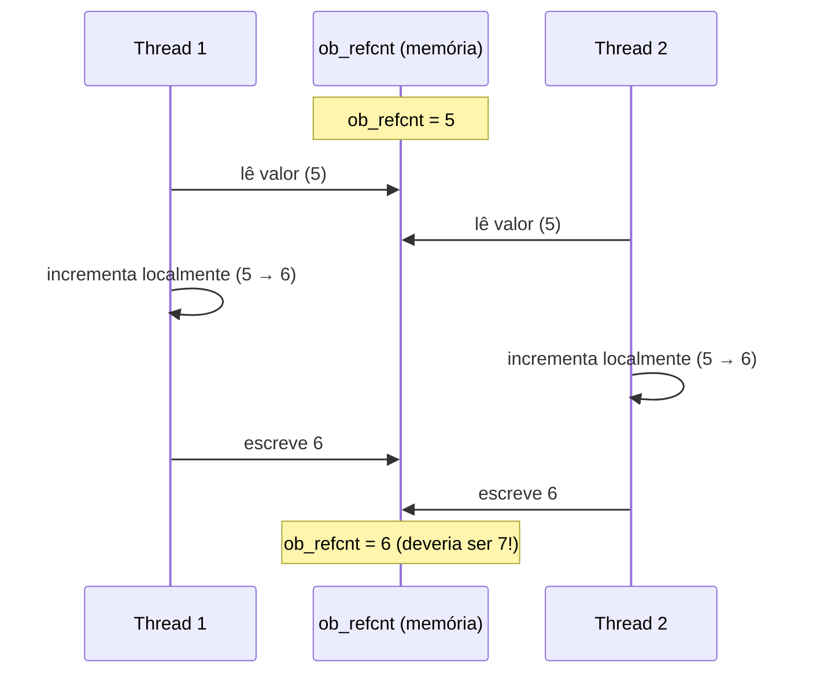
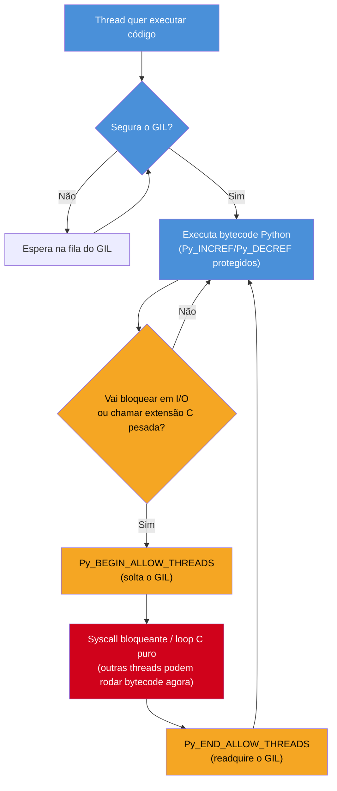

# O GIL — o que é de verdade e por que existe

> [!abstract] TL;DR
> O **GIL** (*Global Interpreter Lock*) não existe porque "Python é uma linguagem ruim para concorrência" ou porque o interpretador precisa proteger algum "estado global" vago — ele existe para proteger uma coisa muito específica e muito concreta: o campo `ob_refcnt` de cada `PyObject` (visto em [[02 - Objetos em CPython — PyObject, refcounting e tipos internos|02]] e [[03 - Reference counting e o Garbage Collector geracional|03]]) contra condições de corrida entre threads. `ob_refcnt++` e `ob_refcnt--` **não são operações atômicas** em C — são leitura, incremento/decremento, escrita, três passos separados — e se duas threads rodarem esses três passos ao mesmo tempo sobre o mesmo objeto, o resultado é um contador de referências corrompido, que leva a *use-after-free* ou vazamento de memória silencioso. O GIL resolve isso da forma mais simples e brutal possível: só uma thread executa bytecode Python por vez, ponto final — trocando de thread a cada `sys.getswitchinterval()` segundos (5ms por padrão) ou quando a thread atual bloqueia em I/O. É exatamente esse mecanismo que faz `threading` em Python **não acelerar trabalho CPU-bound** (as threads competem pelo mesmo lock, nunca rodam bytecode Python em paralelo de verdade), mas **acelerar trabalho I/O-bound de verdade** (o GIL é liberado explicitamente durante chamadas bloqueantes — rede, disco — permitindo que outra thread rode enquanto a primeira espera). Extensões C que fazem processamento pesado fora do interpretador (NumPy, regex compilado, hashing) também liberam o GIL deliberadamente via `Py_BEGIN_ALLOW_THREADS`, e é aí que "threading em Python" ganha paralelismo real de CPU — não pela mágica do `threading`, mas porque a extensão C escolheu soltar o lock.

## O bug que abre esta nota

Um desenvolvedor sênior, vindo de Java, está otimizando um serviço Python que processa imagens em lote. A CPU da máquina tem 16 núcleos, e ele decide paralelizar o processamento com `threading`, exatamente como faria em Java com um `ExecutorService`:

```python
import threading
import time

def processar_imagem(dados):
    # CPU-bound: redimensionar, aplicar filtro, recodificar
    resultado = aplicar_filtro_pesado(dados)
    return resultado

imagens = carregar_lote(100)  # 100 imagens, ~50ms de CPU cada

# "Vou usar 8 threads, deve rodar ~8x mais rápido"
inicio = time.perf_counter()
threads = []
for lote in dividir_em_partes(imagens, 8):
    t = threading.Thread(target=processar_lote, args=(lote,))
    t.start()
    threads.append(t)
for t in threads:
    t.join()
fim = time.perf_counter()

print(f"Tempo com 8 threads: {fim - inicio:.2f}s")
# Resultado real: praticamente IDÊNTICO a rodar com 1 thread só
# (às vezes até um pouco PIOR, por causa do overhead de troca de contexto)
```

O código está correto — sem *deadlock*, sem *race condition* visível, sem exceção. Mas as 8 threads não aceleram nada. Em Java, esse mesmo padrão usaria os 16 núcleos de verdade. Em Python, o `htop` mostra um único núcleo perto de 100% enquanto os outros 15 ficam praticamente ociosos. O desenvolvedor não tem um bug de lógica — tem uma suposição errada sobre o que `threading` em CPython é capaz de fazer, e essa suposição só é corrigível entendendo *por que* o GIL existe e *o que*, exatamente, ele protege. Esta nota assume que você já sabe, das notas [[02 - Objetos em CPython — PyObject, refcounting e tipos internos|02]] e [[03 - Reference counting e o Garbage Collector geracional|03]], o que é `ob_refcnt` e como o reference counting funciona — e constrói em cima disso a peça que faltava: por que essa contagem precisava, desde o primeiro dia do CPython (1990s), de um mecanismo de proteção entre threads.

> [!info] Pré-requisito
> Esta nota pressupõe [[02 - Objetos em CPython — PyObject, refcounting e tipos internos|02]] (o que é `ob_refcnt`, `Py_INCREF`/`Py_DECREF`) e [[03 - Reference counting e o Garbage Collector geracional|03]] (como o reference counting decide quando um objeto morre). Se esses dois mecanismos não estiverem claros, volte a eles antes — esta nota não os reexplica, só assume que `ob_refcnt` já é um conceito familiar e foca no problema de concorrência que ele cria.

## O que é

O **Global Interpreter Lock** é um mutex — um único lock, global ao processo inteiro, não por objeto e não por thread — que qualquer thread precisa segurar para executar bytecode Python. Ele é literalmente um `PyThread_type_lock` interno do CPython (uma primitiva de exclusão mútua do sistema operacional), guardado dentro da struct de estado do interpretador (`PyInterpreterState` em builds modernos — CPython 3.12+ move parte desse estado para permitir múltiplos interpretadores isolados via [PEP 684](https://peps.python.org/pep-0684/), mas o lock em si continua com a mesma função). Só existe uma exceção formal a "global": builds *free-threaded* (PEP 703, ver [[06 - Free-threading — o GIL opcional (PEP 703)|nota 06 deste galho]]) removem o GIL por completo, trocando-o por locks mais finos — mas isso é uma variante de build ainda opt-in, não o comportamento padrão do CPython em 2026.

Em CPython "normal" (com GIL), o modelo é simples de enunciar e traiçoeiro de internalizar: **não importa quantas threads Python você crie, no máximo uma delas está, em qualquer instante dado, executando bytecode do interpretador**. As outras estão bloqueadas esperando o lock, ou fora do interpretador fazendo alguma coisa que explicitamente não precisa dele (mais sobre isso adiante).

> [!question]- Isso significa que threads em Python não servem para nada?
> Não — significa que threads em Python servem para uma categoria específica de problema (esperar por algo externo), e não servem para outra (fazer conta em paralelo). A seção "Quando o GIL é liberado" explica exatamente essa fronteira, e é o coração prático desta nota.

**GIL em uma frase:** um mutex único, global ao processo, que qualquer thread precisa segurar para tocar bytecode Python — existe para que o reference counting continue seguro sem precisar de um lock por objeto.

## Por que importa: o problema real que o GIL resolve

### `ob_refcnt++` não é uma instrução atômica

Aqui está o núcleo técnico da nota, e é mais simples do que a reputação do GIL sugere. Em C, uma linha como:

```c
obj->ob_refcnt++;
```

não é uma única operação de hardware. Ela se decompõe, no mínimo, em três passos distintos:

1. **Ler** o valor atual de `ob_refcnt` da memória para um registrador da CPU.
2. **Incrementar** esse valor no registrador.
3. **Escrever** o valor incrementado de volta na memória.

Se o CPython rodasse threads Python de verdade em paralelo — cada uma num núcleo de CPU diferente, sem nenhuma coordenação — e duas threads distintas executassem `Py_INCREF(obj)` sobre o **mesmo objeto** ao mesmo tempo, o intercalamento das três etapas pode acontecer assim:



Duas threads incrementaram o contador, mas o valor final é 6, não 7 — um `Py_INCREF` inteiro **desapareceu**, porque as duas threads leram o mesmo valor de partida antes de qualquer uma escrever o resultado de volta. Esse fenômeno tem nome — **lost update**, a condição de corrida clássica de qualquer sistema com estado compartilhado mutável e escrita concorrente sem sincronização — e o dano que ele causa aqui é catastrófico especificamente por causa do que `ob_refcnt` significa: quando esse contador chega a zero, o CPython libera a memória do objeto **imediatamente** (`tp_dealloc`, coberto na nota [[03 - Reference counting e o Garbage Collector geracional|03]]).

Um `ob_refcnt` corrompido para *menos* do que deveria significa que o objeto pode ser desalocado enquanto ainda existem referências vivas apontando para ele — um **use-after-free**: código que acessa memória já liberada e reciclada pelo alocador para outra coisa, lendo lixo ou, pior, corrompendo dados de um objeto completamente diferente que passou a ocupar aquele endereço. É uma das classes de bug mais graves que existem em software de sistemas — a mesma categoria de vulnerabilidade que aparece em CVEs de segurança de linguagens sem gerenciamento de memória automático (C, C++). Um `ob_refcnt` corrompido para *mais* do que deveria é mais benigno, mas ainda errado: o objeto nunca é liberado, um vazamento de memória permanente, silencioso, sem qualquer exceção ou sinal visível no código Python que o desenvolvedor escreveu.

> [!warning] Este bug não é hipotético nem exclusivo do CPython
> Corromper um contador de referências sob concorrência sem sincronização é exatamente o motivo pelo qual `std::shared_ptr` em C++ oferece uma variante *atomic* (`std::atomic<std::shared_ptr<T>>`, C++20) e por que Objective-C/Swift usam operações atômicas dedicadas para ARC (*Automatic Reference Counting*) em contextos multi-thread. Qualquer runtime que use contagem de referências como mecanismo de gerenciamento de memória enfrenta este exato problema assim que introduz threads nativas com memória compartilhada — a única pergunta é *como* ele resolve: um lock por objeto (caro, e ainda vulnerável a deadlock entre locks de objetos diferentes), operações atômicas de CPU por incremento/decremento (mais rápidas, mas ainda um custo por operação, e o caminho que builds free-threaded do CPython adotam — ver nota 06), ou um lock único e global que elimina o problema por completo ao eliminar a concorrência real dentro do interpretador (a escolha histórica do CPython).

### A escolha de design: um lock global em vez de um lock por objeto

A alternativa óbvia — dar a cada `PyObject` seu próprio lock, travado a cada `Py_INCREF`/`Py_DECREF` — foi tentada e descartada historicamente. Guido van Rossum implementou o GIL já nas primeiras versões multi-thread do CPython (início dos anos 1990) justamente porque locks finos por objeto tinham dois problemas sérios:

1. **Custo de performance em código single-threaded**: a esmagadora maioria dos programas Python, na época e ainda hoje, não usa múltiplas threads de forma pesada. Pagar o custo de adquirir e liberar um lock a cada incremento/decremento de referência — em *todo* objeto, mesmo quando não há concorrência nenhuma acontecendo — seria um imposto de performance universal para resolver um problema que só existe quando há threads competindo.
2. **Risco de deadlock entre locks aninhados**: operações que tocam múltiplos objetos ao mesmo tempo (por exemplo, inserir um item numa lista que está dentro de um dicionário) precisariam adquirir múltiplos locks em sequência — e qualquer sistema com múltiplos locks adquiridos em ordens potencialmente diferentes por threads diferentes é uma receita clássica para *deadlock*.

O GIL evita os dois problemas ao custo de um terceiro: elimina paralelismo real de bytecode Python entre threads, mesmo em máquinas com múltiplos núcleos. É uma troca deliberada, documentada como tal desde sempre pelos próprios mantenedores do CPython — não um acidente de implementação nem um sinal de que "Python não sabe fazer concorrência". O [Python Wiki sobre o GIL](https://wiki.python.org/moin/GlobalInterpreterLock) descreve essa história com mais detalhe.

> [!question]- Se o GIL "trava tudo", por que não simplesmente ter um lock por tipo de objeto, em vez de granularidade total (por objeto) ou nenhuma (global)?
> Foi tentado, e ainda é tentado — é essencialmente o caminho técnico do CPython free-threaded (PEP 703, nota 06): em vez de um lock por objeto individual (caro demais, propenso a deadlock), a abordagem moderna usa **biased reference counting** (a maioria dos incrementos/decrementos acontece sem lock nenhum, assumindo que só a thread "dona" do objeto mexe nele na maior parte do tempo) mais locks bem mais finos só quando múltiplas threads de fato disputam o mesmo objeto. Isso levou décadas de trabalho de engenharia (o projeto começou a sério em 2021, liderado por Sam Gross na Meta) porque *qualquer* solução de granularidade mais fina que "um lock global" precisa lidar com o mesmo risco de deadlock e overhead que motivou a escolha original do GIL — só que agora com técnicas (locks otimistas, contagem enviesada) que não existiam ou não eram práticas nos anos 90.

## Como funciona

### O ciclo de troca: `sys.getswitchinterval()`

Enquanto o GIL existe (build padrão, sem free-threading), o CPython precisa decidir *quando* forçar a thread atual a soltar o lock, para que outra thread tenha uma chance de rodar. A partir do Python 3.2 ([PEP incorporado à implementação, sem número dedicado — mudança direta no scheduler do GIL](https://docs.python.org/3/library/sys.html#sys.setswitchinterval)), esse ritmo é baseado em **tempo de parede** (*wall-clock time*), não em número de instruções de bytecode executadas (o esquema anterior, mais antigo e menos previsível sob cargas heterogêneas).

```python
import sys

print(sys.getswitchinterval())   # 0.005 — 5 milissegundos, o padrão do CPython
```

O mecanismo funciona assim: a cada `switchinterval` segundos, a thread que está segurando o GIL recebe um sinal interno para soltá-lo — mas ela só solta de fato no próximo ponto seguro de verificação do interpretador (não instantaneamente, e não no meio de uma operação atômica de bytecode). Se nenhuma outra thread está esperando pelo GIL, a thread atual simplesmente continua rodando sem interrupção real — o intervalo só importa quando há contenção de verdade.

```python
import sys

# Reduzir o intervalo: troca de thread mais frequente,
# mais responsivo para latência entre threads, mais overhead de troca de contexto
sys.setswitchinterval(0.001)   # 1ms

# Aumentar o intervalo: menos overhead de troca, mas cada thread monopoliza
# o GIL por mais tempo antes de ceder — pior para latência de outras threads
sys.setswitchinterval(0.1)     # 100ms
```

> [!warning] `sys.setswitchinterval()` não afeta paralelismo, só a granularidade da alternância
> Ajustar o intervalo de troca **não** faz threads Python rodarem bytecode em paralelo — continua sendo uma thread por vez, sempre. O que muda é a *frequência* com que o interpretador troca qual thread está segurando o lock. Um intervalo menor favorece programas com muitas threads curtas competindo por responsividade (cada uma espera menos tempo pela sua vez); um intervalo maior favorece throughput bruto de uma única thread dominante, ao custo de fazer as outras esperarem mais entre suas janelas de execução. Ajustar esse valor é uma otimização de latência entre threads, não uma forma de contornar o GIL.

### Quando o GIL é liberado de verdade

Esta é a seção que separa quem decorou "o GIL trava tudo" de quem entende o mecanismo. O GIL protege especificamente a execução de bytecode Python e as manipulações de `ob_refcnt` que ela implica — então, sempre que o CPython sabe, com certeza, que uma operação **não vai tocar** o estado interno de nenhum `PyObject`, o interpretador pode soltar o lock deliberadamente antes de fazer essa operação, e reaquirir depois de terminar.



Os três casos concretos em que isso acontece:

**1. Chamadas de I/O bloqueantes.** Toda operação da biblioteca padrão que espera por algo externo — ler de um socket (`socket.recv`), ler de um arquivo (`file.read`), `time.sleep()`, esperar por um subprocess (`subprocess.wait`) — solta o GIL antes de entrar na chamada de sistema (*syscall*) e o readquire assim que ela retorna. Isso faz sentido estrutural: enquanto a thread está bloqueada esperando o kernel do sistema operacional responder, ela não está executando nenhum bytecode Python, não está tocando `ob_refcnt` de objeto nenhum — não há razão nenhuma para segurar o lock enquanto isso acontece, e segurá-lo impediria qualquer outra thread de progredir à toa.

**2. Extensões C que chamam `Py_BEGIN_ALLOW_THREADS`/`Py_END_ALLOW_THREADS`.** Qualquer extensão escrita em C (ou Cython, ou Rust via PyO3) pode envolver um trecho de código que não toca a API do CPython com essas duas macros:

```c
/* Dentro de uma função de extensão C */
Py_BEGIN_ALLOW_THREADS
/* Este bloco NÃO PODE chamar nenhuma API do CPython
   (nenhum Py_INCREF, nenhuma alocação via PyObject_New, etc.) —
   é uma promessa que o autor da extensão faz ao interpretador */
resultado = funcao_c_pura_e_pesada(dados);
Py_END_ALLOW_THREADS
/* GIL readquirido aqui; agora é seguro voltar a tocar objetos Python */
```

Isso é uma decisão explícita e deliberada do autor da extensão — o interpretador não solta o GIL sozinho durante uma chamada de extensão C comum; a extensão precisa pedir isso ativamente, e assumir a responsabilidade de que o bloco entre as duas macros genuinamente não mexe em nenhum `PyObject`.

**3. Bibliotecas de computação numérica, como NumPy.** É aqui que a intuição popular de "NumPy é rápido porque usa múltiplas threads" precisa de um ajuste fino: NumPy libera o GIL, via exatamente o mecanismo do item 2, durante os *loops internos* de operações vetorizadas pesadas — uma multiplicação de matrizes grandes, uma soma de array, uma operação element-wise sobre milhões de floats. Enquanto esse loop C roda, o GIL está solto, e **outra thread Python** pode, nesse intervalo, rodar bytecode de verdade em paralelo — inclusive outra chamada NumPy, ou qualquer outro código Python puro. Isso é real paralelismo de CPU dentro de um programa Python com `threading`, mas ele só acontece **dentro** da porção de código que já saiu do interpretador Python para dentro do loop C puro — não é `threading` "acelerando NumPy" de forma genérica; é NumPy, especificamente, decidindo soltar o lock durante a parte do trabalho que não precisa dele.

> [!question]- Então rodar múltiplas chamadas NumPy em threads diferentes realmente paraleliza de verdade?
> Sim, com uma ressalva importante: paraleliza a parte que está **dentro** do código C do NumPy com o GIL solto — a multiplicação de matriz em si, por exemplo. O código Python ao redor dela (montar os arrays, checar resultados, orquestrar as threads) ainda compete pelo GIL normalmente. Na prática, para operações NumPy suficientemente grandes (onde o tempo dentro do loop C domina o tempo total), `threading` de fato entrega paralelismo real e ganho de performance mensurável — é por isso que bibliotecas como scikit-learn e SciPy usam `threading` internamente para certas rotinas de álgebra linear (via BLAS/LAPACK, que também liberam o GIL). Para operações NumPy pequenas, onde o overhead de orquestração em Python domina, o ganho desaparece ou vira prejuízo líquido.

### Uma exceção real: sub-interpretadores com GIL próprio (PEP 684)

Vale registrar uma nuance que a frase "o GIL é global ao processo" simplifica demais: desde a [PEP 684](https://peps.python.org/pep-0684/) (Python 3.12), o CPython suporta **sub-interpretadores com estado isolado**, cada um com seu **próprio GIL**, dentro do mesmo processo. Isso não é o comportamento default de `threading.Thread` — é uma API separada e mais avançada (`interpreters` no módulo `concurrent`, ainda em maturação na biblioteca padrão via [PEP 734](https://peps.python.org/pep-0734/)), que cria interpretadores independentes, cada um incapaz de compartilhar objetos Python arbitrários com os outros (a comunicação entre eles passa por canais explícitos de serialização, não por referências compartilhadas de memória).

> [!question]- Isso não contradiz a nota inteira, que diz que o GIL é "global"?
> Não — "global" aqui sempre quis dizer "global *a um interpretador*", e durante décadas isso coincidiu com "global ao processo" porque só existia um interpretador por processo na prática (múltiplos interpretadores existiam desde muito antes via `Py_NewInterpreter`, mas compartilhavam o mesmo GIL até a PEP 684, o que limitava sua utilidade para paralelismo real). A mudança da PEP 684 é dar a cada sub-interpretador seu próprio GIL — o que, na prática, se aproxima de um modelo parecido com `multiprocessing` (isolamento de estado, paralelismo real entre unidades independentes), mas dentro de um único processo do sistema operacional, com overhead de criação mais baixo que um processo completo. Isso continua sendo uma API de nicho em 2026, não o caminho comum para paralelizar código Python — mas é relevante para não afirmar categoricamente que "só existe um GIL por processo, sempre".

### Por que threads Python não paralelizam CPU-bound

Juntando as duas seções anteriores, a resposta completa à pergunta que abre esta nota fica direta: **trabalho CPU-bound escrito em Python puro** — um loop `for` fazendo aritmética, processamento de string, qualquer coisa que seja só bytecode Python do início ao fim — nunca solta o GIL espontaneamente (só quando o `switchinterval` expira, e mesmo assim é uma troca cooperativa entre threads que continuam se revezando, uma de cada vez, nunca em paralelo). Rodar esse tipo de trabalho em `N` threads não faz `N` threads executarem bytecode simultaneamente em `N` núcleos — faz `N` threads se revezarem, uma de cada vez, no mesmo núcleo lógico do ponto de vista do interpretador, com o overhead adicional de trocar de contexto entre elas. O resultado observado — tempo total igual ou pior que rodar sequencialmente — é exatamente o esperado, não um bug de configuração.

**Trabalho I/O-bound** é o caso oposto: o tempo dominante do programa é gasto esperando por algo externo (rede, disco, outro processo), não executando bytecode. Nesse cenário, o GIL é solto durante toda a espera (item 1 da seção anterior), então múltiplas threads Python conseguem, de fato, ter múltiplas requisições de rede em voo simultaneamente, múltiplas leituras de arquivo pendentes ao mesmo tempo — paralelismo real na parte que importa (a espera), mesmo que o processamento do resultado, quando ele chega, ainda seja serializado pelo GIL como qualquer bytecode Python.

| Tipo de trabalho | `threading` acelera? | Por quê |
|---|---|---|
| CPU-bound puro (loop Python, aritmética, parsing) | Não | Nunca solta o GIL espontaneamente; threads se revezam, não paralelizam |
| I/O-bound (rede, disco, subprocess) | Sim, de verdade | GIL solto durante a espera bloqueante; múltiplas esperas acontecem em paralelo |
| CPU-bound em extensão C que libera o GIL (NumPy, hashing, regex compilado, zlib) | Parcialmente, dentro do trecho C | GIL solto só durante o loop C interno; overhead de orquestração em Python continua serializado |

Uma nota importante de fronteira: esta nota explica **por que** essa distinção existe. A comparação prática e aprofundada entre `threading` e `multiprocessing` como as duas saídas reais para esse problema — quando escolher cada uma, o custo de serialização entre processos, os padrões de produção — é o assunto da [[05 - GIL e concorrência na prática — threading vs multiprocessing|próxima nota deste galho]]; esta nota não antecipa esse conteúdo.

**GIL e paralelismo em uma frase:** o GIL não impede paralelismo de qualquer tipo — impede paralelismo de *bytecode Python*, que é exatamente o que trabalho CPU-bound puro precisa e o que trabalho I/O-bound/extensão-C não precisa (porque passa a maior parte do tempo fora do interpretador).

## Na prática

### Cenário 1: medindo o efeito do GIL diretamente

O experimento mais direto para visualizar o problema descrito na abertura desta nota — sem depender de intuição, com números reais:

```python
import threading
import time

def trabalho_cpu(n):
    """CPU-bound puro: só bytecode Python, nenhuma extensão C, nenhum I/O."""
    total = 0
    for i in range(n):
        total += i * i
    return total

N = 20_000_000

# Sequencial: uma thread, duas chamadas
inicio = time.perf_counter()
trabalho_cpu(N)
trabalho_cpu(N)
print(f"Sequencial: {time.perf_counter() - inicio:.2f}s")

# "Paralelo": duas threads, uma chamada cada
inicio = time.perf_counter()
t1 = threading.Thread(target=trabalho_cpu, args=(N,))
t2 = threading.Thread(target=trabalho_cpu, args=(N,))
t1.start(); t2.start()
t1.join(); t2.join()
print(f"Duas threads: {time.perf_counter() - inicio:.2f}s")

# Resultado típico (CPython 3.12, sem free-threading):
# Sequencial: ~2.1s
# Duas threads: ~2.3s  ← IGUAL ou PIOR, nunca ~1.05s (que seria o "paralelo de verdade")
```

O ganho esperado de duas threads rodando em paralelo seria reduzir o tempo total pela metade. O resultado real mostra o oposto do que a intuição de outras linguagens sugere: o tempo com duas threads é igual ou levemente pior que sequencial, porque a única coisa que as duas threads fizeram foi se revezar segurando o mesmo GIL, pagando o custo extra de troca de contexto entre elas sem ganhar nenhum paralelismo real.

### Cenário 2: o mesmo experimento com I/O real

Trocando o trabalho CPU-bound por I/O-bound (aqui simulado com `time.sleep`, que internamente solta o GIL exatamente como uma chamada de rede real faria):

```python
import threading
import time

def trabalho_io(segundos):
    """I/O-bound simulado: time.sleep solta o GIL enquanto espera."""
    time.sleep(segundos)

N_THREADS = 8
DURACAO = 0.5

# Sequencial: 8 esperas de 0.5s, uma atrás da outra
inicio = time.perf_counter()
for _ in range(N_THREADS):
    trabalho_io(DURACAO)
print(f"Sequencial: {time.perf_counter() - inicio:.2f}s")   # ~4.0s

# Com threads: 8 esperas simultâneas
inicio = time.perf_counter()
threads = [threading.Thread(target=trabalho_io, args=(DURACAO,)) for _ in range(N_THREADS)]
for t in threads: t.start()
for t in threads: t.join()
print(f"Com threads: {time.perf_counter() - inicio:.2f}s")   # ~0.5s — paralelismo REAL
```

A diferença entre os dois cenários é a demonstração mais direta possível da fronteira que esta nota descreve: mesma ferramenta (`threading`), mesmo número de threads, resultado radicalmente diferente — porque num caso o trabalho é bytecode Python que nunca solta o GIL, e no outro é uma espera que solta o GIL o tempo inteiro.

### Cenário 3: verificando na prática que uma extensão C libera o GIL

Uma forma indireta, mas real, de observar o item 3 da seção "Quando o GIL é liberado" é medir speedup de operações NumPy grandes sob `threading` — o ganho, quando existe, é a evidência empírica de que o GIL foi solto durante o cálculo:

```python
import threading
import time
import numpy as np

def multiplicar_matrizes(tamanho):
    a = np.random.rand(tamanho, tamanho)
    b = np.random.rand(tamanho, tamanho)
    return a @ b   # multiplicação de matriz — loop C interno, GIL solto durante o cálculo

TAMANHO = 1200

inicio = time.perf_counter()
multiplicar_matrizes(TAMANHO)
multiplicar_matrizes(TAMANHO)
print(f"Sequencial: {time.perf_counter() - inicio:.2f}s")

inicio = time.perf_counter()
t1 = threading.Thread(target=multiplicar_matrizes, args=(TAMANHO,))
t2 = threading.Thread(target=multiplicar_matrizes, args=(TAMANHO,))
t1.start(); t2.start()
t1.join(); t2.join()
print(f"Duas threads: {time.perf_counter() - inicio:.2f}s")

# O ganho medido aqui varia por máquina/build de NumPy (algumas distribuições já
# paralelizam @ internamente via BLAS multi-thread, o que confunde a medição isolada) —
# mas em builds single-threaded de BLAS, um ganho real e mensurável aparece,
# ao contrário do Cenário 1.
```

> [!warning] Medir "ganho do GIL solto" em NumPy pode ser confuso por causa de paralelismo interno do BLAS
> Muitas distribuições de NumPy (as que vêm com `pip install numpy` em builds recentes) já usam uma implementação de BLAS (OpenBLAS, MKL) que internamente cria suas próprias threads nativas de sistema operacional para operações de álgebra linear grandes — paralelismo que acontece **independente** do `threading` do Python. Isso significa que uma única chamada `a @ b` já pode usar múltiplos núcleos por conta própria, mascarando o efeito específico de "o GIL foi solto" que este cenário tenta isolar. Para medir só o efeito do GIL, fixar `OMP_NUM_THREADS=1`/`OPENBLAS_NUM_THREADS=1` antes de rodar o experimento remove essa variável de confusão.

### Diagnosticando contenção de GIL em produção

Fora do laboratório controlado dos cenários acima, o sintoma que leva um time a investigar o GIL costuma ser mais sutil: um serviço com múltiplas threads que devia estar aproveitando vários núcleos, mas o `htop`/`top` mostra utilização de CPU concentrada em torno de 100-150% (um núcleo e meio, aproximadamente), nunca perto de `N × 100%` esperado. Duas ferramentas tornam essa contenção diretamente observável, sem precisar instrumentar o código:

- **`py-spy dump --pid <PID>`** — um *sampling profiler* externo (assunto aprofundado na [[08 - Profiling — cProfile, py-spy, tracemalloc|nota 08 deste galho]]) que consegue anexar a um processo Python já rodando e mostrar, para cada thread, se ela está *holding the GIL* ou apenas esperando por ele. Ver várias threads simultaneamente marcadas como "waiting for the GIL" é a confirmação direta de que o gargalo é exatamente o mecanismo descrito nesta nota, não outra causa (lock de aplicação, contenção de banco de dados, etc.).
- **`sys._current_frames()`** — uma função de baixo nível da biblioteca padrão que devolve o frame de execução atual de cada thread do processo; combinada com inspeção manual, permite confirmar que múltiplas threads estão, de fato, tentando executar bytecode Python simultaneamente (e portanto competindo pelo GIL) em vez de estarem bloqueadas em I/O.

O diagnóstico prático segue uma pergunta simples: se a CPU total usada pelo processo nunca ultrapassa ~1 núcleo mesmo com várias threads ativas, e o trabalho é predominantemente Python puro (sem extensão C liberando o GIL), a causa quase sempre é exatamente o mecanismo desta nota — não um bug de configuração, não uma thread mal escrita, apenas o comportamento esperado do GIL sobre trabalho CPU-bound.

## O contraste que interessa: GIL vs. threads nativas vs. event loop single-threaded

Para quem vem de outra linguagem, vale situar o GIL entre os dois modelos de concorrência mais comuns que ele costuma ser confundido com um ou outro:

| Aspecto | CPython com GIL | Java (threads nativas) | Node.js (event loop single-threaded) |
|---|---|---|---|
| Modelo de execução | 1 thread executa bytecode Python por vez; alternância cooperativa a cada `switchinterval` | N threads nativas do SO, cada uma em seu núcleo, verdadeiramente simultâneas | 1 única thread para JS; concorrência via *callbacks*/*event loop*, nunca paralelismo real de JS |
| Paralelismo de CPU dentro do processo | Só fora do interpretador (extensão C com GIL solto, sub-interpretador PEP 684, `multiprocessing`) | Sim, nativo — é o caso de uso principal de `Thread`/`ExecutorService` | Não — I/O é assíncrono via libuv (thread pool interno em C), mas JS do usuário nunca roda em paralelo consigo mesmo |
| Sincronização de memória compartilhada | Desnecessária para o *interpretador* (GIL já serializa); ainda necessária para lógica de negócio (`Lock` explícito) | Necessária e responsabilidade do desenvolvedor (`synchronized`, `java.util.concurrent`) — fonte clássica de bugs de corrida | Não se aplica — não há memória compartilhada mutável entre "threads" de JS porque só existe uma |
| Por que essa escolha de design | Reference counting precisa de proteção; um lock global evita locks por objeto e deadlock entre eles | JVM não usa refcounting (GC tracing, nota [[03-Dominios/Tecnologia/Java/JVM/03 - Garbage Collection — o conceito\|Garbage Collection]]) — não tem esse problema estrutural para resolver | Design deliberado para simplificar o modelo mental de concorrência (sem *race conditions* de memória compartilhada) às custas de nunca paralelizar CPU-bound em JS puro |

> [!question]- Se Node.js também não paraleliza CPU-bound em JS, por que ele não sofre a mesma crítica que o GIL sofre?
> Em parte porque o modelo do Node.js é **declarado como filosofia de design desde o início** — "single-threaded por escolha, use Worker Threads ou processos separados para CPU-bound" é comunicado como arquitetura, não descoberto como surpresa depois. O GIL, por comparação, é uma decisão de implementação de 1990 que a maioria dos desenvolvedores só encontra ao tentar usar `threading` esperando o comportamento de Java — a superfície de API (`threading.Thread`, com a mesma cara de uma thread nativa de Java) sugere um modelo que o runtime não entrega, e é essa incompatibilidade entre expectativa e mecanismo que gera a maior parte da confusão e da crítica popular ao GIL. Tecnicamente, o efeito líquido para CPU-bound puro é parecido nos dois runtimes: nenhum paraleliza sem sair do interpretador/motor de execução principal.

**O contraste em uma frase:** o GIL não é "Java sem paralelismo" nem "Node.js com mais uma API" — é uma escolha própria, motivada por um problema específico (refcounting seguro), com uma superfície de API (`threading`) que engana quem espera o modelo de outra linguagem.

## Armadilhas comuns

> [!warning] Achar que o GIL protege qualquer código Python de condições de corrida
> **O que acontece:** desenvolvedor assume que, como "só uma thread roda por vez", qualquer sequência de operações Python é automaticamente segura contra corrida entre threads — inclusive lógica de negócio como `contador += 1` sobre um contador compartilhado.
> **Por quê:** o GIL garante que cada **bytecode individual** (uma instrução `LOAD_FAST`, um `BINARY_ADD`) execute sem interrupção por outra thread no meio dela — mas `contador += 1` em Python é **várias** instruções de bytecode (carregar o valor, somar, guardar de volta), e o GIL pode trocar de thread exatamente entre essas instruções. Duas threads incrementando o mesmo contador Python de alto nível ainda podem perder atualizações, pela mesma razão estrutural (leitura-modificação-escrita não atômica) que motivou a nota inteira — só que agora no nível do bytecode Python, não do `ob_refcnt` em C.
> **Como evitar:** usar `threading.Lock` (ou primitivas de mais alto nível, `threading.Semaphore`/`Condition`) para qualquer seção que leia-modifique-escreva estado compartilhado entre threads, exatamente como se faria em qualquer linguagem sem essa garantia — o GIL não substitui sincronização explícita de lógica de negócio, só protege a integridade interna do interpretador.

> [!warning] Confundir "o GIL existe" com "Python não escala em produção"
> **O que acontece:** decisão de arquitetura descarta Python inteiro para um serviço de alta concorrência, com base em "tem GIL, não escala".
> **Por quê:** a maior parte de serviços de produção reais (APIs web, workers de fila, scrapers) é dominada por I/O — chamadas de rede para banco de dados, APIs externas, filesystem — exatamente o caso em que o GIL é solto e `threading` (ou, mais comum hoje, `asyncio` — assunto do Galho 8) entrega concorrência real. Os frameworks que sustentam a maior parte do backend Python em produção (Django, FastAPI, Celery) são, estruturalmente, arquiteturas I/O-bound.
> **Como evitar:** identificar se o gargalo real é CPU-bound (processamento de imagem, parsing pesado, cálculo científico) ou I/O-bound (a maioria dos serviços web) antes de descartar Python por causa do GIL. Para a fração genuinamente CPU-bound, a resposta não é "abandonar Python" — é `multiprocessing` (processos separados, cada um com seu próprio interpretador e seu próprio GIL, paralelismo real entre eles) ou extensões C/Rust que liberam o GIL, ambos cobertos na [[05 - GIL e concorrência na prática — threading vs multiprocessing|próxima nota]].

> [!warning] Ajustar `sys.setswitchinterval()` esperando ganho de paralelismo
> **O que acontece:** ao descobrir a existência do parâmetro, desenvolvedor reduz o intervalo achando que vai "liberar mais paralelismo" para threads CPU-bound.
> **Por quê:** o `switchinterval` controla só a frequência com que a alternância *cooperativa* entre threads acontece — quantas vezes por segundo o GIL troca de dono. Reduzir o intervalo faz a alternância mais frequente (potencialmente melhor para latência de resposta entre threads competindo), mas nunca faz duas threads executarem bytecode ao mesmo tempo — o número de threads rodando bytecode simultaneamente continua sendo exatamente 1, sempre, com qualquer valor de `switchinterval`.
> **Como evitar:** tratar `sys.setswitchinterval()` como uma ferramenta de tuning de latência/responsividade entre threads que já são I/O-bound ou já liberam o GIL via extensão C — nunca como alavanca de paralelismo CPU-bound, que ela estruturalmente não pode entregar.

## Em entrevista

A pergunta "o que é o GIL e por que ele existe" é praticamente garantida em qualquer entrevista sênior de Python — e a resposta que separa quem decorou o nome de quem entende o mecanismo é, de novo, a mesma da nota sobre reference counting: nomear a causa raiz, não só o sintoma.

> "The GIL is a single global mutex in CPython that a thread must hold to execute Python bytecode. It doesn't exist because Python is bad at concurrency — it exists to protect one specific thing: the `ob_refcnt` field that every `PyObject` carries for reference counting. Incrementing or decrementing that counter in C isn't an atomic operation — it's read, modify, write, three separate steps — and if two threads did that concurrently on the same object without any lock, you'd get a lost update: the refcount would end up wrong, which can cause a use-after-free or a permanent memory leak. Rather than adding a lock per object — which would hurt single-threaded performance everywhere and risk deadlocks between nested locks — CPython's original design uses one global lock, switched between threads roughly every 5 milliseconds by default, tunable via `sys.setswitchinterval()`. The GIL is released explicitly during blocking I/O and inside C extensions that call `Py_BEGIN_ALLOW_THREADS` — which is exactly why `threading` gives real concurrency for I/O-bound work but no real parallelism for CPU-bound pure-Python work: CPU-bound code never releases the GIL on its own, so threads just take turns on one core instead of running simultaneously on several."

Uma pergunta de acompanhamento quase certa: **"como você faria paralelismo real de CPU em Python, então?"** — a resposta sênior nomeia as duas saídas reais (aprofundadas na próxima nota do galho): `multiprocessing`, que cria processos de sistema operacional separados, cada um com seu próprio interpretador e seu próprio GIL — paralelismo genuíno entre processos, ao custo de serialização de dados entre eles (`pickle` na maioria dos casos) — ou extensões C/Rust (NumPy, Cython com `nogil`, PyO3) que liberam o GIL durante o trabalho pesado, dando paralelismo real dentro de um único processo para o trecho que está fora do interpretador Python puro.

> [!question]- O entrevistador pergunta sobre o "GIL opcional" (free-threading) — o que responder?
> Responder que existe, desde a PEP 703, um esforço formal (liderado por Sam Gross, hoje na equipe da Meta financiando o trabalho) para tornar o GIL opcional em CPython — Python 3.13 trouxe um build experimental *free-threaded* (`--disable-gil`), e Python 3.14 (lançado em outubro de 2025) promoveu esse build a **oficialmente suportado** sob os critérios da [PEP 779](https://peps.python.org/pep-0779/), embora ainda como variante opt-in, não o build padrão. O mecanismo por trás não é simplesmente "remover o lock" — é substituir a proteção do `ob_refcnt` por *biased reference counting* (a maioria dos incrementos/decrementos não precisa de lock, assumindo que uma única thread é "dona" do objeto na maior parte do tempo) mais locks bem mais finos para os casos de disputa real entre threads. O plano publicado pelos mantenedores prevê fases plurianuais — GIL desligado por padrão só é esperado para 2027-2028, e remoção completa do GIL do código-base, se acontecer, ficaria para 2029-2030. Vale mencionar que isso é o assunto completo da [[06 - Free-threading — o GIL opcional (PEP 703)|próxima-próxima nota deste galho]] — aqui cabe reconhecer que a mudança existe e está em andamento, sem se aprofundar nela.

## Como explicar em inglês

| PT | EN |
|----|----|
| Lock Global do Interpretador | Global Interpreter Lock (GIL) |
| condição de corrida | race condition |
| atualização perdida | lost update |
| operação atômica | atomic operation |
| usar-depois-de-liberar | use-after-free |
| intervalo de troca (entre threads) | switch interval |
| I/O bloqueante | blocking I/O |
| liberar o GIL | release the GIL |
| readquirir o GIL | reacquire the GIL |
| CPU-bound | CPU-bound |
| I/O-bound | I/O-bound |
| build sem GIL / de threads livres | free-threaded build |

## O que vem a seguir

Entender *por que* o GIL existe é o pré-requisito direto para decidir, na prática, quando `threading` ajuda e quando não ajuda — e o que fazer no caso em que não ajuda. A próxima nota do galho pega exatamente esse fio:

- [[05 - GIL e concorrência na prática — threading vs multiprocessing|05 — GIL e concorrência na prática: threading vs multiprocessing]] — a comparação prática e aprofundada entre as duas saídas reais para trabalho CPU-bound, com o custo de serialização entre processos que `multiprocessing` implica.
- [[06 - Free-threading — o GIL opcional (PEP 703)|06 — Free-threading: o GIL opcional (PEP 703)]] — o que muda de verdade quando o GIL é removido (biased reference counting, locks por objeto), o estado atual do ecossistema de extensões C, e o que isso significa pro dia a dia de quem não compila Python do zero.
- [[03 - Reference counting e o Garbage Collector geracional|03 — Reference counting e o Garbage Collector geracional]] — pré-requisito desta nota: o `ob_refcnt` que o GIL protege de corrida entre threads.
- [[03-Dominios/Tecnologia/Python/Concorrência e paralelismo/index|Concorrência e paralelismo (Galho 7)]] — aprofunda `threading`/`multiprocessing`/`asyncio` para além do que este galho cobre, aplicando o entendimento do GIL a padrões de produção.

## Fontes

- Python Software Foundation. *sys.setswitchinterval / sys.getswitchinterval*. docs.python.org, versão 3.14. https://docs.python.org/3/library/sys.html#sys.setswitchinterval (acessado em 2026-07-10)
- Python Software Foundation. *Thread State and the Global Interpreter Lock — Python/C API Reference Manual*. docs.python.org, versão 3.14. https://docs.python.org/3/c-api/init.html#thread-state-and-the-global-interpreter-lock (acessado em 2026-07-10) — descreve `Py_BEGIN_ALLOW_THREADS`/`Py_END_ALLOW_THREADS` e o modelo de thread state.
- [PEP 703 — Making the Global Interpreter Lock Optional in CPython](https://peps.python.org/pep-0703/): motivação completa, biased reference counting, plano de rollout faseado.
- [PEP 779 — Criteria for supported status for free-threaded Python](https://peps.python.org/pep-0779/): critérios que promoveram o build free-threaded a oficialmente suportado no Python 3.14.
- Python Wiki. *GlobalInterpreterLock*. https://wiki.python.org/moin/GlobalInterpreterLock (acessado em 2026-07-10) — histórico da decisão de design original.
- Real Python — [What Is the Python Global Interpreter Lock (GIL)?](https://realpython.com/python-gil/): explicação didática com exemplos de CPU-bound vs I/O-bound e benchmarks.
- Python Free-Threading Guide (comunidade, mantenedores do esforço PEP 703). https://py-free-threading.github.io/ (acessado em 2026-07-10) — estado atual do ecossistema de extensões C sob free-threading.
- **Fluent Python**, 2ª ed. — Luciano Ramalho, capítulo sobre concorrência: contraste entre `threading`/`multiprocessing`/`asyncio` à luz do GIL, citado como referência de aprofundamento para a próxima nota.
- [[03 - Reference counting e o Garbage Collector geracional|03 — Reference counting e o Garbage Collector geracional]] — nota irmã, pré-requisito direto: `ob_refcnt` e `Py_INCREF`/`Py_DECREF`, o mecanismo que o GIL protege.

Consultado em 2026-07-10.
