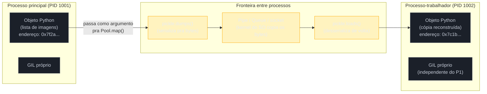
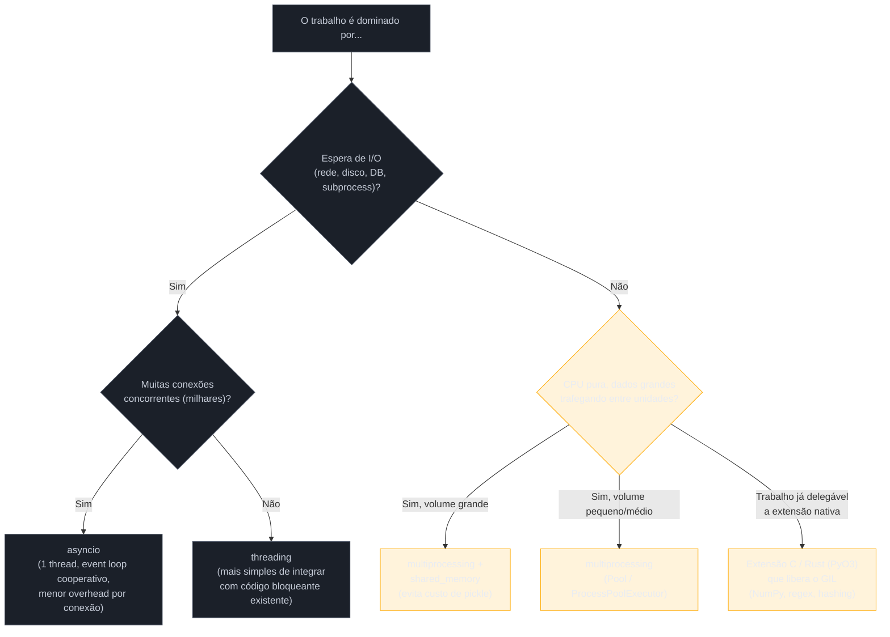

# GIL e concorrência na prática — threading vs multiprocessing

> [!abstract] TL;DR
> A nota [[04 - O GIL — o que é de verdade e por que existe|04]] estabeleceu o mecanismo: só uma thread executa bytecode Python por vez, então `threading` acelera I/O-bound (o GIL é solto durante a espera) mas não acelera CPU-bound puro (nenhuma thread solta o lock espontaneamente). Esta nota trata da decisão que vem depois: **o que fazer quando o trabalho é CPU-bound de verdade**. A resposta estrutural do CPython é `multiprocessing` — não threads dentro do mesmo processo, mas **processos inteiros do sistema operacional**, cada um com seu próprio interpretador CPython e seu próprio GIL independente, rodando de fato em núcleos diferentes ao mesmo tempo. O preço dessa fuga não é gratuito: processos não compartilham memória por padrão, então trocar dados entre eles exige serialização (`pickle`, na maioria dos casos) e transporte via IPC (*Inter-Process Communication* — pipes, filas, sockets do sistema operacional) — um custo que pode anular o ganho de paralelismo se os dados forem grandes ou a comunicação for frequente. `multiprocessing.shared_memory` existe justamente para contornar esse custo em casos específicos (arrays grandes, buffers binários), evitando cópia via memória compartilhada real entre processos. A regra prática que fecha esta nota: **I/O-bound → `threading` ou `asyncio`; CPU-bound → `multiprocessing` ou extensão C/Rust que libera o GIL** — e o aprofundamento de cada uma dessas ferramentas fica para o [[03-Dominios/Tecnologia/Python/Concorrência e paralelismo/index|Galho 7]], ainda não escrito nesta trilha.

## O bug que abre esta nota

A mesma desenvolvedora sênior da nota anterior — vinda de Java, que tentou paralelizar processamento de imagens com `threading` e descobriu, na prática amarga, que 8 threads rodavam no mesmo tempo (ou pior) que 1 — já entende agora *por que* isso aconteceu: o GIL nunca é solto durante bytecode Python puro, então as 8 threads apenas se revezavam num único núcleo. Ela lê a documentação, encontra `multiprocessing`, e reescreve o código trocando `threading.Thread` por `multiprocessing.Process`:

```python
import multiprocessing
import time

def processar_imagem(dados):
    """CPU-bound: mesmo processamento pesado de antes."""
    resultado = aplicar_filtro_pesado(dados)
    return resultado

if __name__ == "__main__":
    imagens = carregar_lote(100)  # 100 imagens, ~2MB cada, ~50ms de CPU cada

    inicio = time.perf_counter()
    with multiprocessing.Pool(processes=8) as pool:
        resultados = pool.map(processar_imagem, imagens)
    fim = time.perf_counter()

    print(f"Tempo com 8 processos: {fim - inicio:.2f}s")
    # Desta vez o htop mostra 8 núcleos perto de 100% — paralelismo real!
    # Mas o ganho medido é bem menor que os 8x esperados — por quê?
```

Desta vez o `htop` mostra, finalmente, 8 núcleos trabalhando de verdade — a primeira vitória real sobre o GIL. Mas o ganho de velocidade medido fica bem abaixo dos 8x que a intuição ingênua sugeriria: talvez 4x, talvez menos. O motivo não é nenhum resquício do GIL — os processos são de fato independentes agora — é um custo novo, invisível na versão com `threading`, que só aparece quando dados cruzam a fronteira entre processos: cada imagem de 2MB precisa ser serializada (convertida para uma sequência de bytes via `pickle`), transportada por um mecanismo de comunicação entre processos, e desserializada do outro lado antes que o processo-trabalhador possa sequer começar o processamento real. Entender esse custo — e quando ele compensa ou não o ganho de paralelismo — é o assunto desta nota.

> [!info] Pré-requisito
> Esta nota é continuação direta de [[04 - O GIL — o que é de verdade e por que existe|04 — O GIL: o que é de verdade e por que existe]]. Pressupõe que o mecanismo do GIL, `sys.getswitchinterval()`, e a fronteira I/O-bound/CPU-bound já estão claros — não repete essa explicação, só parte dela para a decisão prática de ferramenta.

## O que é: `multiprocessing` como fuga estrutural do GIL

O GIL, como visto na nota 04, é uma propriedade de **um interpretador CPython**, guardada dentro do estado desse interpretador (`PyInterpreterState`). Ele não é uma propriedade do sistema operacional, nem do hardware, nem de "Python" como conceito abstrato — é um mutex que vive dentro de um processo específico. Isso implica uma consequência direta e simples: **se você iniciar um segundo processo Python inteiro, ele terá seu próprio interpretador CPython, com seu próprio GIL, completamente independente do primeiro**. As duas instâncias nunca competem pelo mesmo lock, porque não há um lock compartilhado — não existe, para começo de conversa, nenhum estado compartilhado entre elas.

O módulo `multiprocessing` da biblioteca padrão automatiza exatamente isso: em vez de o desenvolvedor abrir manualmente processos Python separados e coordená-los por conta própria, `multiprocessing.Process` (a API de baixo nível) e `multiprocessing.Pool`/`concurrent.futures.ProcessPoolExecutor` (as APIs de alto nível, preferidas na prática) criam processos filhos, cada um rodando seu próprio interpretador CPython completo, e oferecem primitivas prontas para trocar dados e resultados entre eles — filas (`multiprocessing.Queue`), pipes (`multiprocessing.Pipe`), memória compartilhada (`multiprocessing.shared_memory`, `multiprocessing.Value`/`Array`).

> [!question]- Se cada processo tem seu próprio GIL, por que não simplesmente sempre usar `multiprocessing` em vez de `threading`?
> Porque processos são estruturalmente mais caros que threads em praticamente todas as dimensões que não são "paralelismo de CPU": criar um processo novo aloca um interpretador CPython inteiro (memória para o próprio bytecode dos módulos importados, seu próprio heap, sua própria pilha de objetos) — ordens de magnitude mais pesado que criar uma thread, que compartilha todo esse estado com o processo pai. Trocar dados entre processos exige serialização e IPC (o assunto do restante desta nota); trocar dados entre threads do mesmo processo é só acessar a mesma memória diretamente (com os cuidados de sincronização de sempre). Para trabalho I/O-bound, `threading`/`asyncio` continuam sendo a escolha certa — mais leves, sem custo de serialização, e o GIL já não atrapalha nesse cenário, como a nota 04 estabeleceu. `multiprocessing` só compensa quando o trabalho é genuinamente CPU-bound e pesado o suficiente para que o custo de criar processos e mover dados entre eles seja pequeno perto do ganho de paralelismo real.

**`multiprocessing` em uma frase:** processos de sistema operacional inteiros, cada um com seu próprio interpretador CPython e GIL independente, dando paralelismo real de CPU ao custo de perder o compartilhamento direto de memória que threads têm de graça.

## Por que importa: o custo real de cruzar a fronteira entre processos

### Processos não compartilham memória — e isso é a causa raiz de tudo que vem a seguir

A diferença mais fundamental entre uma thread e um processo, do ponto de vista do sistema operacional, é o espaço de memória. Threads do mesmo processo compartilham o mesmo espaço de endereçamento virtual — a mesma heap, os mesmos objetos Python, o mesmo `PyObject` na mesma posição de memória, acessível diretamente por qualquer thread daquele processo (com os cuidados de sincronização vistos na nota 04). Processos, por padrão, **não compartilham nada** — cada um tem seu próprio espaço de endereçamento isolado, imposto pelo próprio sistema operacional como mecanismo de proteção e isolamento entre programas.

Isso significa que um objeto Python criado no processo principal (a lista de imagens, por exemplo) simplesmente **não existe** dentro do processo-trabalhador — ele não pode ser acessado por endereço de memória, porque aquele endereço, no espaço do processo-trabalhador, aponta para outra coisa (ou para nada). Para que o processo-trabalhador enxergue os dados, eles precisam ser **copiados** — convertidos numa representação que possa atravessar a fronteira entre os dois espaços de memória isolados, e reconstruídos do outro lado.



Cada seta laranja no diagrama acima é trabalho de CPU que **não existia** na versão com `threading` — porque threads não precisam desse processo inteiro, elas já enxergam o mesmo objeto diretamente. É exatamente esse trabalho extra que consumiu parte do ganho de paralelismo no cenário de abertura desta nota.

### `pickle`: o mecanismo de serialização por trás de quase tudo em `multiprocessing`

Por padrão, sempre que dados cruzam a fronteira entre processos via `multiprocessing` — argumentos passados a `Pool.map()`/`Process(target=..., args=...)`, valores de retorno de funções rodando em processos-trabalhadores, itens colocados numa `Queue` — o mecanismo usado é `pickle`, o serializador binário nativo do Python (documentado em [`pickle` — Python HOWTO](https://docs.python.org/3/library/pickle.html)). `pickle.dumps(objeto)` converte um objeto Python arbitrário numa sequência de bytes; `pickle.loads(bytes)` faz o caminho inverso, reconstruindo um objeto equivalente no outro processo.

Esse mecanismo é conveniente — funciona de forma automática e transparente para a maioria dos tipos, sem exigir que o desenvolvedor escreva serialização manual — mas tem um custo real que cresce com o tamanho e a complexidade dos dados:

1. **CPU gasto serializando/desserializando.** `pickle` percorre a estrutura do objeto, escreve metadados de tipo, e para tipos compostos (listas de listas, dicionários aninhados, objetos customizados) esse trabalho é proporcional ao número de objetos Python envolvidos, não só aos bytes finais — um array NumPy grande serializa relativamente rápido (é essencialmente um bloco contíguo de bytes com pouco overhead por elemento), mas uma lista Python de 1 milhão de dicionários pequenos serializa muito mais devagar, porque cada dicionário e cada valor dentro dele é um objeto Python separado que o `pickle` precisa visitar individualmente.
2. **Memória duplicada temporariamente.** Durante a serialização, os dados existem, por um instante, tanto na forma original (objetos Python no heap do processo de origem) quanto na forma serializada (bytes) — e depois, no processo de destino, tanto na forma de bytes recebidos quanto na forma de objetos Python reconstruídos. Para dados grandes, isso significa picos de uso de memória bem acima do tamanho "lógico" dos dados.
3. **Cópia via kernel do sistema operacional.** O transporte em si — os bytes serializados atravessando de um processo para o outro via pipe, fila ou socket — é uma operação do kernel do SO, e envolve pelo menos uma cópia de memória (do buffer do processo de origem para um buffer do kernel, e deste para o buffer do processo de destino) que não existe quando dois threads acessam o mesmo objeto na mesma memória.

O artigo [*Python's multiprocessing performance problem*](https://pythonspeed.com/articles/faster-multiprocessing-pickle/), de Itamar Turner-Trauring, mede isso de forma concreta: para arrays NumPy grandes passados por `multiprocessing.Pool`, o overhead de `pickle` — não a cópia de memória em si, nem o IPC — domina o tempo total, ao ponto de anular boa parte do ganho de paralelismo esperado em cargas onde os dados de entrada/saída são grandes em relação ao tempo de CPU gasto processando-os.

> [!warning] `pickle` não serializa qualquer coisa
> Nem todo objeto Python é "picklable". Lambdas, closures que capturam estado local, sockets abertos, conexões de banco de dados, generators em andamento, e a maioria dos objetos que envolvem recursos externos do sistema operacional falham ao serializar — `pickle.dumps()` levanta `TypeError` ou `PicklingError`. Isso aparece como uma armadilha comum específica de `multiprocessing`, coberta na seção de armadilhas mais adiante.

### `multiprocessing.shared_memory`: contornando a cópia quando ela dói de verdade

Para o caso específico em que o custo de serialização é dominado por **volume de dados** (arrays grandes, buffers binários) — não por complexidade estrutural — a biblioteca padrão oferece, desde o Python 3.8 ([PEP relacionada e módulo documentado em `multiprocessing.shared_memory`](https://docs.python.org/3/library/multiprocessing.shared_memory.html)), uma saída que evita a cópia por completo: um bloco de memória alocado pelo sistema operacional que **múltiplos processos podem mapear e acessar diretamente**, sem passar por `pickle` nem por IPC tradicional para os dados em si.

```python
from multiprocessing import shared_memory
import numpy as np

# Processo principal: aloca um bloco de memória compartilhada
# e cria um array NumPy que "vive" dentro dele
dados_originais = np.random.rand(10_000_000)  # ~80MB de floats
shm = shared_memory.SharedMemory(create=True, size=dados_originais.nbytes)
array_compartilhado = np.ndarray(dados_originais.shape, dtype=dados_originais.dtype, buffer=shm.buf)
array_compartilhado[:] = dados_originais[:]  # copia UMA vez pro bloco compartilhado

# Processo-trabalhador: recebe só o NOME do bloco (uma string pequena),
# não os 80MB — e mapeia o mesmo bloco de memória física
def processar_em_paralelo(nome_shm, shape, dtype):
    shm_existente = shared_memory.SharedMemory(name=nome_shm)
    array = np.ndarray(shape, dtype=dtype, buffer=shm_existente.buf)
    resultado = array.sum()  # lê os dados SEM cópia, direto da memória compartilhada
    shm_existente.close()  # libera a referência local (não destrói o bloco)
    return resultado

# ... orquestrado via multiprocessing.Pool, passando só nome/shape/dtype ...

shm.close()
shm.unlink()  # destrói o bloco de fato — só o processo que criou deve chamar isso
```

O ganho aqui é estrutural: em vez de cada processo-trabalhador receber sua própria cópia serializada dos 80MB (custo de `pickle` + cópia via kernel, multiplicado pelo número de processos), todos os processos mapeiam o **mesmo** bloco físico de memória, e só o identificador leve desse bloco (uma string) precisa atravessar a fronteira via IPC tradicional. O trade-off é que o desenvolvedor assume responsabilidade manual por sincronização (se múltiplos processos escrevem no mesmo bloco, é preciso um `Lock` explícito, `multiprocessing.Lock`, para evitar corrupção — o mesmo problema estrutural de qualquer memória compartilhada mutável) e por gerenciar o ciclo de vida do bloco (`unlink()` precisa ser chamado exatamente uma vez, ou o bloco vaza no sistema operacional até reinicialização).

> [!question]- Isso não é basicamente o que threads fazem de graça (memória compartilhada)?
> Sim, na essência — `shared_memory` é a forma de `multiprocessing` recuperar, para casos específicos, o benefício que `threading` tem por padrão (acesso direto sem cópia), sem abrir mão do paralelismo real de CPU que só processos entregam. A diferença é que threads compartilham *todo* o espaço de memória do processo automaticamente (e pagam o preço do GIL para bytecode Python), enquanto `shared_memory` compartilha só um bloco específico, alocado deliberadamente para esse fim, entre processos que de resto continuam isolados — e continuam com GILs independentes, então o bytecode Python que processa os dados desse bloco ainda roda em paralelo de verdade em cada processo.

**Serialização entre processos em uma frase:** processos não compartilham memória por padrão, então qualquer dado que cruze a fronteira paga o custo de `pickle` + cópia via kernel — um custo real que `shared_memory` existe para evitar quando o volume de dados, não a complexidade estrutural, é o problema.

## Como funciona: as peças que orquestram processos na prática

### Fundamento: por que o isolamento entre processos é imposto pelo sistema operacional, não por Python

Vale nomear a camada abaixo do CPython que torna tudo isto necessário, porque a resposta não é uma decisão de design do Python — é uma garantia do próprio sistema operacional. Todo processo moderno roda sob **memória virtual**: o kernel, com ajuda da MMU (*Memory Management Unit*) do processador, dá a cada processo a ilusão de um espaço de endereçamento próprio e contíguo, traduzido por tabelas de páginas para endereços físicos reais de RAM. Dois processos distintos podem ter, cada um, um objeto no endereço virtual `0x7f2a...`, e esses dois endereços apontarem para posições completamente diferentes (e não relacionadas) de memória física — é assim que o sistema operacional impede um processo de ler ou corromper a memória de outro por acidente ou por má-fé, uma garantia de isolamento que existe primariamente por segurança e estabilidade do sistema como um todo, não como uma limitação arbitrária imposta a linguagens de programação.

É exatamente essa garantia — decidida na camada do sistema operacional, décadas antes do CPython existir — que faz um `PyObject` do processo principal ser inacessível, por endereço direto, ao processo-trabalhador: não é o CPython que escolhe esconder o objeto, é o hardware e o kernel que fisicamente mapeiam os dois espaços de memória para regiões físicas distintas. `fork`, na exceção notável descrita a seguir, contorna parte desse custo usando *copy-on-write* — as tabelas de páginas do processo-filho inicialmente apontam para as **mesmas** páginas físicas do processo pai, e só uma página é de fato duplicada no momento em que um dos dois processos escreve nela — mas essa otimização é do próprio kernel, não do CPython, e não muda a conclusão de fundo: passar dados entre processos que já divergiram exige, cedo ou tarde, uma cópia real, e é aí que `pickle` e o transporte via IPC entram.

### `fork`, `spawn`, `forkserver`: como um processo-filho nasce

Um detalhe frequentemente ignorado até morder alguém em produção: `multiprocessing` não cria processos-filhos da mesma forma em todo sistema operacional, e a forma escolhida (o *start method*) afeta diretamente o comportamento do código.

- **`fork`** (padrão histórico em Linux, [documentado aqui](https://docs.python.org/3/library/multiprocessing.html#contexts-and-start-methods)): o processo-filho é uma cópia do processo pai no momento exato da chamada — inclusive memória já alocada, módulos já importados, GIL do processo pai (que o filho recebe já inicializado, mas imediatamente independente a partir daí). É rápido (não precisa reimportar nada) mas herda qualquer estado que já existia no processo pai, inclusive locks e file descriptors abertos — o que pode causar comportamento inesperado se esse estado não era destinado a ser compartilhado.
- **`spawn`** (padrão em macOS desde Python 3.8 e em Windows sempre, porque `fork` não existe como syscall nativo do Windows): o processo-filho é iniciado do zero, um interpretador CPython novo que reimporta os módulos necessários — mais lento para iniciar, mas sem herdar estado acidental do processo pai, e é o único start method disponível para builds free-threaded (mencionado na nota 06 deste galho).
- **`forkserver`**: um meio-termo — um processo servidor é criado uma vez, com o mínimo de estado possível, e novos processos-filhos são "forkados" a partir *desse* processo servidor limpo, não do processo principal da aplicação, evitando o problema de herdar estado acidental do `fork` puro sem pagar o custo total de reimportação do `spawn`.

> [!warning] `if __name__ == "__main__":` não é estilo — é exigido pelo `spawn`
> Em sistemas que usam `spawn` (macOS, Windows, e cada vez mais comum como padrão explícito recomendado mesmo em Linux desde Python 3.14, por segurança e previsibilidade), o processo-filho **reimporta o módulo principal do zero**. Se o código que cria os processos (`Pool(...)`, `Process(...).start()`) não estiver protegido por `if __name__ == "__main__":`, cada processo-filho, ao reimportar o módulo, executaria essa linha de novo — criando uma cascata recursiva de novos processos, cada um tentando criar mais processos. Esse é o motivo estrutural (não estilístico) pelo qual todo exemplo de `multiprocessing` na documentação oficial e em qualquer fonte séria envolve esse guard.

### `Pool`/`ProcessPoolExecutor`: a API que a maioria do código de produção usa

Na prática, poucos programas de produção instanciam `multiprocessing.Process` diretamente — a API de mais alto nível, seja `multiprocessing.Pool` ou (preferida em código moderno, por unificar a interface com `ThreadPoolExecutor`) `concurrent.futures.ProcessPoolExecutor`, cuida de criar um número fixo de processos-trabalhadores, distribuir tarefas entre eles, e coletar resultados — incluindo toda a serialização/desserialização discutida acima, de forma transparente:

```python
from concurrent.futures import ProcessPoolExecutor
import time

def processar_imagem(dados):
    return aplicar_filtro_pesado(dados)

if __name__ == "__main__":
    imagens = carregar_lote(100)

    inicio = time.perf_counter()
    with ProcessPoolExecutor(max_workers=8) as executor:
        resultados = list(executor.map(processar_imagem, imagens))
    print(f"8 processos: {time.perf_counter() - inicio:.2f}s")
```

A vantagem de `ProcessPoolExecutor` sobre `Pool` diretamente é ter a **mesma interface** de `ThreadPoolExecutor` (ambos implementam a interface `Executor` de `concurrent.futures`) — trocar de threads para processos, uma vez que o gargalo é identificado como CPU-bound, é literalmente trocar o nome da classe, sem reescrever a lógica de orquestração ao redor.

### `Queue`/`Pipe`: as primitivas de baixo nível por baixo de `Pool`

`Pool` e `ProcessPoolExecutor` escondem, deliberadamente, a mecânica de transporte de dados entre processo principal e processos-trabalhadores — mas vale saber o que existe por baixo, porque `multiprocessing.Queue` e `multiprocessing.Pipe` são as primitivas que essas APIs de alto nível usam internamente, e às vezes são a escolha certa diretamente, quando o padrão de comunicação não é "distribuir tarefas e coletar resultados" mas um fluxo contínuo de mensagens entre processos de vida longa:

```python
from multiprocessing import Process, Queue
import time

def produtor(fila):
    for i in range(5):
        fila.put(f"mensagem {i}")   # serializa via pickle, enfileira internamente
        time.sleep(0.1)
    fila.put(None)   # sentinela: sinaliza fim do fluxo pro consumidor

def consumidor(fila):
    while True:
        item = fila.get()   # bloqueia até haver algo na fila; desserializa via pickle
        if item is None:
            break
        print(f"recebido: {item}")

if __name__ == "__main__":
    fila = Queue()   # internamente: um Pipe do SO + uma thread de fundo que serializa/enfileira
    p1 = Process(target=produtor, args=(fila,))
    p2 = Process(target=consumidor, args=(fila,))
    p1.start(); p2.start()
    p1.join(); p2.join()
```

`Queue` é a escolha natural quando múltiplos processos precisam produzir ou consumir itens de um fluxo compartilhado (um padrão produtor-consumidor clássico) — internamente, ela combina um `Pipe` do sistema operacional com uma thread de fundo dedicada a serializar itens antes de colocá-los no pipe, o que a torna segura para múltiplos processos colocarem itens ao mesmo tempo sem corromper o fluxo. `Pipe()` é mais primitivo ainda — devolve um par de conexões ligadas diretamente uma à outra, adequado quando a comunicação é estritamente entre dois processos específicos, sem a camada extra de `Queue`. Ambos pagam o mesmo custo de `pickle` discutido nesta nota para cada item que passa por eles — a diferença entre `Queue`/`Pipe` e `Pool.map()` é só o padrão de uso (fluxo contínuo vs. distribuição em lote), não o mecanismo de serialização de fundo.

### O custo de criação: processo vs. thread, em ordem de grandeza

Vale fechar a seção mecânica com um número concreto, porque "processos são mais pesados" costuma soar abstrato até virar latência medida. Criar uma `threading.Thread` em CPython tipicamente custa dezenas a poucas centenas de microssegundos — a thread nasce dentro do mesmo processo, reaproveitando o interpretador já carregado, os módulos já importados, o heap já alocado. Criar um `multiprocessing.Process` via `fork` custa tipicamente alguns milissegundos (a cópia de tabelas de páginas de memória pelo kernel, mesmo com *copy-on-write*, tem overhead mensurável); via `spawn`, o custo sobe para dezenas a centenas de milissegundos, porque um interpretador CPython inteiro precisa inicializar do zero e reimportar os módulos usados pelo script — o mesmo custo de iniciar `python script.py` de novo, multiplicado pelo número de processos-trabalhadores.

Essa diferença de ordem de grandeza é o motivo estrutural pelo qual `multiprocessing.Pool`/`ProcessPoolExecutor` reaproveitam um conjunto fixo de processos-trabalhadores entre múltiplas tarefas (o modelo de *pool*), em vez de criar um processo novo por tarefa — pagar o custo de inicialização uma vez por processo, no início do pool, e amortizá-lo ao longo de muitas tarefas subsequentes, é o que torna `multiprocessing` viável para cargas de trabalho com muitas unidades pequenas de trabalho, e não só para poucas unidades muito grandes.

> [!question]- E os sub-interpretadores da PEP 684, mencionados na nota 04 — eles não seriam um meio-termo mais barato que `multiprocessing`?
> Sim, essa é exatamente a promessa: sub-interpretadores (`Py_NewInterpreter`, e a API de mais alto nível do módulo `interpreters`, formalizada pela [PEP 734](https://peps.python.org/pep-0734/) para chegar à biblioteca padrão) rodam dentro do **mesmo processo do sistema operacional** — sem o custo de `fork`/`spawn` de um processo inteiro — mas, desde a PEP 684 (Python 3.12), cada um com seu **próprio GIL**, dando isolamento de estado e paralelismo real parecido com `multiprocessing`, a um custo de criação mais próximo do de uma thread. A limitação é que a comunicação entre sub-interpretadores ainda passa por canais explícitos (não há memória Python compartilhada arbitrária entre eles, pela mesma razão estrutural de isolamento) — então o custo de serialização discutido nesta nota não desaparece, só o custo de *criação* do "processo" fica mais barato. Em 2026, essa é ainda uma API de nicho, imatura para uso amplo em produção; `multiprocessing` continua sendo a ferramenta padrão e testada para paralelismo real de CPU, com sub-interpretadores como uma alternativa emergente a observar, não uma substituição madura hoje.

## Na prática: medindo o custo de serialização diretamente

Antes da tabela de decisão, vale tornar concreto o custo discutido acima — sem depender de intuição, com números reais, no mesmo espírito dos cenários medidos na nota 04.

### Cenário 1: overhead de `pickle` cresce com a complexidade estrutural, não só com o tamanho em bytes

```python
import pickle
import time
import numpy as np

# Caso A: um array NumPy grande — bloco contíguo de bytes, pouco overhead por elemento
array_grande = np.random.rand(5_000_000)  # ~40MB
inicio = time.perf_counter()
dados_serializados = pickle.dumps(array_grande)
print(f"Array NumPy (~40MB): {time.perf_counter() - inicio:.4f}s")

# Caso B: uma lista Python de dicionários pequenos — mesmo volume aproximado de dados,
# mas cada dicionário e cada valor é um PyObject separado que o pickle precisa visitar
lista_de_dicts = [{"id": i, "valor": float(i), "nome": f"item_{i}"} for i in range(500_000)]
inicio = time.perf_counter()
dados_serializados = pickle.dumps(lista_de_dicts)
print(f"Lista de 500k dicts (~mesmo volume): {time.perf_counter() - inicio:.4f}s")

# Resultado típico: o array NumPy serializa uma ordem de grandeza mais rápido —
# o pickle não precisa visitar 5 milhões de PyObjects individuais, só copia o
# buffer contíguo de bytes que já é o array por baixo dos panos.
```

Esse experimento isola exatamente o ponto feito na seção anterior: o custo de `pickle` não é uma função simples do número de bytes finais — é uma função do número de objetos Python que a estrutura de dados obriga o serializador a visitar. Um array NumPy é, por dentro, um único bloco contíguo de memória com um cabeçalho pequeno — `pickle` (com o protocolo 5, que suporta *out-of-band buffers*, ver [PEP 574](https://peps.python.org/pep-0574/)) consegue serializar isso quase tão rápido quanto copiar bytes crus. Uma lista de meio milhão de dicionários é meio milhão de `PyObject` distintos, cada um com seus próprios campos, e o serializador precisa visitar e converter cada um individualmente.

### Cenário 2: `shared_memory` elimina a serialização repetida entre múltiplos processos-trabalhadores

```python
from multiprocessing import Pool, shared_memory
import numpy as np
import time

TAMANHO = 20_000_000  # ~160MB de floats

def sem_shared_memory(array):
    """Cada chamada de Pool.map serializa E copia os 160MB inteiros pra cada worker."""
    return array.sum()

def com_shared_memory(args):
    """Cada worker recebe só o nome do bloco — não os 160MB — e lê direto da memória."""
    nome, shape, dtype = args
    shm = shared_memory.SharedMemory(name=nome)
    array = np.ndarray(shape, dtype=dtype, buffer=shm.buf)
    resultado = array.sum()
    shm.close()
    return resultado

if __name__ == "__main__":
    dados = np.random.rand(TAMANHO)

    # Abordagem ingênua: passa o array inteiro pra cada um dos 4 workers
    inicio = time.perf_counter()
    with Pool(4) as pool:
        pool.map(sem_shared_memory, [dados] * 4)
    print(f"Sem shared_memory (array copiado 4x): {time.perf_counter() - inicio:.2f}s")

    # Com shared_memory: aloca uma vez, workers só recebem o nome do bloco
    shm = shared_memory.SharedMemory(create=True, size=dados.nbytes)
    array_compartilhado = np.ndarray(dados.shape, dtype=dados.dtype, buffer=shm.buf)
    array_compartilhado[:] = dados[:]

    inicio = time.perf_counter()
    with Pool(4) as pool:
        pool.map(com_shared_memory, [(shm.name, dados.shape, dados.dtype)] * 4)
    print(f"Com shared_memory (array compartilhado): {time.perf_counter() - inicio:.2f}s")

    shm.close()
    shm.unlink()

    # Resultado típico: a versão com shared_memory é sensivelmente mais rápida
    # à medida que o tamanho do array cresce — a diferença é justamente
    # o custo de pickle + cópia via kernel que a primeira versão paga 4 vezes.
```

> [!warning] O ganho de `shared_memory` só aparece a partir de um volume mínimo de dados
> Para arrays pequenos (poucos KB), o overhead de gerenciar o bloco de memória compartilhada — criar, nomear, mapear em cada processo, destruir ao final — pode ser comparável ou até maior que simplesmente serializar via `pickle` normal. A tática só compensa quando o volume de dados é grande o suficiente para que o custo de serialização/cópia domine o tempo total — na prática, a partir de payloads na casa de 1MB ou mais por chamada, segundo medições reportadas por bibliotecas de computação paralela como `joblib` ao adotar essa estratégia.

## Na prática: a tabela de decisão

Juntando o que a nota 04 estabeleceu sobre o GIL com o custo de serialização visto aqui, a decisão de qual ferramenta usar segue um fluxo relativamente direto:



| Tipo de trabalho | Ferramenta | Por quê |
|---|---|---|
| I/O-bound, poucas conexões concorrentes, integração com código bloqueante existente | `threading` | GIL solto durante I/O bloqueante (nota 04); modelo mental simples, sem reescrever em estilo assíncrono |
| I/O-bound, milhares de conexões concorrentes (servidor web de alta escala, WebSockets) | `asyncio` | Um único thread, sem overhead de criação de thread por conexão; escala melhor que `threading` para volume alto — aprofundado no Galho 7 |
| CPU-bound, dados de entrada/saída pequenos ou médios | `multiprocessing` (`Pool`/`ProcessPoolExecutor`) | Paralelismo real entre processos; custo de serialização aceitável para volume moderado |
| CPU-bound, dados de entrada/saída grandes (arrays, buffers binários) | `multiprocessing` + `shared_memory` | Evita o custo de `pickle`/cópia via kernel para o volume que domina o tempo total |
| CPU-bound, ponto único e bem isolado de cálculo pesado dentro de código majoritariamente Python | Extensão C/Rust que libera o GIL (NumPy, Cython `nogil`, PyO3) | Paralelismo real dentro de um único processo, sem custo de IPC — mas exige que o trabalho pesado já esteja (ou possa ser movido para) fora do interpretador Python |

> [!question]- E se o trabalho for uma mistura — I/O-bound *e* CPU-bound?
> É o caso mais comum em produção de verdade — por exemplo, uma API que recebe uma imagem via upload (I/O), processa ela (CPU) e grava o resultado num banco de dados (I/O de novo). A resposta sênior não escolhe uma ferramenta única para o pipeline inteiro: usa `asyncio`/`threading` para as pontas de I/O (onde o `event loop`/thread pool já cobre bem) e delega especificamente o trecho CPU-bound para um `ProcessPoolExecutor` (ou uma fila de tarefas dedicada, como Celery com workers separados) — mantendo o processo principal livre para continuar servindo requisições enquanto o processamento pesado roda em paralelo, isolado, num processo à parte. Esse padrão híbrido é exatamente o tipo de decisão de arquitetura que o Galho 7 aprofunda.

## Armadilhas comuns

> [!warning] Assumir que `multiprocessing` sempre acelera CPU-bound
> **O que acontece:** trocar `threading` por `multiprocessing` mecanicamente, esperando ganho automático de N vezes com N processos, sem medir o resultado real. **Por quê:** o ganho de paralelismo real é líquido do custo de criar os processos (mais lento que criar threads) e de serializar/transportar os dados de entrada e saída de cada tarefa. Para tarefas muito curtas (poucos milissegundos de CPU cada) ou com payloads grandes por tarefa, o overhead de `pickle` + IPC pode consumir uma fração significativa — às vezes a maioria — do tempo total, deixando o ganho líquido bem abaixo do número de processos usados, ou até negativo para tarefas triviais. **Como evitar:** medir antes e depois com dados reais (não sintéticos pequenos demais); para tarefas muito curtas, considerar agrupar várias unidades de trabalho por chamada (`chunksize` em `Pool.map()`) para amortizar o custo fixo de cada dispatch entre processos; para payloads grandes, considerar `shared_memory` antes de descartar `multiprocessing` como opção.

> [!warning] Esquecer o guard `if __name__ == "__main__":` em sistemas com `spawn`
> **O que acontece:** código que roda perfeitamente em Linux (onde `fork` era o padrão histórico) explode em cascata recursiva de processos ao rodar em macOS ou Windows, ou ao migrar para `spawn` explícito. **Por quê:** como visto na seção sobre start methods, `spawn` reimporta o módulo principal do zero em cada processo-filho — sem o guard, a criação do `Pool`/`Process` no nível do módulo executa de novo a cada reimportação. **Como evitar:** todo script que usa `multiprocessing` diretamente (não como parte de um framework que já cuida disso) deve envolver a criação de processos em `if __name__ == "__main__":` — sem exceção, independente do sistema operacional-alvo, porque o comportamento pode variar entre ambientes de desenvolvimento e produção.

> [!warning] Tentar passar objetos não-picklable para um processo-trabalhador
> **O que acontece:** `Pool.map()` ou `Process(args=...)` levanta `PicklingError`/`TypeError` ao tentar serializar um argumento — comum com lambdas, closures, conexões de banco de dados abertas, sockets, generators em andamento, ou instâncias de classes com referências circulares complexas ou recursos do SO embutidos. **Por quê:** `pickle` precisa reconstruir o objeto do zero no outro processo — recursos que representam estado do sistema operacional (um file descriptor aberto, uma conexão TCP estabelecida) não têm uma representação serializável que faça sentido reconstruir em outro processo; o próprio SO não permite transferir esse tipo de estado por simples cópia de bytes. **Como evitar:** passar dados "puros" (primitivos, listas, dicionários, arrays) como argumentos, e reconstruir recursos como conexões dentro de cada processo-trabalhador (abrir a conexão de banco de dados *dentro* da função que roda no processo-filho, não fora dela); para funções que precisam de estado não-picklable, `functools.partial` com dados serializáveis, ou inicializar o recurso via `initializer`/`initargs` do `Pool`, que roda uma vez por processo-trabalhador na criação.

> [!warning] Achar que memória compartilhada elimina a necessidade de sincronização
> **O que acontece:** usar `shared_memory` ou `multiprocessing.Value`/`Array` para compartilhar dados mutáveis entre processos, sem lock, assumindo que "já que é memória compartilhada, deve ser seguro". **Por quê:** memória compartilhada entre processos tem exatamente o mesmo problema estrutural de memória compartilhada entre threads (a leitura-modificação-escrita não-atômica discutida na nota 04) — só que sem nenhum GIL para mitigar parcialmente o problema, porque cada processo tem o seu próprio, e os GILs de processos diferentes não se comunicam entre si de forma alguma. Duas escritas concorrentes no mesmo bloco de memória compartilhada, sem lock, corrompem os dados exatamente como threads sem lock corromperiam um contador Python de alto nível. **Como evitar:** qualquer escrita concorrente em memória compartilhada entre processos precisa de sincronização explícita — `multiprocessing.Lock`, `multiprocessing.RLock`, ou os locks embutidos que `Value`/`Array` já oferecem via seu parâmetro `lock=True` (que é o padrão nesses dois tipos específicos, mas não em `shared_memory.SharedMemory` puro, que não tem lock embutido nenhum).

## Em entrevista

Depois de explicar o mecanismo do GIL (assunto da nota 04), a pergunta de acompanhamento quase certa numa entrevista sênior é exatamente esta: **"e o que você faria, na prática, para paralelizar trabalho CPU-bound em Python?"**

> "Since threads in CPython can't run bytecode in parallel — only one thread holds the GIL at a time — the structural way to get real CPU parallelism is `multiprocessing`: spawn actual OS processes, each with its own CPython interpreter and its own independent GIL, so they genuinely run on separate cores at the same time. The catch is that processes don't share memory by default, so any data crossing the process boundary — task arguments, return values — gets serialized with `pickle` and transported through the OS via a pipe or queue, and that serialization cost is real: for large payloads or very short tasks, it can eat a significant chunk of the parallelism gain, sometimes all of it. `multiprocessing.shared_memory` exists specifically to avoid that cost for large binary data like NumPy arrays, letting processes map the same physical memory block instead of copying it. My default heuristic: I/O-bound work — network calls, disk, waiting on a database — goes to `threading` or `asyncio`, since the GIL is released during blocking I/O anyway. Genuinely CPU-bound work goes to `multiprocessing`, or, if there's a hot, well-isolated numeric core, to a C or Rust extension that releases the GIL explicitly, like NumPy already does."

Uma pergunta de acompanhamento comum, para verificar profundidade real (não só memorização): **"por que não usar `multiprocessing` para tudo, já que ele sempre dá paralelismo real?"** — a resposta sênior nomeia o custo estrutural (processos são mais pesados para criar, não compartilham memória, exigem serialização) como o motivo de `threading`/`asyncio` continuarem sendo a escolha certa sempre que o gargalo é espera, não cálculo — paralelismo que `multiprocessing` não entrega de forma mais barata, só mais cara, para esse tipo de carga.

> [!question]- O entrevistador pergunta sobre `asyncio` e como ele se compara a `threading`/`multiprocessing` nessa decisão — o que responder, sem entrar em profundidade (que é assunto de outro galho)?
> Vale posicionar `asyncio` como uma **terceira opção para I/O-bound**, não para CPU-bound: onde `threading` usa múltiplas threads reais do sistema operacional (mais pesadas de criar, mas cada uma pode rodar código bloqueante comum sem modificação), `asyncio` roda tudo dentro de **uma única thread**, usando um *event loop* cooperativo — funções `async def` cedem o controle explicitamente (`await`) em vez de serem interrompidas por um scheduler, e o próprio código precisa ser escrito de forma assíncrona (bibliotecas com suporte a `async`/`await`, não qualquer código bloqueante comum). O ganho é escalar para um número muito maior de operações concorrentes (milhares de conexões) com muito menos overhead por unidade do que threads exigiriam, já que não há criação de thread nem troca de contexto do sistema operacional entre elas. `asyncio` não paraleliza CPU-bound mais do que `threading` — continua sendo cooperativo dentro de uma única thread — e essa comparação completa (incluindo quando `asyncio` vale a reescrita e quando não vale) é o assunto do Galho 7, não desta nota.

## Como explicar em inglês

| PT | EN |
|----|----|
| paralelismo real | true/genuine parallelism |
| processo (do sistema operacional) | (OS) process |
| espaço de memória isolado | isolated memory space |
| serialização | serialization |
| desserialização | deserialization |
| comunicação entre processos | inter-process communication (IPC) |
| memória compartilhada | shared memory |
| método de início (do processo) | start method |
| trabalho vinculado a I/O | I/O-bound work |
| trabalho vinculado a CPU | CPU-bound work |
| tamanho de lote (por chamada) | chunk size |

## O que vem a seguir

Esta nota fechou a ponte prática entre o mecanismo do GIL (nota 04) e a decisão de ferramenta — `threading`/`asyncio` para I/O-bound, `multiprocessing` para CPU-bound, extensão nativa para o núcleo pesado isolado — sem entrar no aprofundamento de cada ferramenta em si, que fica para outro lugar da trilha:

- [[06 - Free-threading — o GIL opcional (PEP 703)|06 — Free-threading: o GIL opcional (PEP 703)]] — a terceira via que está surgindo: em vez de fugir do GIL via processos, removê-lo do interpretador por completo em builds free-threaded, com *biased reference counting* e locks por objeto no lugar do lock único global.
- [[04 - O GIL — o que é de verdade e por que existe|04 — O GIL: o que é de verdade e por que existe]] — pré-requisito desta nota: o mecanismo que explica por que threads não paralelizam CPU-bound, ponto de partida de tudo que foi discutido aqui.
- [[03-Dominios/Tecnologia/Python/Concorrência e paralelismo/index|Concorrência e paralelismo (Galho 7)]] — **o aprofundamento real** de `threading`, `asyncio` e `multiprocessing`: padrões de produção, `ThreadPoolExecutor` vs `ProcessPoolExecutor` em detalhe, filas de tarefas distribuídas (Celery, RQ), `async`/`await` na prática, sincronização entre threads (`Lock`, `Semaphore`, `Condition`, `Queue`), e quando cada modelo compensa a reescrita que exige. Esta nota deliberadamente não antecipa esse conteúdo — só estabelece a decisão de alto nível que motiva escolher entre eles.

## Fontes

- Python Software Foundation. *multiprocessing.shared_memory — Shared memory for direct access across processes*. docs.python.org, versão 3.14. https://docs.python.org/3/library/multiprocessing.shared_memory.html (acessado em 2026-07-10)
- Python Software Foundation. *multiprocessing — Process-based parallelism: Contexts and start methods*. docs.python.org, versão 3.14. https://docs.python.org/3/library/multiprocessing.html#contexts-and-start-methods (acessado em 2026-07-10) — `fork`/`spawn`/`forkserver`, mudanças de padrão por sistema operacional.
- Python Software Foundation. *pickle — Python object serialization*. docs.python.org, versão 3.14. https://docs.python.org/3/library/pickle.html (acessado em 2026-07-10)
- Itamar Turner-Trauring. [*Python's multiprocessing performance problem*](https://pythonspeed.com/articles/faster-multiprocessing-pickle/). pythonspeed.com — medição concreta do custo de `pickle` em `multiprocessing.Pool` para arrays grandes, motivação direta para `shared_memory`.
- Real Python — [Speed Up Your Python Program With Concurrency](https://realpython.com/python-concurrency/): comparação prática threading/asyncio/multiprocessing com critérios de decisão semelhantes aos usados nesta nota.
- Python Software Foundation. *concurrent.futures — Launching parallel tasks*. docs.python.org, versão 3.14. https://docs.python.org/3/library/concurrent.futures.html (acessado em 2026-07-10) — `ProcessPoolExecutor`/`ThreadPoolExecutor`, interface unificada.
- **Fluent Python**, 2ª ed. — Luciano Ramalho, capítulo sobre concorrência: contraste entre `threading`, `multiprocessing` e `asyncio` à luz do GIL, incluindo discussão de custo de IPC.
- [[04 - O GIL — o que é de verdade e por que existe|04 — O GIL: o que é de verdade e por que existe]] — nota irmã, pré-requisito direto: o mecanismo do GIL que motiva a decisão prática desta nota.

Consultado em 2026-07-10.
