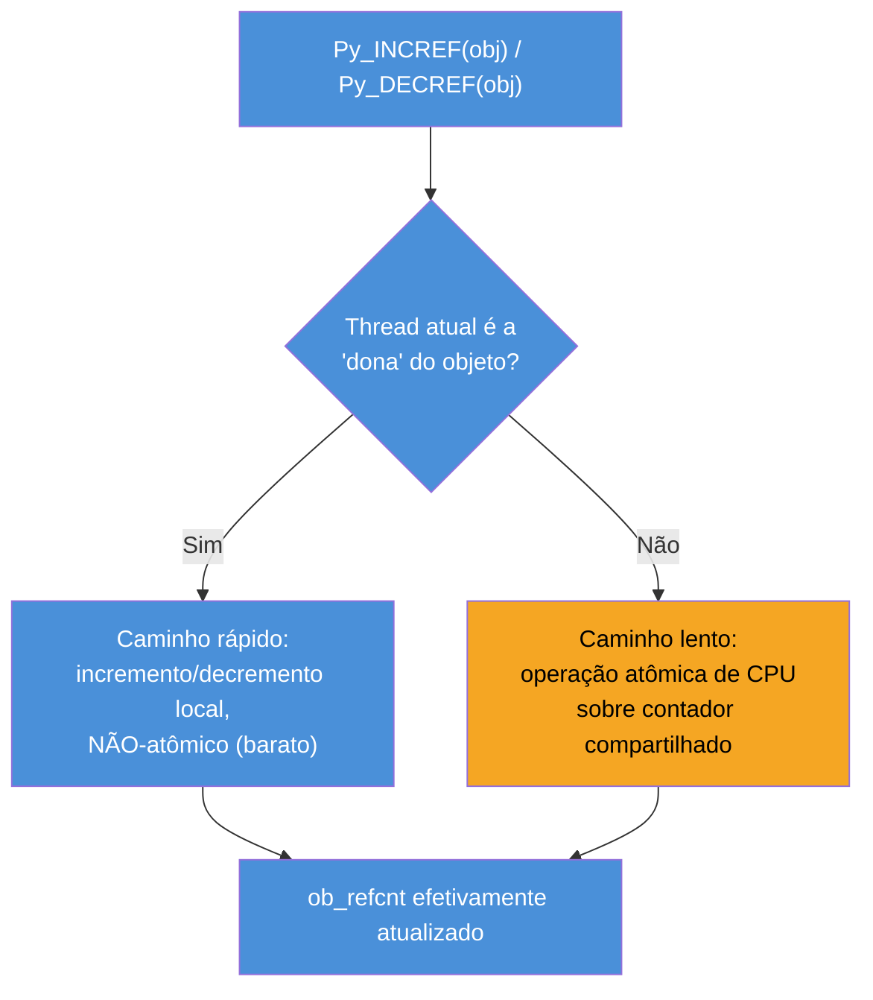

# Free-threading — o GIL opcional (PEP 703)

> [!abstract] TL;DR
> **Free-threading** é um build alternativo do CPython — não uma flag de runtime no build padrão — que remove o GIL por completo e o substitui por um conjunto de mecanismos mais finos: **biased reference counting** (a maioria dos incrementos/decrementos de `ob_refcnt` acontece sem lock nenhum, assumindo que uma única thread "dona" mexe no objeto na maior parte do tempo), **objetos imortais** (refcount congelado para objetos muito compartilhados, como `None`/`True`/pequenos inteiros, eliminando o incremento/decremento para eles), e **locks por objeto** (na forma de *critical sections*) para as operações que de fato disputam o mesmo container mutável entre threads. A [PEP 703](https://peps.python.org/pep-0703/) (aprovada em 2023, liderada por Sam Gross, financiada pela Meta) trouxe esse build experimental no Python 3.13 (`--disable-gil`, sufixo `t` no executável); o Python 3.14 (out/2025) promoveu esse build a **oficialmente suportado** sob os critérios da [PEP 779](https://peps.python.org/pep-0779/) — mas ainda como variante **opt-in**, não o build padrão. O preço dessa liberdade é real e mensurado: código single-threaded roda hoje entre ~5% e ~15% mais lento no build free-threaded (um teto de 15% é critério formal da PEP 779; a fase experimental de 3.13 chegava a ~40%), e o consumo de memória sobe (teto formal de 20% a mais). O ecossistema de extensões C ainda está se adaptando — bibliotecas grandes como NumPy, SciPy, pandas e `cryptography` já têm wheels free-threaded; outras, como `psycopg`, ainda não. Para a maioria dos times, nada disso muda o dia a dia hoje: o build padrão com GIL continua sendo o que `pip install python` instala e o que a esmagadora maioria dos deploys usa — mas a mudança estrutural está em andamento e vale entender antes de ela bater à porta.

## O bug que abre esta nota

Um time decide experimentar o hype: "Python não tem mais GIL, finalmente". Instalam `python3.14t` (o sufixo `t` marca o build free-threaded), rodam o mesmo experimento CPU-bound da nota anterior — múltiplas threads fazendo aritmética pura em Python — e o resultado, dessa vez, é real: com 8 threads em 8 núcleos, o tempo total cai de fato para perto de 1/8 do sequencial. A euforia dura até alguém rodar o mesmo serviço em produção com uma dependência comum — digamos, uma extensão C de parsing que ninguém no time escreveu e que não foi atualizada para free-threading. Ao importar essa extensão, o interpretador imprime um aviso (`RuntimeWarning`) e **reativa o GIL silenciosamente para o processo inteiro** — o "paralelismo real" que o time acabou de medir desaparece, porque uma única dependência transitiva, incompatível, derruba a garantia para todo o programa. Pior: se ninguém notar o aviso nos logs, o time passa a acreditar que está rodando sem GIL quando, na prática, voltou a ter um GIL comum — só que agora pagando o custo extra de memória e de single-thread do build free-threaded, sem nenhum dos benefícios.

Esse é o estado real do free-threading hoje: não é "ligar uma flag e ganhar paralelismo", é uma mudança de arquitetura do interpretador com trade-offs explícitos, um ecossistema de dependências em transição, e armadilhas que só aparecem quando você entende o mecanismo por baixo — exatamente o que esta nota cobre.

> [!info] Pré-requisito
> Esta nota assume [[04 - O GIL — o que é de verdade e por que existe|04]] (por que o GIL existe: proteger `ob_refcnt` contra corrida entre threads) e [[05 - GIL e concorrência na prática — threading vs multiprocessing|05]] (o que `threading`/`multiprocessing` entregam hoje, no build padrão). A nota 04 já mencionou o free-threading de passagem, incluindo biased reference counting e o cronograma de fases da PEP 779 — esta nota constrói em cima disso e não repete a introdução: aqui o assunto é o mecanismo interno completo, o custo real medido, e o estado honesto do ecossistema.

## O que é

**Free-threading** é o nome que o projeto CPython usa para um build do interpretador **sem o GIL** — não uma opção de runtime dentro do build normal, mas um binário compilado de forma diferente, identificável de várias formas:

```bash
# O sufixo "t" no nome do executável marca o build free-threaded
python3.13t --version
python3.14t --version

# Em runtime, dentro do processo:
python3.14t -c "import sys; print(sys.version)"
# ... contém "free-threading build" na string de versão

python3.14t -c "import sys; print(sys._is_gil_enabled())"
# False — a menos que uma extensão incompatível tenha reativado o GIL

python3.14t -c "import sysconfig; print(sysconfig.get_config_var('Py_GIL_DISABLED'))"
# 1 — confirma que o binário foi compilado com suporte a free-threading
```

Desde o Python 3.13, os instaladores oficiais para macOS e Windows já oferecem o build free-threaded como opção adicional (não a padrão); via código-fonte, o flag de configuração é `--disable-gil`. É possível, inclusive, **reativar o GIL em runtime** dentro de um build free-threaded — útil justamente para isolar o efeito de uma extensão problemática ou para comparação de desempenho:

```bash
PYTHON_GIL=1 python3.14t meu_script.py   # força o GIL ligado, mesmo em build free-threaded
python3.14t -X gil meu_script.py         # equivalente via flag de linha de comando
```

> [!question]- Por que não é só uma flag no build normal, tipo `--no-gil` no `python` de sempre?
> Porque a mudança não é "remover uma linha de código que trava um mutex" — é substituir, em todo o código-fonte do CPython, cada ponto que hoje assume implicitamente "só uma thread está tocando isso por vez" (protegido de graça pelo GIL) por um mecanismo explícito de sincronização mais fino (lock por objeto, contagem de referência com caminhos separados para thread dona/threads visitantes, objetos imortais). Isso muda o layout de memória dos objetos, o alocador usado (`mimalloc` em vez de `pymalloc`, mais sobre isso na nota [[07 - Memory management — allocators, pymalloc e arenas|07]]), e o comportamento de baixo nível de estruturas centrais como `dict`/`list`/`set`. É estrutural o suficiente para justificar ABI e ciclo de build próprios, não uma flag de runtime — ainda que, uma vez compilado o build free-threaded, seja possível ligar/desligar o GIL dentro dele, como mostrado acima.

**Free-threading em uma frase:** um build alternativo do CPython, identificável pelo sufixo `t` e por `sys._is_gil_enabled()`, que remove o GIL e o substitui por mecanismos de sincronização mais finos — não uma flag do interpretador padrão.

## Por que importa: o que precisa ser verdade para o GIL sumir

A nota 04 estabeleceu o problema que o GIL resolve: `ob_refcnt++`/`--` não são operações atômicas em C, e sem coordenação entre threads isso produz *lost updates* — contadores de referência corrompidos, que levam a *use-after-free* ou vazamento de memória. Remover o GIL sem quebrar essa garantia exige resolver o mesmo problema com granularidade muito mais fina, sem reintroduzir os dois problemas que motivaram a escolha original de 1990 (custo de lock por objeto em código single-threaded, risco de deadlock entre locks aninhados). A PEP 703 resolve isso com **quatro mecanismos combinados**, cada um atacando uma fatia diferente do problema.

### 1. Biased Reference Counting (BRC): o caminho rápido para o caso comum

A observação central, documentada na própria PEP 703 e no trabalho original de Sam Gross: **a maioria dos objetos, mesmo em programas multi-thread, é tocada por uma única thread na maior parte do tempo**. Um objeto criado dentro de uma função, usado ali e descartado, nunca cruza fronteira de thread nenhuma. BRC explora essa observação dando a cada objeto um "dono": a thread que criou o objeto (ou a última a assumi-lo) faz `Py_INCREF`/`Py_DECREF` usando um **contador local, não-atômico** — exatamente tão barato quanto no build com GIL. Só quando uma **thread diferente** da dona precisa mexer na contagem de referências desse mesmo objeto é que o caminho lento entra em ação: um contador separado, atualizado com operações **atômicas de CPU** (instruções de hardware como `lock xadd` em x86, mais caras que um incremento comum, mas ainainda muito mais baratas que adquirir um mutex do sistema operacional).



O ganho de BRC é que o custo por operação, no caso dominante (thread dona, sem disputa), fica perto do custo em um build com GIL — mas sem exigir um lock global para todos os objetos do processo. O custo aparece só quando threads de fato compartilham um objeto ativamente, que é exatamente o cenário em que algum overhead de sincronização é inevitável de qualquer forma.

### 2. Objetos imortais: eliminar o incremento/decremento por completo

Alguns objetos são referenciados por praticamente **todo** o programa, o tempo inteiro — `None`, `True`, `False`, pequenos inteiros já vistos na nota [[02 - Objetos em CPython — PyObject, refcounting e tipos internos|02]] (o *small int cache*, -5 a 256), e strings internadas via `sys.intern()`. Para esses objetos, mesmo BRC ainda implicaria um volume enorme de operações de contagem — só que sobre um conjunto pequeno e previsível de objetos que, na prática, **nunca são de fato desalocados** enquanto o processo roda. A solução do free-threading (e que também foi parcialmente adotada no build com GIL a partir do Python 3.12, para `None`/`True`/`False`) é marcar esses objetos como **imortais**: um valor de refcount especial e reservado (efetivamente "infinito", nunca decrementado abaixo dele) que faz `Py_INCREF`/`Py_DECREF` virarem **no-ops** — nem sequer tocam o caminho rápido de BRC, simplesmente não fazem nada. No build free-threaded, o conjunto de tipos imortais é mais amplo (código-fonte constante — literais numéricos, de string, de tupla — além dos casos já citados).

> [!question]- Isso não quebra `sys.getrefcount()` ou lógica que dependa do valor exato do refcount?
> Sim, é uma quebra de compatibilidade real e documentada: código que inspeciona `sys.getrefcount()` esperando um número "normal" para `None` ou para um pequeno inteiro vê, em vez disso, um valor sentinela enorme (a marca de imortalidade). Esse é um dos pontos que o [guia oficial de free-threading](https://docs.python.org/3/howto/free-threading-python.html) lista como comportamento que código existente pode precisar ajustar — não é um bug, é uma consequência direta e esperada de tornar a contagem de referência um no-op para esses objetos.

### 3. Contagem de referência diferida e por thread: reduzir disputa sem eliminar o refcounting

Para objetos que **não** são imortais, mas que ainda assim são tocados por múltiplas threads com frequência alta — objetos de módulo, funções de nível de módulo, métodos definidos em classe, objetos `threading.local` — o free-threading usa uma terceira técnica: **contagem de referência diferida** (*deferred reference counting*). Referências vindas da pilha de execução (variáveis locais, por exemplo) simplesmente não incrementam o contador desses objetos; em vez disso, o **Garbage Collector geracional** (nota [[03 - Reference counting e o Garbage Collector geracional|03]]) assume a responsabilidade de encontrar e finalizar esses objetos quando eles de fato morrem, em vez do reference counting imediato fazer isso sozinho. Um mecanismo relacionado — **contagem de referência por thread** — dá a cada thread seu próprio contador parcial para certos objetos de alto tráfego (tipos definidos em Python, objetos de código, `__dict__` de módulo), evitando que todas as threads fiquem competindo pelo mesmo contador atômico; o valor final só é consolidado quando necessário (`gc.collect()` força essa consolidação).

O efeito prático dessas duas técnicas é que objetos que "vivem no meio do caminho" — nem tão isolados quanto o caso comum de BRC, nem tão universalmente compartilhados quanto objetos imortais — ainda ganham um caminho mais barato do que "todo mundo disputando o mesmo contador atômico o tempo inteiro", à custa de esses objetos viverem um pouco mais depois de sua última referência sumir (até o GC rodar e consolidar) — um trade-off de latência de coleta em troca de menos contenção.

### 4. Locks por objeto (*critical sections*): protegendo containers mutáveis

BRC e objetos imortais resolvem a contagem de referência — mas `dict`, `list` e `set` ainda precisam de proteção quando duas threads tentam **mutar a mesma estrutura ao mesmo tempo** (inserir numa lista, remover de um dicionário). Aqui entra o quarto mecanismo: cada objeto mutável carrega um **lock leve embutido** (não um mutex pesado do sistema operacional por objeto — isso reintroduziria o problema de custo de memória que matou a ideia nos anos 90 —, mas uma estrutura de bits compacta dentro do próprio cabeçalho do objeto). O CPython usa internamente macros chamadas **critical sections** (`Py_BEGIN_CRITICAL_SECTION`/`Py_END_CRITICAL_SECTION`) para envolver qualquer trecho de código que precise dessa exclusão mútua fina — o equivalente, em espírito, ao que `Py_BEGIN_ALLOW_THREADS` fazia para I/O bloqueante no build com GIL (nota 04), só que na direção oposta: aqui a seção crítica *adquire* proteção local em vez de liberar uma global.

Duas propriedades tornam esse mecanismo viável sem reintroduzir deadlock:

1. **Suspensão automática em chamadas que podem bloquear.** Se, dentro de uma critical section sobre o objeto A, o interpretador precisa entrar em outra critical section sobre o objeto B (por exemplo, uma operação que toca dois containers), o mecanismo é projetado para suspender a seção sobre A automaticamente em vez de tentar segurar os dois locks simultaneamente em ordens potencialmente conflitantes entre threads — o mesmo risco de deadlock por ordenação de locks aninhados que preocupava os mantenedores do CPython nos anos 90, resolvido aqui por um protocolo de suspensão/retomada em vez de "nunca ter mais de um lock por vez" (a saída do GIL original).
2. **Granularidade de container, não de elemento.** O lock protege operações sobre a estrutura do container (inserir, remover, redimensionar), não cada elemento individualmente — coerente com o nível em que corrupção de estado interno realmente pode acontecer.

> [!warning] Locks por objeto não tornam seu código de aplicação automaticamente thread-safe
> Da mesma forma que a nota 04 alertou que o GIL não protege `contador += 1` contra corrida (porque essa expressão é várias instruções de bytecode, não uma), o mecanismo de *critical sections* do free-threading protege a **integridade interna** de `dict`/`list`/`set` (a estrutura não corrompe), mas não garante nada sobre **sequências de operações de negócio** sobre esses containers. `if chave not in dict: dict[chave] = valor` continua sendo uma condição de corrida clássica *check-then-act* em qualquer build, com ou sem GIL, com ou sem locks por objeto — porque são duas operações separadas, e outra thread pode intercalar entre elas. O [guia oficial de free-threading](https://docs.python.org/3/howto/free-threading-python.html) é explícito sobre isso: use `threading.Lock` para invariantes de aplicação, não confie nos locks internos dos tipos embutidos para isso.

**Os quatro mecanismos em uma frase:** BRC torna o caso comum (thread dona, sem disputa) quase tão barato quanto antes; objetos imortais eliminam a contagem por completo para o punhado de objetos universalmente compartilhados; contagem diferida/por thread reduz disputa para o meio-termo; e locks por objeto (critical sections) substituem o GIL só onde containers mutáveis realmente precisam de exclusão mútua — cada peça ataca uma fatia diferente do problema que, no build com GIL, era resolvido de uma vez só por um único lock global.

## O preço: por que single-thread fica mais lento

Nenhum desses quatro mecanismos é de graça — e o alvo do trade-off, dessa vez, é justamente o caso que o GIL original protegia de custo nenhum: **código que não usa múltiplas threads**. As fontes técnicas e o próprio critério formal da PEP 779 quantificam esse custo:

| Fase | Overhead single-thread medido | Fonte |
|---|---|---|
| Python 3.13 (build experimental, fase I da PEP 779) | Chegava a ~40% em benchmarks iniciais | relatos da comunidade e da própria equipe de free-threading |
| Python 3.14 (oficialmente suportado, fase II) | Entre ~5% (macOS aarch64) e ~8-15% (x86-64 Linux) no conjunto `pyperformance` | [guia oficial de free-threading](https://docs.python.org/3/howto/free-threading-python.html), [PEP 779](https://peps.python.org/pep-0779/) |
| Teto formal exigido pela PEP 779 para fase II | 15% (critério de aceitação, não meta aspiracional) | [PEP 779](https://peps.python.org/pep-0779/) |

As causas concretas desse custo, somadas:

- **Verificações de propriedade e imortalidade** que precisam acontecer em todo `Py_INCREF`/`Py_DECREF`, mesmo no caminho rápido de BRC — é mais barato que um lock, mas não é grátis comparado a um incremento puro e simples sem GIL nenhum ao redor.
- **Cabeçalho de objeto maior.** Objetos que não participam do Garbage Collector no build padrão ganham campos extras no build free-threaded (o guia oficial cita `None` passando de 16 para 32 bytes) — mais memória por objeto, e mais dados para tocar em cada acesso.
- **Alocador diferente.** O build free-threaded usa `mimalloc` em vez do `pymalloc` tradicional do CPython (aprofundado na nota [[07 - Memory management — allocators, pymalloc e arenas|07]]), porque `pymalloc` não foi desenhado para concorrência fina entre threads; `mimalloc` é thread-safe por padrão, mas com um perfil de desempenho e memória diferente.
- **Atraso de liberação por QSBR** (*quiescent state-based reclamation*) — o mecanismo que garante que memória de estruturas sem lock não seja liberada enquanto alguma thread ainda pode estar lendo — posterga a liberação de memória até um ponto seguro, o que aumenta o pico de uso de memória (teto formal de +20% na PEP 779) até que `gc.collect()` force a consolidação.

> [!question]- Se o custo é real mesmo para quem nunca usa `threading`, por que a comunidade Python aceita isso?
> Porque a alternativa — manter o GIL para sempre — significa que Python nunca vai oferecer paralelismo real de CPU dentro de um único processo, um limite que já levou parte do ecossistema de alta performance (ML, simulação científica) a depender cada vez mais de contornar o GIL via `multiprocessing`, extensões C que liberam o lock, ou reescrever partes críticas em Rust/C++ — soluções que funcionam, mas que têm custo de complexidade e serialização (nota [[05 - GIL e concorrência na prática — threading vs multiprocessing|05]]). O apostador da PEP 703 é que um custo de 5-15% em single-thread, decrescente a cada versão à medida que o mecanismo amadurece, é aceitável em troca de paralelismo real quando o programa precisar dele — mas essa é uma aposta que a comunidade só valida progressivamente: por isso a PEP 779 amarra a promoção de fase a critérios mensuráveis (teto de overhead, teto de memória, estabilidade de API) em vez de uma data fixa.

## O estado real do ecossistema em 2026

Esta é a seção que separa entusiasmo de manchete de decisão de engenharia informada. Três fatos, verificados nas fontes oficiais e na documentação de rastreamento da comunidade:

### Onde o suporte já existe

Bibliotecas com uso pesado e crítico de extensões C — as que mais se beneficiariam de paralelismo real de CPU — receberam atenção dedicada de um esforço coordenado pela **Quansight Labs** (financiado, em parte, pela mesma Meta que financia o trabalho central da PEP 703): **NumPy**, **SciPy**, **pandas**, **cryptography** e **FastAPI** já publicam wheels pré-compiladas para o build free-threaded. Isso não significa "tudo funciona igual": o próprio time do NumPy decidiu, deliberadamente, **não** adicionar locks internos ao objeto `ndarray` — mutação concorrente e não sincronizada de um mesmo array `numpy` entre threads continua sendo responsabilidade do código de aplicação, exatamente a mesma fronteira que já existia no build com GIL para além do bytecode Python puro.

### Onde o suporte ainda falta

Nem toda extensão C amplamente usada já migrou. Um exemplo concreto e documentado: o driver **`psycopg`** (PostgreSQL) mantém, publicamente, uma issue aberta rastreando o trabalho de suporte a free-threading — ou seja, à data desta nota, **não** oferece suporte oficial ao build sem GIL. Esse não é um caso isolado: qualquer extensão C que dependa de assumir implicitamente "só uma thread por vez toca este estado" (a garantia que o GIL dava de graça) precisa ser auditada e, em muitos casos, reescrita para usar sincronização explícita antes de declarar compatibilidade formal com free-threading.

### O que acontece quando uma dependência não migrou

Este é o mecanismo de segurança que evita corrupção silenciosa de memória, e também a fonte da armadilha descrita na abertura desta nota: uma extensão C que **não** declara explicitamente compatibilidade com free-threading (via um slot específico do C-API, `Py_mod_gil`) faz o interpretador **reativar o GIL para o processo inteiro** no momento da importação, emitindo um aviso (`RuntimeWarning`). O comportamento é conservador por design — o CPython prefere degradar de volta para o modelo conhecido e seguro (GIL) a arriscar corrupção de memória com uma extensão que não garantiu thread-safety — mas o efeito colateral prático é que **uma única dependência** desatualizada apaga o benefício de paralelismo que todo o resto do programa esperava ter, silenciosamente, a menos que alguém preste atenção ao aviso nos logs.

> [!warning] "Meu build é free-threaded" não é o mesmo que "meu processo está rodando sem GIL agora"
> **O que acontece:** time verifica que instalou `python3.14t`, assume que o GIL está desligado durante toda a execução, e planeja capacidade/paralelismo de CPU com base nisso. **Por quê:** qualquer import, em qualquer ponto do processo, de uma extensão C que não declare compatibilidade com free-threading reativa o GIL globalmente — não por módulo, para o processo inteiro. Isso pode acontecer numa dependência transitiva, três camadas abaixo do código que o time escreveu, sem nenhuma mudança visível no comportamento funcional do programa (só desempenho). **Como evitar:** checar `sys._is_gil_enabled()` em runtime, não só no momento de instalar o interpretador; consultar o [tracker de compatibilidade da comunidade](https://py-free-threading.github.io/tracking/) para toda extensão C na árvore de dependências antes de depender de paralelismo real em produção; tratar avisos de reativação do GIL nos logs como um sinal de build, não como ruído.

Para acompanhar o estado exato de uma dependência específica, a fonte canônica e viva é o [Python Free-Threading Guide](https://py-free-threading.github.io/) — mantido pela comunidade e atualizado continuamente, ao contrário de qualquer lista estática (inclusive esta nota, que registra o estado observado em julho de 2026, não uma garantia permanente).

## Na prática

### Cenário 1: confirmando que o GIL está de fato desligado

Antes de medir qualquer coisa, o primeiro passo é confirmar o estado real do processo — não confiar só no nome do binário instalado, exatamente pela armadilha descrita acima (uma dependência pode ter reativado o GIL silenciosamente):

```python
import sys
import sysconfig

print("Build free-threaded:", bool(sysconfig.get_config_var("Py_GIL_DISABLED")))
print("GIL ativo agora:", not sys._is_gil_enabled())
# Se a segunda linha imprimir "GIL ativo agora: False" mesmo num build
# free-threaded, alguma extensão importada no processo o reativou.
```

Rodar essa checagem logo na inicialização do processo (e, idealmente, logar o resultado) é a forma mais barata de detectar a armadilha da abertura desta nota antes que ela vire uma investigação de performance em produção.

### Cenário 2: o mesmo experimento CPU-bound da nota 04, agora com paralelismo real

Repetindo o experimento que, no build com GIL, mostrava tempo igual ou pior com múltiplas threads (nota 04), mas agora no build free-threaded:

```python
import threading
import time

def trabalho_cpu(n):
    """CPU-bound puro — sem nenhuma extensão C envolvida."""
    total = 0
    for i in range(n):
        total += i * i
    return total

N = 20_000_000

inicio = time.perf_counter()
trabalho_cpu(N)
trabalho_cpu(N)
print(f"Sequencial: {time.perf_counter() - inicio:.2f}s")

inicio = time.perf_counter()
t1 = threading.Thread(target=trabalho_cpu, args=(N,))
t2 = threading.Thread(target=trabalho_cpu, args=(N,))
t1.start(); t2.start()
t1.join(); t2.join()
print(f"Duas threads: {time.perf_counter() - inicio:.2f}s")

# python3.14  (build com GIL):      Sequencial ~2.1s | Duas threads ~2.3s  (sem ganho)
# python3.14t (build free-threaded): Sequencial ~2.3s | Duas threads ~1.3s  (ganho real,
#   mas sequencial já mais lento que no build com GIL — o overhead de single-thread
#   discutido na seção anterior aparece mesmo neste experimento isolado)
```

O contraste entre os dois builds, rodando exatamente o mesmo código, é a demonstração mais direta do trade-off desta nota: o build free-threaded entrega o paralelismo que o desenvolvedor da abertura da nota 04 esperava de `threading` — mas paga por isso com um piso sequencial mais alto, mesmo antes de qualquer thread extra entrar em cena.

### Cenário 3: checando compatibilidade de uma dependência antes de adotar free-threading

Antes de migrar um serviço, o passo prático é auditar a árvore de dependências — não confiar em "deve funcionar":

```bash
# Lista as dependências instaladas para conferir manualmente contra o tracker
pip list --format=freeze

# Ou, de forma mais direta: tentar importar cada extensão C crítica
# num ambiente free-threaded isolado e checar se o GIL permanece desligado
python3.14t -c "
import sys
import minha_extensao_c_critica
print('GIL após import:', not sys._is_gil_enabled())
"
```

Cruzar essa lista com o [tracker de compatibilidade da comunidade](https://py-free-threading.github.io/tracking/) antes de qualquer decisão de adoção evita a surpresa descrita na seção anterior — descobrir em produção, via um aviso perdido nos logs, que uma dependência de terceira camada reativou o GIL para o processo inteiro.

## O que muda para quem não compila Python do zero

A pergunta prática, para a maioria absoluta dos times: **isso muda alguma coisa no meu dia a dia hoje?** A resposta honesta é, na maior parte dos casos, não — ainda:

- O `python` que `apt install`/`brew install`/o instalador oficial colocam no PATH por padrão continua sendo o build **com GIL**, e vai continuar sendo por vários anos — a PEP 779 é explícita que a promoção para "GIL desligado por padrão" (fase III) depende de critérios de adoção da comunidade, não de uma data fixa, e as estimativas informais dos próprios mantenedores apontam para 2027-2028 na melhor das hipóteses.
- Adotar o build free-threaded hoje é uma decisão deliberada e opt-in — trocar `python3.14` por `python3.14t` (ou compilar com `--disable-gil`), auditar todas as extensões C da árvore de dependências contra o tracker da comunidade, e aceitar o custo de single-thread e memória em troca de paralelismo real para as partes do programa que de fato usam múltiplas threads em trabalho CPU-bound.
- O que **vale a pena saber**, mesmo sem adotar nada agora: se sua stack depende de extensões C de nicho (drivers de banco de dados menos populares, bindings científicos especializados), vale acompanhar se e quando cada uma ganha suporte — porque, quando a fase III chegar, essas mesmas extensões vão precisar estar prontas para não quebrar silenciosamente builds futuros.
- Ferramentas de gestão de versão do Python mais recentes (`uv`, `pyenv`) já oferecem instalação direta dos builds `3.13t`/`3.14t` lado a lado com os builds padrão, o que reduz o atrito de experimentar sem comprometer o ambiente principal — uma forma de baixo risco de testar hoje se a sua carga de trabalho específica (CPU-bound, múltiplas threads, extensões já compatíveis) se beneficiaria.

**O estado atual em uma frase:** free-threading é real, oficialmente suportado desde o Python 3.14, e resolve um problema estrutural genuíno — mas continua sendo, em 2026, uma escolha deliberada e auditada, não o comportamento padrão que a maioria dos times vai encontrar sem procurar por ele.

## Armadilhas comuns

> [!warning] Achar que "sem GIL" significa "não preciso mais de `threading.Lock`"
> **O que acontece:** desenvolvedor remove sincronização explícita de código de aplicação ao migrar para o build free-threaded, assumindo que os locks internos por objeto (critical sections) cobrem qualquer necessidade de exclusão mútua. **Por quê:** os locks internos protegem a integridade estrutural de `dict`/`list`/`set` contra corrupção — não protegem invariantes de negócio que abrangem múltiplas operações (`check-then-act`, `read-modify-write` sobre múltiplos objetos). Essa é exatamente a mesma armadilha que já existia com o GIL (nota 04), só que reaparece disfarçada de "problema resolvido" porque o nome do mecanismo mudou. **Como evitar:** tratar o free-threading como uma mudança na *causa* de corrupção de memória interna do interpretador (resolvida), não como uma mudança nas regras de concorrência de aplicação (inalteradas) — `threading.Lock`/`Condition`/`Semaphore` continuam necessários para os mesmos casos de sempre.

> [!warning] Medir "ganho do free-threading" sem verificar se alguma dependência reativou o GIL
> **O que acontece:** benchmark de paralelismo roda em produção com resultado decepcionante ("não ganhamos nada com free-threading"), e o time conclui que o mecanismo "não funciona" ou "não vale o esforço". **Por quê:** basta uma extensão C incompatível em qualquer ponto da árvore de dependências para reativar o GIL globalmente, silenciosamente, fazendo o processo inteiro voltar a se comportar como o build padrão — só que pagando o overhead de memória e single-thread do build free-threaded, sem nenhum dos benefícios. **Como evitar:** checar `sys._is_gil_enabled()` explicitamente antes e durante o benchmark, não assumir com base só no nome do binário instalado.

> [!warning] Adotar o build free-threaded em produção só porque "é o futuro"
> **O que acontece:** time migra um serviço em produção para `python3.14t` sem que o serviço tenha, de fato, uma carga CPU-bound multi-thread que se beneficiaria — e sem auditar a compatibilidade de todas as dependências C. **Por quê:** para serviços I/O-bound (a maioria dos backends web, cobertos na nota 05), o GIL já não era o gargalo — o build free-threaded, nesse caso, só adiciona overhead de single-thread e risco de comportamento inesperado de extensões não auditadas, sem trazer nenhum benefício de paralelismo que o serviço pudesse aproveitar. **Como evitar:** adotar free-threading apenas quando houver uma carga CPU-bound real e multi-thread identificada, com todas as dependências C auditadas contra o tracker de compatibilidade — a mesma disciplina de "meça antes de otimizar" que vale para qualquer decisão de performance.

## Em entrevista

Free-threading é um tema que sinaliza atualização — entrevistadores seniores costumam usá-lo para distinguir quem acompanha a evolução real do CPython de quem só decorou "o GIL existe e é ruim".

> "Free-threading is a separate build of CPython — not a runtime flag on the normal build — that removes the GIL entirely, introduced experimentally in Python 3.13 under PEP 703 and officially supported, though still opt-in, since Python 3.14 under PEP 779. Instead of one global lock protecting reference counting, it uses a few combined mechanisms: biased reference counting, where the owning thread updates a local, non-atomic counter and only cross-thread access falls back to atomic operations; immortal objects like `None` or small cached integers, where refcounting is skipped entirely; deferred and per-thread reference counting for medium-traffic objects to reduce contention; and lightweight per-object locks, called critical sections, that protect mutable containers like dict and list during structural changes. The trade-off is explicit and measured: single-threaded code runs somewhere between 5 and 15 percent slower on the free-threaded build — PEP 779 sets a hard 15 percent ceiling as an acceptance criterion — and memory usage goes up, partly because of a bigger object header and partly because of deferred memory reclamation. The C extension ecosystem is still catching up — NumPy, SciPy, pandas and cryptography already ship free-threaded wheels, but plenty of extensions haven't been ported yet, and importing one that hasn't silently re-enables the GIL process-wide with a warning. For most teams today, this changes nothing yet: the default installer still ships the GIL-enabled build, and adopting free-threading is a deliberate, audited choice for workloads that are genuinely CPU-bound and multi-threaded — not something that happens by accident."

Uma pergunta de acompanhamento frequente: **"você adotaria free-threading hoje, em produção?"** — a resposta sênior nomeia o critério de decisão em vez de dar um "sim" ou "não" categórico: depende de a carga ser CPU-bound e multi-thread de verdade (não I/O-bound, que já é bem servido por `asyncio`/`threading` no build com GIL), e de todas as extensões C na árvore de dependências estarem auditadas contra o [tracker de compatibilidade da comunidade](https://py-free-threading.github.io/tracking/) — sem essas duas condições, o custo de single-thread e memória do build free-threaded não compra nenhum benefício real.

> [!question]- O entrevistador pergunta como o free-threading se compara ao `multiprocessing` como saída para CPU-bound
> `multiprocessing` (nota [[05 - GIL e concorrência na prática — threading vs multiprocessing|05]]) já resolve CPU-bound hoje, no build padrão, com GIL — processos separados, cada um com seu interpretador e seu próprio GIL, paralelismo real entre eles — ao custo de serialização de dados entre processos (`pickle` na maioria dos casos) e maior overhead de criação/comunicação. Free-threading ataca o mesmo problema por um caminho diferente: paralelismo real **dentro de um único processo**, com memória compartilhada de verdade entre threads (sem custo de serialização), ao custo de reescrever a garantia de segurança de memória que o GIL dava de graça. Para cargas onde o custo de serialização entre processos já é aceitável e a maturidade do ecossistema é uma preocupação maior que paralelismo dentro do processo, `multiprocessing` continua sendo a escolha mais segura em 2026; para cargas que precisam compartilhar estruturas de dados grandes entre threads sem pagar serialização, e que podem esperar a maturidade do ecossistema de extensões, free-threading é a aposta de médio prazo.

## Como explicar em inglês

| PT | EN |
|----|----|
| build sem GIL / de threads livres | free-threaded build |
| contagem de referência enviesada | biased reference counting |
| objeto imortal | immortal object |
| contagem de referência diferida | deferred reference counting |
| seção crítica (lock por objeto) | critical section |
| reativar o GIL (silenciosamente) | re-enable the GIL (silently) |
| build oficialmente suportado | officially supported build |
| opcional / opt-in | opt-in |
| ecossistema de extensões C | C extension ecosystem |
| custo de single-thread | single-threaded overhead |

## O que vem a seguir

Free-threading muda o mecanismo que protege a memória entre threads, mas não muda o alocador que entrega essa memória em primeiro lugar — e o build free-threaded, como visto acima, já usa um alocador diferente (`mimalloc`) do `pymalloc` tradicional. A próxima nota do galho fecha esse fio, olhando para como o CPython gerencia memória por baixo dos dois builds:

- [[07 - Memory management — allocators, pymalloc e arenas|07 — Memory management: allocators, pymalloc e arenas]] — por que objetos pequenos são baratos de alocar em Python, a hierarquia arena/pool/block do `pymalloc`, e o contraste com `mimalloc` no build free-threaded introduzido nesta nota.
- [[05 - GIL e concorrência na prática — threading vs multiprocessing|05 — GIL e concorrência na prática: threading vs multiprocessing]] — pré-requisito direto: as duas saídas que já funcionam hoje, no build padrão, para o mesmo problema de CPU-bound que o free-threading ataca de um ângulo diferente.
- [[04 - O GIL — o que é de verdade e por que existe|04 — O GIL: o que é de verdade e por que existe]] — o problema original (proteção de `ob_refcnt`) que os quatro mecanismos desta nota resolvem com granularidade mais fina.
- [[03-Dominios/Tecnologia/Python/Concorrência e paralelismo/index|Concorrência e paralelismo (Galho 7)]] — aplica o entendimento do GIL/free-threading a padrões de produção com `threading`/`multiprocessing`/`asyncio`.

## Fontes

- [PEP 703 — Making the Global Interpreter Lock Optional in CPython](https://peps.python.org/pep-0703/): especificação completa dos quatro mecanismos (biased reference counting, objetos imortais, contagem diferida/por thread, critical sections), motivação e plano de rollout faseado.
- [PEP 779 — Criteria for supported status for free-threaded Python](https://peps.python.org/pep-0779/): critérios formais das fases I/II/III, teto de 15% de overhead single-thread e 20% de memória para fase II, ausência de data fixa para fase III (default).
- Python Software Foundation. [*Python support for free threading*](https://docs.python.org/3/howto/free-threading-python.html) — docs.python.org, versão 3.14 (acessado em 2026-07-10): guia oficial com `sys._is_gil_enabled()`, `PYTHON_GIL`/`-X gil`, objetos imortais, critical sections, mimalloc, limitações conhecidas (frame objects, iteradores) e números de overhead por plataforma.
- [Python Free-Threading Guide — Compatibility Status Tracking](https://py-free-threading.github.io/tracking/) (acessado em 2026-07-10): rastreamento vivo, mantido pela comunidade, do estado de suporte de bibliotecas com extensões C.
- Quansight Labs. [*Halfway on the path to community support for free-threaded Python*](https://labs.quansight.org/blog/free-threaded-python-halfway) e [*The first year of free-threaded Python*](https://labs.quansight.org/blog/free-threaded-one-year-recap) — relato do esforço coordenado de portar NumPy, SciPy, pandas e outras bibliotecas.
- psycopg. [Issue #1095 — Support free-threaded python](https://github.com/psycopg/psycopg/issues/1095) (acessado em 2026-07-10): exemplo concreto e verificável de extensão C amplamente usada ainda sem suporte oficial ao build free-threaded.
- Victor Stinner. [*Free Threading internals: reference counting*](https://vstinner.github.io/free-threading-reference-counting.html) — detalhamento técnico de biased reference counting por um core developer do CPython.
- [[04 - O GIL — o que é de verdade e por que existe|04 — O GIL: o que é de verdade e por que existe]] e [[05 - GIL e concorrência na prática — threading vs multiprocessing|05 — GIL e concorrência na prática]] — notas irmãs, pré-requisito direto desta nota.

Consultado em 2026-07-10.
