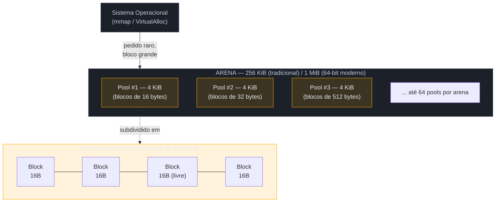
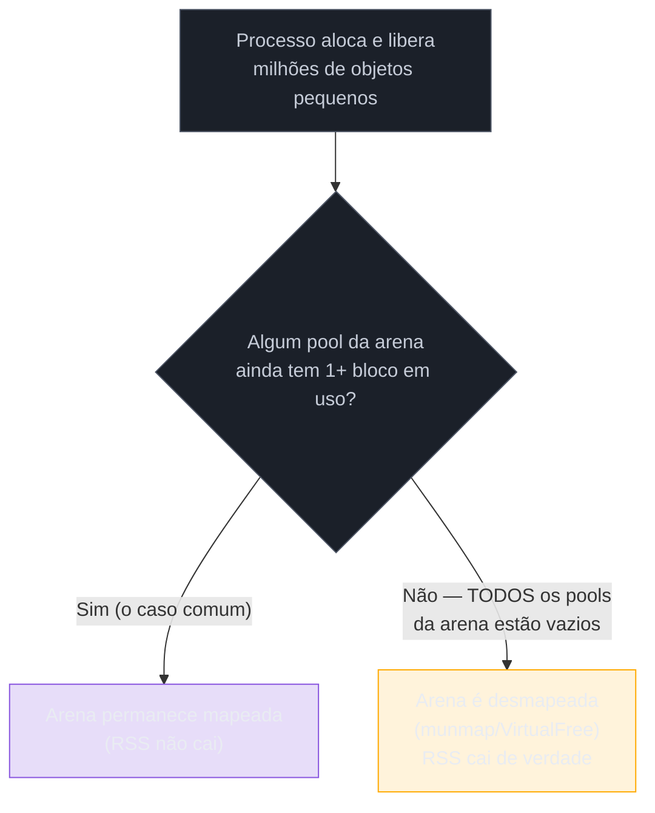

# Memory management — allocators, pymalloc e arenas

> [!abstract] TL;DR
> Quando um `PyObject` "é alocado", ele não vai direto pro `malloc()` do sistema operacional a cada `int()` ou `[]` que o código Python cria — isso seria caro demais para um padrão de uso que cria e destrói milhões de objetos pequenos por segundo. CPython resolve isso com o **pymalloc**: um alocador especializado, escrito em C, que fica **sobre** o `malloc()` do SO (não o substitui) e serve especificamente objetos de até 512 bytes. Pymalloc organiza memória em três camadas: **arenas** (blocos grandes — 256 KiB tradicionalmente, 1 MiB em builds 64-bit modernos — pedidos direto do SO via `mmap`/`VirtualAlloc`), **pools** (páginas de 4 KiB dentro de cada arena, cada pool dedicado a UM tamanho de bloco), e **blocks** (fatias de tamanho fixo dentro de um pool — 8, 16, 24... até 512 bytes, sempre múltiplos de 8). Essa estrutura transforma alocar/liberar um objeto pequeno numa operação O(1) — empilhar/desempilhar um bloco de uma lista ligada, sem nunca perguntar ao SO — e elimina fragmentação externa porque todo bloco de um pool tem exatamente o mesmo tamanho. O ponto contraintuitivo, e o que mais confunde quem debuga uso de memória em produção: uma **arena só é devolvida ao SO quando todos os seus 64 pools ficam 100% vazios simultaneamente** — o que é raro em processos de longa duração, mesmo depois de deletar milhões de objetos. É por isso que o RSS (memória residente) de um processo Python quase sempre só cresce, mesmo sem vazamento real de referências.

## O bug que abre esta nota

Um time de plataforma está investigando um alerta de memória num worker de processamento em lote: o RSS do processo cresce de 200 MB para 1.8 GB ao longo de um dia de execução contínua, e nunca cai — mesmo em horários de baixa carga, mesmo minutos depois do pico de processamento passar. A primeira suspeita, óbvia, é vazamento de memória: alguma referência sendo mantida viva sem querer, um `Py_INCREF` sem seu `Py_DECREF` correspondente, um cache que cresce sem limite.

```python
import gc
import tracemalloc

tracemalloc.start()

# ... processa 500 mil registros, gera e descarta
# milhões de objetos temporários (dicts de parsing, strings intermediárias) ...

gc.collect()  # força coleta — ciclos de referência limpos

snapshot = tracemalloc.take_snapshot()
top_stats = snapshot.statistics('lineno')
for stat in top_stats[:5]:
    print(stat)
# Resultado: nenhum objeto Python "vivo" de tamanho relevante.
# gc.collect() não encontra ciclos. sys.getrefcount() nos objetos
# suspeitos volta ao esperado. Nenhuma referência pendurada.
```

O time roda `gc.collect()`, confirma que não há ciclos de referência presos, confirma via `tracemalloc` que os objetos Python de fato foram desalocados — e o RSS continua em 1.8 GB. A conclusão errada mais comum aqui é "deve ser um vazamento em alguma extensão C" ou "o `gc` não está funcionando direito". A conclusão certa exige um nível de profundidade que as notas anteriores deste galho ainda não cobriram: [[03 - Reference counting e o Garbage Collector geracional|reference counting e GC]] decidem **quando um objeto Python morre** — mas não decidem **o que acontece com a memória física depois disso**. Entender por que o RSS não cai exige abrir mais uma camada: como o CPython pede memória ao sistema operacional em primeiro lugar, e por que ele raramente a devolve. É exatamente essa camada — o alocador **pymalloc** e sua hierarquia de arenas, pools e blocks — que esta nota dissseca.

> [!info] Pré-requisito
> Esta nota assume [[02 - Objetos em CPython — PyObject, refcounting e tipos internos|a nota 02]], que descreve o que é um `PyObject` e o custo de memória de "tudo é objeto" — mas foca em como esse objeto é **representado**, não em como sua memória é **fisicamente obtida**. Esta nota 07 é o complemento direto: de onde vem, no nível do sistema operacional, o espaço em que um `PyObject` vive.

## O que é

**pymalloc** é o alocador de memória especializado que o CPython usa internamente para objetos pequenos — definido em [`Objects/obmalloc.c`](https://github.com/python/cpython/blob/main/Objects/obmalloc.c) no código-fonte do interpretador. A palavra-chave é *especializado*: pymalloc **não substitui** o `malloc()` do sistema operacional — ele é construído **em cima** dele. Quando o CPython precisa de memória para um objeto pequeno, ele não vai ao kernel a cada alocação; pede blocos grandes de memória ao SO de vez em quando (via `mmap()` no Linux/macOS, `VirtualAlloc()` no Windows) e depois **subdivide** esses blocos internamente, servindo pedidos pequenos de dentro dessa reserva já obtida.

A regra de fronteira é simples e documentada: pymalloc trata alocações de **até 512 bytes**. Qualquer alocação maior que isso — uma lista grande, uma string longa, um buffer de arquivo, um array NumPy — passa direto para `PyMem_RawMalloc()`, que por sua vez chama o `malloc()` do sistema operacional sem a camada especializada no meio. Essa fronteira não é arbitrária: 512 bytes cobre a esmagadora maioria dos objetos que um programa Python típico cria e destrói em volume — pequenos `int`s, strings curtas, tuplas pequenas, frame objects, células de dicionário — exatamente o tipo de alocação que, se fosse ao SO uma por uma, dominaria o tempo de execução do programa só com overhead de gerenciamento de memória.

> [!question]- Por que não usar só o `malloc()` do SO pra tudo, já que ele já existe e funciona?
> Porque `malloc()` de propósito geral é otimizado para um padrão de uso diferente do de CPython. Ele precisa lidar bem com alocações de qualquer tamanho, qualquer padrão de vida, qualquer thread — e isso custa: cada chamada envolve, tipicamente, atravessar estruturas de metadados mais genéricas, e em builds multi-thread pode envolver sincronização. CPython tem um padrão de uso muito mais previsível e muito mais intenso: milhões de objetos pequenos, criados e destruídos em sequência rapidíssima (um loop que gera strings temporárias, um parser que cria milhares de dicts pequenos). Pymalloc explora esse padrão específico — tamanhos fixos, alta rotatividade — para servir essas alocações com uma estrutura de dados muito mais simples e muito mais rápida do que um `malloc()` genérico conseguiria, ao preço de só funcionar bem para esse caso de uso restrito (por isso a fronteira de 512 bytes, e por isso alocações grandes voltam pro `malloc()` genérico).

## Por que importa

### A hierarquia de três níveis

A ideia central de pymalloc é pedir memória ao SO em **blocos grandes e raros**, e depois fatiá-los internamente em pedaços pequenos e frequentes — três camadas de granularidade decrescente:



**1. Arenas** — o nível mais grosso, o único que de fato conversa com o sistema operacional. Uma arena é um bloco contíguo de memória obtido via `mmap()`/`VirtualAlloc()`. O tamanho histórico, desde a primeira versão do alocador (fusão em 2001), era **256 KiB** — valor que ainda aparece na maioria dos artigos e cursos sobre o tema, incluindo builds 32-bit atuais. Builds modernas de 64 bits, porém, usam **1 MiB por arena** (a documentação oficial atual do CPython confirma esse valor — ver Fontes), uma mudança motivada por objetos 64-bit serem estruturalmente maiores (mais ponteiros de 8 bytes em vez de 4) e por reduzir a frequência de chamadas de sistema para gerenciar arenas. Cada arena contém até 64 pools.

**2. Pools** — dentro de cada arena, a memória é dividida em pools de **4 KiB** (tipicamente o tamanho de uma página de memória virtual do sistema operacional — não coincidência, casa com a granularidade que o SO já gerencia nativamente). A regra que torna essa camada eficiente: **cada pool serve exatamente UM tamanho de bloco**. Um pool nunca mistura blocos de 16 bytes com blocos de 32 bytes — se um pool foi "batizado" para servir blocos de 32 bytes, todo espaço dele é fatiado em blocos de exatamente 32 bytes, do início ao fim.

**3. Blocks** — a unidade final, o que de fato é devolvido quando o código Python aloca um objeto pequeno. CPython define **64 classes de tamanho de bloco**, de 8 a 512 bytes, sempre em múltiplos de 8 bytes (8, 16, 24, 32... até 512). Quando o interpretador precisa de, digamos, 28 bytes para um objeto, pymalloc arredonda para cima até a classe de tamanho mais próxima (32 bytes, nesse caso) e serve um bloco dessa classe — o pequeno desperdício de arredondamento (*internal fragmentation*, tipicamente pequeno) é o preço que compra a simplicidade e velocidade do mecanismo.

> [!question]- Por que exatamente 512 bytes como teto, e não 256 ou 1024?
> A documentação oficial do CPython não justifica o número com uma fórmula — é um valor calibrado empiricamente ao longo de décadas de perfil de uso real de programas Python, refletindo o tamanho típico dos objetos mais comuns e mais numerosos (inteiros pequenos, strings curtas, tuplas pequenas, floats, frame objects). O valor já mudou historicamente (de 256 para 512 bytes, para acomodar melhor objetos maiores em builds 64-bit) e poderia mudar de novo — é um detalhe de implementação sintonizável, não uma garantia formal da linguagem, no mesmo espírito do small int cache descrito na nota 02.

### Por que essa estrutura torna a alocação O(1)

O ganho de performance não vem de "menos chamadas ao SO" isoladamente — vem de como cada pool é gerenciado internamente. Cada pool mantém uma **lista ligada de blocos livres** (*freelist*) dentro de si mesmo. Alocar um bloco de um pool que já tem espaço livre é, mecanicamente: pegar o primeiro nó da freelist, devolver seu endereço, avançar o ponteiro da freelist para o próximo nó. Desalocar é o inverso: colocar o bloco de volta no início da freelist. Nenhuma das duas operações percorre a lista, nenhuma busca por "onde cabe" — é O(1) genuíno, o mesmo custo não importa quantos objetos já existam no processo.

Isso resolve, de quebra, o problema clássico de **fragmentação externa** que aflige alocadores genéricos: fragmentação externa acontece quando blocos livres de tamanhos variados ficam espalhados pela memória, pequenos demais individualmente para servir um novo pedido maior, mesmo que a soma do espaço livre seja suficiente. Como cada pool serve **um único tamanho fixo** de bloco, esse problema simplesmente não existe dentro de um pool: todo espaço livre tem exatamente o tamanho que qualquer novo pedido daquela classe vai precisar, sempre. A fragmentação que sobra é só a *interna* (o arredondamento até a classe de tamanho mais próxima, discutido acima) — um custo pequeno e previsível, bem mais barato que o problema que ela evita.

> [!question]- E se um pool está "cheio" (todos os blocos ocupados) e chega mais um pedido daquele tamanho?
> Pymalloc simplesmente promove outro pool, dentro da mesma arena, pra servir aquele mesmo tamanho — cada arena tem até 64 pools, e um tamanho de bloco pode ter múltiplos pools ativos simultaneamente se a demanda justificar. Se a arena inteira estiver sem pools livres para promover, pymalloc pede **outra arena inteira** ao sistema operacional (mais um `mmap()`). É o mesmo padrão em cascata que se repete em cada nível: primeiro tenta usar o que já foi reservado; só volta pro nível de cima (e, no topo, pro próprio SO) quando o nível atual se esgota.

**A hierarquia em uma frase:** pymalloc pede memória ao SO raramente e em blocos grandes (arenas), fatia cada arena em páginas de tamanho único (pools), e serve pedidos pequenos de dentro dessas páginas com uma freelist O(1) — trocando uma alocação por objeto no SO por uma alocação de arena inteira amortizada sobre milhares de objetos.

## Como funciona

### `sys.getallocatedblocks()`: contando blocos, não bytes

A função `sys.getallocatedblocks()` devolve o número total de blocos de memória atualmente alocados pelo alocador de objetos do CPython — uma contagem, não um tamanho em bytes. É a ferramenta mais direta para observar o efeito da hierarquia arena/pool/block sem precisar instrumentar C:

```python
import sys

print(sys.getallocatedblocks())   # ex: 15234 (baseline do processo já rodando)

lista_temporaria = [str(i) for i in range(100_000)]
print(sys.getallocatedblocks())   # sobe consideravelmente — 100 mil strings novas

del lista_temporaria
print(sys.getallocatedblocks())   # cai de volta perto do baseline —
                                    # os OBJETOS foram desalocados (blocks devolvidos
                                    # às freelists de seus pools)
```

> [!warning] `getallocatedblocks()` caindo não significa que a memória do processo (RSS) caiu
> Este é o ponto central da nota, e vale repetir sem rodeio: quando `del lista_temporaria` roda, cada string tem seu `ob_refcnt` zerado, e cada bloco de 8-512 bytes que ela ocupava volta pra freelist do pool correspondente — por isso `sys.getallocatedblocks()` cai. Mas o pool em si, e a arena que o contém, **continuam alocados** — pymalloc só devolve memória ao SO quando uma arena inteira fica 100% vazia (todos os 64 pools sem um único bloco em uso). Medir só `getallocatedblocks()` mostra corretamente que os *objetos Python* sumiram; medir o RSS do processo (`ps`, `/proc/[pid]/status`, `resource.getrusage`) frequentemente mostra que a memória física **não** foi devolvida — os dois números respondem perguntas diferentes.

### Quando (e por que raramente) uma arena é devolvida ao SO

A regra de liberação de arena é estrita: **uma arena só é desmapeada e devolvida ao sistema operacional quando todos os seus pools estão inteiramente vazios ao mesmo tempo**. Isso é mais raro do que a intuição sugere, por um motivo estrutural: um programa Python de vida longa tipicamente mantém *algum* objeto pequeno vivo em quase toda arena que já foi tocada — um objeto de longa duração (uma entrada de cache, um singleton, uma variável de módulo) que por acaso foi alocado num bloco daquela arena específica é suficiente para manter a arena inteira presa, mesmo que 99% dos outros blocos dela estejam livres.



Isso não é um defeito de implementação — é uma troca deliberada. Verificar "esta arena ficou vazia?" a cada desalocação individual seria caro (percorrer 64 pools a cada `Py_DECREF` que zera um refcount); e mesmo que fosse barato, devolver e re-obter arenas repetidamente ao SO tem seu próprio custo (`mmap`/`munmap` não são operações grátis). Pymalloc prioriza o caso comum — um programa que continua alocando objetos pequenos, para os quais a arena provavelmente será reutilizada em breve — sobre o caso raro de "esse programa nunca mais vai precisar de memória de novo".

> [!question]- Isso significa que um processo Python "vaza" memória mesmo sem bug nenhum?
> Não no sentido técnico de vazamento — um vazamento de memória de verdade é quando referências ficam presas sem necessidade (o assunto da nota [[03 - Reference counting e o Garbage Collector geracional|03]], ciclos não coletados, caches sem limite). O que acontece aqui é diferente: os objetos Python **são** corretamente desalocados (o `ob_refcnt` chegou a zero, o bloco voltou pra freelist do pool) — só a memória física que os continha não volta pro SO, porque a arena que a contém ainda tem outros blocos ocupados. Do ponto de vista do sistema operacional (RSS, `top`, `htop`), o processo parece só crescer; do ponto de vista do CPython (`sys.getallocatedblocks()`, `gc.get_stats()`), não há vazamento nenhum. É uma diferença real de vocabulário entre "vazamento de objetos" (bug de aplicação) e "memória retida pelo alocador" (comportamento esperado e documentado do pymalloc) — confundir os dois leva a caçadas de bug que não vão encontrar nada porque não há bug.

### O papel de `PyObject_Malloc` na cadeia de chamadas

Do ponto de vista de quem lê código C do CPython, a alocação de um objeto pequeno passa por uma cadeia de funções em camadas — cada camada decide, baseada no tamanho pedido, se resolve o pedido ela mesma ou repassa pra próxima:

```c
/* Simplificado, para ilustrar a cadeia — não é o código-fonte literal */
void *PyObject_Malloc(size_t size) {
    if (size <= SMALL_REQUEST_THRESHOLD) {  /* <= 512 bytes */
        return pymalloc_alloc(size);         /* pega da freelist do pool certo,
                                                  cria pool/arena novos se preciso */
    }
    return PyMem_RawMalloc(size);            /* repassa direto pro malloc() do SO */
}
```

Essa é a camada que o resto do interpretador chama sempre que precisa criar um novo objeto — cada `PyLongObject`, cada `PyUnicodeObject` pequeno, cada `PyDictObject` novo passa por aqui. A API pública equivalente para código C de extensões é a família `PyObject_Malloc`/`PyObject_Free` (distinta de `PyMem_Malloc`, usada para buffers internos que não são objetos Python "de verdade", e de `malloc()` puro, usado por extensões que gerenciam sua própria memória fora do controle do CPython — a documentação de [Memory Management](https://docs.python.org/3/c-api/memory.html) descreve as três famílias e quando usar cada uma).

## Na prática

### Cenário 1: diagnosticando o RSS "vazando" sem vazamento real

Voltando ao cenário de abertura desta nota — o worker de processamento em lote cujo RSS sobe de 200 MB para 1.8 GB e nunca cai. Depois de confirmar (via `gc.collect()` e `tracemalloc`) que não há objetos Python vivos indevidamente, o diagnóstico correto é medir os dois números lado a lado:

```python
import sys
import resource  # Unix; no Windows, usar psutil.Process().memory_info().rss

def diagnostico_memoria():
    blocos = sys.getallocatedblocks()
    rss_kb = resource.getrusage(resource.RUSAGE_SELF).ru_maxrss
    print(f"Blocos alocados (objetos Python vivos): {blocos}")
    print(f"RSS do processo: {rss_kb / 1024:.1f} MB")

diagnostico_memoria()
# ... processa o lote inteiro, todos os objetos temporários são deletados ...
diagnostico_memoria()

# Resultado típico:
# Antes:  Blocos: 18500   | RSS: 45 MB
# Depois: Blocos: 19200   | RSS: 1800 MB  ← quase igual em blocos, MUITO diferente em RSS
```

O número de blocos alocados volta perto do baseline (confirma: os objetos foram mesmo liberados). O RSS não volta (confirma: as arenas que hospedaram esses objetos continuam mapeadas, esperando o próximo lote de trabalho). Esse par de métricas — não qualquer um sozinho — é o que separa "vazamento de referências" (bug real, precisa de `gc`/`tracemalloc` para achar) de "memória retida pelo alocador" (comportamento esperado, não corrigível só olhando código Python).

### Cenário 2: por que reiniciar workers periodicamente é uma mitigação legítima, não um "gambiarra"

Times de plataforma que operam workers Python de longa duração (Celery, RQ, processos de fila) frequentemente configuram um limite de tarefas processadas antes de reciclar o processo (`--max-tasks-per-child` no Celery, por exemplo). Isso costuma ser descrito, informalmente, como "resolver vazamento de memória reiniciando" — uma descrição tecnicamente imprecisa que esta nota permite corrigir: na ausência de um vazamento de referências real, o que está sendo mitigado é justamente o padrão descrito acima — arenas que acumulam ocupação parcial ao longo de milhares de tarefas, cada uma deixando um objeto de vida um pouco mais longa presa aqui e ali, impedindo arenas inteiras de esvaziar. Reiniciar o processo devolve **todo** o espaço de endereçamento ao SO de uma vez (o kernel recupera tudo ao encerrar o processo), o que é muito mais barato de implementar do que forçar compactação de arenas dentro de um processo vivo — o pymalloc não tem, nativamente, um mecanismo de "desfragmentar e compactar" arenas parcialmente ocupadas.

```python
# celery worker --max-tasks-per-child=1000
# depois de 1000 tarefas, o worker é encerrado e um processo novo assume —
# não porque há um bug de vazamento a ser corrigido, mas porque é mais barato
# recuperar o espaço de endereçamento inteiro via SO do que esperar arenas
# esvaziarem naturalmente sob um padrão de uso de vida longa
```

### Cenário 3: por que NumPy/pandas não sofrem esse efeito da mesma forma

Um array NumPy de tamanho razoável quase sempre ultrapassa o teto de 512 bytes que pymalloc trata — o buffer de dados em si vai direto para `malloc()` do sistema (ou, em builds mais recentes, para alocadores configuráveis via `PyMem_SetAllocator`/`numpy.lib.tracemalloc_domain`). Isso significa que deletar um `DataFrame` grande tende a devolver memória ao SO de forma mais direta e mais imediata do que deletar milhões de `int`s ou `str`s pequenas — porque o caminho de liberação não passa pela granularidade fina (e pela política conservadora de retenção) de arenas/pools do pymalloc. É um dos motivos, além de performance vetorizada, pelos quais pipelines de dados que processam volumes grandes de valores numéricos preferem arrays contíguos a listas de objetos Python individuais — o padrão de alocação/liberação de memória também se comporta de forma mais previsível.

## O contraste que interessa: pymalloc vs. `malloc()` puro vs. heap gerenciado por GC (JVM)

Para quem chega de outra linguagem, vale situar o pymalloc entre os dois modelos de gerenciamento de memória com os quais ele costuma ser confundido:

| Aspecto | CPython (pymalloc + refcounting) | C/C++ (`malloc`/`free` direto) | Java (heap gerenciado pela JVM) |
|---|---|---|---|
| Quem decide quando liberar | O programa, implicitamente, via `ob_refcnt` chegando a zero ([[03 - Reference counting e o Garbage Collector geracional|nota 03]]) | O programador, explicitamente, chamando `free()` | O *Garbage Collector* da JVM, num ciclo de coleta independente do código do desenvolvedor |
| Granularidade de pedido ao SO | Grande e rara (arenas de 256 KiB/1 MiB), subdividida internamente | Depende da implementação de `malloc()` da libc — geralmente também usa arenas internas, mas sem a camada extra de pools por classe de tamanho do pymalloc | A JVM reserva o heap inteiro (`-Xmx`) de uma vez, ou em incrementos grandes, do SO — semelhante em espírito à ideia de arena, mas para o heap gerenciado inteiro, não só objetos pequenos |
| Fragmentação | Interna (arredondamento a múltiplos de 8), quase nenhuma externa dentro de um pool | Ambas — externa é o problema clássico de implementações de `malloc()` que não segregam por tamanho | Resolvida por *compactação* durante a coleta (a JVM literalmente move objetos vivos e reorganiza o heap) — mecanismo que pymalloc não tem |
| Memória devolvida ao SO | Rara — só quando uma arena inteira esvazia | Depende da implementação; `free()` de blocos grandes geralmente devolve, blocos pequenos ficam em arenas internas do `malloc()` | Também raro por padrão — a JVM tende a manter o heap no tamanho máximo já alcançado, salvo configuração explícita de encolhimento |
| Por que essa escolha de design | Amortizar o custo de milhões de alocações pequenas de vida curta, sem lock por objeto nem overhead de compactação | Controle total e previsibilidade de baixo nível, ao custo de gerenciamento manual e risco de *use-after-free*/vazamento | Simplicidade para o desenvolvedor (nunca libera manualmente), ao custo de pausas de coleta e overhead de rastreamento de objetos vivos |

> [!question]- Se a JVM também "não devolve memória" por padrão, por que o Python é mais criticado por isso?
> Em parte porque o modelo de memória da JVM é comunicado como arquitetura desde o início — quem configura `-Xmx`/`-Xms` já espera que o heap seja um recurso reservado antecipadamente, gerenciado por um coletor visível e documentado, com métricas de GC expostas via JMX. O comportamento do pymalloc, por comparação, é uma camada quase invisível: a maioria dos desenvolvedores Python nunca ouve falar de arenas e pools até o dia em que precisa depurar RSS crescente — a API pública (`sys.getallocatedblocks()`, `gc`) não expõe diretamente "quantas arenas existem" ou "qual a taxa de ocupação delas" (não há equivalente direto a `jstat`/`jconsole` para arenas do pymalloc na biblioteca padrão). É a mesma dinâmica de expectativa-vs-mecanismo que aparece na comparação do GIL com o modelo de concorrência de outras linguagens ([[04 - O GIL — o que é de verdade e por que existe|nota 04]]): a superfície da linguagem esconde um mecanismo que só se revela sob investigação.

**O contraste em uma frase:** pymalloc não é "Python vazando memória" nem "um GC preguiçoso" — é uma escolha de engenharia específica (amortizar milhões de alocações pequenas via arenas raramente devolvidas), estruturalmente diferente tanto do controle manual de C quanto da coleta com compactação da JVM.

## Em entrevista

- **"Por que o RSS de um processo Python continua alto mesmo depois de eu deletar praticamente todos os objetos?"** Porque o CPython usa um alocador especializado, o pymalloc, para objetos pequenos (até 512 bytes) — ele pede memória ao sistema operacional em blocos grandes chamados arenas (256 KiB tradicionalmente, 1 MiB em builds 64-bit modernos) e subdivide cada arena em pools de 4 KiB, cada um servindo um único tamanho de bloco. Deletar um objeto devolve seu bloco pra freelist do pool, mas a arena inteira só é devolvida ao SO quando **todos** os seus pools ficam vazios simultaneamente — o que é raro em processos de vida longa, porque quase sempre sobra algum objeto de vida mais longa preso em algum canto de cada arena. Isso não é um vazamento de memória (os objetos Python foram, de fato, desalocados) — é memória retida deliberadamente pelo alocador, esperando ser reaproveitada.
- **"O que é o pymalloc e por que o CPython não usa só o `malloc()` do sistema operacional?"** Pymalloc é um alocador construído sobre o `malloc()` do SO, especializado em objetos pequenos e de vida curta — o padrão dominante de uso em qualquer programa Python (muitos `int`s, `str`s, tuplas pequenas criados e destruídos o tempo todo). Ele existe porque ir ao `malloc()` genérico do sistema a cada objeto pequeno seria caro demais em volume — pymalloc amortiza esse custo pedindo memória em blocos grandes (arenas) e servindo pedidos pequenos de uma estrutura interna muito mais simples e rápida (freelists por tamanho fixo).
- **"Como a estrutura de arenas/pools/blocks evita fragmentação externa?"** Porque cada pool serve exatamente um tamanho de bloco fixo — todo espaço livre dentro de um pool tem sempre o tamanho exato que um novo pedido daquela classe vai precisar, então nunca sobra memória livre "pequena demais para servir alguém". O preço é uma fragmentação *interna* pequena (arredondamento até a classe de tamanho mais próxima, em múltiplos de 8 bytes), que é muito mais barata que o problema clássico de fragmentação externa que aflige alocadores de propósito geral.
- **"O que `sys.getallocatedblocks()` mede, exatamente, e o que ele não mede?"** Mede o número de blocos de memória atualmente alocados pelo alocador de objetos do CPython — uma contagem de objetos vivos, essencialmente. Não mede bytes, e não reflete a memória física (RSS) do processo — um número de blocos caindo de volta ao baseline confirma que os objetos Python foram liberados, mas não diz nada sobre se as arenas que os continham foram devolvidas ao sistema operacional.
- **"Como você diagnosticaria um processo Python que parece 'vazar' memória em produção?"** Primeiro, descartar vazamento real de referências: `gc.collect()` seguido de checar se o contador de objetos não coletáveis (`gc.garbage`) ou `tracemalloc` mostram objetos vivos inesperados. Se os objetos Python realmente sumiram (via `sys.getallocatedblocks()` caindo de volta ao baseline) mas o RSS continua alto, o comportamento é o esperado do pymalloc — arenas parcialmente ocupadas não sendo devolvidas ao SO — e a mitigação prática (quando o crescimento é inaceitável operacionalmente) costuma ser reciclar o processo periodicamente, não caçar um bug que não existe.

### Como explicar em inglês

> CPython doesn't call the OS's `malloc()` for every small object it creates — that would be far too expensive given how many short-lived `int`s, `str`s, and small tuples a typical Python program allocates and discards. Instead, it uses **pymalloc**, a specialized allocator layered on top of the system allocator, dedicated to objects of 512 bytes or smaller. Pymalloc requests memory from the OS in large chunks called **arenas** — 256 KiB in the classic implementation, 1 MiB on modern 64-bit builds — and slices each arena into 4 KiB **pools**, where every pool is dedicated to a single fixed block size. Allocating or freeing a small object becomes an O(1) operation on a pool's internal free list, with no external fragmentation, because every free block in a pool is exactly the size the next request of that class will need. The counterintuitive part, and the one that trips up memory debugging in production: an arena is only released back to the OS when *all* of its pools are completely empty at once — rare in long-running processes, because some longer-lived object almost always keeps at least one block busy somewhere in each arena. That's why a Python process's RSS tends to only grow, even with zero real reference leaks — it's memory retained by the allocator, not memory leaked by the application.

| Termo PT | Termo EN |
|---|---|
| alocador | allocator |
| arena | arena |
| pool | pool |
| bloco | block |
| lista de blocos livres | free list |
| fragmentação externa | external fragmentation |
| fragmentação interna | internal fragmentation |
| memória residente (do processo) | resident set size (RSS) |
| devolver memória ao SO | release memory back to the OS |
| memória retida pelo alocador | allocator-retained memory |

## Armadilhas comuns

> [!warning] Confundir "RSS não cai" com "vazamento de memória"
> **O que acontece:** um time vê o RSS de um processo Python crescer e nunca cair, e assume vazamento de referências — investe tempo caçando um bug que não existe. **Por quê:** pymalloc só devolve uma arena ao SO quando todos os seus pools ficam vazios ao mesmo tempo — em programas de vida longa, isso é raro mesmo sem nenhum vazamento real de objetos. **Como evitar:** medir os dois números lado a lado — `sys.getallocatedblocks()` (ou `tracemalloc`) para saber se objetos Python realmente sumiram, e RSS (via `resource`/`psutil`) para saber se a memória física foi devolvida. Se o primeiro cai e o segundo não, é comportamento esperado do alocador, não bug de aplicação.

> [!warning] Achar que aumentar/trocar o alocador de arena resolve todo caso de crescimento de RSS
> **O que acontece:** aplicar `PyMem_SetAllocator()`/trocar pra `jemalloc`/`tcmalloc` como primeira reação a um processo que "vaza" memória, sem antes descartar vazamento real de referências. **Por quê:** trocar o alocador subjacente muda a política de retenção de memória (alguns alocadores de terceiros são mais agressivos em devolver páginas ao SO), mas não corrige um vazamento de referências genuíno — se houver ciclos de referência não coletados ou um cache sem limite, nenhum alocador vai fazer o RSS parar de crescer. **Como evitar:** descartar vazamento real primeiro (`gc`, `tracemalloc`), só considerar trocar alocador depois de confirmar que o crescimento é, de fato, memória retida por arenas parcialmente ocupadas — e mesmo assim, avaliar o ganho contra o custo operacional de rodar um alocador não-padrão.

> [!warning] Confiar no tamanho exato de arena (256 KiB ou 1 MiB) ou pool (4 KiB) como parte da linguagem
> **O que acontece:** código ou ferramenta de diagnóstico assume um valor fixo de tamanho de arena entre versões/plataformas do CPython. **Por quê:** esses valores são detalhes de implementação do pymalloc, documentados no código-fonte (`Objects/obmalloc.c`) e sujeitos a mudança entre versões e arquiteturas — o próprio tamanho de arena já mudou historicamente (256 KiB para 32-bit permanece, mas 64-bit passou a usar 1 MiB), e o teto de bloco também já mudou (de 256 para 512 bytes) ao longo da história do CPython. **Como evitar:** tratar esses números como referência de ordem de grandeza para entender o mecanismo, nunca como constante confiável em código de produção — a API pública (`sys.getallocatedblocks()`, `tracemalloc`, `PyMem_SetAllocator`) é o caminho suportado para observar ou customizar esse comportamento.

## O que vem a seguir

Entender a hierarquia arena/pool/block fecha o quadro de "onde a memória de um objeto realmente mora" — o complemento físico do que a nota 02 descreveu sobre a estrutura lógica de um `PyObject`. As próximas notas do galho aprofundam outras camadas de baixo nível do interpretador que se apoiam, direta ou indiretamente, neste alocador:

- [[03 - Reference counting e o Garbage Collector geracional|03 — Reference counting e o Garbage Collector geracional]] — o mecanismo que decide *quando* um objeto morre; esta nota 07 completa o quadro mostrando o que acontece com a memória física depois disso.
- [[08 - Profiling — cProfile, py-spy, tracemalloc|08 — Profiling: cProfile, py-spy, tracemalloc]] — `tracemalloc`, citado nesta nota para diagnosticar vazamentos reais, é aprofundado como ferramenta de profiling de memória na próxima nota do galho.
- [[03-Dominios/Tecnologia/Python/CPython internals/index|CPython internals]] — MOC do galho, com o restante do percurso (GIL, free-threading, concorrência).

## Veja também

- [[02 - Objetos em CPython — PyObject, refcounting e tipos internos|02 — Objetos em CPython: PyObject, refcounting e tipos internos]] — a estrutura lógica do objeto cuja memória física esta nota descreve.
- [[03-Dominios/Tecnologia/Python/index|Trilha Python]]

## Fontes

- Python Software Foundation. *Memory Management — Python/C API Reference Manual*. docs.python.org, versão 3.14. https://docs.python.org/3/c-api/memory.html (acessado em 2026-07-10) — fonte oficial para o teto de 512 bytes e os tamanhos de arena (256 KiB em 32-bit, 1 MiB em 64-bit).
- CPython source. *Objects/obmalloc.c* (implementação de arenas, pools, blocks e das 64 classes de tamanho). GitHub. https://github.com/python/cpython/blob/main/Objects/obmalloc.c (acessado em 2026-07-10)
- Python Software Foundation. *sys.getallocatedblocks*. docs.python.org, versão 3.14. https://docs.python.org/3/library/sys.html#sys.getallocatedblocks (acessado em 2026-07-10)
- Golubin, Artem. *Memory management in Python*. rushter.com. https://rushter.com/blog/python-memory-managment/ (acessado em 2026-07-10) — detalha a hierarquia arena (256 KiB)/pool (4 KiB)/block (8-512 bytes, 64 classes) e a política de liberação de arena só quando 100% vazia.
- Jones, Evan. *Improving Python's Memory Allocator*. evanjones.ca. https://www.evanjones.ca/memoryallocator/ (acessado em 2026-07-10) — histórico da mudança de tamanho de arena/teto de bloco ao longo das versões do CPython.
- Real Python. *Memory Management in Python*. https://realpython.com/python-memory-management/ (acessado em 2026-07-10)
- Ramalho, L. *Fluent Python: Clear, Concise, and Effective Programming*, 2ª ed. — capítulos sobre representação interna de objetos e custo de memória, base conceitual complementar a esta nota. O'Reilly Media, 2022.
- Números de arena/pool/bloco e o comportamento de `sys.getallocatedblocks()` desta nota foram verificados contra a documentação oficial do CPython 3.14 nesta sessão (2026-07-10) — podem variar por versão/build/arquitetura, como a própria mudança histórica de 256 KiB→1 MiB e 256→512 bytes já demonstra.
