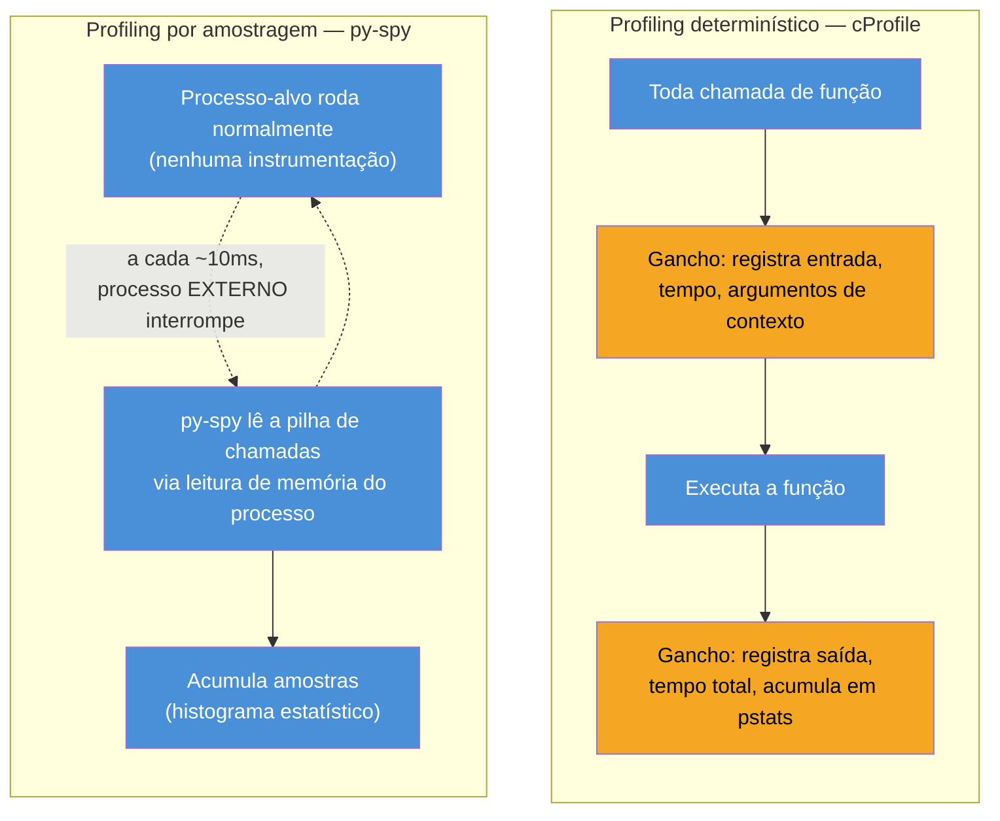
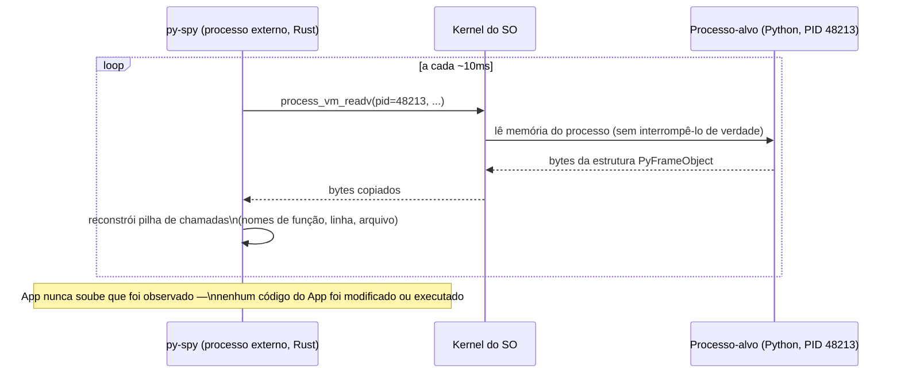
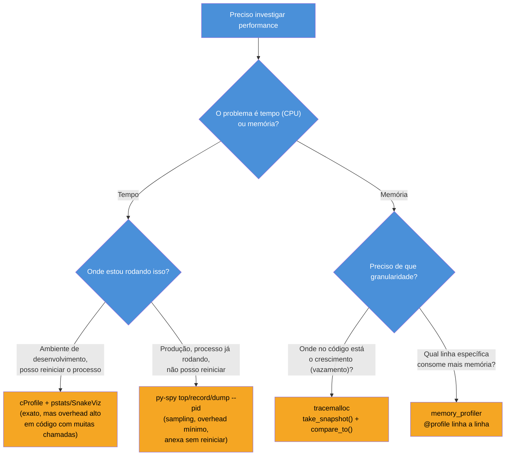

# Profiling — cProfile, py-spy, tracemalloc

> [!abstract] TL;DR
> As sete notas anteriores deste galho explicaram *mecanismos* — reference counting, GC geracional, o GIL, pymalloc — mas nenhuma delas dá uma resposta direta à pergunta que aparece todo dia em produção: **onde exatamente, neste programa específico, o tempo e a memória estão sendo gastos?** Profiling é a família de ferramentas que torna esses mecanismos observáveis. `cProfile` (stdlib) é um **profiler determinístico**: instrumenta toda chamada de função, medindo tempo exato, mas paga um overhead real — nos experimentos desta nota, 4x mais lento — que distorce código com muitas chamadas pequenas (recursão profunda, comprehensions aninhadas). `py-spy` é um **sampling profiler** externo, escrito em Rust: não instrumenta nada, tira snapshots periódicos da pilha de chamadas várias vezes por segundo lendo a memória do processo via `process_vm_readv`/`ptrace`-like syscalls — overhead de dígitos únicos de porcentagem, e a vantagem estrutural que nenhuma outra ferramenta desta nota tem: **consegue anexar (`--pid`) a um processo Python já rodando em produção**, sem reiniciar nada, sem instrumentar código, sem sequer precisar que o processo tenha `cProfile` importado. `tracemalloc` (stdlib desde Python 3.4) rastreia **alocações de memória** por linha de código, e sua ferramenta central é comparar dois snapshots (`take_snapshot()`/`compare_to()`) para achar exatamente o que cresceu entre dois pontos no tempo — o jeito certo de investigar o "RSS que só cresce" descrito na abertura da [[07 - Memory management — allocators, pymalloc e arenas|nota 07]]. `memory_profiler` é um complemento de terceiros para visão linha a linha de uso de memória via decorator `@profile`. A decisão prática: CPU em desenvolvimento → `cProfile`; CPU em produção sem downtime → `py-spy`; memória (vazamento ou crescimento) → `tracemalloc`.

## O bug que abre esta nota

Um time recebe um alerta: a P99 de latência de um endpoint de uma API em produção subiu de 80ms para 1.2s ao longo da última semana, sem nenhum deploy recente. O serviço está saudável — sem erros, sem restart, CPU em ~40% — só lento. A primeira reação de alguém que só conhece `cProfile` seria: "vamos rodar com `python -m cProfile -o out.prof app.py` e ver o que aparece" — mas isso significa **reiniciar o processo de produção com profiling ligado**, adicionando overhead real (como esta nota vai medir, um fator de 4x ou mais) exatamente no momento em que o time menos quer degradar ainda mais um serviço já lento, e ainda corre o risco de o problema ser um efeito raro (um caminho de código específico, uma condição de corrida de cache) que só aparece sob carga real de produção — carga que o profiling determinístico, ao desacelerar tudo, pode nunca deixar se manifestar da mesma forma.

```bash
# A tentação óbvia — mas reinicia o processo, some com o estado em memória
# (conexões, caches quentes) e roda com 4x+ de overhead exatamente
# no pior momento pra desacelerar ainda mais um serviço já lento
python -m cProfile -o profile.out app.py
```

A saída sênior para esse cenário específico não é `cProfile` — é anexar um profiler de amostragem ao processo **já rodando**, sem reiniciar nada:

```bash
# py-spy anexa ao PID do processo já em produção, sem reiniciar,
# sem modificar o código, com overhead mínimo
sudo py-spy record -o profile.svg --pid 48213 --duration 30
```

Entender por que essas duas ferramentas resolvem problemas tão diferentes — e por que nenhuma delas serve para investigar o problema de memória que apareceria se o sintoma fosse RSS crescendo em vez de latência subindo — é o assunto desta nota. Ela assume as notas anteriores do galho: [[03 - Reference counting e o Garbage Collector geracional|03]] e [[07 - Memory management — allocators, pymalloc e arenas|07]] explicaram *por que* memória se comporta como se comporta; [[04 - O GIL — o que é de verdade e por que existe|04]] explicou *por que* CPU-bound e I/O-bound se comportam diferente sob `threading`. Profiling é a ferramenta que confirma, com números reais de um programa real, qual dessas explicações se aplica ao problema que você tem na sua frente.

> [!info] Pré-requisito
> Esta nota pressupõe familiaridade com [[03 - Reference counting e o Garbage Collector geracional|03]] (quando um objeto morre) e [[07 - Memory management — allocators, pymalloc e arenas|07]] (por que RSS raramente cai). Não reexplica esses mecanismos — usa `tracemalloc` para *observar* efeitos que eles descrevem por baixo dos panos.

## O que é: duas famílias de profiler, uma decisão estrutural diferente

Profilers de CPU se dividem em duas famílias com trade-offs opostos, e a escolha entre elas não é sobre qual ferramenta é "melhor" — é sobre **onde** e **quando** você pode pagar o custo de medir.

**Profiling determinístico** (`cProfile`, `profile`) instrumenta o programa: insere um gancho de medição em toda entrada e saída de função, contando exatamente quantas vezes cada função foi chamada e quanto tempo cada chamada levou. É exaustivo e exato — nenhuma chamada escapa — ao custo de rodar mais devagar, porque cada chamada de função agora carrega o peso extra de registrar seu próprio início e fim.

**Profiling por amostragem** (*sampling*, `py-spy`) não instrumenta nada: em vez de interceptar cada chamada, um processo externo interrompe periodicamente o programa-alvo (dezenas a centenas de vezes por segundo) e tira uma foto da pilha de chamadas naquele instante exato — "que função está executando agora, e quem a chamou, e quem chamou quem chamou". Repetido muitas vezes por segundo, o histograma dessas fotos aproxima, estatisticamente, onde o tempo é gasto — sem que o programa-alvo precise saber que está sendo observado.



> [!question]- Se amostragem é "só uma aproximação estatística", por que confiar nela mais que a exatidão do profiling determinístico?
> Porque a exatidão de `cProfile` é exatidão do **programa instrumentado**, não do programa real — o overhead de instrumentar cada chamada muda o perfil de tempo que está sendo medido, especialmente em código com muitas chamadas pequenas e recursivas (o problema central da próxima seção). Um sampling profiler mede o programa rodando **sem alteração de comportamento** (o overhead de interrupções externas é ordens de grandeza menor), então, embora cada amostra individual seja "só um instante", milhares de amostras acumuladas ao longo de segundos convergem para uma imagem estatisticamente fiel de onde o tempo realmente vai — sem o viés sistemático que a própria instrumentação introduz. A troca é: `cProfile` te dá contagens exatas de chamadas (útil pra achar `N+1 queries` ou loops que chamam uma função milhões de vezes); `py-spy` te dá uma imagem fiel de onde o *tempo de relógio* realmente foi gasto, sem distorcer esse tempo no processo de medir.

**Profiling determinístico vs. amostragem em uma frase:** um instrumenta cada chamada e paga o preço da exatidão em overhead; o outro observa de fora, em intervalos, e paga uma aproximação estatística pelo preço de quase não alterar o que está medindo.

## Por que importa: o overhead do `cProfile` é real e distorce especificamente código recursivo

### Medindo o overhead diretamente

O melhor jeito de internalizar por que `cProfile` "distorce" resultados não é a definição abstrata — é medir. Um `fibonacci` recursivo ingênuo é o caso mais didático possível: milhões de chamadas de função minúsculas, exatamente o padrão que expõe o custo por chamada da instrumentação.

```python
import cProfile
import pstats
import time

def fib(n):
    if n < 2:
        return n
    return fib(n - 1) + fib(n - 2)

N = 28

# Sem profiling
t0 = time.perf_counter()
fib(N)
t1 = time.perf_counter()
print(f"sem cProfile: {t1 - t0:.4f}s")

# Com profiling
pr = cProfile.Profile()
t0 = time.perf_counter()
pr.enable()
fib(N)
pr.disable()
t1 = time.perf_counter()
print(f"com cProfile: {t1 - t0:.4f}s")

stats = pstats.Stats(pr)
print(f"chamadas de função registradas: {stats.total_calls}")
```

Rodando isso (CPython 3.12.3, medição feita nesta sessão):

```
sem cProfile: 0.0266s
com cProfile: 0.1151s
chamadas de função registradas: 1028458
```

**Overhead de ~4.3x** — não um detalhe cosmético, um custo que muda a ordem de grandeza do tempo medido. E o motivo é exatamente o que a seção anterior previu: `fib(28)` gera pouco mais de **1 milhão de chamadas de função**, cada uma pequena (poucas instruções de bytecode), e `cProfile` paga um custo fixo de instrumentação **por chamada** — nesse regime, o overhead de medir domina o tempo do trabalho real sendo medido.

> [!warning] `cProfile` distorce mais quanto menor e mais numerosa for a chamada
> O overhead de `cProfile` não é uniforme — ele é aproximadamente proporcional ao **número de chamadas de função**, não ao tempo total de CPU. Uma função que faz uma chamada só e gasta 2 segundos nela (um cálculo numérico pesado, uma query de banco) sofre overhead desprezível: o custo fixo de instrumentar essa única chamada é irrelevante perto dos 2 segundos de trabalho real. Uma função recursiva ou um loop que faz milhões de chamadas pequenas (parsing caractere a caractere, recursão profunda, comprehensions aninhadas chamando uma função auxiliar) sofre o pior caso: o overhead por chamada, multiplicado por milhões, pode dominar completamente o tempo medido — ao ponto de o `cProfile` reportar uma função como "gargalo" quando, sem profiling, ela seria irrelevante. Isso é documentado explicitamente na [documentação oficial do `profile`](https://docs.python.org/3/library/profile.html): "the profiler adds a substantial amount of overhead… for programs which spend most of their time doing lots of small function calls, particularly recursive calls."

### `cProfile` vs. `profile`: por que a stdlib tem os dois

A biblioteca padrão documenta dois módulos quase idênticos na interface — [`cProfile` e `profile`](https://docs.python.org/3/library/profile.html) — e a diferença é puramente de implementação, não de funcionalidade: `cProfile` é escrito como uma extensão C (menor overhead relativo, adequado até para programas de longa duração), enquanto `profile` é escrito em Python puro (overhead maior ainda, mas extensível — pode ser subclassificado e customizado sem recompilar nada). A recomendação oficial é usar `cProfile` como padrão sempre; `profile` só quando o objetivo específico é escrever um profiler customizado que herda o comportamento base.

### `pstats`: interpretando os números que `cProfile` produz

`cProfile` sozinho só acumula números; `pstats.Stats` é o módulo da stdlib que organiza, ordena e imprime esses números de forma legível:

```python
import cProfile
import pstats

profiler = cProfile.Profile()
profiler.enable()
resultado_da_aplicacao()
profiler.disable()

stats = pstats.Stats(profiler)
stats.sort_stats('cumulative')   # ordena por tempo cumulativo (inclui subchamadas)
stats.print_stats(15)             # top 15 funções
```

As duas métricas centrais que `pstats` expõe por função, e que costumam confundir quem lê pela primeira vez:

- **`tottime`** — tempo gasto *dentro* da função, excluindo chamadas que ela faz a outras funções. Alto `tottime` = o trabalho pesado está literalmente ali, nessa função.
- **`cumtime`** — tempo total, incluindo todas as subchamadas. Alto `cumtime` mas baixo `tottime` = essa função não faz o trabalho pesado diretamente, ela **orquestra** algo que faz (uma função `processar_pedido()` que chama `validar()`, `calcular_frete()`, `salvar()` — o tempo pesado provavelmente está numa dessas três, não em `processar_pedido()` em si).

> [!question]- Como decidir entre ordenar por `tottime` ou `cumtime` ao investigar um gargalo?
> Comece por `cumtime` para achar **onde**, na árvore de chamadas, o tempo se concentra — geralmente uma função de alto nível que orquestra o fluxo problemático. Depois de identificar esse "galho" da árvore, mude para `tottime` (ou olhe as subchamadas listadas por `print_callees()`) para achar **qual função específica**, dentro desse galho, é a que realmente consome o tempo — não a que só o repassa adiante. Pular direto para `tottime` sem passar por `cumtime` primeiro é comum e engana: uma função de baixo nível chamada de dezenas de lugares diferentes pode ter `tottime` alto agregado sem que nenhum caminho de chamada individual pareça, isoladamente, o gargalo óbvio.

### SnakeViz: visualização quando a tabela de texto não basta

Para árvores de chamada profundas, a saída textual de `pstats` fica difícil de ler linearmente — [SnakeViz](https://jiffyclub.github.io/snakeviz/) é uma ferramenta de terceiros que renderiza o arquivo de saída do `cProfile` como um gráfico interativo no navegador (estilo *icicle* ou *sunburst*), onde a largura de cada bloco representa a fração de tempo gasta naquela função e seus filhos:

```bash
python -m cProfile -o saida.prof meu_script.py
snakeviz saida.prof   # abre uma visualização interativa no navegador
```

**cProfile em uma frase:** instrumenta cada chamada de função para medir com exatidão onde o tempo vai, ao custo de um overhead que cresce especificamente com o número de chamadas — ótimo em desenvolvimento, arriscado demais para ligar direto num processo de produção já lento.

## Como funciona: `py-spy` e a arte de olhar de fora sem instrumentar nada

### O mecanismo: ler a memória de outro processo

A diferença estrutural mais importante entre `py-spy` e `cProfile` não é só "sampling vs. determinístico" — é que `py-spy` é um **processo separado, escrito em Rust**, que nunca roda dentro do interpretador que está sendo medido. Ele localiza, na memória do processo-alvo, as estruturas internas do CPython (o mesmo `PyFrameObject`/`_PyInterpreterFrame` descrito na [[01 - O interpretador por dentro — ceval loop e frame objects|nota 01]] deste galho) e as lê diretamente, sem cooperação nenhuma do processo-alvo — via `process_vm_readv` no Linux, `vm_read` no macOS, `ReadProcessMemory` no Windows.



Como `py-spy` nunca executa código *dentro* do processo-alvo — só lê a memória dele de fora — ele não sofre o problema estrutural que atormentaria qualquer profiler que precisasse rodar bytecode Python adicional dentro do processo: ele nem sequer compete pelo [[04 - O GIL — o que é de verdade e por que existe|GIL]] do processo observado, porque não está tentando executar nada ali dentro, só ler bytes de memória já existentes.

> [!question]- Isso não é exatamente o mesmo mecanismo que um debugger como `gdb`/gdb attach usa?
> Sim, na essência — `py-spy` resolve o mesmo problema geral que ferramentas de depuração de baixo nível resolvem há décadas (inspecionar o estado interno de um processo rodando, de fora, sem cooperação dele), só que especializado especificamente em entender a estrutura de dados do interpretador CPython (frames, nomes de função, números de linha) em vez de expor registradores de CPU crus como um debugger genérico faria. É por isso que, nas mesmas condições de permissão que um `gdb attach` exigiria (acesso root ou configuração de `ptrace_scope` no Linux, sempre root no macOS por causa do System Integrity Protection), `py-spy` também exige.

### Os três subcomandos principais

```bash
# top: visão ao vivo, atualizada continuamente, tipo "htop" para chamadas Python
py-spy top --pid 48213

# record: grava um perfil num arquivo (flame graph SVG, ou formato speedscope)
py-spy record -o profile.svg --pid 48213 --duration 30

# dump: uma única foto instantânea da pilha de TODAS as threads do processo agora
py-spy dump --pid 48213
```

`py-spy dump` é a ferramenta exata mencionada na nota [[04 - O GIL — o que é de verdade e por que existe|04]] deste galho para diagnosticar contenção de GIL em produção: ao mostrar, para cada thread do processo, se ela está segurando o GIL ou esperando por ele, uma única chamada de `dump` já revela se o gargalo é exatamente o mecanismo que aquela nota descreve.

### Permissões: por que `py-spy --pid` costuma exigir `sudo`

Ler a memória de outro processo é, por padrão, uma operação restrita pelo sistema operacional — é exatamente a mesma barreira de segurança que impede um processo qualquer de bisbilhotar a memória de outro processo do sistema (senhas em memória, chaves de sessão, dados sensíveis de outro usuário). No Linux, isso é controlado pelo parâmetro `ptrace_scope` do kernel; anexar por PID (`py-spy record --pid <PID>`) normalmente exige `sudo`, mas criar o processo através do próprio `py-spy` (`py-spy record -- python app.py`) não exige, porque nesse caso `py-spy` é o processo pai e já tem a relação de permissão necessária desde o início. No macOS, o *System Integrity Protection* torna a exigência de root praticamente incondicional, inclusive para o interpretador embutido do sistema.

> [!warning] `sudo py-spy` em produção exige avaliação de segurança, não só de permissão técnica
> Rodar um binário com privilégios elevados anexado a um processo de produção é uma ação sensível o suficiente para exigir aprovação e auditoria em qualquer ambiente com política de segurança séria — não é "só mais uma flag de comando". Antes de rodar `sudo py-spy --pid` num processo de produção pela primeira vez, confirmar com o time de segurança/plataforma se existe uma política de acesso privilegiado a processos de produção, e se `py-spy` já está aprovado como ferramenta de observabilidade — muitas organizações preferem embutir suporte a profiling continuamente ligado (via [Pyroscope](https://pyroscope.io/) ou equivalente, usando o próprio `py-spy` como motor de coleta) em vez de depender de um `sudo` manual ad-hoc por engenheiro.

**py-spy em uma frase:** um processo externo em Rust que lê a memória de um interpretador CPython já rodando para reconstruir sua pilha de chamadas periodicamente, sem instrumentar nada e sem precisar reiniciar o processo-alvo — a única ferramenta desta nota que funciona direto em produção sem downtime.

## `tracemalloc`: tornando visível o que a nota 07 explicou por baixo dos panos

### O que é e por que existe desde 3.4

[`tracemalloc`](https://docs.python.org/3/library/tracemalloc.html) é um módulo nativo da stdlib, presente desde o Python 3.4, dedicado especificamente a rastrear **onde**, no código Python, cada bloco de memória foi alocado — guardando, para cada alocação ativa, o traceback (pilha de chamadas) do ponto exato em que ela aconteceu. Diferente de `cProfile`/`py-spy`, que medem *tempo*, `tracemalloc` mede *memória* — e resolve exatamente o problema que a abertura da [[07 - Memory management — allocators, pymalloc e arenas|nota 07]] deixou em aberto: como descobrir se um crescimento de RSS é um vazamento real de referências Python (objetos vivos que não deveriam estar vivos) ou um artefato do comportamento de `pymalloc` (arenas que não são devolvidas ao SO mesmo com os objetos já mortos).

`tracemalloc` responde essa pergunta observando o lado Python da equação: ele rastreia alocações de **objetos Python vivos**, não o comportamento do alocador `pymalloc` por baixo. Se `tracemalloc` mostra que a memória de objetos Python rastreados não cresce, mas o RSS do processo continua subindo, a causa é o comportamento de arena/pool descrito na nota 07 (ou uma alocação fora do controle de `pymalloc` — acima de 512 bytes, ou dentro de uma extensão C que usa `malloc()` diretamente sem passar pela contabilidade do CPython). Se `tracemalloc` mostra objetos Python crescendo continuamente num ponto específico do código, o problema é uma referência sendo mantida viva sem intenção — o assunto da [[03 - Reference counting e o Garbage Collector geracional|nota 03]].

### `take_snapshot()` e `compare_to()`: a técnica central

O uso mais valioso de `tracemalloc` quase nunca é olhar um snapshot isolado — é **comparar dois snapshots tirados em momentos diferentes** e ver exatamente o que cresceu entre eles:

```python
import tracemalloc

tracemalloc.start()

snap1 = tracemalloc.take_snapshot()

# --- código suspeito de vazar memória roda aqui ---
_cache = []
for i in range(200_000):
    _cache.append({"id": i, "payload": "x" * 50})
# ---------------------------------------------------

snap2 = tracemalloc.take_snapshot()
diffs = snap2.compare_to(snap1, 'lineno')

for stat in diffs[:3]:
    print(stat)
```

Rodando isso (CPython 3.12.3, medição feita nesta sessão):

```
/tmp/tmdemo.py:10: size=36.6 MiB (+36.6 MiB), count=399974 (+399974), average=96 B
/tmp/tmdemo.py:9: size=6242 KiB (+6242 KiB), count=199743 (+199743), average=32 B
/tmp/tmdemo.py:5: size=400 B (+400 B), count=1 (+1), average=400 B
```

A linha 10 (`_cache.append({...})`) aponta exatamente para onde os 36.6 MiB novos foram alocados, com a contagem exata de blocos (399974 — os dicionários e as strings `"x" * 50` dentro deles, contados como alocações distintas). Isso é o equivalente, para memória, do que `cumtime`/`tottime` fazem para tempo em `pstats`: aponta com precisão de linha de código onde o crescimento está acontecendo, sem exigir que o desenvolvedor adivinhe.

> [!question]- Por que comparar dois snapshots é melhor que olhar um snapshot único?
> Porque um snapshot único mostra *tudo* que está alocado num instante — inclusive memória perfeitamente legítima e esperada (o próprio interpretador, módulos importados, estruturas de dados de longa duração que deveriam mesmo existir). Isso produz uma lista longa, dominada por alocações normais, onde o vazamento real fica escondido entre ruído. Comparar dois snapshots — um antes de uma operação suspeita, outro depois — filtra automaticamente todo esse ruído: só aparece na diferença o que **mudou** entre os dois pontos no tempo, que é exatamente a pergunta que investigar um vazamento faz ("o que cresceu enquanto isso rodava?"). É a mesma lógica de `git diff` contra olhar o arquivo inteiro: a diferença isola o sinal do ruído de contexto que não mudou.

### `start(nframes)`: profundidade de traceback como trade-off

`tracemalloc.start()` aceita um argumento opcional, `nframes` (padrão 1), que controla quantos níveis de pilha de chamadas são guardados por alocação:

```python
tracemalloc.start(25)   # guarda até 25 frames de profundidade por alocação
```

Um `nframes` maior dá mais contexto (não só "qual linha alocou", mas "qual cadeia de chamadas levou até essa linha") — valioso quando a mesma linha de código é chamada de dezenas de lugares diferentes e a origem específica do crescimento importa. O custo é overhead de memória e CPU proporcional: cada alocação rastreada agora carrega uma pilha mais profunda, o que tem impacto real em aplicações com alto volume de alocação — por isso `tracemalloc` é, na prática, uma ferramenta de investigação pontual (ligada temporariamente para diagnosticar um problema específico), não algo mantido ligado permanentemente em produção sob carga plena sem medir o próprio overhead que introduz.

**tracemalloc em uma frase:** rastreia onde, no código Python, cada bloco de memória foi alocado, e comparar dois snapshots no tempo é o jeito certo — não adivinhação — de achar exatamente onde um vazamento ou crescimento de memória Python está acontecendo.

## `memory_profiler`: visão linha a linha, como complemento rápido

Para investigação ainda mais granular — não "qual função aloca mais", mas "qual **linha individual**, dentro de uma função específica, consome mais memória" — o pacote de terceiros [`memory_profiler`](https://pypi.org/project/memory-profiler/) oferece um decorator simples:

```python
from memory_profiler import profile

@profile
def processar_lote(registros):
    dados_brutos = [parse(r) for r in registros]          # linha 1
    normalizados = [normalizar(d) for d in dados_brutos]   # linha 2
    return agregar(normalizados)                            # linha 3
```

Rodando com `python -m memory_profiler script.py`, a saída anota, linha a linha, o uso de memória do processo (via `psutil`, monitorando RSS) depois de cada linha executar, e o incremento em relação à linha anterior — a granularidade mais fina entre as ferramentas desta nota, ao custo de ser a mais lenta de todas (o monitoramento por linha adiciona overhead substancial, comparável ao pior caso de `cProfile` em código com muitas linhas rápidas).

> [!warning] `memory_profiler` mede RSS do processo, não alocação Python rastreada
> Diferente de `tracemalloc`, que rastreia objetos Python especificamente atribuídos a uma linha de alocação, `memory_profiler` observa o RSS do processo inteiro via `psutil` a cada linha — o que significa que ele também é afetado pelo comportamento de `pymalloc` descrito na [[07 - Memory management — allocators, pymalloc e arenas|nota 07]]: uma linha que aloca e imediatamente libera muitos objetos pequenos pode não mostrar queda de memória correspondente, porque a arena que os continha pode não ter sido devolvida ao SO. Para investigação de vazamentos de referência Python especificamente, `tracemalloc` é a ferramenta mais precisa; `memory_profiler` é mais útil para uma visão rápida, aproximada, de "que trecho de código é o mais pesado em memória", sem precisar instrumentar snapshots manualmente. Vale registrar que o projeto tem ritmo de manutenção lento (poucos commits recentes no repositório oficial) — para uso ativo em 2026, `line_profiler` (equivalente para tempo, não memória) e o próprio `tracemalloc` continuam sendo as opções mais robustas da stdlib ou de manutenção mais ativa.

**memory_profiler em uma frase:** visão linha a linha de uso de memória do processo via decorator `@profile` — mais granular que `tracemalloc`, mais lento, e medindo RSS em vez de alocação Python rastreada.

## Na prática: a tabela de decisão



| Cenário | Ferramenta | Por quê |
|---|---|---|
| CPU lenta, ambiente de dev, posso reiniciar o processo à vontade | `cProfile` + `pstats`/SnakeViz | Exato, contagem de chamadas confiável; overhead aceitável fora de produção |
| CPU lenta em produção, processo já rodando, não posso reiniciar | `py-spy top`/`record`/`dump --pid` | Anexa sem reiniciar, overhead mínimo, seguro em carga real |
| Diagnosticar contenção de GIL entre threads (nota 04) | `py-spy dump --pid` | Mostra diretamente quais threads seguram/esperam o GIL |
| RSS crescendo, suspeita de vazamento de referência Python | `tracemalloc` (`take_snapshot`/`compare_to`) | Aponta a linha exata de alocação Python que cresceu entre dois pontos no tempo |
| RSS crescendo, mas `tracemalloc` não mostra objetos Python crescendo | Reler [[07 - Memory management — allocators, pymalloc e arenas|nota 07]] | O crescimento é comportamento de `pymalloc` (arenas não devolvidas) ou alocação fora do CPython (extensão C usando `malloc()` direto) |
| Qual linha específica dentro de uma função consome mais memória | `memory_profiler` (`@profile`) | Granularidade linha a linha; mais lento, mede RSS do processo via `psutil` |

> [!question]- E se eu não sei ainda se o problema é CPU ou memória?
> O sintoma observável costuma decidir isso antes de qualquer ferramenta: latência subindo com CPU alta (`htop` mostrando o processo perto de 100% de um núcleo, ou de vários se for multithread/multiprocesso) aponta pra tempo — comece por `cProfile` (dev) ou `py-spy` (produção). RSS crescendo continuamente, sem correlação direta com CPU, e sem quedas mesmo em baixa carga — o sintoma exato descrito na abertura da nota 07 — aponta pra memória, comece por `tracemalloc`. Os dois sintomas podem coexistir (um vazamento de memória que também deixa o GC geracional mais lento por ter mais objetos pra varrer, retroalimentando lentidão de CPU) — nesse caso, resolver a causa de memória primeiro costuma resolver o sintoma de CPU como efeito colateral, porque menos objetos vivos significa ciclos de GC mais rápidos ([[03 - Reference counting e o Garbage Collector geracional|nota 03]]).

## Armadilhas comuns

> [!warning] Ligar `cProfile` direto num processo de produção "só pra ver"
> **O que acontece:** um engenheiro, sob pressão para diagnosticar rápido, adiciona `cProfile` ao código de produção (ou reinicia o processo com `python -m cProfile`) sem medir antes o overhead esperado.
> **Por quê:** como esta nota mediu diretamente (4.3x de overhead num caso realista de recursão), `cProfile` pode transformar um serviço já lento num serviço ainda mais lento, degradando a experiência de usuários reais durante toda a janela de profiling — e, em código com muitas chamadas pequenas, pode até mudar qual função *parece* ser o gargalo, por causa da distorção de overhead-por-chamada.
> **Como evitar:** em produção, o primeiro instinto deve ser `py-spy --pid` (sem reiniciar, sem instrumentar, overhead mínimo). `cProfile` fica reservado para desenvolvimento local, ambientes de staging isolados, ou uma janela de profiling deliberadamente curta e comunicada em produção quando não há alternativa.

> [!warning] Interpretar um snapshot único de `tracemalloc` como se fosse um diagnóstico completo
> **O que acontece:** rodar `tracemalloc.take_snapshot()` uma única vez e tentar ler a lista de alocações como se fosse a causa do vazamento, sem comparar com um ponto anterior no tempo.
> **Por quê:** um snapshot isolado mostra toda a memória Python alocada naquele instante — a esmagadora maioria dela legítima e esperada (módulos, estruturas de longa duração). O sinal do vazamento fica perdido entre ruído de contexto normal.
> **Como evitar:** sempre comparar dois snapshots via `compare_to()` — um antes da operação suspeita, outro depois — para que só o crescimento real apareça na diferença, filtrando automaticamente tudo que já existia e não mudou.

> [!warning] Esquecer que `tracemalloc` tem overhead próprio e não é gratuito manter ligado
> **O que acontece:** deixar `tracemalloc.start()` ativo permanentemente em produção, sob carga plena, achando que é "só uma flag de debug sem custo".
> **Por quê:** rastrear o traceback de cada alocação individual tem custo real de CPU e memória, proporcional ao volume de alocações e à profundidade de `nframes` configurada — sob alto volume de alocação (serviços com muita criação de objetos pequenos por requisição), esse overhead é mensurável, não desprezível.
> **Como evitar:** tratar `tracemalloc` como uma ferramenta de investigação pontual — ligar para diagnosticar um problema específico, tirar os snapshots necessários, desligar (`tracemalloc.stop()`) depois. Para monitoramento contínuo de memória em produção, métricas de RSS via infraestrutura de observação (Prometheus, Datadog) são mais baratas que manter `tracemalloc` ligado indefinidamente.

> [!warning] Confundir "RSS não caiu depois do `gc.collect()`" com "há um vazamento de referências"
> **O que acontece:** ver que `gc.collect()` não reduz o RSS do processo e concluir que o Garbage Collector "não está funcionando" ou que há um vazamento de referências Python, sem checar `tracemalloc` primeiro.
> **Por quê:** como a [[07 - Memory management — allocators, pymalloc e arenas|nota 07]] estabelece, o RSS de um processo Python raramente cai mesmo depois de todos os objetos serem desalocados corretamente — porque `pymalloc` só devolve uma arena ao sistema operacional quando todos os seus pools ficam 100% vazios simultaneamente, algo raro em processos de longa duração. `gc.collect()` limpar ciclos de referência corretamente e o RSS não cair são dois fatos compatíveis, não contraditórios.
> **Como evitar:** usar `tracemalloc` para confirmar se objetos Python rastreados estão de fato crescendo continuamente (vazamento real) antes de investigar o alocador. Se `tracemalloc` mostra memória Python estável mas o RSS continua subindo, o comportamento é esperado do `pymalloc`, não um bug — reler a nota 07 antes de investigar mais fundo.

## Em entrevista

Profiling costuma aparecer em entrevistas sêniores não como pergunta isolada ("o que é `cProfile`?"), mas embutida num cenário — "como você investigaria um serviço lento em produção?" — onde a resposta que separa quem só decorou nomes de ferramenta de quem entende o trade-off nomeia explicitamente a restrição operacional antes da ferramenta:

> "The first question I ask is where the problem is observable and whether I can restart the process. In development, `cProfile` is the right default — it's deterministic, it instruments every function call, and gives exact call counts and cumulative time via `pstats`. But `cProfile` has real overhead — in a recursive benchmark I ran, about 4x slower — and that overhead scales with the number of function calls, not their total CPU time, so it specifically distorts code with lots of small, frequent calls. That makes it risky to attach directly to a production process that's already struggling. For that case, I'd reach for `py-spy` instead: it's a sampling profiler that runs as a separate Rust process and reads the target's memory directly — via `process_vm_readv` on Linux — without instrumenting any code inside the target. It can attach to an already-running process with `--pid`, with near-zero overhead, which is exactly what you need when you can't afford to restart anything or slow it down further. For memory specifically, that's a different tool: `tracemalloc`, built into the standard library since 3.4, tracks where each Python allocation happened, and the real technique is comparing two snapshots — `take_snapshot()` before and after a suspicious operation, then `compare_to()` — to isolate exactly what grew, instead of trying to read a single snapshot as if it were the whole answer."

Uma pergunta de acompanhamento comum, testando se a resposta foi decorada ou entendida: **"por que `py-spy` consegue anexar a um processo já rodando e `cProfile` não?"** — a resposta certa nomeia a diferença estrutural: `cProfile` precisa que o **próprio interpretador** que está rodando o código instrumente cada chamada — ele roda *dentro* do processo, e não há como "injetar" essa instrumentação retroativamente num processo que já está de pé sem reiniciá-lo (ou, em casos avançados, sem técnicas de injeção de código bem mais arriscadas e específicas de plataforma). `py-spy`, por rodar como processo **externo** que só lê memória, nunca precisou que o processo-alvo cooperasse desde o início — ele pode começar a observar a qualquer momento, porque não depende de nenhum estado de instrumentação ter sido ligado com antecedência dentro do processo.

> [!question]- O entrevistador pergunta especificamente sobre flame graphs — o que responder?
> Vale nomear que tanto `cProfile` (via conversão de sua saída, ou via `SnakeViz`) quanto `py-spy record -o profile.svg` conseguem gerar um **flame graph**: uma visualização onde cada retângulo horizontal representa uma função, sua largura representa a fração de tempo (ou amostras) gasta nela e em suas subchamadas, e o empilhamento vertical representa a profundidade da pilha de chamadas — larguras grandes em qualquer nível da pilha saltam aos olhos como candidatos a gargalo, sem precisar ler uma tabela de números. `py-spy record -o profile.svg --pid <PID>` gera esse flame graph diretamente a partir de amostragem em produção, sem precisar de nenhuma etapa de conversão adicional — uma das razões pelas quais `py-spy` é frequentemente a primeira ferramenta que um time de plataforma reachea para triagem visual rápida de onde o tempo está indo, antes de qualquer investigação mais profunda.

## Como explicar em inglês

| PT | EN |
|----|----|
| profiling determinístico | deterministic profiling |
| profiling por amostragem | sampling profiling |
| instrumentar (código) | instrument (code) |
| overhead | overhead |
| pilha de chamadas | call stack |
| anexar a um processo | attach to a process |
| flame graph | flame graph |
| vazamento de memória | memory leak |
| rastreamento de alocação | allocation tracking |
| snapshot (de memória) | (memory) snapshot |
| tempo cumulativo / tempo próprio | cumulative time / own time (`tottime`) |

## O que vem a seguir

Esta nota fechou o ciclo de observabilidade do galho: profiling é a ferramenta que confirma, com dados reais de um programa real, qual dos mecanismos das notas anteriores está de fato em jogo num problema concreto de performance ou memória. A última peça do galho junta tudo isso num exercício de diagnóstico ponta a ponta:

- [[09 - Capstone — CPython internals|09 — Capstone: CPython internals]] — recapitula o galho inteiro diagnosticando e otimizando um programa real: uma função lenta identificada via `cProfile`/`py-spy`, um vazamento de memória achado via `tracemalloc`/`gc`, e uma decisão `threading` vs. `multiprocessing` justificada pelo mecanismo do GIL — a síntese prática de tudo que as notas 01-08 explicaram separadamente.
- [[04 - O GIL — o que é de verdade e por que existe|04 — O GIL: o que é de verdade e por que existe]] — pré-requisito indireto: o mecanismo que `py-spy dump` revela ao mostrar threads segurando/esperando o lock.
- [[07 - Memory management — allocators, pymalloc e arenas|07 — Memory management: allocators, pymalloc e arenas]] — pré-requisito direto: o comportamento de `pymalloc` que `tracemalloc` ajuda a diferenciar de um vazamento real de referências.
- [[03-Dominios/Tecnologia/Python/Concorrência e paralelismo/index|Concorrência e paralelismo (Galho 7)]] — aprofunda os padrões de produção (threading/asyncio/multiprocessing) que a decisão de profiling frequentemente leva a revisitar.

## Fontes

- Python Software Foundation. *The Python Profilers — `profile` and `cProfile`*. docs.python.org, versão 3.14. https://docs.python.org/3/library/profile.html (acessado em 2026-07-10) — overhead documentado explicitamente para código com muitas chamadas pequenas/recursivas, diferença `cProfile`/`profile`, uso de `pstats`.
- Python Software Foundation. *tracemalloc — Trace memory allocations*. docs.python.org, versão 3.14. https://docs.python.org/3/library/tracemalloc.html (acessado em 2026-07-10) — `take_snapshot()`, `Snapshot.compare_to()`, `start(nframes)`, disponível desde Python 3.4.
- Ben Frederickson. [*py-spy — Sampling profiler for Python programs*](https://github.com/benfred/py-spy). GitHub, v0.4.2 (2026-04-24) — mecanismo de leitura de memória (`process_vm_readv`/`vm_read`/`ReadProcessMemory`), subcomandos `record`/`top`/`dump`, requisitos de permissão por sistema operacional, suporte a CPython 3.3-3.14.
- SnakeViz. *Browser based graphical viewer for cProfile output*. https://jiffyclub.github.io/snakeviz/ (acessado em 2026-07-10)
- `memory_profiler` — [PyPI](https://pypi.org/project/memory-profiler/) / [GitHub](https://github.com/pythonprofilers/memory_profiler) (acessado em 2026-07-10) — decorator `@profile`, uso de `psutil` para RSS, ritmo de manutenção lento observado no repositório.
- Real Python — [py-spy: Sampling profiler reference](https://realpython.com/ref/tools/py-spy/): contexto de uso prático em produção.
- **Fluent Python**, 2ª ed. — Luciano Ramalho: referência geral de idiomas Python usados nos exemplos de código desta nota (comprehensions, decorators).
- [[07 - Memory management — allocators, pymalloc e arenas|07 — Memory management: allocators, pymalloc e arenas]] — nota irmã, pré-requisito direto: o comportamento de `pymalloc` que `tracemalloc` ajuda a diagnosticar corretamente.
- [[04 - O GIL — o que é de verdade e por que existe|04 — O GIL: o que é de verdade e por que existe]] — nota irmã: `py-spy dump` como ferramenta de diagnóstico de contenção de GIL já citada nessa nota.
- Medições empíricas de overhead de `cProfile` (fibonacci recursivo, N=28) e de comparação de snapshots `tracemalloc` (crescimento de lista de dicionários) realizadas nesta sessão, CPython 3.12.3.

Consultado em 2026-07-10.
