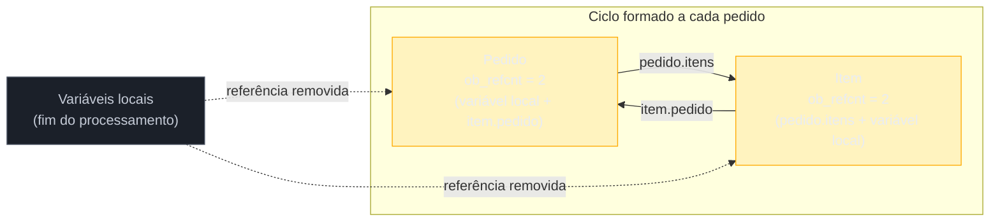
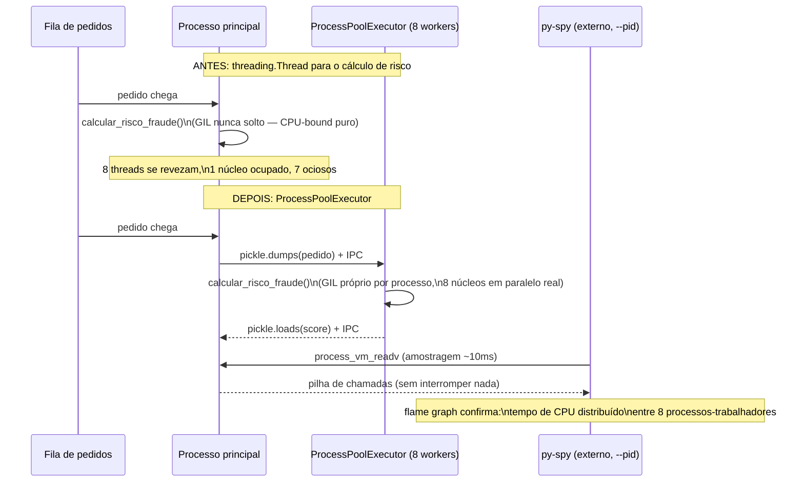

# Capstone — CPython internals

> [!abstract] TL;DR
> Esta nota fecha o Galho 6 amarrando as oito peças anteriores num único incidente de produção: um serviço de fulfillment de pedidos cujo RSS sobe sem parar e cuja latência de processamento piora a cada dia. O diagnóstico atravessa o galho inteiro, na ordem em que ele foi ensinado. Primeiro suspeita-se de vazamento, mas [[07 - Memory management — allocators, pymalloc e arenas|pymalloc]] explica por que RSS crescente nem sempre é bug — é preciso [[08 - Profiling — cProfile, py-spy, tracemalloc|`tracemalloc`]] para confirmar que os *objetos Python*, não só arenas retidas, estão de fato acumulando. A causa raiz é um **ciclo de referência** ([[02 - Objetos em CPython — PyObject, refcounting e tipos internos|`ob_refcnt`]] nunca chega a zero) mantido vivo por um `__del__` mal escrito e por um `gc.disable()` esquecido em produção — o [[03 - Reference counting e o Garbage Collector geracional|GC geracional]] que resolveria isso está desligado. Corrigido o vazamento com `weakref`, o time tenta acelerar o processamento com `threading` — e descobre, via [[04 - O GIL — o que é de verdade e por que existe|o GIL]], que o núcleo do trabalho é CPU-bound puro: `ob_refcnt++` não-atômico é exatamente o motivo de threads nunca paralelizarem esse tipo de carga. A saída real é [[05 - GIL e concorrência na prática — threading vs multiprocessing|`multiprocessing`]], com o custo de serialização via `pickle` explicitado e medido; [[06 - Free-threading — o GIL opcional (PEP 703)|free-threading]] é mencionado como a solução estrutural de longo prazo, honestamente descartada para hoje pelo estado do ecossistema de extensões C. O ganho final é confirmado com `cProfile` em desenvolvimento e `py-spy --pid` direto em produção — as mesmas ferramentas que, por baixo dos panos, sempre estiveram olhando para o motor descrito na primeira nota do galho: o [[01 - O interpretador por dentro — ceval loop e frame objects|ceval loop e os frame objects]] que executam cada linha desse serviço, do primeiro `import` ao último `return`.

## O problema: um serviço que fica mais lento a cada dia que roda

Uma equipe de plataforma mantém um serviço de **fulfillment de pedidos** — o processo que recebe um pedido aprovado, monta a árvore de itens e sub-itens (um pedido pode ter kits que se desdobram em itens individuais, cada um linkado de volta ao pedido pai para recalcular o total sempre que um item muda de status), aplica um cálculo de risco de fraude sobre cada pedido, e grava o resultado. O serviço roda como um processo Python de longa duração, consumindo pedidos de uma fila continuamente — não é um script batch que termina e libera tudo; ele **nunca reinicia** sozinho, salvo por um deploy ou por um `OOMKilled` do orquestrador de containers.

Duas semanas depois de subir uma versão nova, o time recebe dois alertas correlacionados, mas que a princípio parecem problemas diferentes:

1. **Memória**: o RSS do processo (memória residente, visível no `docker stats`/Grafana) sobe de 300 MB no boot para 2.4 GB depois de 20 horas rodando, e nunca cai — nem nos horários de menor volume da fila, quando o processo fica praticamente ocioso por minutos.
2. **Latência**: o tempo médio para processar um pedido, que era ~40ms no início do dia, sobe para ~180ms depois de algumas horas — e o `htop` mostra os núcleos da máquina cada vez mais ocupados, mesmo com o mesmo volume de pedidos por segundo.

A reação mais comum, e a mais cara em tempo perdido, é tratar isso como "vazamento de memória, deve ser algum cache sem limite" e sair caçando `del` faltando. Esta nota mostra por que essa reação está incompleta — e por que o diagnóstico correto exige exatamente as oito peças que as notas 01 a 08 deste galho ensinaram, uma de cada vez.

```mermaid
flowchart TD
    classDef falha fill:#FF6B6B24,stroke:#FF6B6B,color:#E9ECF2
    classDef neutro fill:#1B2029,stroke:#4E5666,color:#C6CCD8
    classDef destaque fill:#FFAA0024,stroke:#FFAA00,color:#E9ECF2
    A["RSS sobe de 300MB → 2.4GB\nlatência sobe de 40ms → 180ms"] --> B{"RSS crescente é\nvazamento real?"}
    B -->|"nota 07: pymalloc raramente\ndevolve arena ao SO"| C["Pode ser comportamento\nesperado do alocador"]
    C --> D["tracemalloc: comparar snapshots\n(nota 08)"]
    D -->|"objetos Python crescendo\nde fato, linha exata apontada"| E["Vazamento REAL confirmado\n— não é só retenção de arena"]
    E --> F["gc.collect() não libera nada\n→ suspeita de CICLO (nota 03)"]
    F --> G["ob_refcnt nunca zera\n(nota 02) — __del__ + gc.disable()\nmantêm o ciclo vivo"]
    G --> H["Corrigido com weakref\n(nota 03) — RSS estabiliza"]
    H --> I{"Latência ainda sobe\nsob carga?"}
    I -->|"sim, parte é CPU-bound"| J["threading não acelera —\nGIL protege ob_refcnt\n(nota 04)"]
    J --> K["multiprocessing.Pool\n(nota 05) — paralelismo real,\ncusto de pickle explícito"]
    K --> L["free-threading (nota 06)\nresolveria — não viável hoje,\necossistema C imaturo"]
    L --> M["cProfile em dev / py-spy em prod\nconfirmam o ganho (nota 08)"]
    M --> N["Motor por trás de tudo:\nceval loop + frames (nota 01)"]

    class A falha
    class B neutro
    class C destaque
    class D neutro
    class E falha
    class F neutro
    class G falha
    class H neutro
    class I neutro
    class J destaque
    class K neutro
    class L destaque
    class M neutro
    class N neutro
```



## Etapa 1: RSS crescente não é, por si só, prova de vazamento

O primeiro instinto de qualquer engenheiro vendo um gráfico de RSS subindo continuamente é gritar "vazamento" — e a [[07 - Memory management — allocators, pymalloc e arenas|nota 07]] deste galho já avisou explicitamente contra essa conclusão apressada. CPython usa **pymalloc** para objetos pequenos (até 512 bytes): memória é pedida ao sistema operacional em blocos grandes — **arenas** — e subdividida internamente em **pools** e **blocks**. A regra de liberação é estrita: uma arena só é devolvida ao SO quando **todos** os seus pools ficam vazios ao mesmo tempo, o que é raro num processo de longa duração como este, porque quase sempre sobra algum objeto de vida mais longa (uma configuração carregada uma vez, um objeto de conexão, um singleton) preso em algum canto de cada arena.

O time de plataforma, já familiarizado com essa nota, não sai caçando `del`s. O primeiro passo é medir os dois números que a nota 07 recomenda lado a lado — não confiar em RSS isoladamente:

```python
import sys
import resource

def diagnostico_memoria():
    blocos = sys.getallocatedblocks()
    rss_mb = resource.getrusage(resource.RUSAGE_SELF).ru_maxrss / 1024
    print(f"Blocos alocados (objetos Python vivos): {blocos}")
    print(f"RSS do processo: {rss_mb:.1f} MB")

diagnostico_memoria()
# ... processa pedidos por várias horas ...
diagnostico_memoria()
```

```text
Antes (boot):      Blocos: 210_400  | RSS: 310 MB
Depois (20h rodando): Blocos: 8_140_200 | RSS: 2400 MB
```

Esse é o primeiro fato que desmonta a hipótese benigna: se o crescimento fosse **só** retenção de arena (o cenário que a nota 07 descreveu como "comportamento esperado, não bug"), `sys.getallocatedblocks()` deveria voltar perto do baseline depois que os pedidos processados fossem descartados — porque os *objetos* teriam sido desalocados corretamente, só a memória física é que ficaria retida. Aqui não é isso que acontece: o número de blocos alocados **cresce quase 40 vezes**, na mesma proporção do RSS. Os objetos Python em si — não só as arenas que os hospedam — estão se acumulando. Isso descarta a hipótese "é só pymalloc sendo pymalloc" e aponta para algo mais sério: referências sendo mantidas vivas quando não deveriam.

> [!question]- Se `sys.getallocatedblocks()` já mostrou que os objetos crescem, por que não pular direto pra caçar o bug?
> Porque "os objetos crescem" ainda não diz **onde**, no código, isso está acontecendo — um serviço desse porte processa dezenas de tipos de objeto por segundo (pedidos, itens, respostas de API, linhas de log, resultados de cálculo de risco). `sys.getallocatedblocks()` é um contador agregado, útil para confirmar *que* existe crescimento real, mas inútil para apontar *qual* linha de código o está causando. É exatamente essa lacuna que a próxima ferramenta do galho preenche.

## Etapa 2: `tracemalloc` aponta a linha exata

A ferramenta certa para "onde, no código, a memória Python está crescendo" é `tracemalloc` — coberta na [[08 - Profiling — cProfile, py-spy, tracemalloc|nota 08]] deste galho como o complemento direto do que a nota 07 deixou em aberto. A técnica central não é olhar um snapshot isolado (que mostraria toda a memória legítima do processo, module cache, conexões, tudo misturado) — é **comparar dois snapshots tirados em momentos diferentes** e ver exatamente o que cresceu entre eles.

```python
import tracemalloc

tracemalloc.start()

snap1 = tracemalloc.take_snapshot()

# ... deixa o serviço processar pedidos por 30 minutos sob carga normal ...

snap2 = tracemalloc.take_snapshot()
diffs = snap2.compare_to(snap1, 'lineno')

for stat in diffs[:5]:
    print(stat)
```

```text
fulfillment/pedido.py:142: size=612.4 MiB (+612.4 MiB), count=1_847_200 (+1_847_200), average=350 B
fulfillment/pedido.py:38: size=89.2 MiB (+89.2 MiB), count=1_847_200 (+1_847_200), average=48 B
fulfillment/auditoria.py:22: size=4.1 MiB (+4.1 MiB), count=61_500 (+61_500), average=68 B
```

A linha 142 de `pedido.py` — o ponto exato em que cada `Item` é anexado à lista de itens do `Pedido` — é onde a esmagadora maioria do crescimento acontece, na mesma contagem de objetos (`1_847_200`) que a linha 38, onde cada `Item` recebe uma referência de volta ao `Pedido` pai. Duas linhas, contagens idênticas, cada uma criando metade de um par que se referencia mutuamente. Esse padrão — o mesmo número de objetos aparecendo em duas linhas que se referenciam entre si — é a assinatura clássica de um **ciclo de referência**, e é exatamente aqui que a nota 08 se encontra com as notas 02 e 03: `tracemalloc` confirmou que o crescimento é real (não pymalloc retendo arena); agora é preciso entender *por que* esses objetos nunca morrem.

## Etapa 3: o ciclo que `ob_refcnt` nunca resolve sozinho

### O que o código realmente faz

O modelo de dados do serviço é exatamente o tipo de estrutura bidirecional que a [[03 - Reference counting e o Garbage Collector geracional|nota 03]] deste galho citou como gerador natural de ciclos — "árvores com ponteiro para o pai" — sem que ninguém tenha escrito `a.x = b; b.x = a` de propósito:

```python
class Pedido:
    def __init__(self, id_pedido):
        self.id_pedido = id_pedido
        self.itens = []
        self.status = "criado"

    def adicionar_item(self, item):
        item.pedido = self          # linha 38 — item aponta de volta pro pedido
        self.itens.append(item)     # linha 142 — pedido aponta pro item


class Item:
    def __init__(self, sku, quantidade):
        self.sku = sku
        self.quantidade = quantidade
        self.pedido = None           # referência de volta ao pai

    def __del__(self):
        # "boa intenção": registrar no log de auditoria quando um item morre
        with open("auditoria.log", "a") as f:
            f.write(f"item {self.sku} do pedido {self.pedido.id_pedido} finalizado\n")
```

Cada `Pedido` tem uma lista de `Item`s (`self.itens`), e cada `Item` guarda uma referência de volta ao `Pedido` (`self.pedido`) — necessária para recalcular o total do pedido sempre que um item muda de status. Isso é, estruturalmente, exatamente o ciclo que a nota 02 descreveu com o exemplo mínimo de dois `No`: `pedido.itens[0].pedido is pedido` fecha o laço. Quando um pedido termina de ser processado e a variável local que o referenciava sai de escopo, `Py_DECREF` roda normalmente sobre `pedido` e sobre cada `item` — mas o `ob_refcnt` de `pedido` nunca chega a zero (ainda é referenciado por `item.pedido` de cada item), e o `ob_refcnt` de cada `item` nunca chega a zero (ainda é referenciado por `pedido.itens`). Reference counting, o mecanismo primário e determinístico descrito na nota 03, é **estruturalmente incapaz** de perceber esse tipo de situação — cada contador individual está correto, o problema é que eles se sustentam mutuamente.

### Por que o GC geracional não está limpando isso

A nota 03 é explícita: para exatamente esse caso — grupos de objetos inalcançáveis de fora que se referenciam entre si — existe um **segundo mecanismo**, o GC geracional do módulo `gc`, cuja única razão de existir é varrer ciclos. Se o serviço processa milhares de pedidos por hora e cada um forma um ciclo desse tipo, por que o `gc` não está limpando isso automaticamente, do jeito que faz silenciosamente na maioria dos programas Python?

A investigação encontra duas causas, empilhadas uma sobre a outra — e ambas já foram nomeadas como armadilhas reais nas notas 02/03/04 deste galho:

**Causa 1 — um `gc.disable()` esquecido.** Seis meses antes, sob pressão de um alerta de latência de cauda (p99), alguém do time aplicou exatamente a mitigação que a nota 03 descreveu como legítima **sob uma condição que não foi cumprida aqui**: desligar a varredura automática de ciclos para eliminar a variância que ela introduz.

```python
# main.py, adicionado há 6 meses, sem comentário explicando o porquê
import gc
gc.disable()   # "reduz p99 de latência" — mas ninguém revisou se o código forma ciclos
```

A nota 03 foi explícita sobre a condição para isso ser seguro: `gc.disable()` só é seguro em código que genuinamente não forma ciclos, ou que os limpa manualmente em pontos conhecidos. Nenhuma das duas condições era verdadeira aqui — o modelo `Pedido`/`Item` forma um ciclo a cada pedido processado, e ninguém chamava `gc.collect()` manualmente em lugar nenhum. O resultado é exatamente o que a nota 03 avisou: "trocar uma fonte de latência pequena e previsível por um vazamento de memória silencioso e crescente".

**Causa 2 — mesmo se o `gc` estivesse ligado, o `__del__` do `Item` complicaria a finalização.** A nota 03 dedicou uma seção inteira à história da [PEP 442](https://peps.python.org/pep-0442/): antes do Python 3.4, ciclos contendo objetos com `__del__` **não podiam ser coletados com segurança** e iam parar, permanentemente, em `gc.garbage` — um vazamento documentado como limitação da linguagem. A PEP 442 resolveu isso, e hoje (CPython 3.12+, a versão em produção deste serviço) o `gc`, se estivesse ligado, conseguiria finalizar e coletar esse ciclo normalmente. Mas o `__del__` do `Item` ainda carrega o problema que a nota 03 alertou mesmo pós-PEP 442: **ordem de finalização dentro de um ciclo não é garantida**. Se o `Pedido` for finalizado antes do `Item` (uma ordem tão válida quanto a inversa), `self.pedido.id_pedido` dentro de `__del__` pode acessar um `Pedido` já parcialmente destruído — um `AttributeError` silencioso, engolido porque exceções dentro de `__del__` só geram um aviso no `stderr`, nunca propagam.



### A correção: `weakref` no lado que não precisa manter o outro vivo

A saída elegante que a nota 03 descreveu é exatamente o desenho certo aqui: o `Pedido` **precisa** manter uma referência forte aos seus `Item`s (a árvore precisa navegar para baixo, para recalcular o total), mas o `Item` **não precisa** manter uma referência forte de volta ao `Pedido` — ele só precisa conseguir *ler* o pedido pai quando necessário. Isso é exatamente o padrão canônico de árvore com ponteiro para o pai que a nota 03 resolveu com `weakref.ref`:

```python
import weakref

class Item:
    def __init__(self, sku, quantidade):
        self.sku = sku
        self.quantidade = quantidade
        self._pedido_ref = None   # referência FRACA — não incrementa ob_refcnt do pedido

    @property
    def pedido(self):
        return self._pedido_ref() if self._pedido_ref else None

    def __del__(self):
        pedido = self.pedido
        if pedido is not None:   # defensivo: pedido pode já ter sido coletado
            with open("auditoria.log", "a") as f:
                f.write(f"item {self.sku} do pedido {pedido.id_pedido} finalizado\n")


class Pedido:
    def adicionar_item(self, item):
        item._pedido_ref = weakref.ref(self)   # não conta pro refcount do Pedido
        self.itens.append(item)
```

Com `item._pedido_ref` fraca, `pedido.itens[0]._pedido_ref()` ainda devolve o `Pedido` enquanto ele estiver vivo — mas deixa de contar para o `ob_refcnt` dele. Assim que a última referência **forte** ao `Pedido` (a variável local do processamento) sai de escopo, o refcounting sozinho já zera o contador e desaloca — sem depender do `gc` geracional rodar para perceber o ciclo, porque **o ciclo deixou de existir como ciclo de refcounting**. O time também reverte o `gc.disable()` esquecido, restaurando a rede de segurança para qualquer outro ciclo acidental que o código ainda formar sem que ninguém tenha percebido.

Depois do deploy dessa correção, `sys.getallocatedblocks()` volta a oscilar em torno de um baseline estável ao longo do dia inteiro, e o RSS para de crescer sem limite — o primeiro dos dois alertas está resolvido. Mas o segundo alerta, latência de processamento subindo sob carga, continua de pé.

## Etapa 4: threads não resolvem — e o motivo é o mesmo `ob_refcnt` da etapa anterior

### A tentativa óbvia: paralelizar com `threading`

Com o vazamento resolvido, o time volta para a latência. O cálculo de risco de fraude — uma função pura em Python que normaliza endereço, aplica um conjunto de regras heurísticas e calcula um score — é o trecho mais pesado de CPU do pipeline, cerca de 15ms por pedido. Sob pico, com 200 pedidos/segundo chegando na fila, o processamento serial não dá vazão. A reação, natural para quem vem de uma linguagem com threads nativas de verdade, é paralelizar:

```python
import threading

def processar_lote(pedidos):
    threads = []
    for pedido in pedidos:
        t = threading.Thread(target=calcular_risco_fraude, args=(pedido,))
        t.start()
        threads.append(t)
    for t in threads:
        t.join()

# 8 threads, máquina com 8 núcleos — "deveria" dar ~8x de vazão
```

O resultado, medido em produção, é praticamente idêntico ao processamento sequencial — às vezes um pouco pior, pelo overhead de troca de contexto entre threads. É o exato experimento que a [[04 - O GIL — o que é de verdade e por que existe|nota 04]] mediu diretamente: `htop` mostra um núcleo perto de 100% e os outros sete ociosos, não oito núcleos trabalhando.

### Por que — o mesmo `ob_refcnt` da etapa 3, agora sob outra luz

A explicação não é nova: é a mesma peça central que resolveu (e quase não resolveu) o ciclo de referência da etapa anterior. A nota 04 nomeou o núcleo técnico: `ob_refcnt++`/`--` **não são operações atômicas** em C — são leitura, incremento, escrita, três passos separados — e o cálculo de risco de fraude, por ser Python puro do início ao fim (normalização de string, comparações, acumulação de score), aloca e desaloca uma quantidade enorme de objetos temporários pequenos (`PyObject`s vistos na [[02 - Objetos em CPython — PyObject, refcounting e tipos internos|nota 02]]) a cada chamada — cada um manipulando `ob_refcnt` a cada `Py_INCREF`/`Py_DECREF`. Se duas threads rodassem esse código verdadeiramente em paralelo, sem coordenação, os contadores de referência corromperiam por *lost update* — o cenário que a nota 04 descreveu em detalhe, com o risco catastrófico de *use-after-free*.

O **GIL** existe precisamente para que isso nunca aconteça: só uma thread executa bytecode Python por vez, protegendo `ob_refcnt` sem exigir um lock por objeto. E como o cálculo de risco de fraude é **CPU-bound puro** — nenhuma chamada de I/O bloqueante, nenhuma extensão C liberando o lock via `Py_BEGIN_ALLOW_THREADS` — nenhuma thread jamais solta o GIL espontaneamente durante o cálculo. Oito threads rodando essa função só se revezam, uma de cada vez, no mesmo núcleo lógico do interpretador — exatamente o resultado medido.

> [!question]- Mas o serviço também faz I/O (ler da fila, gravar o resultado) — por que threads não ajudam nem nessa parte?
> Ajudariam, e de fato ajudam: a nota 04 e a [[05 - GIL e concorrência na prática — threading vs multiprocessing|nota 05]] deste galho são explícitas que `threading`/`asyncio` aceleram genuinamente trabalho I/O-bound, porque o GIL é solto durante a espera bloqueante (leitura da fila, escrita no banco). O problema medido aqui é especificamente o trecho **CPU-bound** do pipeline — o cálculo de risco de fraude — que já estava rodando dentro de um `ThreadPoolExecutor` que o time já usava (corretamente) para as pontas de I/O do serviço. A confusão comum, que a nota 04 nomeia como armadilha, é achar que a mesma ferramenta (`threading`) resolve os dois tipos de trabalho igualmente bem — não resolve, e distinguir qual fatia do pipeline é qual é exatamente o trabalho de diagnóstico desta etapa.

### A saída real: `multiprocessing`, com o custo de serialização explicitado

A [[05 - GIL e concorrência na prática — threading vs multiprocessing|nota 05]] deste galho já havia estabelecido a regra prática: CPU-bound de verdade pede `multiprocessing` — processos inteiros do sistema operacional, cada um com seu próprio interpretador CPython e seu próprio GIL independente, rodando de fato em núcleos diferentes ao mesmo tempo. O time reescreve o trecho de cálculo de risco:

```python
from concurrent.futures import ProcessPoolExecutor

def calcular_risco_fraude(pedido_serializavel):
    # normalização de endereço, regras heurísticas, score — CPU-bound puro
    ...
    return score

if __name__ == "__main__":
    with ProcessPoolExecutor(max_workers=8) as executor:
        scores = list(executor.map(calcular_risco_fraude, lote_de_pedidos, chunksize=20))
```

O `htop` finalmente mostra oito núcleos trabalhando de verdade — a primeira vitória real sobre o GIL. Mas, como a nota 05 avisou, o ganho medido fica abaixo do 8x ingênuo, porque cada `Pedido` passado para `executor.map()` precisa ser **serializado via `pickle`**, transportado por IPC até o processo-trabalhador, e desserializado do outro lado antes que o cálculo comece — um custo que não existia na versão com `threading`, porque threads do mesmo processo já enxergam o mesmo objeto `Pedido` diretamente, sem cópia nenhuma.

O time mede esse custo diretamente, no mesmo espírito da nota 05: um `Pedido` com sua lista de itens (agora sem o ciclo, graças à correção da etapa 3 — um detalhe que importa aqui, porque um objeto com `__del__` e referências circulares residuais seria mais lento e mais arriscado de serializar) é uma estrutura pequena o suficiente (poucos KB) para que `pickle` domine uma fração pequena, mas não desprezível, do tempo por tarefa. Usar `chunksize=20` no `executor.map()` — agrupando 20 pedidos por dispatch em vez de um por vez — amortiza o custo fixo de cada IPC entre processos sobre um lote maior, exatamente a mitigação que a nota 05 recomendou para tarefas curtas. O time também avalia (e descarta, por enquanto) `multiprocessing.shared_memory`: a nota 05 é clara que essa técnica só compensa para payloads grandes — arrays, buffers binários — e um `Pedido` individual é pequeno demais para justificar a complexidade de gerenciar um bloco de memória compartilhada manualmente.

## Etapa 5: por que não simplesmente adotar free-threading?

Alguém no time, lendo sobre o assunto, pergunta: já que a Python 3.14 tem um build oficialmente suportado sem GIL, por que não migrar para `python3.14t` e ganhar paralelismo real de `threading` sem pagar o custo de serialização do `multiprocessing`? A [[06 - Free-threading — o GIL opcional (PEP 703)|nota 06]] deste galho já antecipou exatamente essa pergunta, e a resposta honesta hoje é não — por três razões concretas que a nota nomeou:

1. **O ecossistema de extensões C do serviço não está auditado.** O pipeline usa uma biblioteca de parsing de endereço com extensão C de terceiros cuja compatibilidade com free-threading não está documentada. Se essa extensão não declarar suporte explícito (`Py_mod_gil`), o interpretador **reativa o GIL para o processo inteiro** ao importá-la — silenciosamente, com apenas um `RuntimeWarning` nos logs — apagando exatamente o benefício que motivaria a migração.
2. **O overhead de single-thread é real e mensurado.** A PEP 779 estabelece um teto formal de 15% de overhead single-thread para o build free-threaded — um custo pago por **todo** o serviço, inclusive a fração I/O-bound que já roda bem hoje com `threading`/`asyncio` no build padrão, mesmo que só uma fração pequena do pipeline se beneficiasse do paralelismo real de threads.
3. **É uma adoção deliberada, não um flag.** A nota 06 nomeou o critério de decisão: só vale a pena quando há carga CPU-bound multi-thread genuína **e** toda a árvore de dependências C está auditada contra o [tracker de compatibilidade da comunidade](https://py-free-threading.github.io/tracking/). Nenhuma das duas condições está satisfeita hoje para este serviço específico — e o `multiprocessing.Pool` da etapa anterior já resolve o problema real, com um custo de serialização conhecido e aceito, sem o risco de uma dependência transitiva reativar silenciosamente uma garantia que o time acabou de assumir que existia.

A decisão registrada — e revisitável quando o ecossistema amadurecer — é continuar no build padrão com GIL, usando `multiprocessing` para a fração CPU-bound do pipeline. Free-threading fica como item de observação, não de adoção.

## Etapa 6: confirmando o ganho — e o motor por trás de tudo

### `cProfile` em desenvolvimento, antes do deploy

Antes de levar a mudança para produção, o time confirma em ambiente de desenvolvimento que o gargalo identificado é, de fato, o cálculo de risco de fraude — não uma suposição. `cProfile`, coberto na [[08 - Profiling — cProfile, py-spy, tracemalloc|nota 08]] deste galho, é o profiler certo aqui: ambiente controlado, processo que pode ser reiniciado à vontade, sem risco de degradar usuários reais.

```python
import cProfile
import pstats

profiler = cProfile.Profile()
profiler.enable()
processar_lote_de_teste(pedidos_amostra)
profiler.disable()

stats = pstats.Stats(profiler)
stats.sort_stats('cumulative')
stats.print_stats(10)
```

```text
   ncalls  tottime  percall  cumtime  percall filename:lineno(function)
     5000    0.081    0.000    0.089    0.000 fraude.py:14(calcular_risco_fraude)
     5000    0.061    0.000    0.061    0.000 fraude.py:22(normalizar_endereco)
     5000    0.004    0.000    0.093    0.000 pedido.py:88(processar_pedido)
```

`cumtime` de `calcular_risco_fraude` domina, e o `tottime` alto tanto na função em si quanto em `normalizar_endereco` (chamada dentro dela) confirma que o tempo pesado está genuinamente nesse trecho, não sendo só repassado adiante — exatamente a leitura de `tottime`/`cumtime` que a nota 08 ensinou. Isso valida, antes do deploy, que migrar esse trecho específico para `multiprocessing` ataca o gargalo real, não um sintoma adjacente.

### `py-spy` em produção, depois do deploy — sem reiniciar nada

Depois do deploy da versão com `ProcessPoolExecutor`, o time quer confirmar o ganho **no processo real de produção**, sob carga real — e não repete o erro que a abertura da nota 08 descreveu (ligar `cProfile` direto num processo de produção, multiplicando o próprio problema por um fator de ~4x de overhead). A ferramenta certa é `py-spy`, anexando ao processo já rodando, sem reiniciar nada:

```bash
sudo py-spy record -o antes_depois.svg --pid 51204 --duration 30
```



O flame graph gerado por `py-spy record` mostra a diferença de forma visual e imediata: antes, o tempo de CPU concentrado num único caminho de execução (uma thread de cada vez, revezando); depois, oito processos-trabalhadores aparecem como caminhos paralelos na amostragem, cada um efetivamente ocupando seu próprio núcleo. A latência média de processamento sob o mesmo volume de pedidos cai de ~180ms para ~55ms — não os 8x ingênuos que a intuição sugeriria (o custo de serialização via `pickle`, medido e aceito na etapa anterior, consome parte do ganho), mas uma melhora real e mensurável, confirmada sem reiniciar o processo de produção nem arriscar degradar mais o serviço durante a medição.

### O motor que sempre esteve por baixo de tudo isso

Vale fechar o ciclo nomeando o que ficou implícito do início ao fim deste diagnóstico: cada `Pedido` criado, cada `item.pedido` atribuído, cada chamada a `calcular_risco_fraude`, cada `Py_INCREF`/`Py_DECREF` disparado por essas operações — tudo isso é, no nível mais fundamental, bytecode sendo decodificado e executado pelo mesmo mecanismo que a [[01 - O interpretador por dentro — ceval loop e frame objects|nota 01]] deste galho abriu: o laço `_PyEval_EvalFrameDefault`, em `ceval.c`, consumindo uma instrução por vez, empilhando e desempilhando operandos na pilha de avaliação de cada `_PyInterpreterFrame`. A especialização adaptativa da PEP 659 — instruções como `BINARY_OP`/`LOAD_ATTR` sendo reescritas para formas mais rápidas depois de rodarem repetidamente com os mesmos tipos — é, inclusive, parte do motivo de `normalizar_endereco` já rodar mais rápido depois de algumas centenas de chamadas de aquecimento do que rodaria "a frio". Nada nas etapas 1 a 5 desta capstone contradisse esse motor; cada peça — pymalloc, `PyObject`/`ob_refcnt`, o GC geracional, o GIL, `multiprocessing`, profiling — é uma camada construída **em cima** dele, e entender o motor é o que torna as outras sete peças coerentes entre si, não sete fatos soltos para decorar separadamente.

## Casos práticos

### Cenário 1: o mesmo ciclo, sem `__del__`, ainda seria um problema?

Sim — a ausência de `__del__` no `Item` teria tornado a coleta do ciclo **mais simples** para o `gc` geracional (sem o risco de ordem de finalização instável que a PEP 442 mitiga, mas não elimina), mas não teria evitado o vazamento enquanto `gc.disable()` estivesse ativo. Refcounting sozinho, como a nota 03 estabeleceu, nunca zera um ciclo — com ou sem `__del__` envolvido. O `__del__` mal escrito piorou o diagnóstico (um `AttributeError` engolido silenciosamente durante finalização instável) e tornou o `weakref` uma correção ainda mais claramente superior a "só religar o `gc`", porque `weakref` remove o ciclo da equação por completo, independente do estado de `gc.enable()`/`gc.disable()` em qualquer ponto futuro do código.

### Cenário 2: por que não usar `gc.collect()` manual em vez de `weakref`?

Era uma opção — chamar `gc.collect()` periodicamente (por exemplo, a cada N pedidos processados) teria, de fato, limpado os ciclos acumulados, com o `gc` ligado de novo. Mas essa correção trata o **sintoma**, não a causa: o padrão de dados continuaria formando um ciclo a cada pedido, e a decisão de "quando é seguro chamar `gc.collect()` manual" viraria uma peça extra de complexidade operacional (que frequência? qual overhead de CPU isso adiciona sob pico?) que `weakref` simplesmente elimina ao design do modelo de dados nunca formar o ciclo em primeiro lugar. A nota 03 já registrou essa hierarquia de preferência: `weakref` quando o ciclo é previsível de antemão (é exatamente o caso de uma árvore com ponteiro para o pai); `gc` geracional como rede de segurança para ciclos que ninguém previu ao escrever o código, não como muleta permanente para um padrão de dados conhecido.

### Cenário 3: o mesmo diagnóstico, mas o "vazamento" é de verdade em outra parte do serviço

Vale registrar o caso oposto, para não deixar a impressão de que todo RSS crescente esconde um ciclo de referência. Meses depois deste incidente, o mesmo serviço recebe um novo alerta de memória — desta vez, `tracemalloc` aponta o crescimento para uma única linha, sem par simétrico: um dicionário de cache de configuração (`_cache_config`, uma variável de módulo) que cresce sem limite, uma chave nova por cliente atendido, nunca removida.

```python
# Antes: dict sem limite, uma entrada nova por cliente, para sempre
_cache_config: dict[str, dict] = {}

def obter_config(cliente_id):
    if cliente_id not in _cache_config:
        _cache_config[cliente_id] = carregar_config_do_banco(cliente_id)
    return _cache_config[cliente_id]

# Depois: limite explícito de tamanho, entradas antigas descartadas (LRU)
from functools import lru_cache

@lru_cache(maxsize=10_000)
def obter_config(cliente_id):
    return carregar_config_do_banco(cliente_id)
```

Não há ciclo aqui — é uma referência forte, simples e direta, mantida viva de propósito (um cache), só que sem política de expiração. A correção não é `weakref` nem `gc` — é, simplesmente, um `functools.lru_cache(maxsize=...)` ou um `TTLCache` de terceiros no lugar do dicionário sem limite.

O ponto pedagógico importa mais que a correção em si: o mesmo conjunto de ferramentas (`sys.getallocatedblocks()`, `tracemalloc`) diagnostica os dois problemas, mas a *assinatura* no diff de snapshots é diferente. Um ciclo de referência (nota 03) aparece como duas linhas com contagens simétricas, cada uma referenciando a outra. Um cache sem limite aparece como uma única linha crescendo isolada e monotonicamente — uma referência forte sem limite, um bug de política de cache, não de gerenciamento de memória do interpretador. Confundir os dois leva a aplicar a correção errada: `weakref` não ajudaria em nada aqui, porque não há ciclo nenhum para quebrar.

### Fundamento: por que este diagnóstico só funciona na ordem em que foi feito

Vale nomear explicitamente o motivo estrutural de as seis etapas desta capstone terem que rodar nessa ordem, e não em qualquer outra — não é só estilo narrativo, é uma dependência causal real entre os mecanismos.

Confirmar que a memória Python cresce (`tracemalloc`, etapa 2) só faz sentido depois de descartar retenção de arena (`pymalloc`, etapa 1), porque os dois produzem o mesmo sintoma de RSS por mecanismos diferentes — investigar a etapa 2 sem passar pela 1 arrisca "consertar" um comportamento que já era esperado.

Diagnosticar o ciclo de referência (etapa 3) só faz sentido depois de confirmar que o crescimento é de objetos Python de verdade, não de arenas — do contrário, o time estaria caçando um ciclo que não existe.

E a decisão entre `threading` e `multiprocessing` (etapa 4) só pode ser tomada depois que a etapa 3 resolveu o vazamento — um processo vazando memória via ciclo de referência, se paralelizado ingenuamente antes da correção, apenas multiplicaria o vazamento por N processos, mascarando ainda mais a causa raiz sob uma camada adicional de paralelismo real.

Cada etapa deste diagnóstico depende logicamente da anterior ter sido resolvida primeiro — a mesma dependência em cadeia que a sequência das oito notas do galho já impôs: entender `PyObject`/`ob_refcnt` (nota 02) é pré-requisito de entender por que ciclos escapam do refcounting (nota 03), que por sua vez é pré-requisito de entender por que o GIL protege exatamente esse mesmo `ob_refcnt` (nota 04). A ordem do galho não é arbitrária, e o diagnóstico desta capstone só faz sentido porque segue essa mesma cadeia de dependência conceitual.

## Armadilhas comuns

> [!warning] Tratar RSS crescente como vazamento sem medir `sys.getallocatedblocks()`/`tracemalloc` primeiro
> **O que acontece:** o time gasta dias caçando um "vazamento" que, na verdade, é retenção normal de arena pelo pymalloc (nota 07) — ou, no sentido oposto, descarta um vazamento real assumindo "deve ser só o alocador". **Por quê:** os dois cenários produzem o mesmo sintoma superficial (RSS que só cresce) por mecanismos completamente diferentes — um é comportamento esperado do alocador, o outro é um bug de referências. **Como evitar:** sempre medir os dois números lado a lado antes de investigar qualquer um a fundo — contagem de objetos (`sys.getallocatedblocks()`/`tracemalloc`) e RSS físico. Se o primeiro cai e o segundo não, é pymalloc; se os dois sobem juntos, é vazamento real.

> [!warning] Desligar `gc.disable()` "por performance" sem revisar se o código forma ciclos
> **O que acontece:** ganho de latência de cauda no curto prazo, vazamento de memória silencioso e crescente no médio prazo — exatamente o padrão descrito nesta capstone. **Por quê:** `gc.disable()` só é seguro quando o código genuinamente não forma ciclos, ou os limpa manualmente em pontos conhecidos — nenhuma das duas condições é automática, e código com árvores de ponteiro para o pai, Observer, ou closures capturando `self` forma ciclos o tempo todo sem que ninguém escreva isso deliberadamente. **Como evitar:** qualquer `gc.disable()` em produção deveria vir acompanhado de uma auditoria explícita de que o modelo de dados do serviço não forma ciclos — e de um comentário no código explicando essa decisão, para que a próxima pessoa não precise redescobrir o raciocínio via um incidente.

> [!warning] Trocar `threading` por `multiprocessing` mecanicamente, sem medir o custo de serialização
> **O que acontece:** esperar um ganho linear de N vezes com N processos e obter bem menos, ou até nenhum ganho líquido para tarefas muito pequenas ou payloads muito grandes. **Por quê:** todo dado que cruza a fronteira entre processos paga `pickle` + IPC — um custo que não existe entre threads do mesmo processo, e que pode dominar o tempo total se as tarefas forem curtas ou os objetos grandes. **Como evitar:** medir o ganho líquido com dados reais, ajustar `chunksize` para amortizar o custo fixo de dispatch entre processos, e considerar `shared_memory` só quando o volume de dados por tarefa justificar a complexidade adicional — a mesma disciplina que a nota 05 recomendou.

> [!warning] Adotar free-threading como resposta reflexa ao ler sobre a PEP 703
> **O que acontece:** migrar um serviço para `python3.14t` sem auditar as dependências C, e descobrir em produção que uma extensão desatualizada reativou o GIL silenciosamente — pagando o overhead de single-thread do build free-threaded sem nenhum dos benefícios. **Por quê:** o build free-threaded não é uma flag de runtime — é uma mudança estrutural de ABI e alocador, com um ecossistema de extensões C ainda em transição, exatamente como a nota 06 documentou. **Como evitar:** tratar a decisão como deliberada e auditada — carga CPU-bound multi-thread genuína **e** toda extensão C na árvore de dependências verificada contra o tracker de compatibilidade da comunidade — antes de considerar a migração.

## Em entrevista

Um cenário como este — memória crescendo e latência subindo ao mesmo tempo — é o tipo de pergunta de sistema aberta que entrevistas seniores de Python usam para testar se o candidato sabe **encadear** mecanismos, não só nomeá-los isoladamente.

> "I'd start by not assuming it's a leak — CPython's small-object allocator, pymalloc, rarely returns memory to the OS even after objects are correctly freed, so growing RSS alone isn't proof of a bug. I'd compare `sys.getallocatedblocks()` before and after a load window: if that count keeps climbing in step with RSS, real Python objects are accumulating, not just retained arenas. From there, `tracemalloc` — comparing two snapshots — points to the exact line where the growth happens. If two lines with matching allocation counts reference each other, that's the signature of a reference cycle: objects that keep each other's refcount above zero even though nothing external reaches them anymore. Reference counting alone structurally can't collect that — it's what the generational GC exists for — so I'd check whether `gc` is actually enabled and whether any `__del__` methods complicate finalization order. The fix I'd reach for first is `weakref` on whichever side of the cycle doesn't need to keep the other object alive — it removes the cycle from the equation entirely, rather than depending on GC sweeps to catch it. For the latency half of the problem, if the hot path is CPU-bound pure Python, threading won't help — the GIL exists specifically to keep refcount updates safe across threads, and it's never released for pure bytecode execution. The real fix is `multiprocessing`, with the serialization cost between processes measured and accepted as a real trade-off, not ignored. And I'd confirm all of this with data — `cProfile` in a disposable dev environment, `py-spy --pid` attached directly to the live process for anything I can't afford to restart — rather than assuming any of these mechanisms without measuring."

Uma pergunta de acompanhamento provável: **"por que você não simplesmente ligou `gc.collect()` de novo em vez de investigar tanto?"** — a resposta sênior distingue tratar sintoma de tratar causa: reativar o `gc` teria parado o crescimento sem custo de reescrever código, mas deixaria o padrão de dados formando um ciclo a cada pedido, dependente para sempre de uma varredura periódica rodar a tempo — `weakref` remove a própria possibilidade do ciclo existir, e é a correção estruturalmente mais robusta quando o padrão cíclico é conhecido de antemão, como é o caso de uma árvore com ponteiro para o pai.

> [!question]- O entrevistador pergunta: "e se a extensão de parsing de endereço já suportasse free-threading — você migraria?"
> Mesmo nesse caso hipotético, a resposta sênior pondera o overhead de single-thread (5-15%, segundo a PEP 779) contra o ganho: se a fração CPU-bound do pipeline for pequena relativa ao tempo total dominado por I/O, esse overhead pago por **todo** o serviço pode não compensar o ganho de paralelismo numa fatia menor dele. `multiprocessing` já resolve o problema real, com um custo de serialização conhecido e mensurado — trocar uma solução funcionando por uma tecnologia mais nova exige que o ganho líquido, medido, justifique a migração, não só a atratividade da tecnologia em si.

## Como explicar em inglês

> Diagnosing "memory keeps growing and processing keeps slowing down" in a long-running Python service means working through the whole memory-and-concurrency stack in order, not jumping to a fix. Growing RSS alone isn't proof of a leak — CPython's pymalloc allocator rarely releases memory back to the OS even after objects are correctly freed. Comparing `sys.getallocatedblocks()` snapshots over time confirms whether real Python objects are accumulating; `tracemalloc.take_snapshot()`/`compare_to()` then points to the exact line. Two lines with matching allocation counts that reference each other is the signature of a reference cycle — something reference counting alone can never collect, because each object's counter never reaches zero on its own. That's exactly what the generational garbage collector exists for, and finding it disabled (`gc.disable()`) or complicated by an unsafe `__del__` is a common root cause; `weakref` on the side of the cycle that doesn't need to keep the other object alive is the structural fix. For a CPU-bound hot path in the same service, `threading` won't parallelize it — the GIL exists specifically to keep `ob_refcnt` updates safe across threads, and pure Python bytecode never releases it — so `multiprocessing` is the real answer, with the pickle-based IPC cost between processes measured and accepted as a real, non-zero trade-off. Free-threading (PEP 703) would eventually remove that trade-off, but adopting it today requires auditing every C extension in the dependency tree for compatibility — not something to reach for reflexively. Confirming the fix with `cProfile` in development and `py-spy --pid` directly against the live process, without ever restarting it, closes the loop with real measurements instead of assumptions.

| PT | EN |
|---|---|
| ciclo de referência | reference cycle |
| memória retida pelo alocador | allocator-retained memory |
| contagem de referências não-atômica | non-atomic reference counting |
| referência fraca | weak reference |
| paralelismo real | true/genuine parallelism |
| custo de serialização | serialization cost |
| build sem GIL | free-threaded build |
| amostragem de pilha de chamadas | call stack sampling |
| motor do interpretador | interpreter engine |

## Fechamento do Galho 6 — CPython internals

Esta é a última nota do Galho 6. Recapitulando o que as oito notas cobriram juntas:

1. [[01 - O interpretador por dentro — ceval loop e frame objects|01 — O interpretador por dentro: ceval loop e frame objects]] abriu a caixa da VM que a trilha Core deixou fechada: `_PyEval_EvalFrameDefault`, o laço em `ceval.c` que decodifica bytecode uma instrução por vez, os frames divididos (desde a 3.11) em `_PyInterpreterFrame` leve e `PyFrameObject` pesado sob demanda, a pilha de avaliação por frame, e a especialização adaptativa (PEP 659) que reescreve instruções quentes em tempo real.
2. [[02 - Objetos em CPython — PyObject, refcounting e tipos internos|02 — Objetos em CPython: PyObject, refcounting e tipos internos]] mostrou a struct de cabeçalho que todo objeto Python carrega — `ob_refcnt`/`ob_type` — o custo real de "tudo é objeto" em memória, e os dois caches (small int, string interning) que tornam `is` traiçoeiro fora de sua faixa segura.
3. [[03 - Reference counting e o Garbage Collector geracional|03 — Reference counting e o Garbage Collector geracional]] estabeleceu o mecanismo primário e determinístico de liberação de memória, seu ponto cego estrutural (ciclos de referência), e o GC geracional como o mecanismo secundário que existe só para esse ponto cego — com `weakref` como a saída que evita depender dele quando o ciclo é previsível.
4. [[04 - O GIL — o que é de verdade e por que existe|04 — O GIL: o que é de verdade e por que existe]] revelou o motivo real do lock — proteger `ob_refcnt` contra corrida entre threads, já que incrementar/decrementar não é atômico em C — e por que isso implica que `threading` acelera I/O-bound mas nunca CPU-bound puro.
5. [[05 - GIL e concorrência na prática — threading vs multiprocessing|05 — GIL e concorrência na prática: threading vs multiprocessing]] deu a saída estrutural para CPU-bound — processos com GIL independente — e o preço real dessa saída: serialização via `pickle`, IPC, e `shared_memory` como mitigação para payloads grandes.
6. [[06 - Free-threading — o GIL opcional (PEP 703)|06 — Free-threading: o GIL opcional (PEP 703)]] cobriu a terceira via, ainda emergente: biased reference counting, objetos imortais, critical sections — e o estado honesto de um ecossistema de extensões C em transição, tornando a adoção hoje uma escolha deliberada, não um padrão.
7. [[07 - Memory management — allocators, pymalloc e arenas|07 — Memory management: allocators, pymalloc e arenas]] completou o quadro físico — de onde vem a memória de um `PyObject` — com a hierarquia arena/pool/block, e a distinção crucial entre "objetos desalocados" e "memória devolvida ao SO", a fonte de tanta confusão sobre RSS que só cresce.
8. [[08 - Profiling — cProfile, py-spy, tracemalloc|08 — Profiling: cProfile, py-spy, tracemalloc]] entregou as ferramentas que tornam tudo isso observável em código real — profiling determinístico vs. amostragem, e `tracemalloc` como a técnica certa para distinguir vazamento real de retenção de alocador.
9. Esta nota fechou amarrando as oito num incidente só: um serviço com vazamento real (ciclo + `gc.disable()` + `__del__` frágil, corrigido com `weakref`) e um gargalo de CPU (GIL impedindo `threading`, resolvido com `multiprocessing`, com free-threading nomeado e honestamente descartado por hoje), confirmado ponta a ponta com `cProfile`/`py-spy` — sobre o motor de `ceval.c` que sempre esteve rodando por baixo de cada linha.

Juntas, essas oito notas formam **o modelo mental de como CPython gerencia memória, threads e observabilidade por dentro** — não como curiosidade de implementação, mas como o conjunto de mecanismos que separa quem decora sintomas ("Python vaza memória", "Python é ruim em concorrência") de quem sabe diagnosticar a causa raiz e escolher a correção certa, mecanismo por mecanismo.

## O que vem a seguir

Esta capstone resolveu um incidente concreto usando `threading`/`multiprocessing` no nível que este galho cobriu — o suficiente para explicar *por que* cada ferramenta se comporta como se comporta, mas deliberadamente sem entrar nos padrões de produção mais avançados que várias notas deste galho já prometeram adiar: pools de threads/processos configurados para carga real, filas de tarefas distribuídas, `asyncio` em profundidade, sincronização fina entre threads (`Lock`, `Semaphore`, `Condition`), e a decisão híbrida de arquitetura entre I/O-bound e CPU-bound dentro do mesmo serviço. É exatamente esse aprofundamento que o próximo galho da trilha assume como ponto de partida.

- **[[03-Dominios/Tecnologia/Python/Concorrência e paralelismo/index|Galho 7 — Concorrência e paralelismo]]** (ainda não escrito) — pega o entendimento do GIL, `threading`, `multiprocessing` e `asyncio` construído aqui e aplica a padrões de produção reais: `ThreadPoolExecutor`/`ProcessPoolExecutor` em detalhe, filas de tarefas distribuídas (Celery, RQ), `async`/`await` na prática, e quando cada modelo compensa a reescrita que exige — o degrau natural depois de entender por que cada ferramenta existe.
- [[05 - GIL e concorrência na prática — threading vs multiprocessing|05 — GIL e concorrência na prática]] e [[06 - Free-threading — o GIL opcional (PEP 703)|06 — Free-threading]] — ambas já apontam explicitamente para o Galho 7 como o lugar do aprofundamento que esta capstone não tentou repetir.
- [[03-Dominios/Tecnologia/Python/index|Trilha Python]] — MOC da trilha.

## Fontes

- Python Software Foundation. *sys.getallocatedblocks*, *sys.getrefcount*, *sys.getsizeof*, *sys.setswitchinterval*. docs.python.org, versão 3.14. https://docs.python.org/3/library/sys.html (acessado em 2026-07-10)
- Python Software Foundation. *gc — Garbage Collector interface*. docs.python.org, versão 3.14. https://docs.python.org/3/library/gc.html (acessado em 2026-07-10)
- Python Software Foundation. *weakref — Weak references*. docs.python.org, versão 3.14. https://docs.python.org/3/library/weakref.html (acessado em 2026-07-10)
- Python Software Foundation. *tracemalloc — Trace memory allocations*. docs.python.org, versão 3.14. https://docs.python.org/3/library/tracemalloc.html (acessado em 2026-07-10)
- Python Software Foundation. *The Python Profilers — `profile` e `cProfile`*. docs.python.org, versão 3.14. https://docs.python.org/3/library/profile.html (acessado em 2026-07-10)
- Python Software Foundation. *multiprocessing — Process-based parallelism* e *multiprocessing.shared_memory*. docs.python.org, versão 3.14. https://docs.python.org/3/library/multiprocessing.html (acessado em 2026-07-10)
- Python Software Foundation. *pickle — Python object serialization*. docs.python.org, versão 3.14. https://docs.python.org/3/library/pickle.html (acessado em 2026-07-10)
- Python Software Foundation. *Memory Management — Python/C API Reference Manual*. docs.python.org, versão 3.14. https://docs.python.org/3/c-api/memory.html (acessado em 2026-07-10)
- [PEP 442 — Safe object finalization](https://peps.python.org/pep-0442/) — resolução do problema histórico de `__del__` em ciclos de referência.
- [PEP 659 — Specializing Adaptive Interpreter](https://peps.python.org/pep-0659/) e [PEP 744 — JIT Compilation](https://peps.python.org/pep-0744/) — o motor do ceval loop citado nesta capstone.
- [PEP 703 — Making the Global Interpreter Lock Optional in CPython](https://peps.python.org/pep-0703/) e [PEP 779 — Criteria for supported status for free-threaded Python](https://peps.python.org/pep-0779/) — estado do free-threading avaliado e descartado nesta capstone.
- CPython InternalDocs — *The bytecode interpreter* e *Frames*. GitHub. https://github.com/python/cpython/blob/main/InternalDocs/ (acessado em 2026-07-10)
- Ben Frederickson. [*py-spy — Sampling profiler for Python programs*](https://github.com/benfred/py-spy). GitHub, v0.4.2.
- Itamar Turner-Trauring. [*Python's multiprocessing performance problem*](https://pythonspeed.com/articles/faster-multiprocessing-pickle/). pythonspeed.com.
- Python Free-Threading Guide. [*Compatibility Status Tracking*](https://py-free-threading.github.io/tracking/) (acessado em 2026-07-10).
- Real Python. *What Is the Python Global Interpreter Lock (GIL)?* e *Memory Management in Python*. https://realpython.com/ (acessado em 2026-07-10)
- Ramalho, L. *Fluent Python: Clear, Concise, and Effective Programming*, 2ª ed. — capítulos sobre gerenciamento de memória, referências fracas e concorrência. O'Reilly Media, 2022.
- [[01 - O interpretador por dentro — ceval loop e frame objects|01]], [[02 - Objetos em CPython — PyObject, refcounting e tipos internos|02]], [[03 - Reference counting e o Garbage Collector geracional|03]], [[04 - O GIL — o que é de verdade e por que existe|04]], [[05 - GIL e concorrência na prática — threading vs multiprocessing|05]], [[06 - Free-threading — o GIL opcional (PEP 703)|06]], [[07 - Memory management — allocators, pymalloc e arenas|07]], [[08 - Profiling — cProfile, py-spy, tracemalloc|08]] — as oito notas irmãs deste galho, cada uma fonte primária dos mecanismos amarrados nesta capstone.

Consultado em 2026-07-10.
