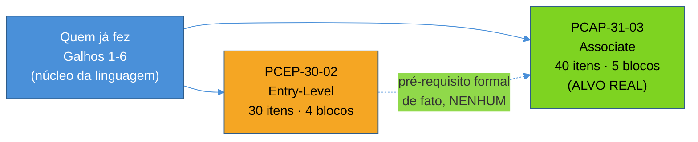

# Panorama — PCEP e PCAP, o que são e pra quem

> [!abstract] TL;DR
> A **Python Institute** (marca da **OpenEDG**, a divisão de certificação da OpenEDG Testing Services) mantém duas certificações de linguagem que interessam a quem já passou pelos Galhos 1-6 desta trilha: **PCEP-30-02** (Certified Entry-Level Python Programmer), entry-level, e **PCAP-31-03** (Certified Associate in Python Programming), o alvo real de quem já programa. Ambas são prova de múltipla escolha com nota de corte de **70% cumulativo**, organizadas em blocos de syllabus com peso próprio — 30 itens/4 blocos no PCEP, 40 itens/5 blocos no PCAP. O tempo de prova não é confirmado nas fontes oficiais; este galho não repete números de terceiros como se fossem fato. Esta nota mapeia as duas certificações, decide qual delas é o alvo, e é honesta sobre um ponto que muita gente prefere não dizer em voz alta: a trilha Python deste vault, sozinha, já ensina mais do que qualquer uma das duas provas cobre.

## Quem é a Python Institute

Antes de comparar os dois exames, vale nomear quem os emite — porque isso muda o que a credencial de fato significa. A **Python Institute** não é a Python Software Foundation (a organização sem fins lucrativos por trás da própria linguagem, guardiã do CPython e da PEP process) — é uma marca de certificação operada pela **OpenEDG** (Open Education and Development Group), uma organização voltada especificamente a credenciais técnicas de programação. A distinção importa: a Python Institute não define a linguagem, ela testa conhecimento *sobre* a linguagem, segundo um syllabus próprio que ela escreve, revisa e, ocasionalmente, aposenta em favor de uma versão nova.

Isso posiciona PCEP e PCAP num lugar específico do mercado de certificações: mais formal e mais barato que treinamentos de vendor como AWS ou Kubernetes (CKAD), mais estruturado e verificável que "sei Python, confia" num currículo. Não é uma credencial que substitui portfólio de código real ou entrevista técnica — é uma prova de conhecimento sintático e semântico da linguagem, sob formato de múltipla escolha, cronometrada.

> [!question]- Por que uma organização de certificação de linguagem de programação não é a própria Python Software Foundation?
> Porque são objetivos diferentes. A PSF existe pra manter a linguagem — especificação, implementação de referência (CPython), processo de propostas de mudança (PEP), infraestrutura da comunidade (PyPI, eventos). Certificar conhecimento individual de terceiros não é o papel dela, nem precisaria ser: a linguagem em si é gratuita e aberta, qualquer um pode aprendê-la sem pagar nada a ninguém. A Python Institute preenche um nicho complementar e comercial — dar a quem aprendeu Python (por conta própria, em curso, ou nesta trilha) uma credencial verificável por terceiros, útil em processos seletivos onde "sei Python" precisa de alguma prova externa. É o mesmo padrão de outras linguagens: a linguagem é um bem comum, a certificação é um produto de mercado em cima dela.

## PCEP vs PCAP: dois níveis, um só objetivo real pra quem chega até aqui

O nome já entrega o nível: PCEP é *Entry-Level*, pensado pra quem está começando — variáveis, tipos primitivos, `if`/`while`/`for`, listas e strings no nível mais básico, funções simples. Nenhum dos 4 blocos do syllabus do PCEP-30-02 exige orientação a objetos, tratamento de exceções avançado ou módulos além do essencial. É a prova certa pra alguém no meio do Galho 1 desta trilha — não pra quem já terminou os Galhos 1-6.

PCAP é *Associate*: pressupõe que a pessoa já programa, não que está aprendendo a programar. O syllabus do PCAP-31-03 inclui módulos e pacotes, hierarquia de exceções, manipulação de strings além do básico, e — o bloco de maior peso do exame inteiro — **orientação a objetos completa** (herança, polimorfismo, encapsulamento, introspecção). É exatamente o território dos Galhos 1 e 3 desta trilha, aplicado sob o ângulo de "o que a prova cobra", não "como a linguagem funciona por dentro".

**Não existe pré-requisito formal** entre as duas — a Python Institute não exige o PCEP pra inscrever no PCAP. Mas o conteúdo é estritamente aninhado: tudo que o PCEP cobra é subconjunto do que o PCAP cobra, com peso menor. Por isso, para quem chega a este galho já tendo passado pelos Galhos 1-6 do núcleo da linguagem — que cobrem tipos, controle de fluxo, coleções, funções, exceções, módulos, OO completa e mais idiomas avançados que nenhum dos dois exames toca — **o PCAP-31-03 é o alvo real**. O PCEP existe nesta nota e na nota 02 como mapa de referência, não como meta a perseguir depois dos Galhos 1-6: alguém que já sabe implementar uma classe com herança múltipla e MRO não ganha nada relevante estudando pro PCEP primeiro.

> [!tip] Se a pergunta é "qual prova eu faço", a resposta pra quem seguiu esta trilha é direta
> PCAP-31-03. O PCEP só faz sentido como alvo isolado pra quem está aprendendo Python do zero, sem ter passado pelo núcleo da linguagem — o público de currículos introdutórios, bootcamps de primeira fase, ou autodidatas nas primeiras semanas. Se os Galhos 1-6 já foram estudados, o PCEP testaria uma fração pequena e mais rasa do que já foi aprendido; o PCAP testa o conjunto todo, no nível de profundidade condizente.

## Formato de prova: os números exatos, sem inflar o que não é oficial

A tabela abaixo usa os dados pesquisados diretamente no syllabus oficial de cada exame (pythoninstitute.org), não estimativas de terceiros.

| | **PCEP-30-02** | **PCAP-31-03** |
|---|---|---|
| Nome completo | Certified Entry-Level Python Programmer | Certified Associate in Python Programming |
| Itens | 30 | 40 |
| Blocos do syllabus | 4 | 5 |
| Nota de corte | 70% cumulativo | 70% cumulativo |
| Formato | Múltipla escolha | Múltipla escolha |
| Status (2026-07-12) | Live & Active | Live & Active |

**Blocos do PCEP-30-02** (30 itens):

1. Computer Programming and Python Fundamentals — 7 itens / 18%
2. Control Flow – Conditional Blocks and Loops — 8 itens / 29%
3. Data Collections – Tuples, Dictionaries, Lists, and Strings — 7 itens / 25%
4. Functions and Exceptions — 8 itens / 28%

**Blocos do PCAP-31-03** (40 itens):

1. Modules and Packages — 6 itens / 12%
2. Exceptions — 5 itens / 14%
3. Strings — 8 itens / 18%
4. Object-Oriented Programming — 12 itens / **34%** (maior peso do exame)
5. Miscellaneous (list comprehensions, lambdas, closures, file I/O) — 9 itens / 22%

O peso de 34% no bloco de Orientação a Objetos do PCAP não é um detalhe menor — é o motivo pelo qual a nota 04 deste galho, dedicada só a esse bloco, é a mais longa da série. Mais de um terço da prova gira em torno de herança, polimorfismo, encapsulamento e introspecção.

> [!warning] Sobre o tempo de prova: as fontes terceirizadas mentem por omissão, não por má-fé
> É comum encontrar em blogs e cursos de terceiros números específicos de duração — "~40-45 minutos" pro PCEP, "~65 minutos + 10 de tutorial" pro PCAP. Esses números não aparecem confirmados no syllabus oficial consultado (pythoninstitute.org) em 2026-07-12, e a Python Institute historicamente ajusta esse tipo de parâmetro sem atualizar todo material de terceiros que já circula. Esta nota evita repetir esses números como se fossem garantidos — o que É garantido, porque está no syllabus oficial, é a contagem de itens, os blocos e seus pesos, e a nota de corte de 70% cumulativo. **Antes de agendar a prova de fato**, confirme o tempo de prova diretamente no portal oficial da Pearson VUE ou da própria Python Institute no momento da inscrição — não em um blog de terceiros, por mais bem posicionado que esteja no Google.

## Pra quem faz sentido — e o que a certificação não é

A pergunta que vale fazer antes de investir tempo estudando pro PCAP: **o que essa credencial resolve que os Galhos 1-6 já estudados não resolvem?**

A resposta honesta tem duas partes. A primeira: PCAP resolve um problema real de **legibilidade externa**. Um recrutador, um sistema de triagem automatizada, ou um cliente de consultoria que não vai ler código nenhum antes da entrevista técnica não tem como avaliar profundidade de conhecimento a partir de "estudei uma trilha de 19 galhos num vault pessoal" — mas consegue verificar "PCAP-31-03, Python Institute" num currículo ou LinkedIn, com um selo reconhecido e um exame padronizado por trás. É prova de conhecimento formal, portátil entre contextos, que não depende de quem está avaliando conhecer o histórico da pessoa.

A segunda parte é onde a honestidade dói um pouco: **o PCAP não chega perto de cobrir o que os Galhos 1-6 desta trilha já ensinaram**. Tipagem moderna com generics e Protocol (Galho 5), internals do CPython — GIL, GC geracional, ceval loop (Galho 6), decorators e generators avançados, context managers via generator (Galho 4) — nada disso está no syllabus do PCAP-31-03. A certificação testa um recorte deliberadamente conservador da linguagem, porque precisa ser aprovável por alguém com experiência de associate — não por alguém que já foi até o fundo dos internals do interpretador. Tratar o PCAP como o teto do aprendizado de Python seria subestimar, e muito, o que já foi construído nos seis primeiros galhos desta trilha.

> [!question]- Então vale a pena estudar pro PCAP depois de já saber mais do que ele cobre?
> Vale, mas por um motivo específico: não é aprendizado novo, é **credencial formal em cima de aprendizado já feito**, mais uma passada de revisão dirigida ao formato de prova — que tem armadilhas próprias (a nota 06 deste galho cobre exatamente isso) diferentes de escrever código em produção. O esforço marginal é baixo porque o conteúdo técnico já foi internalizado nos Galhos 1-6; o que falta é se acostumar com o formato — múltipla escolha, tempo cronometrado, "o que este código imprime" sem poder rodar o interpretador. Esse é o valor real deste galho 19: não reensinar Python, e sim converter conhecimento já sólido em um selo que abre portas em processos seletivos formais.

## O roteiro deste galho

Este galho tem 8 notas, e é o último da trilha inteira:

1. **Esta nota** — panorama de PCEP e PCAP, formato de prova, decisão do alvo (PCAP).
2. **[[02 - PCEP na prática — fundamentos, controle de fluxo e coleções|PCEP na prática: fundamentos, controle de fluxo e coleções]]** — os 4 blocos do PCEP-30-02 mapeados aos Galhos 1-2, como referência rápida (não como próximo passo de estudo pra quem já é PCAP-alvo).
3. **[[03 - PCAP — módulos, exceções e strings|PCAP: módulos, exceções e strings]]** — blocos 1-3 do PCAP-31-03, mapeados aos Galhos 1 e 3.
4. **[[04 - PCAP — orientação a objetos, o bloco de maior peso|PCAP: orientação a objetos, o bloco de maior peso]]** — bloco 4 (34%), mapeado ao Galho 3, nota mais longa do galho.
5. **[[05 - PCAP — miscellaneous, comprehensions, lambdas, closures e arquivos|PCAP: miscellaneous, comprehensions, lambdas, closures e arquivos]]** — bloco 5 (22%), mapeado aos Galhos 2 e 4, mais uma introdução curta a file I/O.
6. **[[06 - Armadilhas comuns e o estilo de questão da Python Institute|Armadilhas comuns e o estilo de questão da Python Institute]]** — o padrão de pegadinha característico da prova.
7. **[[07 - Estratégia de prova e plano de estudo|Estratégia de prova e plano de estudo]]** — recursos oficiais, gestão de tempo, plano de 2-3 semanas.
8. **[[08 - Capstone — simulado comentado PCEP + PCAP|Capstone: simulado comentado PCEP + PCAP]]** — simulado com gabarito comentado, fecha o galho e a trilha Python inteira (19/19).

## Em entrevista

Se a pergunta em entrevista for "você tem alguma certificação de Python", a resposta mais forte não é só citar a sigla — é nomear o que ela representa e o que não representa: "tenho PCAP-31-03 da Python Institute, que cobre módulos, exceções, strings, orientação a objetos completa e idiomas mais avançados como comprehensions e closures, com nota de corte de 70%. Vale como prova formal de conhecimento sólido de linguagem, mas o meu domínio prático vai além do syllabus da prova — inclui tipagem moderna, concorrência, e os internals do CPython". Isso evita dois erros simétricos: tratar a certificação como irrelevante (ela tem valor real de triagem) ou como teto de competência (ela não é).

## How to explain in English

> "The Python Institute — the certification arm of OpenEDG, not the Python Software Foundation — runs two exams that matter here: PCEP-30-02, entry-level, and PCAP-31-03, associate-level. For anyone who already went through this track's core-language modules, PCAP is the real target: it covers modules, exceptions, strings, and — at 34% of the exam, the single heaviest block — full object-oriented programming, with a 70% cumulative passing score across 40 multiple-choice items. I'm deliberately not quoting exam duration numbers here, because the official syllabus doesn't confirm them — third-party blogs do, and I don't repeat unverified numbers as fact. The honest caveat: PCAP is a conservative, associate-level slice of the language. It doesn't touch generics, the GIL, or generator-based context managers — topics this track already covers in depth. The certification is a portable, third-party-verifiable credential on top of knowledge already built, not a ceiling for it."

| PT | EN |
|----|----|
| Certificado | Certified |
| Nota de corte | Passing score |
| Cumulativo | Cumulative |
| Bloco do syllabus | Syllabus block |
| Peso (do bloco) | Weight |
| Múltipla escolha | Multiple choice |
| Item (questão) | Item |
| Prova cronometrada | Timed exam |

## Fontes

- Python Institute. *PCEP-30-02 Exam Syllabus*. pythoninstitute.org. https://pythoninstitute.org/pcep-exam-syllabus (acessado em 2026-07-12) — 30 itens, 4 blocos, nota de corte 70% cumulativo, status Live & Active.
- Python Institute. *PCAP-31-03 Exam Syllabus*. pythoninstitute.org. https://pythoninstitute.org/pcap-exam-syllabus (acessado em 2026-07-12) — 40 itens, 5 blocos, nota de corte 70% cumulativo, status Live & Active.
- [[03-Dominios/Tecnologia/Python/Certificação (PCEP-PCAP)/roadmap|Roadmap deste galho]] — pesquisa consolidada (2026-07-12) que fundamenta os números desta nota.
- [[03-Dominios/Tecnologia/Python/index|Trilha Python]] — MOC central; este é o galho 19/19, último da trilha.

Consultado em 2026-07-12.
